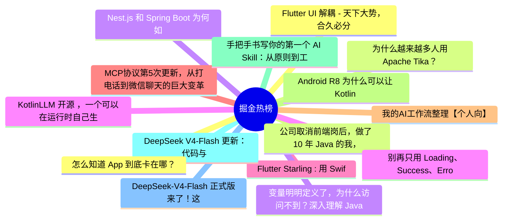

# 掘金热榜 Top 15 (2026-08-02)

## 思维导图

## 列表（15 条）

### 1. Flutter UI 解耦 - 天下大势，合久必分， 分久必合
- **链接**: [https://juejin.cn/post/7667440437864300544](https://juejin.cn/post/7667440437864300544)
- **作者**: 张风捷特烈
- **热度**: 729 | **浏览**: 1184 | **点赞**: 17 | **评论**: 5

### 2. 为什么越来越多人用Apache Tika？
- **链接**: [https://juejin.cn/post/7667853684410302490](https://juejin.cn/post/7667853684410302490)
- **作者**: 苏三说技术
- **热度**: 639 | **浏览**: 957 | **点赞**: 21 | **评论**: 3

### 3. Nest.js 和 Spring Boot 为何如此像？写给前端转 Java 的同学
- **链接**: [https://juejin.cn/post/7667863898348093503](https://juejin.cn/post/7667863898348093503)
- **作者**: 双越AI_club
- **热度**: 531 | **浏览**: 823 | **点赞**: 17 | **评论**: 1

### 4. KotlinLLM 开源 ，一个可以在运行时自己生成永久 Kotlin 代码的 Agent 库
- **链接**: [https://juejin.cn/post/7667863898348126271](https://juejin.cn/post/7667863898348126271)
- **作者**: 恋猫de小郭
- **热度**: 441 | **浏览**: 741 | **点赞**: 11 | **评论**: 1

### 5. Flutter Starling : 用 Swift和 Flutter 写了一个 Linux 桌面系统，震惊我一整年
- **链接**: [https://juejin.cn/post/7668191994554073142](https://juejin.cn/post/7668191994554073142)
- **作者**: 恋猫de小郭
- **热度**: 396 | **浏览**: 597 | **点赞**: 13 | **评论**: 2

### 6. MCP协议第5次更新，从打电话到微信聊天的巨大变革
- **链接**: [https://juejin.cn/post/7668204673984135178](https://juejin.cn/post/7668204673984135178)
- **作者**: 前端之虎陈随易
- **热度**: 387 | **浏览**: 753 | **点赞**: 6 | **评论**: 0

### 7. 我的AI工作流整理【个人向】
- **链接**: [https://juejin.cn/post/7668309258707386378](https://juejin.cn/post/7668309258707386378)
- **作者**: 昭阳
- **热度**: 378 | **浏览**: 523 | **点赞**: 11 | **评论**: 5

### 8. Android R8 为什么可以让 Kotlin 协程提速 2 倍？
- **链接**: [https://juejin.cn/post/7667459437695778870](https://juejin.cn/post/7667459437695778870)
- **作者**: 恋猫de小郭
- **热度**: 315 | **浏览**: 599 | **点赞**: 6 | **评论**: 0

### 9. 手把手书写你的第一个 AI Skill：从原则到工程化
- **链接**: [https://juejin.cn/post/7667440437864448000](https://juejin.cn/post/7667440437864448000)
- **作者**: 莪_幻尘
- **热度**: 252 | **浏览**: 396 | **点赞**: 9 | **评论**: 0

### 10. DeepSeek V4-Flash 更新：代码与 Agent 能力全面增强
- **链接**: [https://juejin.cn/post/7668540866239529010](https://juejin.cn/post/7668540866239529010)
- **作者**: 勇宝趣学前端
- **热度**: 216 | **浏览**: 414 | **点赞**: 4 | **评论**: 0

### 11. DeepSeek-V4-Flash 正式版来了！这次提升有点夸张。
- **链接**: [https://juejin.cn/post/7668634785267695625](https://juejin.cn/post/7668634785267695625)
- **作者**: cxuanAI
- **热度**: 198 | **浏览**: 332 | **点赞**: 6 | **评论**: 0

### 12. 怎么知道 App 到底卡在哪？
- **链接**: [https://juejin.cn/post/7667849988996071458](https://juejin.cn/post/7667849988996071458)
- **作者**: _瑞
- **热度**: 189 | **浏览**: 266 | **点赞**: 8 | **评论**: 0

### 13. 公司取消前端岗后，做了 10 年 Java 的我，第一次认真拥抱 AI
- **链接**: [https://juejin.cn/post/7668341210563870720](https://juejin.cn/post/7668341210563870720)
- **作者**: 天天摸鱼的java工程师
- **热度**: 180 | **浏览**: 372 | **点赞**: 1 | **评论**: 1

### 14. 变量明明定义了，为什么访问不到？深入理解 JavaScript 作用域
- **链接**: [https://juejin.cn/post/7667778542090518537](https://juejin.cn/post/7667778542090518537)
- **作者**: 柚yuzumi
- **热度**: 180 | **浏览**: 169 | **点赞**: 11 | **评论**: 1

### 15. 别再只用 Loading、Success、Error 表示所有页面状态了
- **链接**: [https://juejin.cn/post/7667895598095826970](https://juejin.cn/post/7667895598095826970)
- **作者**: RockByte
- **热度**: 171 | **浏览**: 356 | **点赞**: 0 | **评论**: 2
