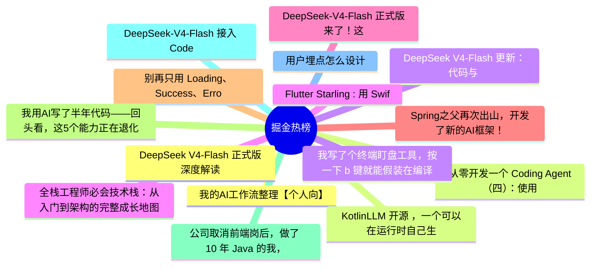

# 掘金热榜 Top 15 (2026-08-03)

## 思维导图

## 列表（15 条）

### 1. 我的AI工作流整理【个人向】
- **链接**: [https://juejin.cn/post/7668309258707386378](https://juejin.cn/post/7668309258707386378)
- **作者**: 昭阳
- **热度**: 693 | **浏览**: 1073 | **点赞**: 18 | **评论**: 7

### 2. KotlinLLM 开源 ，一个可以在运行时自己生成永久 Kotlin 代码的 Agent 库
- **链接**: [https://juejin.cn/post/7667863898348126271](https://juejin.cn/post/7667863898348126271)
- **作者**: 恋猫de小郭
- **热度**: 531 | **浏览**: 889 | **点赞**: 13 | **评论**: 2

### 3. DeepSeek V4-Flash 更新：代码与 Agent 能力全面增强
- **链接**: [https://juejin.cn/post/7668540866239529010](https://juejin.cn/post/7668540866239529010)
- **作者**: 勇宝趣学前端
- **热度**: 495 | **浏览**: 941 | **点赞**: 9 | **评论**: 0

### 4. Flutter Starling : 用 Swift和 Flutter 写了一个 Linux 桌面系统，震惊我一整年
- **链接**: [https://juejin.cn/post/7668191994554073142](https://juejin.cn/post/7668191994554073142)
- **作者**: 恋猫de小郭
- **热度**: 486 | **浏览**: 742 | **点赞**: 16 | **评论**: 2

### 5. DeepSeek-V4-Flash 正式版来了！这次提升有点夸张。
- **链接**: [https://juejin.cn/post/7668634785267695625](https://juejin.cn/post/7668634785267695625)
- **作者**: cxuanAI
- **热度**: 405 | **浏览**: 705 | **点赞**: 10 | **评论**: 0

### 6. Spring之父再次出山，开发了新的AI框架！
- **链接**: [https://juejin.cn/post/7668305038255521838](https://juejin.cn/post/7668305038255521838)
- **作者**: 苏三说技术
- **热度**: 360 | **浏览**: 656 | **点赞**: 8 | **评论**: 0

### 7. 别再只用 Loading、Success、Error 表示所有页面状态了
- **链接**: [https://juejin.cn/post/7667895598095826970](https://juejin.cn/post/7667895598095826970)
- **作者**: RockByte
- **热度**: 279 | **浏览**: 521 | **点赞**: 4 | **评论**: 2

### 8. 我用AI写了半年代码——回头看，这5个能力正在退化
- **链接**: [https://juejin.cn/post/7668535450420019236](https://juejin.cn/post/7668535450420019236)
- **作者**: kyriewen
- **热度**: 243 | **浏览**: 439 | **点赞**: 4 | **评论**: 2

### 9. 公司取消前端岗后，做了 10 年 Java 的我，第一次认真拥抱 AI
- **链接**: [https://juejin.cn/post/7668341210563870720](https://juejin.cn/post/7668341210563870720)
- **作者**: 天天摸鱼的java工程师
- **热度**: 234 | **浏览**: 505 | **点赞**: 1 | **评论**: 1

### 10. DeepSeek-V4-Flash 接入 Codex（Windows 版）
- **链接**: [https://juejin.cn/post/7668490153107783732](https://juejin.cn/post/7668490153107783732)
- **作者**: iMountTai
- **热度**: 198 | **浏览**: 443 | **点赞**: 0 | **评论**: 1

### 11. 用户埋点怎么设计
- **链接**: [https://juejin.cn/post/7667863898349289535](https://juejin.cn/post/7667863898349289535)
- **作者**: Harries
- **热度**: 198 | **浏览**: 326 | **点赞**: 6 | **评论**: 0

### 12. DeepSeek V4-Flash 正式版深度解读：一行 changelog 里的暗涌与野心
- **链接**: [https://juejin.cn/post/7668608790367682595](https://juejin.cn/post/7668608790367682595)
- **作者**: 土豆1250
- **热度**: 198 | **浏览**: 368 | **点赞**: 4 | **评论**: 0

### 13. 从零开发一个 Coding Agent（四）：使用状态机校验大模型事件流
- **链接**: [https://juejin.cn/post/7668204673984675850](https://juejin.cn/post/7668204673984675850)
- **作者**: 东方小月
- **热度**: 189 | **浏览**: 377 | **点赞**: 3 | **评论**: 0

### 14. 我写了个终端盯盘工具，按一下 b 键就能假装在编译代码
- **链接**: [https://juejin.cn/post/7668213306277937187](https://juejin.cn/post/7668213306277937187)
- **作者**: 寒蝉128
- **热度**: 180 | **浏览**: 312 | **点赞**: 2 | **评论**: 3

### 15. 全栈工程师必会技术栈：从入门到架构的完整成长地图 🗺️
- **链接**: [https://juejin.cn/post/7668532403132301362](https://juejin.cn/post/7668532403132301362)
- **作者**: 前端小小栈
- **热度**: 171 | **浏览**: 273 | **点赞**: 4 | **评论**: 2
