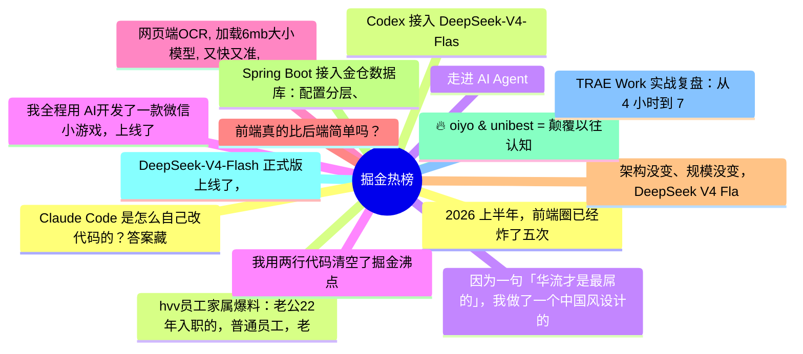

# 掘金热榜 Top 15 (2026-08-05)

## 思维导图

## 列表（15 条）

### 1. 2026 上半年，前端圈已经炸了五次
- **链接**: [https://juejin.cn/post/7669622241974632490](https://juejin.cn/post/7669622241974632490)
- **作者**: 涛涛ing
- **热度**: 2088 | **浏览**: 3647 | **点赞**: 37 | **评论**: 13

### 2. hvv员工家属爆料：老公22年入职的，普通员工，老是被误以为高薪多奖金，实际上还没配股，暂时钱没存多少，我倒是很心疼他工作辛苦。
- **链接**: [https://juejin.cn/post/7669710672626089994](https://juejin.cn/post/7669710672626089994)
- **作者**: CodeSheep
- **热度**: 963 | **浏览**: 1876 | **点赞**: 12 | **评论**: 2

### 3. 走进 AI Agent
- **链接**: [https://juejin.cn/post/7670003108343513122](https://juejin.cn/post/7670003108343513122)
- **作者**: 老王以为
- **热度**: 909 | **浏览**: 1910 | **点赞**: 6 | **评论**: 0

### 4. 我全程用 AI开发了一款微信小游戏，上线了
- **链接**: [https://juejin.cn/post/7669058712007147539](https://juejin.cn/post/7669058712007147539)
- **作者**: 程序员码歌
- **热度**: 801 | **浏览**: 1124 | **点赞**: 14 | **评论**: 21

### 5. 网页端OCR, 加载6mb大小模型, 又快又准, 百度这次真香
- **链接**: [https://juejin.cn/post/7669068704309329960](https://juejin.cn/post/7669068704309329960)
- **作者**: 半刻纬度
- **热度**: 666 | **浏览**: 998 | **点赞**: 25 | **评论**: 0

### 6. 前端真的比后端简单吗？
- **链接**: [https://juejin.cn/post/7669696162708504630](https://juejin.cn/post/7669696162708504630)
- **作者**: ErpanOmer
- **热度**: 513 | **浏览**: 801 | **点赞**: 6 | **评论**: 14

### 7. 架构没变、规模没变，DeepSeek V4 Flash 正式版凭什么暴涨 47 分？
- **链接**: [https://juejin.cn/post/7668933720747638834](https://juejin.cn/post/7668933720747638834)
- **作者**: 小帅不太帅
- **热度**: 468 | **浏览**: 981 | **点赞**: 3 | **评论**: 0

### 8. Spring Boot 接入金仓数据库：配置分层、启动自检与常见错误
- **链接**: [https://juejin.cn/post/7669601359986262025](https://juejin.cn/post/7669601359986262025)
- **作者**: 倔强的石头_
- **热度**: 423 | **浏览**: 920 | **点赞**: 1 | **评论**: 0

### 9. 🔥 oiyo & unibest = 颠覆以往认知的 uniapp 模板
- **链接**: [https://juejin.cn/post/7669335296040730650](https://juejin.cn/post/7669335296040730650)
- **作者**: skiyee
- **热度**: 396 | **浏览**: 566 | **点赞**: 12 | **评论**: 4

### 10. DeepSeek-V4-Flash 正式版上线了，但这 3 个坑我帮你提前踩了
- **链接**: [https://juejin.cn/post/7669024144831168518](https://juejin.cn/post/7669024144831168518)
- **作者**: 万少
- **热度**: 396 | **浏览**: 847 | **点赞**: 2 | **评论**: 0

### 11. TRAE Work 实战复盘：从 4 小时到 7 分钟，提效近 40 倍
- **链接**: [https://juejin.cn/post/7669126369356398592](https://juejin.cn/post/7669126369356398592)
- **作者**: 前端梦工厂
- **热度**: 342 | **浏览**: 633 | **点赞**: 2 | **评论**: 5

### 12. Claude Code 是怎么自己改代码的？答案藏在这 4 个工具里
- **链接**: [https://juejin.cn/post/7669335296040894490](https://juejin.cn/post/7669335296040894490)
- **作者**: 不一样的少年_
- **热度**: 297 | **浏览**: 507 | **点赞**: 8 | **评论**: 0

### 13. Codex 接入 DeepSeek-V4-Flash，丝滑的一批
- **链接**: [https://juejin.cn/post/7669635386160201768](https://juejin.cn/post/7669635386160201768)
- **作者**: cxuanAI
- **热度**: 288 | **浏览**: 511 | **点赞**: 7 | **评论**: 0

### 14. 因为一句「华流才是最屌的」，我做了一个中国风设计的 Skill
- **链接**: [https://juejin.cn/post/7669257737559064619](https://juejin.cn/post/7669257737559064619)
- **作者**: 雨夜寻晴天
- **热度**: 234 | **浏览**: 342 | **点赞**: 9 | **评论**: 0

### 15. 我用两行代码清空了掘金沸点
- **链接**: [https://juejin.cn/post/7434115630721204261](https://juejin.cn/post/7434115630721204261)
- **作者**: hauk0101
- **热度**: 234 | **浏览**: 452 | **点赞**: 2 | **评论**: 2
