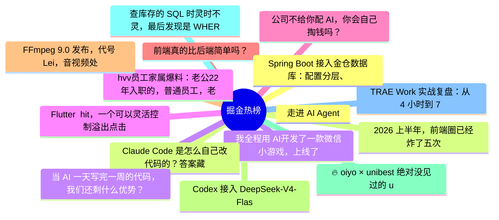

# 掘金热榜 Top 15 (2026-08-06)

## 思维导图

## 列表（15 条）

### 1. 走进 AI Agent
- **链接**: [https://juejin.cn/post/7670003108343513122](https://juejin.cn/post/7670003108343513122)
- **作者**: 老王以为
- **热度**: 3672 | **浏览**: 7716 | **点赞**: 22 | **评论**: 1

### 2. 2026 上半年，前端圈已经炸了五次
- **链接**: [https://juejin.cn/post/7669622241974632490](https://juejin.cn/post/7669622241974632490)
- **作者**: 涛涛ing
- **热度**: 3240 | **浏览**: 5822 | **点赞**: 52 | **评论**: 17

### 3. 我全程用 AI开发了一款微信小游戏，上线了
- **链接**: [https://juejin.cn/post/7669058712007147539](https://juejin.cn/post/7669058712007147539)
- **作者**: 程序员码歌
- **热度**: 1404 | **浏览**: 1802 | **点赞**: 21 | **评论**: 45

### 4. hvv员工家属爆料：老公22年入职的，普通员工，老是被误以为高薪多奖金，实际上还没配股，暂时钱没存多少，我倒是很心疼他工作辛苦。
- **链接**: [https://juejin.cn/post/7669710672626089994](https://juejin.cn/post/7669710672626089994)
- **作者**: CodeSheep
- **热度**: 1359 | **浏览**: 2665 | **点赞**: 14 | **评论**: 4

### 5. 公司不给你配 AI，你会自己掏钱吗？
- **链接**: [https://juejin.cn/post/7670011027535921202](https://juejin.cn/post/7670011027535921202)
- **作者**: 狂师
- **热度**: 1359 | **浏览**: 2446 | **点赞**: 17 | **评论**: 12

### 6. 前端真的比后端简单吗？
- **链接**: [https://juejin.cn/post/7669696162708504630](https://juejin.cn/post/7669696162708504630)
- **作者**: ErpanOmer
- **热度**: 873 | **浏览**: 1338 | **点赞**: 9 | **评论**: 22

### 7. FFmpeg 9.0 发布，代号 Lei，音视频处理再升级
- **链接**: [https://juejin.cn/post/7670139135173132322](https://juejin.cn/post/7670139135173132322)
- **作者**: 前端之虎陈随易
- **热度**: 639 | **浏览**: 1100 | **点赞**: 14 | **评论**: 3

### 8. Codex 接入 DeepSeek-V4-Flash，丝滑的一批
- **链接**: [https://juejin.cn/post/7669635386160201768](https://juejin.cn/post/7669635386160201768)
- **作者**: cxuanAI
- **热度**: 612 | **浏览**: 1161 | **点赞**: 8 | **评论**: 2

### 9. 🔥 oiyo × unibest 绝对没见过的 uniapp 模板
- **链接**: [https://juejin.cn/post/7669335296040730650](https://juejin.cn/post/7669335296040730650)
- **作者**: skiyee
- **热度**: 531 | **浏览**: 803 | **点赞**: 15 | **评论**: 4

### 10. 查库存的 SQL 时灵时不灵，最后发现是 WHERE 里两个函数在打架
- **链接**: [https://juejin.cn/post/7669613981370318874](https://juejin.cn/post/7669613981370318874)
- **作者**: 一只牛博
- **热度**: 504 | **浏览**: 1123 | **点赞**: 0 | **评论**: 0

### 11. TRAE Work 实战复盘：从 4 小时到 7 分钟，提效近 40 倍
- **链接**: [https://juejin.cn/post/7669126369356398592](https://juejin.cn/post/7669126369356398592)
- **作者**: 前端梦工厂
- **热度**: 486 | **浏览**: 935 | **点赞**: 3 | **评论**: 5

### 12. Spring Boot 接入金仓数据库：配置分层、启动自检与常见错误
- **链接**: [https://juejin.cn/post/7669601359986262025](https://juejin.cn/post/7669601359986262025)
- **作者**: 倔强的石头_
- **热度**: 468 | **浏览**: 1031 | **点赞**: 1 | **评论**: 0

### 13. Claude Code 是怎么自己改代码的？答案藏在这 4 个工具里
- **链接**: [https://juejin.cn/post/7669335296040894490](https://juejin.cn/post/7669335296040894490)
- **作者**: 不一样的少年_
- **热度**: 387 | **浏览**: 707 | **点赞**: 8 | **评论**: 0

### 14. 当 AI 一天写完一周的代码，我们还剩什么优势？
- **链接**: [https://juejin.cn/post/7670092136001060907](https://juejin.cn/post/7670092136001060907)
- **作者**: ErpanOmer
- **热度**: 369 | **浏览**: 583 | **点赞**: 4 | **评论**: 8

### 15. Flutter  hit，一个可以灵活控制溢出点击的第三方包
- **链接**: [https://juejin.cn/post/7670078525111861254](https://juejin.cn/post/7670078525111861254)
- **作者**: 恋猫de小郭
- **热度**: 297 | **浏览**: 368 | **点赞**: 10 | **评论**: 5
