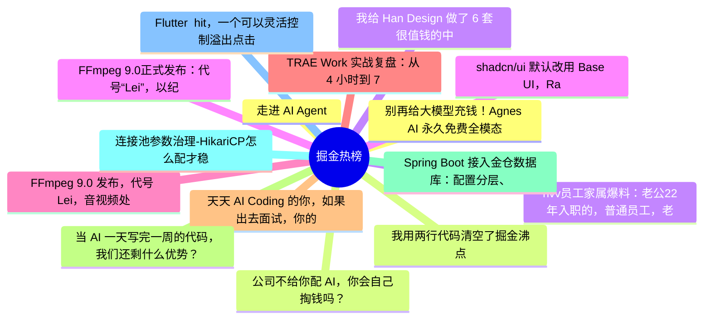

# 掘金热榜 Top 15 (2026-08-07)

## 思维导图

## 列表（15 条）

### 1. 走进 AI Agent
- **链接**: [https://juejin.cn/post/7670003108343513122](https://juejin.cn/post/7670003108343513122)
- **作者**: 老王以为
- **热度**: 4455 | **浏览**: 9144 | **点赞**: 37 | **评论**: 2

### 2. 公司不给你配 AI，你会自己掏钱吗？
- **链接**: [https://juejin.cn/post/7670011027535921202](https://juejin.cn/post/7670011027535921202)
- **作者**: 狂师
- **热度**: 2133 | **浏览**: 3936 | **点赞**: 22 | **评论**: 19

### 3. hvv员工家属爆料：老公22年入职的，普通员工，老是被误以为高薪多奖金，实际上还没配股，暂时钱没存多少，我倒是很心疼他工作辛苦。
- **链接**: [https://juejin.cn/post/7669710672626089994](https://juejin.cn/post/7669710672626089994)
- **作者**: CodeSheep
- **热度**: 1566 | **浏览**: 3122 | **点赞**: 15 | **评论**: 4

### 4. FFmpeg 9.0正式发布：代号“Lei”，以纪念中国开发者雷霄骅
- **链接**: [https://juejin.cn/post/7670447828808007718](https://juejin.cn/post/7670447828808007718)
- **作者**: CodeSheep
- **热度**: 1026 | **浏览**: 1755 | **点赞**: 24 | **评论**: 3

### 5. FFmpeg 9.0 发布，代号 Lei，音视频处理再升级
- **链接**: [https://juejin.cn/post/7670139135173132322](https://juejin.cn/post/7670139135173132322)
- **作者**: 前端之虎陈随易
- **热度**: 792 | **浏览**: 1389 | **点赞**: 15 | **评论**: 4

### 6. TRAE Work 实战复盘：从 4 小时到 7 分钟，提效近 40 倍
- **链接**: [https://juejin.cn/post/7669126369356398592](https://juejin.cn/post/7669126369356398592)
- **作者**: 前端梦工厂
- **热度**: 648 | **浏览**: 1228 | **点赞**: 6 | **评论**: 5

### 7. 天天 AI Coding 的你，如果出去面试，你的竞争力是什么？
- **链接**: [https://juejin.cn/post/7670094721701445672](https://juejin.cn/post/7670094721701445672)
- **作者**: Coffeeee
- **热度**: 540 | **浏览**: 973 | **点赞**: 8 | **评论**: 4

### 8. 当 AI 一天写完一周的代码，我们还剩什么优势？
- **链接**: [https://juejin.cn/post/7670092136001060907](https://juejin.cn/post/7670092136001060907)
- **作者**: ErpanOmer
- **热度**: 531 | **浏览**: 937 | **点赞**: 5 | **评论**: 8

### 9. Spring Boot 接入金仓数据库：配置分层、启动自检与常见错误
- **链接**: [https://juejin.cn/post/7669601359986262025](https://juejin.cn/post/7669601359986262025)
- **作者**: 倔强的石头_
- **热度**: 522 | **浏览**: 1120 | **点赞**: 2 | **评论**: 0

### 10. 连接池参数治理-HikariCP怎么配才稳
- **链接**: [https://juejin.cn/post/7670453050885472266](https://juejin.cn/post/7670453050885472266)
- **作者**: 倔强的石头_
- **热度**: 495 | **浏览**: 1076 | **点赞**: 2 | **评论**: 0

### 11. Flutter  hit，一个可以灵活控制溢出点击的第三方包
- **链接**: [https://juejin.cn/post/7670078525111861254](https://juejin.cn/post/7670078525111861254)
- **作者**: 恋猫de小郭
- **热度**: 441 | **浏览**: 568 | **点赞**: 14 | **评论**: 7

### 12. 别再给大模型充钱！Agnes AI 永久免费全模态 API，代码 / 绘图 /短剧Token不限量调用
- **链接**: [https://juejin.cn/post/7669727120153198627](https://juejin.cn/post/7669727120153198627)
- **作者**: 极客小俊
- **热度**: 423 | **浏览**: 746 | **点赞**: 2 | **评论**: 8

### 13. 我用两行代码清空了掘金沸点
- **链接**: [https://juejin.cn/post/7434115630721204261](https://juejin.cn/post/7434115630721204261)
- **作者**: hauk0101
- **热度**: 369 | **浏览**: 658 | **点赞**: 3 | **评论**: 6

### 14. 我给 Han Design 做了 6 套很值钱的中国风配色主题
- **链接**: [https://juejin.cn/post/7669829970764857407](https://juejin.cn/post/7669829970764857407)
- **作者**: 雨夜寻晴天
- **热度**: 342 | **浏览**: 542 | **点赞**: 7 | **评论**: 4

### 15. shadcn/ui 默认改用 Base UI，Radix 被放弃了吗？
- **链接**: [https://juejin.cn/post/7670135131277213696](https://juejin.cn/post/7670135131277213696)
- **作者**: 不辞远_Web3
- **热度**: 315 | **浏览**: 636 | **点赞**: 4 | **评论**: 0
