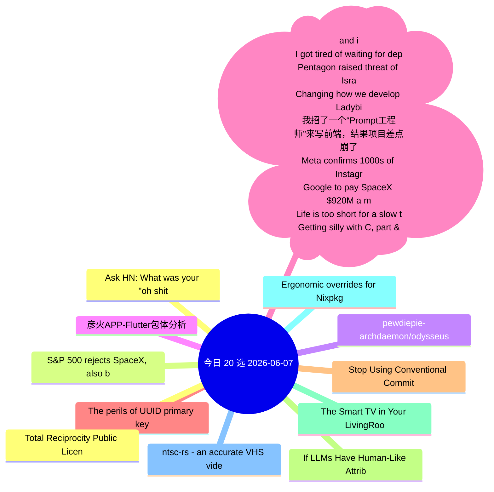

# 每日精选 20 条 (2026-06-07)

> 自动从 7 个数据源综合评分选出。每条都有原文链接 + 所属源。

## 思维导图

## 精选（20 条）

### 1. Ask HN: What was your "oh shit" moment with GenAI?
- **源**: HN | **归一化分**: 1.00
- **链接**: [https://news.ycombinator.com/item?id=48406174](https://news.ycombinator.com/item?id=48406174)
- **HN**: 572 分 / 963 评论

### 2. S&P 500 rejects SpaceX, also blocking entry for OpenAI and Anthropic
- **源**: HN-Best | **归一化分**: 1.00
- **链接**: [https://arstechnica.com/tech-policy/2026/06/sp-500-blocks-fast-spacex-entry-wont-waive-rule-for-unprofitable-ai-firms/](https://arstechnica.com/tech-policy/2026/06/sp-500-blocks-fast-spacex-entry-wont-waive-rule-for-unprofitable-ai-firms/)
- **HN**: 1389 分 / 480 评论

### 3. pewdiepie-archdaemon/odysseus
- **源**: GitHub | **归一化分**: 1.00
- **链接**: [https://github.com/pewdiepie-archdaemon/odysseus](https://github.com/pewdiepie-archdaemon/odysseus)
- **Star**: 59344 / Python
- **简介**: Self-hosted AI workspace. 

### 4. 彦火APP-Flutter包体分析
- **源**: 掘金 | **归一化分**: 1.00
- **链接**: [https://juejin.cn/post/7646674707382927375](https://juejin.cn/post/7646674707382927375)
- **热度**: 1314 / 我是小胡胡

### 5. peektea brews on WSL 👀🍵 (and installs in one line)
- **源**: dev.to | **归一化分**: 1.00
- **链接**: [https://dev.to/lovestaco/peektea-brews-on-wsl-and-installs-in-one-line-34ef](https://dev.to/lovestaco/peektea-brews-on-wsl-and-installs-in-one-line-34ef)
- **反应**: 15 / Athreya aka Maneshwar
- **简介**: Hello, I'm Maneshwar. I'm building git-lrc, a Micro AI code reviewer that runs on every commit. It is...

### 6. I got tired of waiting for deploys, so I built a local Lambda runner
- **源**: dev.to | **归一化分**: 0.70
- **链接**: [https://dev.to/math-krish/i-got-tired-of-waiting-for-deploys-so-i-built-a-local-lambda-runner-4ghk](https://dev.to/math-krish/i-got-tired-of-waiting-for-deploys-so-i-built-a-local-lambda-runner-4ghk)
- **反应**: 10 / math
- **简介**: There's a specific kind of frustration that comes from iterating on Lambda code. You change one line....

### 7. Pentagon raised threat of Israeli spying on U.S. to highest level, sources say
- **源**: HN | **归一化分**: 0.63
- **链接**: [https://www.nbcnews.com/politics/national-security/pentagon-raised-threat-israeli-spying-us-highest-level-sources-say-rcna348565](https://www.nbcnews.com/politics/national-security/pentagon-raised-threat-israeli-spying-us-highest-level-sources-say-rcna348565)
- **HN**: 468 分 / 354 评论

### 8. Changing how we develop Ladybird
- **源**: HN-Best | **归一化分**: 0.59
- **链接**: [https://ladybird.org/posts/changing-how-we-develop-ladybird/](https://ladybird.org/posts/changing-how-we-develop-ladybird/)
- **HN**: 870 分 / 545 评论

### 9. 我招了一个“Prompt工程师”来写前端，结果项目差点崩了
- **源**: 掘金 | **归一化分**: 0.57
- **链接**: [https://juejin.cn/post/7647355871891587087](https://juejin.cn/post/7647355871891587087)
- **热度**: 828 / kyriewen

### 10. Meta confirms 1000s of Instagram accounts were hacked by abusing its AI chatbot
- **源**: HN | **归一化分**: 0.55
- **链接**: [https://this.weekinsecurity.com/meta-confirms-thousands-of-instagram-accounts-were-hacked-by-abusing-its-ai-chatbot/](https://this.weekinsecurity.com/meta-confirms-thousands-of-instagram-accounts-were-hacked-by-abusing-its-ai-chatbot/)
- **HN**: 477 分 / 169 评论

### 11. Google to pay SpaceX $920M a month for compute capacity at xAI data centers
- **源**: HN | **归一化分**: 0.50
- **链接**: [https://www.cnbc.com/2026/06/05/google-to-pay-spacex-920-million-a-month-for-xai-compute-capacity.html](https://www.cnbc.com/2026/06/05/google-to-pay-spacex-920-million-a-month-for-xai-compute-capacity.html)
- **HN**: 177 分 / 755 评论

### 12. Life is too short for a slow terminal
- **源**: Lobsters | **归一化分**: 0.50
- **链接**: [https://mijndertstuij.nl/posts/life-is-too-short-for-a-slow-terminal/](https://mijndertstuij.nl/posts/life-is-too-short-for-a-slow-terminal/)
- **作者**: 
- **简介**: 
<a href="https://lobste.rs/s/k0sbbv/life_is_too_short_for_slow_terminal">Comments</a>

### 13. Getting silly with C, part &((int*)-8)[3]
- **源**: Lobsters | **归一化分**: 0.50
- **链接**: [https://lcamtuf.substack.com/p/getting-silly-with-c-part-and-int1](https://lcamtuf.substack.com/p/getting-silly-with-c-part-and-int1)
- **作者**: 
- **简介**: 
<a href="https://lobste.rs/s/iqazo4/getting_silly_with_c_part_int_8_3">Comments</a>

### 14. The perils of UUID primary keys in SQLite
- **源**: Lobsters | **归一化分**: 0.50
- **链接**: [https://andersmurphy.com/2026/06/05/the-perils-of-uuid-primary-keys-in-sqlite.html](https://andersmurphy.com/2026/06/05/the-perils-of-uuid-primary-keys-in-sqlite.html)
- **作者**: 
- **简介**: 
<a href="https://lobste.rs/s/76plqm/perils_uuid_primary_keys_sqlite">Comments</a>

### 15. Stop Using Conventional Commits
- **源**: Lobsters | **归一化分**: 0.50
- **链接**: [https://sumnerevans.com/posts/software-engineering/stop-using-conventional-commits/](https://sumnerevans.com/posts/software-engineering/stop-using-conventional-commits/)
- **作者**: 
- **简介**: 
<a href="https://lobste.rs/s/oqlpna/stop_using_conventional_commits">Comments</a>

### 16. If LLMs Have Human-Like Attributes, Then So Does Age of Empires II
- **源**: Lobsters | **归一化分**: 0.50
- **链接**: [https://arxiv.org/pdf/2605.31514](https://arxiv.org/pdf/2605.31514)
- **作者**: 
- **简介**: 
<a href="https://lobste.rs/s/owclks/if_llms_have_human_like_attributes_then_so">Comments</a>

### 17. The Smart TV in Your LivingRoom Is a Node in the AIScraping Economy
- **源**: Lobsters | **归一化分**: 0.50
- **链接**: [https://blog.includesecurity.com/2026/06/the-smart-tv-in-your-livingroom-is-a-node-in-the-aiscraping-economy/](https://blog.includesecurity.com/2026/06/the-smart-tv-in-your-livingroom-is-a-node-in-the-aiscraping-economy/)
- **作者**: 
- **简介**: 
<a href="https://lobste.rs/s/k67xnh/smart_tv_your_livingroom_is_node">Comments</a>

### 18. Ergonomic overrides for Nixpkgs
- **源**: Lobsters | **归一化分**: 0.50
- **链接**: [https://haskellforall.com/2026/06/ergonomic-overrides-for-nixpkgs](https://haskellforall.com/2026/06/ergonomic-overrides-for-nixpkgs)
- **作者**: 
- **简介**: 
<a href="https://lobste.rs/s/yfj5qc/ergonomic_overrides_for_nixpkgs">Comments</a>

### 19. ntsc-rs - an accurate VHS video effect
- **源**: Lobsters | **归一化分**: 0.50
- **链接**: [https://ntsc.rs/](https://ntsc.rs/)
- **作者**: 
- **简介**: 
<a href="https://lobste.rs/s/1nojpo/ntsc_rs_accurate_vhs_video_effect">Comments</a>

### 20. Total Reciprocity Public License
- **源**: Lobsters | **归一化分**: 0.50
- **链接**: [https://trplfoundation.org/](https://trplfoundation.org/)
- **作者**: 
- **简介**: 
<a href="https://lobste.rs/s/oazsak/total_reciprocity_public_license">Comments</a>

