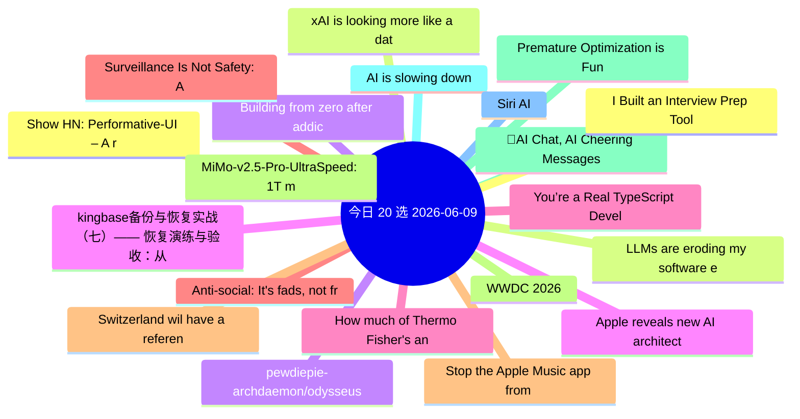

# 每日精选 20 条 (2026-06-09)

> 自动从 7 个数据源综合评分选出。每条都有原文链接 + 所属源。

## 思维导图

## 精选（20 条）

### 1. Show HN: Performative-UI – A react component library of design tropes
- **源**: HN | **归一化分**: 1.00
- **链接**: [https://vorpus.github.io/performativeUI/](https://vorpus.github.io/performativeUI/)
- **HN**: 759 分 / 154 评论

### 2. LLMs are eroding my software engineering career and I don't know what to do
- **源**: HN-Best | **归一化分**: 1.00
- **链接**: [https://human-in-the-loop.bearblog.dev/llms-are-eroding-my-software-engineering-career-and-i-dont-know-what-to-do/](https://human-in-the-loop.bearblog.dev/llms-are-eroding-my-software-engineering-career-and-i-dont-know-what-to-do/)
- **HN**: 1104 分 / 1049 评论

### 3. pewdiepie-archdaemon/odysseus
- **源**: GitHub | **归一化分**: 1.00
- **链接**: [https://github.com/pewdiepie-archdaemon/odysseus](https://github.com/pewdiepie-archdaemon/odysseus)
- **Star**: 63857 / Python
- **简介**: Self-hosted AI workspace. 

### 4. kingbase备份与恢复实战（七）—— 恢复演练与验收：从“能恢复”到“可交付预案”
- **源**: 掘金 | **归一化分**: 1.00
- **链接**: [https://juejin.cn/post/7648121330443812864](https://juejin.cn/post/7648121330443812864)
- **热度**: 1854 / 倔强的石头_

### 5. You’re a Real TypeScript Developer Only If...
- **源**: dev.to | **归一化分**: 1.00
- **链接**: [https://dev.to/hadil/youre-a-real-typescript-developer-only-if-1d9o](https://dev.to/hadil/youre-a-real-typescript-developer-only-if-1d9o)
- **反应**: 57 / Hadil Ben Abdallah
- **简介**: A few months ago, I published You're a Real JavaScript Developer Only If...  It was just a post for...

### 6. Anti-social: It's fads, not friends, which now dominate social media feeds
- **源**: HN | **归一化分**: 0.87
- **链接**: [https://www.bbc.com/worklife/article/20260520-how-social-media-ceased-to-be-social](https://www.bbc.com/worklife/article/20260520-how-social-media-ceased-to-be-social)
- **HN**: 542 分 / 405 评论

### 7. Stop the Apple Music app from launching
- **源**: HN | **归一化分**: 0.81
- **链接**: [https://lowtechguys.com/musicdecoy/](https://lowtechguys.com/musicdecoy/)
- **HN**: 568 分 / 231 评论

### 8. MiMo-v2.5-Pro-UltraSpeed: 1T model with 1000 tokens per second
- **源**: HN | **归一化分**: 0.76
- **链接**: [https://mimo.xiaomi.com/blog/mimo-tilert-1000tps](https://mimo.xiaomi.com/blog/mimo-tilert-1000tps)
- **HN**: 489 分 / 335 评论

### 9. 🎥AI Chat, AI Cheering Messages, and Animation Editor Hyper (AI Avatar v10: VS Code and Chrome Extension)
- **源**: dev.to | **归一化分**: 0.69
- **链接**: [https://dev.to/webdeveloperhyper/ai-chat-ai-cheering-messages-and-animation-editor-hyper-ai-avatar-v10-vs-code-and-chrome-1noo](https://dev.to/webdeveloperhyper/ai-chat-ai-cheering-messages-and-animation-editor-hyper-ai-avatar-v10-vs-code-and-chrome-1noo)
- **反应**: 44 / Web Developer Hyper
- **简介**: Intro   AI Avatar is a completely free app that lets your VRoid (VRM) 3D avatar animate in...

### 10. AI is slowing down
- **源**: HN | **归一化分**: 0.66
- **链接**: [https://www.wheresyoured.at/ai-is-slowing-down/](https://www.wheresyoured.at/ai-is-slowing-down/)
- **HN**: 376 分 / 397 评论

### 11. Siri AI
- **源**: HN | **归一化分**: 0.64
- **链接**: [https://www.apple.com/apple-intelligence/](https://www.apple.com/apple-intelligence/)
- **HN**: 388 分 / 333 评论

### 12. I Built an Interview Prep Tool Instead of Grinding LeetCode
- **源**: dev.to | **归一化分**: 0.63
- **链接**: [https://dev.to/javz/i-built-an-interview-prep-tool-instead-of-grinding-leetcode-35a0](https://dev.to/javz/i-built-an-interview-prep-tool-instead-of-grinding-leetcode-35a0)
- **反应**: 40 / Julien Avezou
- **简介**: I am currently preparing for Software Engineer interviews.  Like many developers, my first instinct...

### 13. xAI is looking more like a datacentre REIT than a frontier lab
- **源**: HN | **归一化分**: 0.62
- **链接**: [https://martinalderson.com/posts/xais-new-rental-business/](https://martinalderson.com/posts/xais-new-rental-business/)
- **HN**: 387 分 / 306 评论

### 14. Building from zero after addiction, prison, and a felony
- **源**: HN-Best | **归一化分**: 0.55
- **链接**: [https://gavinray97.github.io/blog/building-from-zero-after-addiction-prison-felony](https://gavinray97.github.io/blog/building-from-zero-after-addiction-prison-felony)
- **HN**: 880 分 / 398 评论

### 15. Apple reveals new AI architecture built around Google Gemini models
- **源**: HN | **归一化分**: 0.54
- **链接**: [https://www.macrumors.com/2026/06/08/apple-reveals-new-ai-architecture/](https://www.macrumors.com/2026/06/08/apple-reveals-new-ai-architecture/)
- **HN**: 319 分 / 309 评论

### 16. How much of Thermo Fisher's antibody data has been manipulated?
- **源**: HN | **归一化分**: 0.54
- **链接**: [https://reeserichardson.blog/2026/05/28/how-much-of-thermo-fishers-antibody-data-has-been-manipulated/](https://reeserichardson.blog/2026/05/28/how-much-of-thermo-fishers-antibody-data-has-been-manipulated/)
- **HN**: 408 分 / 88 评论

### 17. Surveillance Is Not Safety: A statement on the UK's latest threat to privacy [pdf]
- **源**: HN | **归一化分**: 0.53
- **链接**: [https://signal.org/blog/pdfs/2026-06-08-uk-surveillance-is-not-safety.pdf](https://signal.org/blog/pdfs/2026-06-08-uk-surveillance-is-not-safety.pdf)
- **HN**: 389 分 / 127 评论

### 18. Switzerland wil have a referendum to cap population at 10M
- **源**: HN | **归一化分**: 0.52
- **链接**: [https://www.admin.ch/en/sustainability-initiative](https://www.admin.ch/en/sustainability-initiative)
- **HN**: 233 分 / 472 评论

### 19. WWDC 2026
- **源**: Lobsters | **归一化分**: 0.50
- **链接**: [https://www.apple.com/apple-events/event-stream/](https://www.apple.com/apple-events/event-stream/)
- **作者**: 
- **简介**: 
You'd think I'd forget dubdub? (Title isn't WWDC because the site thinks I'M SCREAMING IN ALL CAPS.)

<a href="https://lobste.rs/s/awlukh/wwd

### 20. Premature Optimization is Fun Sometimes (2025)
- **源**: Lobsters | **归一化分**: 0.50
- **链接**: [https://invlpg.com/posts/2025-06-19-premature-optimization.html](https://invlpg.com/posts/2025-06-19-premature-optimization.html)
- **作者**: 
- **简介**: 
<a href="https://lobste.rs/s/109l2t/premature_optimization_is_fun_sometimes">Comments</a>

