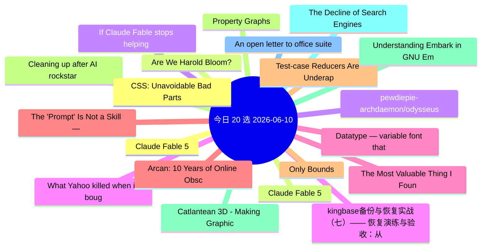

# 每日精选 20 条 (2026-06-10)

> 自动从 7 个数据源综合评分选出。每条都有原文链接 + 所属源。

## 思维导图

## 精选（20 条）

### 1. Claude Fable 5
- **源**: HN | **归一化分**: 1.00
- **链接**: [https://www.anthropic.com/news/claude-fable-5-mythos-5](https://www.anthropic.com/news/claude-fable-5-mythos-5)
- **HN**: 1926 分 / 1507 评论

### 2. Claude Fable 5
- **源**: HN-Best | **归一化分**: 1.00
- **链接**: [https://www.anthropic.com/news/claude-fable-5-mythos-5](https://www.anthropic.com/news/claude-fable-5-mythos-5)
- **HN**: 1929 分 / 1513 评论

### 3. pewdiepie-archdaemon/odysseus
- **源**: GitHub | **归一化分**: 1.00
- **链接**: [https://github.com/pewdiepie-archdaemon/odysseus](https://github.com/pewdiepie-archdaemon/odysseus)
- **Star**: 65742 / Python
- **简介**: Self-hosted AI workspace. 

### 4. kingbase备份与恢复实战（七）—— 恢复演练与验收：从“能恢复”到“可交付预案”
- **源**: 掘金 | **归一化分**: 1.00
- **链接**: [https://juejin.cn/post/7648121330443812864](https://juejin.cn/post/7648121330443812864)
- **热度**: 2016 / 倔强的石头_

### 5. The Most Valuable Thing I Found in Tech Wasn't an Opportunity
- **源**: dev.to | **归一化分**: 1.00
- **链接**: [https://dev.to/hemapriya_kanagala/the-most-valuable-thing-i-found-in-tech-wasnt-an-opportunity-2j83](https://dev.to/hemapriya_kanagala/the-most-valuable-thing-i-found-in-tech-wasnt-an-opportunity-2j83)
- **反应**: 39 / Hemapriya Kanagala
- **简介**: TL;DR  As an international student in the United States, I joined tech communities hoping to find...

### 6. The 'Prompt' Is Not a Skill — And We Need to Stop Pretending
- **源**: dev.to | **归一化分**: 0.90
- **链接**: [https://dev.to/harsh2644/the-prompt-is-not-a-skill-and-we-need-to-stop-pretending-3m18](https://dev.to/harsh2644/the-prompt-is-not-a-skill-and-we-need-to-stop-pretending-3m18)
- **反应**: 30 / Harsh 
- **简介**: Writing a prompt isn't engineering. It's typing.  You type what you want. The AI figures out the rest...

### 7. Test-case Reducers Are Underappreciated Debugging Tools
- **源**: Lobsters | **归一化分**: 0.50
- **链接**: [https://tratt.net/laurie/blog/2026/test_case_reducers_are_underappreciated_debugging_tools.html](https://tratt.net/laurie/blog/2026/test_case_reducers_are_underappreciated_debugging_tools.html)
- **作者**: 
- **简介**: 
<a href="https://lobste.rs/s/zwn4xe/test_case_reducers_are_underappreciated">Comments</a>

### 8. Cleaning up after AI rockstar developers
- **源**: Lobsters | **归一化分**: 0.50
- **链接**: [https://www.codingwithjesse.com/blog/rockstar-developers/](https://www.codingwithjesse.com/blog/rockstar-developers/)
- **作者**: 
- **简介**: 
<a href="https://lobste.rs/s/uvwcdo/cleaning_up_after_ai_rockstar_developers">Comments</a>

### 9. Catlantean 3D - Making Graphics Like It's 1993
- **源**: Lobsters | **归一化分**: 0.50
- **链接**: [https://staniks.github.io/articles/catlantean-3d-blog-1/](https://staniks.github.io/articles/catlantean-3d-blog-1/)
- **作者**: 
- **简介**: 
<a href="https://lobste.rs/s/oytnfw/catlantean_3d_making_graphics_like_it_s">Comments</a>

### 10. The Decline of Search Engines is an Opportunity
- **源**: Lobsters | **归一化分**: 0.50
- **链接**: [https://lewiscampbell.tech/blog/260609.html](https://lewiscampbell.tech/blog/260609.html)
- **作者**: 
- **简介**: 
<a href="https://lobste.rs/s/5hk3s6/decline_search_engines_is_opportunity">Comments</a>

### 11. An open letter to office suite users, just before the Euro-Office announcement
- **源**: Lobsters | **归一化分**: 0.50
- **链接**: [https://blog.documentfoundation.org/blog/2026/06/08/an-open-letter/](https://blog.documentfoundation.org/blog/2026/06/08/an-open-letter/)
- **作者**: 
- **简介**: 
<a href="https://lobste.rs/s/fpgqm0/open_letter_office_suite_users_just">Comments</a>

### 12. CSS: Unavoidable Bad Parts
- **源**: Lobsters | **归一化分**: 0.50
- **链接**: [https://matklad.github.io/2026/06/04/css-unavoidable-bad-parts.html](https://matklad.github.io/2026/06/04/css-unavoidable-bad-parts.html)
- **作者**: 
- **简介**: 
<a href="https://lobste.rs/s/pwmlvz/css_unavoidable_bad_parts">Comments</a>

### 13. Are We Harold Bloom?
- **源**: Lobsters | **归一化分**: 0.50
- **链接**: [https://abner.page/post/are-we-harold-bloom/](https://abner.page/post/are-we-harold-bloom/)
- **作者**: 
- **简介**: 
<a href="https://lobste.rs/s/tgzdhf/are_we_harold_bloom">Comments</a>

### 14. If Claude Fable stops helping you, you'll never know
- **源**: Lobsters | **归一化分**: 0.50
- **链接**: [https://jonready.com/blog/posts/claude-fable5-is-allowed-to-sabotage-your-app-if-youre-a-competitor.html](https://jonready.com/blog/posts/claude-fable5-is-allowed-to-sabotage-your-app-if-youre-a-competitor.html)
- **作者**: 
- **简介**: 
<a href="https://lobste.rs/s/f2fwny/if_claude_fable_stops_helping_you_you_ll">Comments</a>

### 15. What Yahoo killed when it bought Maktoob
- **源**: Lobsters | **归一化分**: 0.50
- **链接**: [https://lr0.org/blog/p/yahoo/](https://lr0.org/blog/p/yahoo/)
- **作者**: 
- **简介**: 
<a href="https://lobste.rs/s/pfffbz/what_yahoo_killed_when_it_bought_maktoob">Comments</a>

### 16. Datatype — variable font that turns text into charts
- **源**: Lobsters | **归一化分**: 0.50
- **链接**: [https://franktisellano.github.io/datatype/](https://franktisellano.github.io/datatype/)
- **作者**: 
- **简介**: 
<a href="https://lobste.rs/s/cebwpi/datatype_variable_font_turns_text_into">Comments</a>

### 17. Arcan: 10 Years of Online Obscurity
- **源**: Lobsters | **归一化分**: 0.50
- **链接**: [https://arcan-fe.com/2026/06/02/arcan-10-years-of-online-obscurity/](https://arcan-fe.com/2026/06/02/arcan-10-years-of-online-obscurity/)
- **作者**: 
- **简介**: 
<a href="https://lobste.rs/s/cssoxa/arcan_10_years_online_obscurity">Comments</a>

### 18. Only Bounds
- **源**: Lobsters | **归一化分**: 0.50
- **链接**: [https://smallcultfollowing.com/babysteps/blog/2026/06/09/only-bounds/](https://smallcultfollowing.com/babysteps/blog/2026/06/09/only-bounds/)
- **作者**: 
- **简介**: 
<a href="https://lobste.rs/s/srq2wf/only_bounds">Comments</a>

### 19. Property Graphs
- **源**: Lobsters | **归一化分**: 0.50
- **链接**: [https://www.postgresql.org/docs/19/ddl-property-graphs.html](https://www.postgresql.org/docs/19/ddl-property-graphs.html)
- **作者**: 
- **简介**: 
<a href="https://lobste.rs/s/ncunjo/property_graphs">Comments</a>

### 20. Understanding Embark in GNU Emacs (a bit) and some 'stupid' Embark tricks
- **源**: Lobsters | **归一化分**: 0.50
- **链接**: [https://utcc.utoronto.ca/~cks/space/blog/programming/EmacsUnderstandingEmbark](https://utcc.utoronto.ca/~cks/space/blog/programming/EmacsUnderstandingEmbark)
- **作者**: 
- **简介**: 
<a href="https://lobste.rs/s/secptg/understanding_embark_gnu_emacs_bit_some">Comments</a>

