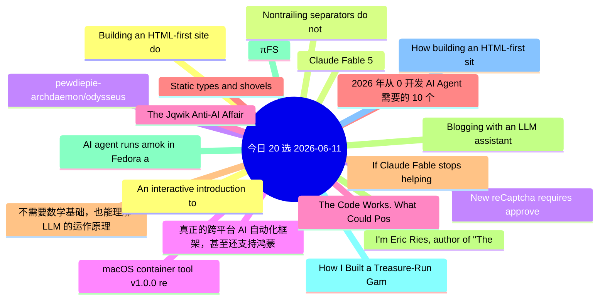

# 每日精选 20 条 (2026-06-11)

> 自动从 7 个数据源综合评分选出。每条都有原文链接 + 所属源。

## 思维导图

## 精选（20 条）

### 1. Building an HTML-first site doubled our users overnight
- **源**: HN | **归一化分**: 1.00
- **链接**: [https://mohkohn.co.uk/writing/html-first/](https://mohkohn.co.uk/writing/html-first/)
- **HN**: 1031 分 / 475 评论

### 2. Claude Fable 5
- **源**: HN-Best | **归一化分**: 1.00
- **链接**: [https://www.anthropic.com/news/claude-fable-5-mythos-5](https://www.anthropic.com/news/claude-fable-5-mythos-5)
- **HN**: 2554 分 / 2088 评论

### 3. pewdiepie-archdaemon/odysseus
- **源**: GitHub | **归一化分**: 1.00
- **链接**: [https://github.com/pewdiepie-archdaemon/odysseus](https://github.com/pewdiepie-archdaemon/odysseus)
- **Star**: 67256 / Python
- **简介**: Self-hosted AI workspace. 

### 4. 真正的跨平台 AI 自动化框架，甚至还支持鸿蒙
- **源**: 掘金 | **归一化分**: 1.00
- **链接**: [https://juejin.cn/post/7648520470531473471](https://juejin.cn/post/7648520470531473471)
- **热度**: 1107 / 恋猫de小郭

### 5. The Code Works. What Could Possibly Go Wrong?
- **源**: dev.to | **归一化分**: 1.00
- **链接**: [https://dev.to/sylwia-lask/the-code-works-what-could-possibly-go-wrong-5hbm](https://dev.to/sylwia-lask/the-code-works-what-could-possibly-go-wrong-5hbm)
- **反应**: 44 / Sylwia Laskowska
- **简介**: Would you treat a serious illness without seeing a doctor, relying only on whatever your favorite AI...

### 6. 2026 年从 0 开发 AI Agent 需要的 10 个技能
- **源**: 掘金 | **归一化分**: 0.80
- **链接**: [https://juejin.cn/post/7648894966207152180](https://juejin.cn/post/7648894966207152180)
- **热度**: 954 / 双越AI_club

### 7. 不需要数学基础，也能理解 LLM 的运作原理
- **源**: 掘金 | **归一化分**: 0.63
- **链接**: [https://juejin.cn/post/7649105672894464006](https://juejin.cn/post/7649105672894464006)
- **热度**: 810 / 恋猫de小郭

### 8. I'm Eric Ries, author of "The Lean Startup" and new book "Incorruptible" – AMA
- **源**: HN | **归一化分**: 0.61
- **链接**: [https://news.ycombinator.com/item?id=48477135](https://news.ycombinator.com/item?id=48477135)
- **HN**: 574 分 / 439 评论

### 9. πFS
- **源**: HN | **归一化分**: 0.52
- **链接**: [https://github.com/philipl/pifs](https://github.com/philipl/pifs)
- **HN**: 583 分 / 142 评论

### 10. How I Built a Treasure-Run Game Where Australia Saves the Sun
- **源**: dev.to | **归一化分**: 0.51
- **链接**: [https://dev.to/ujja/how-i-built-a-treasure-run-game-where-australia-saves-the-sun-kck](https://dev.to/ujja/how-i-built-a-treasure-run-game-where-australia-saves-the-sun-kck)
- **反应**: 26 / ujja
- **简介**: This is a submission for the June Solstice Game Jam           What I Built   For this game jam, I...

### 11. How building an HTML-first site doubled our users overnight
- **源**: Lobsters | **归一化分**: 0.50
- **链接**: [https://mohkohn.co.uk/writing/html-first/](https://mohkohn.co.uk/writing/html-first/)
- **作者**: 
- **简介**: 
<a href="https://lobste.rs/s/esvncd/how_building_html_first_site_doubled_our">Comments</a>

### 12. An interactive introduction to the terrific experience of rendering Arabic typography and its technical debt
- **源**: Lobsters | **归一化分**: 0.50
- **链接**: [https://lr0.org/blog/p/arabic/](https://lr0.org/blog/p/arabic/)
- **作者**: 
- **简介**: 
<a href="https://lobste.rs/s/ptkd7x/interactive_introduction_terrific">Comments</a>

### 13. Nontrailing separators do not spark joy
- **源**: Lobsters | **归一化分**: 0.50
- **链接**: [https://buttondown.com/hillelwayne/archive/nontrailing-separators-do-not-spark-joy/](https://buttondown.com/hillelwayne/archive/nontrailing-separators-do-not-spark-joy/)
- **作者**: 
- **简介**: 
<a href="https://lobste.rs/s/05t4zb/nontrailing_separators_do_not_spark_joy">Comments</a>

### 14. New reCaptcha requires approved phones to pass
- **源**: Lobsters | **归一化分**: 0.50
- **链接**: [https://cybernews.com/privacy/google-qr-code-recaptcha-requires-approved-phone/](https://cybernews.com/privacy/google-qr-code-recaptcha-requires-approved-phone/)
- **作者**: 
- **简介**: 
<a href="https://lobste.rs/s/p07gv1/new_recaptcha_requires_approved_phones">Comments</a>

### 15. macOS container tool v1.0.0 released
- **源**: Lobsters | **归一化分**: 0.50
- **链接**: [https://github.com/apple/container](https://github.com/apple/container)
- **作者**: 
- **简介**: 
Version 1.0.0 released. <a href="https://github.com/apple/container/releases/tag/1.0.0" rel="ugc">Release notes</a>

<a href="https://lobste.

### 16. The Jqwik Anti-AI Affair
- **源**: Lobsters | **归一化分**: 0.50
- **链接**: [https://blog.johanneslink.net/2026/06/09/the-jqwik-anti-ai-affair/](https://blog.johanneslink.net/2026/06/09/the-jqwik-anti-ai-affair/)
- **作者**: 
- **简介**: 
<a href="https://lobste.rs/s/qgfagh/jqwik_anti_ai_affair">Comments</a>

### 17. Static types and shovels
- **源**: Lobsters | **归一化分**: 0.50
- **链接**: [https://carefully.understood.systems/blog-2026-06-10-static-type-shovel.html](https://carefully.understood.systems/blog-2026-06-10-static-type-shovel.html)
- **作者**: 
- **简介**: 
<a href="https://lobste.rs/s/eiknm1/static_types_shovels">Comments</a>

### 18. If Claude Fable stops helping you, you'll never know
- **源**: Lobsters | **归一化分**: 0.50
- **链接**: [https://jonready.com/blog/posts/claude-fable5-is-allowed-to-sabotage-your-app-if-youre-a-competitor.html](https://jonready.com/blog/posts/claude-fable5-is-allowed-to-sabotage-your-app-if-youre-a-competitor.html)
- **作者**: 
- **简介**: 
<a href="https://lobste.rs/s/f2fwny/if_claude_fable_stops_helping_you_you_ll">Comments</a>

### 19. Blogging with an LLM assistant
- **源**: Lobsters | **归一化分**: 0.50
- **链接**: [https://vincent.bernat.ch/en/blog/2026-blogging-llm](https://vincent.bernat.ch/en/blog/2026-blogging-llm)
- **作者**: 
- **简介**: 
<a href="https://lobste.rs/s/tdvu7a/blogging_with_llm_assistant">Comments</a>

### 20. AI agent runs amok in Fedora and elsewhere
- **源**: Lobsters | **归一化分**: 0.50
- **链接**: [https://lwn.net/SubscriberLink/1077035/c7e7c14fbd60fae9/](https://lwn.net/SubscriberLink/1077035/c7e7c14fbd60fae9/)
- **作者**: 
- **简介**: 
<a href="https://lobste.rs/s/wh4ug9/ai_agent_runs_amok_fedora_elsewhere">Comments</a>

