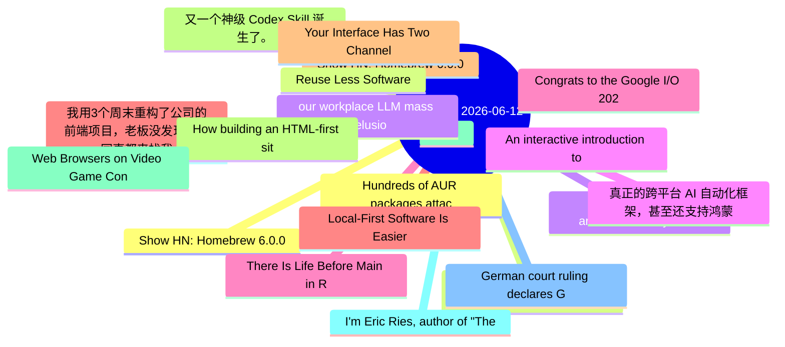

# 每日精选 20 条 (2026-06-12)

> 自动从 7 个数据源综合评分选出。每条都有原文链接 + 所属源。

## 思维导图

## 精选（20 条）

### 1. Show HN: Homebrew 6.0.0
- **源**: HN | **归一化分**: 1.00
- **链接**: [https://brew.sh/2026/06/11/homebrew-6.0.0/](https://brew.sh/2026/06/11/homebrew-6.0.0/)
- **HN**: 1066 分 / 245 评论

### 2. Building an HTML-first site doubled our users overnight
- **源**: HN-Best | **归一化分**: 1.00
- **链接**: [https://mohkohn.co.uk/writing/html-first/](https://mohkohn.co.uk/writing/html-first/)
- **HN**: 1236 分 / 558 评论

### 3. pewdiepie-archdaemon/odysseus
- **源**: GitHub | **归一化分**: 1.00
- **链接**: [https://github.com/pewdiepie-archdaemon/odysseus](https://github.com/pewdiepie-archdaemon/odysseus)
- **Star**: 68544 / Python
- **简介**: Self-hosted AI workspace. 

### 4. 真正的跨平台 AI 自动化框架，甚至还支持鸿蒙
- **源**: 掘金 | **归一化分**: 1.00
- **链接**: [https://juejin.cn/post/7648520470531473471](https://juejin.cn/post/7648520470531473471)
- **热度**: 1467 / 恋猫de小郭

### 5. Congrats to the Google I/O 2026 Writing Challenge Winners!
- **源**: dev.to | **归一化分**: 1.00
- **链接**: [https://dev.to/devteam/congrats-to-the-google-io-writing-challenge-winners-1364](https://dev.to/devteam/congrats-to-the-google-io-writing-challenge-winners-1364)
- **反应**: 86 / Jess Lee
- **简介**: We are so excited to announce the winners of the Google I/O 2026 Writing Challenge!  We asked you to...

### 6. 我用3个周末重构了公司的前端项目，老板没发现，但同事都来找我要代码了
- **源**: 掘金 | **归一化分**: 0.91
- **链接**: [https://juejin.cn/post/7649211548573925418](https://juejin.cn/post/7649211548573925418)
- **热度**: 1368 / 柯克七七

### 7. Show HN: Homebrew 6.0.0
- **源**: HN-Best | **归一化分**: 0.70
- **链接**: [https://brew.sh/2026/06/11/homebrew-6.0.0/](https://brew.sh/2026/06/11/homebrew-6.0.0/)
- **HN**: 1067 分 / 245 评论

### 8. 又一个神级 Codex Skill 诞生了。
- **源**: 掘金 | **归一化分**: 0.56
- **链接**: [https://juejin.cn/post/7649329229150650378](https://juejin.cn/post/7649329229150650378)
- **热度**: 972 / 沉默王二

### 9. πFS
- **源**: HN-Best | **归一化分**: 0.55
- **链接**: [https://github.com/philipl/pifs](https://github.com/philipl/pifs)
- **HN**: 934 分 / 201 评论

### 10. I'm Eric Ries, author of "The Lean Startup" and new book "Incorruptible" – AMA
- **源**: HN-Best | **归一化分**: 0.54
- **链接**: [https://news.ycombinator.com/item?id=48477135](https://news.ycombinator.com/item?id=48477135)
- **HN**: 775 分 / 549 评论

### 11. German court ruling declares Google's AI Overviews are Google's own words and makes it liable for false answers
- **源**: Lobsters | **归一化分**: 0.50
- **链接**: [https://the-decoder.com/landmark-german-ruling-declares-googles-ai-overviews-are-googles-own-words-and-makes-it-liable-for-false-answers/](https://the-decoder.com/landmark-german-ruling-declares-googles-ai-overviews-are-googles-own-words-and-makes-it-liable-for-false-answers/)
- **作者**: 
- **简介**: 
Title trimmed slightly without altering meaning.

<a href="https://lobste.rs/s/lxoosd/german_court_ruling_declares_google_s_ai">Comments</a><

### 12. Hundreds of AUR packages attacked by infostealer
- **源**: Lobsters | **归一化分**: 0.50
- **链接**: [https://lists.archlinux.org/archives/list/aur-general@lists.archlinux.org/thread/FGXPCB3ZVCJIV7FX323SBAX2JHYB7ZS4/](https://lists.archlinux.org/archives/list/aur-general@lists.archlinux.org/thread/FGXPCB3ZVCJIV7FX323SBAX2JHYB7ZS4/)
- **作者**: 
- **简介**: 
More info in Mastodon post: <a href="https://gaysex.cloud/notes/andaxow7itfn05x9" rel="ugc">https://gaysex.cloud/notes/andaxow7itfn05x9</a>

### 13. Reuse Less Software
- **源**: Lobsters | **归一化分**: 0.50
- **链接**: [https://wiki.alopex.li/ReuseLessSoftware](https://wiki.alopex.li/ReuseLessSoftware)
- **作者**: 
- **简介**: 
<a href="https://lobste.rs/s/3mg7xo/reuse_less_software">Comments</a>

### 14. our workplace LLM mass delusion
- **源**: Lobsters | **归一化分**: 0.50
- **链接**: [https://blog.avas.space/llm-circus/](https://blog.avas.space/llm-circus/)
- **作者**: 
- **简介**: 
<a href="https://lobste.rs/s/lrjceq/our_workplace_llm_mass_delusion">Comments</a>

### 15. An interactive introduction to the terrific experience of rendering Arabic typography and its technical debt
- **源**: Lobsters | **归一化分**: 0.50
- **链接**: [https://lr0.org/blog/p/arabic/](https://lr0.org/blog/p/arabic/)
- **作者**: 
- **简介**: 
<a href="https://lobste.rs/s/ptkd7x/interactive_introduction_terrific">Comments</a>

### 16. There Is Life Before Main in Rust
- **源**: Lobsters | **归一化分**: 0.50
- **链接**: [https://grack.com/blog/2026/06/11/life-before-main/](https://grack.com/blog/2026/06/11/life-before-main/)
- **作者**: 
- **简介**: 
<a href="https://lobste.rs/s/rs1t8s/there_is_life_before_main_rust">Comments</a>

### 17. Local-First Software Is Easier to Scale
- **源**: Lobsters | **归一化分**: 0.50
- **链接**: [https://elijahpotter.dev/articles/local-first_software_is_easier_to_scale](https://elijahpotter.dev/articles/local-first_software_is_easier_to_scale)
- **作者**: 
- **简介**: 
<a href="https://lobste.rs/s/o1dzcn/local_first_software_is_easier_scale">Comments</a>

### 18. Your Interface Has Two Channels
- **源**: Lobsters | **归一化分**: 0.50
- **链接**: [https://tomeraberba.ch/your-interface-has-two-channels](https://tomeraberba.ch/your-interface-has-two-channels)
- **作者**: 
- **简介**: 
<a href="https://lobste.rs/s/khavt4/your_interface_has_two_channels">Comments</a>

### 19. How building an HTML-first site doubled our users overnight
- **源**: Lobsters | **归一化分**: 0.50
- **链接**: [https://mohkohn.co.uk/writing/html-first/](https://mohkohn.co.uk/writing/html-first/)
- **作者**: 
- **简介**: 
<a href="https://lobste.rs/s/esvncd/how_building_html_first_site_doubled_our">Comments</a>

### 20. Web Browsers on Video Game Consoles
- **源**: Lobsters | **归一化分**: 0.50
- **链接**: [https://vale.rocks/posts/game-console-browsers](https://vale.rocks/posts/game-console-browsers)
- **作者**: 
- **简介**: 
<a href="https://lobste.rs/s/fp6pal/web_browsers_on_video_game_consoles">Comments</a>

