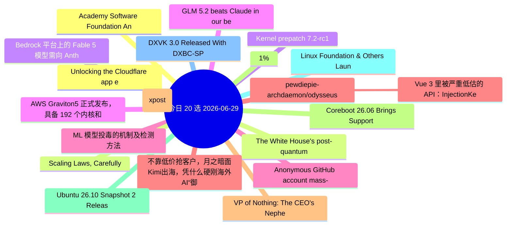

# 每日精选 20 条 (2026-06-29)

> 自动从 14 个数据源综合评分选出。每条都有原文链接 + 所属源。

## 思维导图

## 精选（20 条）

### 1. Unlocking the Cloudflare app ecosystem with OAuth for all
- **源**: Cloudflare | **归一化分**: 1.10
- **链接**: [https://blog.cloudflare.com/oauth-for-all/](https://blog.cloudflare.com/oauth-for-all/)
- **简介**: Self-Managed OAuth is now available to all developers on Cloudflare. Here's how we executed a zero-downtime migration of our core OAuth engine to make

### 2. The White House's post-quantum executive order is an important milestone. It’s time to get to work
- **源**: Cloudflare | **归一化分**: 1.10
- **链接**: [https://blog.cloudflare.com/post-quantum-eo-2026/](https://blog.cloudflare.com/post-quantum-eo-2026/)
- **简介**: The new executive order sets a 2030 migration deadline and establishes a powerful foundation for post-quantum resilience. We look at what it gets righ

### 3. Bedrock 平台上的 Fable 5 模型需向 Anthropic 共享推理数据
- **源**: InfoQ-CN | **归一化分**: 1.10
- **链接**: [https://www.infoq.cn/article/NodhKVrhWoYF9yGwm12j?utm_source=rss&utm_medium=article](https://www.infoq.cn/article/NodhKVrhWoYF9yGwm12j?utm_source=rss&utm_medium=article)
- **简介**: 点击查看原文>

### 4. AWS Graviton5 正式发布，具备 192 个内核和经过正式验证的虚拟机隔离功能
- **源**: InfoQ-CN | **归一化分**: 1.10
- **链接**: [https://www.infoq.cn/article/ONqpdtmlUXgF32G1vqT2?utm_source=rss&utm_medium=article](https://www.infoq.cn/article/ONqpdtmlUXgF32G1vqT2?utm_source=rss&utm_medium=article)
- **简介**: 点击查看原文>

### 5. ML 模型投毒的机制及检测方法
- **源**: InfoQ-CN | **归一化分**: 1.10
- **链接**: [https://www.infoq.cn/article/GqFL7BV2JopihkBJWkt2?utm_source=rss&utm_medium=article](https://www.infoq.cn/article/GqFL7BV2JopihkBJWkt2?utm_source=rss&utm_medium=article)
- **简介**: 点击查看原文>

### 6. 不靠低价抢客户，月之暗面Kimi出海，凭什么硬刚海外AI“御三家”？
- **源**: InfoQ-CN | **归一化分**: 1.10
- **链接**: [https://www.infoq.cn/article/uJ7sK8HW50T256cMoVF1?utm_source=rss&utm_medium=article](https://www.infoq.cn/article/uJ7sK8HW50T256cMoVF1?utm_source=rss&utm_medium=article)
- **简介**: 点击查看原文>

### 7. Make AI Boring Again (xpost)
- **源**: Charity | **归一化分**: 1.10
- **链接**: [https://charity.wtf/2026/06/24/make-ai-boring-again-xpost/](https://charity.wtf/2026/06/24/make-ai-boring-again-xpost/)
- **简介**: On the ethics of engagement, the problem with purity politics, and a world worth fighting for Crossposted from here.  &#160; I am a contrarian who lik

### 8. Coreboot 26.06 Brings Support For Intel Nova Lake, AMD Strix Halo & 31 New Boards
- **源**: Phoronix | **归一化分**: 1.10
- **链接**: [https://www.phoronix.com/news/Coreboot-26.06-Released](https://www.phoronix.com/news/Coreboot-26.06-Released)
- **简介**: Coreboot 26.06 is out today as the latest quarterly feature release for this software project providing open-source system firmware support for a grow

### 9. Ubuntu 26.10 Snapshot 2 Released For Monthly Testing
- **源**: Phoronix | **归一化分**: 1.10
- **链接**: [https://www.phoronix.com/news/Ubuntu-26.10-Snapshot-2](https://www.phoronix.com/news/Ubuntu-26.10-Snapshot-2)
- **简介**: Daily ISOs of Ubuntu 26.10 "Stonking Stingray" continue to be published, but for those preferring something a bit more regulated, out today is Ubuntu 

### 10. Linux Foundation & Others Launch "Akrites" To Defend Open-Source Software From AI-Enabled Exploits
- **源**: Phoronix | **归一化分**: 1.10
- **链接**: [https://www.phoronix.com/news/Akrites](https://www.phoronix.com/news/Akrites)
- **简介**: The Linux Foundation along with others like Amazon, Anthropic, OpenAI, NVIDIA, Microsoft, Red Hat, and others have joined forces to launch Akrites. Th

### 11. DXVK 3.0 Released With DXBC-SPIRV For Shader Compilation, Descriptor Heaps By Default
- **源**: Phoronix | **归一化分**: 1.10
- **链接**: [https://www.phoronix.com/news/DXVK-3.0-Release](https://www.phoronix.com/news/DXVK-3.0-Release)
- **简介**: Philip Rebohle announced the release today of DXVK 3.0 as the latest major feature release for this Direct3D 8 / 9 / 10 / 11 implementation atop the V

### 12. Academy Software Foundation Announces The "Wayland For Artists Working Group"
- **源**: Phoronix | **归一化分**: 1.10
- **链接**: [https://www.phoronix.com/news/Wayland-For-Artists](https://www.phoronix.com/news/Wayland-For-Artists)
- **简介**: The Academy Software Foundation that advances open-source efforts for the VFX/cinema industry and more with the likes of OpenVDB, OpenMoonRay, Open Sh

### 13. Scaling Laws, Carefully
- **源**: LilianWeng | **归一化分**: 1.10
- **链接**: [https://lilianweng.github.io/posts/2026-06-24-scaling-laws/](https://lilianweng.github.io/posts/2026-06-24-scaling-laws/)
- **简介**: Scaling laws are one of the most critical empirical findings in deep learning. The observation is simple in form: the training loss $L$ decreases pred

### 14. Kernel prepatch 7.2-rc1
- **源**: LWN | **归一化分**: 1.10
- **链接**: [https://lwn.net/Articles/1079891/](https://lwn.net/Articles/1079891/)
- **简介**: The 7.2-rc1 kernel prepatch is out for
testing.  Linus said: "So two weeks have passed, and the merge window is
closed. Things look reasonably normal 

### 15. GLM 5.2 beats Claude in our benchmarks
- **源**: HN | **归一化分**: 1.00
- **链接**: [https://semgrep.dev/blog/2026/we-have-mythos-at-home-glm-52-beats-claude-in-our-cyber-benchmarks/](https://semgrep.dev/blog/2026/we-have-mythos-at-home-glm-52-beats-claude-in-our-cyber-benchmarks/)
- **HN**: 590 分 / 283 评论

### 16. Anonymous GitHub account mass-dropping undisclosed 0-days
- **源**: HN-Best | **归一化分**: 1.00
- **链接**: [https://github.com/bikini/exploitarium](https://github.com/bikini/exploitarium)
- **HN**: 928 分 / 374 评论

### 17. pewdiepie-archdaemon/odysseus
- **源**: GitHub | **归一化分**: 1.00
- **链接**: [https://github.com/pewdiepie-archdaemon/odysseus](https://github.com/pewdiepie-archdaemon/odysseus)
- **Star**: 79048 / Python
- **简介**: Self-hosted AI workspace. 

### 18.  Vue 3 里被严重低估的 API：InjectionKey
- **源**: 掘金 | **归一化分**: 1.00
- **链接**: [https://juejin.cn/post/7654840513968537641](https://juejin.cn/post/7654840513968537641)
- **热度**: 828 / 秋天的一阵风

### 19. VP of Nothing: The CEO's Nephew Took Over My AI Platform. The Client Walked Within a Month.
- **源**: dev.to | **归一化分**: 1.00
- **链接**: [https://dev.to/xulingfeng/vp-of-nothing-the-ceos-nephew-took-over-my-ai-platform-the-client-walked-within-a-month-5dla](https://dev.to/xulingfeng/vp-of-nothing-the-ceos-nephew-took-over-my-ai-platform-the-client-walked-within-a-month-5dla)
- **反应**: 42 / xulingfeng
- **简介**: Series: AI, Ego &amp; Regret — Bonus Chapter   Editor's Note: While compiling the old series for the...

### 20. 1%
- **源**: dev.to | **归一化分**: 0.84
- **链接**: [https://dev.to/pascal_cescato_692b7a8a20/1-15n0](https://dev.to/pascal_cescato_692b7a8a20/1-15n0)
- **反应**: 33 / Pascal CESCATO
- **简介**: Santa Clara, 2029. A speculative fiction about hegemony, sanctions, and the playbook nobody followed.
