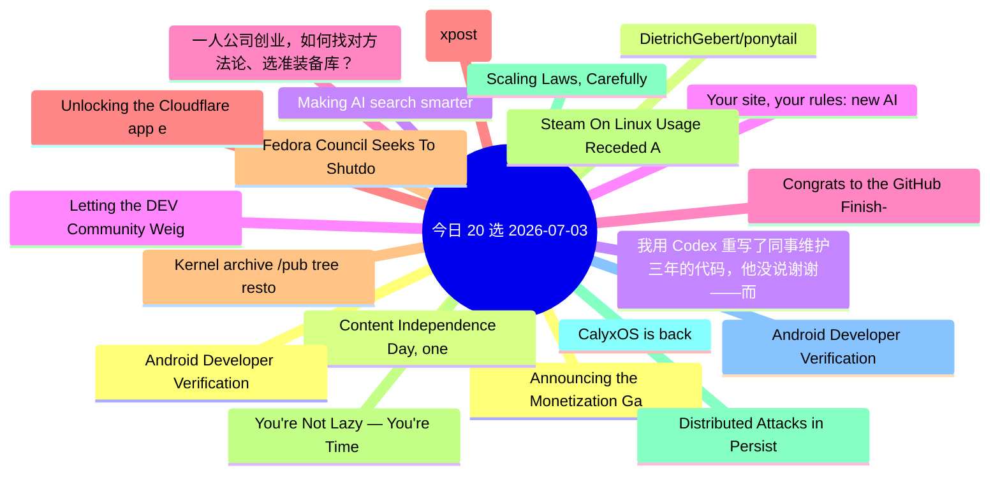

# 每日精选 20 条 (2026-07-03)

> 自动从 14 个数据源综合评分选出。每条都有原文链接 + 所属源。

## 思维导图

## 精选（20 条）

### 1. Announcing the Monetization Gateway: charge for any resource behind Cloudflare via x402
- **源**: Cloudflare | **归一化分**: 1.10
- **链接**: [https://blog.cloudflare.com/monetization-gateway/](https://blog.cloudflare.com/monetization-gateway/)
- **简介**: We're opening the waitlist for our Monetization Gateway, which will allow you to charge for any web page, dataset, API, or MCP tool behind Cloudflare.

### 2. Content Independence Day, one year on: building the business model for the agentic Internet
- **源**: Cloudflare | **归一化分**: 1.10
- **链接**: [https://blog.cloudflare.com/agentic-internet-bot-report/](https://blog.cloudflare.com/agentic-internet-bot-report/)
- **简介**: One year after declaring Content Independence Day, a dynamic market for monetized content has officially emerged. In this report, we examine how the r

### 3. Making AI search smarter
- **源**: Cloudflare | **归一化分**: 1.10
- **链接**: [https://blog.cloudflare.com/making-ai-search-smarter/](https://blog.cloudflare.com/making-ai-search-smarter/)
- **简介**: Search is how we find nearly everything on the web — creators, merchants, answers. AI is rewriting the rules, leaving creators caught between staying 

### 4. Your site, your rules: new AI traffic options for all customers
- **源**: Cloudflare | **归一化分**: 1.10
- **链接**: [https://blog.cloudflare.com/content-independence-day-ai-options/](https://blog.cloudflare.com/content-independence-day-ai-options/)
- **简介**: For our second Content Independence Day, we’re giving website owners finer options to manage AI traffic. Instead of a one-size-fits-all block, all cus

### 5. 一人公司创业，如何找对方法论、选准装备库？
- **源**: InfoQ-CN | **归一化分**: 1.10
- **链接**: [https://www.infoq.cn/article/pxXOLZMIk90UTXOJ8aNE?utm_source=rss&utm_medium=article](https://www.infoq.cn/article/pxXOLZMIk90UTXOJ8aNE?utm_source=rss&utm_medium=article)
- **简介**: 点击查看原文>

### 6. Make AI Boring Again (xpost)
- **源**: Charity | **归一化分**: 1.10
- **链接**: [https://charity.wtf/2026/06/24/make-ai-boring-again-xpost/](https://charity.wtf/2026/06/24/make-ai-boring-again-xpost/)
- **简介**: On the ethics of engagement, the problem with purity politics, and a world worth fighting for Crossposted from here.  &#160; I am a contrarian who lik

### 7. Fedora Council Seeks To Shutdown Current Discussions Over AI Developer Desktop
- **源**: Phoronix | **归一化分**: 1.10
- **链接**: [https://www.phoronix.com/news/Fedora-Council-AI-Desktop](https://www.phoronix.com/news/Fedora-Council-AI-Desktop)
- **简介**: Stemming from the widely varying views over the recent Fedora proposal for an "AI Developer Desktop" catering to running local AI and machine learning

### 8. Steam On Linux Usage Receded A Bit In June
- **源**: Phoronix | **归一化分**: 1.10
- **链接**: [https://www.phoronix.com/news/Steam-Survey-June-2026](https://www.phoronix.com/news/Steam-Survey-June-2026)
- **简介**: Back in March Steam on Linux use shot up to 5.33% as a big 3.1% improvement over February. In April it dropped to 4.52% and then fell to 3.99% in May.

### 9. Scaling Laws, Carefully
- **源**: LilianWeng | **归一化分**: 1.10
- **链接**: [https://lilianweng.github.io/posts/2026-06-24-scaling-laws/](https://lilianweng.github.io/posts/2026-06-24-scaling-laws/)
- **简介**: Scaling laws are one of the most critical empirical findings in deep learning. The observation is simple in form: the training loss $L$ decreases pred

### 10. CalyxOS is back
- **源**: LWN | **归一化分**: 1.10
- **链接**: [https://lwn.net/Articles/1081038/](https://lwn.net/Articles/1081038/)
- **简介**: In August 2025, the CalyxOS privacy-focused
Android distribution announced
that it was pausing all releases while it reworked its
release process, sec

### 11. Android Developer Verification: Threat masquerading as protection
- **源**: HN | **归一化分**: 1.00
- **链接**: [https://f-droid.org/2026/07/01/adv-malware.html](https://f-droid.org/2026/07/01/adv-malware.html)
- **HN**: 1628 分 / 698 评论

### 12. Android Developer Verification: Threat masquerading as protection
- **源**: HN-Best | **归一化分**: 1.00
- **链接**: [https://f-droid.org/2026/07/01/adv-malware.html](https://f-droid.org/2026/07/01/adv-malware.html)
- **HN**: 1628 分 / 698 评论

### 13. DietrichGebert/ponytail
- **源**: GitHub | **归一化分**: 1.00
- **链接**: [https://github.com/DietrichGebert/ponytail](https://github.com/DietrichGebert/ponytail)
- **Star**: 72369 / JavaScript
- **简介**: Makes your AI agent think like the laziest senior dev in the room. The best code is the code you never wrote.

### 14. 我用 Codex 重写了同事维护三年的代码，他没说谢谢——而是找了领导
- **源**: 掘金 | **归一化分**: 1.00
- **链接**: [https://juejin.cn/post/7657392618506764326](https://juejin.cn/post/7657392618506764326)
- **热度**: 1728 / kyriewen

### 15. Letting the DEV Community Weigh in on the Topics of AIE
- **源**: dev.to | **归一化分**: 1.00
- **链接**: [https://dev.to/dailycontext/letting-the-dev-community-weigh-in-on-the-topics-of-aie-439l](https://dev.to/dailycontext/letting-the-dev-community-weigh-in-on-the-topics-of-aie-439l)
- **反应**: 53 / Ben Halpern
- **简介**: I’m at the AI Engineer World’s Fair in San Francisco, where the vibes are enthusiastic. However,...

### 16. Congrats to the GitHub Finish-Up-A-Thon Challenge Winners!
- **源**: dev.to | **归一化分**: 0.86
- **链接**: [https://dev.to/devteam/congrats-to-the-github-finish-up-a-thon-challenge-winners-1k0h](https://dev.to/devteam/congrats-to-the-github-finish-up-a-thon-challenge-winners-1k0h)
- **反应**: 40 / Jess Lee
- **简介**: We are so excited to finally announce the winners of the GitHub Finish-Up-A-Thon Challenge, our...

### 17. Unlocking the Cloudflare app ecosystem with OAuth for all
- **源**: Cloudflare | **归一化分**: 0.77
- **链接**: [https://blog.cloudflare.com/oauth-for-all/](https://blog.cloudflare.com/oauth-for-all/)
- **简介**: Self-Managed OAuth is now available to all developers on Cloudflare. Here's how we executed a zero-downtime migration of our core OAuth engine to make

### 18. Kernel archive /pub tree restoring
- **源**: LWN | **归一化分**: 0.77
- **链接**: [https://lwn.net/Articles/1081015/](https://lwn.net/Articles/1081015/)
- **简介**: A few astute observers have noticed that some
content on kernel.org had disappeared and were understandably
concerned. Konstantin Ryabitsev has provid

### 19. You're Not Lazy — You're Time Blind. Here's How Lock In Fixes It.
- **源**: dev.to | **归一化分**: 0.65
- **链接**: [https://dev.to/harsh2644/youre-not-lazy-youre-time-blind-heres-how-lock-in-fixes-it-57ej](https://dev.to/harsh2644/youre-not-lazy-youre-time-blind-heres-how-lock-in-fixes-it-57ej)
- **反应**: 31 / Harsh 
- **简介**: I sat down to work for 2 hours. I actually worked for 45 minutes.  Sound familiar?  You open your...

### 20. Distributed Attacks in Persistent-State AI Control
- **源**: arXiv | **归一化分**: 0.60
- **链接**: [http://arxiv.org/abs/2607.02514v1](http://arxiv.org/abs/2607.02514v1)
- **作者**: Josh Hills | **日期**: 2026-07-02
