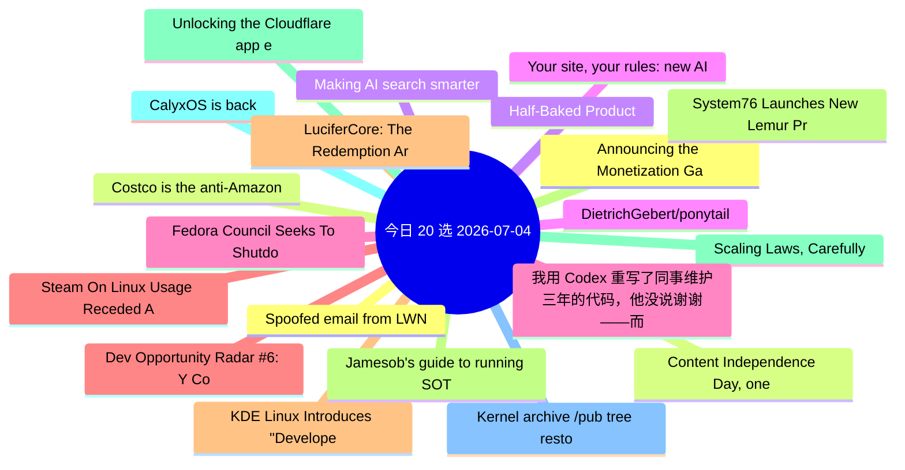

# 每日精选 20 条 (2026-07-04)

> 自动从 14 个数据源综合评分选出。每条都有原文链接 + 所属源。

## 思维导图

## 精选（20 条）

### 1. Announcing the Monetization Gateway: charge for any resource behind Cloudflare via x402
- **源**: Cloudflare | **归一化分**: 1.10
- **链接**: [https://blog.cloudflare.com/monetization-gateway/](https://blog.cloudflare.com/monetization-gateway/)
- **简介**: We're opening the waitlist for our Monetization Gateway, which will allow you to charge for any web page, dataset, API, or MCP tool behind Cloudflare.

### 2. Content Independence Day, one year on: building the business model for the agentic Internet
- **源**: Cloudflare | **归一化分**: 1.10
- **链接**: [https://blog.cloudflare.com/agentic-internet-bot-report/](https://blog.cloudflare.com/agentic-internet-bot-report/)
- **简介**: One year after declaring Content Independence Day, a dynamic market for monetized content has officially emerged. In this report, we examine how the r

### 3. Making AI search smarter
- **源**: Cloudflare | **归一化分**: 1.10
- **链接**: [https://blog.cloudflare.com/making-ai-search-smarter/](https://blog.cloudflare.com/making-ai-search-smarter/)
- **简介**: Search is how we find nearly everything on the web — creators, merchants, answers. AI is rewriting the rules, leaving creators caught between staying 

### 4. Your site, your rules: new AI traffic options for all customers
- **源**: Cloudflare | **归一化分**: 1.10
- **链接**: [https://blog.cloudflare.com/content-independence-day-ai-options/](https://blog.cloudflare.com/content-independence-day-ai-options/)
- **简介**: For our second Content Independence Day, we’re giving website owners finer options to manage AI traffic. Instead of a one-size-fits-all block, all cus

### 5. Fedora Council Seeks To Shutdown Current Discussions Over AI Developer Desktop
- **源**: Phoronix | **归一化分**: 1.10
- **链接**: [https://www.phoronix.com/news/Fedora-Council-AI-Desktop](https://www.phoronix.com/news/Fedora-Council-AI-Desktop)
- **简介**: Stemming from the widely varying views over the recent Fedora proposal for an "AI Developer Desktop" catering to running local AI and machine learning

### 6. Steam On Linux Usage Receded A Bit In June
- **源**: Phoronix | **归一化分**: 1.10
- **链接**: [https://www.phoronix.com/news/Steam-Survey-June-2026](https://www.phoronix.com/news/Steam-Survey-June-2026)
- **简介**: Back in March Steam on Linux use shot up to 5.33% as a big 3.1% improvement over February. In April it dropped to 4.52% and then fell to 3.99% in May.

### 7. KDE Linux Introduces "Developer Mode" Option, Easier Log Collection
- **源**: Phoronix | **归一化分**: 1.10
- **链接**: [https://www.phoronix.com/news/KDE-Linux-June-2026](https://www.phoronix.com/news/KDE-Linux-June-2026)
- **简介**: With the start of the new month comes a new progress report on the KDE Linux distribution for the prior month. Even with KDE developers being busy to 

### 8. System76 Launches New Lemur Pro Laptop Powered By Intel Panther Lake
- **源**: Phoronix | **归一化分**: 1.10
- **链接**: [https://www.phoronix.com/news/System76-Lemur-Pro-Panther-Lake](https://www.phoronix.com/news/System76-Lemur-Pro-Panther-Lake)
- **简介**: System76 today announced their new Lemur Pro high-end Linux laptop that is now powered by the Core Ultra Series 3 "Panther Lake" SoCs...

### 9. Scaling Laws, Carefully
- **源**: LilianWeng | **归一化分**: 1.10
- **链接**: [https://lilianweng.github.io/posts/2026-06-24-scaling-laws/](https://lilianweng.github.io/posts/2026-06-24-scaling-laws/)
- **简介**: Scaling laws are one of the most critical empirical findings in deep learning. The observation is simple in form: the training loss $L$ decreases pred

### 10. CalyxOS is back
- **源**: LWN | **归一化分**: 1.10
- **链接**: [https://lwn.net/Articles/1081038/](https://lwn.net/Articles/1081038/)
- **简介**: In August 2025, the CalyxOS privacy-focused
Android distribution announced
that it was pausing all releases while it reworked its
release process, sec

### 11. Kernel archive /pub tree restoring
- **源**: LWN | **归一化分**: 1.10
- **链接**: [https://lwn.net/Articles/1081015/](https://lwn.net/Articles/1081015/)
- **简介**: A few astute observers have noticed that some
content on kernel.org had disappeared and were understandably
concerned. Konstantin Ryabitsev has provid

### 12. Spoofed email from LWN
- **源**: LWN | **归一化分**: 1.10
- **链接**: [https://lwn.net/Articles/1081012/](https://lwn.net/Articles/1081012/)
- **简介**: We were made aware today of an email sent to a reader that was
spoofed to appear to be from LWN. The message claimed, among other
things, that we were

### 13. Costco is the anti-Amazon
- **源**: HN | **归一化分**: 1.00
- **链接**: [https://phenomenalworld.org/analysis/the-anti-amazon/](https://phenomenalworld.org/analysis/the-anti-amazon/)
- **HN**: 345 分 / 326 评论

### 14. Half-Baked Product
- **源**: HN-Best | **归一化分**: 1.00
- **链接**: [https://weli.dev/blog/half-baked-product/](https://weli.dev/blog/half-baked-product/)
- **HN**: 1218 分 / 371 评论

### 15. DietrichGebert/ponytail
- **源**: GitHub | **归一化分**: 1.00
- **链接**: [https://github.com/DietrichGebert/ponytail](https://github.com/DietrichGebert/ponytail)
- **Star**: 73162 / JavaScript
- **简介**: Makes your AI agent think like the laziest senior dev in the room. The best code is the code you never wrote.

### 16. 我用 Codex 重写了同事维护三年的代码，他没说谢谢——而是找了领导
- **源**: 掘金 | **归一化分**: 1.00
- **链接**: [https://juejin.cn/post/7657392618506764326](https://juejin.cn/post/7657392618506764326)
- **热度**: 2070 / kyriewen

### 17. Dev Opportunity Radar #6: Y Combinator Startup School, Open Source AI Grants, and a $60K APAC Hackathon
- **源**: dev.to | **归一化分**: 1.00
- **链接**: [https://dev.to/devengers/dev-opportunity-radar-6-y-combinator-startup-school-open-source-ai-grants-and-a-60k-apac-4nlp](https://dev.to/devengers/dev-opportunity-radar-6-y-combinator-startup-school-open-source-ai-grants-and-a-60k-apac-4nlp)
- **反应**: 43 / Hemapriya Kanagala
- **简介**: TL;DR  Welcome back to Dev Opportunity Radar.  This is a weekly series where I share opportunities,...

### 18. LuciferCore: The Redemption Arc — From a Naive Prototype to a Battle-Tested .NET Framework
- **源**: dev.to | **归一化分**: 0.82
- **链接**: [https://dev.to/thuangf45/lucifercore-the-redemption-arc-from-a-naive-prototype-to-a-battle-tested-net-framework-4l7f](https://dev.to/thuangf45/lucifercore-the-redemption-arc-from-a-naive-prototype-to-a-battle-tested-net-framework-4l7f)
- **反应**: 33 / Thuangf45
- **简介**: Every software engineer has that one project.  The project that keeps you up at 3 AM.  The project...

### 19. Jamesob's guide to running SOTA LLMs locally
- **源**: HN | **归一化分**: 0.74
- **链接**: [https://github.com/jamesob/local-llm](https://github.com/jamesob/local-llm)
- **HN**: 302 分 / 138 评论

### 20. Unlocking the Cloudflare app ecosystem with OAuth for all
- **源**: Cloudflare | **归一化分**: 0.72
- **链接**: [https://blog.cloudflare.com/oauth-for-all/](https://blog.cloudflare.com/oauth-for-all/)
- **简介**: Self-Managed OAuth is now available to all developers on Cloudflare. Here's how we executed a zero-downtime migration of our core OAuth engine to make
