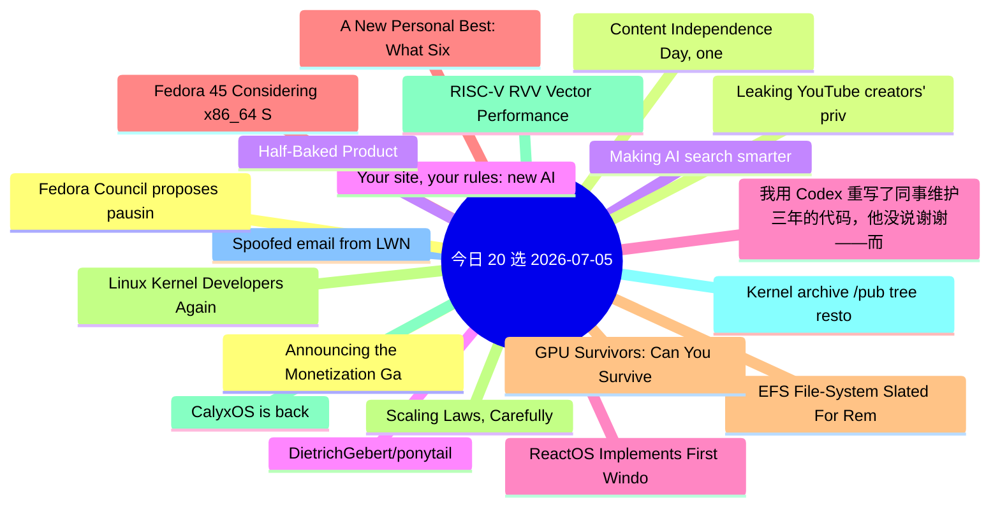

# 每日精选 20 条 (2026-07-05)

> 自动从 14 个数据源综合评分选出。每条都有原文链接 + 所属源。

## 思维导图

## 精选（20 条）

### 1. Announcing the Monetization Gateway: charge for any resource behind Cloudflare via x402
- **源**: Cloudflare | **归一化分**: 1.10
- **链接**: [https://blog.cloudflare.com/monetization-gateway/](https://blog.cloudflare.com/monetization-gateway/)
- **简介**: We're opening the waitlist for our Monetization Gateway, which will allow you to charge for any web page, dataset, API, or MCP tool behind Cloudflare.

### 2. Content Independence Day, one year on: building the business model for the agentic Internet
- **源**: Cloudflare | **归一化分**: 1.10
- **链接**: [https://blog.cloudflare.com/agentic-internet-bot-report/](https://blog.cloudflare.com/agentic-internet-bot-report/)
- **简介**: One year after declaring Content Independence Day, a dynamic market for monetized content has officially emerged. In this report, we examine how the r

### 3. Making AI search smarter
- **源**: Cloudflare | **归一化分**: 1.10
- **链接**: [https://blog.cloudflare.com/making-ai-search-smarter/](https://blog.cloudflare.com/making-ai-search-smarter/)
- **简介**: Search is how we find nearly everything on the web — creators, merchants, answers. AI is rewriting the rules, leaving creators caught between staying 

### 4. Your site, your rules: new AI traffic options for all customers
- **源**: Cloudflare | **归一化分**: 1.10
- **链接**: [https://blog.cloudflare.com/content-independence-day-ai-options/](https://blog.cloudflare.com/content-independence-day-ai-options/)
- **简介**: For our second Content Independence Day, we’re giving website owners finer options to manage AI traffic. Instead of a one-size-fits-all block, all cus

### 5. ReactOS Implements First Windows NT6 System Call In Step Toward Vista Compatibility
- **源**: Phoronix | **归一化分**: 1.10
- **链接**: [https://www.phoronix.com/news/ReactOS-First-NT6-Syscall](https://www.phoronix.com/news/ReactOS-First-NT6-Syscall)
- **简介**: The ReactOS project that is striving to be the "open-source Windows" with Windows driver and software binary compatibility hit another milestone today

### 6. Fedora 45 Considering x86_64 Shadow Stack Usage By Default
- **源**: Phoronix | **归一化分**: 1.10
- **链接**: [https://www.phoronix.com/news/Fedora-45-Consider-Shadow-Stack](https://www.phoronix.com/news/Fedora-45-Consider-Shadow-Stack)
- **简介**: A change proposal under consideration for Fedora Linux 45 would enable x86_64 Shadow Stack usage by default in the name of better security on modern I

### 7. EFS File-System Slated For Removal With Linux 7.3 After 20+ Years Unmaintained
- **源**: Phoronix | **归一化分**: 1.10
- **链接**: [https://www.phoronix.com/news/EFS-File-System-Removal-Coming](https://www.phoronix.com/news/EFS-File-System-Removal-Coming)
- **简介**: The EFS file-system was used for non-ISO9660 CD-ROMs and disk partitions on SGI IRIX before IRIX 6.0 switched over to XFS. Inside the Linux kernel has

### 8. Scaling Laws, Carefully
- **源**: LilianWeng | **归一化分**: 1.10
- **链接**: [https://lilianweng.github.io/posts/2026-06-24-scaling-laws/](https://lilianweng.github.io/posts/2026-06-24-scaling-laws/)
- **简介**: Scaling laws are one of the most critical empirical findings in deep learning. The observation is simple in form: the training loss $L$ decreases pred

### 9. CalyxOS is back
- **源**: LWN | **归一化分**: 1.10
- **链接**: [https://lwn.net/Articles/1081038/](https://lwn.net/Articles/1081038/)
- **简介**: In August 2025, the CalyxOS privacy-focused
Android distribution announced
that it was pausing all releases while it reworked its
release process, sec

### 10. Kernel archive /pub tree restoring
- **源**: LWN | **归一化分**: 1.10
- **链接**: [https://lwn.net/Articles/1081015/](https://lwn.net/Articles/1081015/)
- **简介**: A few astute observers have noticed that some
content on kernel.org had disappeared and were understandably
concerned. Konstantin Ryabitsev has provid

### 11. Spoofed email from LWN
- **源**: LWN | **归一化分**: 1.10
- **链接**: [https://lwn.net/Articles/1081012/](https://lwn.net/Articles/1081012/)
- **简介**: We were made aware today of an email sent to a reader that was
spoofed to appear to be from LWN. The message claimed, among other
things, that we were

### 12. Fedora Council proposes pausing Community Initiatives
- **源**: LWN | **归一化分**: 1.10
- **链接**: [https://lwn.net/Articles/1081013/](https://lwn.net/Articles/1081013/)
- **简介**: Aoife Moloney has, on behalf of the Fedora Council, posted an
announcement that the Fedora Council is "proposing we pause the
Community Initiatives pr

### 13. Leaking YouTube creators' private videos
- **源**: HN | **归一化分**: 1.00
- **链接**: [https://javoriuski.com/post/youtube](https://javoriuski.com/post/youtube)
- **HN**: 531 分 / 301 评论

### 14. Half-Baked Product
- **源**: HN-Best | **归一化分**: 1.00
- **链接**: [https://weli.dev/blog/half-baked-product/](https://weli.dev/blog/half-baked-product/)
- **HN**: 1341 分 / 397 评论

### 15. DietrichGebert/ponytail
- **源**: GitHub | **归一化分**: 1.00
- **链接**: [https://github.com/DietrichGebert/ponytail](https://github.com/DietrichGebert/ponytail)
- **Star**: 74037 / JavaScript
- **简介**: Makes your AI agent think like the laziest senior dev in the room. The best code is the code you never wrote.

### 16. 我用 Codex 重写了同事维护三年的代码，他没说谢谢——而是找了领导
- **源**: 掘金 | **归一化分**: 1.00
- **链接**: [https://juejin.cn/post/7657392618506764326](https://juejin.cn/post/7657392618506764326)
- **热度**: 2574 / kyriewen

### 17. A New Personal Best: What Six Months of Locking In Can Do
- **源**: dev.to | **归一化分**: 1.00
- **链接**: [https://dev.to/georgekobaidze/a-new-personal-best-what-six-months-of-locking-in-can-do-p3k](https://dev.to/georgekobaidze/a-new-personal-best-what-six-months-of-locking-in-can-do-p3k)
- **反应**: 10 / Giorgi Kobaidze
- **简介**: Table of Contents    Setting a New Benchmark for Myself My Most Productive Six Months Yet  2...

### 18. GPU Survivors: Can You Survive a 1T Parameter Inference Run?
- **源**: dev.to | **归一化分**: 0.81
- **链接**: [https://dev.to/unitbuilds_cc/gpu-survivors-can-you-survive-a-1t-parameter-inference-run-476d](https://dev.to/unitbuilds_cc/gpu-survivors-can-you-survive-a-1t-parameter-inference-run-476d)
- **反应**: 10 / UnitBuilds
- **简介**: Survive endless waves of OOD data, prompt injections, and adversarial token splits inside a GPU Core while scaling your model architecture to 1T param

### 19. Linux Kernel Developers Again Discussing AI Agent Attribution - Potentially Dropping It
- **源**: Phoronix | **归一化分**: 0.77
- **链接**: [https://www.phoronix.com/news/Linux-AI-Attribution-Again](https://www.phoronix.com/news/Linux-AI-Attribution-Again)
- **简介**: When AI/LLM agents are used in the creation of Linux kernel patches, the policy for a while now has been that it should be specified using an "Assiste

### 20. RISC-V RVV Vector Performance Benchmarks With The SpacemiT K3 SoC
- **源**: Phoronix | **归一化分**: 0.77
- **链接**: [https://www.phoronix.com/review/risc-v-rvv-vector-benchmarks](https://www.phoronix.com/review/risc-v-rvv-vector-benchmarks)
- **简介**: Since May we have been benchmarking the SpacemiT K3 RISC-V SoC as one of the first to market RISC-V chips supporting the RVA23 profile. The SpacemiT K
