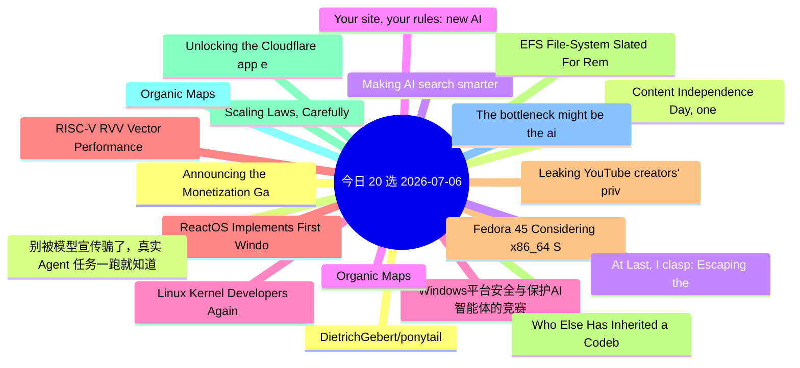

# 每日精选 20 条 (2026-07-06)

> 自动从 14 个数据源综合评分选出。每条都有原文链接 + 所属源。

## 思维导图

## 精选（20 条）

### 1. Announcing the Monetization Gateway: charge for any resource behind Cloudflare via x402
- **源**: Cloudflare | **归一化分**: 1.10
- **链接**: [https://blog.cloudflare.com/monetization-gateway/](https://blog.cloudflare.com/monetization-gateway/)
- **简介**: We're opening the waitlist for our Monetization Gateway, which will allow you to charge for any web page, dataset, API, or MCP tool behind Cloudflare.

### 2. Content Independence Day, one year on: building the business model for the agentic Internet
- **源**: Cloudflare | **归一化分**: 1.10
- **链接**: [https://blog.cloudflare.com/agentic-internet-bot-report/](https://blog.cloudflare.com/agentic-internet-bot-report/)
- **简介**: One year after declaring Content Independence Day, a dynamic market for monetized content has officially emerged. In this report, we examine how the r

### 3. Making AI search smarter
- **源**: Cloudflare | **归一化分**: 1.10
- **链接**: [https://blog.cloudflare.com/making-ai-search-smarter/](https://blog.cloudflare.com/making-ai-search-smarter/)
- **简介**: Search is how we find nearly everything on the web — creators, merchants, answers. AI is rewriting the rules, leaving creators caught between staying 

### 4. Your site, your rules: new AI traffic options for all customers
- **源**: Cloudflare | **归一化分**: 1.10
- **链接**: [https://blog.cloudflare.com/content-independence-day-ai-options/](https://blog.cloudflare.com/content-independence-day-ai-options/)
- **简介**: For our second Content Independence Day, we’re giving website owners finer options to manage AI traffic. Instead of a one-size-fits-all block, all cus

### 5. Windows平台安全与保护AI智能体的竞赛
- **源**: InfoQ-CN | **归一化分**: 1.10
- **链接**: [https://www.infoq.cn/article/LT7lx2Qe5KkS9QCVSXCQ?utm_source=rss&utm_medium=article](https://www.infoq.cn/article/LT7lx2Qe5KkS9QCVSXCQ?utm_source=rss&utm_medium=article)
- **简介**: 点击查看原文>

### 6. ReactOS Implements First Windows NT6 System Call In Step Toward Vista Compatibility
- **源**: Phoronix | **归一化分**: 1.10
- **链接**: [https://www.phoronix.com/news/ReactOS-First-NT6-Syscall](https://www.phoronix.com/news/ReactOS-First-NT6-Syscall)
- **简介**: The ReactOS project that is striving to be the "open-source Windows" with Windows driver and software binary compatibility hit another milestone today

### 7. Fedora 45 Considering x86_64 Shadow Stack Usage By Default
- **源**: Phoronix | **归一化分**: 1.10
- **链接**: [https://www.phoronix.com/news/Fedora-45-Consider-Shadow-Stack](https://www.phoronix.com/news/Fedora-45-Consider-Shadow-Stack)
- **简介**: A change proposal under consideration for Fedora Linux 45 would enable x86_64 Shadow Stack usage by default in the name of better security on modern I

### 8. EFS File-System Slated For Removal With Linux 7.3 After 20+ Years Unmaintained
- **源**: Phoronix | **归一化分**: 1.10
- **链接**: [https://www.phoronix.com/news/EFS-File-System-Removal-Coming](https://www.phoronix.com/news/EFS-File-System-Removal-Coming)
- **简介**: The EFS file-system was used for non-ISO9660 CD-ROMs and disk partitions on SGI IRIX before IRIX 6.0 switched over to XFS. Inside the Linux kernel has

### 9. Scaling Laws, Carefully
- **源**: LilianWeng | **归一化分**: 1.10
- **链接**: [https://lilianweng.github.io/posts/2026-06-24-scaling-laws/](https://lilianweng.github.io/posts/2026-06-24-scaling-laws/)
- **简介**: Scaling laws are one of the most critical empirical findings in deep learning. The observation is simple in form: the training loss $L$ decreases pred

### 10. Organic Maps
- **源**: HN | **归一化分**: 1.00
- **链接**: [https://organicmaps.app/](https://organicmaps.app/)
- **HN**: 854 分 / 247 评论

### 11. The bottleneck might be the air in the room
- **源**: HN-Best | **归一化分**: 1.00
- **链接**: [https://blog.mikebowler.ca/2026/07/03/co2-and-decision-making/](https://blog.mikebowler.ca/2026/07/03/co2-and-decision-making/)
- **HN**: 812 分 / 456 评论

### 12. DietrichGebert/ponytail
- **源**: GitHub | **归一化分**: 1.00
- **链接**: [https://github.com/DietrichGebert/ponytail](https://github.com/DietrichGebert/ponytail)
- **Star**: 75061 / JavaScript
- **简介**: Makes your AI agent think like the laziest senior dev in the room. The best code is the code you never wrote.

### 13. 别被模型宣传骗了，真实 Agent 任务一跑就知道
- **源**: 掘金 | **归一化分**: 1.00
- **链接**: [https://juejin.cn/post/7658119907389554738](https://juejin.cn/post/7658119907389554738)
- **热度**: 3330 / 轻口味

### 14. At Last, I clasp: Escaping the G's Apps Script Copy-Paste Gauntlet
- **源**: dev.to | **归一化分**: 1.00
- **链接**: [https://dev.to/lovestaco/at-last-i-clasp-escaping-the-gs-apps-script-copy-paste-gauntlet-23jd](https://dev.to/lovestaco/at-last-i-clasp-escaping-the-gs-apps-script-copy-paste-gauntlet-23jd)
- **反应**: 26 / Athreya aka Maneshwar
- **简介**: Hello, I'm Maneshwar. I'm building git-lrc, a Micro AI code reviewer that runs on every commit. It is...

### 15. Organic Maps
- **源**: HN-Best | **归一化分**: 0.93
- **链接**: [https://organicmaps.app/](https://organicmaps.app/)
- **HN**: 854 分 / 248 评论

### 16. Linux Kernel Developers Again Discussing AI Agent Attribution - Potentially Dropping It
- **源**: Phoronix | **归一化分**: 0.77
- **链接**: [https://www.phoronix.com/news/Linux-AI-Attribution-Again](https://www.phoronix.com/news/Linux-AI-Attribution-Again)
- **简介**: When AI/LLM agents are used in the creation of Linux kernel patches, the policy for a while now has been that it should be specified using an "Assiste

### 17. RISC-V RVV Vector Performance Benchmarks With The SpacemiT K3 SoC
- **源**: Phoronix | **归一化分**: 0.77
- **链接**: [https://www.phoronix.com/review/risc-v-rvv-vector-benchmarks](https://www.phoronix.com/review/risc-v-rvv-vector-benchmarks)
- **简介**: Since May we have been benchmarking the SpacemiT K3 RISC-V SoC as one of the first to market RISC-V chips supporting the RVA23 profile. The SpacemiT K

### 18. Leaking YouTube creators' private videos
- **源**: HN-Best | **归一化分**: 0.75
- **链接**: [https://javoriuski.com/post/youtube](https://javoriuski.com/post/youtube)
- **HN**: 666 分 / 391 评论

### 19. Who Else Has Inherited a Codebase With Zero Comments and a Prayer?
- **源**: dev.to | **归一化分**: 0.75
- **链接**: [https://dev.to/gamya_m/who-else-has-inherited-a-codebase-with-zero-comments-and-a-prayer-84h](https://dev.to/gamya_m/who-else-has-inherited-a-codebase-with-zero-comments-and-a-prayer-84h)
- **反应**: 20 / Gamya 
- **简介**: Okay so. Story time. Grab a coffee; this one's got a body count.  A few months back I got assigned a...

### 20. Unlocking the Cloudflare app ecosystem with OAuth for all
- **源**: Cloudflare | **归一化分**: 0.72
- **链接**: [https://blog.cloudflare.com/oauth-for-all/](https://blog.cloudflare.com/oauth-for-all/)
- **简介**: Self-Managed OAuth is now available to all developers on Cloudflare. Here's how we executed a zero-downtime migration of our core OAuth engine to make
