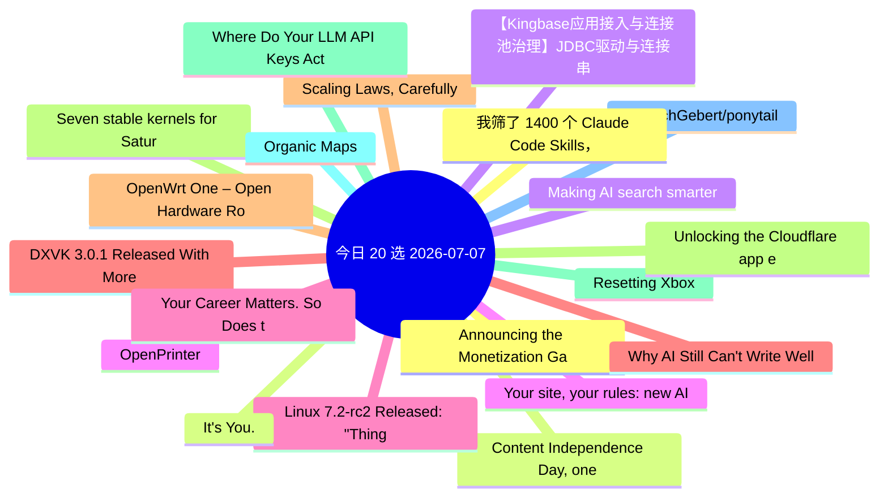

# 每日精选 20 条 (2026-07-07)

> 自动从 14 个数据源综合评分选出。每条都有原文链接 + 所属源。

## 思维导图

## 精选（20 条）

### 1. Announcing the Monetization Gateway: charge for any resource behind Cloudflare via x402
- **源**: Cloudflare | **归一化分**: 1.10
- **链接**: [https://blog.cloudflare.com/monetization-gateway/](https://blog.cloudflare.com/monetization-gateway/)
- **简介**: We're opening the waitlist for our Monetization Gateway, which will allow you to charge for any web page, dataset, API, or MCP tool behind Cloudflare.

### 2. Content Independence Day, one year on: building the business model for the agentic Internet
- **源**: Cloudflare | **归一化分**: 1.10
- **链接**: [https://blog.cloudflare.com/agentic-internet-bot-report/](https://blog.cloudflare.com/agentic-internet-bot-report/)
- **简介**: One year after declaring Content Independence Day, a dynamic market for monetized content has officially emerged. In this report, we examine how the r

### 3. Making AI search smarter
- **源**: Cloudflare | **归一化分**: 1.10
- **链接**: [https://blog.cloudflare.com/making-ai-search-smarter/](https://blog.cloudflare.com/making-ai-search-smarter/)
- **简介**: Search is how we find nearly everything on the web — creators, merchants, answers. AI is rewriting the rules, leaving creators caught between staying 

### 4. Your site, your rules: new AI traffic options for all customers
- **源**: Cloudflare | **归一化分**: 1.10
- **链接**: [https://blog.cloudflare.com/content-independence-day-ai-options/](https://blog.cloudflare.com/content-independence-day-ai-options/)
- **简介**: For our second Content Independence Day, we’re giving website owners finer options to manage AI traffic. Instead of a one-size-fits-all block, all cus

### 5. Linux 7.2-rc2 Released: "Things Look Very Normal"
- **源**: Phoronix | **归一化分**: 1.10
- **链接**: [https://www.phoronix.com/news/Linux-7.2-rc2-Released](https://www.phoronix.com/news/Linux-7.2-rc2-Released)
- **简介**: Linux 7.2-rc2 is now available for testing in working toward the stable Linux 7.2 release in August...

### 6. DXVK 3.0.1 Released With More Game Fixes, Other Improvements
- **源**: Phoronix | **归一化分**: 1.10
- **链接**: [https://www.phoronix.com/news/DXVK-3.0.1-Released](https://www.phoronix.com/news/DXVK-3.0.1-Released)
- **简介**: Following the release of DXVK 3.0 from late June that brought several big changes, DXVK 3.0.1 is out today with shipping various game fixes and other 

### 7. Scaling Laws, Carefully
- **源**: LilianWeng | **归一化分**: 1.10
- **链接**: [https://lilianweng.github.io/posts/2026-06-24-scaling-laws/](https://lilianweng.github.io/posts/2026-06-24-scaling-laws/)
- **简介**: Scaling laws are one of the most critical empirical findings in deep learning. The observation is simple in form: the training loss $L$ decreases pred

### 8. Seven stable kernels for Saturday including two security fixes
- **源**: LWN | **归一化分**: 1.10
- **链接**: [https://lwn.net/Articles/1081230/](https://lwn.net/Articles/1081230/)
- **简介**: Greg Kroah-Hartman has announced the release of the 7.1.3, 6.18.38, 6.12.95, 6.6.144, 6.1.177, 5.15.211, and 5.10.260 stable kernels. Several kernels

### 9. Resetting Xbox
- **源**: HN | **归一化分**: 1.00
- **链接**: [https://news.xbox.com/en-us/2026/07/06/resetting-xbox/](https://news.xbox.com/en-us/2026/07/06/resetting-xbox/)
- **HN**: 528 分 / 524 评论

### 10. Organic Maps
- **源**: HN-Best | **归一化分**: 1.00
- **链接**: [https://organicmaps.app/](https://organicmaps.app/)
- **HN**: 1136 分 / 357 评论

### 11. DietrichGebert/ponytail
- **源**: GitHub | **归一化分**: 1.00
- **链接**: [https://github.com/DietrichGebert/ponytail](https://github.com/DietrichGebert/ponytail)
- **Star**: 76077 / JavaScript
- **简介**: Makes your AI agent think like the laziest senior dev in the room. The best code is the code you never wrote.

### 12. 我筛了 1400 个 Claude Code Skills，留下 5 个天天在用的
- **源**: 掘金 | **归一化分**: 1.00
- **链接**: [https://juejin.cn/post/7657936630132883492](https://juejin.cn/post/7657936630132883492)
- **热度**: 819 / kyriewen

### 13. It's You.
- **源**: dev.to | **归一化分**: 1.00
- **链接**: [https://dev.to/francistrdev/its-you-29k0](https://dev.to/francistrdev/its-you-29k0)
- **反应**: 51 / FrancisTRᴅᴇᴠ (っ◔◡◔)っ
- **简介**: To start off, I appreciate the community support I have received on the post about being behind.     ...

### 14. 【Kingbase应用接入与连接池治理】JDBC驱动与连接串实战
- **源**: 掘金 | **归一化分**: 0.97
- **链接**: [https://juejin.cn/post/7658588277832253481](https://juejin.cn/post/7658588277832253481)
- **热度**: 810 / 倔强的石头_

### 15. OpenPrinter
- **源**: HN-Best | **归一化分**: 0.94
- **链接**: [https://www.opentools.studio/](https://www.opentools.studio/)
- **HN**: 1110 分 / 279 评论

### 16. Your Career Matters. So Does the Person Building It.
- **源**: dev.to | **归一化分**: 0.93
- **链接**: [https://dev.to/hemapriya_kanagala/your-career-matters-so-does-the-person-building-it-2jle](https://dev.to/hemapriya_kanagala/your-career-matters-so-does-the-person-building-it-2jle)
- **反应**: 47 / Hemapriya Kanagala
- **简介**: TL;DR  Tech has taught me many things over the years. It taught me how to learn new technologies,...

### 17. Why AI Still Can't Write Well and Which Half of That Problem Is Actually Yours
- **源**: dev.to | **归一化分**: 0.77
- **链接**: [https://dev.to/dannwaneri/why-ai-still-cant-write-well-and-which-half-of-that-problem-is-actually-yours-kh4](https://dev.to/dannwaneri/why-ai-still-cant-write-well-and-which-half-of-that-problem-is-actually-yours-kh4)
- **反应**: 36 / Daniel Nwaneri
- **简介**: I built a 36-pattern checklist to catch AI writing tells in my own drafts, calibrated against...

### 18. OpenWrt One – Open Hardware Router
- **源**: HN | **归一化分**: 0.76
- **链接**: [https://openwrt.org/toh/openwrt/one](https://openwrt.org/toh/openwrt/one)
- **HN**: 487 分 / 199 评论

### 19. Unlocking the Cloudflare app ecosystem with OAuth for all
- **源**: Cloudflare | **归一化分**: 0.72
- **链接**: [https://blog.cloudflare.com/oauth-for-all/](https://blog.cloudflare.com/oauth-for-all/)
- **简介**: Self-Managed OAuth is now available to all developers on Cloudflare. Here's how we executed a zero-downtime migration of our core OAuth engine to make

### 20. Where Do Your LLM API Keys Actually Live?
- **源**: dev.to | **归一化分**: 0.69
- **链接**: [https://dev.to/hadil/where-do-your-llm-api-keys-actually-live-2cjm](https://dev.to/hadil/where-do-your-llm-api-keys-actually-live-2cjm)
- **反应**: 34 / Hadil Ben Abdallah
- **简介**: If someone compromised one of your project's dependencies today, would they be able to steal your...
