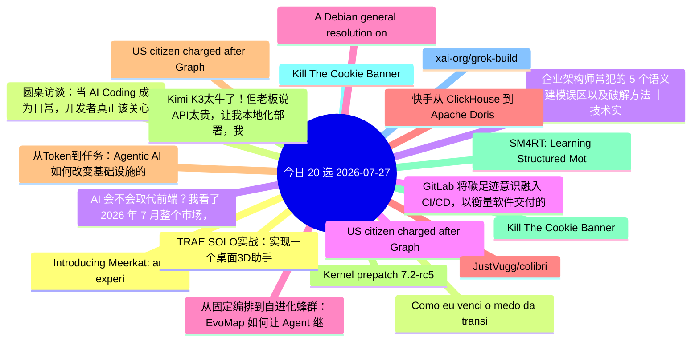

# 每日精选 20 条 (2026-07-27)

> 自动从 14 个数据源综合评分选出。每条都有原文链接 + 所属源。

## 思维导图

## 精选（20 条）

### 1. Introducing Meerkat: an experiment in global consensus
- **源**: Cloudflare | **归一化分**: 1.10
- **链接**: [https://blog.cloudflare.com/meerkat-introduction/](https://blog.cloudflare.com/meerkat-introduction/)
- **简介**: Cloudflare Research is building a global consensus service called Meerkat that uses a new consensus algorithm called QuePaxa. We plan to use Meerkat t

### 2. 圆桌访谈：当 AI Coding 成为日常，开发者真正该关心什么？
- **源**: InfoQ-CN | **归一化分**: 1.10
- **链接**: [https://www.infoq.cn/video/hTlgBWF6rgBKDi7TEb7i?utm_source=rss&utm_medium=article](https://www.infoq.cn/video/hTlgBWF6rgBKDi7TEb7i?utm_source=rss&utm_medium=article)
- **简介**: 点击查看原文>

### 3. 企业架构师常犯的 5 个语义建模误区以及破解方法 ｜ 技术实践
- **源**: InfoQ-CN | **归一化分**: 1.10
- **链接**: [https://www.infoq.cn/article/BjNkMC0utTMMzATPzkdC?utm_source=rss&utm_medium=article](https://www.infoq.cn/article/BjNkMC0utTMMzATPzkdC?utm_source=rss&utm_medium=article)
- **简介**: 点击查看原文>

### 4. GitLab 将碳足迹意识融入 CI/CD，以衡量软件交付的环境成本
- **源**: InfoQ-CN | **归一化分**: 1.10
- **链接**: [https://www.infoq.cn/article/hJjOFog5ObigvYFod90j?utm_source=rss&utm_medium=article](https://www.infoq.cn/article/hJjOFog5ObigvYFod90j?utm_source=rss&utm_medium=article)
- **简介**: 点击查看原文>

### 5. 从固定编排到自进化蜂群：EvoMap 如何让 Agent 继承经验｜AICon深圳
- **源**: InfoQ-CN | **归一化分**: 1.10
- **链接**: [https://www.infoq.cn/article/e5SNCwkIFNXylsQOEaQ6?utm_source=rss&utm_medium=article](https://www.infoq.cn/article/e5SNCwkIFNXylsQOEaQ6?utm_source=rss&utm_medium=article)
- **简介**: 点击查看原文>

### 6. 快手从 ClickHouse 到 Apache Doris 的百 PB 数据、200+集群迁移实践
- **源**: InfoQ-CN | **归一化分**: 1.10
- **链接**: [https://www.infoq.cn/article/1YYoykV4gk0eRGE5HpTO?utm_source=rss&utm_medium=article](https://www.infoq.cn/article/1YYoykV4gk0eRGE5HpTO?utm_source=rss&utm_medium=article)
- **简介**: 点击查看原文>

### 7. 从Token到任务：Agentic AI 如何改变基础设施的关注焦点
- **源**: InfoQ-CN | **归一化分**: 1.10
- **链接**: [https://www.infoq.cn/article/vhx0VYNXpieSIuq0YIR6?utm_source=rss&utm_medium=article](https://www.infoq.cn/article/vhx0VYNXpieSIuq0YIR6?utm_source=rss&utm_medium=article)
- **简介**: 点击查看原文>

### 8. Kernel prepatch 7.2-rc5
- **源**: LWN | **归一化分**: 1.10
- **链接**: [https://lwn.net/Articles/1085422/](https://lwn.net/Articles/1085422/)
- **简介**: The 7.2-rc5 kernel prepatch is out for
testing.  Linus said: "So it's a bit too big for my liking, but nothing
in there strikes me as particularly str

### 9. Kill The Cookie Banner
- **源**: HN | **归一化分**: 1.00
- **链接**: [https://killthecookiebanner.eu/](https://killthecookiebanner.eu/)
- **HN**: 1049 分 / 495 评论

### 10. Kill The Cookie Banner
- **源**: HN-Best | **归一化分**: 1.00
- **链接**: [https://killthecookiebanner.eu/](https://killthecookiebanner.eu/)
- **HN**: 1049 分 / 495 评论

### 11. xai-org/grok-build
- **源**: GitHub | **归一化分**: 1.00
- **链接**: [https://github.com/xai-org/grok-build](https://github.com/xai-org/grok-build)
- **Star**: 22904 / Rust
- **简介**: SpaceXAI's coding agent harness and TUI. Fullscreen, mouse interactive, extensible.

### 12. TRAE SOLO实战：实现一个桌面3D助手
- **源**: 掘金 | **归一化分**: 1.00
- **链接**: [https://juejin.cn/post/7665981990437797914](https://juejin.cn/post/7665981990437797914)
- **热度**: 855 / 石小石Orz

### 13. Como eu venci o medo da transição de carreira
- **源**: dev.to | **归一化分**: 1.00
- **链接**: [https://dev.to/he4rt/como-eu-venci-o-medo-da-transicao-de-carreira-4b3c](https://dev.to/he4rt/como-eu-venci-o-medo-da-transicao-de-carreira-4b3c)
- **反应**: 91 / Bárbara Martins da Silveira
- **简介**: Migrar de carreira para a área de tecnologia pode parecer difícil no início. O mercado está cada vez...

### 14. AI 会不会取代前端？我看了 2026 年 7 月整个市场，给你一个不吓人的答案
- **源**: 掘金 | **归一化分**: 0.89
- **链接**: [https://juejin.cn/post/7666019880676622345](https://juejin.cn/post/7666019880676622345)
- **热度**: 783 / 鱼樱前端

### 15. US citizen charged after GrapheneOS phone wipes during airport search
- **源**: HN | **归一化分**: 0.85
- **链接**: [https://www.techspot.com/news/113236-us-prosecutors-charge-atlanta-man-after-grapheneos-phone.html](https://www.techspot.com/news/113236-us-prosecutors-charge-atlanta-man-after-grapheneos-phone.html)
- **HN**: 813 分 / 609 评论

### 16. A Debian general resolution on LLM usage
- **源**: LWN | **归一化分**: 0.85
- **链接**: [https://lwn.net/Articles/1085314/](https://lwn.net/Articles/1085314/)
- **简介**: The Debian project is considering a general
resolution on the use of large language models in the creation of the
distribution.  There are three alter

### 17. JustVugg/colibri
- **源**: GitHub | **归一化分**: 0.83
- **链接**: [https://github.com/JustVugg/colibri](https://github.com/JustVugg/colibri)
- **Star**: 19856 / C
- **简介**: Run GLM-5.2 (744B MoE) on a 25GB-RAM consumer machine — pure C, zero deps, experts streamed from disk. Tiny engine, immense model. 🐦

### 18. US citizen charged after GrapheneOS phone wipes during airport search
- **源**: HN-Best | **归一化分**: 0.80
- **链接**: [https://www.techspot.com/news/113236-us-prosecutors-charge-atlanta-man-after-grapheneos-phone.html](https://www.techspot.com/news/113236-us-prosecutors-charge-atlanta-man-after-grapheneos-phone.html)
- **HN**: 814 分 / 611 评论

### 19. Kimi K3太牛了！但老板说API太贵，让我本地化部署，我算完成本，他涨红脸沉默不语了！其实成本不高，三千万足矣。
- **源**: 掘金 | **归一化分**: 0.71
- **链接**: [https://juejin.cn/post/7666482995197722630](https://juejin.cn/post/7666482995197722630)
- **热度**: 657 / 李剑一

### 20. SM4RT: Learning Structured Motion Geometry for 4D Reconstruction
- **源**: arXiv | **归一化分**: 0.60
- **链接**: [http://arxiv.org/abs/2607.22534v1](http://arxiv.org/abs/2607.22534v1)
- **作者**: Shing Ho J. Lin | **日期**: 2026-07-24
