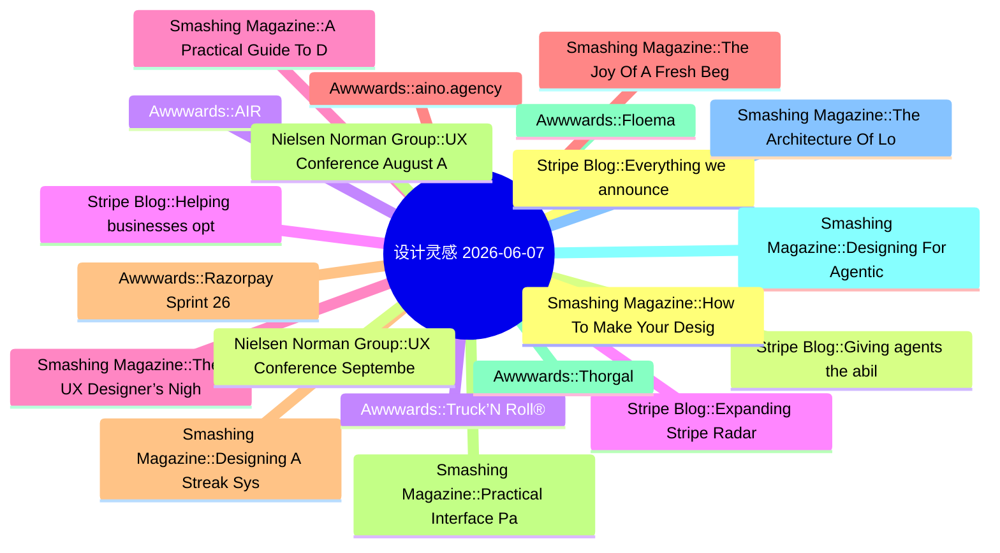

# 🎨 设计灵感精选 25 条 (2026-06-07)

> 6 源聚合：Smashing Magazine · Awwwards · UX Collective · NN/g · Stripe Blog · Material Design

**源分布**: Smashing Magazine=8 · Awwwards=8 · UX Collective=8 · Nielsen Norman Group=5 · Stripe Blog=5 · Material Design=5

## 思维导图

## 精选

### 1. [Stripe Blog] Everything we announced at Sessions 2026
- **链接**: [https://stripe.com/blog/everything-we-announced-at-sessions-2026](https://stripe.com/blog/everything-we-announced-at-sessions-2026)
- **发布**: Wed, 29 Apr 2026 00:00:00 +0000
- **简介**: We’re making Stripe even more programmable; protecting and propelling your business with the strength of the Stripe network; and building economic infrastructure for AI.

### 2. [Stripe Blog] Giving agents the ability to pay
- **链接**: [https://stripe.com/blog/giving-agents-the-ability-to-pay](https://stripe.com/blog/giving-agents-the-ability-to-pay)
- **发布**: Wed, 29 Apr 2026 00:00:00 +0000
- **简介**: Link’s wallet for agents gives agents programmatic access to Link, including the ability to generate a one-time-use card or Shared Payment Token (SPT) backed by the cards and bank accounts already in your wallet. It’s bu

### 3. [Awwwards] AIR
- **链接**: [https://www.awwwards.com/sites/air-1](https://www.awwwards.com/sites/air-1)
- **发布**: Wed, 27 May 2026 00:00:00 +0000
- **简介**: The striking Grade A business center website

### 4. [Stripe Blog] Expanding Stripe Radar to protect more of your business
- **链接**: [https://stripe.com/blog/expanding-stripe-radar-to-protect-more-of-your-business](https://stripe.com/blog/expanding-stripe-radar-to-protect-more-of-your-business)
- **发布**: Wed, 27 May 2026 00:00:00 +0000
- **简介**: Radar now blocks high-risk transactions across all supported payment methods; defends against new fraud types like multi-account abuse and pay-as-you-go abuse, regardless of which payment processor you use; and gives pla

### 5. [Smashing Magazine] The UX Designer’s Nightmare: When “Production-Ready” Becomes A Design Deliverable
- **链接**: [https://smashingmagazine.com/2026/04/production-ready-becomes-design-deliverable-ux/](https://smashingmagazine.com/2026/04/production-ready-becomes-design-deliverable-ux/)
- **发布**: Wed, 22 Apr 2026 10:00:00 GMT
- **简介**: In a rush to embrace AI, the industry is redefining what it means to be a UX designer, blurring the line between design and engineering. Carrie Webster explores what’s gained, what’s lost, and why designers need to remai

### 6. [Awwwards] aino.agency
- **链接**: [https://www.awwwards.com/sites/aino-agency](https://www.awwwards.com/sites/aino-agency)
- **发布**: Wed, 20 May 2026 00:00:00 +0000
- **简介**: Aino rebuilt their site from scratch to explore what's possible with text as a medium. ASCII, 2D physics, real-time morphing - all at 30kb JS.

### 7. [Smashing Magazine] Designing A Streak System: The UX And Psychology Of Streaks
- **链接**: [https://smashingmagazine.com/2026/02/designing-streak-system-ux-psychology/](https://smashingmagazine.com/2026/02/designing-streak-system-ux-psychology/)
- **发布**: Wed, 18 Feb 2026 15:00:00 GMT
- **简介**: What makes streaks so powerful and addictive? To design them well, you need to understand how they align with human psychology. Victor Ayomipo breaks down the UX and design principles behind effective streak systems.

### 8. [Smashing Magazine] Practical Interface Patterns For AI Transparency (Part 2)
- **链接**: [https://smashingmagazine.com/2026/05/practical-interface-patterns-ai-transparency/](https://smashingmagazine.com/2026/05/practical-interface-patterns-ai-transparency/)
- **发布**: Wed, 13 May 2026 13:00:00 GMT
- **简介**: Why traditional loading patterns like spinners fail in agentic AI experiences, and how interface patterns that reveal the system’s process, status, and decision-making can improve transparency and build user trust.

### 9. [Awwwards] Floema
- **链接**: [https://www.awwwards.com/sites/floema](https://www.awwwards.com/sites/floema)
- **发布**: Wed, 13 May 2026 00:00:00 +0000
- **简介**: Floema designs and produces sustainable urban furniture and signage for natural spaces. Spaces for people, made for life.

### 10. [Smashing Magazine] Designing For Agentic AI: Practical UX Patterns For Control, Consent, And Accountability
- **链接**: [https://smashingmagazine.com/2026/02/designing-agentic-ai-practical-ux-patterns/](https://smashingmagazine.com/2026/02/designing-agentic-ai-practical-ux-patterns/)
- **发布**: Wed, 11 Feb 2026 13:00:00 GMT
- **简介**: Autonomy is an output of a technical system. Trustworthiness is an output of a design process. Here are concrete design patterns, operational frameworks, and organizational practices for building agentic systems that are

### 11. [Smashing Magazine] The Architecture Of Local-First Web Development
- **链接**: [https://smashingmagazine.com/2026/05/architecture-local-first-web-development/](https://smashingmagazine.com/2026/05/architecture-local-first-web-development/)
- **发布**: Wed, 06 May 2026 10:00:00 GMT
- **简介**: An honest perspective on building local-first web apps in 2026, written for developers who’ve been doing this long enough to be skeptical of silver bullets.

### 12. [Smashing Magazine] How To Make Your Design System AI-Ready
- **链接**: [https://smashingmagazine.com/2026/06/how-make-design-system-ai-ready/](https://smashingmagazine.com/2026/06/how-make-design-system-ai-ready/)
- **发布**: Wed, 03 Jun 2026 13:00:00 GMT
- **简介**: Practical guide on how to reduce drifts, minimize mistakes, maintain context, and improve the quality of AI-generated prototypes. Brought to you by Design Patterns For AI Interfaces, **friendly video course on UX** and d

### 13. [Nielsen Norman Group] UX Conference September Announced (Sep 14 - Sep 25)
- **链接**: [https://www.nngroup.com/training/september/?utm_source=rss&utm_medium=feed&utm_campaign=rss-syndication](https://www.nngroup.com/training/september/?utm_source=rss&utm_medium=feed&utm_campaign=rss-syndication)
- **发布**: Wed, 03 Jun 2026 01:25:55 +0000
- **简介**: Take up to 5 in-depth training courses, teaching user experience best practices for successful design. Training focused on long-lasting skills for UX professionals. September 14 - September 25, 2026.

### 14. [Awwwards] Truck’N Roll®
- **链接**: [https://www.awwwards.com/sites/truckn-roll-r](https://www.awwwards.com/sites/truckn-roll-r)
- **发布**: Wed, 03 Jun 2026 00:00:00 +0000
- **简介**: Truck’N Roll® is a logistics company built for the fast world of live entertainment. For over three decades, we’ve been trusted to move the gear behind the biggest tours.

### 15. [Stripe Blog] Helping businesses optimize network costs with the Visa Digital Commerce Authentication Program (DCAP)
- **链接**: [https://stripe.com/blog/helping-businesses-optimize-network-costs-with-visa-digital-commerce-authentication-program](https://stripe.com/blog/helping-businesses-optimize-network-costs-with-visa-digital-commerce-authentication-program)
- **发布**: Wed, 03 Jun 2026 00:00:00 +0000
- **简介**: We moved quickly to help Stripe businesses take advantage of DCAP and capture interchange savings while protecting authorization rates. Here’s what we did.

### 16. [Smashing Magazine] A Practical Guide To Design Principles
- **链接**: [https://smashingmagazine.com/2026/04/practical-guide-design-principles/](https://smashingmagazine.com/2026/04/practical-guide-design-principles/)
- **发布**: Wed, 01 Apr 2026 10:00:00 GMT
- **简介**: Design principles with references, examples, and methods for quick look-up. Brought to you by Design Patterns For AI Interfaces, **friendly video courses on UX** and design patterns by Vitaly.

### 17. [Smashing Magazine] The Joy Of A Fresh Beginning (April 2026 Wallpapers Edition)
- **链接**: [https://smashingmagazine.com/2026/03/desktop-wallpaper-calendars-april-2026/](https://smashingmagazine.com/2026/03/desktop-wallpaper-calendars-april-2026/)
- **发布**: Tue, 31 Mar 2026 11:00:00 GMT
- **简介**: With the new month just around the corner, could there be a better occasion to freshen up your desktop? If you’re looking for some unique and inspiring wallpapers to accompany you on all those adventures that April may b

### 18. [Awwwards] Razorpay Sprint 26
- **链接**: [https://www.awwwards.com/sites/razorpay-sprint-26](https://www.awwwards.com/sites/razorpay-sprint-26)
- **发布**: Tue, 26 May 2026 00:00:00 +0000
- **简介**: An immersive journey into the future of AI-led payments. Razorpay Sprint26 is about 100+ product updates brought to life through 100+ scroll and click triggered interactions.

### 19. [Nielsen Norman Group] UX Conference August Announced (Aug 17 - Aug 28)
- **链接**: [https://www.nngroup.com/training/august/?utm_source=rss&utm_medium=feed&utm_campaign=rss-syndication](https://www.nngroup.com/training/august/?utm_source=rss&utm_medium=feed&utm_campaign=rss-syndication)
- **发布**: Tue, 19 May 2026 06:52:05 +0000
- **简介**: Take up to 5 in-depth training courses, teaching user experience best practices for successful design. Training focused on long-lasting skills for UX professionals. August 17 - August 28, 2026.

### 20. [Awwwards] Thorgal
- **链接**: [https://www.awwwards.com/sites/thorgal](https://www.awwwards.com/sites/thorgal)
- **发布**: Tue, 19 May 2026 00:00:00 +0000
- **简介**: A son of the stars, raised by Vikings, bound to neither. Thorgal, the Franco-Belgian saga by Van Hamme and Rosiński since 1977, now the official interactive edition, from Le Lombard.

### 21. [Awwwards] Happly
- **链接**: [https://www.awwwards.com/sites/happly](https://www.awwwards.com/sites/happly)
- **发布**: Tue, 12 May 2026 00:00:00 +0000
- **简介**: Happly is a mood-based cannabis wellness brand offering precisely dosed, hemp-derived THC gummies designed to support specific everyday experiences.

### 22. [Stripe Blog] How agents, digital wallets, and trust are rewriting checkout
- **链接**: [https://stripe.com/blog/global-checkout-trends](https://stripe.com/blog/global-checkout-trends)
- **发布**: Tue, 07 Apr 2026 00:00:00 +0000
- **简介**: We analyzed checkout activity across more than 20K businesses, surveyed shoppers and ecommerce leaders, and gathered insights from businesses on the Stripe network to understand what’s changing in online conversion.

### 23. [UX Collective] AI-created document fatigue: how I designed my way out of it
- **链接**: [https://uxdesign.cc/ai-created-document-fatigue-how-i-designed-my-way-out-of-it-1fcd4a565669?source=rss----138adf9c44c---4](https://uxdesign.cc/ai-created-document-fatigue-how-i-designed-my-way-out-of-it-1fcd4a565669?source=rss----138adf9c44c---4)
- **作者**: Heenesh Patel
- **发布**: Tue, 02 Jun 2026 21:53:50 GMT

### 24. [UX Collective] The most important part of building your taste is to hand it off
- **链接**: [https://uxdesign.cc/the-most-important-part-of-building-your-taste-is-to-hand-it-off-be91aeac65d9?source=rss----138adf9c44c---4](https://uxdesign.cc/the-most-important-part-of-building-your-taste-is-to-hand-it-off-be91aeac65d9?source=rss----138adf9c44c---4)
- **作者**: Kai Wong
- **发布**: Tue, 02 Jun 2026 11:08:16 GMT
- **简介**: What having taste trapped in your head costs you and your teamContinue reading on UX Collective »

### 25. [UX Collective] Default Bias: Who chose your settings?
- **链接**: [https://uxdesign.cc/default-bias-who-chose-your-settings-d2acde25551b?source=rss----138adf9c44c---4](https://uxdesign.cc/default-bias-who-chose-your-settings-d2acde25551b?source=rss----138adf9c44c---4)
- **作者**: Bora
- **发布**: Tue, 02 Jun 2026 11:07:25 GMT
