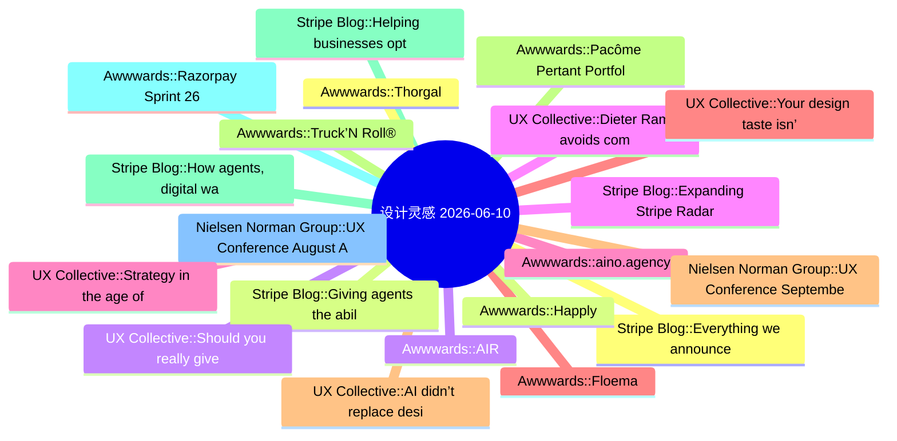

# 🎨 设计灵感精选 25 条 (2026-06-10)

> 6 源聚合：Smashing Magazine · Awwwards · UX Collective · NN/g · Stripe Blog · Material Design

**源分布**: Smashing Magazine=0 · Awwwards=8 · UX Collective=8 · Nielsen Norman Group=5 · Stripe Blog=5 · Material Design=5

## 思维导图

## 精选

### 1. [Stripe Blog] Everything we announced at Sessions 2026
- **链接**: [https://stripe.com/blog/everything-we-announced-at-sessions-2026](https://stripe.com/blog/everything-we-announced-at-sessions-2026)
- **发布**: Wed, 29 Apr 2026 00:00:00 +0000
- **简介**: We’re making Stripe even more programmable; protecting and propelling your business with the strength of the Stripe network; and building economic infrastructure for AI.

### 2. [Stripe Blog] Giving agents the ability to pay
- **链接**: [https://stripe.com/blog/giving-agents-the-ability-to-pay](https://stripe.com/blog/giving-agents-the-ability-to-pay)
- **发布**: Wed, 29 Apr 2026 00:00:00 +0000
- **简介**: Link’s wallet for agents gives agents programmatic access to Link, including the ability to generate a one-time-use card or Shared Payment Token (SPT) backed by the cards and bank accounts already in your wallet. It’s bu

### 3. [Awwwards] AIR
- **链接**: [https://www.awwwards.com/sites/air-1](https://www.awwwards.com/sites/air-1)
- **发布**: Wed, 27 May 2026 00:00:00 +0000
- **简介**: The striking Grade A business center website

### 4. [Stripe Blog] Expanding Stripe Radar to protect more of your business
- **链接**: [https://stripe.com/blog/expanding-stripe-radar-to-protect-more-of-your-business](https://stripe.com/blog/expanding-stripe-radar-to-protect-more-of-your-business)
- **发布**: Wed, 27 May 2026 00:00:00 +0000
- **简介**: Radar now blocks high-risk transactions across all supported payment methods; defends against new fraud types like multi-account abuse and pay-as-you-go abuse, regardless of which payment processor you use; and gives pla

### 5. [Awwwards] aino.agency
- **链接**: [https://www.awwwards.com/sites/aino-agency](https://www.awwwards.com/sites/aino-agency)
- **发布**: Wed, 20 May 2026 00:00:00 +0000
- **简介**: Aino rebuilt their site from scratch to explore what's possible with text as a medium. ASCII, 2D physics, real-time morphing - all at 30kb JS.

### 6. [Awwwards] Floema
- **链接**: [https://www.awwwards.com/sites/floema](https://www.awwwards.com/sites/floema)
- **发布**: Wed, 13 May 2026 00:00:00 +0000
- **简介**: Floema designs and produces sustainable urban furniture and signage for natural spaces. Spaces for people, made for life.

### 7. [Nielsen Norman Group] UX Conference September Announced (Sep 14 - Sep 25)
- **链接**: [https://www.nngroup.com/training/september/?utm_source=rss&utm_medium=feed&utm_campaign=rss-syndication](https://www.nngroup.com/training/september/?utm_source=rss&utm_medium=feed&utm_campaign=rss-syndication)
- **发布**: Wed, 03 Jun 2026 01:25:55 +0000
- **简介**: Take up to 5 in-depth training courses, teaching user experience best practices for successful design. Training focused on long-lasting skills for UX professionals. September 14 - September 25, 2026.

### 8. [Awwwards] Truck’N Roll®
- **链接**: [https://www.awwwards.com/sites/truckn-roll-r](https://www.awwwards.com/sites/truckn-roll-r)
- **发布**: Wed, 03 Jun 2026 00:00:00 +0000
- **简介**: Truck’N Roll® is a logistics company built for the fast world of live entertainment. For over three decades, we’ve been trusted to move the gear behind the biggest tours.

### 9. [Stripe Blog] Helping businesses optimize network costs with the Visa Digital Commerce Authentication Program (DCAP)
- **链接**: [https://stripe.com/blog/helping-businesses-optimize-network-costs-with-visa-digital-commerce-authentication-program](https://stripe.com/blog/helping-businesses-optimize-network-costs-with-visa-digital-commerce-authentication-program)
- **发布**: Wed, 03 Jun 2026 00:00:00 +0000
- **简介**: We moved quickly to help Stripe businesses take advantage of DCAP and capture interchange savings while protecting authorization rates. Here’s what we did.

### 10. [Awwwards] Razorpay Sprint 26
- **链接**: [https://www.awwwards.com/sites/razorpay-sprint-26](https://www.awwwards.com/sites/razorpay-sprint-26)
- **发布**: Tue, 26 May 2026 00:00:00 +0000
- **简介**: An immersive journey into the future of AI-led payments. Razorpay Sprint26 is about 100+ product updates brought to life through 100+ scroll and click triggered interactions.

### 11. [Nielsen Norman Group] UX Conference August Announced (Aug 17 - Aug 28)
- **链接**: [https://www.nngroup.com/training/august/?utm_source=rss&utm_medium=feed&utm_campaign=rss-syndication](https://www.nngroup.com/training/august/?utm_source=rss&utm_medium=feed&utm_campaign=rss-syndication)
- **发布**: Tue, 19 May 2026 06:52:05 +0000
- **简介**: Take up to 5 in-depth training courses, teaching user experience best practices for successful design. Training focused on long-lasting skills for UX professionals. August 17 - August 28, 2026.

### 12. [Awwwards] Thorgal
- **链接**: [https://www.awwwards.com/sites/thorgal](https://www.awwwards.com/sites/thorgal)
- **发布**: Tue, 19 May 2026 00:00:00 +0000
- **简介**: A son of the stars, raised by Vikings, bound to neither. Thorgal, the Franco-Belgian saga by Van Hamme and Rosiński since 1977, now the official interactive edition, from Le Lombard.

### 13. [Awwwards] Happly
- **链接**: [https://www.awwwards.com/sites/happly](https://www.awwwards.com/sites/happly)
- **发布**: Tue, 12 May 2026 00:00:00 +0000
- **简介**: Happly is a mood-based cannabis wellness brand offering precisely dosed, hemp-derived THC gummies designed to support specific everyday experiences.

### 14. [UX Collective] Should you really give AI your whole digital life?
- **链接**: [https://uxdesign.cc/should-you-really-give-ai-your-whole-digital-life-9b0c55df46e2?source=rss----138adf9c44c---4](https://uxdesign.cc/should-you-really-give-ai-your-whole-digital-life-9b0c55df46e2?source=rss----138adf9c44c---4)
- **作者**: Zeeshan Khalid
- **发布**: Tue, 09 Jun 2026 23:04:27 GMT
- **简介**: You&#x2019;ve felt it, haven&#x2019;t you? That tiny pause.Continue reading on UX Collective »

### 15. [UX Collective] Dieter Rams avoids computers. His ten rules still fit designing for AI.
- **链接**: [https://uxdesign.cc/dieter-rams-avoids-computers-his-ten-rules-still-fit-designing-for-ai-499229fd049e?source=rss----138adf9c44c---4](https://uxdesign.cc/dieter-rams-avoids-computers-his-ten-rules-still-fit-designing-for-ai-499229fd049e?source=rss----138adf9c44c---4)
- **作者**: Patrick Neeman
- **发布**: Tue, 09 Jun 2026 23:00:33 GMT

### 16. [UX Collective] Strategy in the age of the machine
- **链接**: [https://uxdesign.cc/strategy-in-the-age-of-the-machine-48ac5b0e5788?source=rss----138adf9c44c---4](https://uxdesign.cc/strategy-in-the-age-of-the-machine-48ac5b0e5788?source=rss----138adf9c44c---4)
- **作者**: Sam Belt
- **发布**: Tue, 09 Jun 2026 11:51:11 GMT

### 17. [UX Collective] Your design taste isn’t a feeling. It’s a prediction about user behavior.
- **链接**: [https://uxdesign.cc/your-design-taste-isnt-a-feeling-it-s-a-prediction-about-user-behavior-7a4a63f5f622?source=rss----138adf9c44c---4](https://uxdesign.cc/your-design-taste-isnt-a-feeling-it-s-a-prediction-about-user-behavior-7a4a63f5f622?source=rss----138adf9c44c---4)
- **作者**: Kai Wong
- **发布**: Tue, 09 Jun 2026 11:46:27 GMT
- **简介**: What DataViz taught me about the importance of explaining designContinue reading on UX Collective »

### 18. [UX Collective] AI didn’t replace designers-it promoted them
- **链接**: [https://uxdesign.cc/ai-didnt-replace-designers-it-promoted-them-5b6d24de4e26?source=rss----138adf9c44c---4](https://uxdesign.cc/ai-didnt-replace-designers-it-promoted-them-5b6d24de4e26?source=rss----138adf9c44c---4)
- **作者**: Lisa Demchenko
- **发布**: Tue, 09 Jun 2026 11:45:44 GMT
- **简介**: How AI is rewriting the product designer&#x2019;s role&#x200A;&#x2014;&#x200A;from spec-maker to system architectContinue reading on UX Collective »

### 19. [Awwwards] Pacôme Pertant Portfolio
- **链接**: [https://www.awwwards.com/sites/pacome-pertant-portfolio](https://www.awwwards.com/sites/pacome-pertant-portfolio)
- **发布**: Tue, 09 Jun 2026 00:00:00 +0000
- **简介**: Pacôme Pertant is a motion and sound designer based in Paris. He plays with rhythm and visual storytelling across 2D and 3D canvases to create emotional content.

### 20. [Stripe Blog] How agents, digital wallets, and trust are rewriting checkout
- **链接**: [https://stripe.com/blog/global-checkout-trends](https://stripe.com/blog/global-checkout-trends)
- **发布**: Tue, 07 Apr 2026 00:00:00 +0000
- **简介**: We analyzed checkout activity across more than 20K businesses, surveyed shoppers and ecommerce leaders, and gathered insights from businesses on the Stripe network to understand what’s changing in online conversion.

### 21. [UX Collective] AI design isn’t ugly. It’s fluent — and that’s the problem.
- **链接**: [https://uxdesign.cc/ai-design-isnt-ugly-it-s-fluent-and-that-s-the-problem-131b2f4eb78c?source=rss----138adf9c44c---4](https://uxdesign.cc/ai-design-isnt-ugly-it-s-fluent-and-that-s-the-problem-131b2f4eb78c?source=rss----138adf9c44c---4)
- **作者**: Takuma Kakehi
- **发布**: Mon, 08 Jun 2026 22:10:58 GMT
- **简介**: Why Claude Design, Lovable, and v0 all wear the same face&#x200A;&#x2014;&#x200A;and what a dynamited St. Louis housing project predicted about it.Continue reading on UX Collective »

### 22. [UX Collective] AI has become the third wheel
- **链接**: [https://uxdesign.cc/ai-has-become-the-third-wheel-ee8e53e06b85?source=rss----138adf9c44c---4](https://uxdesign.cc/ai-has-become-the-third-wheel-ee8e53e06b85?source=rss----138adf9c44c---4)
- **作者**: Michael Buckley
- **发布**: Mon, 08 Jun 2026 22:10:54 GMT

### 23. [UX Collective] The forgotten science behind self-improving companies
- **链接**: [https://uxdesign.cc/the-forgotten-science-behind-self-improving-companies-7af504269d52?source=rss----138adf9c44c---4](https://uxdesign.cc/the-forgotten-science-behind-self-improving-companies-7af504269d52?source=rss----138adf9c44c---4)
- **作者**: Jay Acutt
- **发布**: Mon, 08 Jun 2026 16:06:34 GMT

### 24. [Nielsen Norman Group] How to Get Research Recommendations on the Roadmap
- **链接**: [https://www.nngroup.com/articles/research-recommendations-roadmap/?utm_source=rss&utm_medium=feed&utm_campaign=rss-syndication](https://www.nngroup.com/articles/research-recommendations-roadmap/?utm_source=rss&utm_medium=feed&utm_campaign=rss-syndication)
- **作者**: Laura Klein
- **发布**: Fri, 29 May 2026 17:00:00 +0000
- **简介**: To influence the roadmap: join planning early, learn constraints, tie research to PM metrics, and give clear recommendations at the right time.

### 25. [Nielsen Norman Group] Using RAS to Guide UX Research Resource Allocation and Strategy
- **链接**: [https://www.nngroup.com/articles/ras-research-resource-allocation/?utm_source=rss&utm_medium=feed&utm_campaign=rss-syndication](https://www.nngroup.com/articles/ras-research-resource-allocation/?utm_source=rss&utm_medium=feed&utm_campaign=rss-syndication)
- **作者**: Brian Utesch, Tammi Fitzwater
- **发布**: Fri, 29 May 2026 17:00:00 +0000
- **简介**: RAS helps managers allocate resources based on actual impact, shifting focus from outputs to outcomes and enabling data-driven UX strategies.
