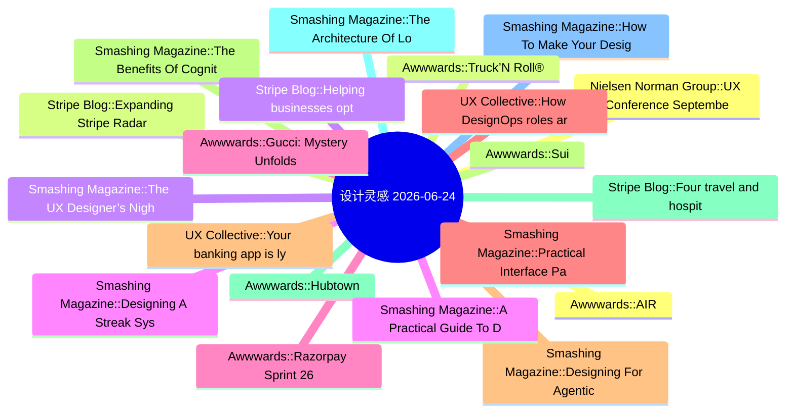

# 🎨 设计灵感精选 25 条 (2026-06-24)

> 6 源聚合：Smashing Magazine · Awwwards · UX Collective · NN/g · Stripe Blog · Material Design

**源分布**: Smashing Magazine=8 · Awwwards=8 · UX Collective=8 · Nielsen Norman Group=5 · Stripe Blog=5 · Material Design=5

## 思维导图

## 精选

### 1. [Awwwards] AIR
- **链接**: [https://www.awwwards.com/sites/air-1](https://www.awwwards.com/sites/air-1)
- **发布**: Wed, 27 May 2026 00:00:00 +0000
- **简介**: The striking Grade A business center website

### 2. [Stripe Blog] Expanding Stripe Radar to protect more of your business
- **链接**: [https://stripe.com/blog/expanding-stripe-radar-to-protect-more-of-your-business](https://stripe.com/blog/expanding-stripe-radar-to-protect-more-of-your-business)
- **发布**: Wed, 27 May 2026 00:00:00 +0000
- **简介**: Radar now blocks high-risk transactions across all supported payment methods; defends against new fraud types like multi-account abuse and pay-as-you-go abuse, regardless of which payment processor you use; and gives pla

### 3. [Smashing Magazine] The UX Designer’s Nightmare: When “Production-Ready” Becomes A Design Deliverable
- **链接**: [https://smashingmagazine.com/2026/04/production-ready-becomes-design-deliverable-ux/](https://smashingmagazine.com/2026/04/production-ready-becomes-design-deliverable-ux/)
- **发布**: Wed, 22 Apr 2026 10:00:00 GMT
- **简介**: In a rush to embrace AI, the industry is redefining what it means to be a UX designer, blurring the line between design and engineering. Carrie Webster explores what’s gained, what’s lost, and why designers need to remai

### 4. [Smashing Magazine] Designing A Streak System: The UX And Psychology Of Streaks
- **链接**: [https://smashingmagazine.com/2026/02/designing-streak-system-ux-psychology/](https://smashingmagazine.com/2026/02/designing-streak-system-ux-psychology/)
- **发布**: Wed, 18 Feb 2026 15:00:00 GMT
- **简介**: What makes streaks so powerful and addictive? To design them well, you need to understand how they align with human psychology. Victor Ayomipo breaks down the UX and design principles behind effective streak systems.

### 5. [Awwwards] Gucci: Mystery Unfolds
- **链接**: [https://www.awwwards.com/sites/gucci-mystery-unfolds](https://www.awwwards.com/sites/gucci-mystery-unfolds)
- **发布**: Wed, 17 Jun 2026 00:00:00 +0000
- **简介**: Gucci transforms La Famiglia into an AI-powered mystery experience powered by Google Gemini, where users investigate through real-time conversations and clues.

### 6. [Smashing Magazine] Practical Interface Patterns For AI Transparency (Part 2)
- **链接**: [https://smashingmagazine.com/2026/05/practical-interface-patterns-ai-transparency/](https://smashingmagazine.com/2026/05/practical-interface-patterns-ai-transparency/)
- **发布**: Wed, 13 May 2026 13:00:00 GMT
- **简介**: Why traditional loading patterns like spinners fail in agentic AI experiences, and how interface patterns that reveal the system’s process, status, and decision-making can improve transparency and build user trust.

### 7. [Smashing Magazine] Designing For Agentic AI: Practical UX Patterns For Control, Consent, And Accountability
- **链接**: [https://smashingmagazine.com/2026/02/designing-agentic-ai-practical-ux-patterns/](https://smashingmagazine.com/2026/02/designing-agentic-ai-practical-ux-patterns/)
- **发布**: Wed, 11 Feb 2026 13:00:00 GMT
- **简介**: Autonomy is an output of a technical system. Trustworthiness is an output of a design process. Here are concrete design patterns, operational frameworks, and organizational practices for building agentic systems that are

### 8. [Smashing Magazine] The Benefits Of Cognitive Inclusion In UX Research
- **链接**: [https://smashingmagazine.com/2026/06/benefits-cognitive-inclusion-ux-research/](https://smashingmagazine.com/2026/06/benefits-cognitive-inclusion-ux-research/)
- **发布**: Wed, 10 Jun 2026 10:00:00 GMT
- **简介**: Findings from an exploratory user research study highlighting the unique insights and practical UX recommendations shared by participants with cognitive disabilities.

### 9. [Awwwards] Hubtown
- **链接**: [https://www.awwwards.com/sites/hubtown](https://www.awwwards.com/sites/hubtown)
- **发布**: Wed, 10 Jun 2026 00:00:00 +0000
- **简介**: Hubtown is one of India's leading real estate developers. Shaping the city of Mumbai for over 40 years.

### 10. [Smashing Magazine] The Architecture Of Local-First Web Development
- **链接**: [https://smashingmagazine.com/2026/05/architecture-local-first-web-development/](https://smashingmagazine.com/2026/05/architecture-local-first-web-development/)
- **发布**: Wed, 06 May 2026 10:00:00 GMT
- **简介**: An honest perspective on building local-first web apps in 2026, written for developers who’ve been doing this long enough to be skeptical of silver bullets.

### 11. [Smashing Magazine] How To Make Your Design System AI-Ready
- **链接**: [https://smashingmagazine.com/2026/06/how-make-design-system-ai-ready/](https://smashingmagazine.com/2026/06/how-make-design-system-ai-ready/)
- **发布**: Wed, 03 Jun 2026 13:00:00 GMT
- **简介**: Practical guide on how to reduce drifts, minimize mistakes, maintain context, and improve the quality of AI-generated prototypes. Brought to you by Design Patterns For AI Interfaces, **friendly video course on UX** and d

### 12. [Nielsen Norman Group] UX Conference September Announced (Sep 14 - Sep 25)
- **链接**: [https://www.nngroup.com/training/september/?utm_source=rss&utm_medium=feed&utm_campaign=rss-syndication](https://www.nngroup.com/training/september/?utm_source=rss&utm_medium=feed&utm_campaign=rss-syndication)
- **发布**: Wed, 03 Jun 2026 01:25:55 +0000
- **简介**: Take up to 5 in-depth training courses, teaching user experience best practices for successful design. Training focused on long-lasting skills for UX professionals. September 14 - September 25, 2026.

### 13. [Awwwards] Truck’N Roll®
- **链接**: [https://www.awwwards.com/sites/truckn-roll-r](https://www.awwwards.com/sites/truckn-roll-r)
- **发布**: Wed, 03 Jun 2026 00:00:00 +0000
- **简介**: Truck’N Roll® is a logistics company built for the fast world of live entertainment. For over three decades, we’ve been trusted to move the gear behind the biggest tours.

### 14. [Stripe Blog] Helping businesses optimize network costs with the Visa Digital Commerce Authentication Program (DCAP)
- **链接**: [https://stripe.com/blog/helping-businesses-optimize-network-costs-with-visa-digital-commerce-authentication-program](https://stripe.com/blog/helping-businesses-optimize-network-costs-with-visa-digital-commerce-authentication-program)
- **发布**: Wed, 03 Jun 2026 00:00:00 +0000
- **简介**: We moved quickly to help Stripe businesses take advantage of DCAP and capture interchange savings while protecting authorization rates. Here’s what we did.

### 15. [Smashing Magazine] A Practical Guide To Design Principles
- **链接**: [https://smashingmagazine.com/2026/04/practical-guide-design-principles/](https://smashingmagazine.com/2026/04/practical-guide-design-principles/)
- **发布**: Wed, 01 Apr 2026 10:00:00 GMT
- **简介**: Design principles with references, examples, and methods for quick look-up. Brought to you by Design Patterns For AI Interfaces, **friendly video courses on UX** and design patterns by Vitaly.

### 16. [Awwwards] Razorpay Sprint 26
- **链接**: [https://www.awwwards.com/sites/razorpay-sprint-26](https://www.awwwards.com/sites/razorpay-sprint-26)
- **发布**: Tue, 26 May 2026 00:00:00 +0000
- **简介**: An immersive journey into the future of AI-led payments. Razorpay Sprint26 is about 100+ product updates brought to life through 100+ scroll and click triggered interactions.

### 17. [UX Collective] How DesignOps roles are changing with new priorities
- **链接**: [https://uxdesign.cc/how-designops-roles-are-changing-with-new-priorities-c8db3a5bc1c3?source=rss----138adf9c44c---4](https://uxdesign.cc/how-designops-roles-are-changing-with-new-priorities-c8db3a5bc1c3?source=rss----138adf9c44c---4)
- **作者**: Kai Wong
- **发布**: Tue, 23 Jun 2026 11:11:43 GMT
- **简介**: Design Vision Matters More than Ever, When AI is Integrating with DesignContinue reading on UX Collective »

### 18. [UX Collective] Your banking app is lying to you
- **链接**: [https://uxdesign.cc/your-banking-app-is-lying-to-you-52959b075823?source=rss----138adf9c44c---4](https://uxdesign.cc/your-banking-app-is-lying-to-you-52959b075823?source=rss----138adf9c44c---4)
- **作者**: Zeeshan Khalid
- **发布**: Tue, 23 Jun 2026 11:09:13 GMT
- **简介**: It shows you a balance. It doesn&#x2019;t show you the future. Here&#x2019;s what happens when AI starts telling the truth.Continue reading on UX Collective »

### 19. [Awwwards] Sui
- **链接**: [https://www.awwwards.com/sites/sui](https://www.awwwards.com/sites/sui)
- **发布**: Tue, 23 Jun 2026 00:00:00 +0000
- **简介**: Sui is a Layer 1 blockchain platform for scalable Web3 applications and decentralized infrastructure. The new brand and website were created to reflect the Sui’s evolving ecosystem.

### 20. [Stripe Blog] Four travel and hospitality trends from HITEC 2026
- **链接**: [https://stripe.com/blog/trends-from-hitec](https://stripe.com/blog/trends-from-hitec)
- **发布**: Tue, 23 Jun 2026 00:00:00 +0000
- **简介**: More than 6,000 hospitality executives and operators gathered in San Antonio last week for the HITEC conference. The big topic: whether the industry’s AI investment is actually working. Across four days and over 50 meeti

### 21. [Nielsen Norman Group] UX Conference August Announced (Aug 17 - Aug 28)
- **链接**: [https://www.nngroup.com/training/august/?utm_source=rss&utm_medium=feed&utm_campaign=rss-syndication](https://www.nngroup.com/training/august/?utm_source=rss&utm_medium=feed&utm_campaign=rss-syndication)
- **发布**: Tue, 19 May 2026 06:52:05 +0000
- **简介**: Take up to 5 in-depth training courses, teaching user experience best practices for successful design. Training focused on long-lasting skills for UX professionals. August 17 - August 28, 2026.

### 22. [Awwwards] Fauna Robotics
- **链接**: [https://www.awwwards.com/sites/fauna-robotics](https://www.awwwards.com/sites/fauna-robotics)
- **发布**: Tue, 16 Jun 2026 00:00:00 +0000
- **简介**: Fauna built Sprout to redefine humanoid robotics around coexistence, not replacement. O0 scaled the core brand into a storytelling system, shaping him as a capable yet playful companion

### 23. [Awwwards] Pacôme Pertant Portfolio
- **链接**: [https://www.awwwards.com/sites/pacome-pertant-portfolio](https://www.awwwards.com/sites/pacome-pertant-portfolio)
- **发布**: Tue, 09 Jun 2026 00:00:00 +0000
- **简介**: Pacôme Pertant is a motion and sound designer based in Paris. He plays with rhythm and visual storytelling across 2D and 3D canvases to create emotional content.

### 24. [Stripe Blog] Solo founding is at an all-time high: Top performers have these traits in common
- **链接**: [https://stripe.com/blog/top-solo-founder-traits](https://stripe.com/blog/top-solo-founder-traits)
- **发布**: Thu, 28 May 2026 00:00:00 +0000
- **简介**: In 2025, solo founders in the top decile generated 61 times the revenue of the median solo founder in their first six months. We analyzed the data to understand what drives that gap.

### 25. [Stripe Blog] What Link data tells us about AI spending
- **链接**: [https://stripe.com/blog/what-link-data-tells-us-about-ai-spending](https://stripe.com/blog/what-link-data-tells-us-about-ai-spending)
- **发布**: Thu, 18 Jun 2026 00:00:00 +0000
- **简介**: We analyzed spending patterns across the 250 million customers paying with Link. We found that Link customers are spending more on AI than they were three months prior, investing heavily in platforms that let them build 
