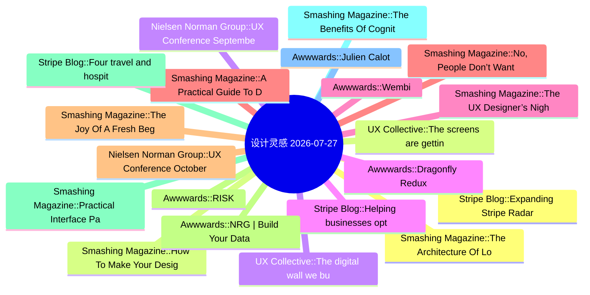

# 🎨 设计灵感精选 25 条 (2026-07-27)

> 6 源聚合：Smashing Magazine · Awwwards · UX Collective · NN/g · Stripe Blog · Material Design

**源分布**: Smashing Magazine=8 · Awwwards=8 · UX Collective=8 · Nielsen Norman Group=5 · Stripe Blog=5 · Material Design=5

## 思维导图

## 精选

### 1. [Stripe Blog] Expanding Stripe Radar to protect more of your business
- **链接**: [https://stripe.com/blog/expanding-stripe-radar-to-protect-more-of-your-business](https://stripe.com/blog/expanding-stripe-radar-to-protect-more-of-your-business)
- **发布**: Wed, 27 May 2026 00:00:00 +0000
- **简介**: Radar now blocks high-risk transactions across all supported payment methods; defends against new fraud types like multi-account abuse and pay-as-you-go abuse, regardless of which payment processor you use; and gives pla

### 2. [UX Collective] The screens are getting demoted
- **链接**: [https://uxdesign.cc/the-screens-are-getting-demoted-6b40120fcf04?source=rss----138adf9c44c---4](https://uxdesign.cc/the-screens-are-getting-demoted-6b40120fcf04?source=rss----138adf9c44c---4)
- **作者**: Serg Zorin
- **发布**: Wed, 22 Jul 2026 22:21:02 GMT

### 3. [UX Collective] The digital wall we built ourselves
- **链接**: [https://uxdesign.cc/the-digital-wall-we-built-ourselves-e9578f774374?source=rss----138adf9c44c---4](https://uxdesign.cc/the-digital-wall-we-built-ourselves-e9578f774374?source=rss----138adf9c44c---4)
- **作者**: Zeeshan Khalid
- **发布**: Wed, 22 Jul 2026 11:17:21 GMT
- **简介**: Why 95.9% of the world&#x2019;s top million sites still fail the people who need them most.Continue reading on UX Collective »

### 4. [Awwwards] Dragonfly Redux
- **链接**: [https://www.awwwards.com/sites/dragonfly-redux](https://www.awwwards.com/sites/dragonfly-redux)
- **发布**: Wed, 22 Jul 2026 00:00:00 +0000
- **简介**: Eight years in crypto, Dragonfly brings access and influence to crypto teams with global aspirations to find adoption anywhere.

### 5. [Smashing Magazine] The UX Designer’s Nightmare: When “Production-Ready” Becomes A Design Deliverable
- **链接**: [https://smashingmagazine.com/2026/04/production-ready-becomes-design-deliverable-ux/](https://smashingmagazine.com/2026/04/production-ready-becomes-design-deliverable-ux/)
- **发布**: Wed, 22 Apr 2026 10:00:00 GMT
- **简介**: In a rush to embrace AI, the industry is redefining what it means to be a UX designer, blurring the line between design and engineering. Carrie Webster explores what’s gained, what’s lost, and why designers need to remai

### 6. [Smashing Magazine] No, People Don’t Want More AI In Their Life
- **链接**: [https://smashingmagazine.com/2026/07/people-dont-want-more-ai/](https://smashingmagazine.com/2026/07/people-dont-want-more-ai/)
- **发布**: Wed, 15 Jul 2026 10:00:00 GMT
- **简介**: Many companies assume everyone craves new AI features. But the reality is that most people don't want more AI &mdash; at least not in the way most AI leaders envision it. Brought to you by Design Patterns For AI Interfac

### 7. [Nielsen Norman Group] UX Conference October Announced (Oct 5 - Oct 16)
- **链接**: [https://www.nngroup.com/training/october/?utm_source=rss&utm_medium=feed&utm_campaign=rss-syndication](https://www.nngroup.com/training/october/?utm_source=rss&utm_medium=feed&utm_campaign=rss-syndication)
- **发布**: Wed, 15 Jul 2026 06:59:07 +0000
- **简介**: Take up to 5 in-depth training courses, teaching user experience best practices for successful design. Training focused on long-lasting skills for UX professionals. October 5- October 16, 2026.

### 8. [Awwwards] RISK
- **链接**: [https://www.awwwards.com/sites/risk](https://www.awwwards.com/sites/risk)
- **发布**: Wed, 15 Jul 2026 00:00:00 +0000
- **简介**: Post Production Studio

### 9. [Smashing Magazine] Practical Interface Patterns For AI Transparency (Part 2)
- **链接**: [https://smashingmagazine.com/2026/05/practical-interface-patterns-ai-transparency/](https://smashingmagazine.com/2026/05/practical-interface-patterns-ai-transparency/)
- **发布**: Wed, 13 May 2026 13:00:00 GMT
- **简介**: Why traditional loading patterns like spinners fail in agentic AI experiences, and how interface patterns that reveal the system’s process, status, and decision-making can improve transparency and build user trust.

### 10. [Smashing Magazine] The Benefits Of Cognitive Inclusion In UX Research
- **链接**: [https://smashingmagazine.com/2026/06/benefits-cognitive-inclusion-ux-research/](https://smashingmagazine.com/2026/06/benefits-cognitive-inclusion-ux-research/)
- **发布**: Wed, 10 Jun 2026 10:00:00 GMT
- **简介**: Findings from an exploratory user research study highlighting the unique insights and practical UX recommendations shared by participants with cognitive disabilities.

### 11. [Awwwards] Julien Calot
- **链接**: [https://www.awwwards.com/sites/julien-calot](https://www.awwwards.com/sites/julien-calot)
- **发布**: Wed, 08 Jul 2026 00:00:00 +0000
- **简介**: Visual artist & multidisciplinary creativeWorks between Paris and New York

### 12. [Smashing Magazine] The Architecture Of Local-First Web Development
- **链接**: [https://smashingmagazine.com/2026/05/architecture-local-first-web-development/](https://smashingmagazine.com/2026/05/architecture-local-first-web-development/)
- **发布**: Wed, 06 May 2026 10:00:00 GMT
- **简介**: An honest perspective on building local-first web apps in 2026, written for developers who’ve been doing this long enough to be skeptical of silver bullets.

### 13. [Smashing Magazine] How To Make Your Design System AI-Ready
- **链接**: [https://smashingmagazine.com/2026/06/how-make-design-system-ai-ready/](https://smashingmagazine.com/2026/06/how-make-design-system-ai-ready/)
- **发布**: Wed, 03 Jun 2026 13:00:00 GMT
- **简介**: Practical guide on how to reduce drifts, minimize mistakes, maintain context, and improve the quality of AI-generated prototypes. Brought to you by Design Patterns For AI Interfaces, **friendly video course on UX** and d

### 14. [Nielsen Norman Group] UX Conference September Announced (Sep 14 - Sep 25)
- **链接**: [https://www.nngroup.com/training/september/?utm_source=rss&utm_medium=feed&utm_campaign=rss-syndication](https://www.nngroup.com/training/september/?utm_source=rss&utm_medium=feed&utm_campaign=rss-syndication)
- **发布**: Wed, 03 Jun 2026 01:25:55 +0000
- **简介**: Take up to 5 in-depth training courses, teaching user experience best practices for successful design. Training focused on long-lasting skills for UX professionals. September 14 - September 25, 2026.

### 15. [Stripe Blog] Helping businesses optimize network costs with the Visa Digital Commerce Authentication Program (DCAP)
- **链接**: [https://stripe.com/blog/helping-businesses-optimize-network-costs-with-visa-digital-commerce-authentication-program](https://stripe.com/blog/helping-businesses-optimize-network-costs-with-visa-digital-commerce-authentication-program)
- **发布**: Wed, 03 Jun 2026 00:00:00 +0000
- **简介**: We moved quickly to help Stripe businesses take advantage of DCAP and capture interchange savings while protecting authorization rates. Here’s what we did.

### 16. [Awwwards] Wembi
- **链接**: [https://www.awwwards.com/sites/wembi](https://www.awwwards.com/sites/wembi)
- **发布**: Wed, 01 Jul 2026 00:00:00 +0000
- **简介**: Wembi instantly improves the performance of any device, machine, or digital system by creating its virtual twin.

### 17. [Smashing Magazine] A Practical Guide To Design Principles
- **链接**: [https://smashingmagazine.com/2026/04/practical-guide-design-principles/](https://smashingmagazine.com/2026/04/practical-guide-design-principles/)
- **发布**: Wed, 01 Apr 2026 10:00:00 GMT
- **简介**: Design principles with references, examples, and methods for quick look-up. Brought to you by Design Patterns For AI Interfaces, **friendly video courses on UX** and design patterns by Vitaly.

### 18. [Smashing Magazine] The Joy Of A Fresh Beginning (April 2026 Wallpapers Edition)
- **链接**: [https://smashingmagazine.com/2026/03/desktop-wallpaper-calendars-april-2026/](https://smashingmagazine.com/2026/03/desktop-wallpaper-calendars-april-2026/)
- **发布**: Tue, 31 Mar 2026 11:00:00 GMT
- **简介**: With the new month just around the corner, could there be a better occasion to freshen up your desktop? If you’re looking for some unique and inspiring wallpapers to accompany you on all those adventures that April may b

### 19. [Awwwards] NRG | Build Your Data Center
- **链接**: [https://www.awwwards.com/sites/nrg-build-your-data-center](https://www.awwwards.com/sites/nrg-build-your-data-center)
- **发布**: Tue, 30 Jun 2026 00:00:00 +0000
- **简介**: Powering the data centers that support what's next. With every AI breakthrough and leap forward, NRG is building a brighter tomorrow.

### 20. [Stripe Blog] Four travel and hospitality trends from HITEC 2026
- **链接**: [https://stripe.com/blog/trends-from-hitec](https://stripe.com/blog/trends-from-hitec)
- **发布**: Tue, 23 Jun 2026 00:00:00 +0000
- **简介**: More than 6,000 hospitality executives and operators gathered in San Antonio last week for the HITEC conference. The big topic: whether the industry’s AI investment is actually working. Across four days and over 50 meeti

### 21. [UX Collective] I handed a UX review over to AI. Here’s what happened.
- **链接**: [https://uxdesign.cc/i-handed-a-ux-review-over-to-ai-heres-what-happened-0511e73e4ffe?source=rss----138adf9c44c---4](https://uxdesign.cc/i-handed-a-ux-review-over-to-ai-heres-what-happened-0511e73e4ffe?source=rss----138adf9c44c---4)
- **作者**: Kolozsi István (kolboid)
- **发布**: Tue, 21 Jul 2026 21:36:57 GMT

### 22. [UX Collective] AI can fake your portfolio. It can’t fake the second question.
- **链接**: [https://uxdesign.cc/ai-can-fake-your-portfolio-it-cant-fake-the-second-question-c89f96626f1c?source=rss----138adf9c44c---4](https://uxdesign.cc/ai-can-fake-your-portfolio-it-cant-fake-the-second-question-c89f96626f1c?source=rss----138adf9c44c---4)
- **作者**: Vlad Derdeicea
- **发布**: Tue, 21 Jul 2026 21:36:22 GMT

### 23. [Awwwards] Lacoste — Polo Factory
- **链接**: [https://www.awwwards.com/sites/lacoste-polo-factory](https://www.awwwards.com/sites/lacoste-polo-factory)
- **发布**: Tue, 21 Jul 2026 00:00:00 +0000
- **简介**: Welcome to the Lacoste Polo Factory. Where polos are born.

### 24. [Stripe Blog] Analyzing the evidence that helps businesses win “product not received” disputes
- **链接**: [https://stripe.com/blog/analyzing-the-evidence-that-helps-businesses-win-product-not-received-disputes](https://stripe.com/blog/analyzing-the-evidence-that-helps-businesses-win-product-not-received-disputes)
- **发布**: Tue, 21 Jul 2026 00:00:00 +0000
- **简介**: To understand what can influence win rates, we analyzed evidence packets from one million disputes over a 16-week period. Here’s what the data shows and what it means for how you mitigate disputes.

### 25. [Awwwards] House of Honey
- **链接**: [https://www.awwwards.com/sites/house-of-honey-1](https://www.awwwards.com/sites/house-of-honey-1)
- **发布**: Tue, 14 Jul 2026 00:00:00 +0000
- **简介**: House of Honey designs spaces with story. We built a sophisticated digital presence that mirrors this sensory philosophy through editorial elegance and fluid interaction.
