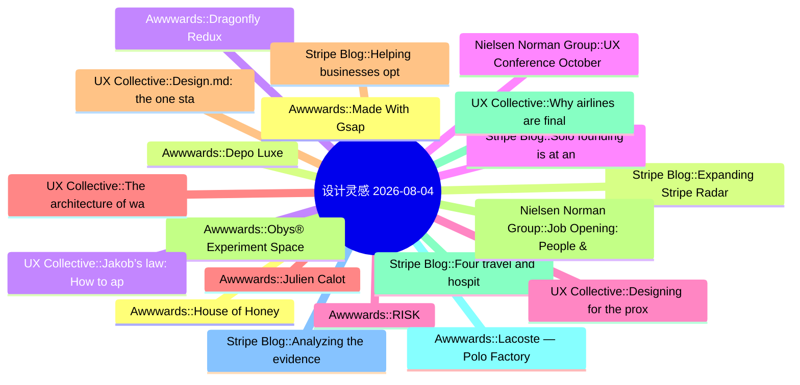

# 🎨 设计灵感精选 25 条 (2026-08-04)

> 6 源聚合：Smashing Magazine · Awwwards · UX Collective · NN/g · Stripe Blog · Material Design

**源分布**: Smashing Magazine=0 · Awwwards=8 · UX Collective=8 · Nielsen Norman Group=5 · Stripe Blog=5 · Material Design=5

## 思维导图

## 精选

### 1. [Awwwards] Made With Gsap
- **链接**: [https://www.awwwards.com/sites/made-with-gsap-1](https://www.awwwards.com/sites/made-with-gsap-1)
- **发布**: Wed, 29 Jul 2026 00:00:00 +0000
- **简介**: Made With Gsap is an ever-growing collection of unique, well-crafted JS effects.

### 2. [Stripe Blog] Expanding Stripe Radar to protect more of your business
- **链接**: [https://stripe.com/blog/expanding-stripe-radar-to-protect-more-of-your-business](https://stripe.com/blog/expanding-stripe-radar-to-protect-more-of-your-business)
- **发布**: Wed, 27 May 2026 00:00:00 +0000
- **简介**: Radar now blocks high-risk transactions across all supported payment methods; defends against new fraud types like multi-account abuse and pay-as-you-go abuse, regardless of which payment processor you use; and gives pla

### 3. [Awwwards] Dragonfly Redux
- **链接**: [https://www.awwwards.com/sites/dragonfly-redux](https://www.awwwards.com/sites/dragonfly-redux)
- **发布**: Wed, 22 Jul 2026 00:00:00 +0000
- **简介**: Eight years in crypto, Dragonfly brings access and influence to crypto teams with global aspirations to find adoption anywhere.

### 4. [Nielsen Norman Group] UX Conference October Announced (Oct 5 - Oct 16)
- **链接**: [https://www.nngroup.com/training/october/?utm_source=rss&utm_medium=feed&utm_campaign=rss-syndication](https://www.nngroup.com/training/october/?utm_source=rss&utm_medium=feed&utm_campaign=rss-syndication)
- **发布**: Wed, 15 Jul 2026 06:59:07 +0000
- **简介**: Take up to 5 in-depth training courses, teaching user experience best practices for successful design. Training focused on long-lasting skills for UX professionals. October 5- October 16, 2026.

### 5. [Awwwards] RISK
- **链接**: [https://www.awwwards.com/sites/risk](https://www.awwwards.com/sites/risk)
- **发布**: Wed, 15 Jul 2026 00:00:00 +0000
- **简介**: Post Production Studio

### 6. [Awwwards] Julien Calot
- **链接**: [https://www.awwwards.com/sites/julien-calot](https://www.awwwards.com/sites/julien-calot)
- **发布**: Wed, 08 Jul 2026 00:00:00 +0000
- **简介**: Visual artist & multidisciplinary creativeWorks between Paris and New York

### 7. [Stripe Blog] Helping businesses optimize network costs with the Visa Digital Commerce Authentication Program (DCAP)
- **链接**: [https://stripe.com/blog/helping-businesses-optimize-network-costs-with-visa-digital-commerce-authentication-program](https://stripe.com/blog/helping-businesses-optimize-network-costs-with-visa-digital-commerce-authentication-program)
- **发布**: Wed, 03 Jun 2026 00:00:00 +0000
- **简介**: We moved quickly to help Stripe businesses take advantage of DCAP and capture interchange savings while protecting authorization rates. Here’s what we did.

### 8. [Awwwards] Obys® Experiment Space
- **链接**: [https://www.awwwards.com/sites/obys-r-experiment-space](https://www.awwwards.com/sites/obys-r-experiment-space)
- **发布**: Tue, 28 Jul 2026 00:00:00 +0000
- **简介**: Obys® Experiment Space is an interactive archive of unpublished works, concepts, experiments, and alternative directions. A collection of ideas rarely seen beyond final case studies.

### 9. [Stripe Blog] Four travel and hospitality trends from HITEC 2026
- **链接**: [https://stripe.com/blog/trends-from-hitec](https://stripe.com/blog/trends-from-hitec)
- **发布**: Tue, 23 Jun 2026 00:00:00 +0000
- **简介**: More than 6,000 hospitality executives and operators gathered in San Antonio last week for the HITEC conference. The big topic: whether the industry’s AI investment is actually working. Across four days and over 50 meeti

### 10. [Awwwards] Lacoste — Polo Factory
- **链接**: [https://www.awwwards.com/sites/lacoste-polo-factory](https://www.awwwards.com/sites/lacoste-polo-factory)
- **发布**: Tue, 21 Jul 2026 00:00:00 +0000
- **简介**: Welcome to the Lacoste Polo Factory. Where polos are born.

### 11. [Stripe Blog] Analyzing the evidence that helps businesses win “product not received” disputes
- **链接**: [https://stripe.com/blog/analyzing-the-evidence-that-helps-businesses-win-product-not-received-disputes](https://stripe.com/blog/analyzing-the-evidence-that-helps-businesses-win-product-not-received-disputes)
- **发布**: Tue, 21 Jul 2026 00:00:00 +0000
- **简介**: To understand what can influence win rates, we analyzed evidence packets from one million disputes over a 16-week period. Here’s what the data shows and what it means for how you mitigate disputes.

### 12. [Awwwards] House of Honey
- **链接**: [https://www.awwwards.com/sites/house-of-honey-1](https://www.awwwards.com/sites/house-of-honey-1)
- **发布**: Tue, 14 Jul 2026 00:00:00 +0000
- **简介**: House of Honey designs spaces with story. We built a sophisticated digital presence that mirrors this sensory philosophy through editorial elegance and fluid interaction.

### 13. [Awwwards] Depo Luxe
- **链接**: [https://www.awwwards.com/sites/depo-luxe](https://www.awwwards.com/sites/depo-luxe)
- **发布**: Tue, 07 Jul 2026 00:00:00 +0000
- **简介**: A strategic and cinematic approach to contemporary luxury

### 14. [UX Collective] Jakob’s law: How to apply it as AI collapses surfaces into one chat box
- **链接**: [https://uxdesign.cc/jakobs-law-how-to-apply-it-as-ai-collapses-surfaces-into-one-chat-box-d8ebc9a727db?source=rss----138adf9c44c---4](https://uxdesign.cc/jakobs-law-how-to-apply-it-as-ai-collapses-surfaces-into-one-chat-box-d8ebc9a727db?source=rss----138adf9c44c---4)
- **作者**: Patrick Neeman
- **发布**: Thu, 30 Jul 2026 22:36:31 GMT

### 15. [Stripe Blog] Solo founding is at an all-time high: Top performers have these traits in common
- **链接**: [https://stripe.com/blog/top-solo-founder-traits](https://stripe.com/blog/top-solo-founder-traits)
- **发布**: Thu, 28 May 2026 00:00:00 +0000
- **简介**: In 2025, solo founders in the top decile generated 61 times the revenue of the median solo founder in their first six months. We analyzed the data to understand what drives that gap.

### 16. [UX Collective] Designing for the proxy
- **链接**: [https://uxdesign.cc/designing-for-the-proxy-2606ffac2335?source=rss----138adf9c44c---4](https://uxdesign.cc/designing-for-the-proxy-2606ffac2335?source=rss----138adf9c44c---4)
- **作者**: Aurélie Radom
- **发布**: Sun, 02 Aug 2026 14:12:49 GMT

### 17. [UX Collective] The architecture of watching work
- **链接**: [https://uxdesign.cc/the-architecture-of-watching-work-dcc521fcad1c?source=rss----138adf9c44c---4](https://uxdesign.cc/the-architecture-of-watching-work-dcc521fcad1c?source=rss----138adf9c44c---4)
- **作者**: Takuma Kakehi
- **发布**: Sun, 02 Aug 2026 10:27:44 GMT
- **简介**: For a century we designed the office around a single question&#x200A;&#x2014;&#x200A;how do we see work? AI is quietly changing the question.Continue reading on UX Collective »

### 18. [UX Collective] Design.md: the one standard file carries your visual identity, for humans and agents
- **链接**: [https://uxdesign.cc/design-md-the-one-standard-file-carries-your-visual-identity-for-humans-and-agents-9058d5b39d9b?source=rss----138adf9c44c---4](https://uxdesign.cc/design-md-the-one-standard-file-carries-your-visual-identity-for-humans-and-agents-9058d5b39d9b?source=rss----138adf9c44c---4)
- **作者**: Patrick Neeman
- **发布**: Sun, 02 Aug 2026 10:27:17 GMT

### 19. [Nielsen Norman Group] Job Opening: People & Culture Generalist (Remote, US Based)
- **链接**: [https://www.nngroup.com/news/item/people-culture-generalist-remote/?utm_source=rss&utm_medium=feed&utm_campaign=rss-syndication](https://www.nngroup.com/news/item/people-culture-generalist-remote/?utm_source=rss&utm_medium=feed&utm_campaign=rss-syndication)
- **发布**: Sat, 01 Aug 2026 19:25:00 +0000
- **简介**: NN/G is hiring a People & Culture Generalist.

This is a fully remote, permanent role running the day-to-day of our People function. Three to five years of People Operations or HR generalist experience.

Applications clo

### 20. [UX Collective] Why airlines are finally waking up to context-aware design
- **链接**: [https://uxdesign.cc/why-airlines-are-finally-waking-up-to-context-aware-design-9cdb67722d03?source=rss----138adf9c44c---4](https://uxdesign.cc/why-airlines-are-finally-waking-up-to-context-aware-design-9cdb67722d03?source=rss----138adf9c44c---4)
- **作者**: Zeeshan Khalid
- **发布**: Sat, 01 Aug 2026 17:17:38 GMT
- **简介**: Your boarding pass has been sitting in that app for three days. But right now, as you sprint through Terminal 5, it&#x2019;s the last thing you&#x2026;Continue reading on UX Collective »

### 21. [UX Collective] Perplexity diverges with color
- **链接**: [https://uxdesign.cc/perplexity-diverges-with-color-cad28cbe7bad?source=rss----138adf9c44c---4](https://uxdesign.cc/perplexity-diverges-with-color-cad28cbe7bad?source=rss----138adf9c44c---4)
- **作者**: Theresa-Marie Rhyne
- **发布**: Sat, 01 Aug 2026 02:47:36 GMT
- **简介**: Building data color schemes with Generative AI.Continue reading on UX Collective »

### 22. [UX Collective] Creative Technologists are moving from the margins to the center
- **链接**: [https://uxdesign.cc/creative-technologists-are-moving-from-the-margins-to-the-center-4fcfaa3cf2f6?source=rss----138adf9c44c---4](https://uxdesign.cc/creative-technologists-are-moving-from-the-margins-to-the-center-4fcfaa3cf2f6?source=rss----138adf9c44c---4)
- **作者**: Ioana Adriana Teleanu
- **发布**: Sat, 01 Aug 2026 02:44:37 GMT

### 23. [UX Collective] IA for AI, The UX of contrast, Battling AI fatigue
- **链接**: [https://uxdesign.cc/ia-for-ai-the-ux-of-contrast-battling-ai-fatigue-4f623495bed8?source=rss----138adf9c44c---4](https://uxdesign.cc/ia-for-ai-the-ux-of-contrast-battling-ai-fatigue-4f623495bed8?source=rss----138adf9c44c---4)
- **作者**: Fabricio Teixeira
- **发布**: Mon, 03 Aug 2026 09:47:06 GMT

### 24. [Nielsen Norman Group] Why You Need Mentorship and How to Get It Right
- **链接**: [https://www.nngroup.com/articles/mentorship/?utm_source=rss&utm_medium=feed&utm_campaign=rss-syndication](https://www.nngroup.com/articles/mentorship/?utm_source=rss&utm_medium=feed&utm_campaign=rss-syndication)
- **作者**: Evan Sunwall
- **发布**: Fri, 31 Jul 2026 17:00:00 +0000
- **简介**: Mentorship is an essential growth tool that offers substantial personal and career benefits, but only if you engage in it properly.

### 25. [Nielsen Norman Group] No New Name Has Replaced “UX”
- **链接**: [https://www.nngroup.com/articles/no-new-name-ux/?utm_source=rss&utm_medium=feed&utm_campaign=rss-syndication](https://www.nngroup.com/articles/no-new-name-ux/?utm_source=rss&utm_medium=feed&utm_campaign=rss-syndication)
- **作者**: Rachel Banawa
- **发布**: Fri, 31 Jul 2026 17:00:00 +0000
- **简介**: A survey of 604 tech and design professionals found that “UX” remains the default name for our field, while alternative names remain fragmented.
