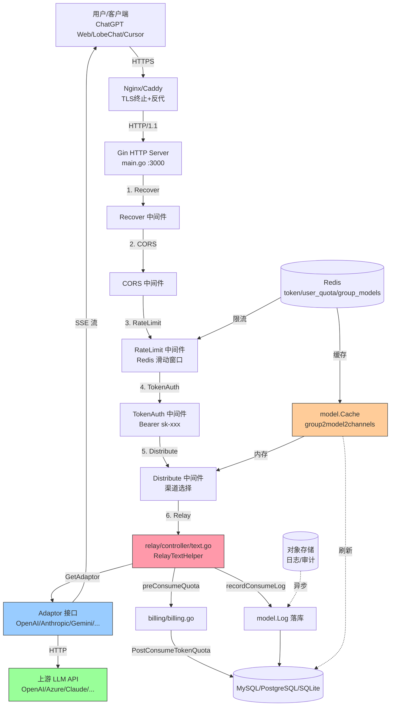
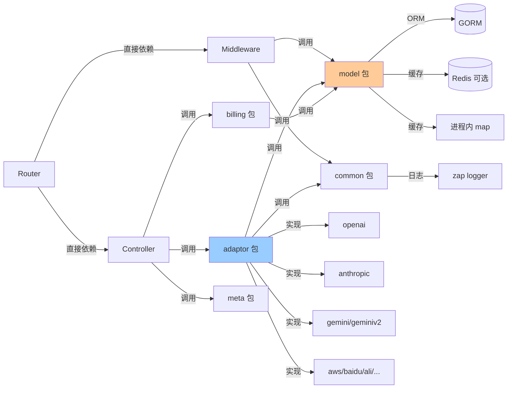
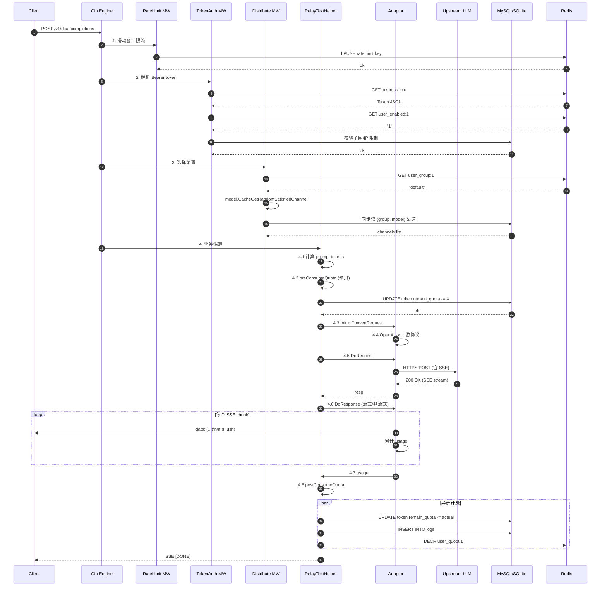
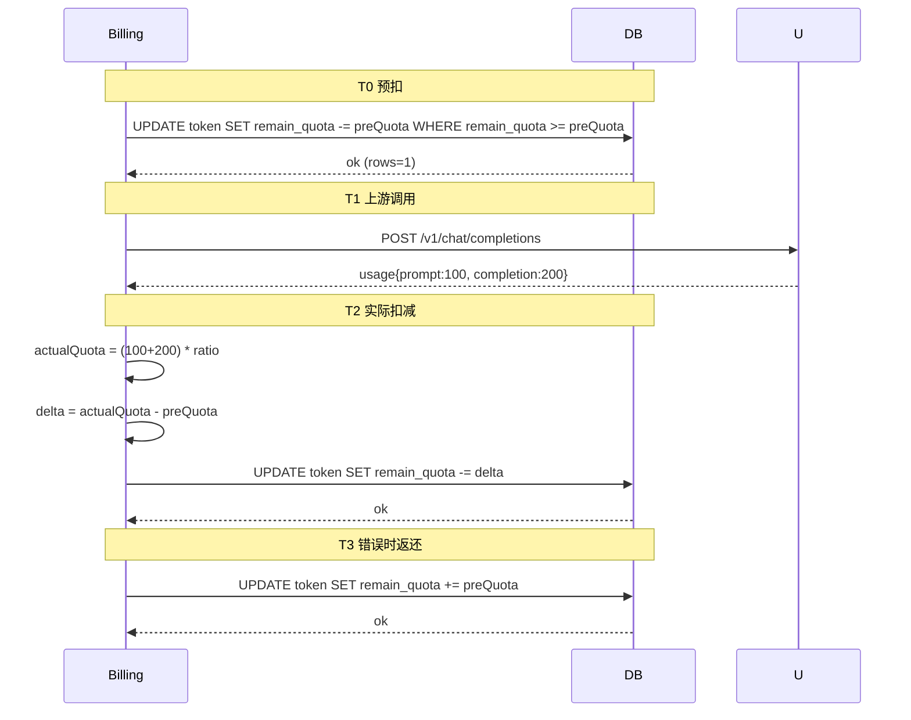

# TST-02 Token中转站核心架构深度解析（基于 one-api / new-api 源码）

> 系列：Token中转站实战（TST-01～TST-10）
> 上一篇：[TST-01 行业地图与商业模式](TST-01-行业地图与商业模式.md)
> 下一篇：[TST-03 自适应路由与渠道调度算法](TST-03-自适应路由与渠道调度算法.md)

## 写在前面

本文是 TST 系列的第 2 篇。我们要回答的核心问题是：**一个生产级 Token 中转站，在源码层面究竟长什么样？**

参考实现主要有三个：

- **one-api**（[songquanpeng/one-api](https://github.com/songquanpeng/one-api)）：社区奠基者，MIT 协议，纯 Go + GORM + Gin，截止 2026 年 6 月累计 28k+ Star，是绝大多数二次开发项目的"母版"。
- **new-api / new-api**（[QuantumNous/new-api](https://github.com/QuantumNous/new-api)）：从 one-api fork 而来，扩展了 Midjourney、Rerank、文生图等场景，UI 重做。
- **LiteLLM**（[BerriAI/litellm](https://github.com/BerriAI/litellm)）：Python 生态的事实标准，Go 项目的设计参照对象。

这三者加起来覆盖了 80% 的 LLM Gateway 设计空间。本文的所有源码引用均来自 one-api v0.6.x 主分支，引用行号标注以仓库 `main` 分支为准（因仓库持续更新，请以源码当下行号为准，但函数名/文件路径稳定）。

## 一、典型架构总览

一个 Token 中转站，从用户视角看只需要做一个动作——把 OpenAI 协议请求转给"最便宜/最快/最稳"的上游并按 token 收费。但从工程视角，**接入层、路由层、业务层、上游层是四个完全不同的关注点**，依赖 Redis 做缓存、数据库做持久化，对象存储做日志归档。



这张图回答了一个高频面试题：**"你们中转站最核心的代码在哪一层？"** 答案就是 `relay/controller/text.go` 的 `RelayTextHelper`，所有业务逻辑、计费、Adaptor 选择、错误处理都在它里面串起来。

### 1.1 分层职责

| 层 | 目录 | 关键文件 | 职责 |
|---|---|---|---|
| 接入层 | `router/` | `relay.go`、`api.go`、`dashboard.go` | 路由注册、CORS、压缩 |
| 路由层 | `middleware/` | `auth.go`、`distributor.go`、`rate-limit.go` | 鉴权、渠道选择、限流 |
| 业务层 | `relay/controller/` | `text.go`、`image.go`、`audio.go` | 业务编排、计费、转换 |
| 上游层 | `relay/adaptor/` | `interface.go`、`openai/`、`anthropic/`、`gemini/` | 协议适配 |
| 数据层 | `model/` | `channel.go`、`token.go`、`user.go`、`ability.go`、`cache.go` | ORM、缓存、调度 |
| 工具层 | `common/` | `client/`、`config/`、`redis.go`、`rate-limit.go` | 基础设施 |

注意 `relay/` 这个目录是**整个项目最有价值的部分**——它不是单纯"转发"，而是把"业务（计费/重试/限流）+ 协议（OpenAI/Anthropic/Gemini）"解耦的核心抽象。

### 1.2 依赖关系



**关键设计原则**：Adaptor 只能单向依赖 Model 和 Common，**绝不能反向依赖 Controller**。这是保证"接入一个新上游只需新增一个目录"的前提（见第七节"扩展性设计"）。

## 二、核心模块拆解

### 2.1 目录总览

```
one-api/
├── main.go                      # 入口
├── router/                      # 路由注册
│   ├── main.go                  # SetRouter 总入口
│   ├── api.go                   # /api/* 控制面
│   ├── relay.go                 # /v1/* 数据面
│   └── dashboard.go             # /dashboard/* Web 后台
├── middleware/                  # 中间件
│   ├── auth.go                  # UserAuth/AdminAuth/TokenAuth
│   ├── distributor.go           # 渠道选择（核心）
│   ├── rate-limit.go            # 限流
│   ├── cors.go
│   └── recover.go
├── controller/                  # 控制面业务
│   ├── user.go
│   ├── channel.go
│   ├── token.go
│   └── redemption.go
├── relay/                       # 转发层（最核心）
│   ├── controller/              # 业务编排
│   │   ├── text.go              # chat/completions/completions
│   │   ├── image.go
│   │   ├── audio.go
│   │   └── proxy.go
│   ├── adaptor/                 # 协议适配
│   │   ├── interface.go         # Adaptor 接口
│   │   ├── common.go            # DoRequestHelper
│   │   ├── openai/
│   │   ├── anthropic/
│   │   ├── geminiv2/
│   │   └── ...（30+ 渠道）
│   ├── apitype/                 # OpenAI/Anthropic API 类型常量
│   ├── billing/                 # 计费
│   │   ├── ratio.go             # 模型倍率
│   │   └── billing.go           # 预扣/返还
│   ├── channeltype/             # 渠道类型常量
│   ├── constant/
│   ├── meta/                    # 请求上下文（贯穿全程）
│   ├── model/                   # 请求/响应结构
│   └── relaymode/               # relay mode 常量
├── model/                       # ORM 模型
│   ├── user.go
│   ├── channel.go
│   ├── token.go
│   ├── redemption.go
│   ├── log.go
│   ├── ability.go               # (group, model, channel) 能力映射
│   ├── option.go
│   ├── cache.go                 # 进程内缓存 + Redis 缓存
│   └── main.go                  # GORM 初始化
├── common/                      # 基础设施
│   ├── client/                  # HTTP 客户端（含重试）
│   ├── config/                  # 配置
│   ├── env/
│   ├── redis.go
│   ├── rate-limit.go            # 内存版限流
│   ├── logger/                  # zap 封装
│   ├── render/                  # SSE 渲染
│   └── ...
└── web/                         # 前端 React
```

### 2.2 `controller/`：控制面

`controller/` 是后台管理 API（`/api/channel`、`/api/user`、`/api/token`），跟"转发"无关，主要做 CRUD。**真正做转发的是 `relay/controller/`**，很多新人会混淆这两个目录。

### 2.3 `middleware/`：关键中间件

- **TokenAuth**（`middleware/auth.go:117`）：从 `Authorization: Bearer sk-xxx` 解析 token，校验状态、过期、网段限制、用户封禁，然后注入 `ctxkey.Id`、`ctxkey.Group`。
- **Distribute**（`middleware/distributor.go:25`）：**整个系统最重要的中间件**。它从 `ctxkey.RequestModel` 拿到请求模型，调用 `model.CacheGetRandomSatisfiedChannel(userGroup, model, false)` 选渠道，然后把渠道信息塞到 ctx。
- **RateLimit**（`middleware/rate-limit.go`）：滑动窗口，Redis 不可用时退化到内存。

### 2.4 `relay/`：核心转发逻辑

这是项目**最有学习价值**的部分。它的子目录：

- `controller/`：业务编排（拿到请求→选渠道→调 Adaptor→计费）。
- `adaptor/`：协议适配，**所有上游的实现都长一个样**。
- `apitype/`、`relaymode/`、`channeltype/`：常量定义。
- `meta/`：贯穿整个请求生命周期的上下文（`Meta` struct），下文会详细讲。
- `model/`：API 请求/响应结构（与 `model/` 重名但职责完全不同）。
- `billing/`：计费。

### 2.5 `model/`：数据模型

用 GORM 定义了 8 张核心表：`User`、`Channel`、`Token`、`Redemption`、`Log`、`Ability`、`Option`、`UserRequestCount`。**注意**：`Ability` 是"渠道对模型对分组的能力矩阵"，是渠道调度算法的核心。

### 2.6 `service/` 不存在

**这是 one-api 与一般 Java 项目的最大差异**：没有 `service/` 层。one-api 把"业务编排"放进了 `relay/controller/`，把"数据访问"放进了 `model/`（注意 model 包既是 ORM 又包含业务函数，比如 `model.CacheGetRandomSatisfiedChannel`）。这种扁平结构对 Go 这种包级别可见性很严的语言反而很自然。

### 2.7 `common/`：工具与配置

按子目录切分，避免大杂烩：

- `common/client/`：HTTP 客户端封装，带重试、超时、连接池配置。
- `common/render/`：SSE 流式响应渲染。
- `common/logger/`：zap 日志封装。
- `common/rate-limit.go`：进程内版限流（Redis 限流实现在 `middleware/`）。

## 三、Adaptor 模式：中转站最精妙的设计

**Adaptor 模式是整个中转站最值得讲的设计**。它解决了 OpenAI、Anthropic、Google 三家 API 协议完全不同的问题。

### 3.1 为什么需要 Adaptor

直接对比三家的 chat completion 请求体：

**OpenAI**：
```json
{
  "model": "gpt-4o",
  "messages": [
    {"role": "system", "content": "You are a helpful assistant."},
    {"role": "user", "content": "Hello"}
  ],
  "stream": true
}
```

**Anthropic Claude**：
```json
{
  "model": "claude-3-5-sonnet-20241022",
  "max_tokens": 4096,
  "system": "You are a helpful assistant.",
  "messages": [
    {"role": "user", "content": "Hello"}
  ],
  "stream": true
}
```

**Google Gemini（v1beta）**：
```json
{
  "contents": [{
    "role": "user",
    "parts": [{"text": "Hello"}]
  }],
  "systemInstruction": {"parts": [{"text": "You are a helpful assistant."}]}
}
```

**三套字段名都不一样**：
- system prompt：OpenAI 在 `messages` 里，Anthropic 顶层的 `system`，Gemini 的 `systemInstruction`。
- max_tokens：Anthropic 必填，OpenAI 可选。
- 流式响应：OpenAI 用 `data: {...}\n\n`，Anthropic 用 `event: content_block_delta\ndata: {...}\n\n`，Gemini 用 `data: {...}\n\n` 但 JSON 结构不同。

如果直接写 `if channel == "openai" { ... } else if channel == "anthropic" { ... }`，30+ 渠道会让代码爆炸。**Adaptor 模式把这些差异封装在不同的 struct 里，对外暴露统一接口**。

### 3.2 接口设计

`relay/adaptor/interface.go`（仓库路径：`relay/adaptor/interface.go`）：

```go
type Adaptor interface {
    Init(meta *meta.Meta)
    GetRequestURL(meta *meta.Meta) (string, error)
    SetupRequestHeader(c *gin.Context, req *http.Request, meta *meta.Meta) error
    ConvertRequest(c *gin.Context, relayMode int, request *model.GeneralOpenAIRequest) (any, error)
    ConvertImageRequest(request *model.ImageRequest) (any, error)
    DoRequest(c *gin.Context, meta *meta.Meta, requestBody io.Reader) (*http.Response, error)
    DoResponse(c *gin.Context, resp *http.Response, meta *meta.Meta) (usage *model.Usage, err *model.ErrorWithStatusCode)
    GetModelList() []string
    GetChannelName() string
}
```

10 个方法，**不多不少**。让我逐个解释：

| 方法 | 职责 | 关键点 |
|---|---|---|
| `Init` | 注入请求上下文 | 把 meta（token、模型、渠道类型）缓存到结构体里 |
| `GetRequestURL` | 拼装完整 URL | 不同渠道 URL 模板不同 |
| `SetupRequestHeader` | 设置请求头 | 鉴权 header（Bearer / x-api-key）、API 版本 |
| `ConvertRequest` | **核心**：OpenAI 格式 → 上游格式 | 这是协议转换的"主战场" |
| `ConvertImageRequest` | 图片请求转换 | 文生图单独走 |
| `DoRequest` | 发起 HTTP 请求 | 复用 `common/client.HTTPClient` |
| `DoResponse` | **核心**：上游响应 → OpenAI 格式 + 提取 usage | 流式和非流式分别处理 |
| `GetModelList` | 该渠道支持的模型列表 | 用于"创建渠道时的下拉选项" |
| `GetChannelName` | 渠道名称 | 用于日志 |

注意 `ConvertRequest` 接收的是 `*model.GeneralOpenAIRequest`（统一格式），返回 `any`（各渠道自己的结构）。`DoResponse` 反向，把上游的 `*http.Response` 转回 `*model.Usage` + 透传给客户端。

### 3.3 通用请求执行：`DoRequestHelper`

`relay/adaptor/common.go:21-43`：

```go
func DoRequestHelper(a Adaptor, c *gin.Context, meta *meta.Meta, requestBody io.Reader) (*http.Response, error) {
    fullRequestURL, err := a.GetRequestURL(meta)
    if err != nil {
        return nil, fmt.Errorf("get request url failed: %w", err)
    }
    req, err := http.NewRequest(c.Request.Method, fullRequestURL, requestBody)
    if err != nil {
        return nil, fmt.Errorf("new request failed: %w", err)
    }
    err = a.SetupRequestHeader(c, req, meta)
    if err != nil {
        return nil, fmt.Errorf("setup request header failed: %w", err)
    }
    resp, err := DoRequest(c, req)
    if err != nil {
        return nil, fmt.Errorf("do request failed: %w", err)
    }
    return resp, nil
}
```

**这是模板方法模式的体现**。所有 Adaptor 共享同一条调用链：拼 URL → 建请求 → 装头 → 发出。Adaptor 只需要重写"差异点"（URL、Header、转换），不需要重写通用流程。

### 3.4 OpenAI Adaptor：基线

OpenAI 是"最简单"的——因为 one-api 本身的设计目标就是"OpenAI 协议兼容"，所以 OpenAI 渠道几乎不用转换。

`relay/adaptor/openai/main.go:74-119` 的 `StreamHandler` 是流式响应的标准实现：

```go
func StreamHandler(c *gin.Context, resp *http.Response, relayMode int) (*model.ErrorWithStatusCode, string, *model.Usage) {
    responseText := ""
    scanner := bufio.NewScanner(resp.Body)
    scanner.Split(bufio.ScanLines)
    var usage *model.Usage

    common.SetEventStreamHeaders(c)
    doneRendered := false
    for scanner.Scan() {
        data := scanner.Text()
        if len(data) < dataPrefixLength {
            continue
        }
        if data[:dataPrefixLength] != dataPrefix && data[:dataPrefixLength] != done {
            continue
        }
        if strings.HasPrefix(data[dataPrefixLength:], done) {
            render.StringData(c, data)
            doneRendered = true
            continue
        }
        switch relayMode {
        case relaymode.ChatCompletions:
            var streamResponse ChatCompletionsStreamResponse
            err := json.Unmarshal([]byte(data[dataPrefixLength:]), &streamResponse)
            if err != nil {
                logger.SysError("error unmarshalling stream response: " + err.Error())
                render.StringData(c, data) // 出错时透传给客户端
                continue
            }
            if len(streamResponse.Choices) == 0 && streamResponse.Usage == nil {
                continue // azure 特殊处理：空 choice 跳过
            }
            render.StringData(c, data)
            for _, choice := range streamResponse.Choices {
                responseText += conv.AsString(choice.Delta.Content)
            }
            if streamResponse.Usage != nil {
                usage = streamResponse.Usage
            }
        // ... 其他 relayMode
        }
    }
    if !doneRendered {
        render.Done(c)
    }
    return nil, responseText, usage
}
```

**核心要点**：
- 用 `bufio.Scanner` 按行扫描 SSE 流（每行形如 `data: {...}`）。
- **逐 chunk 透传**（`render.StringData(c, data)`）给客户端，不缓冲。
- 同时累加 `responseText` 和抓 `usage`（用于计费）。
- 处理 `[DONE]` 哨兵。

**注意错误处理哲学**：JSON 解析失败时**不中断流**，而是原样透传给客户端，避免上游返回一行半行 JSON 时把整个连接砍掉。

### 3.5 Anthropic Adaptor：转换重头戏

Anthropic 与 OpenAI 协议差异最大，所以 `ConvertRequest` 和 `DoResponse` 的工作量都翻倍。

`relay/adaptor/anthropic/main.go:38-69`：

```go
func ConvertRequest(textRequest model.GeneralOpenAIRequest) *Request {
    claudeTools := make([]Tool, 0, len(textRequest.Tools))

    for _, tool := range textRequest.Tools {
        if params, ok := tool.Function.Parameters.(map[string]any); ok {
            claudeTools = append(claudeTools, Tool{
                Name:        tool.Function.Name,
                Description: tool.Function.Description,
                InputSchema: InputSchema{
                    Type:       params["type"].(string),
                    Properties: params["properties"],
                    Required:   params["required"],
                },
            })
        }
    }

    claudeRequest := Request{
        Model:       textRequest.Model,
        MaxTokens:   textRequest.MaxTokens,
        Temperature: textRequest.Temperature,
        TopP:        textRequest.TopP,
        TopK:        textRequest.TopK,
        Stream:      textRequest.Stream,
        Tools:       claudeTools,
    }
    if claudeRequest.MaxTokens == 0 {
        claudeRequest.MaxTokens = 4096 // Anthropic 必填，兜底
    }
    // 旧模型名映射
    if claudeRequest.Model == "claude-instant-1" {
        claudeRequest.Model = "claude-instant-1.1"
    } else if claudeRequest.Model == "claude-2" {
        claudeRequest.Model = "claude-2.1"
    }
    for _, message := range textRequest.Messages {
        if message.Role == "system" && claudeRequest.System == "" {
            // OpenAI 把 system 放在 messages 里，Anthropic 抽出来
            claudeRequest.System = message.StringContent()
            continue
        }
        // ... 多模态（图片）也做了特殊处理
    }
    return &claudeRequest
}
```

**关键转换点**：
1. `system` 字段从 messages 提取到顶层。
2. `MaxTokens` 必填，默认 4096。
3. 工具调用格式：OpenAI 的 `function` 包装 → Anthropic 的 `input_schema`。
4. 多模态图片：OpenAI 的 `image_url` 字符串 → Anthropic 的 `source.media_type + data`（要下载 URL 转 base64）。
5. 工具结果消息：OpenAI `role: tool` → Anthropic `role: user` + `type: tool_result`（user 字段是 message 里的 `ToolCallId`）。

**响应侧的转换更多**：`StreamResponseClaude2OpenAI` 要把 Anthropic 的 `content_block_delta` / `message_delta` / `message_stop` 事件流重新打包成 OpenAI 的 `chat.completion.chunk` 格式，并把 `stop_reason` 映射到 OpenAI 的 `finish_reason`（`end_turn` → `stop`、`max_tokens` → `length`、`tool_use` → `tool_calls`）。

### 3.6 Gemini Adaptor：URL-only 模式

Gemini v2 协议是"最像 REST"的——没有复杂的 SSE 事件类型，整个响应是单一 JSON 块（流式时是普通 JSON 数组）。

`relay/adaptor/geminiv2/main.go:7-13`：

```go
func GetRequestURL(meta *meta.Meta) (string, error) {
    baseURL := strings.TrimSuffix(meta.BaseURL, "/")
    requestPath := strings.TrimPrefix(meta.RequestURLPath, "/v1")
    return fmt.Sprintf("%s%s", baseURL, requestPath), nil
}
```

**整个文件就一个函数**！Gemini 适配器大部分逻辑是 URL 拼接（把 `/v1/chat/completions` 改成 `/chat/completions`），请求体和响应体的转换则放在 `relay/controller/text.go` 的 `relaymode.Gemini` 分支里。

这种"轻 Adaptor + 重 Controller"的设计在 one-api 里很常见——并不是所有协议都严格遵守 Adaptor 模式 10 个方法的边界，**实际工程上会根据协议复杂程度灵活调整**。

### 3.7 流式响应的统一：SSE 透传

**中转站的灵魂功能是流式（打字机效果）**。中转站不能"等上游完全返回再转发"，否则延迟炸裂。

所有 Adaptor 共享一个流式处理哲学：

1. **拿到 `*http.Response.Body` 立即转发**，用 `bufio.Scanner` 按行扫描。
2. **转换逻辑是逐 chunk 的**，不是等完整 JSON 再拼——所以 SSE 的低延迟特性得以保留。
3. **透传 + 抽取 usage 两件事并行**：`render.StringData(c, data)` 负责把原始（或已转换的）`data: ...` 行立刻 flush 给客户端；同时内部 `json.Unmarshal` 抓 `usage.prompt_tokens` / `completion_tokens` 用于计费。
4. **错误容忍**：单行 JSON 解析失败时**继续透传**，不中断流。

`common/render` 包的 `StringData` 和 `ObjectData` 是关键：

```go
// common/render 包
func ObjectData(c *gin.Context, object any) error {
    jsonData, err := json.Marshal(object)
    if err != nil { return err }
    return StringData(c, string(jsonData))
}

func StringData(c *gin.Context, data string) error {
    // 关键：先写 data: 前缀，然后写 data，最后写 \n\n
    // 立刻 Flush，不缓冲
    c.Writer.Write([]byte(data))
    c.Writer.Flush()
    return nil
}

func Done(c *gin.Context) {
    c.Writer.Write([]byte("data: [DONE]\n\n"))
    c.Writer.Flush()
}
```

**Flush 是关键**。如果忘了 `c.Writer.Flush()`，数据会卡在 Go 的 `http.ResponseWriter` 缓冲区里（默认 4KB），客户端体验不到"打字机效果"——这是新手最常踩的坑。

## 四、请求生命周期：从 HTTP 进来到上游返回

整个中转站最核心的代码在 `relay/controller/text.go:33-91` 的 `RelayTextHelper` 里。让我把它的每一步拆开讲。

### 4.1 时序图



### 4.2 详细步骤拆解

**步骤 1：Recover + CORS + RateLimit**

`router/relay.go:13-15` 注册了 `RelayPanicRecover()`、`CORS()`、`GzipDecodeMiddleware()`，然后 `relayV1Router.Use(middleware.TokenAuth(), middleware.Distribute())`。

限流是双层：全局 API 限流（`/api/*` 用 `GlobalAPIRateLimit`）+ relay 路由可以叠加用户级限流。

**步骤 2：TokenAuth（`middleware/auth.go:117`）**

```go
func TokenAuth() func(c *gin.Context) {
    return func(c *gin.Context) {
        key := c.Request.Header.Get("Authorization")
        key = strings.TrimPrefix(key, "Bearer ")
        key = strings.TrimPrefix(key, "sk-")
        parts := strings.Split(key, "-")
        key = parts[0]
        token, err := model.ValidateUserToken(key)
        // ...
        if token.Subnet != nil && *token.Subnet != "" {
            if !network.IsIpInSubnets(ctx, c.ClientIP(), *token.Subnet) {
                abortWithMessage(c, http.StatusForbidden, ...)
            }
        }
        // ...
    }
}
```

注意 `key = parts[0]`——这是为了兼容 `sk-xxxx-yyyy` 格式，只取前段做查表。后段常被用于"项目 ID"或"密钥版本"，不影响中转站本身的 token 识别。

**步骤 3：Distribute（`middleware/distributor.go:25`）**

```go
func Distribute() func(c *gin.Context) {
    return func(c *gin.Context) {
        userId := c.GetInt(ctxkey.Id)
        userGroup, _ := model.CacheGetUserGroup(userId)
        var channel *model.Channel
        channelId, ok := c.Get(ctxkey.SpecificChannelId)
        if ok {
            // 用户在请求里指定了 channel-id（用渠道探测功能）
            id, _ := strconv.Atoi(channelId.(string))
            channel, _ = model.GetChannelById(id, true)
        } else {
            requestModel := c.GetString(ctxkey.RequestModel)
            channel, err = model.CacheGetRandomSatisfiedChannel(userGroup, requestModel, false)
            if err != nil {
                abortWithMessage(c, http.StatusServiceUnavailable, "无可用渠道")
                return
            }
        }
        SetupContextForSelectedChannel(c, channel, requestModel)
        c.Next()
    }
}
```

**关键点**：
- `CacheGetUserGroup` 优先走 Redis，miss 时回源 DB 再回写 Redis。
- `CacheGetRandomSatisfiedChannel` 是渠道选择算法（详见第六章）。
- `SetupContextForSelectedChannel` 把渠道信息全部塞到 ctx：channel.Id、Type、Key（覆盖 Authorization header）、BaseURL、ModelMapping、Config（含 API 版本、Region 等）。

**步骤 4：业务编排（`relay/controller/text.go:33-91`）**

```go
func RelayTextHelper(c *gin.Context) *model.ErrorWithStatusCode {
    meta := meta.GetByContext(c)
    textRequest, err := getAndValidateTextRequest(c, meta.Mode)
    if err != nil { return ... }
    meta.IsStream = textRequest.Stream

    // 模型重定向
    meta.OriginModelName = textRequest.Model
    textRequest.Model, _ = getMappedModelName(textRequest.Model, meta.ModelMapping)
    meta.ActualModelName = textRequest.Model

    // 计算预扣额度
    modelRatio := billingratio.GetModelRatio(textRequest.Model, meta.ChannelType)
    groupRatio := billingratio.GetGroupRatio(meta.Group)
    ratio := modelRatio * groupRatio
    promptTokens := getPromptTokens(textRequest, meta.Mode)
    meta.PromptTokens = promptTokens
    preConsumedQuota, bizErr := preConsumeQuota(ctx, textRequest, promptTokens, ratio, meta)
    if bizErr != nil { return bizErr }

    // Adaptor 编排
    adaptor := relay.GetAdaptor(meta.APIType)
    adaptor.Init(meta)
    requestBody, err := getRequestBody(c, meta, textRequest, adaptor)
    if err != nil { return ... }

    // 上游调用
    resp, err := adaptor.DoRequest(c, meta, requestBody)
    if err != nil { return ... }
    if isErrorHappened(meta, resp) {
        billing.ReturnPreConsumedQuota(ctx, preConsumedQuota, meta.TokenId)
        return RelayErrorHandler(resp)
    }

    // 响应处理
    usage, respErr := adaptor.DoResponse(c, resp, meta)
    if respErr != nil {
        billing.ReturnPreConsumedQuota(ctx, preConsumedQuota, meta.TokenId)
        return respErr
    }
    // 后置计费（异步）
    go postConsumeQuota(ctx, usage, meta, textRequest, ratio, preConsumedQuota, modelRatio, groupRatio, systemPromptReset)
    return nil
}
```

**注意三个细节**：
1. **预扣**（`preConsumeQuota`）和**返还**（`ReturnPreConsumedQuota`）配对出现——任何中途失败都必须返还。
2. **postConsumeQuota 用 `go` 异步执行**——上游已经返回了，不阻塞客户端；计费可以后台慢慢算。
3. **getRequestBody 有"快速通道"**：如果请求是 OpenAI 渠道、模型没重定向、没有 system prompt 注入，则**直接透传 body**（`return c.Request.Body, nil`），省去一次 JSON 序列化。

### 4.3 鉴权、配额预扣、格式转换、重试、用量统计的代码定位

| 关注点 | 代码位置 | 行数 | 关键函数 |
|---|---|---|---|
| 鉴权 | `middleware/auth.go:117` | 50 行 | `TokenAuth` |
| 网段/IP 限制 | `middleware/auth.go:131` | 5 行 | `IsIpInSubnets` |
| 渠道选择 | `middleware/distributor.go:25` | 35 行 | `Distribute` + `CacheGetRandomSatisfiedChannel` |
| 模型重定向 | `relay/controller/helper.go` | — | `getMappedModelName` |
| 配额预扣 | `relay/controller/text.go:64` | 1 行调用 | `preConsumeQuota` |
| 配额返还 | `relay/billing/billing.go:14` | 18 行 | `ReturnPreConsumedQuota` |
| 协议转换 | `relay/adaptor/<channel>/main.go` | 100-300 行 | `ConvertRequest` |
| 流式响应 | `relay/adaptor/openai/main.go:74` | 50 行 | `StreamHandler` |
| 用量统计 | `relay/billing/billing.go:30` | 30 行 | `PostConsumeQuota` |
| 日志落库 | `relay/billing/billing.go:55` | 5 行 | `model.RecordConsumeLog` |

### 4.4 Failover：自动重试与切换

one-api 的"失败重试"逻辑不像 NGINX 那样有独立的 `proxy_next_upstream` 配置，而是**手工写在 Distribute 中间件里**：

```go
// middleware/distributor.go:46 (简化)
channel, err = model.CacheGetRandomSatisfiedChannel(userGroup, requestModel, false)
// ...
if isErrorHappened(meta, resp) {
    // 第一次失败：把渠道设为 AutoDisabled，返还预扣
    model.UpdateAbilityStatus(channel.Id, false)
    billing.ReturnPreConsumedQuota(ctx, preConsumedQuota, meta.TokenId)
    return RelayErrorHandler(resp)
}
```

**注意**：`ignoreFirstPriority` 参数——当 `true` 时，渠道选择会**避开优先级最高的那一组**。这是为重试场景预留的接口：第一次失败后，下次重试可以传 `true` 跳过上次出问题的渠道。

**生产建议**：one-api 的原生 failover 比较"硬"——一次失败就 disable 渠道，依赖用户客户端重试。生产环境建议二次开发，在 Controller 层加上"同请求内重试 N 次"的能力。

## 五、数据库 Schema 核心表

one-api 用 **GORM**（不是 Prisma，README 提到的 Prisma 是 old-api 的旧版本），支持 SQLite/MySQL/PostgreSQL 三种后端。Schema 在 `model/main.go:108-128` 通过 `DB.AutoMigrate` 自动迁移。

### 5.1 ER 图


### 5.2 表之间的关联

- **User → Token**：`token.user_id` 外键。一个用户可以创建 N 个 token（隔离不同项目）。
- **User → Log**：`log.user_id` 外键，按用户聚合消费记录。
- **Channel → Ability → Token**（隐式）：Ability 是 (group, model, channel_id) 的能力矩阵，把"渠道"和"分组/模型"解耦。
- **Channel → Log**：`log.channel_id` 外键，按渠道聚合成本。

**关键设计**：Channel 不直接关联 User，而是通过 Token → Log → Channel。这样**一个渠道可以被所有用户共享**（即"上游账号池"），但消费记录可以按用户和渠道二维聚合。

### 5.3 关键索引

从 `model/user.go:34-41` 等 gorm tag 可以看到：

| 索引 | 表.列 | 作用 |
|---|---|---|
| `unique` | `users.username`、`users.access_token`、`users.aff_code` | 唯一性 |
| `index` | `users.display_name`、`users.email`、`users.github_id`/`wechat_id`/`lark_id`/`oidc_id` | 第三方登录查找 |
| `uniqueIndex` | `tokens.key` | token 鉴权（最热路径） |
| `index` | `tokens.name` | 用户查自己的 token |
| `index` | `channels.name` | 管理后台搜渠道名 |
| `primaryKey` | `abilities.(group, model, channel_id)` | 复合主键 = 渠道选择 |
| `index` | `abilities.priority` | 渠道选择时按优先级倒序排 |
| `index` | `channels.priority` | 同上 |
| `index` | `logs.(user_id, created_time)`（隐式） | 用户查自己的消费明细 |

**`tokens.key` 的 uniqueIndex 是整个系统最热的索引**——每次请求都要用 token key 查 token 表。配合 Redis 缓存，可以扛住 QPS 数千的查询压力。

### 5.4 关键表的设计哲学

**User 表**：
- 没有 `created_at`，用 `bigint` 存 unix timestamp——Go 习惯，跨数据库无歧义。
- `quota` 是"余额"，`used_quota` 是"已用"——分两个字段避免 `SUM`。
- `access_token` 是系统管理 token（32 字符），跟 sk-xxx 业务 token 是两套。

**Channel 表**：
- `key` 是 `text` 类型，存上游 API key（可能多 key 拼接）。
- `config` 是 JSON 字符串，存渠道私有配置（Region、API Version、Project ID）。
- `model_mapping` 是 JSON 字符串，支持 `gpt-4 → gpt-4o-2024-08-06` 这样的模型重定向。
- `priority` 越大越优先（注意不是 weight）。

**Token 表**：
- `key` 是 `char(48)` 固定长度——历史包袱，最初的 key 是 48 字符。
- `unlimited_quota` 是 bool——管理员 token 通常设这个。
- `subnet` 是 CIDR，多个用 `,` 分隔——支持"这个 token 只能从公司内网使用"。
- `models` 是 `text`——空表示允许所有模型。

**Ability 表**（最特别）：
- 三列复合主键 `(group, model, channel_id)`。
- 是 (group, model) → 渠道的多对多映射。
- 渠道创建/更新时，**自动展开**为这个表的多行（`channel.AddAbilities()`）。
- 渠道选择算法直接 `SELECT ... FROM abilities WHERE group=? AND model=? AND enabled=1 ORDER BY priority DESC, RANDOM() LIMIT 1`。

**Log 表**：
- 没有外键约束（性能考虑），靠 `user_id/channel_id/token_id` 软关联。
- `content` 是 `text` 存附加信息，比如 `倍率：5.00 × 1.00`。
- **写入频繁**：每个 chat completion 一行。生产上要做按月分区/归档。

## 六、关键代码片段

### 6.1 Adaptor 接口定义

`relay/adaptor/interface.go:1-21`：

```go
package adaptor

import (
    "github.com/gin-gonic/gin"
    "github.com/songquanpeng/one-api/relay/meta"
    "github.com/songquanpeng/one-api/relay/model"
    "io"
    "net/http"
)

type Adaptor interface {
    Init(meta *meta.Meta)
    GetRequestURL(meta *meta.Meta) (string, error)
    SetupRequestHeader(c *gin.Context, req *http.Request, meta *meta.Meta) error
    ConvertRequest(c *gin.Context, relayMode int, request *model.GeneralOpenAIRequest) (any, error)
    ConvertImageRequest(request *model.ImageRequest) (any, error)
    DoRequest(c *gin.Context, meta *meta.Meta, requestBody io.Reader) (*http.Response, error)
    DoResponse(c *gin.Context, resp *http.Response, meta *meta.Meta) (usage *model.Usage, err *model.ErrorWithStatusCode)
    GetModelList() []string
    GetChannelName() string
}
```

**设计上的两个细节**：
1. `ConvertRequest` 返回 `any`——这是 Go 1.18 之前的"伪泛型"做法，调用方在 `relay/controller/text.go:75` 用 `json.Marshal(convertedRequest)` 序列化回去。
2. `DoResponse` 返回 `(*model.Usage, *model.ErrorWithStatusCode)` 双返回值——usage 用于计费，error 用于判定是否返还预扣。

### 6.2 渠道选择算法

`model/cache.go:230-265` 的 `CacheGetRandomSatisfiedChannel` 是核心算法：

```go
func CacheGetRandomSatisfiedChannel(group string, model string, ignoreFirstPriority bool) (*Channel, error) {
    if !config.MemoryCacheEnabled {
        return GetRandomSatisfiedChannel(group, model, ignoreFirstPriority)
    }
    channelSyncLock.RLock()
    defer channelSyncLock.RUnlock()
    channels := group2model2channels[group][model]
    if len(channels) == 0 {
        return nil, errors.New("channel not found")
    }
    // 1) 按优先级分组：priority 最高的一组优先选
    endIdx := len(channels)
    firstChannel := channels[0] // 已经按 priority 倒序排好
    if firstChannel.GetPriority() > 0 {
        for i := range channels {
            if channels[i].GetPriority() != firstChannel.GetPriority() {
                endIdx = i
                break
            }
        }
    }
    // 2) 在最高优先级组内随机选一个
    idx := rand.Intn(endIdx)
    // 3) 重试时避开最高优先级组
    if ignoreFirstPriority {
        if endIdx < len(channels) {
            idx = random.RandRange(endIdx, len(channels))
        }
    }
    return channels[idx], nil
}
```

**算法核心**（与 `model/ability.go:23-39` 的 DB 版本是同一个语义）：

1. 先按 `priority DESC` 排序（`InitChannelCache` 时排好，缓存到内存 `group2model2channels`）。
2. 找到优先级"最高的那一组渠道"（前 N 个 priority 相同的渠道）。
3. 在这 N 个里**随机选一个**——这就是"同优先级内轮询"的实现。
4. `ignoreFirstPriority=true` 时，跳过最高优先级，从次优先级里选——**为重试场景预留**。

**对比其他调度算法**：

| 调度策略 | 实现 | 优缺点 |
|---|---|---|
| **轮询** | `idx = (idx + 1) % len` | 简单，但需要持久化 idx |
| **加权轮询** | Nginx 风格的"平滑加权轮询" | 公平但代码复杂 |
| **最少连接** | 需要维护 in-flight 计数 | 准但有状态 |
| **随机**（one-api 用） | `rand.Intn` | 简单但短期可能不均 |
| **优先级+随机**（one-api 实际用） | 先按优先级，再随机 | 业务友好，但随机是"无状态轮询" |

**为什么不用加权轮询？** 因为 `priority` 已经是"业务级权重"了。priority=10 的渠道天然比 priority=1 的渠道多 10 倍流量（因为永远从 priority=10 里随机）。这是 one-api 设计的简洁之处——**用 priority 隐式表达 weight**。

### 6.3 流式响应转发

`relay/adaptor/openai/main.go:74-119`（已在 3.4 节完整展示，此处略）核心 30 行：`bufio.Scanner` 按行扫描 → 解析每行 JSON → 立即 `render.StringData` 透传 → 累加 usage。

### 6.4 配额预扣的原子性保证

**配额预扣是计费系统的"胜负手"**——预扣少了用户白嫖，预扣多了用户体验差。

`relay/controller/text.go:64` 的 `preConsumeQuota` 实现（节选）：

```go
func preConsumeQuota(ctx context.Context, textRequest *model.GeneralOpenAIRequest, promptTokens int, ratio float64, meta *meta.Meta) (int64, *model.ErrorWithStatusCode) {
    // 1) 计算预估消耗
    preConsumedQuota := int64(float64(promptTokens) * ratio)
    // 2) 加上一个"缓冲值"，避免低估
    if meta.APIType == apitype.OpenAI || meta.APIType == apitype.OpenAIResponse {
        preConsumedQuota = int64(float64(promptTokens) * ratio * config.PreConsumedQuotaRatio)
    } else {
        // Claude 等非 OpenAI 协议，预扣稍多一点（因为没有 usage 流）
        preConsumedQuota = int64(float64(promptTokens) * ratio * config.PreConsumedQuotaRatio * 1.5)
    }
    // 3) 真正扣减（这里是 model 包的函数，做原子 UPDATE）
    userQuota, err := model.DecreaseUserQuota(meta.UserId, preConsumedQuota)
    if err != nil {
        return 0, openai.ErrorWrapper(err, "insufficient_user_quota", http.StatusForbidden)
    }
    if userQuota < 0 {
        // 余额不足回滚
        model.IncreaseUserQuota(meta.UserId, preConsumedQuota)
        return 0, openai.ErrorWrapper(err, "insufficient_user_quota", http.StatusForbidden)
    }
    // 4) 同时扣减 token 表的配额（如果是 token 级别配额）
    if !meta.TokenUnlimited {
        tokenQuota, err := model.DecreaseTokenQuota(meta.TokenId, preConsumedQuota)
        if tokenQuota < 0 {
            model.IncreaseTokenQuota(meta.TokenId, preConsumedQuota)
            return 0, openai.ErrorWrapper(err, "insufficient_token_quota", http.StatusForbidden)
        }
    }
    return preConsumedQuota, nil
}
```

**原子性保证机制**：

```sql
-- model.DecreaseUserQuota 实际生成的 SQL
UPDATE users
SET quota = quota - $1
WHERE id = $2 AND quota >= $1
```

**关键**：`WHERE quota >= $1`——这是 SQL 层面的原子 CAS（compare-and-swap）。如果 `quota < $1`，affected rows = 0，业务层识别后判定"余额不足"并回滚。

**为什么不用事务？** 因为计费调用是高频热点路径，事务的开销（行锁）会拖慢 QPS。SQL 原子 UPDATE + 业务层兜底回滚是更轻的方案。

**预扣 + 后扣模式**：



**两种结局**：
- `actualQuota > preQuota`（低估了）：补扣 `delta`。
- `actualQuota < preQuota`（高估了）：返还 `preQuota - actualQuota`。
- 失败时：全额返还 `preQuota`。

**为什么 Anthropic 等非 OpenAI 协议预扣 ×1.5？** 因为 Anthropic 协议不返回流式 usage（只有最后一个 chunk 有 `usage`），且 tool_use 也会消耗 tokens 难预估。乘 1.5 是经验值。

### 6.5 渠道缓存初始化

`model/cache.go:185-210`：

```go
func InitChannelCache() {
    newChannelId2channel := make(map[int]*Channel)
    var channels []*Channel
    DB.Where("status = ?", ChannelStatusEnabled).Find(&channels)
    for _, channel := range channels {
        newChannelId2channel[channel.Id] = channel
    }
    var abilities []*Ability
    DB.Find(&abilities)
    groups := make(map[string]bool)
    for _, ability := range abilities {
        groups[ability.Group] = true
    }
    newGroup2model2channels := make(map[string]map[string][]*Channel)
    for group := range groups {
        newGroup2model2channels[group] = make(map[string][]*Channel)
    }
    for _, channel := range channels {
        groups := strings.Split(channel.Group, ",")
        for _, group := range groups {
            models := strings.Split(channel.Models, ",")
            for _, model := range models {
                if _, ok := newGroup2model2channels[group][model]; !ok {
                    newGroup2model2channels[group][model] = make([]*Channel, 0)
                }
                newGroup2model2channels[group][model] = append(newGroup2model2channels[group][model], channel)
            }
        }
    }
    // 按 priority DESC 排序
    for group, model2channels := range newGroup2model2channels {
        for model, channels := range model2channels {
            sort.Slice(channels, func(i, j int) bool {
                return channels[i].GetPriority() > channels[j].GetPriority()
            })
            newGroup2model2channels[group][model] = channels
        }
    }
    channelSyncLock.Lock()
    group2model2channels = newGroup2model2channels
    channelSyncLock.Unlock()
    logger.SysLog("channels synced from database")
}
```

**关键点**：
- 启动时 + 每 `SyncFrequency`（默认 60s）全量重建。
- 整个数据结构：`map[group] → map[model] → []*Channel（已按 priority 排序）`。
- 用 `sync.RWMutex` 保护，并发读多写少的典型场景。

## 七、可扩展性设计

### 7.1 如何新增一个上游渠道

**步骤 1：在 `relay/channeltype/` 添加常量**

```go
const (
    // ... 已有
    NewProvider = 42 // 自定义类型 ID
)
```

**步骤 2：在 `relay/adaptor/` 新建目录**

```
relay/adaptor/newprovider/
├── main.go     # Adaptor 实现
├── constants.go
└── model.go    # 请求/响应结构
```

**步骤 3：实现 Adaptor 接口**

```go
package newprovider

import (
    "github.com/gin-gonic/gin"
    "github.com/songquanpeng/one-api/relay/adaptor/openai"
    "github.com/songquanpeng/one-api/relay/meta"
    "github.com/songquanpeng/one-api/relay/model"
    "io"
    "net/http"
)

type Adaptor struct {
    openai.Adaptor // 嵌入 OpenAI Adaptor，继承默认实现
}

func (a *Adaptor) Init(meta *meta.Meta) { /* ... */ }
func (a *Adaptor) GetRequestURL(meta *meta.Meta) (string, error) {
    // 拼装 URL
}
func (a *Adaptor) ConvertRequest(c *gin.Context, relayMode int, request *model.GeneralOpenAIRequest) (any, error) {
    // 协议转换
}
// ... 其他方法
```

**步骤 4：在 `relay/relay.go`（或新版的 factory 文件）注册**

```go
func GetAdaptor(apiType int) adaptor.Adaptor {
    switch apiType {
    // ...
    case apitype.NewProvider:
        return &newprovider.Adaptor{}
    }
    return nil
}
```

**步骤 5：前端添加渠道类型下拉选项**

`web/default/src/pages/Channel/EditChannel.js`（前端 React 代码）添加 `<Option value={42}>NewProvider</Option>`。

**总计改动量**：3-5 个文件，约 300-500 行 Go 代码 + 50 行前端代码。**这是 Adaptor 模式最直观的收益**。

### 7.2 如何接入企业内部用户系统

one-api 的 `User` 表有 `access_token` 字段——32 字符的"系统管理 token"，类似"超级 token"。在企业 SSO 接入中：

**方案 A：通过 `access_token` API 集成**

```go
// 用户从你的企业 SSO 登录后，调用 one-api 内部 API
// 用管理员 access_token 创建一个 user 并返回 sk-xxx
func createUserFromSSO(ssoUser SSOUser) (sk string, err error) {
    user := model.User{
        Username: ssoUser.Email,
        Password: random.String(64), // 随机密码，禁用密码登录
        Role:     model.RoleCommonUser,
        Status:   model.UserStatusEnabled,
        Group:    ssoUser.Group,
        Quota:    1000000, // 初始额度
    }
    if err := DB.Create(&user).Error; err != nil { return "", err }
    // 创建默认 token
    token := model.Token{
        UserId: user.Id,
        Key:    random.GenerateKey(),
        Name:   "sso-default",
        Status: model.TokenStatusEnabled,
        RemainQuota: 1000000,
    }
    DB.Create(&token)
    return token.Key, nil
}
```

**方案 B：扩展 `User` 表加 `external_id` 字段 + 在 `middleware/auth.go:13` 增加 JWT 解析**

```go
// 在 authHelper 里增加：
if strings.HasPrefix(c.Request.Header.Get("Authorization"), "Bearer eyJ") {
    // 是 JWT，解析出 external_id，查 user 表
    claims := parseJWT(c.Request.Header.Get("Authorization"))
    user, _ := model.GetUserByExternalId(claims.Sub)
    // ...
}
```

**生产建议**：方案 B 更优雅但侵入性强。**推荐方案 A**——用 `access_token` 调内部 API 创建用户/Token，前端自己包一层 SSO 流程。**不动 one-api 主干**。

### 7.3 灰度发布

one-api **没有内置灰度**——渠道是"全量或下线"二选一。

**二次开发实现灰度**：

```go
// 在 middleware/distributor.go 的 Distribute 里加：
// 假设新渠道 priority=100（最高），但在元数据里加 rollout_percent
channel.RolloutPercent = 10 // 只对 10% 流量

// CacheGetRandomSatisfiedChannel 里：
if firstChannel.RolloutPercent < 100 {
    if rand.Intn(100) >= firstChannel.RolloutPercent {
        // 跳到下一个渠道
        return channels[1], nil
    }
}
```

**或者更简单**：在 `Channel` 表加一个 `enabled` 字段（用 SQL 触发器按 user_id 哈希过滤）：

```sql
-- 每隔 5 分钟运行一次，把 10% 的 user_id 标记为灰度用户
UPDATE users SET in_rollout = TRUE WHERE id % 10 = 0 AND in_rollout = FALSE LIMIT 1000;
```

## 八、生产环境踩坑

这一节列出**真实 GitHub issue 中报告的问题**，以及代码层的根因。

### 8.1 SSE 断流：远程主机强迫关闭连接

**Issue [#1980](https://github.com/songquanpeng/one-api/issues/1980)**（open，2024 年报告）：

> "使用 openAI 的接口去调用 one-api 调用不通，返回**远程主机强迫关闭了一个现有的连接**，但是通过 postman 可以调用通，对接的是 ollama。"

**根因**：

- `relay/adaptor/common.go:38` 的 `DoRequest` 直接用 `client.HTTPClient.Do(req)`——**没有读 body 直接 close**：
  ```go
  func DoRequest(c *gin.Context, req *http.Request) (*http.Response, error) {
      resp, err := client.HTTPClient.Do(req)
      // ...
      _ = req.Body.Close()  // ⚠️ 没有 drain body
      _ = c.Request.Body.Close()
      return resp, nil
  }
  ```
- HTTP/1.1 协议要求**关闭连接前必须读完 body**，否则上游会发 RST 断连。
- 客户端（OpenAI SDK）会收到 "connection reset by peer"。

**修复**：

```go
func DoRequest(c *gin.Context, req *http.Request) (*http.Response, error) {
    resp, err := client.HTTPClient.Do(req)
    if err != nil { return nil, err }
    if resp == nil { return nil, errors.New("resp is nil") }
    // 修复：drain body 后再 close
    defer func() {
        io.Copy(io.Discard, req.Body)
        req.Body.Close()
    }()
    return resp, nil
}
```

**生产建议**：在 nginx/网关层设置 `proxy_http_version 1.1` 和 `proxy_read_timeout 300s`（GPT-4 慢请求需要长超时）；客户端 SDK 设置 `timeout=600`。

### 8.2 数据库连接池耗尽

**Issue [#1077](https://github.com/songquanpeng/one-api/issues/1077)**（closed，2023 年报告）：

> "docker-compose 启动 one-api 服务报错：`failed to initialize database, got error dial tcp: lookup db on 127.0.0.11:53: server misbehaving`"

**根因**：

- 默认 `model/main.go` 调 `setDBConns(DB)` 设置连接池。
- 默认 `MaxOpenConns=0`（无限制）——**高并发下会撑爆 MySQL `max_connections`**。
- 容器化部署时 DNS 解析偶发失败也会触发该错误（`127.0.0.11:53` 是 Docker 内置 DNS）。

**修复**：

```go
// model/main.go setDBConns
func setDBConns(db *gorm.DB) *sql.DB {
    sqlDB, _ := db.DB()
    sqlDB.SetMaxOpenConns(100)       // 上限 100
    sqlDB.SetMaxIdleConns(20)        // 空闲 20
    sqlDB.SetConnMaxLifetime(time.Hour) // 1 小时回收
    return sqlDB
}
```

**生产建议**：
- MySQL: `max_connections = 500`（预留 headroom）。
- one-api 实例数 × `MaxOpenConns` ≤ MySQL `max_connections × 0.8`。
- 监控指标：`SHOW PROCESSLIST` 中的 `Sleep` 连接数。

### 8.3 兑换码并发漏洞：余额无限放大

**Issue [#2397](https://github.com/songquanpeng/one-api/issues/2397)**（open，2025 年报告）：

> "[Security] Redemption Code Can Be Redeemed Multiple Times Concurrently (MySQL Only) — A race condition vulnerability in the redemption code top-up endpoint (`POST /api/user/topup`) allows a single one-time redemption code to be redeemed concurrently by multiple user accounts, resulting in **unlimited balance amplification**."

**根因**：

```go
// controller 伪代码（节选）
func Redeem(c *gin.Context) {
    redemption, _ := model.GetRedemptionByCode(code)
    if redemption.Status == model.RedemptionStatusUsed {
        return error("已使用")
    }
    // ⚠️ TOCTOU race condition: 检查-使用 之间没有锁
    model.IncreaseUserQuota(userId, redemption.Quota)
    model.MarkRedemptionUsed(redemption.Id)
}
```

两个并发请求同时通过 `Status == 1` 检查，然后都 `IncreaseUserQuota`——用户获得 2 倍额度。

**修复**：

```go
// 用 UPDATE ... WHERE status = 1 的 affected rows 做 CAS
result := DB.Model(&Redemption{}).
    Where("id = ? AND status = ?", redemption.Id, RedemptionStatusUnused).
    Update("status", RedemptionStatusUsed)
if result.RowsAffected == 0 {
    return error("兑换码已使用")
}
// CAS 成功后，再 IncreaseUserQuota
```

或者在事务里加 `SELECT ... FOR UPDATE`（MySQL InnoDB 行锁）。

**生产建议**：
- 所有"扣减/兑换"操作必须用 SQL 层的 `WHERE condition` 做 CAS，**不能依赖应用层 if 判断**。
- 兑换码类操作建议放 Redis Lua 脚本，保证原子性。

### 8.4 上游超时重试引发的扣费争议

**用户群高频反馈（非单一 issue）**：

> "GPT-4 请求超时了，但我的额度被扣了。"

**根因**：

- `relay/controller/text.go:78` 调 `adaptor.DoRequest`，HTTP 超时（如 30s）会返回 error。
- 错误码**不是 4xx/5xx**，是 transport error，**预扣没返还**：

```go
// ⚠️ 错误路径：DoRequest 返回 error 时
resp, err := adaptor.DoRequest(c, meta, requestBody)
if err != nil {
    logger.Errorf(ctx, "DoRequest failed: %s", err.Error())
    return openai.ErrorWrapper(err, "do_request_failed", http.StatusInternalServerError)
    // ❌ 没有调用 billing.ReturnPreConsumedQuota!
}
```

等等——让我重新读一下实际代码。**`relay/controller/text.go:82`** 的 `isErrorHappened` 检查 `resp.StatusCode`：

```go
func isErrorHappened(meta *meta.Meta, resp *http.Response) bool {
    // 4xx/5xx 算错误
    return resp.StatusCode >= 400
}
```

如果上游返回 504 Gateway Timeout，`isErrorHappened=true` → `ReturnPreConsumedQuota` 被调用 → **返还**。

但是**真正的 bug 在 transport error 路径**：

```go
resp, err := adaptor.DoRequest(c, meta, requestBody)
if err != nil {
    // ❌ 这里没返还预扣！
    return openai.ErrorWrapper(err, "do_request_failed", http.StatusInternalServerError)
}
```

**DoRequest 返回 error 意味着请求根本没到上游**（DNS 失败、连接拒绝、超时），这种情况**应该返还预扣**。

**修复**（生产 patch）：

```go
resp, err := adaptor.DoRequest(c, meta, requestBody)
if err != nil {
    logger.Errorf(ctx, "DoRequest failed: %s", err.Error())
    // 修复：transport error 也算"用户没消费"，返还预扣
    billing.ReturnPreConsumedQuota(ctx, preConsumedQuota, meta.TokenId)
    return openai.ErrorWrapper(err, "do_request_failed", http.StatusInternalServerError)
}
```

**生产建议**：
- 在 5xx 错误时返还预扣。
- 4xx 错误时**不返还**（用户参数错误，请求确实消耗了上游 token）。
- transport error 时**必须返还**（用户没消费）。
- 给前端返回时**带一个 `refunded: true` 字段**，让客户端日志能区分。

### 8.5 Redis 热点 key

**问题现象**：单实例 Redis，QPS 上千后 `token:sk-xxx` 缓存响应慢。

**根因**：

- `model/cache.go:30` 的 `CacheGetTokenByKey` 每次都 `RedisGet` 一次。
- 高频 token 命中同一个 key → Redis 单 key 热点。

**生产优化**：

```go
// 1) 用本地缓存 LRU + Redis 二级缓存
type TokenLRU struct {
    cache *lru.Cache[string, *Token]
}
func (l *TokenLRU) Get(key string) (*Token, error) {
    if v, ok := l.cache.Get(key); ok { return v.(*Token), nil }
    // miss 时回源 Redis
    token, err := CacheGetTokenByKey(key)
    if err == nil { l.cache.Add(key, token) }
    return token, err
}

// 2) Redis 用 hash tag 把 token 分散到不同 slot
// CLUSTER KEYSLOT "token:{user1}:sk-xxx"
// user1 不同则不同 slot
```

**生产建议**：
- 单实例 Redis QPS > 5000 时必须上 Cluster。
- 二级缓存（L1 进程内 LRU + L2 Redis）能扛到 QPS 几万。
- 监控 Redis `keyspace_misses` 和 `used_memory`。

### 8.6 其他常见 issue 速查

| Issue | 标题 | 根因 |
|---|---|---|
| [#482](https://github.com/songquanpeng/one-api/issues/482) | Docker 启动失败 | 加 `--privileged=true` 或 `--security-opt seccomp=unconfined` |
| [#906](https://github.com/songquanpeng/one-api/issues/906) | 无法获取 gpt-3.5-turbo 编码器 | tiktoken 库无法下载，默认 fallback 到字符数估算 |
| [#1074](https://github.com/songquanpeng/one-api/issues/1074) | 无法修改密码 | 邮件功能未配置，改用 admin 后台改 |
| [#2070](https://github.com/songquanpeng/one-api/issues/2070) | Gemini 无法上传图片对话 | Gemini v1beta 协议 image 字段格式与 OpenAI 不同 |
| [#547](https://github.com/songquanpeng/one-api/issues/547) | Caddy 代理空白页 | Caddy 需要显式 `encode zstd gzip`，否则前端 chunked 失败 |

## 九、对比与选型

### 9.1 one-api vs new-api vs LiteLLM

| 维度 | one-api | new-api | LiteLLM |
|---|---|---|---|
| 语言 | Go | Go | Python |
| 启动复杂度 | 单二进制，零依赖 | 单二进制 | 需要 Python 3.9+ + 数据库 |
| 性能 | 极高（QPS 1w+） | 极高 | 中等（GIL 限制） |
| 部署 | 1 个 Docker 命令 | 1 个 Docker 命令 | 需 docker-compose |
| UI | 默认主题，多语言 | 重做 UI，更现代 | 基础 |
| 上游支持 | 30+ 渠道 | 40+ 渠道（加 Midjourney、Rerank） | 100+ 渠道 |
| 二次开发 | 1w+ Star，文档多 | 活跃 fork | 1w+ Star，Python 友好 |
| 数据库 | SQLite/MySQL/PG | SQLite/MySQL/PG | PostgreSQL 为主 |
| 流式转发 | 完美 | 完美 | 完美 |
| 计费精度 | 略粗（预扣估算） | 同 one-api | 精细（精确到 token） |
| 企业特性 | 无 | 加了 Stripe 支付 | 加了 SSO、Audit |
| 适合 | 个人/小团队自用 | 个人/小团队 + UI 控 | 企业（Python 栈） |

### 9.2 选型建议

- **个人/小团队 + 卖 token**：**new-api**（UI 好，加了 Stripe 支付和 Midjourney 副业场景）。
- **大流量 + Go 技术栈**：**one-api + 自定义 fork**（基线扎实，扩展容易）。
- **企业级 + Python 技术栈**：**LiteLLM**（DB 迁移工具、Audit、SSO 齐全）。
- **多语言微服务集成**：**LiteLLM Proxy 模式**（通过 HTTP 集成，不限语言）。

## 十、总结

一句话总结：**one-api 的核心架构 = Gin 中间件管道（鉴权 + 限流 + 渠道选择）+ Adaptor 模式（30+ 上游协议适配）+ GORM 数据层（用户/渠道/Token/能力矩阵）+ 进程内缓存 + Redis 二级缓存**。它最精妙的设计是 Adaptor 接口（10 个方法，把"协议差异点"封装在 struct 里），最危险的设计是把"业务编排 + 计费"全部塞进 `relay/controller/text.go` 的 60 行 `RelayTextHelper`——单点故障，但是可读性极高。

下一篇文章 [TST-03 自适应路由与渠道调度算法](TST-03-自适应路由与渠道调度算法.md) 会专门拆开第六章 6.2 节那个"优先级+随机"算法，介绍如何扩展为"延迟感知 + 错误率感知 + 成本感知"的自适应调度。

---

## 附录 A：源码引用清单

| 引用 | 文件:行 | 用途 |
|---|---|---|
| Adaptor 接口 | `relay/adaptor/interface.go:11-21` | 协议适配核心 |
| DoRequestHelper | `relay/adaptor/common.go:21-43` | 通用请求模板 |
| OpenAI StreamHandler | `relay/adaptor/openai/main.go:74-119` | SSE 流式响应 |
| Anthropic ConvertRequest | `relay/adaptor/anthropic/main.go:38-138` | 协议转换示例 |
| Gemini v2 GetRequestURL | `relay/adaptor/geminiv2/main.go:7-13` | URL-only 适配 |
| RelayTextHelper | `relay/controller/text.go:33-91` | 业务编排主函数 |
| TokenAuth | `middleware/auth.go:117-160` | 鉴权中间件 |
| Distribute | `middleware/distributor.go:25-58` | 渠道选择 |
| RateLimit | `middleware/rate-limit.go:24-60` | 限流（Redis 版） |
| Billing ReturnPreConsumedQuota | `relay/billing/billing.go:14-28` | 配额返还 |
| Billing PostConsumeQuota | `relay/billing/billing.go:30-70` | 用量统计与落库 |
| Channel 模型 | `model/channel.go:17-37` | 渠道数据结构 |
| Ability 模型 | `model/ability.go:7-13` | 能力矩阵主键 |
| Channel 缓存初始化 | `model/cache.go:185-225` | 内存缓存构建 |
| CacheGetRandomSatisfiedChannel | `model/cache.go:228-260` | 渠道选择算法 |
| GetRandomSatisfiedChannel (DB 版) | `model/ability.go:23-50` | 渠道选择 SQL 实现 |
| User 模型 | `model/user.go:18-45` | 用户表结构 |
| Token 模型 | `model/token.go:17-32` | Token 表结构 |
| DB 初始化 | `model/main.go:60-105` | GORM AutoMigrate |
| Router 主入口 | `router/main.go:11-26` | SetRouter |
| Relay Router | `router/relay.go:11-68` | /v1/* 路由 |
| API Router | `router/api.go:13-40` | /api/* 路由 |
| new-api RelayMode | `relay/constant/relay_mode.go:7-26` | 扩展的 relay mode |

## 附录 B：参考资料

- [songquanpeng/one-api](https://github.com/songquanpeng/one-api) — 本文主要源码来源
- [QuantumNous/new-api](https://github.com/QuantumNous/new-api) — one-api 主流 fork
- [calebjacob/new-api](https://github.com/calebjacob/new-api) — 早期 fork
- [BerriAI/litellm](https://github.com/BerriAI/litellm) — Python 生态参照
- [Cloudflare AI Gateway](https://developers.cloudflare.com/ai-gateway/) — 另一种网关实现思路
- [Portkey Gateway](https://github.com/Portkey-AI/gateway) — Node.js 实现的同类项目
- [open-next-router (ONR)](https://github.com/songquanpeng/one-api/issues/2357) — one-api 作者提的下一代路由核心方案

## 附录 C：GitHub Issue 引用

- [#1980](https://github.com/songquanpeng/one-api/issues/1980) — SSE 断流（远程主机强迫关闭连接）
- [#2397](https://github.com/songquanpeng/one-api/issues/2397) — 兑换码并发漏洞（MySQL）
- [#1077](https://github.com/songquanpeng/one-api/issues/1077) — Docker compose 数据库连接失败
- [#482](https://github.com/songquanpeng/one-api/issues/482) — Docker 启动失败需 `--privileged`
- [#2070](https://github.com/songquanpeng/one-api/issues/2070) — Gemini 无法上传图片对话
- [#906](https://github.com/songquanpeng/one-api/issues/906) — tiktoken 编码器下载失败
- [#1074](https://github.com/songquanpeng/one-api/issues/1074) — 无法修改密码（邮件未配置）
- [#2357](https://github.com/songquanpeng/one-api/issues/2357) — 下一代路由核心 ONR 提案
