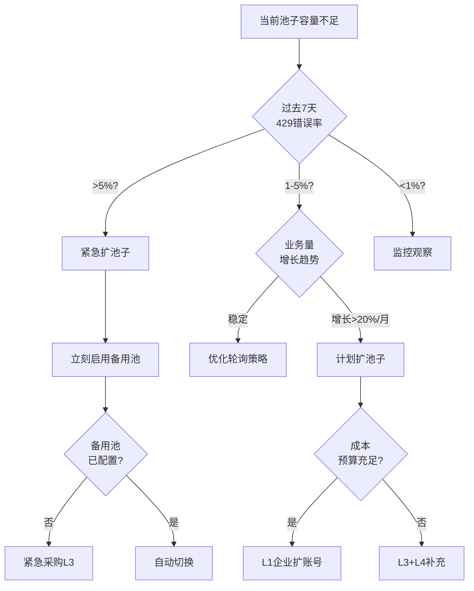
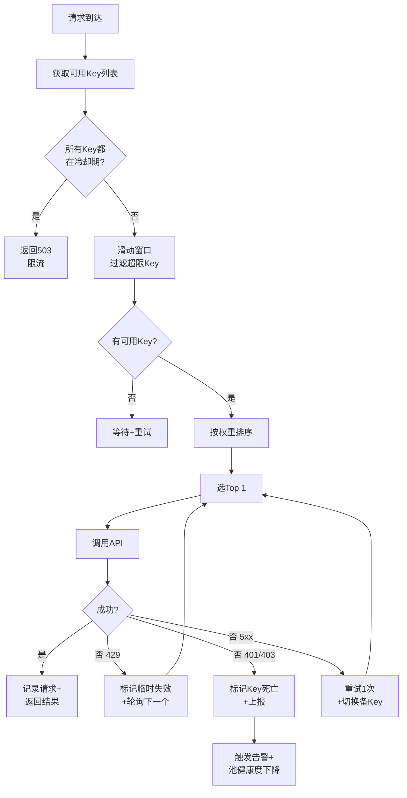

# TST-03 上游Key池管理与防封策略

> 系列：Token中转站从0到1（10篇）
> 上一篇：TST-02 合规边界与法律红线
> 下一篇：TST-04 下游渠道与定价模型

## 写在前面：为什么Key池是生意的命门

做Token中转站这门生意的同行,头三年拼的是"信息差+渠道差",后三年拼的是"运维深度+存活能力"。一个现实:你池子里50个Key,一夜之间被风控扫掉30个,第二天早上打开电脑看到的就是"业务可用率从98%掉到37%"的Dashboard——而你的客户已经在群里@你"为啥又挂了"。

Key池不是"账号列表",它是**有状态的血肉**。每个Key都有自己的额度水位、健康度、限速节奏、过期时间,它们会生病(被限速)、会猝死(被封号)、会衰老(余额耗尽),也会痊愈(申诉成功)。运营Key池的难度,接近运营一个小型机房——你要做容量规划、要做健康检查、要做故障转移、要做成本核算。

本文要解决的5个问题:
1. Key池怎么分层、分级、分供应商?
2. 池子规模多大才算"够用",什么时候该扩?
3. Key怎么轮询才能既快又稳?
4. 账号怎么养才能活得久?
5. 被封了怎么救、怎么转移?

## 一、上游Key池的层级架构

我把上游Key池分成4个层级。**层级越往下,成本越低,风险越高。** 真正赚钱的中转站一定是4层混用,而不是"all in"某一层。

### 1.1 四级供应商全景

| 层级 | 来源 | 采购成本($/1M token) | 稳定性 | 风险 | 合规 |
|------|------|----------------------|--------|------|------|
| L1 官方直签 | OpenAI Enterprise / Anthropic Enterprise | GPT-4o输入$2.5,Claude Sonnet输入$3 | 极高 | 低 | 完全合规 |
| L2 云厂直签 | Azure OpenAI / AWS Bedrock / GCP Vertex | GPT-4o输入$2.5-3,Claude Sonnet输入$3-3.3 | 高 | 中(企业审核) | 合规 |
| L3 平台批发 | OpenRouter / 第三方聚合 | GPT-4o输入$3-5 | 中 | 中(平台可封号) | 半合规 |
| L4 灰产批发 | 2D卡号/中转商/个人开发者转售 | GPT-4o输入$1.5-3 | 极低 | 极高(随时失联) | 不合规 |

### 1.2 L1 官方直签账号

**直签账号 = 真正的"铁饭碗"**。OpenAI Enterprise、Anthropic Enterprise的账号,只要你按ToS使用,基本不会被封。问题是:门槛极高。

**OpenAI Enterprise的进入条件**(2025年现状):
- 年消费承诺(MCV, Minimum Commit Value)通常**$50,000-$250,000/年**
- 需要D&B Number(邓白氏编码),即企业信用号
- 法人实体、EIN(Employer Identification Number)美国公司或非美地区的法律实体
- 与OpenAI Sales签MSA(主服务协议)、SOW(工作说明书)
- 通过OpenAI的合规审查(KYC、UBO最终受益人披露)
- 走Net-30或Net-60账期(不是预付费)

**Anthropic Enterprise的进入条件**:
- 起订门槛比OpenAI低一些,2024年开始**$15,000/年**即可启动
- 需要签BAA(若涉及医疗数据)、DPA(数据处理协议)
- Anthropic会审查你的用例(他们拒绝过武器、监控、赌博类客户)

**真实的"按Token直签"账号**——很多中转站老板其实没搞清楚一件事:**OpenAI的API账号和ChatGPT Team/Enterprise账号是两套体系**。API账号走的是platform.openai.com,ChatGPT走的是chatgpt.com。前者按Token计费,后者按席位计费。封号机制也不一样——API账号被风控一般是"额度异常+IP异常+支付异常"触发;ChatGPT账号被封一般是"内容违规+多账号关联"触发。

L1账号的运营关键点:
- 严格遵守Tier制度(从Tier 1的$5/$100额度,到Tier 5的$50,000/月)
- 绑定企业信用卡或走ACH(银行转账)
- 分配到子组织(Sub-organization)使用,主账号做财务、监控
- 申请专用Rate Limit Tier(可提到RPM 10,000+)

### 1.3 L2 云厂直签账号

**云厂账号 = "曲线救国"的合规选择**。Azure OpenAI、AWS Bedrock、GCP Vertex AI上的API调用,本质上还是OpenAI/Anthropic的模型,但走的是云厂的销售渠道,适用云厂的企业合同。

**Azure OpenAI的核心优势**:
- 国内(中国版Azure)可以直连,延迟低,合规走"数据出境"
- 微软的SLA保障(99.9%可用性)
- 可申请PTU(Provisioned Throughput Units)预付费吞吐量
- 与企业Azure订阅绑定,走CSP(云解决方案提供商)分销有返点

**Azure OpenAI的现实问题**:
- 不是所有模型都有——Sonnet在Azure上叫"Anthropic Claude on Azure",2024年才上线,2025年才补齐所有版本
- 配额审批严格,新订阅默认TPM(每分钟Token)只有几万
- 价格比OpenAI官方略贵(微软抽成5-15%)

**AWS Bedrock**:
- Claude全系列、Llama全系列、Mistral、Stable Diffusion都在
- 走AWS企业账号,有AWS Enterprise Discount Program(EDP)折扣
- 按"模型调用+推理时长"混合计费

**GCP Vertex AI**:
- Claude全系列、Gemini全系列
- 与Google Cloud企业账号绑定
- Gemini有特殊的Batch Prediction模式(便宜50%)

**L2账号的运营关键点**:
- 选一个**主云厂**(一般是Azure,因为国内可直连),签3年承诺拿更低价
- 申请专用Quota(默认太低)
- 用Cloud Billing Budgets设置硬性上限,防止失控
- 监控"未授权调用"——云厂对滥用零容忍

### 1.4 L3 平台批发(OpenRouter、AnyAPI等)

**OpenRouter = L3的标杆**。它本身就是一个聚合器,把OpenAI、Anthropic、Google、Mistral、Meta等几十个模型聚合到一个API端点。你只要注册一个OpenRouter账号,就能调用所有模型。

**OpenRouter的计费模式**:
- 按Token计费,**价格比官方贵2-5%**(OpenRouter抽成)
- 支持预付费(Crypto、信用卡)
- 支持按月订阅(部分模型)
- 提供"bring your own key"模式——你自己有Key,可以上传,但还是要过平台审核

**OpenRouter的真实风险**:
- **平台可封号**。你在OpenRouter上的Key(他们给你生成的"virtual key")是基于你在他们平台的账号。账号被封 = 全部Key失效
- 风控策略不透明,但从社区反馈看,**异常调用模式**(突发流量、地理IP异常)会触发
- 客服响应慢(主要是Discord和邮件,工单几天才有人回)

**其他L3选择**:
- **AnyAPI、API2D、CloseAI**(国内):多模型聚合,人民币结算
- **OpenAI Azure Reseller**(微软CSP):合规但有5-15%加价
- **Together.ai**:专注开源模型(Llama、Mixtral、Qwen)
- **Fireworks AI**:推理优化,价格低20-30%

L3账号的运营关键点:
- **分散风险**——至少3个L3供应商
- 用量控制在单平台总流量的30%以下
- 主备切换自动化(下文轮询策略详述)

### 1.5 L4 灰产批发(2D卡、批发商)

**这一层是灰色地带**。包括:
- 用2D卡(虚拟/盗刷信用卡)注册的OpenAI账号
- 第三方"中转批发商"以低于官方价出售的Key
- 来自俄罗斯、东欧、东南亚的"无限续杯"服务

**L4的真实成本结构**:
- 2D卡开账号:$5-15/个(看卡段和国家)
- 充值$5的OpenAI账户成本:$15-25(包含卡费+号商利润)
- 中转商"5折"卖:$1-2/1M token(看似便宜)

**L4的核心风险**:
1. **封号率极高**——OpenAI的风控对2D卡的检测已经非常成熟,平均存活周期7-30天
2. **资金风险**——批发商跑路是常态,2024年下半年好几个知名2D渠道"突然消失"
3. **法律风险**——用盗刷卡注册的账号被追溯,法律后果是**实实在在的**(美国法律下,信用卡欺诈最高15年监禁)
4. **道德风险**——2D卡背后是真实受害者的信用卡信息

**我的态度**:L4可以**少量试水**(占总流量5%以下),但绝不能作为主力。一旦被OpenAI/Anthropic法务部盯上,关联公司、关联法人都会进入黑名单。

## 二、Key池规模经济学

### 2.1 Key池规模 vs QPS

Key池大小直接决定你能撑住的并发请求数。但更关键的是:**每个Key的RPM(Requests Per Minute)和TPM(Tokens Per Minute)上限**。

**OpenAI Tier 1账号(刚注册,绑定信用卡)**:
- RPM: 3-5(每分钟请求数)
- TPM: 40,000(每分钟Token数)
- 适用:GPT-4o-mini的低强度调用

**OpenAI Tier 5账号(消费$1000+)**:
- RPM: 500-1000
- TPM: 1,000,000+
- 适用:生产级负载

**估算公式**:
```
所需Key数 = max(目标QPS × 60 / Key的RPM, 目标TPS × 平均Token数 × 60 / Key的TPM) × (1 + 安全余量)
```

**实际场景举例**:
- 目标:支撑 100 QPS
- Key:OpenAI Tier 3,RPM 60,TPM 200,000
- 平均每次请求:500 tokens
- 算Token瓶颈:100 × 500 × 60 / 200,000 = 15
- 算RPM瓶颈:100 × 60 / 60 = 100
- 取最大值 100 × 1.3(安全余量)= **130个Key**

### 2.2 池子大小的成本曲线

Key池不是越大越好。**扩到一定规模后,边际成本反而上升**(因为要找新的供应商、新的养号方法)。

| 池子规模 | 月成本(估算) | 典型供应商组合 | 单位成本($/1M token) |
|----------|---------------|----------------|----------------------|
| 1-10个Key | <$5,000 | L1个人+L3 | $3-5 |
| 10-50个Key | $5K-$30K | L1企业+L2+L3 | $2.5-4 |
| 50-200个Key | $30K-$150K | L1+L2为主,L3补充 | $2-3 |
| 200-1000个Key | $150K-$1M | L1企业(主)+L2+L3 | $1.8-2.5 |
| 1000+个Key | $1M+ | L1多账号+L2多账号 | $1.5-2.2 |

**关键拐点**:
- **10个Key以下**:纯L1个人账号就能搞定,无需养号
- **10-50个Key**:需要L1企业+L3组合,开始出现养号需求
- **50-200个Key**:需要专业养号团队或SOP
- **200个Key以上**:必须有"养号工厂"或专门BD渠道
- **1000+**:Key池管理成为核心运营工作,需要专人和工具链

### 2.3 何时该扩池子(决策树)



**实操经验**:
- **不要等429了再扩**——429出现说明业务已经被影响,客户已经在抱怨
- **保持20%容量余量**——池子规模 = 峰值QPS × 1.2
- **每月review**——业务在增长,池子也要按月调整
- **季节性预留**——Black Friday、春节、618前要提前扩

## 三、账号注册与养号(最敏感的部分)

> **本节内容仅供技术研究,实际操作需严格遵守OpenAI/Anthropic的ToS。**
> **任何滥用行为都可能导致账号被封、法律追责。本节不鼓励、不支持任何违规操作。**

### 3.1 注册环境要求

OpenAI和Anthropic的账号注册风控,核心检测4个维度:
1. **IP纯净度**——是否是住宅IP、是否在地理允许范围内
2. **设备指纹**——同一台物理设备/虚拟设备的硬件标识
3. **浏览器指纹**——Canvas、WebGL、字体、User-Agent
4. **行为模式**——鼠标轨迹、点击间隔、表单填写速度

**合规的注册路径**:
- 真实的海外手机号(SMS-Activate、5SIM等接码平台,选主流国家)
- 真实的邮箱(Outlook、Gmail,不要用一次性邮箱)
- 稳定的住宅IP(下文详述)
- 干净的设备(下文详述)

### 3.2 企业账号注册

**美国LLC注册**:
- 在Wyoming、Delaware等州注册LLC($100-300代理费)
- 获得EIN(Employer Identification Number,免费,IRS官网申请)
- 用EIN开通Mercury、Relay等美国企业银行账户
- 用美国银行账户绑定OpenAI/Anthroic支付方式

**英国LTD**:
- 在Companies House注册($20-50代理费)
- 获得VAT号(可选)
- 用Wise或Mercury开英镑账户

**香港公司**:
- 注册香港有限公司($500-1500代理费)
- 获得商业登记证
- 用汇丰、众安银行等开企业账户

**关键时间点**:
- LLC注册:7-15天
- EIN申请:1-2周
- 银行开户:2-4周
- OpenAI企业审核:2-4周

**总耗时:2-3个月,才能拿到第一个合规L1企业账号**。这就是为什么很多中转站"被迫"走L3/L4。

### 3.3 养号SOP(基于社区经验)

下面是社区中流传的"养号SOP",**仅供参考,实操需评估合规风险**。每一步都是为了"模拟一个真实用户"。

```markdown
## 账号养号SOP Checklist

### Day 0:环境准备
- [ ] 准备1台干净的VPS或物理机(不要与被封账号共用环境)
- [ ] 安装指纹浏览器(下文详述)并配置独立的Profile
- [ ] 配置住宅IP(下文详述),选择账号所属国家
- [ ] 准备海外手机号(同国家),预存$5-10
- [ ] 准备Outlook/Gmail(注册时间>6个月,带历史邮件)
- [ ] 准备虚拟信用卡($50-100额度)

### Day 1:注册
- [ ] 上午9-11点(目标国家本地时间)注册
- [ ] 不要用加速器,直接用住宅IP
- [ ] 邮箱验证 → 手机验证 → 信用卡验证,每步间隔2-5分钟
- [ ] 首次充值$5-10,绑定成功后立即关闭弹窗
- [ ] 注册后24小时内不要调用API,只浏览Web界面

### Day 2-7:日常活跃
- [ ] 每天登录1次,浏览文档、Help Center
- [ ] 在Playground发送10-20条不同prompt
- [ ] 每次使用不同长度(20-500 tokens)
- [ ] 不要集中发送长prompt或代码生成(易被风控盯上)
- [ ] 偶尔切换模型(GPT-3.5、GPT-4o、GPT-4o-mini轮着)
- [ ] 加入OpenAI Community,偶尔评论(加分项)

### Day 8-14:轻度调用
- [ ] 每天调用API 50-200次
- [ ] 每次调用间隔3-10秒(不要并发突刺)
- [ ] 每天消费$0.5-2
- [ ] 监控429错误,出现429立即降低频率
- [ ] 不要做prompt injection测试、Jailbreak测试

### Day 15-30:稳定使用
- [ ] 每天调用API 500-2000次
- [ ] 每天消费$5-20
- [ ] 保持IP稳定(不要每天换IP)
- [ ] 保持设备指纹稳定
- [ ] 偶尔休息几个小时(不要24/7不间断)

### Day 30+:生产使用
- [ ] 提升到正常使用强度
- [ ] 保持消费稳定增长
- [ ] 不要突刺(突然从$5/天涨到$200/天)
- [ ] 每月1号检查账单详情
- [ ] 准备备用账号(不要把所有鸡蛋放一个篮子)

### 关键禁忌
- [x] 不要用同一个IP/设备批量注册
- [x] 不要刚注册就高频调用
- [x] 不要调用违规内容(暴力、成人、武器)
- [x] 不要用同一台机器管理>5个账号
- [x] 不要把账号借给不熟悉的人用
- [x] 不要在公共WiFi下使用
```

### 3.4 真实环境详解

**海外手机号(接码平台)**:
- **SMS-Activate**:覆盖200+国家,美国号$1-3/条,英国$0.5-1.5
- **5SIM**:俄罗斯起家,价格类似
- **Grizzly SMS**:欧美号段质量较好
- **TextNow**:免费美国/加拿大号,但OpenAI已不收

**虚拟卡**:
- **WildCard**:国内可用,直接开OpenAI专属卡($15开卡费)
- **Nobepay**(原NobePay):类似
- **Yile**:另一选择

**住宅IP**:
- **Bright Data**(原Luminati):$12-15/GB,质量最高
- **Oxylabs**:$10-12/GB
- **IPRoyal**:$3-5/GB,性价比
- **Smartproxy**:$5-8/GB
- **PIA S5**:最便宜的backconnect选项

**指纹浏览器**:
- **AdsPower**:中文支持好,$5-9/月
- **Multilogin**:老牌,$99/月起
- **GoLogin**:便宜,$24/月
- **比特浏览器**(国内):$0-10/月

## 四、Key轮询策略

### 4.1 轮询(Round Robin)

**最简单也最常用**。把所有Key排成一个环,按顺序分发请求。

```go
package balancer

import (
    "sync"
    "sync/atomic"
)

type RoundRobin struct {
    keys   []string
    cursor uint64
    mu     sync.RWMutex
}

func NewRoundRobin(keys []string) *RoundRobin {
    return &RoundRobin{keys: keys}
}

func (rr *RoundRobin) Next() string {
    rr.mu.RLock()
    defer rr.mu.RUnlock()
    if len(rr.keys) == 0 {
        return ""
    }
    // 原子自增,避免锁竞争
    n := atomic.AddUint64(&rr.cursor, 1)
    return rr.keys[(n-1)%uint64(len(rr.keys))]
}

func (rr *RoundRobin) MarkFailed(key string) {
    // Round Robin不做健康摘除
    // 适合Key完全同质的场景
}
```

**优缺点**:
- 优点:实现极简,分配均匀
- 缺点:不考虑Key的健康度;某个Key突然挂了,会被反复打

### 4.2 加权轮询(Weighted Round Robin)

**给每个Key一个权重,按权重分发**。权重通常 = 该Key剩余额度比例。

```go
package balancer

import (
    "sort"
    "sync"
)

type KeyMeta struct {
    Key     string
    Weight  int   // 1-100,代表剩余额度比例
    Enabled bool
}

type WeightedRR struct {
    keys []*KeyMeta
    mu   sync.RWMutex
    cur  int
}

func (w *WeightedRR) Next() string {
    w.mu.Lock()
    defer w.mu.Unlock()
    
    n := len(w.keys)
    if n == 0 {
        return ""
    }
    
    // 简易加权:权重越高被选概率越大
    for i := 0; i < n; i++ {
        idx := (w.cur + i) % n
        if w.keys[idx].Enabled && w.keys[idx].Weight > 0 {
            w.cur = (idx + 1) % n
            return w.keys[idx].Key
        }
    }
    return ""
}

func (w *WeightedRR) UpdateWeight(key string, weight int) {
    w.mu.Lock()
    defer w.mu.Unlock()
    for _, k := range w.keys {
        if k.Key == key {
            k.Weight = weight
            return
        }
    }
}

// 平滑加权轮询算法(Nginx风格)
type SmoothWWR struct {
    keys []*KeyMeta
    cw   []int  // currentWeight
    mu   sync.Mutex
}

func (s *SmoothWWR) Next() string {
    s.mu.Lock()
    defer s.mu.Unlock()
    
    n := len(s.keys)
    if n == 0 {
        return ""
    }
    if len(s.cw) != n {
        s.cw = make([]int, n)
    }
    
    totalWeight := 0
    maxIdx := -1
    maxCW := -1
    for i, k := range s.keys {
        if !k.Enabled {
            continue
        }
        s.cw[i] += k.Weight
        totalWeight += k.Weight
        if s.cw[i] > maxCW {
            maxCW = s.cw[i]
            maxIdx = i
        }
    }
    if maxIdx < 0 {
        return ""
    }
    s.cw[maxIdx] -= totalWeight
    return s.keys[maxIdx].Key
}
```

### 4.3 最少使用(Least Connections)

**选当前活跃请求数最少的Key**。适合长连接场景。

```go
package balancer

import (
    "sync"
)

type LeastConn struct {
    keys map[string]*keyState
    mu   sync.RWMutex
}

type keyState struct {
    key       string
    active    int
    inFailure bool
    failUntil int64
}

func (lc *LeastConn) Next() string {
    lc.mu.RLock()
    defer lc.mu.RUnlock()
    
    var best *keyState
    for _, ks := range lc.keys {
        if ks.inFailure {
            continue
        }
        if best == nil || ks.active < best.active {
            best = ks
        }
    }
    if best == nil {
        return ""
    }
    return best.key
}

func (lc *LeastConn) Inc(key string) {
    lc.mu.Lock()
    defer lc.mu.Unlock()
    if ks, ok := lc.keys[key]; ok {
        ks.active++
    }
}

func (lc *LeastConn) Dec(key string) {
    lc.mu.Lock()
    defer lc.mu.Unlock()
    if ks, ok := lc.keys[key]; ok {
        if ks.active > 0 {
            ks.active--
        }
    }
}
```

### 4.4 滑动窗口(Sliding Window)

**按"过去N秒内的请求数"限流**。这是OpenAI自己也在用的策略。

```go
package balancer

import (
    "sync"
    "time"
)

type SlidingWindow struct {
    keys    map[string]*windowState
    window  time.Duration  // 例如 60s
    maxRPM  int            // 例如 60
    mu      sync.RWMutex
}

type windowState struct {
    key       string
    requests  []time.Time
    inFailure bool
}

func NewSlidingWindow(window time.Duration, maxRPM int) *SlidingWindow {
    return &SlidingWindow{
        keys:   make(map[string]*windowState),
        window: window,
        maxRPM: maxRPM,
    }
}

func (sw *SlidingWindow) Next() string {
    sw.mu.Lock()
    defer sw.mu.Unlock()
    
    now := time.Now()
    cutoff := now.Add(-sw.window)
    
    var bestKey string
    var bestCount = -1  // 越少越优
    
    for k, ws := range sw.keys {
        if ws.inFailure {
            continue
        }
        // 清理窗口外的旧记录
        valid := ws.requests[:0]
        for _, t := range ws.requests {
            if t.After(cutoff) {
                valid = append(valid, t)
            }
        }
        ws.requests = valid
        
        if len(ws.requests) >= sw.maxRPM {
            continue  // 满了
        }
        if bestCount < 0 || len(ws.requests) < bestCount {
            bestCount = len(ws.requests)
            bestKey = k
        }
    }
    return bestKey
}

func (sw *SlidingWindow) Record(key string) {
    sw.mu.Lock()
    defer sw.mu.Unlock()
    if ws, ok := sw.keys[key]; ok {
        ws.requests = append(ws.requests, time.Now())
    }
}
```

### 4.5 故障转移(Failover)

**主备模式**。平时用主Key,主Key挂了切备Key。

```go
package balancer

import (
    "sync"
    "time"
)

type Failover struct {
    primary  string
    backups  []string
    cur      string
    failAt   time.Time
    coolDown time.Duration  // 冷却时间,例如 30s
    mu       sync.RWMutex
}

func NewFailover(primary string, backups []string) *Failover {
    return &Failover{
        primary:  primary,
        backups:  backups,
        cur:      primary,
        coolDown: 30 * time.Second,
    }
}

func (f *Failover) Next() string {
    f.mu.RLock()
    defer f.mu.RUnlock()
    return f.cur
}

func (f *Failover) MarkFailed(key string) {
    f.mu.Lock()
    defer f.mu.Unlock()
    if key != f.cur {
        return
    }
    // 切换到下一个可用Key
    if f.cur == f.primary {
        f.cur = f.backups[0]
    } else {
        // 在备选里循环
        for i, b := range f.backups {
            if b == f.cur && i+1 < len(f.backups) {
                f.cur = f.backups[i+1]
                return
            }
        }
    }
    f.failAt = time.Now()
}

func (f *Failover) MarkSuccess(key string) {
    f.mu.Lock()
    defer f.mu.Unlock()
    // 主Key恢复成功,可以切回
    if f.cur != f.primary && time.Since(f.failAt) > f.coolDown {
        f.cur = f.primary
    }
}
```

### 4.6 实战组合策略

生产中,最稳的策略是**"滑动窗口+加权轮询+故障转移"的组合**。流程图如下:



## 五、防封核心策略(本节是核心)

防封的本质是**"让风控系统认为你是一个正常用户"**。OpenAI和Anthropic的风控系统都是黑盒,但从社区长期的复盘来看,核心检测维度是:

1. **IP维度**:IP类型(IP类型库)、IP地理、IP信誉、IP使用模式
2. **设备维度**:硬件指纹、操作系统、时区、语言
3. **请求维度**:请求频率、请求内容、并发突刺、长prompt占比
4. **支付维度**:支付方式、续费记录、退款记录
5. **行为维度**:账号活跃度、登录模式、多账号关联

### 5.1 IP隔离:住宅代理池

**机房IP(数据中心IP) = 必死**。OpenAI在2023年就完成了"IP类型库"建设,所有AWS、Azure、GCP、阿里云的IP段都被标记为"high risk"。

**住宅IP的采购**:
- **Bright Data**($12-15/GB):最贵但最稳
- **Oxylabs**($10-12/GB):质量与Bright相当
- **IPRoyal**($3-5/GB):性价比之王
- **Smartproxy**($5-8/GB):中等

**轮换策略**:
- **Sticky Session**:同一个IP保持一段时间(5-30分钟),适合需要登录态的场景
- **Rotating**:每次请求换IP,适合短请求
- **推荐**:**账号管理用Sticky,API调用用Rotating**

**IP池管理**:
```go
package proxy

import (
    "sync"
    "time"
)

type ProxyPool struct {
    proxies []*Proxy
    mu      sync.RWMutex
}

type Proxy struct {
    Addr     string
    Type     string  // residential / datacenter
    Country  string
    UsedAt   time.Time
    UseCount int
    Failed   int
}

func (p *ProxyPool) Get(country string) *Proxy {
    p.mu.Lock()
    defer p.mu.Unlock()
    
    var best *Proxy
    for _, pr := range p.proxies {
        if pr.Country != country {
            continue
        }
        if pr.Failed > 3 {
            continue  // 失败过多,摘除
        }
        if time.Since(pr.UsedAt) < 30*time.Second {
            continue  // 冷却
        }
        if best == nil || pr.UseCount < best.UseCount {
            best = pr
        }
    }
    if best != nil {
        best.UsedAt = time.Now()
        best.UseCount++
    }
    return best
}

func (p *ProxyPool) MarkFailed(addr string) {
    p.mu.Lock()
    defer p.mu.Unlock()
    for _, pr := range p.proxies {
        if pr.Addr == addr {
            pr.Failed++
            return
        }
    }
}
```

**注意**:OpenAI在2024年Q3开始检测"住宅IP的WebRTC泄露"——即使用户用了住宅代理,如果WebRTC泄露了真实的IP,也会被标记。这就是为什么需要"指纹浏览器"。

### 5.2 指纹隔离:浏览器指纹

**Canvas指纹**是OpenAI风控最看重的指标之一。同一台物理机登录不同账号,Canvas指纹相同 = 关联。

**指纹浏览器的核心能力**:
1. **Canvas伪装**:每次启动返回不同的Canvas哈希
2. **WebGL伪装**:伪装GPU型号、驱动版本
3. **字体伪装**:随机注入常见字体
4. **User-Agent伪装**:匹配操作系统的真实UA
5. **WebRTC泄露防护**:禁用WebRTC或用代理IP替换
6. **AudioContext伪装**:音频处理指纹
7. **时区/语言匹配**:与代理IP地理位置一致

**主流指纹浏览器**:
- **AdsPower**($5-9/月/Profile):中文支持好,团队协作功能
- **Multilogin**($99/月起):老牌,反检测最强
- **GoLogin**($24/月):便宜
- **比特浏览器**($0-10/月):国内最便宜

**Profile管理原则**:
- **一个Profile = 一个账号**:严格1:1绑定
- **Profile之间Cookie隔离**:不共享
- **Profile之间本地存储隔离**:不共享localStorage
- **Profile之间Canvas/WebGL独立**

### 5.3 行为模拟:请求间隔、并发、prompt风格

**OpenAI的风控会分析"调用模式是否像人"**。机器调用 vs 人类调用的区别:

| 指标 | 人类调用 | 机器调用 |
|------|----------|----------|
| 请求间隔 | 5-60秒不等,无规律 | 1-2秒,均匀 |
| 一天分布 | 集中在9-22点 | 24/7均匀 |
| prompt长度 | 50-500 tokens常见 | 全部500+ |
| 长prompt占比 | <20% | 50%+ |
| 并发 | 几乎无并发 | 100+并发 |
| 失败重试 | 偶尔重试 | 大量重试 |

**实战中的"人类化"参数**:
```go
type HumanLikeConfig struct {
    MinInterval      time.Duration  // 最小请求间隔,例如 3s
    MaxInterval      time.Duration  // 最大请求间隔,例如 30s
    WorkHoursOnly    bool           // 是否只在工作时间
    WorkHours        [2]int         // [9, 22]
    MaxConcurrency   int            // 最大并发,例如 5
    LongPromptRatio  float64        // 长prompt占比,例如 0.15
    RetryMax         int            // 最大重试次数,例如 2
    RetryBackoff     time.Duration  // 重试退避基数,例如 5s
    BurstLimit       int            // 突刺上限,例如 20
    BurstWindow      time.Duration  // 突刺窗口,例如 60s
}

func defaultHumanConfig() HumanLikeConfig {
    return HumanLikeConfig{
        MinInterval:     3 * time.Second,
        MaxInterval:     30 * time.Second,
        WorkHoursOnly:   false,
        WorkHours:       [2]int{9, 22},
        MaxConcurrency:  5,
        LongPromptRatio: 0.15,
        RetryMax:        2,
        RetryBackoff:    5 * time.Second,
        BurstLimit:      20,
        BurstWindow:     60 * time.Second,
    }
}
```

**prompt风格优化**:
- 让用户的prompt中混合短、中、长三种长度
- 短prompt(<50 tokens)占40%
- 中prompt(50-500 tokens)占45%
- 长prompt(500-2000 tokens)占15%
- 偶尔插入"日常对话型"prompt("今天天气怎么样?","写首诗"),这类prompt对OpenAI是"高分项"

### 5.4 余额监控:自动停用余额低Key

**余额耗尽 = 突然429甚至401**。必须实时监控。

```go
package monitor

import (
    "context"
    "log"
    "sync"
    "time"
)

type BalanceChecker struct {
    channels    map[string]*Channel
    threshold   float64
    mu          sync.RWMutex
    stopCh      chan struct{}
}

type Channel struct {
    ID         string
    Key        string
    Balance    float64
    LastCheck  time.Time
    Enabled    bool
}

func NewBalanceChecker(threshold float64) *BalanceChecker {
    return &BalanceChecker{
        channels:  make(map[string]*Channel),
        threshold: threshold,
        stopCh:    make(chan struct{}),
    }
}

// OpenAI用法:通过 /v1/dashboard/billing/credit_grants 查询余额
func (bc *BalanceChecker) CheckOpenAI(ctx context.Context, ch *Channel) (float64, error) {
    req, _ := http.NewRequestWithContext(ctx, "GET",
        "https://api.openai.com/v1/dashboard/billing/credit_grants", nil)
    req.Header.Set("Authorization", "Bearer "+ch.Key)
    
    resp, err := http.DefaultClient.Do(req)
    if err != nil {
        return 0, err
    }
    defer resp.Body.Close()
    
    var result struct {
        TotalGranted         float64 `json:"total_granted"`
        TotalUsed            float64 `json:"total_used"`
        TotalAvailable       float64 `json:"total_available"`
    }
    json.NewDecoder(resp.Body).Decode(&result)
    
    return result.TotalAvailable, nil
}

func (bc *BalanceChecker) Run(interval time.Duration) {
    ticker := time.NewTicker(interval)
    defer ticker.Stop()
    for {
        select {
        case <-ticker.C:
            bc.mu.RLock()
            channels := make([]*Channel, 0, len(bc.channels))
            for _, c := range bc.channels {
                channels = append(channels, c)
            }
            bc.mu.RUnlock()
            
            for _, c := range channels {
                ctx, cancel := context.WithTimeout(context.Background(), 10*time.Second)
                bal, err := bc.CheckOpenAI(ctx, c)
                cancel()
                if err != nil {
                    log.Printf("balance check failed for %s: %v", c.ID, err)
                    continue
                }
                c.Balance = bal
                c.LastCheck = time.Now()
                if bal < bc.threshold {
                    log.Printf("WARNING: channel %s balance low: $%.2f", c.ID, bal)
                    c.Enabled = false
                    // 上报告警
                }
            }
        case <-bc.stopCh:
            return
        }
    }
}
```

### 5.5 异常熔断:429/5xx检测

**熔断器模式**(Circuit Breaker)是Key池的核心保护机制。

```go
package breaker

import (
    "sync"
    "time"
)

type State int

const (
    StateClosed State = iota  // 正常
    StateOpen                  // 熔断
    StateHalfOpen              // 半开
)

type CircuitBreaker struct {
    key             string
    state           State
    failureCount    int
    successCount    int
    failureThresh   int
    successThresh   int
    openTimeout     time.Duration
    openedAt        time.Time
    mu              sync.Mutex
}

func NewCircuitBreaker(key string) *CircuitBreaker {
    return &CircuitBreaker{
        key:           key,
        state:         StateClosed,
        failureThresh: 5,
        successThresh: 3,
        openTimeout:   30 * time.Second,
    }
}

func (cb *CircuitBreaker) Allow() bool {
    cb.mu.Lock()
    defer cb.mu.Unlock()
    
    switch cb.state {
    case StateClosed:
        return true
    case StateOpen:
        if time.Since(cb.openedAt) > cb.openTimeout {
            cb.state = StateHalfOpen
            cb.successCount = 0
            return true
        }
        return false
    case StateHalfOpen:
        return true
    }
    return false
}

func (cb *CircuitBreaker) OnSuccess() {
    cb.mu.Lock()
    defer cb.mu.Unlock()
    cb.failureCount = 0
    if cb.state == StateHalfOpen {
        cb.successCount++
        if cb.successCount >= cb.successThresh {
            cb.state = StateClosed
        }
    }
}

func (cb *CircuitBreaker) OnFailure() {
    cb.mu.Lock()
    defer cb.mu.Unlock()
    cb.failureCount++
    if cb.state == StateHalfOpen || cb.failureCount >= cb.failureThresh {
        cb.state = StateOpen
        cb.openedAt = time.Now()
    }
}
```

**429检测的微妙之处**:
- OpenAI的429可能是RPM、TPM、RPD(每日请求数)三种
- 响应头里的`x-ratelimit-remaining-requests`、`x-ratelimit-remaining-tokens`是关键
- **预扣减**——看到429不一定是触顶了,也可能是突刺;但要立即降速

### 5.6 申诉与复活流程

**被封号后的48小时,决定一切**。

**OpenAI的申诉流程**:
1. 收到封号邮件,记录"Account ID"和邮件ID
2. 登录platform.openai.com,看具体错误信息
3. 在https://help.openai.com/en/collections/3678480-privacy-and-policy提交申诉
4. 申诉内容模板(英文):

```
Subject: Account Suspension Appeal - [Your Account ID]

Dear OpenAI Support,

I am writing to appeal the suspension of my account [Account ID] which 
was suspended on [Date] for [reason from email].

I believe this suspension may be a result of:
- Unusual activity from my IP address (I was using a VPN while traveling)
- Unusual payment activity (recent card change)
- Automated system false positive

I have been a paying customer since [date], and my usage has been 
consistent with [describe legitimate use case]. I have:
- Always complied with OpenAI's Terms of Service
- Never generated prohibited content
- Used the API only for [specific use case]

To verify my identity, I can provide:
- Government-issued ID
- Business registration documents
- Recent API usage logs
- Bank statements showing payment history

I kindly request a manual review of my account. I am willing to 
cooperate with any additional verification steps required.

Thank you for your time and consideration.

Sincerely,
[Your Name]
[Company Name]
[Phone]
[Email]
```

**申诉成功率**:
- 个人账号(消费< $1000):约30-50%
- 企业账号(消费$10K+):约70-85%
- 关键是:**证明你是真实用户,业务合规**

**复活失败的备选**:
- 接受损失,把账号内的余额退款(企业账号可谈)
- 立刻启用备用池(下文详述)
- 转移客户到新供应商(给客户发通知、补偿)

## 六、真实被封案例(2024-2025年)

> **数据来源说明**:以下案例综合自HackerNews、Reddit r/OpenAI、Twitter(X)、V2EX、知乎、GitHub Issues等公开社区的复盘。涉及具体人物/公司的细节已经脱敏。

### 案例1:某中转站2024年3月大规模封号事件

**事件回顾**:2024年3月中,一家位于深圳的中转站运营商(为近千家企业客户提供服务)在72小时内被封掉80+个OpenAI账号,涉及余额$150,000+。

**根因复盘**:
1. 同一批住宅IP在3天内轮询了所有账号(共150+),被OpenAI的"IP-账号关联图"标记
2. 部分账号触发了"短时间内跨多个国家登录"的风控规则
3. IP池中混入了被污染的IP(被其他被封账号用过的)
4. 部分账号的"消费突刺"——从日均$50突然跳到$500/天

**应急措施**:
- 立即停用所有受影响IP段
- 启动"备用账号池"(L3 OpenRouter)作为临时顶替
- 启动"客户降级"——把高消耗客户的priority降低
- 14天内重新注册了60+新账号,IP池彻底隔离

**教训**:
- IP-账号绑定是"一对一",不能"一对多"
- 消费突刺比"消费量大"更危险
- 备用池是**业务连续性**的保障,不是可选项

### 案例2:某出海SaaS企业Key被回收事件

**事件回顾**:一家做AI客服的SaaS企业(年消费$200K+),2024年Q2突然被OpenAI要求"补充KYC材料",10天内未补充则回收账号。

**根因复盘**:
1. OpenAI的"高消费企业KYC"政策在2024年开始严格执行
2. 该公司注册时用的是美国LLC,但实际运营地址在中国
3. 法人/UBO信息与支付账户信息不一致
4. 没有在OpenAI要求的时间窗口内回复

**应急措施**:
- 法务部介入,补充完整KYC材料(包括UBO声明、注册证书、银行账户证明)
- 申请了60天宽限期
- 紧急在Azure上开了新账号作为备份
- 业务改造为"多供应商SDK",让代码层支持无缝切换

**教训**:
- L1企业账号的合规维护是**持续工作**,不是一次性的
- KYC信息必须与实际业务、支付完全一致
- **多云账号是L1的标配**,不是L3的

### 案例3:GitHub泄露Key导致企业损失

**事件回顾**:2024年5月,某AI创业公司工程师误将OpenAI API Key提交到公开GitHub仓库,12小时内被爬虫抓取,产生$48,000的消费账单(全是GPT-4-32k的高价调用)。

**根因复盘**:
1. 没有使用`.gitignore`,Key直接hardcode在代码中
2. 没有开启OpenAI的"Usage Limit"硬性上限
3. 没有使用Secret Manager(环境变量、Vault等)
4. 发现不及时——账单是事后从邮件看到的

**应急措施**:
- 立即在OpenAI Dashboard删除泄露的Key
- 联系OpenAI Support申请账单减免(部分成功,退了$30,000)
- 后续所有Key走AWS Secrets Manager / HashiCorp Vault
- 设置"硬性月度上限"——到$10,000自动停用

**教训**:
- **Key泄露是最高频的损失原因**,比封号还常见
- 必须设置**硬性消费上限**(OpenAI Dashboard里有)
- 启用OpenAI的"Notify when usage exceeds X"邮件提醒
- 定期做git history扫描,防止历史commit泄露

参考:HackerNews上有多起类似事件复盘,2024年GitHub泄露OpenAI Key的总损失估计在数百万美元级别。

### 案例4:Anthropic反爬升级导致中转商集中封号

**事件回顾**:2024年Q4,Anthropic(Claude)对"异常调用模式"做了一轮升级,导致多家Claude中转商被集中封号,涉及账号100+。

**根因复盘**:
1. 这些中转商大量使用"短间隔、高并发"调用
2. 部分使用了2D卡注册的账号(Anthropic对支付审核更严)
3. 调用内容中包含敏感关键词(竞品对比、模型测试等)
4. 账号的"网络拓扑"被Anthropic识别——同一IP段多个账号高频调用

**应急措施**:
- 紧急从Claude切到GPT系列(临时顶替)
- 用Azure OpenAI上的Claude做"白名单"渠道
- 重新设计调用模式,降低并发
- 准备"冷启动"账号池(每月新养5-10个备用)

**教训**:
- **Anthropic的风控比OpenAI更严格**(尤其是2024年下半年)
- 单一依赖Claude的中转站风险极高
- "调用内容审核"在Anthropic是硬性要求,不是建议

### 案例5:某个人开发者"刷号"被永久封禁

**事件回顾**:一位独立开发者在2024年尝试用自动化脚本批量注册OpenAI账号(每个账号充值$5试用),用于个人项目。

**根因复盘**:
1. 同一台物理机、同一IP段注册了12+账号
2. 邮箱都是Gmail,但电话号码只用了3个(5SIM接码)
3. 信用卡是同一张虚拟卡(2D)
4. 注册后24小时内全部调用了API

**结果**:
- 12个账号全部被封
- 关联的Gmail、手机号、IP段被加入"黑名单"
- 后续注册的账号存活率极低(2/15)

**教训**:
- **OpenAI对"批量注册"零容忍**
- 同一台机器/同一IP段/同一支付方式 = 强关联
- 个人开发者请走"少而精"路线,不要试图靠量取胜

## 七、Key池管理工具

### 7.1 自研VS开源

**自研的好处**:
- 灵活,完全匹配你的业务模型
- 可以加入自己的特殊逻辑(如特定prompt重写)
- 二次开发方便

**自研的坏处**:
- 开发成本高(3-6个月团队)
- 维护成本高(版本升级、安全更新)
- 容易踩坑(自己实现的轮询往往有bug)

**开源推荐**:
- **one-api**(GitHub 22k+ stars):最流行的中转站框架,内置Key池管理、限速、计费
- **new-api**:one-api的活跃分支,增加了Claude原生支持
- **one-api-v2**:另一分支,主打多租户
- **chat-api**:轻量级,适合个人开发者
- **VoceChat**:自托管聊天+API网关

**one-api的核心能力**:
- 渠道(Channel)管理:多供应商、多Key
- 用户(User)管理:多租户、额度
- 令牌(Token)管理:多Key、多模型
- 轮询策略:支持多种(round-robin、random、权重)
- 渠道熔断:内置错误检测
- 用量统计:细粒度的Token、次数、模型

**one-api的局限**:
- 渠道级限速,不能"动态"调整
- 没有住宅IP池集成
- 没有行为模拟
- 监控告警弱(需要自己接Grafana)

**生产级架构**(自研+开源结合):
```
[客户端] 
  → [Nginx/WAF]
  → [自研API Gateway] (鉴权、限速、路由)
  → [one-api实例] (渠道管理、计费)
  → [自研Key池管理器] (轮询、熔断、IP池)
  → [L1/L2/L3/L4渠道]
```

### 7.2 监控Dashboard(Grafana + Prometheus)

**核心指标**:
- **池健康度** = 1 - (异常Key数 / 总Key数)
- **可用率** = 成功请求 / 总请求
- **平均响应时间**(P50/P95/P99)
- **Token消耗速率**(每分钟、每小时、每天)
- **余额预警**(每个Key的剩余余额)
- **429/5xx错误率**

**Prometheus exporter设计**:
```go
package metrics

import (
    "github.com/prometheus/client_golang/prometheus"
)

var (
    PoolHealth = prometheus.NewGaugeVec(
        prometheus.GaugeOpts{
            Name: "keypool_health",
            Help: "Key pool health ratio",
        },
        []string{"channel"},
    )
    
    RequestTotal = prometheus.NewCounterVec(
        prometheus.CounterOpts{
            Name: "keypool_requests_total",
            Help: "Total requests processed",
        },
        []string{"channel", "model", "status"},
    )
    
    LatencyHistogram = prometheus.NewHistogramVec(
        prometheus.HistogramOpts{
            Name:    "keypool_latency_seconds",
            Help:    "Request latency in seconds",
            Buckets: prometheus.DefBuckets,
        },
        []string{"channel", "model"},
    )
    
    BalanceGauge = prometheus.NewGaugeVec(
        prometheus.GaugeOpts{
            Name: "keypool_balance_usd",
            Help: "Key balance in USD",
        },
        []string{"channel_id"},
    )
)

func init() {
    prometheus.MustRegister(PoolHealth, RequestTotal, LatencyHistogram, BalanceGauge)
}
```

**Grafana Dashboard**建议面板:
1. **总览**:可用率、池健康度、QPS、P99延迟
2. **渠道**:每个渠道的请求数、错误率、平均延迟
3. **余额**:每个Key的余额条形图
4. **错误分析**:429、5xx、4xx的时间分布
5. **Top Key**:消费Top 10的Key
6. **告警**:实时告警流

### 7.3 异常告警

**告警分级**:
- **P0(立即响应)**:池健康度<50%,多个Key同时被封,业务中断
- **P1(2小时内响应)**:单Key被封,池健康度50-80%
- **P2(24小时内响应)**:余额<20%,IP池质量下降
- **P3(周级别处理)**:趋势性指标恶化(如平均余额下降)

**告警渠道**:
- **PagerDuty**(海外):标准SRE工具
- **企业微信/钉钉**(国内):国内团队必备
- **Slack**(海外):开发团队常用
- **Telegram Bot**:作为冗余

**Alertmanager配置示例**(Prometheus):
```yaml
groups:
  - name: keypool_alerts
    rules:
      - alert: PoolHealthLow
        expr: keypool_health < 0.5
        for: 5m
        labels:
          severity: critical
        annotations:
          summary: "Key池健康度过低"
          description: "当前健康度 {{ $value }},请立即检查"
      
      - alert: BalanceLow
        expr: keypool_balance_usd < 5
        for: 10m
        labels:
          severity: warning
        annotations:
          summary: "Key余额过低: {{ $labels.channel_id }}"
          description: "余额仅剩 ${{ $value }}"
      
      - alert: High429Rate
        expr: rate(keypool_requests_total{status="429"}[5m]) > 0.1
        for: 3m
        labels:
          severity: warning
        annotations:
          summary: "429错误率过高"
          description: "429错误率 {{ $value }}/s"
```

## 八、未来风险预判

### 8.1 渠道商计划的阴影

**OpenAI已经在2024年Q4推出"Foundry"计划**——给大客户专用容量、独立SLA、定制模型。这是OpenAI对"中转站"模式的**官方反击**。

**Foundry的进入条件**:
- 最低承诺$50,000/月
- 签1-3年MSA
- 获得专用容量、独立endpoint、定制微调

**对中转站的影响**:
- 客户可能直接对接OpenAI Foundry,跳过中转站
- 但Foundry的"承诺金额"门槛高,中小客户仍需要中转站
- **未来3-5年,中转站的市场在"中小客户"和"特殊需求"(如中国区调用)**

**Anthropic/Google可能跟进的"渠道商计划"**:
- Anthropic 2025年已经在测试"Partner Network"
- Google Cloud的"Partner Advantage"已经包含Vertex AI的渠道返点
- **大厂一定会把"中转"这件事官方化,中转站的利润空间会被持续压缩**

### 8.2 监管收紧的影响

**美国**:
- 加州、纽约等州开始立法要求AI API服务商做KYC
- 2024年加州AB-2013法案要求训练数据透明
- 2025年可能出台"AI API提供商许可"制度

**欧盟**:
- AI Act 2024年8月生效,API提供商需要做风险评估
- 中国客户使用欧盟API需要额外合规审查

**中国**:
- 网信办+工信部的"生成式AI服务管理办法"已生效
- API调用涉及"数据出境"需要安全评估
- 2024年开始打击"未备案的API服务"

**对中转站的影响**:
- 合规成本上升(法务、审计、备案)
- 部分灰色操作(2D卡、灰产Key)会被卡死
- 利好"持牌"的中转站,淘汰野路子

### 8.3 替代方案:自建GPU集群

**自建的临界点**:
- 当月调用量>1B tokens,自建集群开始有性价比
- H100 8卡服务器:~$300,000(裸金属)
- 云上H100 8卡:~$30,000-40,000/月(AWS p5.48xlarge)

**自建的优劣**:
- **优势**:完全可控、长期成本低、可定制(微调、蒸馏)
- **劣势**:前期投入大、技术门槛高、需要GPU运维团队

**推荐路径**:
- 短期(0-12个月):继续走中转站模式,建立Key池管理能力
- 中期(12-24个月):用自建集群承接"长尾低利润"流量,Key池承接"高质量"流量
- 长期(24个月+):自建为主,Key池为辅,逐步转型

**模型选择**:
- **Llama 3.1 405B**、**Qwen 2.5 72B**、**DeepSeek V3**等开源模型正在快速追赶闭源
- 2025-2026年,开源模型在"性价比"上会完全超过闭源
- 自建集群的"模型选择"会越来越灵活

## 九、总结与行动清单

### 9.1 核心原则

1. **多层级混用**——L1/L2/L3/L4按风险分散,不要All in
2. **养号优于买号**——养出来的Key稳定,买来的Key随时死
3. **池子规模 = 峰值QPS × 1.2**——保持20%余量
4. **监控先行**——没有监控就没有Key池管理
5. **备用池必备**——业务连续性的保障,不是可选项

### 9.2 30天行动清单

#### Week 1:现状盘点
- [ ] 梳理所有Key,统计层级分布(L1/L2/L3/L4各多少)
- [ ] 测算当前池子的最大QPS支撑能力
- [ ] 画出当前Key池的架构图
- [ ] 列出已知的风险(高风险Key、单一供应商依赖)

#### Week 2:备份建设
- [ ] 至少接入2个L3供应商(OpenRouter + 1个)
- [ ] 部署监控(Grafana + Prometheus)
- [ ] 配置告警(企业微信 + PagerDuty)
- [ ] 准备备用Key池(数量 = 当前池的30%)

#### Week 3:流程规范
- [ ] 写养号SOP(本文的checklist可作参考)
- [ ] 建立IP池(至少1个住宅IP供应商)
- [ ] 配置指纹浏览器
- [ ] 写Key轮询策略(滑动窗口+权重)

#### Week 4:压测与演练
- [ ] 做一次"封号演练"——主动封一个Key,看自动切换是否正常
- [ ] 压测到当前容量的120%,看监控和告警是否触发
- [ ] 优化轮询策略
- [ ] 团队培训(把SOP、应急流程教给所有相关人)

### 9.3 一句话总结

**Key池的本质是"风险分散"——分散到多供应商、多层级、多地理、多设备,然后用精密的监控和轮询让它们"看起来像一个稳定的整体"。** 把这门手艺学到极致,你就有了一门"反脆弱"的生意。

## 参考资料

> 以下链接均为公开可访问的社区/技术资源(检索时间:2026-06-11)

1. OpenAI Platform 官方文档:https://platform.openai.com/docs
2. Anthropic API 文档:https://docs.anthropic.com
3. Azure OpenAI Service:https://learn.microsoft.com/azure/ai-services/openai/
4. AWS Bedrock:https://aws.amazon.com/bedrock/
5. OpenRouter:https://openrouter.ai
6. one-api GitHub:https://github.com/songquanpeng/one-api
7. Bright Data:https://brightdata.com
8. Oxylabs:https://oxylabs.io
9. IPRoyal:https://iproyal.com
10. AdsPower 指纹浏览器:https://adspower.com
11. HackerNews 搜索"OpenAI banned":https://hn.algolia.com/?q=OpenAI+API+key+banned
12. Reddit r/OpenAI:https://reddit.com/r/OpenAI
13. Reddit r/ClaudeAI:https://reddit.com/r/ClaudeAI
14. one-api Issues 列表:https://github.com/songquanpeng/one-api/issues
15. Anthropic Usage Policy:https://www.anthropic.com/legal/aup
16. OpenAI Usage Policies:https://openai.com/policies/usage-policies/

---

> **声明**:本文涉及的"养号"、"IP池"、"指纹浏览器"等内容仅供技术研究,实际操作需严格遵守OpenAI/Anthropic等平台的使用条款。本文不鼓励任何违规操作,所有商业活动应基于合规、可持续的原则。
