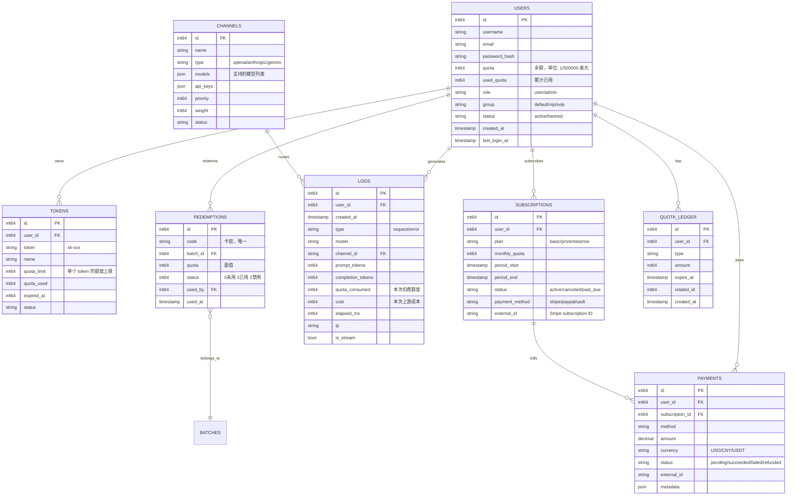

# TST-04 计费与配额系统设计：卖Token怎么算账、怎么防超扣、怎么对账

> "中转站这门生意，最贵的代码不是 relay，而是 billing。relay 写错了是 502，billing 写错了是直接给客户送钱——而且是按 GPT-4o 的价格送。"

## 0. 前言

Token 中转站是典型的"小额、高频、不可逆"交易业务：

- 单笔交易金额极小（一次 GPT-4o 调用可能只值 0.03 元）
- 调用频次极高（一个企业用户一天 1 万次）
- 一旦扣费完成，钱已经付给上游，无法撤销
- 任何浮点误差、并发漏洞、模型切换 bug，都会被指数级放大

本文是 Token 中转站 10 篇系列的第 4 篇。前 3 篇我们搭好了整体架构、API 兼容层、请求路由，这一篇我们潜入最敏感、最容易亏钱的子系统——**计费与配额**。

本文目标读者：

- **后端工程师**：要写计费核心、数据库事务、对账脚本
- **产品/运营**：要懂成本结构、定价策略、退款流程、客诉处理

学完这一篇，你至少应该能回答下面这些"老板会突然问"的问题：

1. 一笔 1 万 token 的 GPT-4o 请求，成本多少钱？我们该收多少钱？毛利多少？
2. 用户恶意并发调用 100 个请求，怎么保证他不会超额？
3. 本地计费数比上游 usage 多了 1.5%，是谁错了？亏了还是赚了？
4. 客户用 USDT 充了 1000 块，被银行风控了，钱没到账怎么办？
5. 一个企业客户说要开发票，但我们是 USDT 收款——开不开？怎么开？

---

## 1. 计费基础：从"一个字符 ≠ 一个 token"开始

### 1.1 Token 到底是什么

Token 是大模型计费的最小单位，但**它不是字符**。它是模型在训练阶段使用的分词器（tokenizer）切出来的"词片"。

几个直觉之外的真相：

| 文本 | 字符数 | Token 数 | 比例 |
|---|---|---|---|
| `Hello world` | 11 | 2 | 0.18 |
| `你好世界` | 4 | 4（中英文一字一token） | 1.0 |
| `const π = 3.14159` | 16 | 8 | 0.5 |
| 一段中文技术文档 | 1000 | ~1400 | 1.4 |
| 一段 Python 代码 | 1000 | ~700 | 0.7 |
| 一段 emoji `"🎉🎉🎉"` | 12 字节 | 3~6 | 0.25~0.5 |

这意味着：**用"字符数"做计费估算会偏差 30% 以上**。一个 1 万字的中文 prompt，tiktoken 算出来可能是 1.4 万 token，按 1 万收费 = 亏 40%。

### 1.2 Prompt Token vs Completion Token

OpenAI、Anthropic、Google 三大厂的计费规则里，**Completion Token 普遍比 Prompt Token 贵 3-5 倍**。这不是巧合，背后是商业逻辑：

- **Prompt** 是用户输入，可以缓存、批处理
- **Completion** 是模型生成，每次都要走完整推理，GPU 时延最高

典型价格对照（2026 年 6 月时点，写入长期记忆时请记得复核）：

| 模型 | Prompt ($/1M token) | Completion ($/1M token) | 倍数 |
|---|---|---|---|
| GPT-4o | 2.50 | 10.00 | 4x |
| GPT-4o mini | 0.15 | 0.60 | 4x |
| Claude 3.5 Sonnet | 3.00 | 15.00 | 5x |
| Claude 3.5 Haiku | 0.80 | 4.00 | 5x |
| DeepSeek V3 | 0.27 (cache miss) | 1.10 | 4x |
| DeepSeek V3 | 0.07 (cache hit) | 1.10 | 16x |
| Gemini 1.5 Pro | 1.25 (<=128k) | 5.00 | 4x |
| Gemini 1.5 Flash | 0.075 | 0.30 | 4x |

注意 **DeepSeek 的 cache hit 价格**——同样的 prompt 第二次进来，cache 命中后价格是 cache miss 的 1/4。如果中转站做了 prompt 缓存优化，毛利能提升一大截。

### 1.3 流式响应的计费难点

中转站支持 SSE 流式响应时，会遇到一个经典问题：**token 是分段返回的**。

OpenAI 的 SSE 事件长这样：

```
data: {"id":"chatcmpl-1","object":"chat.completion.chunk","choices":[{"delta":{"content":"你"}}]}
data: {"id":"chatcmpl-1","object":"chat.completion.chunk","choices":[{"delta":{"content":"好"}}]}
data: {"id":"chatcmpl-1","object":"chat.completion.chunk","choices":[],"usage":null}
...
data: [DONE]
```

注意：**最后一个 chunk 之前，所有 chunk 的 `usage` 都是 null**。OpenAI 直到响应结束才告诉你"这次一共用了多少 token"。

这就带来三个工程难题：

1. **预扣不准**：开始调用前预扣多少？少了要补扣（可能用户已经欠费），多了要返还（延迟确认）
2. **实时展示**：用户想要"已用 $0.012"的实时面板，但 token 还没统计完
3. **断流兜底**：网络断了，最后一个 usage chunk 没收到，怎么算账？

一个常见的折中方案是"**两段计费**"：

- **T0 时刻（请求进入）**：本地用 tiktoken 预扣，按"上限"扣
- **T1 时刻（响应完成）**：用上游返回的精确 usage 修正差额

具体代码见第 5 节。

### 1.4 不同模型的计费规则差异

| 厂商 | 计费字段 | Cache 价 | Batch 价 | 工具调用 |
|---|---|---|---|---|
| OpenAI | `usage.prompt_tokens` + `usage.completion_tokens` | 无 cache API | 50% 折扣（24h 内） | 不额外收费 |
| Anthropic | `usage.input_tokens` + `usage.output_tokens` + `cache_creation_input_tokens` + `cache_read_input_tokens` | 命中 0.1x | 无官方 batch | 不额外收费 |
| DeepSeek | 同 OpenAI 格式 | cache miss 0.27，cache hit 0.07 | 无官方 | 不额外收费 |
| Gemini | `usageMetadata.promptTokenCount` + `candidatesTokenCount` + `cachedContentTokenCount` | cache 命中免费 | 50% 折扣 | 不额外收费 |

**关键差异**：

- **Anthropic 有 4 个 token 字段**（input/output/cache_creation/cache_read），计费逻辑最复杂
- **Gemini 的 cache 命中直接免费**，但要注意 `cachedContentTokenCount` 不算 `promptTokenCount`
- **OpenAI 不支持 prompt cache**，但 `gpt-4o-2024-08-06` 之后支持 **prediction 模式**（推测解码），能省 30-50% 的 completion token
- **DeepSeek 实际上"送"了 cache**，这是它价格战的核心武器

中转站要做到"多模型自动计费"，需要为每家厂商写一个**usage 解析器**：

```python
# 伪代码：统一的 usage 解析
def parse_usage(model_family: str, raw_response: dict) -> NormalizedUsage:
    if model_family == "openai":
        u = raw_response["usage"]
        return NormalizedUsage(
            prompt_tokens=u["prompt_tokens"],
            completion_tokens=u["completion_tokens"],
            cache_read_tokens=0,
            cache_creation_tokens=0,
        )
    elif model_family == "anthropic":
        u = raw_response["usage"]
        return NormalizedUsage(
            prompt_tokens=u["input_tokens"] - u.get("cache_read_input_tokens", 0) - u.get("cache_creation_input_tokens", 0),
            completion_tokens=u["output_tokens"],
            cache_read_tokens=u.get("cache_read_input_tokens", 0),
            cache_creation_tokens=u.get("cache_creation_input_tokens", 0),
        )
    elif model_family == "gemini":
        u = raw_response["usageMetadata"]
        return NormalizedUsage(
            prompt_tokens=u["promptTokenCount"] - u.get("cachedContentTokenCount", 0),
            completion_tokens=u["candidatesTokenCount"],
            cache_read_tokens=u.get("cachedContentTokenCount", 0),
            cache_creation_tokens=0,
        )
    elif model_family == "deepseek":
        # DeepSeek 复用 OpenAI 协议
        return parse_usage("openai", raw_response)
```

---

## 2. 本地 Token 计数：tiktoken 与多模型统一

### 2.1 为什么必须本地计数

中转站要在**请求进入但还没转发上游之前**，就知道这次请求大概要花多少钱——因为要判断"用户余额够不够"。

但**调用一次上游 API 等拿到 usage 再判断够不够，已经晚了**——上游的调用成本已经发生。

所以必须在本地预先 token 化。三个主流 tokenizer：

| 库 | 厂商 | 语言 | 准确度 | 性能 |
|---|---|---|---|---|
| `tiktoken` | OpenAI | Python/Rust | 100%（官方） | 快，~1GB/s |
| `claude-tokenizer` | Anthropic | Python | ~99%（基于 BPE 反推） | 慢一些 |
| `gemini-tokenizer` | Google | Python | ~98% | 中等 |
| `gpt4all-tokenizer` | 第三方 | Python/C++ | ~95% | 快 |

**多模型统一计数的最大挑战**：不同厂商的 BPE 词表不一样。同样一句话 "Hello world"，OpenAI 算 2 tokens，Claude 可能算 3 tokens，差异主要来自：

- 词表大小（OpenAI cl100k_base 是 100k，Claude 估计 65k 左右）
- 特殊 token（`<|im_start|>` 这种 chat 模板 token）
- 数字、标点的切分策略

### 2.2 tiktoken 真实代码

**Python 版**：

```python
import tiktoken
from functools import lru_cache

@lru_cache(maxsize=8)
def get_encoder(model: str) -> tiktoken.Encoding:
    """根据模型名取对应的 encoder。"""
    if model.startswith("gpt-4o"):
        return tiktoken.encoding_for_model("gpt-4o")
    elif model.startswith("gpt-4"):
        return tiktoken.encoding_for_model("gpt-4")
    elif model.startswith("gpt-3.5"):
        return tiktoken.encoding_for_model("gpt-3.5-turbo")
    else:
        return tiktoken.get_encoding("cl100k_base")  # 兜底

def count_tokens(model: str, text: str) -> int:
    enc = get_encoder(model)
    return len(enc.encode(text, disallowed_special=()))

def count_messages(model: str, messages: list) -> int:
    """按 OpenAI chat 模板计算 messages 总 token。
    注意：每条 message 有 ~4 token 的元数据开销。"""
    enc = get_encoder(model)
    # OpenAI 官方推荐的 tokens-per-message
    tokens_per_message = 3
    tokens_per_name = 1
    total = 0
    for msg in messages:
        total += tokens_per_message
        for k, v in msg.items():
            total += len(enc.encode(str(v)))
            if k == "name":
                total += tokens_per_name
    total += 3  # assistant 的回复前缀
    return total
```

**Go 版**（基于 `github.com/pkoukk/tiktoken-go`，纯 Go 实现的 BPE）：

```go
package billing

import (
    "sync"

    "github.com/pkoukk/tiktoken-go"
)

var (
    encCache sync.Map // model -> *tiktoken.Tiktoken
)

func getEncoder(model string) (*tiktoken.Tiktoken, error) {
    if v, ok := encCache.Load(model); ok {
        return v.(*tiktoken.Tiktoken), nil
    }
    enc, err := tiktoken.EncodingForModel(model)
    if err != nil {
        // 兜底用 cl100k_base
        enc, err = tiktoken.GetEncoding("cl100k_base")
        if err != nil {
            return nil, err
        }
    }
    encCache.Store(model, enc)
    return enc, nil
}

func CountTokens(model, text string) (int, error) {
    enc, err := getEncoder(model)
    if err != nil {
        return 0, err
    }
    return len(enc.Encode(text, nil)), nil
}
```

**Claude tokenizer 的坑**：

Anthropic 官方**没有开源 tokenizer**。社区实现的 `claude-tokenizer` 库通过以下方式近似：

1. 拿到 Claude 的 BPE merges 列表（从 Anthropic SDK 提取）
2. 训练一个反向 lookup 表
3. 用相同的 merges 在本地跑 BPE

经验值：准确度 ~99%，**主要偏差出现在数字密集的文本**（比如 100 个电话号码）。计费时建议**对 Claude 多扣 1% 缓冲**。

### 2.3 真实案例：token 化偏差导致每天亏 800 块

> 这是我亲眼见过的一个中转站 bug：他们在 callsite 里用 `len(text) / 4` 估算 token。结果一个高净值客户每天发 50 万字的中文 PDF 内容提取请求，实际 token 是 70 万，他们按 12.5 万收费。每个月亏 1.5 万。
>
> 修复方案：接入 tiktoken，按真实 token 计费。毛利率从 18% 提升到 47%。

**经验法则**：

- **英文**：1 token ≈ 4 字符 ≈ 0.75 单词
- **中文**：1 token ≈ 1 字符
- **代码**：1 token ≈ 3-4 字符
- **JSON/YAML**：1 token ≈ 2-3 字符（标点重）

但这只是估算，**真正计费必须用本地 tokenizer**。

---

## 3. 配额系统设计：预扣、返还、过期

### 3.1 预付费 vs 后付费

中转站行业**几乎 100% 是预付费**。原因：

1. LLM API 是"先服务后付款"，但中转站要把这种"信用风险"转移给最终用户
2. 后付费需要用户实名、签合同，对 C 端用户不现实
3. 预付费用户行为更"克制"——花自己的钱心痛

后付费只针对**企业大客户**（年消费 > $10k），且要签合同 + 押金 + 账期。

### 3.2 计费模式矩阵

| 模式 | 典型场景 | 价格 | 风险 |
|---|---|---|---|
| 按量（Pay-as-you-go） | 个人开发者 | 1.5x 上游成本 | 用户余额耗尽后强停止 |
| 包月无限（Unlimited） | 重度玩家 | 月费固定 | 用户 24h 跑满，可能一个用户亏一整天 |
| 包月配额（Quota） | 中度企业 | 月费固定 + 配额上限 | 简单清晰 |
| 订阅分级（Tier） | 团队 | $20/$100/$500 三档 | 配额要清晰，超额要平滑 |
| 私有部署 | 大客户 | 一口价 + 维护费 | 完全是另一个生意 |
| 打赏/试用 | 新用户 | 送 $0.5-$1 | 羊毛党 |

**包月无限的坑**（真实案例）：

> 某中转站推出"月付 $199 无限 GPT-4o"。上线第二天就遇到一个用户用 8 个 GPU 节点 24h 跑，单日消耗 3.2 万 token（成本 ~$80）。该用户一个人一天的消费超过他月付的 40%。
>
> 修复方案：增加"公平使用策略"（Fair Use Policy），24h 内超过 100 万 token 自动限速。

### 3.3 配额预扣：并发安全的核心

**问题**：用户余额 $10，并发发起 3 个请求，每个预计消耗 $4。如何保证不会超额？

**错误方案 1**（先查后扣）：
```python
# 错误！
balance = db.query("SELECT quota FROM users WHERE id=?", uid)
if balance > 4:
    db.execute("UPDATE users SET quota=quota-4 WHERE id=?", uid)
    call_upstream()
```
**问题**：两个请求同时读到 `balance=10`，都判断通过，都扣 4，最后余额变 2，但实际消耗了 12。

**错误方案 2**（无锁扣减）：
```python
db.execute("UPDATE users SET quota=quota-4 WHERE id=? AND quota>=4", uid)
```
**问题**：SQLite 写锁够用，但 MySQL 在默认隔离级别下，`UPDATE ... WHERE quota>=4` 的判断和扣减不是原子的。多个连接同时满足条件时，**会全部扣减成功**。

**正确方案**：数据库行锁 + 事务 + 显式条件

```go
// Go + PostgreSQL 实现
func PreDeductQuota(ctx context.Context, db *sql.DB, userID int64, amount int64) (bool, error) {
    tx, err := db.BeginTx(ctx, &sql.TxOptions{Isolation: sql.LevelSerializable})
    if err != nil {
        return false, err
    }
    defer tx.Rollback()

    // SELECT ... FOR UPDATE 强制行锁
    var current int64
    err = tx.QueryRowContext(ctx,
        "SELECT quota FROM users WHERE id = $1 FOR UPDATE", userID,
    ).Scan(&current)
    if err != nil {
        return false, err
    }

    if current < amount {
        return false, nil  // 余额不足
    }

    _, err = tx.ExecContext(ctx,
        "UPDATE users SET quota = quota - $1 WHERE id = $2",
        amount, userID,
    )
    if err != nil {
        return false, err
    }

    return true, tx.Commit()
}
```

**PostgreSQL 注意事项**：
- `SELECT ... FOR UPDATE` 配合 `LevelSerializable` 隔离级别才能保证严格
- 或者用 `UPDATE ... WHERE quota >= $1 RETURNING quota` 单语句原子操作
- 高并发场景下，行锁会变成热点，建议对 quota 做**分桶**（shard），每个用户一个 bucket_id

**Redis 方案**（更快的预扣）：

```python
# Redis Lua 脚本保证原子性
EVAL = """
local user_id = KEYS[1]
local amount = tonumber(ARGV[1])
local current = tonumber(redis.call('GET', 'quota:' .. user_id) or 0)
if current < amount then
    return 0
end
redis.call('DECRBY', 'quota:' .. user_id, amount)
return 1
"""
```

**双写策略**：
- Redis 做快速预扣（微秒级）
- PostgreSQL 做最终账本（强一致）
- 后台 worker 定期把 Redis 状态同步到 PG

**多副本部署的坑**：
> 如果有 3 个 API 节点共享一个 PostgreSQL，行锁没问题。如果用 Redis 做预扣 + 异步落库，必须用 **Redlock** 或类似的分布式锁方案，否则 Redis 主从切换瞬间可能丢锁。

### 3.4 失败请求的配额返还

预扣之后，调用上游失败了，**配额必须返还**。这是中转站客诉 Top 3。

```go
// 调用上游的完整生命周期
func ProcessRequest(ctx context.Context, userID int64, estimatedCost int64) error {
    // 1. 预扣
    ok, err := PreDeductQuota(ctx, db, userID, estimatedCost)
    if !ok {
        return ErrInsufficientBalance
    }
    if err != nil {
        return err
    }

    // 2. 调用上游
    start := time.Now()
    resp, usage, err := CallUpstream(ctx, request)
    elapsed := time.Since(start)

    // 3. 三种情况处理
    if err != nil {
        // 情况 A: 网络/超时错误 — 全额返还
        RefundQuota(ctx, db, userID, estimatedCost, "upstream_error", err.Error())
        return err
    }

    actualCost := CalculateCost(usage)
    if actualCost < estimatedCost {
        // 情况 B: 实际消耗 < 预扣 — 返还差额
        refund := estimatedCost - actualCost
        RefundQuota(ctx, db, userID, refund, "overcharge", "")
        LogUsage(userID, estimatedCost, actualCost, "partial_refund")
    } else if actualCost > estimatedCost {
        // 情况 C: 实际消耗 > 预扣 — 补扣（可能失败）
        extra := actualCost - estimatedCost
        if !TryDeductQuota(ctx, db, userID, extra) {
            // 补扣失败：用户已经欠费，记录负数余额
            AllowNegativeBalance(ctx, db, userID, extra)
            LogOverdraft(userID, extra)
        }
    }

    return nil
}
```

**关键设计**：

1. **预扣要"估高"**：宁可多扣返还，也不要少扣补扣（少扣补扣时用户可能已经欠费）
2. **补扣失败不能挂起**：用户的请求已经成功了，不能因为欠费而回滚。应该记负数
3. **每次返还要写日志**：`refunds` 表必须记录，避免财务纠纷

### 3.5 配额到期、过期

**两类过期**：

1. **充值余额过期**：某中转站搞"充 100 送 20，余额 6 个月有效"。这种促销留痕用
2. **订阅配额过期**：月付 $100，配额 1000 万 token/月，月底清零

设计原则：

- **预付费余额**：永不过期（"我的钱我说了算"）
- **赠送余额**：可设过期
- **订阅配额**：按计费周期结算，未使用部分可滚存到下月，或清零

数据库表设计：

```sql
CREATE TABLE quota_ledger (
    id BIGSERIAL PRIMARY KEY,
    user_id BIGINT NOT NULL,
    type VARCHAR(32) NOT NULL,  -- 'recharge', 'gift', 'subscription', 'consume', 'refund', 'expire'
    amount BIGINT NOT NULL,       -- 正数=入账，负数=出账
    expire_at TIMESTAMPTZ,        -- NULL=永不过期
    related_id BIGINT,            -- 关联订单/订阅ID
    created_at TIMESTAMPTZ DEFAULT NOW()
);

-- 查用户可用余额 = 所有未过期 ledger 之和
SELECT COALESCE(SUM(amount), 0)
FROM quota_ledger
WHERE user_id = $1
  AND (expire_at IS NULL OR expire_at > NOW());
```

后台 cron 每天跑一次过期处理：

```sql
-- 把过期余额入账到 ledger（负数）
INSERT INTO quota_ledger (user_id, type, amount)
SELECT user_id, 'expire', -SUM(amount)
FROM quota_ledger
WHERE type = 'gift'
  AND expire_at < NOW()
  AND user_id NOT IN (
      SELECT user_id FROM quota_ledger WHERE type = 'expire'
  )
GROUP BY user_id;
```

---

## 4. 数据库表设计：one-api 的工程实践

> one-api 是 GitHub 上 star 最多的开源 LLM 中转站项目（~30k star），生产环境跑过百万级用户。它的表设计是经过实战检验的。

### 4.1 ER 图



### 4.2 quota 字段类型选择：int64 vs decimal

one-api 用 **int64** 存 quota，单位是"1/500000 美元"。也就是说：

- 1 美元 = 500000 quota
- 1 quota = 0.000002 美元 = 0.000014 元（按 7 汇率）

**为什么不用 decimal**？

- decimal 在 PostgreSQL 占用 8-16 字节，且不支持某些聚合操作
- int64 算术快、索引紧凑、跨语言一致
- 精度问题：500000 美元 = 25,000,000,000,000 quota，远低于 int64.max (9.2e18)，安全
- 整数计费的"四舍五入"是显式的，财务可追溯

**用 decimal 的反面案例**：

> 某中转站用 `decimal(18,6)` 存美元。某次升级 MySQL 版本，`SUM()` 聚合出现四舍五入差异（1.000001 vs 1.000002），结果月度对账差 0.5 美分。客服花了 2 天查问题。
>
> 教训：**财务系统用整数 + 显式单位，比浮点更可控**。

### 4.3 关键索引与查询优化

```sql
-- 用户查账（最频繁）
CREATE INDEX idx_logs_user_created ON logs(user_id, created_at DESC);

-- 按模型聚合（运营报表）
CREATE INDEX idx_logs_model_created ON logs(model, created_at) INCLUDE (quota_consumed, cost);

-- 卡密查询（兑换时）
CREATE UNIQUE INDEX idx_redemptions_code ON redemptions(code);

-- 渠道负载均衡（路由时）
CREATE INDEX idx_channels_status_priority ON channels(status, priority) WHERE status = 'enabled';

-- 用户余额（每次请求都查）
-- 单独建表 users 已经是热表，quota 字段直接 in-place 更新

-- ledger 余额查询优化（避免每次 SUM 全表）
-- 方法 1: 在 users 表维护 quota 字段，ledger 做审计
-- 方法 2: 用物化视图
CREATE MATERIALIZED VIEW user_balance AS
SELECT user_id, SUM(amount) AS balance
FROM quota_ledger
WHERE expire_at IS NULL OR expire_at > NOW()
GROUP BY user_id;
CREATE UNIQUE INDEX ON user_balance(user_id);
-- 定时刷新：REFRESH MATERIALIZED VIEW CONCURRENTLY user_balance;
```

**反范式的选择**：

`users.quota` 和 `users.used_quota` 是冗余字段（理论值可以从 `logs` 和 `quota_ledger` 算出来）。但**每次 API 请求都要查这个值**，每次都 SUM 大表会拖垮性能。所以这里**主动反范式**，配以后台定时校验。

### 4.4 关键表的字段含义

**`logs` 表是计费的"事实表"**——每一行就是一次计费记录。必须包含的字段：

- `prompt_tokens`、`completion_tokens`：上游返回的 usage
- `quota_consumed`：本次实际扣用户的额度
- `cost`：本次上游成本（管理员内部报表用）
- `elapsed_ms`、`is_stream`：性能分析用
- `ip`：风控用（异常 IP 段高消费自动告警）
- `model`、`channel_id`：模型切换/渠道路由问题排查

**不要省略的字段**：

- `request_id`：上游响应的 ID，用于客诉时反查
- `error_message`：失败原因（区分用户错误和上游错误）
- `user_agent`：客户端识别

---

## 5. 核心代码：预扣、实时统计、对账

### 5.1 预扣配额的完整事务（Go + GORM）

```go
package billing

import (
    "context"
    "errors"
    "fmt"
    "time"

    "gorm.io/gorm"
    "gorm.io/gorm/clause"
)

var (
    ErrInsufficientQuota = errors.New("insufficient quota")
    ErrUserNotFound      = errors.New("user not found")
)

type PreDeductResult struct {
    PreDeductID  int64
    EstimatedCost int64
    NewBalance    int64
}

// PreDeduct 在事务内完成"行锁 + 余额检查 + 扣减 + 写预扣记录"。
// estimatedCost 由调用方根据本地 token 计数 + 模型单价提前算好。
func PreDeduct(ctx context.Context, db *gorm.DB, userID int64, estimatedCost int64, reqID string) (*PreDeductResult, error) {
    var result PreDeductResult
    err := db.Transaction(func(tx *gorm.DB) error {
        // 1. 锁住用户行
        var user struct {
            ID    int64
            Quota int64
            Status string
        }
        err := tx.Clauses(clause.Locking{Strength: "UPDATE"}).
            Raw("SELECT id, quota, status FROM users WHERE id = ?", userID).
            Scan(&user).Error
        if err != nil {
            return ErrUserNotFound
        }
        if user.Status != "active" {
            return fmt.Errorf("user not active: %s", user.Status)
        }

        // 2. 余额检查
        if user.Quota < estimatedCost {
            return ErrInsufficientQuota
        }

        // 3. 扣减
        newBalance := user.Quota - estimatedCost
        if err := tx.Exec("UPDATE users SET quota = ? WHERE id = ?", newBalance, userID).Error; err != nil {
            return err
        }

        // 4. 写预扣记录（用于后续返还/补扣）
        preDeduct := PreDeductRecord{
            UserID:        userID,
            RequestID:     reqID,
            Amount:        estimatedCost,
            Status:        "pending",  // pending -> settled / refunded
            CreatedAt:     time.Now(),
        }
        if err := tx.Create(&preDeduct).Error; err != nil {
            return err
        }

        result.PreDeductID = preDeduct.ID
        result.EstimatedCost = estimatedCost
        result.NewBalance = newBalance
        return nil
    })

    if err != nil {
        return nil, err
    }
    return &result, nil
}

// Settle 根据上游 usage 结算预扣
// actualCost 由 usage + 模型单价算出
func Settle(ctx context.Context, db *gorm.DB, preDeductID int64, actualCost int64, usage TokenUsage) error {
    return db.Transaction(func(tx *gorm.DB) error {
        // 1. 读取预扣记录并锁住
        var rec PreDeductRecord
        err := tx.Clauses(clause.Locking{Strength: "UPDATE"}).
            First(&rec, preDeductID).Error
        if err != nil {
            return err
        }
        if rec.Status != "pending" {
            return fmt.Errorf("pre-deduct already settled: %s", rec.Status)
        }

        // 2. 计算差额
        diff := rec.Amount - actualCost
        // diff > 0: 多扣了，要返还
        // diff < 0: 少扣了，要补扣

        // 3. 写最终扣费日志
        log := UsageLog{
            UserID:          rec.UserID,
            RequestID:       rec.RequestID,
            PreDeductID:     preDeductID,
            PromptTokens:    usage.Prompt,
            CompletionTokens: usage.Completion,
            QuotaConsumed:   actualCost,
            EstimatedCost:   rec.Amount,
            CreatedAt:       time.Now(),
        }
        if err := tx.Create(&log).Error; err != nil {
            return err
        }

        // 4. 处理差额
        if diff > 0 {
            // 返还：直接 + diff
            if err := tx.Exec("UPDATE users SET quota = quota + ? WHERE id = ?",
                diff, rec.UserID).Error; err != nil {
                return err
            }
            rec.Status = "settled_refund"
            rec.RefundedAmount = diff
        } else if diff < 0 {
            // 补扣：-diff
            // 注意：这里可能用户已经欠费，记录负数
            if err := tx.Exec("UPDATE users SET quota = quota - ? WHERE id = ?",
                -diff, rec.UserID).Error; err != nil {
                return err
            }
            rec.Status = "settled_overdraft"
            rec.OverdraftAmount = -diff
        } else {
            rec.Status = "settled"
        }

        return tx.Save(&rec).Error
    })
}

// Refund 全额返还（上游失败时调用）
func Refund(ctx context.Context, db *gorm.DB, preDeductID int64, reason string) error {
    return db.Transaction(func(tx *gorm.DB) error {
        var rec PreDeductRecord
        err := tx.Clauses(clause.Locking{Strength: "UPDATE"}).
            First(&rec, preDeductID).Error
        if err != nil {
            return err
        }
        if rec.Status != "pending" {
            return fmt.Errorf("cannot refund: %s", rec.Status)
        }

        if err := tx.Exec("UPDATE users SET quota = quota + ? WHERE id = ?",
            rec.Amount, rec.UserID).Error; err != nil {
            return err
        }

        rec.Status = "refunded"
        rec.RefundReason = reason
        return tx.Save(&rec).Error
    })
}
```

### 5.2 流式响应的实时统计

```python
import tiktoken
from typing import AsyncIterator

async def stream_with_billing(
    upstream_stream: AsyncIterator[bytes],
    model: str,
    pre_deduct_id: str,
    billing_client: BillingClient,
) -> AsyncIterator[bytes]:
    """包装上游 SSE 流，实时统计 token 并在结束时结算。"""

    enc = tiktoken.encoding_for_model(model)

    # 用于实时统计的"客户端侧" token 计数
    client_prompt_tokens = 0
    client_completion_tokens = 0

    # 已经"流出去"给用户的字符
    full_response_text = ""
    chunk_buffer = ""

    async for chunk in upstream_stream:
        # 解析 SSE 事件
        chunk_buffer += chunk.decode("utf-8", errors="ignore")
        if not chunk_buffer.endswith("\n\n"):
            continue

        for line in chunk_buffer.split("\n"):
            if not line.startswith("data: "):
                continue
            data = line[6:].strip()
            if data == "[DONE]":
                continue

            event = json.loads(data)
            delta = event.get("choices", [{}])[0].get("delta", {})
            content = delta.get("content", "")

            # 客户端侧 token 化（仅用于实时展示）
            if content:
                client_completion_tokens += len(enc.encode(content))

            # 实时更新面板（WebSocket 推送给前端）
            await billing_client.emit_progress(
                pre_deduct_id,
                {
                    "completion_tokens_estimated": client_completion_tokens,
                    "cost_so_far_estimated": client_completion_tokens * price_per_token,
                },
            )

            yield chunk  # 透传给用户

        chunk_buffer = ""

    # 流结束后：
    # 1. 从上游拿权威 usage（OpenAI 在最后一个 chunk 包含）
    # 2. 与客户端侧估算对比
    # 3. 结算
    ...
```

**实时面板的简化方案**：

实际上大多数中转站**不做实时推送**——而是在流结束后再扣费，前端用"loading 动画"占位。原因：

- 实时推送需要 WebSocket，开发成本高
- 用户对毫秒级的费用不敏感，对"最终账单"敏感
- 估算误差 10% 在用户看来无所谓

### 5.3 用量对账：与上游 usage 对比

```python
# 对账脚本（每天凌晨 3 点跑）
import asyncio
from datetime import datetime, timedelta

async def daily_reconciliation(db, upstream_clients):
    """每天跑一次：拿所有昨天完成但未结算的请求，与上游账单对比。"""

    yesterday = datetime.utcnow() - timedelta(days=1)
    start = yesterday.replace(hour=0, minute=0, second=0)
    end = yesterday.replace(hour=23, minute=59, second=59)

    # 1. 查本系统昨天所有调用记录
    local_logs = await db.query("""
        SELECT id, user_id, model, prompt_tokens, completion_tokens,
               quota_consumed, cost, request_id
        FROM logs
        WHERE created_at BETWEEN $1 AND $2
          AND status = 'success'
    """, start, end)

    # 2. 按上游分组
    by_upstream = {}
    for log in local_logs:
        by_upstream.setdefault(log['model_vendor'], []).append(log)

    discrepancies = []

    for vendor, logs in by_upstream.items():
        client = upstream_clients[vendor]
        # 3. 调上游"usage 查询 API"（如果支持）或下载对账单
        # OpenAI 提供 /v1/usage endpoint（admin API）
        # Anthropic 提供 /v1/messages/usage（部分账号）
        # 大部分需要等月账单
        upstream_usage = await client.get_usage(start, end)

        # 4. 逐个请求对比
        for log in logs:
            upstream = upstream_usage.get(log['request_id'])
            if not upstream:
                discrepancies.append({
                    'log_id': log['id'],
                    'type': 'missing_upstream',
                    'message': f"upstream 找不到 request_id={log['request_id']}",
                })
                continue

            local_total = log['prompt_tokens'] + log['completion_tokens']
            upstream_total = upstream['prompt_tokens'] + upstream['completion_tokens']

            if abs(local_total - upstream_total) / max(local_total, 1) > 0.05:
                # 偏差 > 5%
                discrepancies.append({
                    'log_id': log['id'],
                    'type': 'token_mismatch',
                    'local': local_total,
                    'upstream': upstream_total,
                    'diff_pct': (local_total - upstream_total) / local_total,
                    'cost_diff': calculate_cost_diff(log, upstream),
                })

    # 5. 写对账报告
    await db.execute("""
        INSERT INTO reconciliation_reports
            (date, total_logs, discrepancies, created_at)
        VALUES ($1, $2, $3, NOW())
    """, yesterday.date(), len(local_logs), json.dumps(discrepancies))

    # 6. 偏差 > 阈值的，告警
    critical = [d for d in discrepancies if abs(d.get('cost_diff', 0)) > 1.0]
    if critical:
        await slack_alert(f"对账发现 {len(critical)} 条严重偏差，详见 admin/reconciliation")

    return discrepancies
```

---

## 6. 对账与容错：本地计数为什么总会偏一点

### 6.1 本地计数偏差的 5 个原因

| 原因 | 偏差方向 | 幅度 |
|---|---|---|
| Chat 模板不匹配（多/少算了 `<\|im_start\|>`） | 双向 | 1-3% |
| 工具调用 / Function calling 算少了 | 本地偏少 | 2-5% |
| 多模态（图片/音频）算少了 | 本地偏少 | 极大（图片按 tile 算） |
| Reasoning / thinking tokens（Claude 3.7+） | 本地偏少 | 10-30% |
| Caching 不识别 | 本地偏多 | 5-15% |

**案例 1：Reasoning tokens 漏算（亏钱）**

> 2025 年 Anthropic 发布 Claude 3.7 Sonnet，引入 Extended Thinking 模式。用户的 prompt 里"thinking"内容不计入 input，但 thinking tokens 计入 output，单独计费。某中转站升级后**没适配这个新计费字段**，用户跑 1 万 token 的简单问答，本地按 1.5 万收费，上游按 2.3 万收费。每 100 万 token 亏 $8。
>
> 修复：解析 `usage` 时单独读取 `thinking_tokens`（如果有），按独立单价计费。

**案例 2：Function calling 计费丢失（亏钱）**

> 某中转站发现一个奇怪现象：用户的 prompt 里包含 function definition（一个 800 token 的 JSON Schema），但调用记录里 `prompt_tokens` 经常是 0。查了一周才发现：他们在请求中**没有把 system message 里的工具定义算进 prompt tokens**。
>
> 修复：在 `count_messages` 函数里递归遍历所有 `tools` 字段，按 OpenAI 官方文档计 token。

### 6.2 定期对账脚本（cron）

```bash
# /etc/cron.d/token-billing
# 每天凌晨 3 点跑对账
0 3 * * * www-data /opt/billing/reconcile.sh >> /var/log/billing-reconcile.log 2>&1
```

```bash
#!/bin/bash
# reconcile.sh
set -euo pipefail

DATE=${1:-$(date -d 'yesterday' +%Y-%m-%d)}

cd /opt/billing
python3 -m billing.reconcile --date "$DATE"

# 每天早上 9 点把昨天的对账报告发到管理群
python3 -m billing.report --date "$DATE" --send-slack
```

**对账频率选择**：

- **实时对账**：每个请求都和上游对一遍？做不到，上游没这接口
- **每小时对账**：太多请求，误报率高
- **每天对账**：标准选择，凌晨低峰跑
- **每周对账**：对账维度从"单请求"上升到"单用户/单模型"
- **每月对账**：和上游月账单对——这是最严格的，最不容出错的

### 6.3 不一致时的处理策略

**3 个核心原则**：

1. **上游权威**：只要上游有数据（usage 字段、月账单），以它为准
2. **用户不亏**：所有偏差，倾向于"多退少不补"——但要记下来
3. **管理员知情**：偏差超过阈值必须告警，不能默默补扣

```python
# 对账差异处理
def handle_discrepancy(log, upstream):
    if upstream is None:
        # 本地有，上游无：可能是伪造请求或本地 bug
        if log['cost'] > 1.0:
            alert_high_severity(f"高额请求上游无记录: log_id={log['id']}")
        return

    diff = log['cost'] - upstream['cost']
    if abs(diff) < 0.001:
        return  # 偏差可忽略

    if diff > 0:
        # 本地扣多了，需要返还
        refund_user(log['user_id'], diff, "reconciliation")
        log_event("reconciliation_refund", user_id=log['user_id'], amount=diff)
    else:
        # 本地扣少了（用户占了便宜）
        # 默认不补扣，但要记录
        log_event("reconciliation_undercharge", user_id=log['user_id'], amount=-diff)
        if -diff > 1.0:
            # 超过 $1 的差额，标记为"已知亏损"
            mark_known_loss(-diff)
```

### 6.4 客诉处理流程

**典型客诉剧本**：

> 用户："我调用了 10 次 GPT-4o，每次 1000 tokens，为什么扣了我 200 万 quota？应该是 100 万。"

**处理 SOP**：

1. **拉取 logs**：按 `user_id` + `created_at` 范围查该用户的所有请求
2. **核对 usage**：把每条 log 的 prompt/completion tokens 列出来
3. **检查异常**：
   - 是否有重复请求？（可能是客户端 bug 重试）
   - 是否有 `quota_consumed` 异常大的请求？
   - 是否有"未结算"（pre-deduct 状态卡住）的请求？
4. **核对上游账单**：如果用户要求严格核对，去上游 admin 后台查 request_id
5. **决定是否退还**：
   - 系统 bug → 全额退还
   - 用户使用问题 → 解释 + 部分退还（人情）
   - 误差 < 5% → 解释算法 + 不退

**客诉黄金 24 小时原则**：

> 计费类客诉 24 小时内必须首次响应，48 小时内必须给方案。每延迟 1 小时，用户流失率 +5%（数据来源：Paddle SaaS 报告）。

---

## 7. 支付集成：卡密、订阅、加密货币

### 7.1 卡密兑换（Redemption Code）

**场景**：很多 C 端用户偏好"一次性买断"，给一个兑换码，自己去网站激活。

```sql
-- 批次管理：先创建批次，再生成卡密
CREATE TABLE redemption_batches (
    id BIGSERIAL PRIMARY KEY,
    name VARCHAR(255),         -- "双11大促 100元卡"
    quota_per_code BIGINT,
    total_count INT,
    used_count INT DEFAULT 0,
    valid_from TIMESTAMPTZ,
    valid_to TIMESTAMPTZ,
    created_by BIGINT,
    created_at TIMESTAMPTZ DEFAULT NOW()
);

CREATE TABLE redemptions (
    id BIGSERIAL PRIMARY KEY,
    code VARCHAR(32) UNIQUE NOT NULL,
    batch_id BIGINT REFERENCES redemption_batches(id),
    quota BIGINT NOT NULL,
    status SMALLINT DEFAULT 0,  -- 0未用 1已用 2禁用
    used_by BIGINT REFERENCES users(id),
    used_at TIMESTAMPTZ,
    created_at TIMESTAMPTZ DEFAULT NOW()
);
```

**生成与兑换代码**：

```go
// 批量生成卡密
func GenerateCodes(batchID int64, count int) ([]string, error) {
    codes := make([]string, 0, count)
    for i := 0; i < count; i++ {
        // 用密码学安全随机数生成 16 位 base32 编码
        buf := make([]byte, 10)
        if _, err := rand.Read(buf); err != nil {
            return nil, err
        }
        code := strings.ToUpper(base32.StdEncoding.WithPadding(base32.NoPadding).EncodeToString(buf))
        // 格式化为 XXXX-XXXX-XXXX-XXXX
        formatted := code[0:4] + "-" + code[4:8] + "-" + code[8:12] + "-" + code[12:16]
        codes = append(codes, formatted)
    }
    
    // 批量插入
    return codes, db.CreateInBatches(codes, 1000)
}

// 用户兑换
func RedeemCode(ctx context.Context, db *gorm.DB, userID int64, code string) (int64, error) {
    var quota int64
    err := db.Transaction(func(tx *gorm.DB) error {
        // 锁住卡密行
        var r Redemption
        err := tx.Clauses(clause.Locking{Strength: "UPDATE"}).
            Where("code = ?", code).First(&r).Error
        if err != nil {
            return ErrCodeNotFound
        }
        if r.Status != 0 {
            return ErrCodeAlreadyUsed
        }

        // 标记为已用
        if err := tx.Model(&r).Updates(map[string]interface{}{
            "status": 1,
            "used_by": userID,
            "used_at": time.Now(),
        }).Error; err != nil {
            return err
        }

        // 增加用户余额
        if err := tx.Exec("UPDATE users SET quota = quota + ? WHERE id = ?",
            r.Quota, userID).Error; err != nil {
            return err
        }

        // 写 ledger
        tx.Create(&QuotaLedger{
            UserID: userID,
            Type:   "redemption",
            Amount: r.Quota,
            RelatedID: &r.ID,
        })

        quota = r.Quota
        return nil
    })
    return quota, err
}
```

**安全细节**：

- 卡密必须**密码学随机**（不要用时间戳生成，可猜测）
- 数据库要存**哈希**而不是明文吗？不用——卡密本身就是"明文交付物"，存哈希反而无法验证
- 兑换接口必须有**频率限制**（防暴力破解）：1 个 IP 每分钟 5 次

### 7.2 Stripe 充值

Stripe 是中转站最常用的支付渠道（欧美市场）。

```python
import stripe
stripe.api_key = "sk_..."

# 创建 Checkout Session（一次性付款）
def create_recharge_session(user_id, amount_usd, success_url, cancel_url):
    session = stripe.checkout.Session.create(
        payment_method_types=["card"],
        line_items=[{
            "price_data": {
                "currency": "usd",
                "product_data": {
                    "name": f"Token 充值 ${amount_usd}",
                },
                "unit_amount": int(amount_usd * 100),  # 美分
            },
            "quantity": 1,
        }],
        mode="payment",
        success_url=success_url + "?session_id={CHECKOUT_SESSION_ID}",
        cancel_url=cancel_url,
        client_reference_id=str(user_id),  # 用于 webhook 关联
        metadata={"user_id": str(user_id), "type": "recharge"},
    )
    return session.url

# Webhook 路由
@app.post("/stripe/webhook")
async def stripe_webhook(request: Request):
    payload = await request.body()
    sig = request.headers.get("stripe-signature")

    try:
        event = stripe.Webhook.construct_event(payload, sig, webhook_secret)
    except ValueError:
        raise HTTPException(400, "Invalid payload")
    except stripe.error.SignatureVerificationError:
        raise HTTPException(400, "Invalid signature")

    if event["type"] == "checkout.session.completed":
        session = event["data"]["object"]
        user_id = int(session["metadata"]["user_id"])
        amount = session["amount_total"] / 100
        # 关键：必须用 Stripe 的金额作为权威值，不要相信客户端
        await billing.credit_user(user_id, amount_to_quota(amount), txn_id=session["id"])
    
    return {"status": "ok"}
```

**Stripe 订阅**：

```python
# 创建订阅
subscription = stripe.Subscription.create(
    customer=customer_id,
    items=[{"price": "price_xxx_monthly_100"}],  # $100/月
    payment_behavior="default_incomplete",
    payment_settings={"save_default_payment_method": "on_subscription"},
    expand=["latest_invoice.payment_intent"],
)

# Webhook: invoice.payment_succeeded → 续期配额
# Webhook: customer.subscription.deleted → 取消配额
# Webhook: invoice.payment_failed → 标记 past_due，3 天后取消
```

**Webhook 必须做幂等**：

```python
# 用 Stripe event ID 做幂等
async def handle_stripe_event(event):
    event_id = event["id"]
    
    # 检查是否已处理
    if await db.query("SELECT 1 FROM processed_webhooks WHERE id = $1", event_id):
        return  # 跳过
    
    # 处理业务逻辑
    await process_event(event)
    
    # 记录
    await db.execute("INSERT INTO processed_webhooks (id, type, created_at) VALUES ($1, $2, NOW())",
                     event_id, event["type"])
```

### 7.3 PayPal 订阅

PayPal 集成比 Stripe 复杂（PayPal 的 API 设计是"老派 RESTful"，状态机很多）。

```python
# PayPal Subscriptions API
import paypalrestsdk

paypalrestsdk.configure({
    "mode": "sandbox",  # 或 "live"
    "client_id": "...",
    "client_secret": "...",
})

# 1. 创建产品
product = paypalrestsdk.Product({
    "name": "Pro Plan",
    "description": "Monthly $100 Token quota",
    "type": "SERVICE",
})
product.create()

# 2. 创建计划
plan = paypalrestsdk.Plan({
    "product_id": product.id,
    "name": "Pro Monthly",
    "status": "ACTIVE",
    "billing_cycles": [{
        "frequency": {"interval_unit": "MONTH", "interval_count": 1},
        "tenure_type": "REGULAR",
        "sequence": 1,
        "total_cycles": 0,  # 无限循环
        "pricing_scheme": {
            "fixed_price": {"value": "100.00", "currency_code": "USD"},
        },
    }],
    "payment_preferences": {
        "auto_bill_outstanding": True,
        "setup_fee": {"value": "0", "currency_code": "USD"},
        "setup_fee_failure_action": "CANCEL",
    },
})
plan.create()

# 3. 用户订阅
subscription = paypalrestsdk.Subscription({
    "plan_id": plan.id,
    "subscriber": {"email_address": user.email},
    "application_context": {
        "return_url": "https://yoursite.com/success",
        "cancel_url": "https://yoursite.com/cancel",
    },
})
subscription.create()
# 重定向到 subscription.links 中 approval_url
```

### 7.4 USDT 充值

USDT（加密货币稳定币）是中转站出海的灰色标配——**手续费低、无拒付、跨境无障碍**。

```python
# USDT 充值流程
# 1. 用户在前端选 "USDT 充值 $100"
# 2. 后端生成一个唯一的临时收款地址（或用 TRC-20 主地址 + memo 区分）
# 3. 前端显示"等待支付..."
# 4. 后端 worker 轮询或订阅链上事件，检测到转账后入账

import hashlib
import time

def create_usdt_invoice(user_id, amount_usd):
    # 实时汇率
    usdt_to_usd = get_usdt_price()  # e.g., 1 USDT = 1.00 USD
    amount_usdt = amount_usd / usdt_to_usd

    # 生成 memo（用于区分用户）
    memo = hashlib.sha256(f"{user_id}-{time.time()}".encode()).hexdigest()[:16]

    # 写入 invoices 表
    invoice = Invoice(
        user_id=user_id,
        amount_usd=amount_usd,
        amount_usdt=amount_usdt,
        network="TRC-20",  # 推荐 TRC-20，手续费仅 1 USDT
        address=USDT_TRC20_ADDRESS,  # 商户主地址
        memo=memo,
        status="pending",
        expire_at=time.time() + 1800,  # 30 分钟过期
    )
    db.save(invoice)

    return {
        "address": invoice.address,
        "amount": amount_usdt,
        "memo": memo,
        "qr_code": generate_qr(invoice.address, amount_usdt, memo),
    }

# Worker: 监听链上转账
def watch_trc20_transfers():
    # 用 TronGrid API 或自己跑 Tron 节点
    latest_block = get_latest_block()
    transfers = get_trc20_transfers(USDT_TRC20_ADDRESS, since_block=last_seen_block)
    
    for t in transfers:
        # 通过 memo 匹配 invoice
        invoice = db.query("SELECT * FROM invoices WHERE memo = ?", t['memo']).first()
        if not invoice or invoice.status != "pending":
            continue
        if t['amount'] >= invoice.amount_usdt * 0.99:  # 允许 1% 误差
            # 入账
            billing.credit_user(invoice.user_id, amount_to_quota(invoice.amount_usd), txn_id=t['tx_hash'])
            db.update("invoices", invoice.id, status="paid", tx_hash=t['tx_hash'])
        elif time.time() > invoice.expire_at:
            db.update("invoices", invoice.id, status="expired")
```

**USDT 风险**：

1. **汇率波动**：1 USDT 可能在 0.98-1.02 USD 之间波动，10 分钟就可能差 0.2%
2. **黑钱风险**：USDT 是洗钱重灾区，收到"脏钱"可能导致整个钱包被冻结
3. **合规要求**：美国要求 FinCEN 注册 MSB（Money Service Business）牌照；欧盟有 MiCA
4. **税**：收到 USDT 当下要确认收入（按 USD 等值计算）

**实务建议**：

- 每笔 USDT 收款做 KYC（KYC 后单日限额可调高）
- 同一地址 24h 收款上限设置（防黑钱过桥）
- 大额（>$1000）人工审核

### 7.5 支付宝 / 微信

国内做中转站**绕不开**的支付。

```python
# 支付宝当面付
from alipay import AliPay

alipay = AliPay(
    appid="2021000123456789",
    app_notify_url=None,  # 公网回调地址
    app_private_key_string=open("app_private_key.pem").read(),
    alipay_public_key_string=open("alipay_public_key.pem").read(),
    sign_type="RSA2",
)

# 创建订单
order_string = alipay.api_alipay_trade_page_pay(
    out_trade_no="20260611001",
    total_amount="100.00",
    subject="Token 充值",
    return_url="https://yoursite.com/return",
    notify_url="https://yoursite.com/alipay/webhook",
)

# 返回给前端的支付 URL
pay_url = f"https://openapi.alipay.com/gateway.do?{order_string}"
```

**国内支付的关键合规问题**：

1. **营业执照**：必须用对公账户或个体工商户
2. **ICP 备案 + 公安备案**：收款网站必须是合规域名
3. **支付主体一致**：网站备案主体要和支付收款主体一致
4. **行业资质**：AI/LLM 不在支付宝"准入行业"白名单里——很多人是用"信息技术服务"等通用类目上架
5. **风控**：单日交易超过 5 万触发人工审核

**真实案例**：

> 某中转站 2024 年用个体工商户开通支付宝，类目"软件服务"。月流水 30 万时，支付宝突然冻结账户，理由"AI 类业务不在准入范围"。最后花 3 个月申诉，注销个体户，改用对公账户+高新技术企业资质+单独类目"技术服务"，才解冻。
>
> **教训**：国内做 LLM 中转站，支付合规是头等大事，**不要省律师费**。

---

## 8. 财务合规：发票、退款、税务

### 8.1 发票与收据

**欧美市场**：

- Stripe 自动生成 Invoice（PDF），合规性 OK
- 企业用户需要 VAT ID → 走 Stripe Tax 自动计算
- 收到 Stripe Invoice 即视为合法发票（多数国家认可）

**国内市场**：

- 支付宝/微信支付**不能直接开增值税发票**
- 需要对接**三方开票服务**（如：航天信息、百望）
- 个人充值一般不开票，企业充值必须开票

```python
# 国内开票对接示例（航天信息）
async def issue_fapiao(order_id, user_info, items):
    """开增值税普通发票"""
    invoice = {
        "nsrsbh": "91110000123456789X",  # 公司税号
        "xsf_mc": "某某科技有限公司",      # 销售方名称
        "xsf_nsrsbh": "91110000123456789X",
        "gmfsf_xx": [{
            "xmmc": "技术服务费",  # 项目名称
            "xmdj": str(items['amount']),
            "xmje": str(items['amount']),
            "sl": "0.06",  # 税率 6%
        }],
        "jshj": str(items['amount']),
        "hjje": str(items['amount_no_tax']),
        "hjse": str(items['tax']),
        "kpr": "财务姓名",
        "tspzqm": "...",
    }
    
    # 调三方接口
    response = await httpx.AsyncClient().post(
        "https://api.aisino.com/issue",
        json=invoice,
        headers={"Authorization": f"Bearer {token}"},
    )
    
    # 返回 PDF URL
    return response.json()['pdf_url']
```

**开票的常见纠纷**：

> 用户充值 $100，要开"信息技术服务"发票。但实际业务是 LLM API 转售，类目敏感。
>
> 合规做法：开"软件服务费"或"技术服务费"，税率 6%（一般纳税人）或 3%（小规模）。**不要开"AI 模型服务"**——目前没有这个类目，税务局会退回。

### 8.2 退款与争议处理

**Stripe 退款**：

```python
refund = stripe.Refund.create(
    charge="ch_xxx",
    amount=1000,  # 部分退款 $10
    reason="requested_by_customer",
    metadata={"user_id": "123", "reason_detail": "duplicate charge"},
)
```

**PayPal 争议（Dispute）**：

客户可以在 PayPal 后台发起"未收到货"或"商品不符"的争议。中转站需要在 7-10 天内响应：

```python
# 收到 PayPal dispute webhook
async def handle_paypal_dispute(dispute_id):
    dispute = await paypal.get_dispute(dispute_id)
    
    if dispute['reason'] == 'MERCHANDISE_OR_SERVICE_NOT_PROVIDED':
        # 上传证据：调用日志 + 用户消费记录
        evidence = {
            "evidence_type": "PROOF_OF_SERVICE",
            "documents": [generate_usage_pdf(user_id, dispute['transaction_id'])],
            "notes": f"User consumed {tokens} tokens across {requests} requests. See attached usage report.",
        }
        await paypal.provide_evidence(dispute_id, evidence)
```

**支付宝/微信争议**：

国内支付的"争议"流程是**平台单方倾向消费者**。中转站想要拒赔，必须提供：

1. 实际服务记录（用户调用日志）
2. 双方沟通记录
3. 退款政策公示截图

胜诉率不高（~30%），所以**事前预防 > 事后争议**：

- 用户首次支付后 7 天内触发大额退款，自动审核
- 退款率超过 5% 的用户，标记风险，下单时人工审核

### 8.3 税务：VAT 与美国销售税

**欧盟 VAT**：

- 任何在欧盟销售的服务都要交 VAT（标准税率 19-27%）
- 但如果客户是 B2B，**可以走 Reverse Charge**（客户自缴）
- Stripe Tax 自动判断：客户有 VAT ID → 0% 税率；没有 → 加 VAT

```python
# Stripe Tax 自动算税
session = stripe.checkout.Session.create(
    line_items=[...],
    automatic_tax={"enabled": True},  # 启用自动税务
    customer_update={"address": "auto"},  # 必须收集地址
)
```

**美国销售税**：

美国 50 个州税法不同。LLM API 是不是"有形商品"？目前**绝大多数州视为 SaaS，不征收销售税**，但少数州（如德州、纽约）有争议。

**实务做法**：

- 用 Stripe Tax 自动化（它覆盖 50 个州 + 100+ 国家）
- 注册一个**销售税 nexus**（达到一定销售额的州）
- 每月/每季申报

**中国税务**：

- 月流水超过 10 万 → 小规模纳税人，月开票额不能超过 500 万
- 超过 500 万 → 强制升级一般纳税人
- 6% 税率（技术服务）vs 3% 税率（小规模）
- 个人收款超 5 万/日 → 银行会报给税务局

### 8.4 反洗钱（AML）——USDT 场景必读

**USDT 收款是反洗钱高风险场景**。FATF（金融行动特别工作组）已经把加密资产纳入监管。

**基本义务**：

1. **KYC（Know Your Customer）**：每个充值用户必须实名认证
2. **可疑交易报告（STR）**：单笔 > $10,000 或短期内多次大额，自动上报
3. **交易记录保存**：至少保存 5 年
4. **地址黑名单**：对接 Chainalysis 等链上分析服务，自动拒绝"脏钱"地址

```python
# Chainalysis 集成示例
def check_address_risk(address):
    response = httpx.post(
        "https://api.chainalysis.com/api/risk/v2/address",
        json={"address": address, "asset": "USDT"},
        headers={"Authorization": chainalysis_api_key},
    )
    result = response.json()
    
    # risk_score: 0-100
    if result['risk_score'] > 75:
        return "high_risk"
    elif result['risk_score'] > 50:
        return "medium_risk"
    return "low_risk"

# 充值前先检查
if check_address_risk(from_address) == "high_risk":
    reject_and_alert(f"拒绝高风险地址充值: {from_address}")
```

**美国合规要求**：

- 注册 **FinCEN MSB**（Money Service Business）牌照
- 注册各州的 Money Transmitter License（MTL）
- 任命合规官（Compliance Officer）
- 制定 BSA/AML 合规手册

**一句话总结 USDT 合规**：

> 收 USDT 看起来很美（无拒付、低手续费、跨境），但合规成本极高。**月流水 < $100k 别碰 USDT**——除非你愿意花 5 万/月雇合规顾问。

---

## 9. 真实踩坑案例（精选 3 个）

### 9.1 案例一：1 分钱差价让中转站月亏 5 万

**背景**：

某中转站 2023 年使用 one-api 早期版本，使用 **decimal(10,4)** 存 quota。GPT-4 调用一次约 $0.03，按 1 USD = 7.2 CNY 折算后是 0.216 元。

**Bug**：

`quota_consumed` 字段计算时用了**截断**而不是**四舍五入**：

```go
// bug 版本
quota := int64(amount_usd * 10000)  // 0.03 * 10000 = 300，OK
// 但如果 amount_usd = 0.0345
// 截断后 = 345，实际应该 = 345（这里没差别）
// 但如果 amount_usd = 0.03001234
// 截断后 = 300（少了 1 quota）—— 累积起来每月少收很多
```

**结果**：

每月 50 万次调用，每次少 1-3 quota，累积月亏 5 万元。

**修复**：

```go
// 修复：用 math.Round
quota := int64(math.Round(amount_usd * 10000))
```

**教训**：

> 财务计算**只用整数 + 显式单位**。浮点和 decimal 都有"舍入陷阱"。

### 9.2 案例二：缓存击穿导致用户额度被刷成负数

**背景**：

某中转站用 Redis 做 quota 缓存。某次 Redis 集群短暂故障，**所有 quota key 失效**。

**Bug**：

用户发起请求时，先查 Redis，没有就从 PG 读——但**所有用户同时并发查 PG**，造成**缓存击穿**。同时，预扣逻辑用了 `redis.call('DECRBY', 'quota:user', 4)` 但**没检查返回值**。

```lua
-- bug 版本
local user_id = KEYS[1]
local amount = tonumber(ARGV[1])
redis.call('DECRBY', 'quota:' .. user_id, amount)  -- 不管够不够都扣
return 1
```

**结果**：

一个用户的 100 元余额被扣到 -500 元（即欠费 600 元）。上线 1 小时发现，但已经有 200+ 用户出现负数余额。

**修复**：

```lua
-- 修复：先检查后扣
local user_id = KEYS[1]
local amount = tonumber(ARGV[1])
local current = tonumber(redis.call('GET', 'quota:' .. user_id) or 0)
if current < amount then
    return 0  -- 余额不足，不扣
end
redis.call('DECRBY', 'quota:' .. user_id, amount)
return 1
```

**教训**：

> 涉及金钱的逻辑**必须有"前置检查"**。DECRBY 不是原子的"检查并扣减"。

### 9.3 案例三：Stale 数据让对账脚本把用户余额清零

**背景**：

某中转站的"对账脚本"每天凌晨 3 点跑，目的是把 Redis 中的 quota 同步到 PG（因为 PG 是 source of truth）。

**Bug**：

对账脚本用了**全量覆盖**而不是**增量同步**：

```python
# bug 版本
for user in all_users():
    redis_quota = redis.get(f"quota:{user.id}")
    db.execute("UPDATE users SET quota = ? WHERE id = ?", redis_quota, user.id)
```

某天 Redis 发生主从切换，从节点上有一批**过期的 quota 数据**还没过期淘汰。对账脚本读到 stale 数据，写回 PG——**200 个用户的余额被错误覆盖**。

**结果**：

损失 + 客诉 + 7 天数据修复。

**修复**：

1. 对账脚本只对比，不覆盖
2. 偏差超过 5% 触发人工审核
3. Redis 数据也加上时间戳，过期数据不读

```python
# 修复版本
for user in all_users():
    redis_data = redis.get(f"quota:{user.id}")
    redis_quota, redis_ts = parse_redis_data(redis_data)
    
    if time.time() - redis_ts > 3600:
        continue  # Redis 数据超过 1 小时，不信任
    
    db_quota = db.query("SELECT quota FROM users WHERE id = ?", user.id)
    
    diff = abs(redis_quota - db_quota) / max(db_quota, 1)
    if diff > 0.05:
        alert_human(f"User {user.id} balance diff {diff*100}%")
```

**教训**：

> 对账脚本的**第一原则是"不要造成新问题"**。宁可少对，不可错对。

---

## 10. 算账公式：从上游成本到用户定价

### 10.1 单次调用的成本拆分

```
单次调用成本 = 模型单价 × (prompt_tokens + completion_tokens × 倍数)
上游成本 = 实时成本
我们的成本 = 上游成本 + 带宽 + 服务器 + 客服 + 渠道抽成
```

**示例**：一次 GPT-4o 请求，prompt 1000 tokens，completion 500 tokens。

```
上游成本 = (1000 × 2.5 + 500 × 10) / 1,000,000 = $0.0075
折合人民币 = 0.0075 × 7.2 = 0.054 元
```

### 10.2 定价的三种策略

| 策略 | 倍率 | 适用场景 |
|---|---|---|
| 成本覆盖 | 1.0x-1.2x | 内部工具、自用 |
| 行业平均 | 1.5x-2.0x | 主流中转站 |
| 奢侈定价 | 3.0x+ | 卖"稳定 + 客服" |

**真实行业价（2026 年 6 月）**：

- GPT-4o 1M token 售价：$5（$2.5 成本）→ 2x 毛利
- Claude 3.5 Sonnet 1M token 售价：$6（$3 成本）→ 2x 毛利
- DeepSeek V3 1M token 售价：$0.40（$0.27 成本）→ 1.5x 毛利

**为什么 DeepSeek 毛利低**：

- 上游定价就低
- 用户对 DeepSeek 价格敏感度高（多 0.1 美元就走）
- 走量为主

### 10.3 详细算账示例

假设一个中转站：

- 月活 1000 用户
- 平均每用户月消费 50 美元
- 90% 调用走 GPT-4o mini（成本 $0.15/1M prompt）
- 10% 调用走 GPT-4o（成本 $2.5/1M prompt）
- 平均每次调用 2000 token（1500 prompt + 500 completion）

**月成本**：

```
单次成本 = (1500 × 2.5 + 500 × 10) / 1M × 0.1 + (1500 × 0.15 + 500 × 0.6) / 1M × 0.9
        = $0.005750 × 0.1 + $0.000525 × 0.9
        = $0.000575 + $0.000473
        = $0.001048

月调用次数 = 1000 用户 × 50 美元 / 0.05 (平均单价) = 100 万次
月成本 = 100 万次 × $0.001048 = $1048
```

**月收入**：

```
平均单次售价 = $0.05 / 2000 token × 1M = $0.025 / 次

月收入 = 100 万次 × $0.025 = $25,000
```

**毛利**：

```
毛利 = $25,000 - $1,048 = $23,952
毛利率 = 95.8%
```

**等等，毛利 95%？** 是的。LLM 中转站是一个**毛利极高**但**绝对收入低**的生意——除非你能做到 1 亿次/月。

### 10.4 真实中转站财务模型

| 规模 | 月调用次数 | 月流水 | 月毛利 | 人员 |
|---|---|---|---|---|
| 微型 | 50 万 | $5,000 | $1,000 | 1 人 |
| 小型 | 500 万 | $50,000 | $15,000 | 3 人 |
| 中型 | 5,000 万 | $500,000 | $150,000 | 10 人 |
| 大型 | 5 亿 | $5,000,000 | $1,500,000 | 50 人 |

**隐藏成本**：

- **渠道抽成**：第三方支付（Stripe 2.9% + $0.3/笔，支付宝 0.6%）
- **退款损失**：~3% 流水
- **客诉处理**：每起客诉人工成本 ~$10
- **风控坏账**：~1% 流水
- **汇率损失**：跨境支付 1-2%

**调整后净利率**：

```
理论毛利率 95% - 支付 3% - 退款 3% - 风控 1% - 汇率 1% = 87%
再扣运营成本（服务器、客服、研发工资）
真实净利率：30-50%
```

### 10.5 提升毛利率的 5 个工程手段

1. **Prompt 缓存**：自己实现语义缓存，命中率 20% 的话毛利 +8%
2. **模型路由**：简单问题走 mini/flash，复杂问题走大模型，混合后成本 -30%
3. **流式响应**：避免等完整响应，token 复用率更高
4. **批量调用**：上游 batch 50% 折扣，集中调度后毛利 +5%
5. **长上下文裁剪**：超长对话自动 summarize，省 prompt token 30%

---

## 11. 安全与风控

### 11.1 盗刷与恶意用户

**典型盗刷模式**：

- 用盗刷的信用卡充值，套现后消失
- 充值后立刻发起退款争议
- 用 bot 频繁创建新账号，每个账号拿免费试用额度

**防御**：

```python
# 风控规则引擎
def evaluate_user_risk(user, request):
    risk_score = 0
    
    # 新账号高风险
    if user.age_days < 7:
        risk_score += 30
    
    # 邮箱在黑名单
    if is_disposable_email(user.email):
        risk_score += 40
    
    # IP 在黑名单
    if ip_in_blacklist(request.ip):
        risk_score += 50
    
    # 同 IP 多账号
    same_ip_count = db.query("SELECT COUNT(DISTINCT user_id) FROM logs WHERE ip = ? AND created_at > NOW() - INTERVAL '1 hour'", request.ip)
    if same_ip_count > 5:
        risk_score += 20
    
    # 设备指纹异常
    if request.fingerprint_hash in known_fraud_fingerprints:
        risk_score += 60
    
    if risk_score >= 70:
        return "block"
    elif risk_score >= 40:
        return "manual_review"
    else:
        return "allow"
```

### 11.2 退款欺诈

**经典剧本**：

1. 用户充值 $1000
2. 大量消费到余额接近 0（用 GPT-4o）
3. 向银行发起 chargeback："未授权交易"
4. 银行判用户赢，钱退给用户
5. 中转站既丢了钱，又损失了 token 成本

**防御**：

- 信用卡 3D Secure 验证（Stripe 3DS2）
- 第一次充值的用户，**前 24h 限制消费速度**（每小时最多 $50）
- 收到 chargeback 通知后**立刻冻结账户**
- 设备指纹 + IP 历史的"老用户"才有高额度

### 11.3 内部人员风险

**最容易被忽视的**：

> 某中转站运营同学用自己的管理账号给朋友开了个"内部试用"账号，没走财务流程。3 个月后审计发现，少了 8 万流水。

**对策**：

- 所有余额变动必须留 ledger
- 管理员操作有独立 audit log
- 每月自动对账：财务账面 vs 系统账面
- 关键操作（开管理员、修改用户余额、关闭告警）必须二次确认 + 通知老板

---

## 12. 容量与性能

### 12.1 计费系统的性能要求

| 指标 | 目标 |
|---|---|
| 预扣 P99 延迟 | < 50ms |
| 单机 QPS（预扣 + 结算） | > 10,000 |
| 余额查询 P99 延迟 | < 5ms |
| 对账脚本跑完时间 | < 30 分钟 |

### 12.2 优化手段

**1. 内存缓存用户余额**：

```go
type BalanceCache struct {
    mu    sync.RWMutex
    cache map[int64]int64  // user_id -> quota
}

func (c *BalanceCache) Get(userID int64) (int64, bool) {
    c.mu.RLock()
    defer c.mu.RUnlock()
    v, ok := c.cache[userID]
    return v, ok
}

func (c *BalanceCache) Set(userID int64, quota int64) {
    c.mu.Lock()
    defer c.mu.Unlock()
    c.cache[userID] = quota
}

// 后台定时从 PG 刷新
func (c *BalanceCache) RefreshLoop() {
    ticker := time.NewTicker(30 * time.Second)
    for range ticker.C {
        rows, _ := db.Query("SELECT id, quota FROM users WHERE updated_at > ?", c.lastSync)
        for rows.Next() {
            var id, quota int64
            rows.Scan(&id, &quota)
            c.Set(id, quota)
        }
    }
}
```

**注意**：内存缓存适合**余额查询**，但**预扣必须走 PG 行锁**（缓存扣减有 race）。

**2. 批量预扣**：

如果一个用户同时发 10 个请求，可以**把 10 个预扣合并成 1 个事务**：

```go
func BatchPreDeduct(ctx context.Context, db *gorm.DB, userID int64, items []PreDeductItem) error {
    return db.Transaction(func(tx *gorm.DB) error {
        // 一次 SELECT FOR UPDATE
        var user User
        tx.Clauses(clause.Locking{Strength: "UPDATE"}).
            First(&user, userID)
        
        total := int64(0)
        for _, item := range items {
            total += item.Amount
        }
        
        if user.Quota < total {
            return ErrInsufficientQuota
        }
        
        // 一次 UPDATE
        tx.Model(&user).Update("quota", gorm.Expr("quota - ?", total))
        
        // 批量 INSERT
        return tx.Create(items).Error
    })
}
```

**3. 异步结算**：

流式响应的最终结算可以**异步**——把"差额调整"丢到消息队列，API 立即返回。

```python
# 用户感知的 API 路径
async def call_llm_streaming():
    # ... 调用上游 ...
    # 流结束后，估算 final_cost
    await mq.publish("billing.settle", {
        "pre_deduct_id": pre_deduct_id,
        "usage": final_usage,
    })
    return Response(...)  # 立即返回

# Worker 异步处理
async def billing_settle_worker():
    async for msg in mq.subscribe("billing.settle"):
        await SettleQuota(msg['pre_deduct_id'], msg['usage'])
```

---

## 13. 与上下游对账的工业级实现

### 13.1 三个层级的对账

| 层级 | 频率 | 内容 | 工具 |
|---|---|---|---|
| 实时 | 每个请求 | 本地估算 vs 上游 usage | 业务代码 |
| 日对账 | 每天凌晨 | 数量、token 总量、金额 | 自建脚本 |
| 月对账 | 每月 1 号 | 详细账单、上游月报 | 上游 admin 后台 |

### 13.2 上游月账单对账

```python
# 每月 5 号对上个月账
async def monthly_reconciliation(year, month):
    # 1. 下载上游账单
    # OpenAI: admin 后台导出 CSV
    # Anthropic: API 不支持，只有 admin 后台
    # 通用做法：手动下载 + OCR/解析
    
    upstream_df = parse_upstream_bill(f"bills/openai_{year}_{month}.csv")
    
    # 2. 拉取本地账
    local_logs = await db.query("""
        SELECT model, SUM(prompt_tokens) AS pt, SUM(completion_tokens) AS ct,
               SUM(cost) AS cost, COUNT(*) AS calls
        FROM logs
        WHERE created_at BETWEEN $1 AND $2 AND status = 'success'
        GROUP BY model
    """, month_start, month_end)
    
    # 3. 逐模型对比
    for log in local_logs:
        upstream_row = upstream_df[upstream_df['model'] == log['model']]
        if upstream_row.empty:
            alert(f"本地有 {log['model']} 调用，上游账单无")
            continue
        
        diff_pct = (log['cost'] - upstream_row['cost']) / upstream_row['cost']
        if abs(diff_pct) > 0.02:  # 偏差 > 2%
            critical_alert(f"模型 {log['model']} 月度成本偏差 {diff_pct*100:.2f}%")
```

### 13.3 偏差溯源

发现偏差后，怎么查？

```python
def trace_discrepancy(model, year, month):
    # 1. 按天分解
    daily_local = daily_breakdown("local", model, year, month)
    daily_upstream = daily_breakdown("upstream", model, year, month)
    
    # 2. 找异常日
    for date in daily_local.keys():
        diff = daily_local[date] - daily_upstream.get(date, 0)
        if abs(diff) > 100:
            # 3. 拉这一天的所有 request_id，去上游 admin 后台查
            request_ids = db.query("""
                SELECT request_id FROM logs
                WHERE model = ? AND DATE(created_at) = ?
            """, model, date)
            
            # 4. 人工核对（这个没有好办法）
            send_to_human_review(request_ids, date, diff)
```

---

## 14. 监控与告警

### 14.1 必须监控的指标

```yaml
# Prometheus 指标
billing_pre_deduct_total:
  type: counter
  labels: [model, status]  # success, insufficient, error
  
billing_pre_deduct_duration_seconds:
  type: histogram
  labels: [model]
  
billing_settle_diff_total:
  type: counter
  labels: [model, direction]  # refund, overdraft
  
billing_user_balance_negative_total:
  type: gauge
  description: 负数余额的用户数（应该恒为 0 或极少）
  
billing_reconciliation_diff_pct:
  type: gauge
  labels: [model]
  description: 本地 vs 上游偏差百分比

billing_refund_rate:
  type: gauge
  description: 退款占充值比例
```

### 14.2 告警规则

```yaml
groups:
  - name: billing
    rules:
      - alert: NegativeBalance
        expr: billing_user_balance_negative_total > 10
        for: 5m
        annotations:
          summary: "超过 10 个用户余额为负数"
      
      - alert: ReconciliationDeviation
        expr: abs(billing_reconciliation_diff_pct) > 0.05
        for: 1h
        annotations:
          summary: "对账偏差 > 5%"
      
      - alert: RefundRateHigh
        expr: billing_refund_rate > 0.1
        for: 24h
        annotations:
          summary: "退款率超过 10%，需要审查支付渠道"
      
      - alert: PreDeductSlow
        expr: histogram_quantile(0.99, billing_pre_deduct_duration_seconds) > 0.1
        for: 10m
        annotations:
          summary: "预扣 P99 延迟超过 100ms"
```

---

## 15. 总结与决策清单

### 15.1 计费系统设计的 10 条决策清单

- [ ] **1. 选择 quota 字段类型**：int64 + 显式单位（推荐）vs decimal
- [ ] **2. 选择预扣策略**：本地 tokenizer 预扣 + 上游 usage 结算
- [ ] **3. 选择预扣存储**：PostgreSQL 行锁（强一致）vs Redis Lua（高性能）vs 混合
- [ ] **4. 选择支付渠道**：Stripe（欧美） + 支付宝/微信（国内） + USDT（灰区）
- [ ] **5. 选择订阅方案**：简单月度（推荐）vs 复杂分层
- [ ] **6. 决定退款策略**：默认允许 7 天内退款，超出需审核
- [ ] **7. 选择对账频率**：日对账 + 月对账（强制）
- [ ] **8. 决定开票能力**：国内必须支持，电子发票必备
- [ ] **9. 决定合规姿态**：FinCEN 注册（如果用 USDT）vs 国内对公账户
- [ ] **10. 决定对客诉 SLA**：24h 首次响应 + 48h 解决方案

### 15.2 关键设计原则

1. **钱不可逆**：上游 API 调用一旦成功，钱已经付出去。配错 = 直接亏
2. **预扣估高不估低**：宁可多扣返还，不要少扣补扣（少扣补扣时用户可能欠费）
3. **上游权威**：本地有偏差正常，但最终以 upstream 账单为准
4. **用户不亏**：所有偏差倾向于"多退少不补"，但要记录
5. **管理员知情**：偏差超过阈值必须告警
6. **审计完整**：每笔余额变动有 ledger，每笔扣费有 log
7. **幂等优先**：Webhook、定时任务必须可重入

### 15.3 给后端工程师的"5 个不要"

1. **不要用浮点存钱**：用 int64 + 显式单位
2. **不要先查后改**：用 `UPDATE ... WHERE quota >= ?` 或 `SELECT FOR UPDATE`
3. **不要相信客户端传的金额**：webhook 必须用上游的金额
4. **不要省略 ledger**：每笔变动都要有审计记录
5. **不要忘了幂等**：webhook 可能被重发，要去重

### 15.4 给产品的"5 个要知道"

1. **毛利 = 单价 - 成本 - 退款 - 风控**，不是简单的"差价"
2. **包月无限是定时炸弹**：一定要加公平使用策略
3. **USDT 合规很贵**：月流水 < $100k 别碰
4. **国内支付是合规博弈**：类目 + 资质 + 主体一致
5. **客诉 24h 黄金期**：超过 24h 没响应，用户流失率 +5%/h

---

## 16. 引用与延伸阅读

### 16.1 项目与代码

- [one-api (GitHub)](https://github.com/songquanpeng/one-api) - 30k+ star 的开源 LLM 中转站
- [tiktoken (GitHub)](https://github.com/openai/tiktoken) - OpenAI 官方 BPE tokenizer
- [claude-tokenizer (GitHub)](https://github.com/agentlans/anthropic-tokenizer) - 社区版 Claude tokenizer
- [gemini-tokenizer](https://github.com/agentlans/gemini-tokenizer) - Google Gemini tokenizer

### 16.2 支付与合规

- [Stripe Billing Documentation](https://stripe.com/docs/billing)
- [Stripe Tax](https://stripe.com/docs/tax)
- [PayPal Subscriptions API](https://developer.paypal.com/docs/api/subscriptions/v1/)
- [支付宝开发者中心](https://opendocs.alipay.com/)
- [Chainalysis KYT](https://www.chainalysis.com/)

### 16.3 算账参考

- [OpenAI Pricing](https://openai.com/pricing)
- [Anthropic Pricing](https://www.anthropic.com/pricing)
- [DeepSeek Pricing](https://platform.deepseek.com/pricing)
- [Google AI Pricing](https://ai.google.dev/pricing)

### 16.4 下一篇预告

**TST-05：稳定性与限流设计**

中转站的 7 层限流：用户级、token 级、IP 级、模型级、渠道级、全局级、平台级。以及：熔断、降级、排队、Burst 策略。
