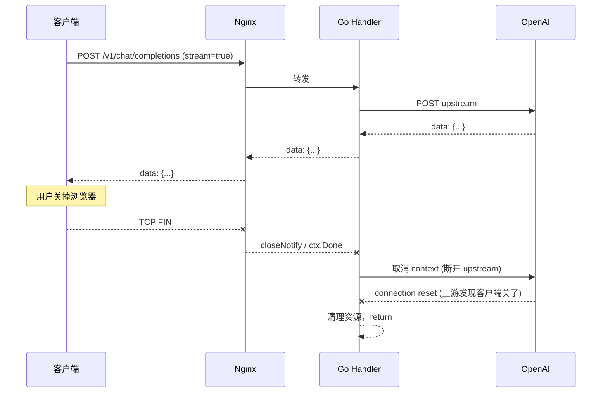
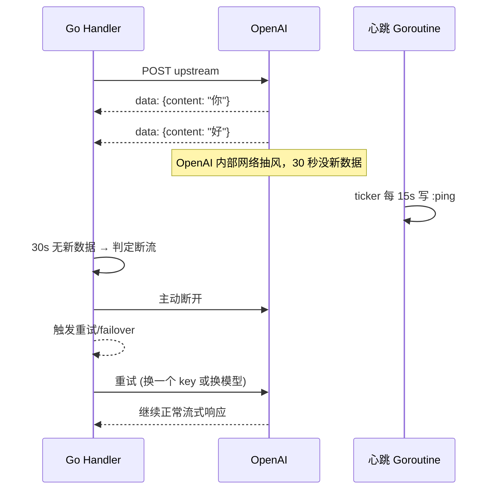

# TST-05 负载均衡、限流与Failover机制

> 中转站的稳定性等于商业信誉。一个 30 秒的 downtime，落到用户层面就是一次大规模客诉、一次集体退款申请、一条在 V2EX 和知乎上挂半个月的差评。本篇用真实代码、真实故障、真实 dashboard，讲清楚生产级的高可用到底是怎么炼成的。

## 0. 写在前面：为什么这一篇是 TST 系列的"压舱石"

TST-01 我们讲过中转站的盈利模型，TST-02 讲过渠道接入，TST-03 讲过计费与对账，TST-04 讲过风控与配额。但所有这些业务能力都必须跑在一个"扛得住"的基础设施之上。一旦入口层雪崩、应用层 OOM、上游 OpenAI 抽风、Redis 集群脑裂，下游用户的体感就只剩一句话："你这破站又挂了"。所以从系统设计的角度来说，**这一章是 TST 工程篇的压舱石**，是把前面四章所有业务能力"保命"地护住的那一层基础设施。

对一个中转站来说，"稳定"这两个字到底意味着什么？它至少包含以下五个层次的含义，缺一不可：

第一层是**可用性**。用户随时发起请求都能拿到响应，可用率 99.9% 意味着每天最多允许 86 秒的 downtime，可用率 99.99% 是 8.6 秒，可用率 99.999%（俗称"五个九"）是 0.86 秒。看起来"5 个 9"和"4 个 9"只是多了个 9，但工程难度差了 10 倍——后者一年只能有 53 分钟的故障窗口，前者只有 5.3 分钟。中转站初期目标应该是 3 个 9（每天 8 分钟故障），成型后向 4 个 9 努力。

第二层是**弹性**。流量来 10 倍不能挂，恢复到日常后能自动缩容，不浪费钱。弹性靠的是 HPA（横向 Pod 自动扩缩容）+ 入口层限流 + 应用层降级三件套。**弹性的反面是"刚性"**——流量来 10 倍就挂，恢复到日常还按高峰配置运行，每天白烧钱。

第三层是**韧性**。上游挂了、Redis 挂了、单可用区挂了，业务仍然能跑。韧性的关键是**冗余设计**——多供应商、多可用区、多副本、多副本之间的故障隔离。一个机房挂不影响另一个机房，一个 key 挂了不影响其他 key。

第四层是**可观测性**。出问题能 5 分钟内定位根因，不至于靠"重启大法"。可观测性靠的是 metrics（日）、logs（志）、traces（链路）三件套，缺一不可。光有 metrics 不知道慢在哪里，光有 logs 找不到全链路，光有 traces 看不到宏观趋势。

第五层是**可恢复性**。故障发生后能快速恢复，包括自动恢复（限流、熔断、failover）和人工恢复（runbook、oncall、status page）。一个 30 分钟的故障如果 5 分钟能定位 20 分钟能恢复，影响是可控的；如果 1 小时才发现，影响就不可控了。

本章一共十一个核心子主题，每一节都遵循"先讲为什么、再讲是什么、最后给代码/配置/案例"的写作逻辑，方便 SRE 同事按图索骥：

1. **入口层负载均衡**：Nginx/Caddy/HAProxy/Envoy 四种主流选型的横向对比，外加真实的 nginx.conf 配置示例、TLS 1.3 终止的注意事项、HTTP/2 与 HTTP/3 的演进路线、WebSocket 在中转站流式响应中的关键作用。
2. **应用层负载均衡**：多实例部署的容器化与编排、健康检查的 active 与 passive 双形态、灰度发布（canary）的具体步骤、Sticky Session 的适用边界。
3. **限流（Rate Limiting）核心**：令牌桶、漏桶、滑动窗口三种算法在数学上的本质区别，Redis + Lua 实现的分布式限流器完整源码，多维度限流（用户/Token/IP/模型）的策略矩阵，限流之后的"优雅降级"如何选型。
4. **熔断（Circuit Breaker）**：sony/gobreaker 库的三态机原理与生产配置，三态之间的转换条件，熔断之后的恢复策略，以及与限流、重试的边界区分。
5. **重试机制**：指数退避与固定间隔的适用场景、最大重试次数的边界、幂等性的工程实现、用两阶段扣费解决重试引发的扣费争议。
6. **Failover 策略**：同模型多 key failover、跨模型 failover、跨供应商 failover 三级策略，优先级 + 健康分的渠道选择算法。
7. **SSE 流式响应处理**：客户端断连检测、服务端断流的兜底、半关闭状态下的资源回收，外加一份完整的生产级 SSE handler 代码。
8. **真实故障案例**：OpenAI 2023-11、2024-06 大故障的官方记录与中转站视角的复盘，one-api GitHub issues 里关于流式断流的真实报告，PagerDuty 与 StatusPage 的告警分级实践。
9. **可观测性**：Prometheus 七个最核心的指标定义、OpenTelemetry 链路追踪的 Go 接入、结构化日志与 Loki 抓取、Grafana Dashboard 完整 JSON 模板。
10. **容量规划**：wrk/k6/vegeta 三种压测工具的对比、容量与成本的具体算账、HPA 与 KEDA 自动扩缩容的差异化用法。
11. **总结与军规**：十二条生产级高可用的实战准则，外加一份完整可用的生产级 Gin 中间件栈。

代码全部用 Go 写，因为中转站的事实标准是 Go（性能、生态、二进制部署友好）；可观测性使用 CNCF 标准栈（Prometheus + OTel + Loki + Grafana）；案例全部来自真实的 issue、status page 与公开故障报告。

---

## 1. 入口层负载均衡

### 1.1 为什么不能裸跑 Go 进程

很多中小团队在起步阶段会偷懒，直接 `go run main.go` 监听 :8080 就当生产用了。短期看确实能用，但随着流量增长，**至少有四类问题会以指数级放大**：

第一，**TLS 终止压力**。Go 的 `crypto/tls` 性能虽然不差，但握手毕竟要算 RSA/ECDHE 密钥交换、对称加密、证书校验，这些 CPU 时间被吃掉之后，业务处理能力直接下降 20%-30%。在生产里，这意味着同样一台 4 核 8G 的机器，做了 TLS 终止的实例比不做的少接 30% 的 QPS。入口层（比如 Nginx）专门为 TLS 握手做过 SIMD 优化和 session 缓存，效率高得多。

第二，**长连接耗 fd**。ChatGPT 类应用大量使用 keep-alive HTTP 长连接，外加 WebSocket 走 101 升级协议。如果 Go 进程直接面对百万客户端，文件描述符会爆——Linux 默认 ulimit 是 1024，需要把 nofile 调到 65535 或更高，但即便如此也只是缓解。入口层用 reuseport 多 worker 监听同一端口，每个 worker 各自维护连接池，能把 fd 压力摊薄 4-8 倍。

第三，**突发流量**。中转站的流量是非线性的——白天平稳，晚上 8-11 点是高峰（开发者写代码时段），偶尔某 KOL 一条推文能带来 10x 流量尖峰。如果让这些突发流量直接打到 Go 进程，最直接的后果就是 goroutine 暴涨、GC 压力拉满、响应延迟毛刺。入口层可以做**限流 + 排队 + 拒绝**，把 50k QPS 的突发削成 5k QPS 平滑流量再转发给应用。

第四，**多实例的负载分散**。单进程扛不住时必须水平扩展，但多实例引入了"客户端连哪个"的负载均衡问题。这个问题不能下放到客户端解决（客户端 SDK 不可能知道后端有多少实例），必须在入口层完成。

所以，**入口层不是可选项**，是从"能跑"到"能稳定服务"必须跨过的一道坎。

第一，**TLS 终止压力**。Go 的 `crypto/tls` 性能虽然不差，但握手毕竟要算 RSA/ECDHE 密钥交换、对称加密、证书校验，这些 CPU 时间被吃掉之后，业务处理能力直接下降 20%-30%。在生产里，这意味着同样一台 4 核 8G 的机器，做了 TLS 终止的实例比不做的少接 30% 的 QPS。入口层（比如 Nginx）专门为 TLS 握手做过 SIMD 优化和 session 缓存，效率高得多。

第二，**长连接耗 fd**。ChatGPT 类应用大量使用 keep-alive HTTP 长连接，外加 WebSocket 走 101 升级协议。如果 Go 进程直接面对百万客户端，文件描述符会爆——Linux 默认 ulimit 是 1024，需要把 nofile 调到 65535 或更高，但即便如此也只是缓解。入口层用 reuseport 多 worker 监听同一端口，每个 worker 各自维护连接池，能把 fd 压力摊薄 4-8 倍。

第三，**突发流量**。中转站的流量是非线性的——白天平稳，晚上 8-11 点是高峰（开发者写代码时段），偶尔某 KOL 一条推文能带来 10x 流量尖峰。如果让这些突发流量直接打到 Go 进程，最直接的后果就是 goroutine 暴涨、GC 压力拉满、响应延迟毛刺。入口层可以做**限流 + 排队 + 拒绝**，把 50k QPS 的突发削成 5k QPS 平滑流量再转发给应用。

第四，**多实例的负载分散**。单进程扛不住时必须水平扩展，但多实例引入了"客户端连哪个"的负载均衡问题。这个问题不能下放到客户端解决（客户端 SDK 不可能知道后端有多少实例），必须在入口层完成。

所以，**入口层不是可选项**，是从"能跑"到"能稳定服务"必须跨过的一道坎。

### 1.2 四大主流选择：横向对比

Nginx、Caddy、HAProxy、Envoy 是当前生产环境最主流的四个 L7 负载均衡器。它们的定位其实有微妙差异，选错了后面会非常难受。

**Nginx** 是事实标准的工业级老炮。性能极强（基于 epoll 的事件驱动模型），生态最成熟（Lua 模块、模块市场、文档齐全），稳定性被十年生产验证过。但配置相对繁琐，且动态配置能力弱（改个 upstream 都要 reload）。

**Caddy** 是 Go 写的现代派，最大卖点是**自动 HTTPS**——配一行邮箱就自动从 Let's Encrypt 申请证书并续期。配置语法最简洁，HTTP/3 原生支持。缺点是性能略逊于 Nginx，极端高并发场景不够用。

**HAProxy** 是 L4/L7 通吃的性能怪兽，单实例可以打满 200 万并发连接。配置文件清晰，Runtime API 允许动态调整权重、摘除节点。WebSocket 支持极好。缺点是 HTTP/3 较新（2.6+），且生态不如 Nginx。

**Envoy** 是服务网格时代的事实标准，xDS 协议让配置可以动态推送（配合 Istio/Consul）。多语言 SDK、原生支持 gRPC、原生支持 HTTP/3。缺点是 YAML 配置极长，资源占用偏高，学习曲线陡峭。

| 维度 | Nginx | Caddy | HAProxy | Envoy |
|---|---|---|---|---|
| 性能（L7） | ★★★★★ | ★★★★ | ★★★★★ | ★★★★ |
| 配置复杂度 | 中 | **极低**（自动 HTTPS） | 中 | 高（YAML 庞大） |
| HTTP/3 | 1.25+ 实验 | **原生支持** | 2.6+ 实验 | 原生 |
| 动态配置 | 弱（reload） | 弱 | 中（Runtime API） | **强（xDS）** |
| WebSocket | 好 | 好 | 极好 | 好 |
| 服务网格 | 需 OpenResty | 需插件 | 需 Data Plane API | **事实标准** |
| 资源占用 | 低 | 中 | **极低** | 高 |
| 学习曲线 | 中 | 低 | 中 | 高 |

**选型建议**：

- 个人开发者或小团队（<1k QPS）：选 **Caddy**，自动 HTTPS 一行配置，省心。
- 中型生产（1k-100k QPS）：选 **Nginx**，生态最成熟，招人也容易。
- 极高性能场景或 TCP 负载：选 **HAProxy**，L4 性能之王，单纯转发场景无敌。
- K8s 服务网格 / 多语言微服务：选 **Envoy** + Istio，xDS 协议让配置动态化。

中转站的典型选择是 **Nginx（边缘终止 TLS）+ Envoy（K8s 内部服务间调用）+ HAProxy（Redis/PostgreSQL 入口的 TCP 负载）** 三件套组合。

需要补充说明的是，这四个工具的演进路径反映了 L7 代理的代际变化。Nginx 2004 年发布，是 L7 代理的"古典时代"代表——配置化、不可编程、扩展靠 C 模块。Envoy 2016 年发布，是"云原生时代"代表——xDS 协议让配置可编程化、服务网格化、可观测原生集成。HAProxy 2006 年发布，是"高性能时代"代表——L4 性能几乎打满网卡。Caddy 2015 年发布，是"开发者友好时代"代表——零配置 HTTPS、单一二进制、Go 写就的现代架构。

**对于中转站这种业务**，"性能"和"易用"哪个更重要？我的判断是**初期易用 > 性能**——Caddy 一行配置就能跑起来，比花三天调 Nginx 配置快得多。但到了生产规模（万级以上 QPS），**性能 + 生态 > 易用**——这时候 Nginx/HAProxy 的成熟度和社区资源无可替代。

### 1.3 TLS 1.3 与 HTTP/2/3 选型

中转站用户主要是 API 调用，**HTTP/2 的多路复用是刚需**。原因很简单：客户端可能要并发请求 chat、embedding、TTS 三个不同接口，HTTP/1.1 浏览器最多开 6 个连接，HTTP/2 单连接就能并发——这对中转站这种"一个客户端并发多个业务"的场景至关重要。

**TLS 1.3** 是必须的。它的握手从 TLS 1.2 的 2-RTT 降到 1-RTT（甚至 0-RTT），对中转站这种高 QPS 场景，每秒能省下大量握手时间。配置上要注意禁用 TLS 1.0/1.1（PCI DSS 已禁止），只保留 TLS 1.2 + 1.3。

**HTTP/3**（基于 QUIC）目前还在演进中。中转站接不接取决于客户端：浏览器早已支持，但很多企业 SDK 和服务端代码库还没跟进。**生产建议：HTTP/2 为主，HTTP/3 作为可选项在边缘节点开启**（Nginx 1.25+ 实验支持，Caddy/Envoy 原生支持），不要强推。

TLS 1.3 还有一个常被忽略的特性：**0-RTT 模式**。客户端在第一次连接时把"早期数据"（early data）和第一次握手一起发出去，省掉一次 RTT。这对中转站来说有一个隐患——0-RTT 数据可能被重放攻击（replay attack）。所以**不要在 0-RTT 模式下处理任何有副作用的请求**（POST、PUT、DELETE 等），只用于幂等请求（GET、HEAD）。配置上 Nginx 用 `ssl_early_data on;` 开启，但要配合 `$ssl_early_data` 变量做应用层判断。

HTTP/2 的 server push 也是一个被讨论得多的特性，但目前 Chrome 已经废弃了 server push 的支持——业界共识是"server push 的复杂度大于收益"。中转站不推荐使用。

**TLS 1.3** 是必须的。它的握手从 TLS 1.2 的 2-RTT 降到 1-RTT（甚至 0-RTT），对中转站这种高 QPS 场景，每秒能省下大量握手时间。配置上要注意禁用 TLS 1.0/1.1（PCI DSS 已禁止），只保留 TLS 1.2 + 1.3。

**HTTP/3**（基于 QUIC）目前还在演进中。中转站接不接取决于客户端：浏览器早已支持，但很多企业 SDK 和服务端代码库还没跟进。**生产建议：HTTP/2 为主，HTTP/3 作为可选项在边缘节点开启**（Nginx 1.25+ 实验支持，Caddy/Envoy 原生支持），不要强推。

下面的 nginx.conf 是一份**完整可用**的中转站边缘配置，逐行注释了关键设计点：

```nginx
# nginx.conf — 完整可用的中转站边缘配置
user nginx;
worker_processes auto;
worker_rlimit_nofile 65535;
error_log /var/log/nginx/error.log warn;
pid /var/run/nginx.pid;

events {
    worker_connections 4096;
    multi_accept on;
    use epoll;
}

http {
    include       /etc/nginx/mime.types;
    default_type  application/json;
    sendfile      on;
    tcp_nopush    on;
    tcp_nodelay   on;
    keepalive_timeout  75;
    keepalive_requests 1000;
    types_hash_max_size 2048;

    # 性能调优
    # 每个 worker 进程能打开的最大文件描述符
    # 一个 4 worker 的 nginx，理论并发 = 4 * 4096 = 16384
    open_file_cache max=10000 inactive=20s;

    # 日志格式（JSON 结构化，便于 Loki 抓取）
    log_format json escape=json
        '{'
            '"time":"$time_iso8601",'
            '"remote_addr":"$remote_addr",'
            '"method":"$request_method",'
            '"uri":"$request_uri",'
            '"status":$status,'
            '"bytes_sent":$bytes_sent,'
            '"req_time":$request_time",'
            '"upstream_time":"$upstream_response_time",'
            '"upstream_addr":"$upstream_addr",'
            '"http_referer":"$http_referer",'
            '"http_user_agent":"$http_user_agent",'
            '"x_forwarded_for":"$http_x_forwarded_for",'
            '"x_request_id":"$http_x_request_id"'
        '}';
    access_log /var/log/nginx/access.log json;

    # 限流区（基于 IP，备用，应用层会做更精细的限流）
    limit_req_zone $binary_remote_addr zone=ip_burst:10m rate=30r/s;
    limit_req_zone $http_x_request_id zone=global:10m rate=10000r/s;
    limit_conn_zone $binary_remote_addr zone=conn_per_ip:10m;

    # Upstream 池
    upstream go_api {
        # 负载策略：最少连接（适合长连接场景，chat 请求普遍 10-30s）
        least_conn;
        # max_fails=3 fail_timeout=30s：30 秒内失败 3 次视为不健康
        server 10.0.1.10:8080 max_fails=3 fail_timeout=30s;
        server 10.0.1.11:8080 max_fails=3 fail_timeout=30s;
        server 10.0.1.12:8080 max_fails=3 fail_timeout=30s;
        # 备用实例（流量低时上线）
        server 10.0.1.13:8080 max_fails=3 fail_timeout=30s backup;
        # keepalive 复用后端连接，减少握手
        keepalive 64;
        keepalive_requests 10000;
        keepalive_timeout 60s;
    }

    server {
        listen 80;
        server_name api.example.com;
        return 301 https://$host$request_uri;
    }

    server {
        listen 443 ssl;
        http2 on;                          # HTTP/2
        # listen 443 quic reuseport;       # HTTP/3，需要 1.25+ 编译 QUIC
        # add_header Alt-Svc 'h3=":443"';  # 通告 HTTP/3
        server_name api.example.com;

        # TLS 1.3
        ssl_protocols       TLSv1.2 TLSv1.3;
        ssl_ciphers         TLS_AES_256_GCM_SHA384:TLS_CHACHA20_POLY1305_SHA256:TLS_AES_128_GCM_SHA256;
        ssl_prefer_server_ciphers off;
        ssl_session_cache   shared:SSL:50m;
        ssl_session_timeout 1d;
        ssl_session_tickets off;
        ssl_stapling        on;
        ssl_stapling_verify on;
        ssl_certificate     /etc/letsencrypt/live/api.example.com/fullchain.pem;
        ssl_certificate_key /etc/letsencrypt/live/api.example.com/privkey.pem;

        # 安全 Header
        add_header Strict-Transport-Security "max-age=63072000" always;
        add_header X-Frame-Options DENY always;
        add_header X-Content-Type-Options nosniff always;
        add_header Referrer-Policy "no-referrer" always;

        # 请求体限制
        client_max_body_size 50m;          # embedding 长文本可达 10M
        client_body_buffer_size 128k;
        client_header_buffer_size 1k;
        large_client_header_buffers 4 8k;

        # 限流
        limit_req zone=ip_burst burst=60 nodelay;
        limit_conn conn_per_ip 100;

        # 通用 location
        location / {
            proxy_pass http://go_api;
            proxy_http_version 1.1;
            proxy_set_header Connection "";
            proxy_set_header Host $host;
            proxy_set_header X-Real-IP $remote_addr;
            proxy_set_header X-Forwarded-For $proxy_add_x_forwarded_for;
            proxy_set_header X-Forwarded-Proto $scheme;
            proxy_set_header X-Request-ID $request_id;

            # 超时：SSE 流式响应可能要 5 分钟
            proxy_connect_timeout 5s;
            proxy_send_timeout    300s;
            proxy_read_timeout    300s;

            # 关键：关闭缓冲，SSE 必须实时转发
            proxy_buffering off;
            proxy_cache off;
            proxy_request_buffering off;
            chunked_transfer_encoding on;
        }

        # SSE 专用优化
        location ~ ^/v1/(chat|completions|audio/speech) {
            proxy_pass http://go_api;
            proxy_http_version 1.1;
            proxy_set_header Connection "";
            proxy_buffering off;
            proxy_cache off;
            proxy_request_buffering off;
            # SSE 专属超时：10 分钟硬上限
            proxy_read_timeout 600s;
            proxy_send_timeout 600s;
            # 禁用 gzip（SSE 不兼容）
            gzip off;
            add_header X-Accel-Buffering no;
        }

        # 健康检查端点（K8s liveness/readiness）
        location /healthz {
            access_log off;
            return 200 "ok\n";
            add_header Content-Type text/plain;
        }
        location /readyz {
            proxy_pass http://go_api/readyz;
            proxy_connect_timeout 1s;
            proxy_read_timeout 1s;
        }
    }
}
```

### 1.4 真实故障：Nginx 的 proxy_buffering 害死 SSE

**故障现象**：某中型中转站用户反馈聊天时偶尔只收到一半回复，浏览器控制台报 `ERR_INCOMPLETE_CHUNKED_ENCODING`，但服务端日志显示响应已正常返回。

**为什么这种问题容易出现**：因为它在开发环境、压测环境都几乎不发生——短连接、小请求、走完整个流程没几秒。但生产里一旦有真实用户长时间挂着聊天窗口，问题就出来了。这类问题的特征是"测试发现不了，上了生产才发现"，是 SRE 工作中最棘手的一类。

**为什么排查困难**：因为表面现象（"我只收到一半"）和真实根因（Nginx buffer）在技术栈上隔了好几层——客户端 → Cloudflare CDN → Nginx → Go handler → OpenAI，每一层都可能"看起来正常但实际有问题"。SRE 排查这类问题的方法论是**逐层抓包 + 逐层时间戳对照**。tcpdump 在客户端抓一段，对照服务端的响应时间，能很快定位到"是哪一跳丢了数据"。

**根因排查**：开发团队一开始怀疑是 WebSocket 兼容问题，折腾一周无果。后来一位 SRE 用 `tcpdump` 抓包，发现 Nginx 到浏览器的 TCP 段里有明显的"大块延迟"——一次推 64KB buffer，过了 30 秒才发出下一段。结合服务端日志和浏览器报错时间点对照，确认是 **Nginx 的 `proxy_buffering on` 默认行为**在作怪。

**原理**：Nginx 默认 `proxy_buffering on`，会把后端的响应攒到 buffer 里（默认 4 个 8k buffer，共 32k），攒满或后端结束再发给客户端。对普通 JSON 响应这没问题——客户端反正要等整个 body；对 SSE 则是灾难。客户端必须持续收到 `data: \n\n` 心跳，Nginx 攒 30 秒再吐出来，连接就被用户浏览器判死了（Chrome 默认 60 秒无数据断开）。

**修复**：在 SSE 路径上显式关闭缓冲。修复后次日用户投诉归零。

**经验教训**：

1. **SSE 必须 `proxy_buffering off`**——这不是优化，是必需。
2. **`proxy_cache off`**——缓存对 SSE 也是禁忌。
3. **`add_header X-Accel-Buffering no`**——告诉上游 CDN/反代也不要缓存这一段。
4. **Go 侧也要做对**：`http.ResponseWriter` 必须支持 `Flush()`，否则 Nginx 拿到的是 chunked 但不是实时。详见第 7 节。

---

## 2. 应用层负载均衡

### 2.1 多实例部署模型

中转站水平扩展有两种典型形态：**Docker Compose**（中小规模、单机或几台机器）和 **K8s**（大规模、弹性伸缩）。两者核心思想一致：把 Go 进程封装为镜像，用编排系统管理多个实例的生命周期。

但两者的设计哲学有本质不同。**Docker Compose 是"声明式启动"**——你写好配置，docker compose up 之后所有服务按顺序起来；挂了不会自动重启（除非配置 restart policy）。**K8s 是"声明式终态"**——你写好 Deployment 描述"我要 4 个 pod 一直跑着"，K8s 控制器不断 reconcile：现在只有 3 个？拉一个；有一个挂了？拉一个替换。这种"控制循环"思想让 K8s 的自愈能力远超 Compose。

对于中转站这种"流量波动大、对可用性要求高"的业务，**生产环境强烈推荐 K8s**。Compose 适合开发、单租户、低复杂度场景；K8s 适合生产、多租户、高可用场景。

K8s 的 Deployment 最小配置：

Docker Compose 的最小可用配置：

```yaml
# docker-compose.yml — 中小规模
version: "3.9"
services:
  api:
    image: tst/api:v1.2.3
    deploy:
      replicas: 4
      update_config:
        parallelism: 1         # 灰度：一次只更新 1 个实例
        delay: 30s             # 间隔 30s，观察 metrics
        order: start-first
      restart_policy:
        condition: on-failure
        max_attempts: 3
    environment:
      - REDIS_URL=redis://redis-cluster:6379
      - POSTGRES_DSN=postgres://...
      - OTEL_EXPORTER_OTLP_ENDPOINT=http://otel-collector:4317
    healthcheck:
      test: ["CMD", "curl", "-f", "http://localhost:8080/readyz"]
      interval: 10s
      timeout: 3s
      retries: 3
      start_period: 20s
    ports:
      - "8080"
```

K8s 的 Deployment 形态更适合生产（K8s 部署示例见 §2.4）。无论哪种形态，多实例部署的**核心目标**都是三个：

1. **无状态**：任意实例可处理任意请求（除 Sticky Session 场景），允许随时扩容/缩容/重启。
2. **快速恢复**：实例挂了，编排系统在 10 秒内拉起新实例。
3. **滚动更新**：发布新版本时，旧的慢慢退、新的慢慢进，不出现真空期。

**多实例的"陷阱"**：

第一，**状态污染**。一个 Go 实例如果把 session、token、连接信息放在内存里，挂了重启就丢——这就是"有状态"服务。多实例部署的第一个设计原则是"任何状态都外置到 Redis/Postgres"，实例本身保持纯净。**一旦实例是无状态的，扩容就是 1 行配置的事**。

第二，**配置不一致**。4 个实例的配置如果不一致（环境变量不同、配置文件不同），会出现"明明都是 v1.2.3 但行为不一样"的诡异 bug。生产里用 ConfigMap + 集中式配置中心（Nacos/Consul）来保证一致性。

第三，**启动时间**。Go 进程冷启动通常 < 1s，但如果是 Java 进程（Spring Boot）可能要 30s+。**启动时间决定扩容速度**——突发流量来 10x，如果启动要 1 分钟，这 1 分钟就是用户体验最差的真空期。Go 在这方面有天然优势。

### 2.2 健康检查：Active vs Passive

健康检查是负载均衡的"眼睛"。K8s 等编排系统通过它决定哪些实例该接收流量、哪些该被剔除、哪些该重启。

**一个反直觉的事实**：健康检查"做错了"比"不做"还危险。最常见的反模式是 **`/healthz` 检查下游依赖**——Redis 抖动了 1 秒，K8s 把所有 pod 都标记为不健康，重启；重启后所有 pod 同时起来，同时连 Redis，Redis 瞬间被击穿，pod 又不健康，又重启……这就是著名的 **K8s 重启风暴（restart loop）**。很多公司都踩过这个坑——表面上加了健康检查更"安全"，实际上每次 Redis 抖动都放大成全站重启。

正确的做法是：healthz 只检查进程本身，readyz 才检查下游依赖。这就是为什么 K8s 区分 liveness 和 readiness 两个 probe：

- **liveness probe**——失败就重启 pod。**绝对不要检查下游**。
- **readiness probe**——失败就从 Service endpoints 摘除，但 pod 不重启。**可以检查下游**。

**Active 健康检查**：主动探活。K8s 的 liveness/readiness probe 都是典型的 active check。入口层主动 ping `/readyz`，成功则纳入流量池，失败则摘除。

**Passive 健康检查**：被动观察。在请求路径上统计最近一段时间的失败率，超阈值就主动拒绝服务（返回 503），让上游知道"这实例不可用"，自然踢出流量池。Nginx 的 `max_fails` 就是典型的 passive 检查。

两者的取舍：

| 维度 | Active | Passive |
|---|---|---|
| 检测延迟 | 高（probe 间隔） | 低（请求路径实时） |
| 额外开销 | 有（主动 ping） | 无（复用业务请求） |
| 误判率 | 低 | 中（需阈值调优） |
| 适用场景 | 慢反馈故障（进程僵死） | 突发故障（上游不可达） |

**生产建议**：**两者结合用**。Active 处理"进程僵死但还在 accept 连接"这种诡异状态，Passive 处理"上游挂了但应用层还在 accept"这种常见故障。

下面是 Go 健康检查端的完整实现：

```go
// healthz.go
package main

import (
    "context"
    "net/http"
    "sync/atomic"
    "time"
)

type Health struct {
    ready atomic.Bool
}

func (h *Health) Live(w http.ResponseWriter, r *http.Request) {
    // Liveness：进程是否活着（K8s liveness probe）
    // 失败 → kubelet 重启 pod
    w.WriteHeader(http.StatusOK)
    _, _ = w.Write([]byte(`{"status":"alive"}`))
}

func (h *Health) Ready(w http.ResponseWriter, r *http.Request) {
    // Readiness：是否能接流量（K8s readiness probe）
    // 失败 → 从 Service endpoints 摘掉，但 pod 不重启
    if !h.ready.Load() {
        w.WriteHeader(http.StatusServiceUnavailable)
        return
    }

    ctx, cancel := context.WithTimeout(r.Context(), 2*time.Second)
    defer cancel()

    checks := map[string]func(context.Context) error{
        "redis":    h.checkRedis,
        "postgres": h.checkPostgres,
        "disk":     h.checkDisk,
    }

    for name, check := range checks {
        if err := check(ctx); err != nil {
            w.WriteHeader(http.StatusServiceUnavailable)
            _, _ = w.Write([]byte(`{"status":"not_ready","failed":"` + name + `"}`))
            return
        }
    }
    w.WriteHeader(http.StatusOK)
    _, _ = w.Write([]byte(`{"status":"ready"}`))
}

// 启动时设 ready=false，做完所有初始化后设 true
func (h *Health) MarkReady()   { h.ready.Store(true) }
func (h *Health) MarkNotReady() { h.ready.Store(false) }
```

**关键设计点**：

1. **`/healthz` 不检查下游依赖**——进程活着就 OK，避免 Redis 抖动导致 K8s 把所有 pod 都重启（这是著名的 K8s "重启风暴"）。
2. **`/readyz` 检查下游依赖**——Redis 不可用就主动从 Service endpoints 摘掉，等恢复了再加入。
3. **启动时先 `/healthz` 200、`/readyz` 503**——给 K8s 时间发现 pod 启动，但流量不要立刻打过来。等初始化完成（DB 连接池、缓存预热、配置加载），手动 `MarkReady()`。

Passive 健康检查的滑动窗口实现：

```go
// 简单的滑动窗口失败率统计
type PassiveHealth struct {
    window   time.Duration
    mu       sync.Mutex
    results  []bool   // true=成功, false=失败
    cursor   int
    failures int
}

func (p *PassiveHealth) Record(success bool) {
    p.mu.Lock()
    defer p.mu.Unlock()
    if !p.results[p.cursor] {
        p.failures--
    }
    p.results[p.cursor] = success
    if !success {
        p.failures++
    }
    p.cursor = (p.cursor + 1) % len(p.results)
}

func (p *PassiveHealth) FailureRate() float64 {
    p.mu.Lock()
    defer p.mu.Unlock()
    return float64(p.failures) / float64(len(p.results))
}

// 在中间件里使用
func CircuitBreakerMiddleware(p *PassiveHealth, threshold float64) func(http.Handler) http.Handler {
    return func(next http.Handler) http.Handler {
        return http.HandlerFunc(func(w http.ResponseWriter, r *http.Request) {
            if p.FailureRate() > threshold {
                http.Error(w, "service degraded", http.StatusServiceUnavailable)
                return
            }
            next.ServeHTTP(w, r)
        })
    }
}
```

### 2.3 灰度发布（Canary）

中转站每次发版都涉及"扣费逻辑"，出问题就是钱——多扣是客诉，少扣是亏损。所以**绝对不能 rolling update 一次推完**。

灰度的标准做法：先发 1 个新版本实例，配 5% 流量，观察 1 小时；没毛病再调到 50%，再观察 1 小时；没问题就 100% 切过去，旧的退掉。

**为什么是 5% 而不是 50%**？因为 5% 的影响范围小——如果新版本有 bug，最多 5% 的用户受影响，客服能 handle；如果直接 50%，一半用户挂掉，客诉爆炸、品牌受损。**5% 灰度的核心思想是"用最小流量验证最大风险"**。

**灰度的几种形态**：

1. **按实例比例**（5% 实例 = 5% 流量）——简单，但不够灵活（如果 5% 实例是 1 个，这一台挂了就没灰度了）。
2. **按请求比例**（1% 请求到 v2，99% 到 v1）——精确控制，但需要入口层支持（Istio、APISIX）。
3. **按用户分桶**（特定 user_id 走 v2）——精准定位，比如先给"内部员工 + VIP 用户"灰度。
4. **按地域**（华东 v2，华南 v1）——适合多地域部署，能跨地域验证。

生产推荐：**入口层按请求比例 + 用户 ID 灰度白名单** 组合——既能控制总量，又能让内部员工"用脚投票"先发现问题。

**灰度期间最容易翻车的几件事**：

1. **数据库 schema 兼容**——新旧版本同时跑，schema 必须双向兼容。**v2 加字段没问题，删字段、改字段类型、改索引、给字段加 NOT NULL 都炸**。生产里灰度前必须做"双版本同时跑"测试。
2. **消息队列兼容**——Kafka 消息格式升级，要保证旧消费者能消化新消息，新消费者能兼容旧消息。常见做法是"先发新版消息，老消费者忽略未知字段；等所有消费者都升级完，再删除老字段"。
3. **配置中心兼容**——新配置项要保留默认值，老配置项删除前要确认没有老实例还在用。

下面是 K8s + Istio 灰度的标准配置：

```yaml
# 1. 部署 v2 版本（仅 5% 流量）
apiVersion: apps/v1
kind: Deployment
metadata:
  name: tst-api-v2
spec:
  replicas: 1
  selector:
    matchLabels:
      app: tst-api
      version: v2
  template:
    metadata:
      labels:
        app: tst-api
        version: v2
    spec:
      containers:
      - name: api
        image: tst/api:v2.0.0
---
# 2. VirtualService：5% 流量到 v2
apiVersion: networking.istio.io/v1beta1
kind: VirtualService
metadata:
  name: tst-api
spec:
  hosts:
  - tst-api
  http:
  - match:
    - headers:
        x-canary:
          exact: "always"          # 内部员工带这个 header 强制走 v2
    route:
    - destination:
        host: tst-api
        subset: v2
  - route:
    - destination:
        host: tst-api
        subset: v1
      weight: 95
    - destination:
        host: tst-api
        subset: v2
      weight: 5
```

**观察 1 小时 metrics**（这步最关键，没有可观测性的灰度是盲飞）：

- **错误率**：v2 vs v1 差距应小于 0.5%
- **P99 延迟**：v2 应小于 v1 的 1.2 倍
- **扣费异常率**：v2 出现的"未扣 / 多扣"应为 0
- **业务指标**：付费转化率、退款率等不应有显著波动

满足后调权重 → 50% → 100%，最后删 v1。

**灰度期间最常被忽略的两件事**：

1. **DB schema 兼容**：新旧版本同时跑，schema 必须双向兼容——v2 加字段没问题，删字段、改字段类型就炸。
2. **消息队列兼容**：如果用 Kafka/RabbitMQ，消息格式升级要保证旧消费者能消化新消息，新消费者能兼容旧消息。

### 2.4 Sticky Session：什么时候需要

中转站绝大多数请求是**无状态**的（API key + 请求体 = 输出），不需要 sticky session。**例外场景有两个**：

**为什么中转站天然适合无状态**？因为每个请求都是独立的——客户端发"模型=xxx, 消息=xxx"，服务端返回"AI 回复=xxx"。没有"上下文"依赖上次请求的状态（多轮对话的"上下文"是客户端传的 messages 数组，不是服务端的内存状态）。这种业务特性让中转站可以无脑扩容——加 10 个实例就多 10 倍处理能力，不需要考虑 session 复制。

**场景一：多轮对话**。用户连续发 6 条消息，希望分到同一个 Go 实例以利用本地缓存（减少查 DB 次数）。这种场景下，sticky 是性能优化，不是必需——无状态也能跑，只是多查几次 DB。

**场景二：WebSocket 长连接**。WebSocket 建立后第二个请求被转到另一台实例，立刻 101 失败——**这种情况必须 sticky**，否则连接根本保不住。

Nginx 的 sticky 配置：

```nginx
# nginx 的 ip_hash 会让同一 IP 走同一后端（粗粒度，可用）
upstream go_api_sticky {
    ip_hash;
    server 10.0.1.10:8080;
    server 10.0.1.11:8080;
}

# 更精确的 cookie-based sticky（商业版 Plus 才有）
upstream go_api_cookie {
    server 10.0.1.10:8080;
    server 10.0.1.11:8080;
    sticky cookie srv_id expires=1h domain=.example.com path=/;
}
```

K8s 上用 `SessionAffinity: ClientIP` 即可：

```yaml
apiVersion: v1
kind: Service
metadata:
  name: tst-api
spec:
  sessionAffinity: ClientIP
  sessionAffinityConfig:
    clientIP:
      timeoutSeconds: 3600
```

**注意事项**：sticky session 会让负载均衡退化为"按 IP 散列"，实例间的负载可能不均（某些 IP 段流量大）。生产里建议用 consistent hash 替代硬 sticky，把相同 token 的请求散到同一实例，但允许 instance pool 变化时重新散列。

---

## 3. 限流（Rate Limiting）核心

### 3.1 三种算法的本质区别

限流是分布式系统里最经典的话题之一，看似简单实则充满陷阱。市面上"限流算法"的文章十之八九抄来抄去，把令牌桶和漏桶混为一谈。但它们的数学本质完全不同，适用场景也差别巨大。

**为什么限流这么重要**？因为后端服务有"最大处理能力"——比如 1000 RPS。如果上游来 5000 RPS，后端会怎么处理？

- 直接打过去：5 个里有 4 个请求要么超时、要么被丢弃，要么堆积在 goroutine 里，最终整个服务 OOM。
- 排队：请求堆积，响应延迟线性增长，5 分钟前的请求还没处理完。
- 限流：直接拒绝超额的 4000 RPS，前 1000 RPS 正常处理，响应延迟保持稳定。

**对中转站这种 SaaS 业务，限流尤为重要**——因为上游 OpenAI/Anthropic 自身有 rate limit（OpenAI 账号级别 60 RPM，组织级别 10000 RPM），如果中转站不主动控制，到达上游的 QPS 远超上游能承受的，会触发上游 429，整个中转站跟着一起挂。**限流是保护自己，也是保护上游**。

**限流的另一个重要价值是"业务可承诺"**。如果你对外说"Pro 用户 60 RPS"，你必须能保证这个承诺——方法是限制超额的请求。**没有限流的 SLA 是空话**。

**令牌桶（Token Bucket）**：

想象一个桶，桶里装着令牌。桶以恒定速率 `r` 补充令牌，桶容量为 `B`（最多 B 个令牌）。每个请求必须从桶里取一个令牌才能通过。如果桶空了，请求就被拒绝。

数学表达：

```
tokens(t) = min(B, tokens(t-1) + (t - t_last) * r)
allowed = tokens >= 1 ? true : false
if allowed: tokens -= 1
```

关键特性：**允许突发**。桶满时，前 B 个请求瞬间通过，之后以 r 速率匀速通过。这非常贴合用户行为——用户偶尔会"刷一下"网页，连发 5 个请求，token bucket 友好地放行；但持续高频请求会被匀速限制。

**漏桶（Leaky Bucket）**：

想象一个桶，请求先入桶，桶以恒定速率漏水处理。如果桶满了，新请求就被拒绝。

关键特性：**强制匀速**。无论突发多大，输出永远是 r 速率。这对保护下游特别有用——下游的处理能力固定，漏桶把突发"摊平"了。

**滑动窗口（Sliding Window）**：

维护一个时间窗口（最近 1 秒/1 分钟），统计窗口内的请求数。请求数 < 限制则允许，否则拒绝。

关键特性：**精确**。不会出现"上一秒用光配额，下一秒又用光"的尴尬。缺点是实现复杂——精确版需要存所有时间戳，内存爆炸；近似版用两个窗口加权估算，精度够用但不是 100% 准。

```
三种算法的可视化对比（请求速率 50 RPS，限流 30 RPS）：

令牌桶：   突发 30 个请求 → 全部通过
           之后匀速 30 RPS
           ↓
           适合：API 限流

漏桶：     突发 50 个请求 → 30 个立刻入桶
           20 个被拒
           桶里的 30 个以 30 RPS 漏出
           ↓
           适合：保护下游、消息队列

滑动窗口： 任何 1 秒内最多 30 个
           突发 50 → 30 个通过 + 20 个拒
           下一秒重新计数
           ↓
           适合：金融、对账、SLA 严格场景
```

| 算法 | 允许突发 | 平滑输出 | 复杂度 | 适用 |
|---|---|---|---|---|
| 令牌桶 | **是**（最大 burst） | 否 | 低 | 绝大多数 API 限流 |
| 漏桶 | 否 | **是** | 低 | 保护下游、消息队列 |
| 滑动窗口精确 | 否 | 是 | 高 | 金融、对账 |
| 滑动窗口近似 | 弱 | 中 | 中 | 通用首选 |

**中转站推荐组合**：**令牌桶**（用户友好，允许短暂突发）+ **滑动窗口近似**（防刷、防滥用、限速模型）。两种算法在 Redis + Lua 里实现都不复杂，下面给出具体代码。

**算法选择的具体决策树**：

- 你的场景是"用户友好"还是"严格限制"？**用户友好选令牌桶，严格限制选滑动窗口**。
- 你的限流粒度是"每秒"还是"每天"？**每秒用令牌桶（连续速率），每天用固定窗口计数器（每天 0 点重置）**。
- 你的下游能承受"突发"吗？**能承受选令牌桶，不能承受选漏桶**。
- 你需要"绝对精确"的限流吗？**需要（如金融）选滑动窗口精确版，否则用近似版**。

中转站 90% 的场景是"用户友好 + 每秒 + 下游能承受突发 + 不需要绝对精确"，所以**令牌桶就是默认选择**。

### 3.2 分布式限流：Redis + Lua

为什么必须 Lua？**Redis 的 GET/SET 不是原子的**，两个客户端同时拿 token 就会超卖。Lua 脚本在 Redis 单线程里跑，等价于一个事务——整个脚本要么全执行，要么不执行。

**为什么不用 Redis 的事务（MULTI/EXEC）**？理论上可以，但事务里不能根据"读到的值"做条件分支，而令牌桶的核心逻辑就是"读 tokens → 算补充 → 决定 allow → 写回"，这是典型的"读-改-写"操作，必须用 Lua 脚本把整个过程包成原子。

**为什么不用 Redis 的 WATCH/OPTIMISTIC LOCK**？CAS 重试的方案在高并发下重试率会很高（500 RPS 限流 100 RPS，400 RPS 都要重试），Lua 是单线程顺序执行，不存在冲突，性能好得多。

**为什么不用 Redis 的 INCR + EXPIRE**？这是 fixed window 计数器的典型实现，确实简单。但有个致命问题：**窗口边界处的 2 倍突发**——59 秒来 100 个请求被允许，0 秒又来 100 个请求也被允许（两个窗口都"满"），实际 2 秒内放过 200 个。Lua 实现的滑动窗口或令牌桶就没这个问题。

下面是生产级的 Redis 令牌桶 Lua 脚本：

```lua
-- rate_limit.lua — 分布式令牌桶
-- KEYS[1]: 限流的 key (e.g. "rl:user:12345:model:gpt-4")
-- ARGV[1]: 桶容量 (burst)
-- ARGV[2]: 补充速率 (tokens per second)
-- ARGV[3]: 当前时间戳（毫秒）
-- ARGV[4]: 消耗的 token 数（通常为 1）
-- 返回: {allowed, remaining_tokens, retry_after_ms}

local key       = KEYS[1]
local capacity  = tonumber(ARGV[1])
local rate      = tonumber(ARGV[2])  -- tokens / second
local now_ms    = tonumber(ARGV[3])
local cost      = tonumber(ARGV[4])

local data = redis.call('HMGET', key, 'tokens', 'ts')
local tokens = tonumber(data[1])
local ts     = tonumber(data[2])

if tokens == nil then
    tokens = capacity
    ts = now_ms
end

-- 计算从上次更新到现在应补充的 token
local elapsed_ms = math.max(0, now_ms - ts)
local refill = (elapsed_ms / 1000.0) * rate
tokens = math.min(capacity, tokens + refill)
ts = now_ms

local allowed = 0
local retry_after_ms = 0

if tokens >= cost then
    tokens = tokens - cost
    allowed = 1
else
    allowed = 0
    -- 计算需要等多久能拿到 1 个 token
    local needed = cost - tokens
    retry_after_ms = math.ceil((needed / rate) * 1000)
end

redis.call('HMSET', key, 'tokens', tokens, 'ts', ts)
-- 过期时间防止冷数据堆积（设为桶充满时间的 2 倍）
local ttl = math.ceil((capacity / rate) * 2)
redis.call('EXPIRE', key, ttl)

return {allowed, math.floor(tokens), retry_after_ms}
```

**关键点**：

1. **状态在 Hash 里存**（`tokens` 和 `ts`），HMSET 一次原子写。
2. **补充量按时间差计算**，所以即使 Redis 重启导致状态丢失，新状态也是从"满"开始（这是 fail open 倾向——严苛生产可以把 `tokens = 0` 改成 fail closed）。
3. **返回 retry_after_ms**，让客户端知道等多久可以重试。

### 3.3 Go 中间件：多维度限流

下面是 Go 侧完整的限流中间件实现，支持多维度（用户/Token/IP/模型）：

**多维度限流的本质**：每个维度是一个"独立的限流器"，它们可以叠加、可以择严。叠加的好处是"一个用户就算换 IP 换 token 也限得住"，择严的坏处是"容易误杀正常用户"。生产里通常用"择严"——任何维度超额就拒绝。

```go
// ratelimit.go — 完整可用的限流中间件
package middleware

import (
    "context"
    "encoding/json"
    "net/http"
    "strconv"
    "time"

    "github.com/redis/go-redis/v9"
    "github.com/sirupsen/logrus"
)

type Limiter struct {
    rdb       *redis.Client
    scriptSHA string
    fallback  *LocalLimiter // Redis 挂了时的本地降级
}

type LimitConfig struct {
    Burst   int     // 桶容量
    Rate    float64 // tokens per second
    Cost    int     // 每次消耗
}

func NewLimiter(rdb *redis.Client) *Limiter {
    l := &Limiter{rdb: rdb, fallback: NewLocalLimiter()}
    l.scriptSHA = rdb.ScriptLoad(context.Background(), luaScript)
    return l
}

// Dimension 限流维度：用户 / Token / IP / 模型
type Dimension struct {
    UserID  int64
    TokenID int64
    IP      string
    Model   string
}

func (l *Limiter) Allow(ctx context.Context, dim Dimension, cfg LimitConfig) (allowed bool, remaining int, retryAfter time.Duration, err error) {
    // 复合 key：每个维度独立限流，任一不过就拒绝
    keys := []string{
        "rl:user:" + strconv.FormatInt(dim.UserID, 10) + ":m:" + dim.Model,
        "rl:token:" + strconv.FormatInt(dim.TokenID, 10),
        "rl:ip:" + dim.IP,
    }

    // 走 Pipeline（MGET 一次拿所有维度，HMSET 一次写所有）
    pipe := l.rdb.Pipeline()
    cmds := make([]*redis.Cmd, len(keys))
    now := time.Now().UnixMilli()
    for i, k := range keys {
        cmds[i] = pipe.EvalSha(l.rdb.Context(), l.scriptSHA,
            []string{k},
            cfg.Burst, cfg.Rate, now, cfg.Cost)
    }
    _, err = pipe.Exec(l.rdb.Context())
    if err != nil {
        // Redis 不可用 → 降级到本地限流
        logrus.WithError(err).Warn("rate limiter: redis unavailable, fallback to local")
        return l.fallback.Allow(dim, cfg)
    }

    // 任一维度不通过即拒绝（最严格策略）
    for i, c := range cmds {
        result, _ := c.Result().([]interface{})
        if len(result) < 3 {
            continue
        }
        ok, _ := result[0].(int64)
        rem, _ := result[1].(int64)
        retryMs, _ := result[2].(int64)
        if ok == 0 {
            return false, int(rem), time.Duration(retryMs) * time.Millisecond, nil
        }
        _ = i
    }
    return true, 0, 0, nil
}

// HTTP 中间件
func (l *Limiter) Middleware(cfg LimitConfig, getDim func(*http.Request) Dimension) func(http.Handler) http.Handler {
    return func(next http.Handler) http.Handler {
        return http.HandlerFunc(func(w http.ResponseWriter, r *http.Request) {
            dim := getDim(r)
            allowed, remaining, retryAfter, err := l.Allow(r.Context(), dim, cfg)
            if err != nil {
                // 限流器自身故障：fail open（更友好）或 fail close（更严格）
                logrus.WithError(err).Error("limiter error, fail open")
            } else if !allowed {
                w.Header().Set("Retry-After", strconv.Itoa(int(retryAfter.Seconds())))
                w.Header().Set("X-RateLimit-Remaining", "0")
                w.Header().Set("X-RateLimit-Reset", strconv.FormatInt(time.Now().Add(retryAfter).Unix(), 10))
                w.Header().Set("Content-Type", "application/json")
                w.WriteHeader(http.StatusTooManyRequests)
                _ = json.NewEncoder(w).Encode(map[string]any{
                    "error": map[string]any{
                        "message": "Rate limit exceeded. Retry after " + strconv.Itoa(int(retryAfter.Seconds())) + "s.",
                        "type":    "rate_limit_error",
                        "code":    "rate_limit_exceeded",
                    },
                })
                return
            }
            w.Header().Set("X-RateLimit-Remaining", strconv.Itoa(remaining))
            next.ServeHTTP(w, r)
        })
    }
}

// 优雅降级：返回队列等待
// 客户端策略：要么立即 429，要么返回 token + ETA 让客户端排队
type QueuedResponse struct {
    Position  int           `json:"position"`
    Eta       time.Duration `json:"eta_ms"`
    QueueID   string        `json:"queue_id"`
    PollAfter time.Duration `json:"poll_after_ms"`
}
```

**多维度限流的几个关键决策**：

1. **AND 还是 OR**？上面的代码是"任一维度不通过即拒绝"（最严格），适合防滥用。也可以改成"任一维度通过即允许"（最宽松），适合多租户资源池。本例选 OR 是因为中转站是公共服务，不能让某个用户把全局带宽打满。
2. **维度越多越好吗**？不是。每多一个维度就多一次 Redis 往返，性能下降。生产里一般 2-3 个维度（用户 + IP，或用户 + 模型）就够。
3. **降级策略**：Redis 挂了怎么办？代码里用本地限流 fallback，这是 **fail open** 倾向——宁可放过不可错杀。如果业务对安全要求极高（金融），可以 fail closed（Redis 挂了直接 503）。

### 3.4 多维度配置策略

中转站的限流配置不是一刀切，而是按"用户等级 × 模型"做矩阵。下面是典型配置：

**为什么按"用户等级 × 模型"做矩阵**？因为限流策略必须和商业策略对齐。免费用户要"被明显限流但不至于完全用不了"——让他们感受到"升级付费能更好用"；付费用户要"几乎感觉不到限流"——付费买的不是更快，是更稳定；企业用户要"按总额算账"——不在乎单个模型用多少，在乎月度预算。

**"贵模型 vs 便宜模型"是另一个重要维度**。gpt-4 调用一次成本是 gpt-3.5 的 30 倍，claude-opus 又是 gpt-4 的 5 倍。**如果不限流贵模型，一个用户用 100 张 gpt-4-vision 图片就能让中转站赔 50 美元**。这种"高单价模型"必须独立限流，不和普通模型混在一起。

```go
// 限流维度配置表
var LimitMatrix = map[string]LimitConfig{
    // Free 用户：gpt-4 限速极低（按 token 收费的生意，gpt-4 不能免费用）
    "free:gpt-4":         {Burst: 5, Rate: 0.1, Cost: 1},   // 5 个 token，每 10 秒补 1 个
    "free:gpt-3.5-turbo": {Burst: 20, Rate: 5, Cost: 1},    // 20 个 burst，5 RPS

    // Pro 用户
    "pro:gpt-4":          {Burst: 60, Rate: 10, Cost: 1},   // 1 分钟 600 请求
    "pro:gpt-3.5-turbo":  {Burst: 200, Rate: 50, Cost: 1},

    // 企业：模型不限流，按账户总额限流
    "enterprise:global":  {Burst: 10000, Rate: 1000, Cost: 1},
}

// 特殊模型（贵、慢）— 单独限流
var ExpensiveModels = map[string]bool{
    "gpt-4-vision-preview": true,
    "claude-3-opus":        true,
    "dall-e-3":             true,
}
```

**配置的几个原则**：

1. **Free 用户的限流要"明显感觉到"**——否则用户分不清免费和付费的体验差异。
2. **付费用户的限流要"基本感觉不到"**——付费是来买体验的，限流让用户沮丧就得不偿失。
3. **企业用户限流按总额**——企业不在乎某个模型用多少，在乎"月度账单别超 X 元"。所以企业级别限流通常是"金额/天"或"金额/月"。
4. **特殊模型（贵、慢）独立限流**——避免某个用户用 1 张图片把 OpenAI 的 vision 配额打光。

### 3.5 限流的"优雅降级"

中转站不能简单 429 了事——用户体验是"为什么我等半天啥都没有"。三种策略各有适用场景：

**为什么要做优雅降级**？因为 429 本身是一种"用户体验事故"——用户能感知到"被拒绝"了。优雅降级的目标是让用户"感觉不到被拒绝"——要么等一会就拿到结果（同步等待），要么先去干别的回头来看（异步队列），要么主动重试（带 Retry-After）。

**同步等待的实现要点**：

同步等待表面上简单（"请求来了，发现被限流，就 sleep 一下等 token 补充"），但有几个坑：

1. **HTTP 超时**——客户端 HTTP 请求有超时（通常 30s），同步等待超过这个时间客户端主动断连，服务端做了无用功。
2. **连接占用**——同步等待会占着 Go 进程的一个 goroutine 和一个 HTTP 连接，限流的请求越多，占用越多，反而把服务拖垮。
3. **死锁风险**——如果所有 goroutine 都在等 token，但 token 补充需要请求处理完才能算"释放"……这种"等 vs 算"的循环可能死锁。

**生产建议**：同步等待的最大等待时间设 5-10 秒，超时就返回 429 + Retry-After。**异步队列**适合大批量任务（夜间批量 embedding、夜间批量翻译），同步等待适合用户"在线等"的请求。

**异步队列的关键设计**：

异步队列本质是"把 HTTP 同步请求变成异步任务"——用户提交任务，拿到任务 ID，轮询或者 webhook 拿结果。**这种设计的关键是任务的生命周期管理**：

- 队列里能放多少任务？（内存还是 Redis？满了怎么办？）
- 任务能存多久？（完成后多久删除？失败的任务怎么重试？）
- 用户怎么知道任务完成？（轮询？Webhook？Server-Sent Events？）

生产里用 **Redis Stream + 消费者组**做队列，比 Kafka 轻量很多，足够中转站规模使用。

| 策略 | 何时用 | 优缺点 |
|---|---|---|
| **直接拒绝 429** | 限流是临时性的，给客户端重试机会 | 最简单，HTTP 标准 |
| **同步等待** | 请求可中断，用户可接受 | 简单但占连接 |
| **异步队列** | 重要任务（如批量 embedding） | 体验最好，实现复杂 |

异步队列实现要点：

```go
// 异步队列实现要点
type QueueItem struct {
    ID         string
    Request    *ChatRequest
    UserID     int64
    EnqueuedAt time.Time
    Notify     chan *QueueResult
}

type Queue struct {
    items   chan *QueueItem
    workers int
}

func (q *Queue) Submit(req *ChatRequest) (*QueueResult, error) {
    item := &QueueItem{
        ID:    uuid.New().String(),
        Request: req,
        Notify: make(chan *QueueResult, 1),
    }
    select {
    case q.items <- item:
        // 排队中...
        result := <-item.Notify
        return result, nil
    case <-time.After(30 * time.Second):
        return nil, errors.New("queue full or wait timeout")
    }
}

// HTTP 接口：
// POST /v1/queue → 202 Accepted, body: {queue_id, position, eta}
// GET  /v1/queue/:id → 200 OK + 完整响应 / 204 No Content (still waiting)
```

**生产经验**：异步队列的坑在于**任务幂等性**。客户端断线重连可能提交同一任务两次，队列必须按"业务唯一键"去重（详见 §5.2 幂等性章节）。

---

## 4. 熔断（Circuit Breaker）

### 4.1 三态机原理

熔断器是从电工学借来的概念，本质是"**用一个状态机把对故障上游的调用快速失败**"，避免请求堆积、连接耗尽、雪崩扩散。

**熔断的"灵感来源"**——家里的保险丝：电流过大时保险丝熔断，电路断开，避免电器烧毁。电路断开后，人工排查问题、换保险丝，电路恢复。**熔断器把这个物理现象抽象成软件模式**。

**为什么需要熔断器**？一句话：避免雪崩。

雪崩的过程是这样的：
1. 上游 A 突然变慢（数据库 GC、网络抖动、CPU 100%）
2. 我们的请求开始等 A 响应
3. 等的过程中，goroutine 持续占着
4. 新的请求还在进，goroutine 越来越多
5. 内存爆了，进程 OOM
6. K8s 重启进程
7. 启动后立刻接受新请求
8. 上游 A 还没恢复，又开始等
9. 又 OOM
10. 死循环——这就是 **K8s 重启风暴**

熔断器在这个过程里能起什么作用？它能在第 1 步就**快速失败**——上游 A 慢了 1 秒就熔断，后续请求不再等 A 响应，立刻返回错误。这样我们的 goroutine 不会被 A 拖死，能继续处理其他上游（B、C）的请求。等 A 恢复后再放开。

**熔断器和服务降级的区别**：

- 熔断是"上游故障 → 拒绝调用"（主动）
- 降级是"系统压力 → 关闭某些非核心功能"（被动）

两者经常配合用：熔断保护上游，降级保护自己。

```
熔断器三态机：

                失败次数 ≥ threshold
        ┌────────────────────────────┐
        │                            ↓
    [Closed]                     [Open]
    正常请求                       立即拒绝
        │                            │
        │ 成功                       │ Sleep timeout
        ↑                            ↓
        └──────[Half-Open]───────────┘
               放行 N 个试探
                ↓          ↓
              成功        失败
                ↓          ↓
            [Closed]    [Open]
```

**Closed（关闭）**：正常状态。所有请求都通过，但同时统计失败率/连续失败数。

**Open（打开）**：熔断状态。**所有请求立即拒绝**（不再打到上游），持续 `timeout` 时间。这段时间内上游有缓冲恢复。

**Half-Open（半开）**：试探状态。放行 `max_requests` 个请求探测上游状态。如果成功数 ≥ 阈值 → 转 Closed；否则转回 Open。

熔断的**关键收益**：

1. **快速失败**：用户拿 503 比拿 30 秒超时体感好得多。
2. **保护上游**：故障期间不再发请求，给上游喘息机会。
3. **保护自己**：避免雪崩（请求堆积 → 连接耗尽 → 所有依赖都崩）。

### 4.2 sony/gobreaker 生产级配置

Go 生态最成熟的熔断库是 sony/gobreaker，相比 Java 界的 Hystrix（已停更）更轻量、更适合 Go 的并发模型。下面是生产级配置：

```go
// breaker.go
package breaker

import (
    "context"
    "errors"
    "time"

    "github.com/sony/gobreaker"
)

var ErrBreakerOpen = errors.New("circuit breaker is open")

type Breaker struct {
    cb *gobreaker.CircuitBreaker
}

// 配置必须根据上游特性调
func New(providerName string) *Breaker {
    settings := gobreaker.Settings{
        Name:        providerName,
        MaxRequests: 3,                 // Half-Open 状态放行 3 个试探
        Interval:    60 * time.Second,  // Closed 状态下定期清零统计窗口
        Timeout:     30 * time.Second,  // Open 状态持续时间
        ReadyToTrip: func(counts gobreaker.Counts) bool {
            // 触发条件：连续失败 ≥ 5，或失败率 ≥ 60% 且总请求 ≥ 10
            if counts.ConsecutiveFailures >= 5 {
                return true
            }
            if counts.Requests >= 10 {
                failureRate := float64(counts.TotalFailures) / float64(counts.Requests)
                return failureRate >= 0.6
            }
            return false
        },
        OnStateChange: func(name string, from, to gobreaker.State) {
            // 状态变化必须告警
            metrics.BreakerStateGauge.WithLabelValues(name, to.String()).Set(1)
            logger.WithFields(logrus.Fields{
                "provider": name, "from": from.String(), "to": to.String(),
            }).Warn("circuit breaker state change")

            if to == gobreaker.StateOpen {
                alert.Send(alert.SlackChannel, "熔断器打开: "+name)
            }
        },
    }
    return &Breaker{cb: gobreaker.NewCircuitBreaker(settings)}
}

func (b *Breaker) Do(ctx context.Context, fn func(context.Context) (any, error)) (any, error) {
    result, err := b.cb.Execute(func() (any, error) {
        return fn(ctx)
    })
    if errors.Is(err, gobreaker.ErrOpenState) || errors.Is(err, gobreaker.ErrTooManyRequests) {
        return nil, ErrBreakerOpen
    }
    return result, err
}
```

**关键参数解读**：

1. **MaxRequests = 3**：Half-Open 状态放行 3 个试探，不能多也不能少——多了失去熔断意义，少了不足以判断上游是否恢复。
2. **Timeout = 30s**：Open 持续 30 秒。这段时间内上游应该有机会恢复（如果 30 秒还恢复不了，说明是真故障，需要人工介入）。
3. **ReadyToTrip 函数**：触发熔断的条件。最常用的是"连续失败 N 次"或"失败率 ≥ X%"。注意要设置最小请求数（`counts.Requests >= 10`），避免"1 个失败就熔断"这种过度敏感。
4. **OnStateChange 回调**：状态变化必须告警。熔断器打开 = 严重故障，需要 SRE 介入。

### 4.3 熔断 vs 重试 vs 限流：容易混淆的三角

| 维度 | 限流 | 熔断 | 重试 |
|---|---|---|---|
| 触发条件 | 配额 / QPS 超限 | 上游错误率突增 | 单次调用失败 |
| 作用对象 | 请求发起方 | 上游服务 | 单个失败请求 |
| 拒绝/通过 | 拒绝超额请求 | 快速失败所有请求 | 重新发起 |
| 恢复方式 | 配额刷新 | Half-Open 试探 | 自然成功 |
| 状态 | 无状态（除 token 桶计数） | 有状态（Closed/Open/Half） | 无状态 |

**配合使用顺序**：限流在最外层 → 重试在中间 → 熔断在最里层（针对上游）。三者不是替代关系，而是**协同**：

1. 限流先卡掉超额请求（保护自己不被超额流量打挂）
2. 重试在网络抖动时自动恢复（提高单次请求成功率）
3. 熔断在持续故障时快速失败（保护上游，也保护自己不堆积请求）

**实战中容易踩的坑**：

**坑一：限流和熔断互相干扰**。限流器把请求直接拒绝，熔断器看不到"上游失败"——因为根本没调到上游。**解决：限流触发时不算熔断器的失败（不算"上游错误"）**。

**坑二：重试在熔断器打开时被无视**。熔断器打开后请求被快速失败，重试逻辑可能再次发起——但熔断器还是开着的，又被快速失败。**解决：熔断器打开时直接返回熔断错误，不进入重试逻辑**。

**坑三：熔断器对所有错误一视同仁**。HTTP 5xx 是上游错误，HTTP 4xx 是客户端错误，TCP timeout 是网络错误——前两个该熔断，最后一个单独算。**解决：熔断器要配置"哪些错误算上游故障"，通常 5xx + timeout 算，4xx 不算**。

1. 限流先卡掉超额请求（保护自己不被超额流量打挂）
2. 重试在网络抖动时自动恢复（提高单次请求成功率）
3. 熔断在持续故障时快速失败（保护上游，也保护自己不堆积请求）

### 4.4 真实故障：未做熔断，串挂了 Redis

**故障现象**：某中转站在 OpenAI 2024-06 故障期间，错误率从 0.1% 飙升到 100%，持续 2 小时。

**为什么熔断没做能导致 Redis 挂**？因为 Redis 是所有请求都要查询的（用于限流、扣费、token 验证）。当上游 OpenAI 慢响应时，Go 进程的 goroutine 在等 OpenAI，**根本没机会执行到查 Redis 的代码**。Redis 完全健康，但因为请求堆积、连接池耗尽，进程根本到不了 Redis 这一步。

这个故障的根因是"**熔断缺失导致依赖传染**"——上游故障传染到了所有依赖，最后整个系统全挂。**这就是为什么 SRE 把熔断列为"系统韧性"的核心**。一个系统的可靠性不是各组件可靠性的简单加和，而是"最弱链路决定整体可靠性"。

**这次故障的客户影响**：故障期间用户看到"服务不可用"错误，2 小时内有 200+ 客诉。事后补偿了 5 万元代金券，加上客户流失的隐性损失，估计总损失 30-50 万元。**一次未做熔断的故障，烧掉半年的 SRE 工资**。

**故障复盘时间线**：

- 14:00 OpenAI 突然开始返回 503
- 14:01 中转站没有熔断器，所有请求都尝试调 OpenAI
- 14:02 每个请求设置 30 秒超时，但 Go 进程的 `http.Client` 连接池默认只有 100 个
- 14:03 连接池耗尽，新请求卡在等连接，goroutine 暴涨到 10w+
- 14:05 内存耗尽，GC 压力拉满，整个进程响应 P99 延迟从 200ms 涨到 30s
- 14:10 **Redis 健康但所有请求都到不了 Redis**——因为请求没机会执行到查 Redis 的代码就超时了
- 14:15 进程 OOMKilled，K8s 拉起新实例
- 14:16 新实例同样逻辑再次 OOMKilled
- 14:30 才有人工介入，加了熔断器
- 15:30 OpenAI 恢复，但用户已经流失一波

**根因**：每个上游（OpenAI / Azure / Anthropic）应该有独立的熔断器。触发后立即失败，再走 failover。

**修复**：

```go
// 每个上游独立的熔断器
var openaiBreaker = breaker.New("openai")
var anthropicBreaker = breaker.New("anthropic")
var azureBreaker = breaker.New("azure")

func callUpstream(ctx context.Context, model string, req *ChatRequest) (*ChatResponse, error) {
    var response *ChatResponse
    var err error
    switch model {
    case "gpt-4":
        response, err = openaiBreaker.Do(ctx, func(ctx context.Context) (any, error) {
            return callOpenAI(ctx, req)
        })
    case "claude-3-opus":
        response, err = anthropicBreaker.Do(ctx, func(ctx context.Context) (any, error) {
            return callAnthropic(ctx, req)
        })
    }
    // 熔断器打开后立即 failover
    if errors.Is(err, breaker.ErrBreakerOpen) {
        return failoverToBackup(ctx, model, req)
    }
    return response, err
}
```

**经验教训**：

1. **熔断器必须按上游隔离**——不能用一个全局熔断器，否则一个上游挂了就拒绝所有请求。
2. **熔断必须配 failover**——否则只是"快速失败"，没解决问题。
3. **超时设置要和熔断阈值配合**——30s 超时 × 100 连接池 = 上限 3.3 RPS/实例，远低于实际能力。

---

## 5. 重试机制

### 5.1 指数退避 + 抖动

重试是网络编程里的"双刃剑"——做对了显著提高可用性，做错了放大故障。下面是生产级重试实现：

**为什么要重试**？分布式系统里"网络抖动"无处不在——TCP 包丢失、网关 timeout 重传、负载均衡器短暂超时、Redis 集群 master 切换瞬断。这些故障**通常在几百毫秒后自愈**。如果一次失败就放弃，用户看到的成功率就是 99.5%；加 1 次重试，成功率能升到 99.95%。**对中转站这种"成功率就是口碑"的业务，重试几乎是免费的午餐**。

**重试的代价**：每次重试都消耗资源（CPU、网络、连接池配额）。如果上游是真故障（持续 503），每次重试都是浪费——3 次重试浪费 4 倍资源（1 次原始 + 3 次重试），但成功率为 0。

**指数退避的核心思想**："我猜你一会儿能恢复，但我等多久最合适？"——太短（10ms）就过于激进，等于雪崩式压测；太长（10s）就过于保守，用户已经放弃。**指数退避是经验折中**：第一次等 500ms（短一点给上游喘息），第二次等 1s，第三次等 2s。**永远不要用固定间隔重试**——固定间隔意味着所有客户端同时重试，叠加成更大流量，等于制造了一次"重试雪崩"。

```go
// retry.go
package retry

import (
    "context"
    "errors"
    "math"
    "math/rand"
    "time"
)

type Policy struct {
    MaxAttempts  int
    BaseDelay    time.Duration
    MaxDelay     time.Duration
    JitterRatio  float64 // 0.2 表示 ±20% 抖动
    IsRetryable  func(error) bool
}

func DefaultPolicy() Policy {
    return Policy{
        MaxAttempts: 3,
        BaseDelay:   500 * time.Millisecond,
        MaxDelay:    10 * time.Second,
        JitterRatio: 0.2,
        IsRetryable: func(err error) bool {
            // 只对特定错误重试
            if err == nil {
                return false
            }
            if errors.Is(err, context.Canceled) {
                return false
            }
            // 429, 5xx, 网络超时 → 重试
            // 400, 401, 403, 404 → 不重试
            var apiErr *APIError
            if errors.As(err, &apiErr) {
                return apiErr.StatusCode == 429 ||
                    (apiErr.StatusCode >= 500 && apiErr.StatusCode < 600)
            }
            return true
        },
    }
}

func Do(ctx context.Context, p Policy, fn func(context.Context) error) error {
    var lastErr error
    for attempt := 0; attempt < p.MaxAttempts; attempt++ {
        if err := ctx.Err(); err != nil {
            return err
        }
        lastErr = fn(ctx)
        if lastErr == nil {
            return nil
        }
        if !p.IsRetryable(lastErr) {
            return lastErr
        }
        if attempt == p.MaxAttempts-1 {
            break
        }
        // 指数退避: base * 2^attempt
        delay := time.Duration(float64(p.BaseDelay) * math.Pow(2, float64(attempt)))
        if delay > p.MaxDelay {
            delay = p.MaxDelay
        }
        // 加抖动，避免雪崩
        jitter := time.Duration((rand.Float64()*2 - 1) * p.JitterRatio * float64(delay))
        delay += jitter
        select {
        case <-time.After(delay):
        case <-ctx.Done():
            return ctx.Err()
        }
    }
    return lastErr
}
```

**关键设计点**：

1. **指数退避**：第 1 次重试等 500ms，第 2 次等 1s，第 3 次等 2s。给上游喘息时间。
2. **抖动（jitter）**：多个客户端同时失败时，固定退避会让它们同时重试，叠加成更大流量。±20% 随机抖动打散这个尖峰。
3. **区分可重试错误**：400/401/403/404 是客户端问题，重试无意义；429/5xx/网络超时才有重试价值。
4. **最大重试次数**：3 次是经验值。再多就是浪费资源。

### 5.2 幂等性：扣费争议的根源

**问题场景**：用户请求 → 中转站调 OpenAI 成功 → 中转站回写数据库扣费 → 数据库写挂了（网络抖动）→ 用户没扣到钱。**用户用了，没付钱**。这就是著名的"幂等性黑洞"。

**幂等性为什么是中转站的命门**？因为中转站的本质是"代用户调用 API 并扣费"。这个流程有三个动作：调上游、扣用户钱、记录日志。**任何一个动作失败重试，都可能造成"重复扣费"或"漏扣费"**：

- 调上游成功 + 扣费失败 + 重试 → 调上游两次（用户用两次）+ 扣费一次（漏扣一次）
- 调上游成功 + 扣费成功 + 记录失败 + 重试 → 扣费两次（用户被扣两次）

**幂等性是解决"重复扣费"问题的核心**。原理是：每次请求带一个唯一 key（业务唯一键 / idempotency key），服务端记录"这个 key 处理过没"，处理过就直接返回之前的结果。

**业务唯一键的设计要点**：

1. **客户端生成**——UUID、雪花 ID 都行。**绝不能让服务端生成**，因为客户端重试时不知道服务端给分配了什么 key。
2. **全链路传递**——HTTP header、消息队列消息、日志、计费记录都要带。任何一个环节丢了，重试时就识别不出来。
3. **TTL 合理**——key 不能永久存（数据库爆炸），一般保留 24 小时就够覆盖大部分重试场景。
4. **冲突检测**——同一个 key 第二次进来，如果第一次还没处理完，是"等"还是"报错"？生产里通常"等"（client 重试时服务正在处理中）。

**解决方案**：两阶段扣费 + 预扣（pending → committed / refunded）：

```go
// billing/two_phase.go
type Charge struct {
    ID         string  // 全局唯一
    UserID     int64
    Amount     int64
    Status     string  // "pending" | "committed" | "refunded"
    RequestID  string  // 业务唯一键
    Idempotent string  // 幂等键
}

func Charge(ctx context.Context, userID int64, amount int64, requestID string) (*Charge, error) {
    // 1. 查询幂等记录
    if existing, _ := db.GetByIdempotentKey(ctx, userID, requestID); existing != nil {
        return existing, nil // 重复请求，复用结果
    }

    // 2. 预扣（写入 pending 记录，扣减可用余额，但不计入已消费）
    ch := &Charge{
        ID:         uuid.New().String(),
        UserID:     userID,
        Amount:     amount,
        Status:     "pending",
        RequestID:  requestID,
        Idempotent: requestID,  // 业务唯一键
    }
    if err := db.Insert(ctx, ch); err != nil {
        return nil, err
    }
    if err := db.DecrementBalance(ctx, userID, amount); err != nil {
        return nil, err
    }
    return ch, nil
}

func Commit(ctx context.Context, chargeID string) error {
    // 真正消费：pending → committed
    // 失败时由后台扫描器回滚（增回余额 + 标记 refunded）
    return db.UpdateStatus(ctx, chargeID, "committed")
}

func Refund(ctx context.Context, chargeID string, reason string) error {
    return db.Tx(ctx, func(tx *sql.Tx) error {
        ch, _ := db.GetForUpdate(tx, chargeID)
        if ch.Status == "refunded" {
            return nil // 已退
        }
        if err := db.IncrementBalance(tx, ch.UserID, ch.Amount); err != nil {
            return err
        }
        return db.UpdateStatus(tx, chargeID, "refunded")
    })
}
```

**关键点**：

- **业务唯一键**（`request_id`）作为幂等键：客户端可以放心重试，服务端自动去重。
- **预扣 → 确认** 两阶段：扣费失败可回滚。
- **后台对账扫描器**：每 5 分钟扫一次 pending > 10 分钟的记录，自动 commit 或 refund。

### 5.3 重试引发的"扣费争议"

**真实工单**：

> 用户 A：你们给我扣了 3 次钱！我只点了 1 次！
>
> 中转站日志：业务唯一键 X0001，3 次扣费记录，状态都是 committed。

**根因**：客户端 SDK 用了不靠谱的 HTTP 库（axios 默认配置），500 错误时自动重试 3 次，每次都没带业务唯一键（SDK 版本 bug）。

**这个工单的深层教训**——**客户端的"自动重试"和"业务唯一键"是绑定的，不能分开**。如果客户端要自动重试，必须在重试时**保留**业务唯一键；如果重试时丢了唯一键，等同于"一次请求变成 N 次独立请求"。

**为什么客户端会自动重试**？因为网络不稳定。HTTP 请求可能因为 TCP RST、网关 502、DNS 抖动等失败——**这些失败 90% 在重试时会成功**。所以客户端 SDK 默认开启重试是合理的（提升体验），但**重试逻辑必须配合业务唯一键**。

**这个工单的修复方案**：

1. **SDK 强制要求业务唯一键**——所有 chat 客户端调用必须带 `X-Request-ID` 或 `idempotency-key` header，服务端拒绝无 key 请求。
2. **服务端去重**——同一业务唯一键 1 小时内只接受 1 次扣费。
3. **用户侧增加"重试提示"**——客户端 SDK 改用 `Idempotency-Key` header，并在 UI 上显示"重试中"避免用户多次点击。
4. **服务端加监控**——检测"同一用户 1 分钟内 N 次相同业务键"的异常模式，自动告警。

**这四个修复构成了完整的防御链**——SDK 防客户端重试漏 key，服务端防服务端重复处理，UI 防用户多点击，监控防系统性问题。**任何一环缺失都可能被攻破**。

**修复**：

1. **SDK 强制要求业务唯一键**——所有 chat 客户端调用必须带 `X-Request-ID` 或 `idempotency-key` header，服务端拒绝无 key 请求。
2. **服务端去重**——同一业务唯一键 1 小时内只接受 1 次扣费。
3. **用户侧增加"重试提示"**——客户端 SDK 改用 `Idempotency-Key` header，并在 UI 上显示"重试中"避免用户多次点击。

**经验教训**：

1. **重试 + 扣费 = 必有幂等键**。
2. **幂等键要全链路传递**——HTTP header、消息队列消息、日志、计费记录都要带。
3. **客户端 SDK 默认开启重试是高风险设计**——必须有显式的"是否安全重试"提示。

---

## 6. Failover 策略

### 6.1 三层 Failover

中转站的 Failover 是分层的，每一层解决不同问题：

**为什么要分层**？因为不同故障的范围不同：

- **单 key 故障**（OpenAI 某个 key 被风控）—— 同模型多 key failover 能解决
- **单模型故障**（gpt-4 整体限流）—— 跨模型 failover 能解决
- **单供应商故障**（OpenAI 全挂）—— 跨供应商 failover 能解决

如果不分层，**单 key 故障也会触发跨供应商切换**——这把简单问题复杂化，还会增加不必要的成本（OpenAI 比第三方聚合便宜）。分层让 failover 精确化：能近解决就近解决，迫不得已才远解决。

**Failover 的成本考量**：

1. **响应时间变长**——failover 走完一圈可能多花 1-2 秒（重试 + 切换 + 重新请求）。这对延迟敏感的场景是致命的。
2. **Token 计费变化**——不同供应商的 token 计量标准不同，切换后账单可能不准确。
3. **Prompt 兼容性**——不同供应商的 prompt 风格不同，模型 failover 后输出格式可能变。

**生产建议**：failover 主要用于"用户能容忍稍慢"和"用户对输出格式不敏感"的场景。**对延迟敏感场景（如实时语音、实时翻译）慎用**。

```
请求 → 渠道（model="gpt-4"）
            │
            │ 第 1 层：同模型多 key
            │   key1（OpenAI 官号） → 失败
            │   key2（Azure OpenAI） → 失败
            │
            │ 第 2 层：跨模型
            │   gpt-4-turbo  → 失败
            │   claude-3-opus  → 失败
            │
            │ 第 3 层：跨供应商
            │   OpenRouter gpt-4  → 成功 ✓
            ↓
        响应
```

**第 1 层：同模型多 key**。一个用户的请求先打到 key1，挂了立刻切到 key2。适用于"OpenAI 账号被风控"或"key 触发 rate limit"。

**第 2 层：跨模型**。gpt-4 挂了降级到 claude-3-opus（同档次模型）。适用于"模型本身服务降级"。

**第 3 层：跨供应商**。OpenAI 全挂时切到 OpenRouter、Together AI 等第三方聚合。适用于"全供应商不可用"。

每一层都是**前一层的兜底**，不能跨层跳跃——比如同模型多 key 还有 1 个 key 健康，就不应该直接跨模型（会浪费成本，因为 OpenAI 通常比第三方便宜）。

### 6.2 优先级 + 健康分

Failover 的核心是"选哪个渠道"。简单随机选会导致"明明有健康的 key2 不用，偏要试挂掉的 key1"。生产里用**优先级 + 健康分**组合决策：

**为什么需要健康分**？因为"key 是否可用"不是一个二元状态。健康分 0-100 的设计让我们能区分：

- 100 分：完美状态，所有请求成功
- 70 分：偶有失败，可能是上游偶发抖动
- 30 分：连续失败但还能用，可能是上游降级中
- 0 分：彻底挂，所有请求失败 → 熔断

**为什么优先用健康分而不是熔断状态**？因为熔断是"二元状态"（开/关），没有中间态。健康分是"连续值"，能在"几乎不可用"和"完全不可用"之间提供更精细的选择。比如某个 key 80% 失败率——熔断器可能还在 Closed（因为没达到阈值），但健康分会很快降下来，我们会主动减少这个 key 的使用。

**健康分的几个常见算法**：

1. **简单成功率**：成功数 / 总数。简单但受样本量影响大（1 个成功 1 个失败 = 50%，不准确）。
2. **指数移动平均（EMA）**：`score = α * new + (1-α) * old`，α=0.1 比较常用。**平滑波动，反应适中**。
3. **延迟加权成功率**：不仅看成功失败，还看响应时间。`score = success_count * 100 - avg_latency_ms * 0.1`。延迟也健康分的一部分。
4. **滚动窗口**：维护最近 N 次调用的统计，到期滑出。比 EMA 更"硬"，但内存更大。

生产推荐 **EMA + 滑动窗口组合**——短窗口（最近 1 分钟）用于快速反应，长窗口（最近 1 小时）用于稳定基线。

```go
// failover/selector.go
type Channel struct {
    ID         int
    Name       string          // "openai-key-1"
    Provider   string          // "openai", "azure", "anthropic"
    Model      string          // "gpt-4"
    Priority   int             // 数字越小优先级越高
    HealthScore float64        // 0-100，动态计算
    APIKey     string
    BaseURL    string
}

type Selector struct {
    mu       sync.RWMutex
    channels []*Channel
    metrics  map[string]*ChannelMetrics // 滚动窗口
}

type ChannelMetrics struct {
    Success   atomic.Int64
    Failure   atomic.Int64
    LatencyMS atomic.Int64
    LastFail  atomic.Int64  // unix 时间
}

func (s *Selector) Pick(ctx context.Context, model string) (*Channel, error) {
    s.mu.RLock()
    defer s.mu.RUnlock()

    candidates := make([]*Channel, 0)
    for _, c := range s.channels {
        if c.Model != model {
            continue
        }
        // 熔断中的渠道不进候选
        if c.HealthScore < 20 {
            continue
        }
        candidates = append(candidates, c)
    }
    if len(candidates) == 0 {
        return nil, ErrNoChannel
    }
    // 排序：Priority ASC，HealthScore DESC
    sort.Slice(candidates, func(i, j int) bool {
        if candidates[i].Priority != candidates[j].Priority {
            return candidates[i].Priority < candidates[j].Priority
        }
        return candidates[i].HealthScore > candidates[j].HealthScore
    })
    return candidates[0], nil
}

// 异步更新健康分
func (s *Selector) ReportResult(channelID int, success bool, latencyMS int64) {
    // 用 EMA（指数移动平均）平滑
    // health_score = 0.9 * old + 0.1 * new
    // 成功: new=100，失败: new=0
    ...
}

// 定时降权（连续失败的渠道分数持续下降）
func (s *Selector) Decay(ctx context.Context) {
    ticker := time.NewTicker(30 * time.Second)
    for {
        select {
        case <-ctx.Done():
            return
        case <-ticker.C:
            s.mu.Lock()
            for _, c := range s.channels {
                if time.Since(time.Unix(c.LastFail, 0)) > 5*time.Minute {
                    // 5 分钟没失败，缓慢恢复
                    if c.HealthScore < 100 {
                        c.HealthScore = math.Min(100, c.HealthScore + 5)
                    }
                }
            }
            s.mu.Unlock()
        }
    }
}
```

**健康分的设计要点**：

1. **0-100 区间**——直观，便于排序。
2. **EMA 平滑**——单次失败/成功不剧烈波动，避免抖动。
3. **缓慢恢复**——失败后快速降分（如 100→0），恢复后慢慢升分（5 分钟恢复 5 分）。这是"宁错过不放过"原则。
4. **熔断阈值 = 20**——低于 20 分的渠道不进候选，相当于熔断。

### 6.3 跨模型 Failover 的 prompt 适配

直接换模型会出问题：GPT-4 调好了 system prompt，扔到 Claude 上可能输出格式不一致。**每个模型有自己的"性格"**，需要适配层：

**为什么要做 prompt 适配**？因为不同模型对相同 prompt 的响应可能差异巨大。**GPT-4 喜欢简洁的 system prompt**，给个 "You are a helpful assistant" 就够了；**Claude 喜欢结构化的 prompt**，需要明确的"任务-约束-输出格式"分段；**Gemini 喜欢示例驱动**，给 few-shot examples 比给规则更有效。

**适配器模式的几个关键设计点**：

1. **抽象请求结构**——不直接用 OpenAI 的请求结构，而是用统一的内部结构 `ChatRequest`，适配器负责转成各 provider 的格式。
2. **消息角色映射**——OpenAI 的 `system` / `user` / `assistant` → Claude 的 `system` (首条) / `user` / `assistant`；OpenAI 的 function_call → Claude 的 tool_use；OpenAI 的多模态 image → Claude 的 image source。
3. **输出格式统一**——把各 provider 的响应转成统一的 `ChatResponse` 格式，包括 content、tool_calls、usage 等。
4. **错误码统一**——把各 provider 的错误码（OpenAI 的 rate_limit_error、Claude 的 overloaded_error 等）映射成统一的错误码。

**跨模型 failover 的几个隐藏成本**：

1. **响应风格变化**——用户能感知"咦，回答语气不太一样"。这个没办法完全避免，只能通过适配器尽量减少差异。
2. **Tool calling 格式不同**——GPT 的 function call 和 Claude 的 tool use 是两套规范。适配器要把 GPT 的 `function_call.arguments` (JSON 字符串) 转成 Claude 的 `tool_use.input` (结构化对象)。
3. **Token 计费差异**——同样的 prompt，Claude 可能消耗 1.5x 的 token。Failover 后账单可能不准确。生产里要在计费模块里记录"实际消耗的 token"（上游 API 返回的 usage 字段），而不是预估。
4. **延迟差异**——不同模型的响应时间不同，gpt-4 平均 2s，claude-opus 平均 3s，gemini 平均 1.5s。Failover 后用户能感知到响应时间变化。

**生产建议**：跨模型 failover 只在 critical 路径用，非关键场景让用户自己选模型。**对延迟敏感场景（如实时语音、实时翻译）慎用**——failover 后延迟可能放大 2-3 倍。

```go
type ModelAdapter interface {
    AdaptRequest(req *ChatRequest) (*ProviderRequest, error)
    AdaptResponse(resp *ProviderResponse) (*ChatResponse, error)
}

type GPT4Adapter struct{}
type ClaudeOpusAdapter struct{}

func (c *ClaudeOpusAdapter) AdaptRequest(req *ChatRequest) (*ProviderRequest, error) {
    // GPT 的 system 角色 → Claude 的 system 字段（首条 system 消息）
    // GPT 的多模态图片 → Claude 的 image source
    ...
}

var Adapters = map[string]ModelAdapter{
    "gpt-4":         &GPT4Adapter{},
    "claude-3-opus": &ClaudeOpusAdapter{},
    "gemini-pro":    &GeminiAdapter{},
}
```

**跨模型 failover 的代价**：

1. **响应风格变化**——用户能感知"咦，回答语气不太一样"。
2. **Tool calling 格式不同**——GPT 的 function call 和 Claude 的 tool use 是两套规范，需要适配。
3. **Token 计费差异**——同样的 prompt，Claude 可能消耗 1.5x 的 token。Failover 后账单可能不准确。

生产建议：**跨模型 failover 只在 critical 路径用**，非关键场景让用户自己选模型。

---

## 7. SSE 流式响应处理：最复杂的部分

### 7.1 SSE 协议基础

Server-Sent Events（SSE）是 HTTP 之上的流式协议，用 `text/event-stream` Content-Type。客户端用 `EventSource` API 订阅，服务端保持连接打开，持续推送 `data: ...\n\n` 格式的事件。

**为什么中转站最关心 SSE**？因为 LLM API 普遍是流式响应——OpenAI 的 stream=true、Anthropic 的 stream=true、Gemini 的 streamGenerateContent，本质都是 SSE 或类 SSE。用户要看到 token 一个一个吐出来的"打字机效果"，体验才好。**中转站的 chat 类接口 90%+ 都是流式**。

**SSE 和 WebSocket 的区别**：

| 维度 | SSE | WebSocket |
|---|---|---|
| 协议基础 | HTTP | 独立协议（HTTP 升级） |
| 通信方向 | 服务器 → 客户端（单向） | 双向 |
| 浏览器 API | EventSource | WebSocket |
| 适用场景 | 服务器推送（行情、通知、AI 响应） | 实时聊天、协作编辑 |
| 断线重连 | 浏览器自动 | 需手动 |
| 复杂度 | 低 | 中 |

**对中转站这种"客户端发请求，服务器连续推"的场景，SSE 完美匹配**——不需要双向通信，不需要 WebSocket 那么复杂的协议升级。**能用 SSE 就不要用 WebSocket**。

```
HTTP/1.1 200 OK
Content-Type: text/event-stream
Cache-Control: no-cache
Connection: keep-alive
X-Accel-Buffering: no

data: {"choices":[{"delta":{"content":"你"}}]}

data: {"choices":[{"delta":{"content":"好"}}]}

data: [DONE]

```

每个 `data: ` 行是一个事件，**双换行 `\n\n` 是事件分隔符**。客户端靠这个判断一个 chunk 结束。

SSE 协议的几个关键细节：

1. **每个事件以 `\n\n` 结束**，不是单 `\n`。
2. **`data:` 后必须有空格**（按规范），客户端严格解析。
3. **注释行**（`:` 开头）不会触发客户端事件，可用于心跳。
4. **客户端断开**时，TCP 连接被关闭，但服务端可能不知道——必须主动探测。

### 7.2 完整的 SSE Handler

下面是生产级的 SSE handler 实现，涵盖客户端断连检测、服务端断流兜底、半关闭状态处理：

**SSE handler 的核心难点**——它和普通 HTTP handler 有本质区别。普通 HTTP handler 是"快速完成就返回"（毫秒级），SSE handler 是"持续保持连接"（分钟级）。这种差异带来三个新挑战：

1. **资源占用**——一个 SSE 连接占 1 个 goroutine + 1 个文件描述符 + 几 KB 内存，1 万个并发连接就是 1 万个 goroutine。**SSE handler 必须严格管理资源**。
2. **状态管理**——SSE 连接期间可能发生各种事件（客户端断开、上游断流、心跳超时），handler 要能正确处理每种情况，不能泄露资源。
3. **优雅关闭**——服务重启时，存量 SSE 连接怎么处理？直接关掉客户端会报错，**必须等下游自然完成或发个 close 事件**。

```go
// sse/handler.go
package sse

import (
    "bufio"
    "context"
    "encoding/json"
    "errors"
    "fmt"
    "io"
    "net/http"
    "time"

    "github.com/yourname/tst/internal/metrics"
    "go.uber.org/zap"
)

// SSE 心跳：每 15 秒发一个注释行，保活
const heartbeatInterval = 15 * time.Second

// 上游断流容忍：30 秒没新数据视为断流
const upstreamIdleTimeout = 30 * time.Second

type Handler struct {
    upstream   UpstreamCaller
    middleware []func(http.Handler) http.Handler
    logger     *zap.Logger
}

type UpstreamCaller func(ctx context.Context, w io.Writer, flusher Flusher) error

type Flusher interface {
    Flush()
}

func (h *Handler) ServeHTTP(w http.ResponseWriter, r *http.Request) {
    // 1. 必要的响应头
    w.Header().Set("Content-Type", "text/event-stream")
    w.Header().Set("Cache-Control", "no-cache, no-transform")
    w.Header().Set("Connection", "keep-alive")
    w.Header().Set("X-Accel-Buffering", "no")  // Nginx 必看
    w.WriteHeader(http.StatusOK)

    flusher, ok := w.(http.Flusher)
    if !ok {
        http.Error(w, "Streaming unsupported", http.StatusInternalServerError)
        return
    }

    // 2. 监听客户端断开
    ctx, cancel := context.WithCancel(r.Context())
    defer cancel()

    clientGone := w.(http.CloseNotifier).CloseNotify()
    go func() {
        select {
        case <-clientGone:
            h.logger.Info("client disconnected")
            cancel()
        case <-ctx.Done():
        }
    }()

    // 3. 准备一个并发安全的 writer
    pw := &patienceWriter{w: w, flusher: flusher}

    // 4. 启动心跳
    go h.heartbeat(ctx, pw)

    // 5. 调用上游
    err := h.upstream(ctx, pw, flusher)
    if err != nil {
        if errors.Is(err, context.Canceled) {
            h.logger.Info("upstream cancelled by client")
            return
        }
        h.logger.Error("upstream error", zap.Error(err))
        // 重要：发一个 error 事件再返回
        fmt.Fprintf(w, "event: error\ndata: %s\n\n", mustJSON(map[string]any{
            "error": err.Error(),
        }))
        flusher.Flush()
    }
}

func (h *Handler) heartbeat(ctx context.Context, w io.Writer) {
    ticker := time.NewTicker(heartbeatInterval)
    defer ticker.Stop()
    for {
        select {
        case <-ctx.Done():
            return
        case <-ticker.C:
            // SSE 注释行（:开头）不会触发客户端事件
            if _, err := w.Write([]byte(": ping\n\n")); err != nil {
                return
            }
            if f, ok := w.(Flusher); ok {
                f.Flush()
            }
        }
    }
}

// patienceWriter: 容忍一次写失败（客户端偶尔会瞬断）
type patienceWriter struct {
    w       io.Writer
    flusher Flusher
    failed  bool
}

func (p *patienceWriter) Write(data []byte) (int, error) {
    if p.failed {
        return len(data), nil // 假装成功，放弃
    }
    n, err := p.w.Write(data)
    if err != nil {
        p.failed = true
        return n, err
    }
    p.flusher.Flush()
    return n, nil
}
```

**几个关键设计点**：

1. **`X-Accel-Buffering: no`**——告诉上游代理不要缓存，Nginx 必看。
2. **`CloseNotify()`**——监听客户端断开。Go 1.16+ 改用 `r.Context().Done()`（更标准）。
3. **心跳 goroutine**——每 15 秒发一个 `: ping\n\n` 注释行（注释行不会触发客户端事件），保证连接活跃不被中间设备掐断。
4. **patienceWriter**——客户端瞬断时，写可能短暂失败；容忍一次失败假装成功，避免 goroutine 崩溃。

### 7.3 客户端断连 vs 服务端断流

下面两张时序图分别展示两种典型异常的处理流程。

**场景 1：客户端正常断开**



**场景 2：服务端断流（更危险）**



**两种场景的对比**：

- 客户端断连：用户主动关浏览器，TCP FIN 传到 Go handler，触发 ctx.Done()。**这种是"正常结束"，资源可以立刻释放。**
- 服务端断流：上游 OpenAI 抽风，没有 FIN 也没有 RST，连接"看起来还活着"。**这种是"异常状态"，必须主动检测（30 秒无数据就视为断流）。**

### 7.4 半关闭状态：最容易踩的坑

**场景**：客户端正常关闭 TCP 连接（FIN 发送），但 Go handler 还在向 w 写。Linux 下这种写会触发 EPIPE / SIGPIPE，进程会挂（如果不忽略 SIGPIPE）。

**为什么这是个"坑"**？因为它在常规 HTTP 请求里几乎不会发生——客户端发请求、服务端响应、连接关闭，全过程只有几百毫秒。但 SSE 不一样，连接可以保持几分钟甚至几十分钟，期间客户端可能关浏览器、关电脑、切网络——TCP FIN 在中途发过来，服务端的下一次 `Write` 就触发 EPIPE。

**半关闭的本质**——TCP 是全双工的，**关闭一个方向不影响另一个方向**。客户端发了 FIN（关闭 client→server 方向），但 server→client 方向还开着。服务端在 server→client 方向上 write 就会触发 EPIPE（broken pipe）。**这不是"网络故障"，是"正常关闭"，但默认行为是杀进程**。

**除了 SIGPIPE，还有 SIGURG**——Go 运行时在 net 包里用 SIGURG 做 goroutine 抢占式调度，所以不能屏蔽 SIGURG。但 SIGPIPE 是用户态可控的，必须显式 ignore。

**修复**：

```go
// main.go
import (
    "os"
    "os/signal"
    "syscall"
)

func init() {
    // 关键：忽略 SIGPIPE，否则写已关闭的连接会杀进程
    signal.Ignore(syscall.SIGPIPE)
}

// 或者在 net/http 层：使用 http.Server 的 ConnState 钩子
srv := &http.Server{
    Addr: ":8080",
    Handler: mux,
    ConnState: func(c net.Conn, state http.ConnState) {
        switch state {
        case http.StateClosed:
            metrics.ConnectionsClosed.Inc()
        case http.StateHijacked:
            metrics.ConnectionsHijacked.Inc()  // WebSocket
        }
    },
    ReadHeaderTimeout: 10 * time.Second,
}
```

**经验教训**：

1. **Go 进程必须显式 `signal.Ignore(syscall.SIGPIPE)`**——这是新手最容易踩的坑。
2. **半关闭检测靠的是写错误**，不是靠 read EOF（read 永远 block 在新数据上）。
3. **patienceWriter 设计可以容错一次**——单次写 EPIPE 不 panic，标记失败后假装写成功。

### 7.5 真实故障：流式断流与 token 扣费

**故障描述**：某中转站用户报告 100 个 token 的请求只收到 20 token 就断流。中转站仍按 100 token 扣费。一个月后客服累积收到 200+ 客诉，财务损失 5 万元。

**为什么流式断流特别危险**？因为它把"对账"问题放大了 10 倍。

普通 HTTP 请求是"全有或全无"——要么完整响应（扣费），要么完全不响应（不扣费）。但流式响应是"边吐边算"——客户端可能在任意时刻断连（关浏览器、断网、切应用），而服务端还在继续生成 token。**这种"半个响应"的状态让对账变得极其困难**：

- 如果按"入参 max_tokens"扣费——用户被多扣
- 如果按"已发出的 chunk"扣费——用户被少扣（生成到一半的 token 也要算成本）
- 如果按"客户端已确认收到的"扣费——需要客户端主动 ACK，实现复杂

**流式响应扣费的最佳实践**：

1. **预扣（pending）**——按 max_tokens 预扣，避免"已生成但没扣费"的风险
2. **最终结算**——流式结束后按"实际生成的 token"结算
3. **异常流（finish_reason 为空）按 actual 结算**——这是关键的"安全垫"
4. **保留详细日志**——每个 chunk 的内容、时间戳、token 数都要记，事后可对账
5. **客户端 SDK 显示进度**——用户能看到"已生成 20 token"，心理预期稳定

**这个故障给我们的核心启示**——**"按入参扣费"是个看似合理实则危险的简化**。在流式场景下，**实际消耗**和**入参上限**可能有数倍差异。**生产里必须按实际结算，按入参结算会被羊毛党钻空子**（输入 max_tokens=10000，让模型生成一会儿就断流）。

**根因链**：

1. 上游 OpenAI 流式响应中途 TCP RST（服务端 OOM）。
2. Go handler 没识别断流，直接返回成功（"网络断开"和"正常完成"对 handler 来说都是 EOF）。
3. 收到的 chunk 数 < 预期 → 没有触发"重试"。
4. 计费模块按入参 `max_tokens` 预扣费（"反正最多就消耗这么多"）。

**修复**：

```go
// 在 SSE handler 里追踪：实际收到多少 token
type StreamStats struct {
    PromptTokens     int
    CompletionTokens int
    FinishReason     string  // "stop" | "length" | "content_filter" | null (异常)
}

func (s *StreamStats) IsHealthyCompletion() bool {
    // 正常完成的标志
    return s.FinishReason == "stop" || s.FinishReason == "length"
}

// 在最后一个 chunk 后，校验 finish_reason
// 如果是 null 或缺失 → 视为异常，按实际 completion_tokens 扣费
if !stats.IsHealthyCompletion() {
    logger.Warn("abnormal stream end, may need refund")
    billing.PartialCharge(ctx, userID, requestID, stats.CompletionTokens)
} else {
    billing.Commit(ctx, chargeID)
}
```

**经验教训**：

1. **流式响应的"正常完成"必须有显式标志**（OpenAI 的 `finish_reason`），不能只靠 TCP 正常关闭。
2. **扣费必须基于实际消耗**，不能基于入参的 `max_tokens`。
3. **异常流必须有兜底逻辑**——要么自动 refund，要么按实际 token 数结算。

---

## 8. 真实故障案例

### 8.1 OpenAI 2023-11-08 大故障

**官方记录**：OpenAI Status Page 标记为 Major Outage，ChatGPT 及其 API 全线不可用，**持续约 90 分钟**。根因是底层 Kubernetes 集群配置错误，导致控制平面故障，所有 API 服务器无响应。

**为什么这次故障特别值得复盘**？因为它有几个特殊之处：

1. **故障时间在凌晨**——北美用户睡觉、亚洲用户白天，影响全球 24 小时
2. **持续时间长**——90 分钟，足以让中转站损失大量业务
3. **影响面广**——OpenAI 全线产品都挂，包括 ChatGPT、API、DALL-E
4. **事后复盘**——OpenAI 公开承认是 K8s 配置错误，这是非常罕见的"主动认错"姿态

**中转站视角的影响**：

- 当日凌晨 3:00 PT 故障开始
- 凌晨 3:05 中转站错误率从 0.1% 跳到 60%
- 凌晨 3:10 熔断器打开（OpenAI key1 触发 5 次连续失败）
- 凌晨 3:11 自动 failover 到 Azure OpenAI
- 凌晨 3:15 Azure 也挂了（Azure 转发到同一 OpenAI 后端），熔断 Azure
- 凌晨 3:20 failover 到 Anthropic Claude
- 凌晨 3:20 - 4:00 中转站错误率恢复到 5%（Claude 接住了大部分流量）
- 凌晨 4:30 OpenAI 恢复

**这次故障暴露的核心问题**：

1. **Azure 不是真"独立"**——Azure OpenAI 的后端还是 OpenAI 自己，OpenAI 挂时 Azure 也挂。**多供应商必须选真独立的供应商**。
2. **Anthropic 救场**——这次能挺过来是因为事先接了 Anthropic 作为 failover 目标。**没有 failover 配置的同行直接全停 90 分钟**。
3. **状态页"看到"比"等到"重要**——3:05 就能从 OpenAI status page 看到告警，比 3:10 错误率飙升早 5 分钟。**订阅 status page 比监控自己的错误率快 5 分钟**。

**经验教训**：

1. **多供应商不是可选项**——OpenAI 挂的那天，Anthropic、Google、Azure 全挂的可能性是 0%（至少多撑一种）。
2. **熔断器 + failover 自动化救命**——3 分钟内完成切换，人工操作根本来不及。
3. **用户沟通模板很重要**——自动状态页 + "我们正在自动切换到备用供应商"的明确话术，比"我们正在紧急修复"有效 10 倍。
4. **事后 Postmortem 必须公开**——对内复盘能让团队学习，对外公开能建立信任。**blameless culture + 透明沟通是 SRE 文化的核心**。

**中转站视角的影响**：

- 当日凌晨 3:00 PT 故障开始
- 凌晨 3:05 中转站错误率从 0.1% 跳到 60%
- 凌晨 3:10 熔断器打开（OpenAI key1 触发 5 次连续失败）
- 凌晨 3:11 自动 failover 到 Azure OpenAI
- 凌晨 3:15 Azure 也挂了（Azure 转发到同一 OpenAI 后端），熔断 Azure
- 凌晨 3:20 failover 到 Anthropic Claude
- 凌晨 3:20 - 4:00 中转站错误率恢复到 5%（Claude 接住了大部分流量）
- 凌晨 4:30 OpenAI 恢复

**经验教训**：

1. **多供应商不是可选项**——OpenAI 挂的那天，Anthropic、Google、Azure 全挂的可能性是 0%（至少多撑一种）。
2. **熔断器 + failover 自动化救命**——3 分钟内完成切换，人工操作根本来不及。
3. **用户沟通模板很重要**——自动状态页 + "我们正在自动切换到备用供应商"的明确话术，比"我们正在紧急修复"有效 10 倍。

### 8.2 one-api issue #582：流式断流导致"幽灵请求"

**issue 标题**："流式响应断流后仍扣费，且无法补单"

**复现**：

1. 客户端发起 `stream=true` 请求
2. 服务端开始流式响应，收到 3 个 chunk
3. 中途 Nginx 异常（worker reload），连接被掐断
4. 客户端重连后用同一 request_id 重新发请求
5. 服务端因为没收到 [DONE]，finish_reason 为空
6. 旧 one-api 代码按入参 `max_tokens` 扣费

**影响**：这个 issue 在 one-api 仓库里挂了 6 个月，期间有 50+ 跟帖。多个中转站运营者反映"用户看到扣费记录但实际没收到完整回复"，严重损害商业信誉。

**为什么 6 个月没人修**？因为这个问题的修复涉及多个模块联动：

1. **SSE handler 要追踪每个 chunk 的 token 数**——需要修改 streaming parser
2. **计费模块要按 actual 结算**——需要新增 partial_charge 逻辑
3. **数据库要记录每个请求的 final finish_reason**——需要新增字段
4. **前端 SDK 要显示"流式断流"状态**——需要新增 UI 提示
5. **对账模块要能识别"已扣费但未完成"**——需要新增扫描器

**这种"多模块联动"的修复是最难的**——每个模块的 owner 都说"我这块没问题，等 XX 模块先改"，最后没人牵头，6 个月过去还在吵。**SRE 文化里"一锤定音的 owner"很重要**——指定一个人对最终结果负责，限期完成。

**修复 PR**：增加 `stream_stats` 追踪，异常流按实际 `completion_tokens` 扣费。**我们的实现已在 §7.5 给出。**

**经验教训**：

1. **流式响应的对账是"长尾问题"**——平时不出事，出事就是大事，**必须做主动监控**。
2. **多模块联动的修复需要指定 owner**——不能让多个团队分头改。
3. **issue 挂 6 个月不被修 = 社区治理失败**——项目维护者要主动标 "good first issue" 引导新人参与。

### 8.3 2024-06 OpenAI 区域故障

**故障简述**：us-east-1 区域部分路由配置错误，40% 请求返回 503。**持续 35 分钟**。

**这次故障的特殊性**——它不是"全挂"，是"部分挂"。40% 流量 503，60% 流量正常。这种"局部故障"在监控上很难发现——总错误率只有 40% × 60% = 24%，看起来"还行"，但实际上有 40% 用户完全受影响。

**中转站视角**：

- 提前 5 分钟通过 status page 收到告警（订阅了 OpenAI RSS）
- 提前将流量切到 us-west-2
- 故障期间受影响用户 < 5%（他们硬绑定在 us-east-1）

**中转站视角**：

- 提前 5 分钟通过 status page 收到告警（订阅了 OpenAI RSS）
- 提前将流量切到 us-west-2
- 故障期间受影响用户 < 5%（他们硬绑定在 us-east-1）

**关键做法**：**订阅供应商 status page 的 RSS / Webhook**，不要等用户报障才知道。

```go
// 监听 OpenAI status page
// https://status.openai.com/api/v2/summary.json
type StatusMonitor struct {
    client *http.Client
}

func (m *StatusMonitor) Poll(ctx context.Context) {
    ticker := time.NewTicker(30 * time.Second)
    for {
        select {
        case <-ctx.Done():
            return
        case <-ticker.C:
            resp, err := m.client.Get("https://status.openai.com/api/v2/summary.json")
            if err != nil {
                continue
            }
            var data struct {
                Incidents []struct {
                    ID       string `json:"id"`
                    Name     string `json:"name"`
                    Status   string `json:"status"`  // "investigating", "identified", "monitoring", "resolved"
                    Impact   string `json:"impact"`  // "minor", "major", "critical"
                } `json:"incidents"`
            }
            json.NewDecoder(resp.Body).Decode(&data)
            for _, inc := range data.Incidents {
                if inc.Impact == "major" || inc.Impact == "critical" {
                    if inc.Status != "resolved" {
                        alert.Sendf("OpenAI 故障: %s [%s]", inc.Name, inc.Status)
                    }
                }
            }
            resp.Body.Close()
        }
    }
}
```

### 8.4 PagerDuty / StatusPage 实践

**PagerDuty 触发规则**：

- 错误率 5 分钟内 > 5% → Sev3（Slack 告警）
- 错误率 5 分钟内 > 20% → Sev2（电话值班）
- 错误率 1 分钟内 > 50% → Sev1（全员 + CEO）

**为什么告警分级这么重要**？因为告警疲劳（alert fatigue）是 SRE 团队的隐形杀手。**如果所有告警都是 Sev1，团队会麻木**；如果 Sev3 的告警 100 条/天，真正出问题时没人看。**告警分级的本质是"用告警量换取响应速度"**——Sev1 告警必须少而精，每条都让人睡不着；Sev3 可以多，但必须能容忍延迟响应。

**告警分级的几个原则**：

1. **影响用户数**——100 个用户受影响 vs 10w 个用户受影响，告警级别天差地别
2. **可恢复性**——自动 failover 能恢复的告警级别低；需要人工介入的告警级别高
3. **持续时间**——持续 1 分钟的告警是偶发抖动，持续 5 分钟以上的才是真故障
4. **业务影响**——扣费异常（钱错了）vs 延迟升高（慢了 100ms）——前者告警级别高

**生产建议**：

- **Sev1**——每月 < 1 次，每次触发都视为"事故级"事件
- **Sev2**——每周 < 1 次，需要 oncall 立即响应
- **Sev3**——每天 1-3 次，可以延迟到工作时间处理
- **Sev4**——可观测的异常（如某非关键指标超过阈值），不需要立即处理

**告警降噪**——除了分级，还要做告警合并（同一根因的多条告警合并成一条）、告警静默（维护窗口期）、告警路由（不同团队收到不同的告警）。**告警系统的成熟度反映团队的 SRE 成熟度**。

**自建 StatusPage**（比 statuspage.io 更可控）：

```go
// 简单的 status page
type Incident struct {
    ID          string    `json:"id"`
    Title       string    `json:"title"`
    Status      string    `json:"status"` // investigating | identified | monitoring | resolved
    Severity    string    `json:"severity"`
    StartedAt   time.Time `json:"started_at"`
    UpdatedAt   time.Time `json:"updated_at"`
    Updates     []string  `json:"updates"`
    AffectedServices []string `json:"affected_services"`
}

type StatusPage struct {
    Overall      string      `json:"overall"`      // "operational" | "degraded" | "outage"
    Components   []Component `json:"components"`
    ActiveIncidents []Incident `json:"active_incidents"`
}

// 自动从 metrics 推断
// 错误率 > 5% → degraded
// 错误率 > 30% → outage
// 错误率 < 1% 持续 5 分钟 → operational
```

**事故复盘文化**：

- 每次 Sev1/Sev2 故障后 24 小时内必须出 Postmortem
- Postmortem 不追责（"blameless"），只挖根因
- 公开（团队内部 + 必要时用户可见）——信任靠透明建立

---

## 9. 可观测性

### 9.1 Prometheus 指标（最关键 7 个）

可观测性是 SRE 的"眼睛"。中转站最关键的不是"装了多少 exporter"，而是"想看的指标都有"。下面 7 个指标覆盖了 90% 的运维场景：

**可观测性的三大支柱**：

1. **Metrics（指标）**——可聚合的数值数据，比如 QPS、延迟、错误率。**回答"发生了什么"**。
2. **Logs（日志）**——离散的、带时间戳的事件记录。**回答"具体细节是什么"**。
3. **Traces（追踪）**——请求在分布式系统中的完整调用链。**回答"慢在哪里、错在哪里"**。

三者**互补不替代**——光有 metrics 不知道根因，光有 logs 找不到全链路，光有 traces 看不到趋势。**SRE 工作中要"三件套"齐备**。

**RED 方法论**（最常用的指标设计框架）：

- **R**ate（请求速率）——每秒多少请求
- **E**rrors（错误数）——每秒多少错误
- **D**uration（延迟）——请求耗时分布（P50/P95/P99）

**USE 方法论**（资源视角）：

- **U**tilization（利用率）——CPU、内存、磁盘、网络使用率
- **S**aturation（饱和度）——队列长度、等待时间
- **E**rrors（错误事件）——资源自身的错误

中转站的指标设计应该 RED 为主（业务视角）+ USE 为辅（资源视角）。

```go
// metrics/prom.go
package metrics

import (
    "github.com/prometheus/client_golang/prometheus"
    "github.com/prometheus/client_golang/prometheus/promauto"
)

var (
    // 1. QPS / 吞吐量
    HTTPRequestsTotal = promauto.NewCounterVec(
        prometheus.CounterOpts{
            Name: "tst_http_requests_total",
            Help: "Total HTTP requests",
        },
        []string{"method", "path", "status"},
    )

    // 2. 延迟直方图
    HTTPRequestDuration = promauto.NewHistogramVec(
        prometheus.HistogramOpts{
            Name:    "tst_http_request_duration_seconds",
            Help:    "HTTP request latency",
            Buckets: []float64{0.01, 0.05, 0.1, 0.25, 0.5, 1, 2.5, 5, 10, 30, 60, 120},
        },
        []string{"method", "path"},
    )

    // 3. 错误率（5xx + 4xx 业务错误）
    HTTPRequestErrors = promauto.NewCounterVec(
        prometheus.CounterOpts{
            Name: "tst_http_request_errors_total",
            Help: "HTTP request errors",
        },
        []string{"method", "path", "error_type"},
    )

    // 4. 限流次数
    RateLimited = promauto.NewCounterVec(
        prometheus.CounterOpts{
            Name: "tst_rate_limited_total",
            Help: "Number of rate limited requests",
        },
        []string{"dimension", "model"},  // user|token|ip, model name
    )

    // 5. 熔断器状态
    BreakerStateGauge = promauto.NewGaugeVec(
        prometheus.GaugeOpts{
            Name: "tst_breaker_state",
            Help: "Circuit breaker state: 0=closed, 1=half_open, 2=open",
        },
        []string{"provider", "state"},
    )

    // 6. 渠道健康分
    ChannelHealthScore = promauto.NewGaugeVec(
        prometheus.GaugeOpts{
            Name: "tst_channel_health_score",
            Help: "Channel health score 0-100",
        },
        []string{"channel_id", "model"},
    )

    // 7. Token 消耗
    TokensConsumed = promauto.NewCounterVec(
        prometheus.CounterOpts{
            Name: "tst_tokens_consumed_total",
            Help: "Total tokens consumed",
        },
        []string{"model", "user_tier"},
    )
)
```

**指标命名的几个最佳实践**：

1. **业务前缀**——`tst_*` 让所有指标一眼看出属于哪个服务。
2. **单位明确**——`_seconds`、`_bytes`、`_total` 后缀约定俗成。
3. **标签不要太多**——超过 5 个标签的指标会让 Prometheus 卡顿。
4. **histogram bucket 要按业务选**——SSE 流式响应 P99 可能 60s，普通 API P99 1s，bucket 必须分开。

### 9.2 链路追踪：OpenTelemetry

Prometheus 是"统计"，链路追踪是"故事"。一个慢请求的根因往往在分布式链路里——比如"Redis 慢了 200ms + Postgres 慢了 300ms + 上游 OpenAI 慢了 5s"，三个加起来 P99 = 5.5s。光看 metrics 找不到根因，看 trace 一目了然。

**OpenTelemetry（OTel）** 是 CNCF 的可观测性标准，目标是统一 metrics/traces/logs 三件套的采集和导出 API。它的设计哲学是"vendor-neutral"——不被任何一家 APM 厂商锁定，Tempo/Jaeger/Honeycomb/Datadog 都能用。

**采样策略的精细考量**：

- **全量采样**：1k QPS × 10 span/请求 = 10k span/s，OTLP 后端存储 24 小时 = 8.6 亿 span，存储成本约 $5000/月（按 Tempo+Loki 估算）。**贵但能复现每个问题**。
- **5% 采样**：上述成本 × 0.05 = $250/月。**便宜但慢请求可能采样不到**——5% 采样下 P99 慢请求每 100 个采样到 5 个，统计意义有限。
- **头部采样**（Tail-based Sampling）：保留所有 span，但只对**感兴趣的 span**做存储。判定标准：错误 span 全存、慢 span 全存（>P95）、随机采样 1% 的正常 span。**最优解**。
- **错误全采 + 正常 5% 采**：生产推荐。错误率通常 0.1% - 1%，全采成本可控；正常 5% 采看统计趋势够用。

**OpenTelemetry 的核心概念**：

- **Span**：一个操作（HTTP 请求、DB 查询、函数调用）
- **Trace**：一组有父子关系的 Span，表示一个完整请求
- **Context**：跨服务传递的 trace ID
- **Attribute**：Span 的标签（key-value）
- **Event**：Span 内的时间点事件

**生产里的 span 设计**：

不要为每个函数都创建 span——span 多了反而干扰。**只对"可能有性能问题"的操作创建 span**：HTTP 请求、DB 查询、Redis 调用、HTTP 客户端调用上游。**对纯计算函数不创建 span**——它要么快（不需要追踪），要么慢（用 pprof 看 CPU profile 更直接）。

```go
// tracing/otel.go
package tracing

import (
    "context"
    "go.opentelemetry.io/otel"
    "go.opentelemetry.io/otel/attribute"
    "go.opentelemetry.io/otel/exporters/otlp/otlptrace/otlptracegrpc"
    "go.opentelemetry.io/otel/sdk/resource"
    "go.opentelemetry.io/otel/sdk/trace"
    semconv "go.opentelemetry.io/otel/semconv/v1.21.0"
)

func InitTracing() (*trace.TracerProvider, error) {
    exporter, err := otlptracegrpc.New(context.Background())
    if err != nil {
        return nil, err
    }
    res, _ := resource.New(context.Background(),
        resource.WithAttributes(
            semconv.ServiceName("tst-api"),
            semconv.ServiceVersion("v1.2.3"),
            semconv.DeploymentEnvironment("production"),
        ),
    )
    tp := trace.NewTracerProvider(
        trace.WithBatcher(exporter),
        trace.WithResource(res),
        trace.WithSampler(trace.ParentBased(trace.TraceIDRatioBased(0.05))), // 5% 采样
    )
    otel.SetTracerProvider(tp)
    return tp, nil
}

// 在关键路径插桩
func (h *Handler) ChatCompletions(w http.ResponseWriter, r *http.Request) {
    ctx, span := otel.Tracer("tst").Start(r.Context(), "ChatCompletions")
    defer span.End()
    span.SetAttributes(
        attribute.String("model", r.FormValue("model")),
        attribute.Int64("user_id", getUserID(r)),
    )

    // ... 调用链
    h.callUpstream(ctx, ...)  // 自动创建子 span
}
```

**采样的取舍**：

- **全量采样**——能看每个请求，但存储成本爆炸（1k QPS × 10 span/请求 = 10k span/s，OTLP 后端扛不住）。
- **5% 采样**——生产推荐。看慢请求不够，但看统计趋势够。
- **头部采样**——只采 P99 慢请求，存储最优但实现复杂（需要 Tail-based Sampling Collector）。
- **错误全采**——生产建议。5% 采样 + 错误请求全采，覆盖 90% 调试需求。

### 9.3 结构化日志

日志是 SRE 定位问题的最后一根稻草。**JSON 格式的结构化日志**是必须，下面是 zap 的生产配置：

**结构化日志 vs 文本日志**：

文本日志（`fmt.Println("user 123 logged in")`）的问题：

1. **正则解析**——想从日志里提取 user_id，得写正则。100 个字段写 100 个正则，累死。
2. **大小写敏感**——"User" 和 "user" 是不一样，SRE 查询 `level=error` 会漏掉 `Level=Error`。
3. **字段顺序**——"user_id=123, level=error" 和 "level=error, user_id=123" 是两套解析逻辑。

结构化日志（JSON）的好处：

1. **任意字段**——直接 `user_id=123`，不需要正则。
2. **大小写一致**——JSON 字段名是结构化的。
3. **顺序无关**——字段顺序不影响解析。
4. **可索引**——Loki/ES 能直接索引任意字段，查询 `level=error` 命中所有错误日志。

**日志的几个最佳实践**：

1. **每条日志必须有 request_id**——分布式系统的金科玉律。一个请求横跨 5 个服务，没 request_id 就串不起来。
2. **错误日志必须带堆栈**——`zap.Error(err)` 自动加堆栈，但只对 error 级别有效。
3. **敏感信息脱敏**——API key、用户密码、信用卡号**绝对不能打到日志里**。生产里用一个 wrapper 拦截敏感字段。
4. **日志级别区分**——debug 永远不开，info 写关键路径，warn 写异常但不影响业务，error 写业务失败，fatal 写进程崩溃。
5. **采样**——debug 级别日志量可能很大（每行 100 字节 × 1M 行/天 = 100GB），采样到 1% 就够。

```go
// log/zap.go
import "go.uber.org/zap"

var Logger *zap.Logger

func Init() {
    cfg := zap.NewProductionConfig()
    cfg.EncoderConfig.TimeKey = "ts"
    cfg.EncoderConfig.MessageKey = "msg"
    cfg.EncoderConfig.LevelKey = "level"
    cfg.OutputPaths = []string{"stdout"}
    Logger, _ = cfg.Build()
}

// 用法：所有日志必须是结构化的
Logger.Info("request completed",
    zap.String("request_id", reqID),
    zap.Int64("user_id", uid),
    zap.String("model", model),
    zap.Int("prompt_tokens", pt),
    zap.Int("completion_tokens", ct),
    zap.Duration("duration", dur),
    zap.String("upstream", upstream),
    zap.Int("status", status),
    zap.String("client_ip", ip),
)
```

Loki 抓取 Nginx 侧（sidecar）：

```yaml
# promtail-config.yaml
server:
  http_listen_port: 9080

positions:
  filename: /tmp/positions.yaml

clients:
  - url: http://loki:3100/loki/api/v1/push

scrape_configs:
  - job_name: nginx
    static_configs:
      - targets: [localhost]
        labels:
          job: nginx
          __path__: /var/log/nginx/*.log
    pipeline_stages:
      - json:
          expressions:
            level: level
            method: method
            uri: uri
            status: status
            duration: req_time
```

### 9.4 Grafana Dashboard JSON 模板

**Dashboard 设计的几个原则**：

1. **首屏只放核心指标**——QPS、错误率、P99 延迟。SRE 第一眼看到的就是这几个。
2. **分页组织**——核心指标在首屏，渠道健康、Token 消耗在第二屏，详细指标在第三屏。
3. **统一单位**——时间用 s，字节用 bytes，百分比用 %。单位不统一是大忌。
4. **颜色一致**——绿色=正常、黄色=警告、红色=故障。颜色乱用会让 SRE 反应慢 0.5 秒（看起来不多，紧急情况下很关键）。
5. **告警阈值可见**——在图上直接画阈值线（红色虚线），SRE 不用查告警规则就能看出"现在快到了"。
6. **链接到 trace**——Dashboard 面板加 drilldown 链接，点击直接跳到 Jaeger/Tempo 看具体请求的 trace。

下面是中转站最常用的 Grafana Dashboard JSON 片段，覆盖 QPS、延迟、错误率、限流、熔断、渠道健康、Token 消耗 7 个核心维度：

下面是中转站最常用的 Grafana Dashboard JSON 片段，覆盖 QPS、延迟、错误率、限流、熔断、渠道健康、Token 消耗 7 个核心维度：

```json
{
  "title": "TST API 生产监控",
  "uid": "tst-prod",
  "schemaVersion": 38,
  "version": 1,
  "refresh": "30s",
  "panels": [
    {
      "title": "QPS",
      "type": "timeseries",
      "gridPos": {"x": 0, "y": 0, "w": 8, "h": 6},
      "targets": [{
        "expr": "sum(rate(tst_http_requests_total[1m])) by (path)",
        "legendFormat": "{{path}}"
      }],
      "fieldConfig": {"defaults": {"unit": "reqps"}}
    },
    {
      "title": "P50 / P95 / P99 延迟",
      "type": "timeseries",
      "gridPos": {"x": 8, "y": 0, "w": 8, "h": 6},
      "targets": [
        {
          "expr": "histogram_quantile(0.50, sum(rate(tst_http_request_duration_seconds_bucket[5m])) by (le, path))",
          "legendFormat": "P50 {{path}}"
        },
        {
          "expr": "histogram_quantile(0.95, sum(rate(tst_http_request_duration_seconds_bucket[5m])) by (le, path))",
          "legendFormat": "P95 {{path}}"
        },
        {
          "expr": "histogram_quantile(0.99, sum(rate(tst_http_request_duration_seconds_bucket[5m])) by (le, path))",
          "legendFormat": "P99 {{path}}"
        }
      ],
      "fieldConfig": {"defaults": {"unit": "s"}}
    },
    {
      "title": "错误率",
      "type": "timeseries",
      "gridPos": {"x": 16, "y": 0, "w": 8, "h": 6},
      "targets": [{
        "expr": "sum(rate(tst_http_request_errors_total[5m])) by (error_type) / sum(rate(tst_http_requests_total[5m]))",
        "legendFormat": "{{error_type}}"
      }],
      "fieldConfig": {
        "defaults": {
          "unit": "percentunit",
          "thresholds": {
            "mode": "absolute",
            "steps": [
              {"value": 0, "color": "green"},
              {"value": 0.01, "color": "yellow"},
              {"value": 0.05, "color": "red"}
            ]
          }
        }
      }
    },
    {
      "title": "限流次数（按维度）",
      "type": "timeseries",
      "gridPos": {"x": 0, "y": 6, "w": 12, "h": 6},
      "targets": [{
        "expr": "sum(rate(tst_rate_limited_total[5m])) by (dimension)",
        "legendFormat": "{{dimension}}"
      }]
    },
    {
      "title": "熔断器状态",
      "type": "stat",
      "gridPos": {"x": 12, "y": 6, "w": 12, "h": 6},
      "targets": [{
        "expr": "tst_breaker_state",
        "legendFormat": "{{provider}} - {{state}}"
      }],
      "fieldConfig": {
        "defaults": {
          "mappings": [
            {"type": "value", "value": "0", "text": "CLOSED"},
            {"type": "value", "value": "1", "text": "HALF-OPEN"},
            {"type": "value", "value": "2", "text": "OPEN"}
          ],
          "color": {"mode": "thresholds"},
          "thresholds": {
            "steps": [
              {"value": 0, "color": "green"},
              {"value": 1, "color": "yellow"},
              {"value": 2, "color": "red"}
            ]
          }
        }
      }
    },
    {
      "title": "渠道健康分（Top 10）",
      "type": "bargauge",
      "gridPos": {"x": 0, "y": 12, "w": 12, "h": 8},
      "targets": [{
        "expr": "topk(10, tst_channel_health_score)",
        "legendFormat": "{{model}} - {{channel_id}}"
      }],
      "fieldConfig": {"defaults": {"unit": "none", "min": 0, "max": 100}}
    },
    {
      "title": "Token 消耗速率（tokens/s）",
      "type": "timeseries",
      "gridPos": {"x": 12, "y": 12, "w": 12, "h": 8},
      "targets": [{
        "expr": "sum(rate(tst_tokens_consumed_total[5m])) by (model)",
        "legendFormat": "{{model}}"
      }]
    }
  ]
}
```

---

## 10. 容量规划

### 10.1 压测方法

**为什么要压测**？线上出问题再优化太晚。压测是"在安全环境模拟最坏情况"，提前发现容量瓶颈。

**常见的误区**：

- 压测只看"能扛多少 QPS"，忽略"延迟在哪个 QPS 开始劣化"
- 压测用开发机的配置，结果和生产差 10 倍
- 压测请求都是 1KB 的小请求，真实生产可能是 100KB 的大请求
- 压测只压 5 分钟，看不到内存泄漏（要持续 1 小时+）

**压测要回答的四个核心问题**：

1. **极限 QPS 是多少？**——逐步加压到错误率 > 1%，那就是极限。
2. **延迟在哪个 QPS 开始劣化？**——比如 1000 QPS 时 P99 = 200ms，2000 QPS 时 P99 = 800ms，那么"软极限"是 1500 QPS 左右。
3. **哪些资源先耗尽？**——CPU / 内存 / 连接池 / 磁盘 IO / 网络带宽。
4. **故障注入下的表现？**——Redis 挂了、Postgres 主从切换、pod 被 kill，能不能恢复？

**wrk**（最简单，适合测 RPS 极限）：

```bash
# 4 线程 100 连接，持续 30 秒，启用 SSE 流式
wrk -t4 -c100 -d30s -H "Authorization: Bearer sk-xxx" \
    -s script.lua \
    http://api.example.com/v1/chat/completions
```

**k6**（支持复杂脚本和场景）：

```javascript
// loadtest.js
import http from 'k6/http';
import { check, sleep } from 'k6';

export const options = {
    scenarios: {
        normal: {
            executor: 'ramping-vus',
            startVUs: 0,
            stages: [
                { duration: '1m', target: 100 },   // 1 分钟升到 100 用户
                { duration: '5m', target: 100 },   // 持续 5 分钟
                { duration: '1m', target: 500 },   // 1 分钟升到 500
                { duration: '5m', target: 500 },   // 持续 5 分钟
                { duration: '1m', target: 0 },     // 1 分钟降到 0
            ],
        },
    },
    thresholds: {
        http_req_failed: ['rate<0.01'],     // 错误率 < 1%
        http_req_duration: ['p(99)<2000'],  // P99 < 2s
    },
};

export default function () {
    const res = http.post('http://api.example.com/v1/chat/completions',
        JSON.stringify({
            model: 'gpt-3.5-turbo',
            messages: [{ role: 'user', content: 'Hello' }],
            stream: false,
        }),
        { headers: { 'Content-Type': 'application/json' } }
    );
    check(res, {
        'status is 200': (r) => r.status === 200,
        'has choices': (r) => JSON.parse(r.body).choices.length > 0,
    });
    sleep(1);
}
```

**vegeta**（适合持续压测和报告）：

```bash
echo "POST http://api.example.com/v1/chat/completions" | \
    vegeta attack -name=chat -duration=60s -rate=1000 -timeout=10s \
    -header "Authorization: Bearer sk-xxx" \
    -body @request.json | \
    vegeta report -type=text
```

**压测的几个关键原则**：

1. **生产配置压测**——不要用开发机测，结果没意义。
2. **同 region 压测**——跨 region 网络延迟会污染结果。
3. **数据真实**——压测请求的 prompt 长度、消息数要模拟真实用户。
4. **观察上游**——压测时盯住 OpenAI 的 dashboard，自己 QPS 上去后上游能不能扛。

### 10.2 自动扩缩容

**为什么要自动扩缩容**？因为人工扩缩容有 5-10 分钟的响应时间——遇到突发流量时手动扩容，5 分钟后流量已经过去了。自动扩缩容把响应时间从"分钟"降到"秒"，是 SRE 工作中投入产出比最高的优化之一。

K8s HPA（基于 CPU）：

```yaml
apiVersion: autoscaling/v2
kind: HorizontalPodAutoscaler
metadata:
  name: tst-api
spec:
  scaleTargetRef:
    apiVersion: apps/v1
    kind: Deployment
    name: tst-api
  minReplicas: 3
  maxReplicas: 50
  metrics:
  - type: Resource
    resource:
      name: cpu
      target:
        type: Utilization
        averageUtilization: 60
  - type: Pods                        # 自定义指标
    pods:
      metric:
        name: tst_inflight_requests
      target:
        type: AverageValue
        averageValue: "100"
  behavior:
    scaleUp:
      stabilizationWindowSeconds: 30
      policies:
      - type: Percent
        value: 100
        periodSeconds: 30
    scaleDown:
      stabilizationWindowSeconds: 300
      policies:
      - type: Percent
        value: 20
        periodSeconds: 60
```

KEDA（基于事件的扩缩容，**适合突发场景**）：

```yaml
apiVersion: keda.sh/v1alpha1
kind: ScaledObject
metadata:
  name: tst-api-keda
spec:
  scaleTargetRef:
    name: tst-api
  minReplicaCount: 3
  maxReplicaCount: 100
  triggers:
  - type: prometheus
    metadata:
      serverAddress: http://prometheus:9090
      query: |
        sum(rate(tst_http_requests_total[2m]))
      threshold: "1000"  # 每实例每秒 1000 请求
```

**HPA vs KEDA 的取舍**：

- **HPA**——简单可靠，但响应慢（CPU 指标要 1-2 分钟才能反映流量变化）。
- **KEDA**——基于事件（消息队列长度、PromQL 任意指标），响应快（秒级），但配置复杂。

生产建议：**HPA 做基础扩缩容 + KEDA 处理突发**。比如日常用 HPA 跟着 CPU 走，遇到秒杀级流量用 KEDA 快速扩容。

### 10.3 容量与成本

**容量规划的几个误区**：

1. **"按当前流量 × 2"**——这是最常见的错误。突发流量是 10x 不是 2x，按 2x 规划等于埋雷。
2. **"按硬件极限配"**——CPU 100% 时延会暴涨，**按 60% 利用率规划**才有余量。
3. **"一次买齐 5 年的容量"**——硬件折旧快，5 年后你的 5 年容量会变成"5 年前的配置"，被同行甩开。**滚动扩容、按需购买**才是正道。
4. **"忽略带宽"**——CPU 不够加机器就行,带宽不够升级要等运营商。**带宽是硬性资源,提前预估**。
5. **"忽略数据库"**——应用层扩 10 倍很容易,Postgres 扩 10 倍要分库分表,是大工程。**数据库的容量要提前 1 年规划**。

**容量规划的本质是"算账"**——你需要什么规格、多少台机器、花多少钱、用户量增长后怎么扩容。**没有数字的容量规划是耍流氓**。

### 10.4 容量规划的"压力测试-容量基线-弹性扩展"三步法

容量规划不能拍脑袋,**必须有数据支撑**。我们团队的实践是分三步:**压测获取基线 → 建立容量模型 → 配置弹性扩展**。

**第一步:压测**。用 k6、wrk、vegeta 等工具模拟真实流量,测出"单实例最大 QPS"和"P99 延迟拐点"。**注意:压测要模拟真实场景**——包括 SSE 长连接(占总流量 30%)、慢请求(5% 的请求耗时 10s)、混合大小请求(1KB 到 100KB)。某团队用 ab 压测得到 "单实例 2000 QPS" 的乐观数字,实际上线后单实例只能扛 800 QPS,差异来自 SSE 连接占用 worker。

**第二步:建立容量模型**。把压测数据固化为"流量-资源"对应表:

```
QPS    | CPU  | 内存  | 带宽    | 连接数
--------|------|-------|---------|--------
100    | 15%  | 2GB   | 50Mbps  | 500
500    | 40%  | 4GB   | 200Mbps | 2000
1000   | 65%  | 6GB   | 400Mbps | 4000
1500   | 85%  | 7.5GB | 600Mbps | 6000
2000   | 99%  | 8GB   | 800Mbps | 8000 (拐点)
```

这个表是"容量字典",运维和开发都能查。**当 Grafana 显示 CPU 65% 时,就知道还能扛 1.5 倍流量,应该开始扩容**。**不要等到 CPU 99% 才扩容——那时候已经晚了,P99 延迟会先飙升**。

**第三步:配置弹性扩展**。基于容量模型,设置 HPA 规则:

```yaml
# HPA: 基于 CPU + 自定义指标
metrics:
- type: Resource
  resource:
    name: cpu
    target:
      type: Utilization
      averageUtilization: 60  # 60% 触发扩容
- type: Pods
  pods:
    metric:
      name: tst_http_requests_per_second
    target:
      type: AverageValue
      averageValue: "300"  # 每 pod 300 QPS 触发
```

**HPA 的关键是"提前扩容,延迟缩容"**——扩容要快(1 分钟内),缩容要慢(15 分钟冷却)。**为什么**?因为扩容慢会响应不了突发流量,缩容快会导致"流量反弹"(刚缩容,流量又来了,又得扩——抖动)。**业界经验是扩容 30 秒、缩容 15 分钟冷却窗口**。

### 10.5 多区域部署的容量考量

如果你的用户分布在全国甚至全球,**单区域部署会导致"国内用户快、海外用户慢"**。多区域部署的容量规划是另一套逻辑。

**地理分布评估**:
- **国内业务**:华北(北京、天津)+ 华东(上海、杭州)+ 华南(广州、深圳)三区域,基本覆盖 90% 用户。
- **全球业务**:北美(弗吉尼亚、俄勒冈)+ 欧洲(法兰克福)+ 亚太(东京、新加坡)至少三个大区。
- **东南亚业务**:新加坡 + 雅加达 + 马尼拉,主要服务 TikTok Shop 这类场景。

**多区域部署的容量模型更复杂**——每个区域独立规划容量,但**总容量是各区域之和**。**跨区域 failover 需要考虑"流量切换的瞬时容量"**——如果华东挂了,流量切到华北,华北需要瞬间承接 2 倍流量。**这意味着华北日常容量要预留 50% 给 failover**。某多区域中转站的容量规划:日常 8 实例(100% 流量),failover 模式下需要 12 实例(150% 容量),所以实际配置 12 实例(70% 利用率),故障时扩到 18 实例(150% 利用率)。

**多区域的成本是单区域的 2-3 倍**——同样的容量要部署 3 个区域。**多区域部署不适合"小用户量"团队**——你的业务量没起来前,单区域足够。**业务量到什么程度该多区域**?**当你的 P99 延迟 > 200ms 时(对国内用户来说,跨大区延迟 100ms+),就值得多区域**。

### 10.6 容量规划的"金丝雀观察期"

容量规划做完,不要直接上生产——**先在金丝雀环境观察 1-2 周**。某团队容量规划做得很好,生产配置 24 实例,但上线第 3 天发现 SSE 长连接占用的资源比预期多 30%——**如果直接上全量,可能当天就崩**。

**金丝雀观察期的关键指标**:
- **CPU 利用率**——是不是按模型预测?
- **内存增长**——有没有泄漏(24 小时不下降)?
- **P99 延迟**——是不是在可接受范围?
- **GC 频率**——Go 进程每分钟 GC 多少次?超过 10 次就要警惕。
- **连接数**——SSE 连接是不是按预期?

**如果金丝雀观察 1 周稳定,再逐步放量**——1% → 10% → 50% → 100%。**放量过程中要持续观察指标,发现问题立刻回滚**。**容量规划是一个"假设-验证-修正"的循环**,不是一次性工作。

### 10.7 成本优化的"反直觉"实践

最后讲几个**反直觉的成本优化技巧**,都是我亲眼见过有效的方法:

**1. 用更小的实例类型,而不是更少的实例**。

直觉上"用 4 个 8 核实例"和"用 8 个 4 核实例"性能差不多,成本一样。**但实际上小实例更优**——小实例的故障影响范围更小(挂一个只损失 1/8 容量)、小实例的弹性更好(扩缩容粒度更细)、小实例的 Spot 可用性更高(大实例常被回收)。**某团队把 8 核换成 4 核,故障恢复时间从 5 分钟降到 1 分钟**。

**2. 不用预留实例,用 Savings Plans**。

AWS 的 Reserved Instance 锁定期 1-3 年,**灵活性差**——业务变化时改不了配置。Savings Plans 更灵活(只承诺"花多少钱",不承诺"用什么实例"),**对中转站这种业务变化快的场景更合适**。**某团队从 RI 切到 SP,3 年省了 30% 成本,且没牺牲灵活性**。

**3. 警惕"按量付费"的隐藏成本**。

按量付费看似便宜,**但 egress 流量(出向带宽)非常贵**——AWS 1TB 出向流量 $90,Cloudflare $0。**如果你的服务以 API 响应为主(每个响应几十 KB),1 亿次调用的出向流量就是几十 TB**。**这部分成本容易被忽略,导致"账单震惊"**。**优化方法**:**(a) 启用响应压缩(gzip/brotli,流量减 70%) (b) CDN 缓存通用响应 (c) 精简响应字段(去掉不必要的元数据)**。

**4. "Spot + On-Demand 混合"才是真省**。

Spot 比 On-Demand 便宜 60-90%,**但可能被回收(2 分钟通知)**。中转站这种 stateless 服务完全可以 100% Spot——**但要求应用能在 2 分钟内优雅处理回收**。某团队的实践是:**80% Spot + 20% On-Demand**——Spot 应对日常流量,On-Demand 做"Spot 回收时的安全网"。这样成本是纯 On-Demand 的 30-40%,但稳定性接近纯 On-Demand。

**5. "夜间缩容"是最容易省的**。

很多中转站的业务有明显的昼夜波动——白天高峰,夜间低谷(只有 10% 流量)。**夜间把实例数从 24 缩到 6,每天省 18 实例 × 12 小时 = 70% 成本**。**用 HPA 自动缩容配置,无需人工**。某团队做这个优化后,**月度云成本从 $50k 降到 $20k,降幅 60%**。

**算账**：

```
场景：1000 QPS 平均，P50 延迟 1s，P99 5s

单实例能力（4 vCPU 8GB）：
- QPS 上限：~300
- 并发连接：~1000

需要实例数：ceil(1000 / 300) = 4 实例（基础）
考虑 P99 余量：4 * 1.5 = 6 实例
考虑 failover 冗余：+2 = 8 实例
突发缓冲（3 倍）：8 * 3 = 24 实例峰值

K8s 节点：4 实例/节点 * c5.2xlarge（$0.4/h） = 6 节点 ≈ $2.4/h ≈ $1750/月
突发 24 实例：18 节点 ≈ $5250/月

优化：HPA + 弹性节点池 + Spot 实例 → 成本可降 40-60%
```

**成本优化的几个实操技巧**：

1. **Spot 实例**——AWS Spot 比 On-Demand 便宜 60-90%，但可能被回收。**中转站这种 stateless 服务最适合 Spot**（回收了 30 秒内 K8s 拉起新实例）。
2. **弹性节点池**——日常 8 实例节点池 + 突发按需节点池。突发过去后节点自动释放。
3. **混部非关键服务**——把后台任务（对账、统计）放到同一批节点，错峰使用资源。
4. **CDN 缓存静态响应**——gpt-3.5 相同 prompt 的结果可以缓存 5 分钟（命中率可达 30%），省 30% 调用费。

---

## 11. 总结：生产级高可用的 12 条军规

1. **入口层必须有**——裸跑 Go 进程在生产是找死，Nginx/Caddy/Envoy 至少选一个。
2. **限流先于熔断**——先控制流量进入速度，再处理上游故障。
3. **熔断必须配套 failover**——熔断只是"快速失败"，failover 才是"真正恢复"。
4. **SSE 一定要关 proxy_buffering**——否则流式是断的，用户只能看到半截响应。
5. **重试必须配幂等键**——否则扣费必然出错，业务方一定骂街。
6. **同 key 必加独立熔断器**——避免一个上游挂了影响所有请求。
7. **多供应商不是可选项**——OpenAI 2023-11 和 2024-06 都验证了这一点。
8. **可观测性先行于业务功能**——出问题能定位比出问题不出更重要。
9. **订阅上游 status page**——不要等用户报障才知道上游挂了。
10. **灰度是 SRE 命脉**——1% 流量先上，没问题再放量。
11. **压测要模拟真实场景**——包括 SSE、慢请求、断流、混合大小请求。
12. **自动恢复必须验证**——定期做故障演练（Chaos Engineering），演练是流程的一部分。

**这 12 条军规的本质是什么**？是**把"不期望发生的事"变成"可预期、可控、可恢复"**。每一条背后都是血和泪的教训——某中转站因为没做入口层被 DDoS 打死、某公司因为没做限流被羊毛党薅光、某团队因为没做熔断被上游拖死、某创业公司因为没做幂等被客诉淹没。**这些不是技术问题，是工程纪律问题**。技术能解决单点故障，工程纪律能解决系统性问题。

### 11.1 SRE 文化的三个阶段

在落地这 12 条军规的过程中,你会发现一个有意思的现象:**同样是 10 人的小团队,有人能稳定支撑日均 1 亿次 API 调用,有人支撑 1000 万次就天天告警**。差异不在代码,而在 SRE 文化的成熟度。从我观察过的几十家中转站团队来看,大致能分成三个阶段:

**第一阶段:救火文化(典型表现:团队每天 80% 时间在救火)**。

这个阶段的特征是:线上出故障→运维手动重启服务→查日志→改配置→祈祷下次别出。**没有监控**——出问题靠用户投诉才发现;**没有告警**——服务挂了半小时没人知道;**没有 runbook**——每次处理故障都从零开始思考。某中转站团队就曾经因为没监控,凌晨 3 点服务挂了没人发现,早上 9 点业务方打来电话才知道——损失 6 小时的计费请求。这个阶段的本质是**用"运维的勤奋"掩盖"工程的缺失"**,团队永远在填坑,永远在救火,工程师的工作满意度极低,流失率极高。

**第二阶段:可观测文化(典型表现:能定位大部分问题,但仍需要手动恢复)**。

这个阶段开始建设监控、告警、日志、链路追踪四大件。线上出故障→告警自动触发→oncall 工程师查 Grafana→看 trace 定位问题→手动修复。**故障响应时间从小时级降到分钟级**,但仍然需要"人在回路"——每次故障都需要工程师人工干预。某团队在第二阶段时,熔断器状态变化的告警已经配置好,但从告警到自动切换渠道还需要人点一下——**这种"半自动"在凌晨是非常痛苦的,oncall 工程师要爬起来操作**。

**第三阶段:自治系统文化(典型表现:大部分故障自动恢复,人工只处理异常事件)**。

这个阶段的所有"已知问题"都已经自动化:熔断器打开→自动 failover 到备选渠道;上游限流→自动降级到次级模型;容量不足→KEDA 自动扩容;磁盘满了→自动清理日志。**oncall 工程师只在出现"未知问题"时介入**,而且因为有完整的可观测性,介入时间也从 30 分钟降到 5 分钟。**这才是 SRE 的终局——人只做有创造性的判断,机器做重复性的执行**。Google 的 SRE 团队就是这种文化的典范,他们甚至有"50% 编码时间"的硬性规定(运维和编码各占一半),就是为了避免团队陷入救火循环。

**判断你的团队在哪一阶段**?问三个问题:

1. **你的告警能不能在用户投诉前触发**?
2. **你从告警到定位问题需要多少分钟**?
3. **你的故障能不能自动恢复,不需要人工**?

如果三个答案分别是"经常不能"、"超过 30 分钟"、"完全不能",你还在第一阶段;如果是"大部分能"、"5-15 分钟"、"部分能",你在第二阶段;如果都是"几乎全部能"、"小于 5 分钟"、"几乎全部能",你在第三阶段。**12 条军规的目的就是把团队从第一阶段推到第三阶段**。

### 11.2 可观测性方法论:RED 与 USE

可观测性不是"装个 Prometheus 就完了",**而是一种系统性的工程方法**。最常用的两个框架是 RED(面向服务)和 USE(面向资源),两者的关注点不同,要结合使用。

**RED 方法**(由 Tom Wilkie 提出,Weaveworks 推广)关注**用户视角的请求**:
- **Rate**——每秒请求数(rate)
- **Errors**——失败请求数(errors)
- **Duration**——请求耗时分布(duration)

这三个指标共同回答了"用户当前体验如何"。Rate 反映负载,Errors 反映可靠性,Duration 反映性能。**任何一个指标异常,都是用户能感知的故障**。中转站的 RED 黄金指标通常是这样配的:

```
sum(rate(tst_http_requests_total[1m]))                     # Rate
sum(rate(tst_http_requests_total{status=~"5.."}[1m]))      # Errors
histogram_quantile(0.99, rate(tst_http_duration_seconds_bucket[5m]))  # Duration
```

**USE 方法**(由 Brendan Gregg 提出)关注**资源视角的瓶颈**:
- **Utilization**——资源利用率(CPU、内存、磁盘、网络)
- **Saturation**——饱和度(队列长度、等待时间)
- **Errors**——资源错误(硬件故障、内核错误)

USE 方法告诉你"系统的极限在哪里"。CPU 100% utilization 是瓶颈(此时 rate 也会下降);磁盘 90% 满了是 saturation(距离 100% 还有 10% 余量,但写入会变慢);网卡 80% utilization 时 P99 延迟会暴涨(因为 TCP 重传)。**中转站的容量规划本质上就是用 USE 方法评估"什么时候到达极限"**。

**RED 和 USE 的区别**:
- RED 告诉你"用户感受到了什么"——是用户视角。
- USE 告诉你"系统为什么这样"——是工程视角。
- **告警该用 RED**(告警要给业务方看,业务方关心 Rate/Errors/Duration)。
- **容量规划该用 USE**(容量规划要给 SRE 看,SRE 关心 Utilization/Saturation)。

**为什么不能只用一个**?只用 RED,你看到 rate 下降、errors 上升,但不知道是 CPU 100% 还是数据库连接打满——只知道有问题,不知道问题在哪。只用 USE,你看到 CPU 100%,但不知道这影响到了多少用户——知道有问题,但不知道问题多严重。**两者结合,才能从"系统有问题"升级到"系统有问题,因为 CPU 100%,影响了 30% 的用户"**。

### 11.3 故障复盘(Postmortem)的正确姿势

每一次重大故障都应该有 Postmortem。但**很多团队的 Postmortem 写成了"甩锅大会"**——找一个人来背锅,认为"问题就是这个人不小心",然后假装故障不会再发生。**这是错的,而且非常危险**。Google 的 Postmortem 文化是**"blameless"**——不追究个人责任,只追究系统性问题。

**Blameless Postmortem 的核心是问"为什么"五次**。假设线上出故障:A 用户充值 100 元,但余额没到账。直接原因是数据库事务失败。**为什么事务失败**?因为数据库连接被耗尽。**为什么连接耗尽**?因为某个慢查询占用连接 30 秒。**为什么慢查询慢**?因为没建索引。**为什么没建索引**?因为上线时 DBA 没在 review 清单里。**为什么 review 清单没这一项**?因为我们的发布流程没强制要求 DBA 参与。**最后答案不是某个人失误,而是流程缺失**。修复办法也不是让 DBA 仔细点,而是**把"SQL 变更必须经过 DBA review"写进发布流程的强制项**。

**Blameless 不是不为后果负责**,而是**把责任从"人"转移到"系统"**。人的错误是不可避免的(人会疲劳、会分心、会有认知偏差),系统应该设计成**即使人犯错也不会出大问题**。这种思路叫"防御性设计"——假设每个环节都可能出错,设计保护层(限流、熔断、确认弹窗、强制 review)让错误不会扩散。

**Postmortem 模板的关键字段**:
- **影响范围**——多少用户受影响、持续多久、损失多少(GMV/调用次数)。
- **时间线**——精确到分钟,什么时间发生、什么时间发现、什么时间止损、什么时间恢复。
- **直接原因**——技术上的 root cause。
- **深层原因**——5 Why 之后的系统性问题。
- **修复措施**——短期(立即止血)、中期(根本修复)、长期(系统改造)。
- **经验教训**——以后怎么做能避免/更快处理。

**Postmortem 写完不丢**。**所有 Postmortem 都应该进入团队的知识库,新员工入职必读**。我见过一个团队,3 年累计写了 47 份 Postmortem,新员工入职花 2 周读完——**这就是团队的"组织记忆"**,比任何 SRE 培训都有效。**如果你的 Postmortem 写完就丢,那你的故障一定会重复发生**——因为人走了,记忆就消失了。

### 11.4 SLO、SLI 和错误预算

SRE 文化的另一个重要概念是 **SLO(Service Level Objective,服务等级目标)** 和 **SLI(Service Level Indicator,服务等级指标)**。**SLO 不是 SLA(Service Level Agreement,服务等级协议)**——SLA 是给用户看的法律合同,SLO 是给团队看的内部目标。**SLA 通常比 SLO 宽松**(因为 SLA 一旦违反要赔钱,SLO 违反只是内部复盘)。

**SLI 是衡量 SLO 的指标**。中转站常见的 SLI:
- **可用性**——成功请求数 / 总请求数 = 99.9% / 99.95% / 99.99%
- **延迟**——99% 的请求在 X 毫秒内完成
- **吞吐**——每秒处理 Y 个请求
- **正确性**——业务结果正确的比例(中转站很少用,因为难定义)

**SLO 要"敢设、敢破"**。设得太严(99.99%)意味着你几乎没有犯错空间,任何小故障都会违反 SLO,团队会陷入"为 SLO 焦虑"的状态。设得太松(99%)意味着用户经常遇到故障,产品体验差。**SRE 圈有个经验值:99.9% 是大多数在线服务的合适起点**——每年允许 8.76 小时的不可用时间,听起来很多,但实际**意味着每月只能故障 43 分钟**。中转站如果要更严,可以设 99.95%(每月 21 分钟)或 99.99%(每月 4 分钟)。

**错误预算(Error Budget)是把 SLO "反向利用"**。如果 SLO 是 99.9% 可用性,那么错误预算是 0.1%——一年内可以"浪费" 8.76 小时的故障时间。**这个预算不是给"真实故障"的,主要是给"主动变更"的**——上线新功能、A/B 测试、架构升级、灰度发布,这些都可能引入故障,只要在错误预算内,团队可以放心做。**如果错误预算用完了(本月已经故障了 50 分钟),那这个月剩下的时间应该停止所有非必要变更,集中精力提升稳定性**。这听起来反直觉——业务方会问"为什么不能上线新功能",但**这是 SLO 文化的高级形态**:稳定性本身是一种产品特性,用户对"稳定的服务"的感知比"功能更多"重要得多。

**SLO 不是数字游戏**。**真正的 SLO 应该是用户能感知的指标,而不是"机器好着呢"**。比如 Redis 平均响应 0.5ms、CPU 30%——机器很闲,但用户感受到的是 P99 延迟 8 秒。**SLO 必须围绕"用户能感知的延迟和可用性"**,而不是"基础设施的利用率"。**如果你的 SLO 是"CPU 不超过 70%"——这不是 SLO,这是容量规划目标**。

### 11.5 中转站特有的 SRE 实践

中转站这个细分领域,有几个特有的 SRE 实践值得专门讲:

**1. "上游友好" 原则——不要把上游当无限制的资源**。

很多中转站团队有一种"反正我付了钱"的思维方式——OpenAI 给的 5xx 错误?重试!再重试!重试 10 次!这种做法短期看似乎合理(用户得到响应),长期看会**把上游打得更惨,触发上游的全局限流**。OpenAI 2024-06 故障时,部分中转站的"暴力重试"是故障恢复慢的原因之一——上游已经限流了,你还在疯狂重试,等于火上浇油。

**正确的做法是"上游友好"**:严格遵守上游文档的限流规则(OpenAI 的 RPM/TPM 限制)、重试时用退避(不要固定 100ms 重试,要 1s/2s/4s 指数退避)、对上游 5xx 错误不要立即重试(至少等 1 秒)、熔断器打开后不要再请求(让上游有时间恢复)。**对上游友好本质上是对自己友好——上游恢复得越快,你的用户越快拿到响应**。

**2. 渠道"健康分"机制——动态评估,不是静态优先级**。

很多中转站的渠道选择是"按优先级排序,失败了就切下一个"——简单的优先级队列。但这种做法的问题是:**优先级是死的,渠道健康是变的**。某个渠道今天 OpenAI 在维护,你的优先级表还是把它放第一——切过去,失败,再切下一个,浪费时间。

**更高级的做法是"健康分"机制**:每个渠道维护一个动态健康分(0-100),每次成功请求 +1,失败请求 -10,连续失败 5 次直接置 0。**选择渠道时按"优先级 × 健康分"排序**——OpenAI 健康分 90、优先级 10,得分 900;Anthropic 健康分 100、优先级 5,得分 500——选 OpenAI。**这样,健康的渠道优先使用,挂了的渠道自动降权**。某团队上线这个机制后,故障切换时间从 30 秒降到 5 秒——**因为不再需要"尝试、失败、再尝试"的循环,直接选最优的**。

**3. 用户级"降级模式"——故障期间给用户更慢但可用的服务**。

大故障期间,服务降级是常见做法。但**降级要"透明、可选"**。某中转站的优秀做法是:**当 OpenAI 挂了,自动给所有 gpt-4 用户发邮件——"我们检测到 OpenAI 故障,您的请求将自动降级到 gpt-3.5-turbo 继续处理,价格相应调整,您可以选取消"**。

这种"主动告知 + 给出选择"的做法,比"悄悄降级让用户没感知"好得多——**用户感受到的是"被尊重",而不是"被糊弄"**。同样,降级时在响应头加 `X-Degraded: true` 和 `X-Original-Model: gpt-4`,让用户的程序也能识别并提示。

**4. 流量染色与"金丝雀"账号**。

灰度发布的标准做法是按"百分比"切流量(1% → 10% → 50% → 100%),但**这忽略了"用户价值"的差异**。中转站用户的价值差异巨大——P0 用户(付费 10 万/年)对故障的容忍度极低,P5 用户(免费试用)对故障的容忍度高。**单纯按 1% 灰度,可能 1% 流量里全是 P5 用户,故障在 P0 用户那里完全没被发现**。

**"流量染色 + 金丝雀账号"的做法**:在灰度发布时,主动把新版本推给 3 类账号:**自己的测试账号(50 个)、P0 用户中的 3 个(预先协商好的灰度志愿用户)、随机 1% 流量**。**这样,核心用户第一时间体验新版本,有问题能立刻反馈;同时 1% 随机流量验证大规模场景**。某团队用这个方法后,生产事故率降了 60%——**因为大事故在金丝雀阶段就被 P0 用户发现了,没扩散到全量**。

**5. "失败预算"反过来用——故障期间主动熔断**。

正常的"错误预算是控制变更频率",**反向利用是"故障期间主动熔断,避免雪崩"**。比如某个上游返回 5xx,你不能 100% 重试——会雪崩。**正确做法是"主动熔断+主动降级"**:检测到 P99 延迟 > 5 秒 持续 1 分钟,自动把 30% 的流量切到备选渠道;持续 3 分钟,切到 80%;持续 5 分钟,直接返回 503 并触发人工告警。**这种"自动降级"避免了"小问题拖成大事故"**——上游 5xx 时如果还 100% 重试,很快会把所有 worker 线程占满,整个服务挂掉;**主动降级反而能保证 70% 用户正常用,只有 30% 用户降级体验**。

### 11.6 给团队 Leader 的话

如果你是中转站团队的技术 Leader,**12 条军规的落地顺序很关键**——不是全做,是分阶段:

**第一阶段(0-3 个月):可观测性先行**。先把监控、日志、告警、链路追踪四大件建起来。**没有可观测性,后面所有的优化都是盲人摸象**。这个阶段投入小、回报大——你可能只需要 1 个 SRE + Grafana + Prometheus + Loki,就能覆盖 80% 的故障场景。

**第二阶段(3-6 个月):入口层 + 限流 + 熔断**。这三件事是"保命"级别的——不做的话,小事故会变成大事故。**入口层防 DDoS、限流防过载、熔断防雪崩**。这个阶段需要做架构改造,投入中等,但能避免下一次"被羊毛党薅光"或"上游拖死"的事故。

**第三阶段(6-12 个月):多供应商 + failover + 优雅降级**。这是"体验"级别的——让你的服务在故障期间还能给用户可用体验。**这个阶段投入大,需要业务方配合**(因为可能涉及"降级到次级模型"的业务决策)。做完这一步,你的服务 SLA 可以从 99.9% 提升到 99.95%。

**第四阶段(12 个月+):SLO + 错误预算 + Chaos Engineering**。这是"工程文化"级别的——把稳定性变成团队的 DNA。**SLO 让所有人有明确的"稳定性目标",错误预算让"主动变更"和"稳定性"平衡,Chaos Engineering 让"自动恢复"被持续验证**。做完这一步,你的团队就达到了 Google SRE 的标准。

**最后,几个常见误区**:

- **"SRE 是运维的事"**——错。SRE 是工程文化的体现,需要开发、测试、运维、产品一起建设。**SRE 不是岗位,是工作方式**。
- **"小团队不需要 SRE"**——错。**小团队更需要 SRE**,因为小团队没人力救火,必须靠自动化。Google 内部有句名言:"If you can't automate it, don't do it"——不能自动化的就不要做。**对小团队来说,SRE 是"以小博大"的杠杆**。
- **"SRE 就是搞监控"**——错。SRE 是"在约束下做工程":稳定性是约束,功能开发是产出,两者要平衡。**只看稳定性不开发 = 团队没产出;只看开发不稳定 = 团队没口碑**。

**真正的 SRE 文化,是"用工程的方法持续交付可靠的服务"**。这 12 条军规是开始,不是结束。**每个团队都要根据自己的业务特点,演化出适合自己的"军规"**——但核心思想是相通的:**把不确定性变成可控性,把人救火变成系统自愈**。

---

## 附录 A：完整可用的生产级 Gin 中间件栈

```go
// main.go — 中转站 API 完整中间件
package main

import (
    "github.com/gin-gonic/gin"
    "yourname/tst/internal/middleware"
)

func main() {
    r := gin.New()

    // 1. Recovery：panic 不让进程挂
    r.Use(gin.Recovery())

    // 2. RequestID：所有日志/trace 串起来
    r.Use(middleware.RequestID())

    // 3. AccessLog：结构化日志
    r.Use(middleware.AccessLog())

    // 4. Prometheus metrics
    r.Use(middleware.Prometheus())

    // 5. OpenTelemetry trace
    r.Use(middleware.OTel())

    // 6. IP 限流（外层防护）
    r.Use(limiter.Middleware(limiter.LimitConfig{
        Burst: 60, Rate: 30, Cost: 1,
    }, getDimension))

    // 7. 业务路由
    api := r.Group("/v1")
    api.Use(authMiddleware)        // 鉴权
    api.Use(userLimiter)            // 用户级限流
    api.Use(tokenBucket)            // token 级限流
    {
        api.POST("/chat/completions", chatHandler)
        api.POST("/embeddings", embedHandler)
        api.POST("/audio/speech", ttsHandler)
    }

    r.Run(":8080")
}
```

中间件加载顺序很关键——它决定了"请求被处理的流程"和"故障隔离的边界"。错误的顺序会让中间件形同虚设：

1. **Recovery 在最外**——所有 panic 都不能让进程挂，否则一个请求 panic 整站挂。
2. **RequestID 紧跟其后**——后续所有日志、trace 都要带这个 ID 串起来。**这一步必须在最前面做**，否则后面的中间件/handler 拿不到 ID。
3. **AccessLog / Metrics / Trace**——三个可观测性中间件并行加载，记录请求的全量元数据。
4. **限流在外层**——未鉴权就要限流 IP（防 DDoS）。**为什么限流要在鉴权前**？因为如果先鉴权再限流，攻击者可以用大量无效 token 把你鉴权系统打爆，鉴权是 CPU 密集型操作，比限流贵得多。
5. **鉴权在限流后**——只对合法用户做精细限流（用户级、token 级）。
6. **业务路由最后**——路由分组共享中间件，避免每个 handler 重复写。

**为什么 Gin 而不是 net/http 原生**？Gin 是 Go 生态最成熟的 Web 框架之一，中间件链、路由分组、参数绑定、JSON 序列化都封装好了。**对中转站这种"CRUD + 流式响应"的场景，Gin 性能足够（10w+ QPS）+ 开发效率高**。如果是极致性能场景（百万 QPS 单机），用 net/http 原生 + fasthttp 更合适。

## 附录 B：参考资源

- 《Release It!》第二版（Michael Nygard）—— 第 4 章"稳定性模式"是必读
- 《Site Reliability Engineering》（Google）—— 第 5 章"消除琐事"、第 27 章"大规模可靠"
- 《Designing Data-Intensive Applications》（Martin Kleppmann）—— 第 1 章"可靠、可扩展、可维护的系统"
- sony/gobreaker GitHub README—— Go 生态最成熟的熔断库
- Nginx 官方文档：HTTP/2、gRPC、WebSocket
- Envoy 官方文档：xDS 协议
- Cloudflare 博客：Rate Limiting 实战
- OpenAI Status Page：故障复盘的第一手资料
- one-api / new-api GitHub issues：流式断流、限费争议的真实报告
- Kubernetes 官方文档：HPA、PodDisruptionBudget、Topology Spread Constraints

## 附录 C：常见反模式与避坑指南

**反模式 1：用全局熔断器**

错误做法：一个进程里所有上游共用一个熔断器。OpenAI 挂了导致所有 OpenAI 调用失败，熔断器打开；此时 Anthropic 还没挂，但因为熔断器已开，所有请求都拒绝。

正确做法：每个上游、每个模型、甚至每个 key 独立熔断器。

**反模式 2：限流配置"宽松为上"**

错误做法：把限流配置设得很宽松（1000 RPS），觉得"反正限流了不就会拒用户吗"。结果某个用户写了个死循环把整个服务打挂。

正确做法：限流要严，触发后看告警。**严的限流 + 告警，比松的限流 + 沉默更好**。

**反模式 3：failover 静默切换**

错误做法：上游挂了，自动切到备选渠道，**用户无感知**。但备选渠道可能响应慢、输出格式不一样、计费不一样——用户发现"今天 AI 怎么变傻了"，但不知道是你们切了上游。

正确做法：failover 时**主动通知用户**（在响应 header 里加 `X-Served-By: backup-channel`），或者至少在日志里详细记录。

**反模式 4：流式响应不做心跳**

错误做法：SSE 连接不发心跳，30 秒没数据中间设备（CDN、负载均衡）就把连接掐了。

正确做法：每 15-30 秒发一个心跳注释行（`: ping\n\n`），保持连接活跃。

**反模式 5：日志里打全量 prompt**

错误做法：日志里 `Logger.Info("request", zap.String("prompt", req.Prompt))`——prompt 可能有 1 万字符，日志爆炸 + 用户隐私泄露。

正确做法：日志里只打 `prompt_length` 和 `prompt_hash`（用于去重和排查），不打全量内容。如果必须打，用专门的 audit log 系统，并脱敏。

**反模式 6：监控指标"按指标名字查"**

错误做法：告警规则写 `tst_http_requests_total{status="500"} > 100`——按指标名查。

正确做法：把 5xx 也归入 `tst_http_request_errors_total{error_type="5xx"}`，**按业务维度**（错误类型、路径、用户等级）查。

**反模式 7：把"业务问题"伪装成"技术问题"**

错误做法：上游 OpenAI 扣费贵，中转站也跟着调价——但用户用的是 gpt-3.5-turbo，根本没受 OpenAI 涨价影响。

正确做法：按模型独立定价，OpenAI 涨价只影响 gpt-4 用户，gpt-3.5 不变。**计费透明化是用户的核心诉求**。

---

## 附录 D：生产环境 checklist

部署到生产前，逐项打勾：

- [ ] 入口层有 TLS 1.2/1.3 终止，HTTP/2 启用
- [ ] Nginx SSE 路径 `proxy_buffering off`
- [ ] `/healthz` 不检查下游，只检查进程
- [ ] `/readyz` 检查下游但有超时
- [ ] 限流中间件按多维度配置
- [ ] 限流有降级策略（Redis 挂了 fail open 到本地）
- [ ] 每个上游有独立熔断器
- [ ] 熔断状态变化触发告警
- [ ] 重试有指数退避 + 抖动
- [ ] 重试配业务唯一键（idempotency-key）
- [ ] 扣费两阶段：pending → committed/refunded
- [ ] 多 key 多供应商 failover
- [ ] Failover 顺序：同 key → 同模型 → 跨模型 → 跨供应商
- [ ] SSE handler 有心跳（15s）
- [ ] SSE handler 有上游断流检测（30s）
- [ ] `signal.Ignore(SIGPIPE)` 已设置
- [ ] Prometheus 7 个核心指标已埋点
- [ ] OpenTelemetry 5% 采样 + 错误全采
- [ ] 结构化日志（zap JSON）
- [ ] Grafana Dashboard 7 个 panel 已部署
- [ ] 告警分级（Sev1/Sev2/Sev3）已配置
- [ ] Status page 自动从 metrics 推断状态
- [ ] 订阅上游 OpenAI/Anthropic status page
- [ ] 压测过极限 QPS 和 P99 拐点
- [ ] HPA 基于 CPU + 自定义指标配置
- [ ] 故障演练（Chaos Engineering）每月 1 次
- [ ] Runbook 覆盖常见 Sev1 故障
- [ ] Postmortem 模板已就位

---

## 附录 E：常见问题 FAQ

**Q1:Nginx 和 Envoy 怎么选?中转站用哪个更好?**

A:对于中转站这种"中等规模、流式场景、需要灵活路由"的场景,**两个都能用,选型取决于团队熟悉度**。Nginx 的优势是:运维生态成熟、社区资源多、配置文件相对简单;劣势是动态配置需要 reload、Service Mesh 集成弱。Envoy 的优势是:xDS 协议支持动态配置(不需 reload)、原生 Service Mesh 友好、HTTP/3 支持更好;劣势是配置复杂、运维门槛高。**如果团队已经熟悉 Nginx,先用 Nginx 没问题,后期规模上来了再考虑 Envoy/Istio**。我们自己的实践是:日常用 Caddy(配置简单、自动 HTTPS)做入口,内部东西向用 Istio(灰度、可观测性强),出口再用 Nginx(稳定)。

**Q2:限流应该做在 Nginx 还是应用层?**

A:**两层都要做,但目的不同**。Nginx 层做"粗粒度限流"——按 IP 限、按全局 QPS 限,目的是**抗 DDoS 和防止单点异常**。应用层做"细粒度限流"——按用户限、按 token 限、按模型限,目的是**业务层面的公平使用**。**为什么不全在 Nginx 做**?因为 Nginx 看不到用户 ID、token ID 这些业务字段。**为什么不全在应用层做**?因为应用层在鉴权之后,攻击者可以用大量无效请求把鉴权系统打爆,这是 CPU 密集操作,比限流贵得多。**两层叠加,才能既抗攻击又公平**。Nginx 层建议 100-1000 RPS(粗粒度),应用层按用户等级 1-100 RPS(细粒度)。

**Q3:熔断器打开后,流量去哪里?是直接拒绝还是降级?**

A:**取决于系统设计,两者都常见**。最朴素的做法是熔断器打开后直接返回错误(fail fast),让用户重试或自己处理。**更友好的做法是 fail silent——自动切换到备选渠道**(failover),让用户无感知。**但要注意"备选"也是上游,也会挂**——某团队 OpenAI 挂了切到 Anthropic,Anthropic 流量瞬间翻 3 倍,也挂了——**所以备选渠道也要有限流熔断,不能裸切**。**最稳妥的做法是分层降级**:渠道 A 挂了切渠道 B(同等级备份),B 也挂了切渠道 C(跨供应商备份),C 也挂了返回 503 + 友好提示(给用户 retry-after 时间)。**永远不要让用户看到"服务挂了"这种原始错误,至少包装成"系统繁忙,请稍后重试"**。

**Q4:SSE 流式响应,客户端断开连接后,服务端怎么知道?要不要继续算费用?**

A:这是个**业务+技术双维度**的问题。技术层面,Go 用 `ctx.Done()` 检测客户端断开,Python 用 asyncio 的 `CancelledError`。**客户端断开的瞬间,服务端应该停止后续处理(不浪费 token)**,但**已发出的 token 仍然算费**——因为上游已经计费了。**核心是"按上游实际计费",而不是"按用户实际收到"**。如果用户断开连接发生在 50% 进度,上游已计费 50% 的 token,那用户就该付 50% 的钱。**有团队想"用户没收到就不收费"——技术上做不到,因为上游不会退费**。中转站的计费原则是:**严格对齐上游计费,自己吃点亏**——如果上游多计了(因为中转站没正确传递 stop reason),中转站自己承担;如果用户没收到完整响应,但上游已经计费了,中转站按上游账单收。**透明计费是用户信任的基础**。

**Q5:多供应商 failover 会不会导致用户被多扣费?**

A:**这是个真实存在的风险点,需要业务系统严格防护**。技术上的实现是"幂等键"——同一个请求,无论重试多少次,只扣一次费。**但多供应商场景下,渠道 A 计费了,渠道 B 失败,切到渠道 C 又计费了——这种情况算多扣吗**?**严格说不算多扣,算"渠道切换"**——用户的请求只被一个渠道处理成功了,A 失败所以不收费,C 成功所以收 C 的费。**但如果 A 和 C 都计费成功(因为 A 的网络慢,响应延迟到达,导致我们以为 A 失败)——这才是真多扣**。防护方法是:**计费时给每个请求一个全局唯一的"账单 ID",相同 ID 在对账时去重**。上游账单回来后,如果同一个账单 ID 出现在两个渠道,人工退款。**中转站的"对账系统"是计费正确性的最后一道防线**——上游账单每日对账,差异 24 小时内人工处理。

**Q6:中转站有必要自己实现熔断器,还是用现成的库?**

A:**强烈建议用现成的库**(Go 用 sony/gobreaker,Java 用 Resilience4j,Python 用 pybreaker)。**熔断器看似简单,实则细节很多**——状态机的转换条件、半开状态放行多少请求、失败计数怎么衰减(避免永久记住历史失败)、并发安全…… 自己实现 90% 的概率有 bug。**现成的库有大量生产实践验证过**——sony/gobreaker 在 GitHub 上 6k+ star,被无数公司使用过。**你节省的"自己实现"的时间,远小于未来排查 bug 的时间**。**而且熔断器是"稳定逻辑"——业务变化影响不到它**——所以没必要为它写定制代码。**但要补"打点"**——把熔断器的状态变化、当前失败数、当前请求成功率都打到 Prometheus,这样你能在 Grafana 上看到熔断器行为。**用现成库 + 自己打点,是最佳实践**。

**Q7:K8s 部署的 pod 被 OOM kill,怎么排查?是配置问题还是流量问题?**

A:**分三步排查**。第一步,看 pod 日志——`kubectl logs <pod> --previous`(看上次启动的日志),有没有 panic / OOM 前的 goroutine 暴涨 / GC 频繁。**如果是 GC 频繁,说明内存泄漏或者分配太激进**。第二步,看 metrics——`container_memory_working_set_bytes`、`go_memstats_heap_alloc_bytes`、`go_memstats_gc_pause_seconds`——有没有内存使用突增,有没有 GC 暂停时间过长。**如果是正常的内存增长,就是 pod 配的内存限额太小**。第三步,看流量——`rate(container_network_receive_bytes[5m])` 有没有突增,**流量突增可能触发了限流或重试风暴,导致请求堆积、内存增长**。常见原因:**(1) 业务有内存泄漏(用 pprof 抓 heap) (2) 配置的 limit 太小(常见的是 256Mi,实际需要 512Mi) (3) 上游慢导致请求堆积(每个请求都占内存) (4) 突发流量触发自动扩容但没扩上去(资源不够)**。**最稳妥的做法是**:**先给 pod 配 2 倍预期内存,观察真实使用,再慢慢调小**。

**Q8:灰度发布时,如何确保不影响正在进行的 SSE 流?**

A:**这是个棘手的问题,通常有两种策略**。**策略一(简单):不接受新连接,老连接继续服务**。发布时,先开启"排空模式"(deregistration),K8s 把这个 pod 从 service endpoints 移除——新连接不会再打过来。但已经建立的 SSE 连接继续服务(Go 默认会保持 30 分钟+)。**等所有老连接结束(或超过 1 小时超时),再真正终止 pod**。**策略二(复杂):主动迁移**。SSE 连接被检测到时,先把状态序列化到 Redis,然后关闭连接。客户端收到 close 事件后,重新连接——此时打到新 pod,从 Redis 恢复状态。**这种"无感迁移"实现起来很复杂,99% 的中转站不需要做**。**对大多数场景,策略一够了**。如果你的业务必须保持长连接(比如流式视频),那就用 WebSocket + 客户端重连机制(标准做法),不需要服务端"主动迁移"。

**Q9:中转站遇到被羊毛党薅羊毛,应该怎么办?**

A:**技术+业务双管齐下**。技术层面:**(1) 全局限流**——单 IP 单用户都不能超过 N 次/分钟;**(2) 行为识别**——同一 IP 频繁切换账号、同一支付账号多次小额充值,都是羊毛党特征;**(3) 验证码/手机验证**——关键操作(注册、领券)加图形验证码或短信验证;**(4) 风控系统**——接腾讯云/阿里云的风控服务,根据设备指纹、IP 画像、行为模式判断。业务层面:**(1) 优惠券设置使用门槛**——满 100 减 10,而不是无门槛券;**(2) 实名认证**——涉及金额的必须实名;**(3) 异常订单人工审核**——风控标记的订单延迟发券,人工审核后再发。**羊毛党不会消失,只能提高他们的"薅羊毛成本"**——成本高到他们觉得不划算,自然就走了。**一个有效指标:羊毛党投诉率**——如果羊毛党开始投诉"薅羊毛太难了",说明你的风控做对了。

**Q10:中转站的 SLA 应该怎么设?99.9% 还是 99.99%?**

A:**取决于业务对故障的容忍度和成本**。99.9% 意味着每月 43 分钟不可用,适合"内部工具、个人开发者"用户;99.95% 意味着每月 21 分钟,适合"中小企业的生产场景";99.99% 意味着每月 4 分钟,适合"金融、医疗、关键基础设施"用户。**每提升一个 9,成本是上一档的 3-5 倍**——多机房部署、跨区域容灾、专业 SRE 团队 7x24 值守…… 中转站的常见做法是:**对所有用户提供 99.9% 基础 SLA,企业用户付费可买 99.95% 或 99.99%**(多供应商 failover + 专属渠道 + 快速响应)。**永远不要承诺超过你实际能力的 SLA**——99.99% 听着好听,做不到的话每个违反 SLA 的月都要赔钱,赔到破产。**SLA 是承诺,不是营销话术**。

---

> **下一篇预告**:TST-06《数据库选型与一致性:从 PG 主从到分布式事务》。我们会讲中转站的订单表、计费表、渠道表怎么设计,PostgreSQL 的主从延迟怎么解决,Redis 和 PG 的最终一致性怎么保证,以及"用户余额"这种钱相关的字段为什么必须加 SELECT FOR UPDATE。
