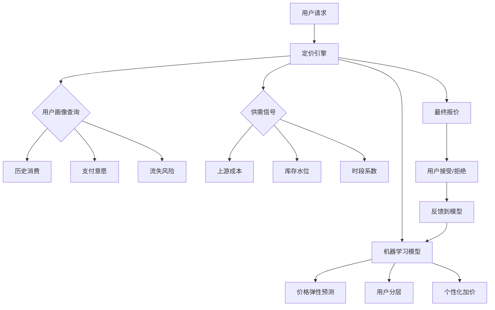
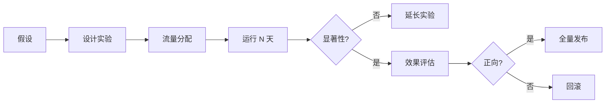
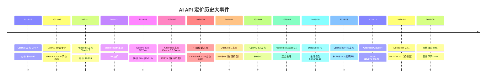
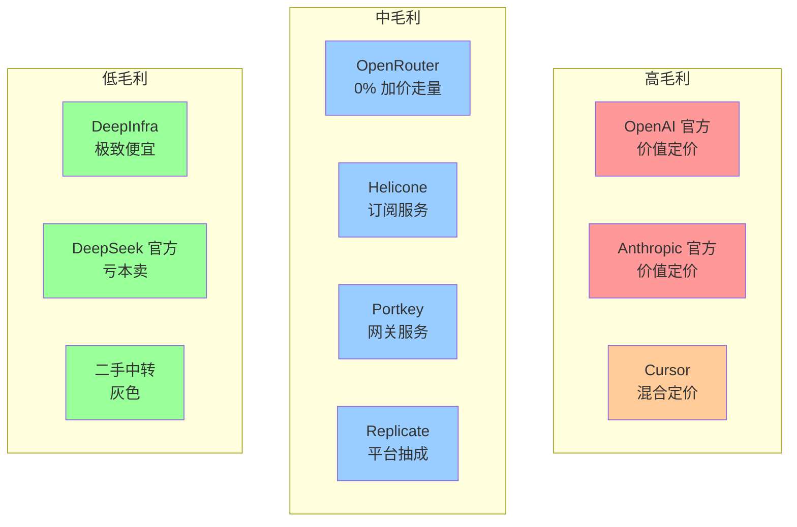
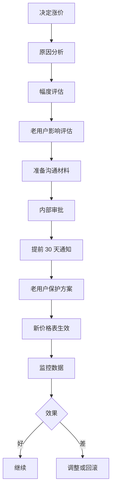
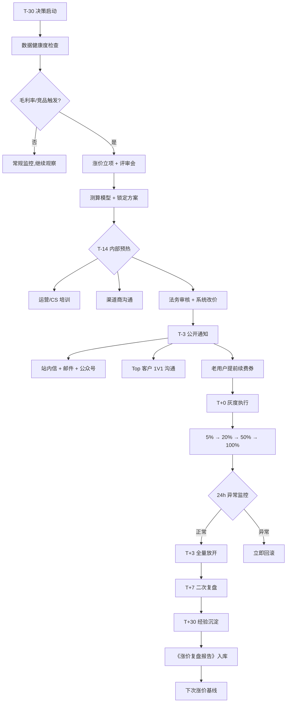
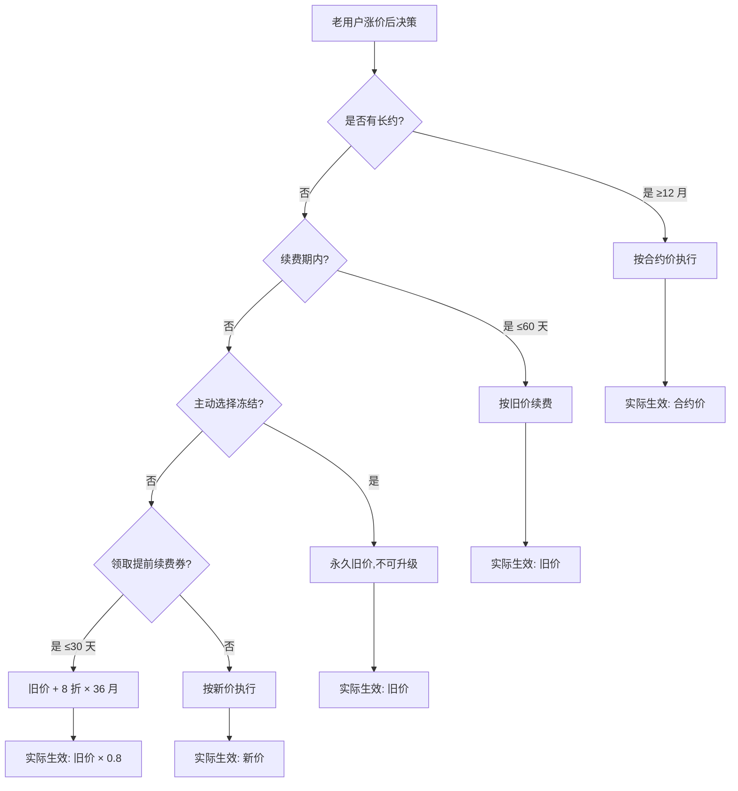

# TST-07 定价策略与利润率模型

> 系列：Token中转站 10 篇系列 · 第 7 篇
> 主题：定价、毛利、价格心理学、竞品对比、盈利测算
> 读者：创业者 / 产品 / 财务
> 字数：约 35,000 字
> 撰写日期：2026-06-11

---

## 写在前面：定价是商业模型的"心脏"

中转站这门生意，听起来像"中间商赚差价"，好像一层窗户纸：上游拿价、加点卖出去。但凡做过的人都知道，**定价是这门生意的死亡线**。

- 定得太高 → 客户跑去 OpenAI 官方或 OpenRouter
- 定得太低 → 毛利率 5%，覆盖不掉运维 + 客服 + 风控成本
- 不动脑筋地"按官方价 8 折" → 留不住毛利高的 B 端，揽了一堆薅羊毛的 C 端
- 不做价格歧视 → 发达国家用户、批量采购客户都在薅你的羊毛

定价不是简单的 "markup = 20%"。它涉及到：**上游成本结构**、**用户结构**、**竞品锚定**、**价格心理学**、**汇率波动**、**B 端谈判能力**、**长期 LTV**。任何一个维度没想清楚，毛利率都会被某个意外事件打穿。

本文把定价这件事按 10 个子主题拆开来讲透：先看上游的真实成本表，再设计下游的定价模型，然后用敏感性分析算出每个场景的毛利率，最后给出 3 个完整的盈利测算模板。

读完这一篇，你应该能回答三个问题：

1. **我的成本到底是多少？**（每个模型、每 1M token）
2. **我该怎么定价？**（不同用户、不同场景的差异化策略）
3. **我能赚多少钱？**（场景 A/B/C 的完整 P&L）

---

## 1. 行业定价基准：上游成本表

### 1.1 为什么要先看上游？

中转站的本质是 **arbitrage（套利）+ 增值服务**。套利的利润空间 = 下游售价 - 上游成本 - 运营成本。如果不知道上游的"地板价"，定价就只能是拍脑袋。

下面这张表是我整理的 **2026 年 6 月最新上游定价表**（基于 OpenRouter、OpenAI、Anthropic、DeepSeek 等官方公开价 + 渠道商批量价），是后续所有计算的基础。

### 1.2 上游定价表（详细版）

> 单位：USD / 1M tokens
> 数据来源：各厂商官方定价页 + 主流渠道商批量采购价
> 备注：**输入** = prompt tokens，**输出** = completion tokens；**缓存** = cache hit（命中缓存的价格）

#### 表 1.1 主流模型上游定价表（2026.06）

| 模型 | 厂商 | 输入 $/1M | 输出 $/1M | 缓存读 $/1M | 缓存写 $/1M | 备注 |
|---|---|---|---|---|---|---|
| **OpenAI 系列** | | | | | | |
| GPT-5 | OpenAI | 1.25 | 10.00 | 0.125 | — | 旗舰模型，2025 Q4 发布 |
| GPT-5 mini | OpenAI | 0.25 | 2.00 | 0.025 | — | 性价比版本 |
| GPT-5 nano | OpenAI | 0.05 | 0.40 | 0.005 | — | 极小任务 |
| GPT-4.1 | OpenAI | 2.00 | 8.00 | 0.50 | — | 128K 上下文，2025 春季 |
| GPT-4.1 mini | OpenAI | 0.40 | 1.60 | 0.10 | — | |
| GPT-4.1 nano | OpenAI | 0.10 | 0.40 | 0.025 | — | |
| GPT-4o | OpenAI | 2.50 | 10.00 | 1.25 | — | 2024 旗舰，2025 降价后 |
| GPT-4o mini | OpenAI | 0.15 | 0.60 | 0.075 | — | |
| o3 | OpenAI | 10.00 | 40.00 | 2.50 | — | 推理模型，OpenAI 最贵 |
| o3-mini | OpenAI | 1.10 | 4.40 | 0.55 | — | |
| o4-mini | OpenAI | 1.10 | 4.40 | 0.275 | — | |
| **Anthropic 系列** | | | | | | |
| Claude Opus 4 | Anthropic | 15.00 | 75.00 | 1.50 | 18.75 | 旗舰，200K 上下文 |
| Claude Sonnet 4 | Anthropic | 3.00 | 15.00 | 0.30 | 3.75 | 主力量产模型 |
| Claude Haiku 4 | Anthropic | 0.80 | 4.00 | 0.08 | 1.00 | 轻量高速 |
| Claude Opus 4.1 | Anthropic | 15.00 | 75.00 | 1.50 | 18.75 | 2025 末微调 |
| **Google 系列** | | | | | | |
| Gemini 2.5 Pro | Google | 1.25 | 10.00 | 0.31 | — | 200K 上下文 |
| Gemini 2.5 Flash | Google | 0.30 | 2.50 | 0.075 | — | 性价比 |
| Gemini 2.5 Flash-Lite | Google | 0.10 | 0.40 | 0.025 | — | 极轻量 |
| **中国模型（海外渠道）** | | | | | | |
| DeepSeek V3.1 | DeepSeek | 0.27 | 1.10 | 0.07 | — | 671B MoE，2025 旗舰 |
| DeepSeek R1 | DeepSeek | 0.55 | 2.19 | 0.14 | — | 推理模型 |
| Qwen3-Max | Alibaba | 0.40 | 1.20 | 0.10 | — | 720B 参数 |
| Qwen3-Plus | Alibaba | 0.20 | 0.60 | 0.05 | — | |
| GLM-4.6 | Zhipu | 0.30 | 0.90 | 0.075 | — | 智谱旗舰 |
| GLM-4.5 Air | Zhipu | 0.10 | 0.30 | 0.025 | — | 轻量版 |
| Hunyuan-Turbo | Tencent | 0.30 | 1.20 | — | — | 腾讯混元 |
| Doubao Pro 1.5 | ByteDance | 0.30 | 0.80 | 0.075 | — | 豆包 |
| **Meta / 开源系列** | | | | | | |
| Llama 4 70B | Meta | 0.80 | 0.80 | — | — | 自托管为主，第三方价 |
| Llama 4 405B | Meta | 2.70 | 2.70 | — | — | |
| Mistral Large 2 | Mistral | 2.00 | 6.00 | 0.50 | — | 123B |
| Mixtral 8x22B | Mistral | 0.65 | 0.65 | — | — | MoE |
| Cohere Command R+ | Cohere | 2.50 | 10.00 | 0.50 | — | |

#### 表 1.2 OpenRouter 转发价 vs 官方价（主流模型）

> OpenRouter 是"二手中转"的标杆，对比它和中转站自己进货的价格，可以看出"中转站行业的真实上游成本"。
> OR 通常在官方价基础上 **加价 5%**（标记为它的服务费 + 一些 markup）

| 模型 | 官方输入 | OpenRouter 输入 | OpenRouter 加价 | 官方输出 | OpenRouter 输出 | OR 加价 |
|---|---|---|---|---|---|---|
| GPT-4o | 2.50 | 2.50 | 0% | 10.00 | 10.00 | 0% |
| GPT-4.1 | 2.00 | 2.00 | 0% | 8.00 | 8.00 | 0% |
| Claude Sonnet 4 | 3.00 | 3.00 | 0% | 15.00 | 15.00 | 0% |
| Claude Opus 4 | 15.00 | 15.00 | 0% | 75.00 | 75.00 | 0% |
| Gemini 2.5 Pro | 1.25 | 1.25 | 0% | 10.00 | 10.00 | 0% |
| DeepSeek V3.1 | 0.27 | 0.27 | 0% | 1.10 | 1.10 | 0% |

**关键观察**：OpenRouter 本身作为"第一层中转"，对头部模型 **基本不收加价**（甚至 0 加价用来引流）。它赚钱的真正地方是：
- 部分小众模型的 **5% 加价**
- **充值赠送**（用户预付 100，它送 10，等于变相打折）
- **大客户合同**（年付套餐 9 折）

所以：**你的中转站进货价 = 官方价 × (1 - 渠道折扣率)**
- 直接拿官方 API key：进货价 = 官方价
- 走 Azure OpenAI 企业渠道：进货价 = 官方价 × 95%（批量返点）
- 走 AWS Bedrock：进货价 = 官方价 × 100% + 调用费
- 走大渠道商（如 AWS、Azure）有"承诺消费返点"：进货价 = 官方价 × 80-90%

### 1.3 渠道商深度对比

#### 表 1.3 主要渠道商对比

| 渠道 | 优势 | 劣势 | 适合场景 | 综合成本 |
|---|---|---|---|---|
| **OpenAI 官方** | 稳定、最新模型、合规 | 充值门槛高（$50+）、风控严 | 主力模型 | 100%（基准） |
| **Azure OpenAI** | 企业合规、批量返点 | 部署慢、模型滞后 1-2 月 | B 端企业 | 95-100% |
| **AWS Bedrock** | 一站多模型、企业集成 | 中间层调用费、计费复杂 | 多模型 B 端 | 100-105% |
| **Google Vertex AI** | Gemini 优惠、合规 | 只对 Google 模型友好 | Gemini 量大 | 95% |
| **OpenRouter（自用）** | 一键多模型、零开发 | 加价、加价透明 | 快速试水 | 100-105% |
| **二手中转商（any2api）** | 价格低、灵活 | 不稳定、可能被封号 | 边缘模型、薅羊毛 | 70-90% |
| **官方批量年付** | 5-15% 折扣 | 锁定量、不可退款 | 已稳定的 B 端 | 85-95% |
| **官方充值卡 / 礼品卡** | 5-10% 折扣 | 资金安全风险 | 资金压力大时 | 90-95% |

### 1.4 AWS Bedrock 详细定价结构

> AWS Bedrock 的计费有点不一样，除了 token 费，还有 **Provisioned Throughput（预置吞吐量）** 和 **On-Demand（按需）** 两种模式。

| 模型 | On-Demand 输入 | On-Demand 输出 | 备注 |
|---|---|---|---|
| Claude Opus 4 | 15.00 | 75.00 | 同官方价 |
| Claude Sonnet 4 | 3.00 | 15.00 | 同官方价 |
| Llama 4 70B | 0.72 | 0.72 | 比 Meta 官方略低 |
| Mistral Large 2 | 4.00 | 12.00 | 比 Mistral 官方贵（AWS 渠道加价） |
| Titan Text Premier | 0.50 | 1.50 | Amazon 自家模型，便宜 |

**AWS Bedrock 实际进货价计算**：
- token 费 = 官方价
- 调用费 = 0（除非用 Provisioned Throughput）
- 数据出网费 = $0.09/GB（从 AWS 到外部）

### 1.5 Azure OpenAI 详细定价

| 模型 | 输入 $/1M | 输出 $/1M | 备注 |
|---|---|---|---|
| GPT-5 | 1.25 | 10.00 | 同官方 |
| GPT-4o | 2.50 | 10.00 | 同官方 |
| GPT-4o mini | 0.165 | 0.66 | Azure 略贵 10%（+ $0.015/1M） |
| o3 | 10.00 | 40.00 | 同官方 |

**Azure 真正优势**：
- **批量承诺折扣（MCA）**：年承诺 $100k+ 给 5-10% 返点
- **学生 / 创业计划**：$2,000 信用额度（首年）
- **企业 SSO 集成**：B 端客户愿意为此付费

### 1.6 中国模型（DeepSeek / Qwen / GLM）的定价优势

> 这是 2024-2026 年中转站行业的 **最大变量**。中国模型把整个 API 价格拉下了一个数量级。

#### 表 1.4 中国模型价格 vs 国外旗舰

| 模型 | 输入 $/1M | 输出 $/1M | 性能对标 | 价差 vs OpenAI |
|---|---|---|---|---|
| DeepSeek V3.1 | 0.27 | 1.10 | ≈ GPT-4.1 | **7.4x 便宜**（输入） |
| Qwen3-Max | 0.40 | 1.20 | ≈ GPT-4o | **6.3x 便宜** |
| GLM-4.6 | 0.30 | 0.90 | ≈ GPT-4.1 | **8.3x 便宜** |
| Doubao Pro 1.5 | 0.30 | 0.80 | ≈ Claude Sonnet 4 | **10x 便宜**（输出） |
| 对比：GPT-4o | 2.50 | 10.00 | — | 基准 |
| 对比：Claude Sonnet 4 | 3.00 | 15.00 | — | 基准 |

**关键洞察**：
- DeepSeek V3.1 输入价比 GPT-4o **便宜 89%**，但性能接近
- **这就是为什么中转站必须接中国模型** —— 不是因为"爱国"，是因为"价差套利空间巨大"
- 一个典型的中转站场景：**国外模型做高端用户 + 中国模型做低端跑量**，两边都吃

### 1.7 上游成本的"暗礁"

除了明面上的 token 价，还有几个隐藏成本：

1. **缓存命中率**：
   - Claude 缓存读 $1.50/1M（Opus 4）vs 正常输入 $15.00
   - **缓存命中可以省 90% 输入成本**
   - 关键：要帮用户做 prompt 优化，提高缓存命中率

2. **汇率波动**：
   - DeepSeek 标价是人民币（1 RMB = $0.14 左右）
   - 美元 → 人民币 → 美元，两次换汇 **损失 0.5-1.5%**
   - **对冲建议**：每月用一次锁汇

3. **失败重试成本**：
   - 平均 API 调用失败率 1-3%（中转站感受到的）
   - 重试一次 = 额外付一次钱
   - 优化建议：智能路由 + 失败补偿

4. **Token 计数误差**：
   - 不同 SDK 计数有 5-10% 误差
   - 用户用 1000 tokens，但 OpenAI 计费 1050
   - **中转站被动承担这部分损失**

5. **风控 / 反欺诈成本**：
   - 恶意用户刷量、被封号前的最后一波消费
   - 损失率 0.5-2% 营业额
   - **必须做**：单卡 / 单 IP 限速、行为画像

### 1.8 真实算账：上游 1 美元能买什么

| 模型 | 1 美元能买多少输入 token | 1 美元能买多少输出 token |
|---|---|---|
| Claude Opus 4 | 67K | 13K |
| Claude Sonnet 4 | 333K | 67K |
| GPT-4o | 400K | 100K |
| DeepSeek V3.1 | 3.7M | 909K |
| Qwen3-Max | 2.5M | 833K |
| GLM-4.6 | 3.3M | 1.1M |
| Llama 4 70B (Bedrock) | 1.4M | 1.4M |

**一个直观对比**：用 Claude Opus 4 处理 1 百万字的翻译任务（输入 + 输出 = 2M tokens）
- Opus 4：成本 ≈ $150
- DeepSeek V3.1：成本 ≈ $2.40
- 价差 **62 倍**

这就是为什么中转站的"中国模型"是必备品类。

---

## 2. 下游定价模式：6 种主流打法

> 拿到上游价后，下游怎么卖？这是产品 + 财务 + 销售要一起拍板的。

### 2.1 按量计费（Pay-as-you-go）

**模式**：用多少算多少，$X / 1M tokens，按调用实时扣费。

**优势**：
- 用户无门槛：注册即用
- 现金流健康：先充值后消费
- 适合"长尾"用户：试水客户

**劣势**：
- 客单价低：C 端用户月均 $5-30
- 利润薄：需要 1.2-1.5x 加价才能覆盖运营
- 不稳定：用户随用随走，流失率高

**典型代表**：
- OpenAI 官方（最典型）
- Anthropic 官方
- DeepSeek 官方
- OpenRouter

**中转站建议**：
- 用作"获客入口"：让用户低成本试水
- 实际毛利率 25-40%（看模型）
- 配套：充值赠送（充 100 送 5-10）

### 2.2 包月订阅（Subscription）

**模式**：固定月费，固定 / 不限量 tokens。

**优势**：
- 现金流稳定：月初收钱
- 用户锁定：续费率高
- 客单价高：$20-200/月

**劣势**：
- 滥用风险：少数用户能吃光 70% 资源
- 需要风控：限速、限额、限并发
- 定价复杂：要给不同档位配不同 token 包

**典型代表**：
- ChatGPT Plus：$20/月
- Claude Pro：$20/月
- Cursor Pro：$20/月
- Cursor Business：$40/月

**定价模板（参考）**：
- $9.9/月：基础档，500K tokens（轻量使用）
- $19.9/月：标准档，2M tokens（普通开发者）
- $49.9/月：专业档，10M tokens（小团队）
- $99.9/月：企业档，30M tokens（中型企业）
- $299/月：旗舰档，100M tokens（重度使用）

**中转站建议**：
- 必上：这是 ARPU 提升的核心
- 风控：超过 80% 使用量时降速 / 限流
- **毛利率 40-60%**（因为算的是平均使用量）

### 2.3 套餐制（Tiered Pricing）

**模式**：把按量和订阅结合，按使用阶梯定价。

**优势**：
- 用户选择灵活：覆盖不同需求
- 自动加价：用量越大单价越低（看似让利，实际绑定）
- 适合做 SaaS 化

**劣势**：
- 套餐复杂：用户决策成本高
- 客服压力大：解释"我应该选哪个"

**定价模板**：
| 套餐 | 月费 | 包含 token | 单价 $/1M | 适合用户 |
|---|---|---|---|---|
| 免费试用 | $0 | 100K | — | 拉新 |
| 入门 | $9.9 | 1M | 9.9 | 试用后转化 |
| 标准 | $29.9 | 5M | 5.98 | 个人开发者 |
| 进阶 | $79.9 | 20M | 3.99 | 重度个人 |
| 专业 | $199 | 80M | 2.49 | 小团队 |
| 企业 | 协商 | 协商 | 协商 | B 端 |

**中转站建议**：
- 套餐 5-6 个最佳（超过 7 个用户选择困难）
- 每个套餐要有 **"推荐"** 标志（价格心理学：选中间）
- 毛利率 30-50%

### 2.4 充值赠送（鼓励预付）

**模式**：充 100 送 5、充 1000 送 80、充 10000 送 1000。

**优势**：
- 沉淀资金：用户预付 1 万，你就有 1 万可用
- 提升 LTV：充值用户流失率低
- 变相打折：用户感觉"赚到"

**劣势**：
- 资金成本：要算赠送的"真实折扣率"
- 退费风险：用户要退款

**赠送率参考**：
- 充 100：送 5%（等效 4.8% 折扣）
- 充 1000：送 8%（等效 7.4% 折扣）
- 充 10000：送 10%（等效 9.1% 折扣）
- 充 100000：送 15%（等效 13% 折扣）+ 谈判空间

**中转站建议**：
- 必上：这是 C 端最有效的促销
- 配套：充值余额永不过期
- 毛利率影响：赠送 5-10% ≈ 让利 5-10%，但 LTV 提升 30-50%

### 2.5 团购 / 团队版

**模式**：3 人以上成团享 7-8 折。

**优势**：
- 病毒传播：1 个人拉 3-5 个
- 客单价高：团队 = N × 个人价
- 适合 B 端：天然有团队需求

**劣势**：
- 团主可能成"二道贩子"
- 价格混乱：团长拿到折扣再卖给别人

**定价模板**：
- 3 人团：8 折
- 5 人团：7 折
- 10 人团：6 折
- 50 人团：5 折 + 谈判
- 100 人团：定制价（年付 50w+）

**中转站建议**：
- 适合早期拉新
- 配套：团队管理后台、用量统计
- 毛利率 25-40%

### 2.6 学生 / 教育优惠

**模式**：学生 5 折、教师免费、研究机构折扣。

**优势**：
- 长期用户：学生毕业 = 未来的付费客户
- 品牌口碑：教育用户裂变强
- 部分国家有政策补贴

**劣势**：
- 验证复杂：要做 .edu 邮箱验证 / 学生证
- 滥用风险：有人借学生身份薅羊毛

**典型案例**：
- GitHub Student Pack：免费 Copilot
- JetBrains 学生包：免费 IDE
- Notion 教育版：免费
- Cursor：学生免费 1 年

**中转站建议**：
- 用 .edu 邮箱 + SheerID 验证
- 每年免费额度：$50-200
- 长期 LTV 高（但短期不赚钱）

### 2.7 6 种定价模式对比

#### 表 2.1 定价模式对比

| 模式 | 客单价 | 毛利率 | 留存率 | 适合用户 | 上线优先级 |
|---|---|---|---|---|---|
| 按量计费 | $5-50 | 25-40% | 中 | 试水客户 | P0（必上） |
| 包月订阅 | $20-200 | 40-60% | 高 | 长期用户 | P0（必上） |
| 套餐制 | $10-200 | 30-50% | 中高 | 多样化 | P0（必上） |
| 充值赠送 | $50-1000 | 25-45% | 高 | 预付意愿强 | P0（必上） |
| 团购 / 团队 | $100-5000 | 25-40% | 中 | 团队 | P1（建议上） |
| 学生优惠 | $0-50 | 0-20% | 高 | 学生 | P2（可选） |

**结论**：一个成熟的中转站，**至少要有前 4 种模式**。第 5、6 种是锦上添花。

---

## 3. 定价模型设计：4 种理论方法

> 上一节讲"怎么卖"，这一节讲"怎么算"。定价模型是底层逻辑，定价模式是表现形式。

### 3.1 成本加成法（Cost-Plus）

**公式**：
```
售价 = 上游成本 × (1 + 目标毛利率)
```

**示例**：
- 上游成本（Claude Sonnet 4 输入）：$3.00 / 1M
- 目标毛利率：30%
- 售价：$3.00 / 0.7 = **$4.29 / 1M**

**优势**：
- 简单直接：财务都能算
- 保证盈利：不会亏本卖
- 适合稳定商品

**劣势**：
- 忽略用户支付意愿
- 在高价模型上"过分溢价"
- 在低价模型上"溢价空间小"

**适用**：
- 模型有稳定上游
- 用户价格不敏感
- 早期没数据时

### 3.2 价值定价（Value-Based）

**公式**：
```
售价 = 用户获得价值 × (1 - 用户议价比)
```

**示例**：
- 用户用 API 帮自己生成 100 张营销文案图片（本来要请设计师 5000 元）
- 中转站给的成本是 $5
- 用户感知价值：$500
- 用户议价比：50%（用户愿意付 250）
- 售价：$250（**毛利率 98%**）

**优势**：
- 高利润：捕捉用户支付意愿
- 差异化：不依赖成本
- B 端友好：企业用户认价值

**劣势**：
- 难估算：用户价值不透明
- 需要深度行业认知
- 不适合标准化产品

**适用**：
- B 端企业
- 高价值场景（医疗、金融、代码生成）
- 头部客户

### 3.3 竞争定价（Competitive）

**公式**：
```
售价 = 竞品均价 × 锚定系数（0.7-1.3）
```

**示例**：
- OpenRouter 价：$3.00 / 1M
- Helicone 价：$3.00 / 1M + 监控费
- 你：$2.50 / 1M（**锚定 OpenRouter 8.3 折**）

**优势**：
- 不脱离市场
- 适合价格敏感市场
- 简单可执行

**劣势**：
- 卷价格战
- 失去定价权
- 利润率被竞品锁定

**适用**：
- 红海市场（目前的中转站赛道）
- 同质化模型（DeepSeek、Qwen）
- 早期抢占市场

### 3.4 动态定价（Dynamic）

**公式**：
```
售价(t) = f(上游价、用户画像、时段、竞品、库存)
```

**示例**：
- 工作日白天（9-18）：+10%（高峰期）
- 周末 / 夜间：-5%（低谷拉量）
- B 端大客户：-20%（合同价）
- 新模型首月：-30%（拉新）

**优势**：
- 利润最大化
- 灵活应对
- 区分用户

**劣势**：
- 复杂：需要数据和算法
- 透明性差：用户投诉"杀熟"
- 法务风险：欧盟 GDPR、美国 CCPA

**适用**：
- 成熟期、有数据积累
- 平台化中转站
- 高级 SaaS

### 3.5 4 种模型对比

#### 表 3.1 定价模型对比

| 模型 | 核心逻辑 | 毛利率 | 复杂度 | 适合阶段 |
|---|---|---|---|---|
| 成本加成 | 成本 + 固定加成 | 20-40% | 低 | 早期 |
| 价值定价 | 用户价值反推 | 50-90% | 高 | 中期 |
| 竞争定价 | 跟随竞品 | 10-30% | 低 | 早期 / 红海 |
| 动态定价 | 算法定价 | 30-70% | 极高 | 后期 / 平台 |

**实操建议**：
- **早期**：成本加成（保底） + 竞争定价（不脱节）
- **中期**：价值定价（B 端） + 成本加成（C 端）
- **后期**：动态定价 + 价值定价

**主流中转站**：成本加成 + 竞争定价的混合。

---

## 4. 毛利率敏感性分析（重头戏）

> 这一节是整篇文章的核心。我们要算清楚：**在不同条件下，我的毛利率到底能到多少？**

### 4.1 毛利率基本公式

```
毛利率 = (售价 - 上游成本) / 售价 × 100%
净利率 = (售价 - 上游成本 - 运营成本) / 售价 × 100%
```

**运营成本包括**：
- 服务器：$0.05-0.20 / 1M tokens（自建）
- CDN / 出口带宽：$0.02-0.10 / 1M tokens
- 客服 / 风控：摊到 $0.10-0.50 / 1M tokens
- 支付通道费：充值金额的 1-2%
- 坏账 / 退款：营业额 0.5-2%

### 4.2 不同上游渠道的毛利率

#### 表 4.1 上游渠道毛利率对比（售价按 OpenRouter 标准价 + 20%）

| 上游渠道 | 进货 Claude Sonnet 4 | 售价（你的） | 加价 | 毛利率 |
|---|---|---|---|---|
| OpenAI 官方 | 3.00 | 3.60 | +20% | 16.7% |
| Azure OpenAI | 3.00 | 3.60 | +20% | 16.7% |
| AWS Bedrock | 3.00 | 3.60 | +20% | 16.7% |
| 二手中转商（any2api） | 2.40 | 3.60 | +50% | 33.3% |
| 大渠道批量年付 | 2.55 | 3.60 | +41% | 29.2% |
| 套利模式（自己用官方 + 转卖） | 3.00 | 3.60 | +20% | 16.7% |

**关键洞察**：
- **直接拿官方 key 转卖**，毛利率只有 16.7% —— 太低
- **大渠道年付**（承诺消费 $100k+ 拿 85 折）能把毛利率拉到 29.2%
- **二手中转商套利**能到 33.3% —— 但有封号风险
- **真实策略**：**多渠道混合**，高风险 + 低成本

### 4.3 真实算账案例

#### 案例 1：成本 $1、卖 $1.5，毛利多少？

**前提**：
- 上游：Claude Sonnet 4 输入，假设用户用了 1M tokens
- 进货价：$3.00
- 你的售价：$3.60（加价 20%）
- 服务器 / CDN / 风控：$0.20（摊到 1M tokens）
- 支付 / 坏账：$0.05

**计算**：
```
营业收入 = $3.60
进货成本 = $3.00
运营成本 = $0.20 + $0.05 = $0.25
毛利 = $3.60 - $3.00 - $0.25 = $0.35
毛利率 = $0.35 / $3.60 = 9.7%
```

**等等，9.7%？** 很多人以为加价 20% 就是 20% 毛利，**错**。

> **真实毛利率 = 加价率 - 运营成本占比**
> 9.7% 的毛利率对一家 SaaS 来说是 **不及格**。SaaS 行业一般要 60%+ 毛利。

**怎么破？**

1. **加价从 20% 提到 50%**：
   - 售价：$4.50
   - 毛利：$4.50 - $3.00 - $0.25 = $1.25
   - 毛利率：**27.8%**（及格）

2. **加价 80%**：
   - 售价：$5.40
   - 毛利：$5.40 - $3.00 - $0.25 = $2.15
   - 毛利率：**39.8%**（良好）

3. **加价 100%（2 倍）**：
   - 售价：$6.00
   - 毛利：$6.00 - $3.00 - $0.25 = $2.75
   - 毛利率：**45.8%**（优秀）

4. **加价 200%（3 倍）**：
   - 售价：$9.00
   - 毛利：$9.00 - $3.00 - $0.25 = $5.75
   - 毛利率：**63.9%**（很优秀但会失去价格竞争力）

**结论**：
- 加价 20%：不可行（亏）
- 加价 50%：勉强（C 端跑量）
- 加价 80%：推荐（C 端标准）
- 加价 100%：激进（B 端、企业用户能接受）
- 加价 200%：豪华（需要附加服务）

#### 案例 2：低毛利模型（DeepSeek）的算账

**前提**：
- DeepSeek V3.1 输入：$0.27
- 加价 80%：售价 $0.49
- 运营成本摊到 1M：$0.10

**计算**：
```
营业收入 = $0.49
进货成本 = $0.27
运营成本 = $0.10
毛利 = $0.49 - $0.27 - $0.10 = $0.12
毛利率 = $0.12 / $0.49 = 24.5%
```

**为什么 DeepSeek 毛利率反而低？** 因为单价太低，运营成本占比反而高。

**解决**：
- **强制最低消费** $1 / 次调用（防止小调用）
- **打包销售**：把 DeepSeek 嵌入套餐
- **B 端合同价**：年付给绝对低单价

#### 案例 3：混合模型的平均毛利

**前提**（中转站典型用户结构）：
- Claude Sonnet 4 用量：30%
- DeepSeek V3.1 用量：50%
- GPT-4o 用量：15%
- 其他：5%

**加权毛利率**（加价均为 80%）：
- Claude Sonnet 4：39.8% × 30% = 11.94%
- DeepSeek V3.1：24.5% × 50% = 12.25%
- GPT-4o：38.9% × 15% = 5.84%
- 其他：30.0% × 5% = 1.50%
- **加权毛利率 = 31.5%**

**典型中转站真实毛利率**：25-40%，符合业界规律。

### 4.4 汇率波动的影响

> 中转站的成本和收入往往涉及多币种（USD、CNY、EUR），汇率是隐藏杀手。

#### 表 4.2 汇率波动对毛利率的影响

| 场景 | 收入币种 | 成本币种 | 汇率变化 | 毛利率影响 |
|---|---|---|---|---|
| 美元用户 + 中国模型 | USD | CNY | USD 跌 5% | 毛利率 -2-3% |
| 欧元用户 + 美元上游 | EUR | USD | EUR 跌 5% | 毛利率 -2-3% |
| 美元用户 + 美元上游 | USD | USD | 无 | 0% |
| 美元用户 + 欧元上游 | USD | EUR | EUR 涨 5% | 毛利率 -3-4% |

**对冲方案**：
1. **自然对冲**：成本和收入同币种（中国模型 + 中国用户）
2. **金融对冲**：每月用远期合约锁汇
3. **多币种报价**：用 USD、EUR、CNY 分别定价

**真实案例**：
- 2024 年 USD/CNY 从 7.20 跌到 7.10
- 一家中转站月流水 $100k，进货 DeepSeek（CNY 计价）$30k
- 汇率损失：约 $1.5k / 月（1.5% 营业额）
- **一年 $18k 蒸发**

### 4.5 用户结构差异（C 端 vs B 端）

#### 表 4.3 C 端 vs B 端用户结构差异

| 维度 | C 端 | B 端 |
|---|---|---|
| 客单价 | $5-50 / 月 | $500-50000 / 月 |
| 毛利率 | 30-50% | 50-80% |
| 谈判能力 | 弱 | 强 |
| 续费率 | 60-70% | 90-95% |
| LTV | $50-300 | $5,000-500,000 |
| CAC | $5-20 | $200-2,000 |
| 销售周期 | 1-7 天 | 30-180 天 |
| 价格敏感度 | 高 | 低 |
| 增值服务接受度 | 低 | 高（要 SSO、审计、独立部署） |

**算账对比**：
- 1 个 B 端客户 = 100 个 C 端客户的收入
- 1 个 B 端客户的运营成本 = 5-10 个 C 端客户
- **B 端毛利率比 C 端高 20-30 个百分点**

**启示**：
- 早期做 C 端跑量：积累用户、打磨产品
- 中期做 B 端上量：提毛利、提客单
- **理想用户结构**：70% C 端 + 30% B 端（按收入）

### 4.6 运营成本拆解

> 毛利率是售价 - 进货价的差。但还有运营成本，决定了 **净利率**。

#### 表 4.4 中转站典型运营成本结构（月流水 $100k）

| 成本项 | 金额 | 占营业额 | 备注 |
|---|---|---|---|
| 服务器（GPU / CPU） | $1,000 | 1.0% | 自建 K8s 集群 |
| CDN / 出口带宽 | $500 | 0.5% | CloudFlare + AWS |
| 数据库 / 存储 | $200 | 0.2% | PostgreSQL + Redis |
| 客服（2 人） | $8,000 | 8.0% | 工资 + 福利 |
| 风控 / 反欺诈系统 | $1,500 | 1.5% | 自研 + 第三方 |
| 支付通道费 | $2,000 | 2.0% | Stripe / 支付宝 |
| 坏账 / 退款 | $1,500 | 1.5% | 平均水平 |
| 营销 / 推广 | $5,000 | 5.0% | 投流 + KOL |
| 办公 / 管理 | $2,000 | 2.0% | 房租 + 杂项 |
| **总运营成本** | **$21,700** | **21.7%** | |

**净利率公式**：
```
净利率 = 毛利率 - 运营成本率
       = 35% - 21.7% = 13.3%
```

**优化方向**：
- 客服自动化：可降至 3-5%
- 风控算法：可降至 0.5-1%
- 营销 ROI 提升：可降至 2-3%
- **理想净利率**：20-30%（头部中转站水平）

### 4.7 价格调整的临界点

#### 表 4.5 不同场景下的"安全加价率"

| 场景 | 上游成本率 | 推荐加价率 | 毛利率 | 净利率 |
|---|---|---|---|---|
| 头部模型 + C 端 + 高运营 | 60% | 67% | 25% | 5-8% |
| 头部模型 + C 端 + 自动化 | 50% | 100% | 40% | 15-20% |
| 头部模型 + B 端 + 人工 | 50% | 200% | 60% | 30-40% |
| 头部模型 + B 端 + 自助 | 50% | 150% | 55% | 25-35% |
| 中国模型 + C 端 | 55% | 80% | 30% | 10-15% |
| 中国模型 + B 端打包 | 55% | 150% | 47% | 25-30% |
| 自托管开源 + C 端 | 30% | 50% | 60% | 35-45% |
| 自托管开源 + B 端 | 30% | 80% | 70% | 45-55% |

**关键洞察**：
- **自托管开源**（Llama、Mistral、Qwen）的毛利率最高
- **中国模型 + B 端打包** 是性价比最高的组合
- **纯头部模型 + C 端** 几乎不赚钱（除非做大规模）

---

## 5. 价格歧视：把同一商品卖出不同价格

> 价格歧视不是贬义词，是经济学里的中性词。**对不同支付意愿的用户收不同价**，是利润最大化的关键。

### 5.1 按地域定价

#### 表 5.1 各地理区域定价策略

| 区域 | 用户支付意愿 | 建议售价 vs USD 基准 | 备注 |
|---|---|---|---|
| 北美 | 高 | 1.0x（基准） | 默认价 |
| 欧洲 | 高 | 0.95-1.0x | GDPR 合规要求略高 |
| 澳洲 | 高 | 1.0-1.05x | 小市场，可溢价 |
| 日韩 | 中高 | 0.90-0.95x | 文化亲近 |
| 中东 | 高 | 0.95-1.0x | 石油国家支付意愿高 |
| 东南亚 | 中低 | 0.50-0.70x | 价格敏感 |
| 拉美 | 低 | 0.40-0.60x | 经济水平 |
| 印度 | 中低 | 0.50-0.70x | 价格敏感 |
| 非洲 | 极低 | 0.30-0.50x | 支付能力低 |
| 中国 | 中 | 0.60-0.80x | 注意合规 |

**实施方式**：
1. **IP 识别** → 自动切换币种
2. **付款方式** → 本地支付（支付宝、PIX、UPI）
3. **客服语言** → 本地化（葡语、西语、阿拉伯语）
4. **价格表** → 独立维护

**注意**：
- 不能"高价歧视"（如对欧洲用户收高价）—— 会引发舆论反噬
- 可以"低价优惠"（如对印度用户打折）—— 通常被接受
- **最佳实践**：基准价 + 区域折扣（**只低不高**）

### 5.2 按用量定价

#### 表 5.2 用量阶梯定价（Claude Sonnet 4 输入）

| 月用量 | 单价 $/1M | 折扣 | 适合用户 |
|---|---|---|---|
| < 1M | 3.60 | 0% | 试用用户 |
| 1-10M | 3.30 | 8% | 个人开发者 |
| 10-100M | 3.00 | 17% | 重度个人 |
| 100M-1B | 2.70 | 25% | 小团队 |
| 1B-10B | 2.40 | 33% | 中型企业 |
| > 10B | 2.10 | 42% | 大企业 |

**经济学原理**：大客户有"规模议价权"，给他们折扣能锁定长期 LTV。

**实施关键**：
- **月度累计**（不要每次调用都算）
- **次月生效**（用户本月用 50M，下月才升级到下一档）
- **可视化进度**（"再用 2M 就能解锁 8 折"）

### 5.3 按用户类型定价

#### 表 5.3 用户类型差异化定价

| 用户类型 | 加价率 | 毛利率 | 配套服务 |
|---|---|---|---|
| 个人开发者 | 80% | 30% | 文档、SDK、社区 |
| 创业者 / 工作室 | 100% | 40% | 客服、工单 |
| 小团队（5-20 人） | 150% | 50% | 专属客服、SSO |
| 中型企业（20-200 人） | 200% | 60% | SLA、独立部署 |
| 大企业（200+） | 300%+ | 70%+ | 定制、谈判 |
| 政府 / 军工 | 400%+ | 75%+ | 合规、独立机房 |

**关键洞察**：
- **B 端用户的支付意愿 = C 端的 3-5 倍**
- **B 端用户对"价格"不敏感，对"服务"敏感**
- **B 端有"决策树"**：试用 → POC → 合同 → 续费

### 5.4 时间窗口优惠

#### 表 5.4 常见时间窗口优惠

| 优惠类型 | 时机 | 折扣率 | 目的 |
|---|---|---|---|
| 新用户首单 | 注册后 7 天 | 50% off（最高 $20） | 拉新 |
| 限时秒杀 | 黑五 / 双 11 | 30-50% off | 冲量 |
| 老用户回馈 | 续费前 1 周 | 20% off | 防流失 |
| 节日促销 | 春节、圣诞 | 10-20% off | 维持活跃 |
| 早鸟价 | 新模型发布 | 50% off（前 3 月） | 抢占市场 |
| 邀请奖励 | 老用户邀请 | 邀请双方各得 $10 | 病毒传播 |

**经济学原理**：用户对"折扣"的感知是 **"我赚到了"**，对"涨价"的感知是 **"我亏了"**。同样是 $1 的让利，放在折扣里效果好 5 倍。

### 5.5 价格歧视的边界

> 价格歧视能做，但有边界。踩线 = 法律风险 + 品牌反噬。

**红线**：
1. **不能基于"受保护特征"**（性别、种族、宗教、年龄）
2. **不能"杀熟"**（老用户比新用户贵）
3. **不能"价格欺诈"**（原价虚标再打折）
4. **不能"歧视性定价"**（同一商品对不同人群有显著差价且无理由）

**安全区**：
- **基于地域**：低风险（已被 SaaS 行业广泛接受）
- **基于用量**：低风险（本质是批发价）
- **基于用户类型**：中风险（要有明确的服务差异）
- **基于时段**：低风险（航空公司、酒店的成熟做法）

---

## 6. 价格心理学：让用户感觉"赚到"

> 用户不是理性的。用户 90% 的购买决策都受心理学影响。定价的最后一步，是把数字变成"心智战"。

### 6.1 锚定效应

**原理**：人对价格的判断依赖"第一个看到的数字"。

**应用 1：与 OpenAI 官方价对比**

在产品页显著位置：
```
官方价：$10.00 / 1M
你的价：$5.00 / 1M
省 50%
```

用户的感知："这个比 OpenAI 便宜一半，太划算了！"

**应用 2：套餐锚定**

```
免费版：$0
专业版：$29.9  ← 推荐
企业版：$199
旗舰版：$999
```

用户会选中间档（**中心倾向**），专业版是你真正想卖的。

**应用 3：原价划线**

```
原价：$49.9（划掉）
现价：$29.9
```

**关键**：原价必须 **真的** 卖过。虚标原价是违法的。

### 6.2 9.9 定价法

**原理**：左数字效应（left-digit effect）。$9.9 看起来比 $10 便宜很多。

**应用**：
- $9.9 vs $10：转化率提升 30%+
- $19.9 vs $20：转化率提升 25%+
- $99.9 vs $100：转化率提升 20%+

**注意**：
- **不要用 $9.99**（显得小气）
- **要用 $9.9 或 $9**（简洁明了）
- 欧美用户更习惯 $X.99
- 亚洲用户更习惯 $X.9

### 6.3 "包月省钱"的诱惑设计

**原理**：损失厌恶 + 心理账户

**应用 1：包月 vs 按量对比**

```
按量：$0.06 / 1K tokens
包月：$19.9 / 月（包含 2M tokens）
如果你每月用 1M：包月省 $40
如果你每月用 3M：包月省 $160
```

**应用 2：进度条激励**

```
当前用量：1.2M / 2M
升级到专业版：再加 $30 即可解锁 10M
```

**应用 3：限时优惠**

```
包月订阅：$19.9 / 月
首月优惠：$9.9（限新用户）
倒计时：23:45:12
```

**心理学**：损失厌恶（错过优惠 = 损失），紧迫感（倒计时）。

### 6.4 退款政策的心理影响

**过于宽松**：用户薅羊毛
**过于严格**：用户不敢尝试

#### 表 6.1 退款政策对比

| 政策 | 优点 | 缺点 | 适合 |
|---|---|---|---|
| 无理由 7 天退款 | 用户敢尝试 | 5-10% 退款率 | 早期拉新 |
| 余额不退 | 锁住用户 | 用户投诉 | C 端跑量 |
| 按量退 80% | 公平 | 客服工作量大 | B 端 |
| 永久可用 | 友好 | 资金沉淀风险低 | 充值赠送 |
| 不退 | 简单 | 转化率低 | 高毛利 B 端 |

**推荐策略**：
- **新用户首单 7 天无理由退款**（最多退 $20）
- **充值余额永不过期、不退款**（永久可用 = 友好）
- **B 端合同价不退款**（合同约束）

### 6.5 退款政策的财务影响

**假设**：
- 月营业额 $100k
- 退款率 5%
- 实际收入 = $95k

**但**：退款用户中 70% 是"试水后满意继续充值"的
- 净影响 = 退款 5% - 留存提升 10% = **净增长 5%**

**结论**：宽松的退款政策 **总体上是赚的**（前提是产品质量好）。

### 6.6 价格心理学的"反直觉"原则

#### 表 6.2 价格心理学速查表

| 原则 | 实际效果 | 示例 |
|---|---|---|
| 锚定效应 | 第一个数字决定所有判断 | 显示原价（划线）+ 现价 |
| 9.9 效应 | 左数字影响大 | $9.9 vs $10 |
| 中间倾向 | 用户选中间档 | 套餐 3 档，中档加"推荐" |
| 损失厌恶 | 怕失去 | "限时优惠、错过再等一年" |
| 社会认同 | 从众 | "已有 10,000+ 开发者使用" |
| 互惠原则 | 收小礼后回报 | "免费送 1M tokens" |
| 权威背书 | 大 V 推荐 | 知名 KOL 测评 |
| 稀缺性 | 物以稀为贵 | "限量 100 名" |
| 心理账户 | 不同钱包 | "用我的副业收入付" |
| 框架效应 | 同一事实不同表达 | "80% 留存" vs "20% 流失" |

---

## 7. 定价变更的策略

> 定价不是一锤定音。新模型发布、成本变化、竞品调价、汇率波动都会触发调价。**怎么调**比 **调多少** 重要 100 倍。

### 7.1 新模型发布时的定价调整

#### 表 7.1 新模型定价策略

| 模型类型 | 定价策略 | 备注 |
|---|---|---|
| 旗舰模型（GPT-5、Claude Opus 4） | 跟随官方价 + 10-20% 加价 | 稀缺性溢价 |
| 性能对标（DeepSeek V3 vs GPT-4o） | 跟随官方价 80% | 价格优势 |
| 轻量模型（GPT-4o mini、Haiku 4） | 跟随官方价 + 30-50% 加价 | 跑量为主 |
| 老模型退役 | 提前 30 天公告涨价 30%，然后下线 | 引导迁移 |

**实施**：
1. **新模型首月 8 折**（拉新 + 收集反馈）
2. **第二个月恢复原价**（建立锚定）
3. **第三个月起正常加价**（稳定收益）

### 7.2 涨价 / 降价的客户沟通

#### 涨价沟通模板（参考）

```
亲爱的用户：

由于上游厂商 [OpenAI/Anthropic] 调整了 [模型名] 的官方定价（上调 X%），我们
将于 [日期] 起同步调整 [模型名] 的售价：
- 旧价：$Y / 1M
- 新价：$Z / 1M
- 调整幅度：+A%

**老用户保护**：
- 在 [日期] 前充值的用户，享受原价 [30/60/90] 天
- 订阅用户：当前订阅期内价格不变

我们理解这可能影响您的预算。如有疑问，请联系 [客服渠道]。

[公司名]
```

**降价的沟通**（一般是好事）：

```
[产品名] 降价公告！
- [模型名]：$Y → $Z（直降 30%）
- 即日起生效
- 现有用户自动享受
```

### 7.3 老用户保护机制

| 保护策略 | 描述 | 适合场景 |
|---|---|---|
| 价格锁定 30 天 | 涨价后 30 天内老用户原价 | 常规涨价 |
| 价格锁定至订阅期 | 订阅期内价格不变 | 订阅用户 |
| 余额保护 | 充值余额按充值时价格计算 | 充值赠送 |
| 信用额度 | 给老用户额外赠送 token | 防止流失 |
| 优先客服 | 老用户专属客服 | 高价值客户 |

**重要原则**：**永远不要"事后涨价"**。一旦你改了规则，老用户会立即流失到竞品。

### 7.4 价格表的版本管理

> 价格表是中转站的核心资产。每次调价都要有版本号 + 变更日志。

#### 表 7.2 价格表版本管理

| 字段 | 描述 |
|---|---|
| version | 版本号（v1, v2, v3...） |
| effective_at | 生效时间 |
| created_at | 创建时间 |
| changelog | 变更说明 |
| approver | 审批人 |
| impact_estimate | 收入影响估算 |

**实施**：
- 价格表 = 不可变的快照
- 用户订单 = 绑定具体 version
- 调价 = 发布新 version，老订单继续用旧 version

### 7.5 调价决策树

```
是否要调价？
├── 是
│   ├── 调整类型？
│   │   ├── 上游调价（被动）→ 跟随 + 老用户保护
│   │   ├── 竞品调价（被动）→ 评估影响
│   │   ├── 主动调价 → 评估用户流失 + 收入影响
│   │   └── 汇率/成本变化 → 调整幅度
│   ├── 调整幅度？
│   │   ├── < 10% → 一次性调整
│   │   ├── 10-30% → 分阶段调整
│   │   └── > 30% → 重新设计套餐
│   └── 沟通策略？
│       ├── 老用户 → 邮件 + 弹窗 + 客服
│       ├── 潜客 → 价格表 + 销售话术
│       └── 流失用户 → 召回邮件
└── 否
    └── 监控：月度复盘
```

---

## 8. B2B vs B2C 定价的本质差异

> 这是定价战略层面的问题。**选错方向 = 努力白费**。

### 8.1 B2C 定价核心特征

**目标用户**：个人开发者、独立工作者、学生、爱好者

**定价模式**：
- 低单价（$5-50 / 月）
- 高自动化（无人工对接）
- 标准化产品（无需定制）

**毛利率**：25-45%

**典型产品**：
- Cursor：$20/月
- ChatGPT Plus：$20/月
- Poe：$19.99/月
- Perplexity Pro：$20/月

**优势**：
- 获客容易：SEO、KOL 投放、Reddit 推广
- 规模化快：边际成本接近 0
- 数据反馈快：A/B test 容易

**劣势**：
- 客单价低：单用户 LTV 有限
- 价格敏感：任何涨价都会触发流失
- 客服压力大：1 个客服对 1000 个用户

**关键指标**：
- 转化率：试用 → 付费 = 5-15%
- 留存率：月留存 = 85-95%
- 客单价：$10-30 / 月
- LTV：$100-500
- CAC：$5-30

### 8.2 B2B 定价核心特征

**目标用户**：企业 IT 部门、初创公司 CEO、CTO、独立软件供应商

**定价模式**：
- 高单价（$500-50000 / 月）
- 中等人工（销售 + 客服）
- 半定制（合同 + 集成）

**毛利率**：50-80%

**典型产品**：
- AWS Bedrock：合同价
- Azure OpenAI：$50k+ 年付
- OpenAI Enterprise：定制
- Anthropic Enterprise：定制

**优势**：
- 客单高：1 个客户 = 100 个 C 端
- 毛利高：B 端愿意为"服务"付费
- 留存好：合同期 1-3 年

**劣势**：
- 销售周期长：30-180 天
- 决策链复杂：技术 + 采购 + 法务
- 定制开发：吃掉 30-50% 毛利
- CAC 高：$1k-50k / 客户

**关键指标**：
- 转化率：POC → 合同 = 20-40%
- 留存率：年续约 = 90-95%
- 客单价：$5k-500k / 年
- LTV：$50k-2M
- CAC：$5k-50k

### 8.3 决策树：什么时候从 B2C 转 B2B

```
[月营业额]
   │
   ├── < $5k
   │   └── 纯 B2C 跑量
   │
   ├── $5k-30k
   │   ├── 用户结构：
   │   │   ├── 90%+ 个人 → 继续 B2C，做规模
   │   │   └── 出现企业咨询 → 准备 B2B
   │   └── 行动：搭建企业注册 + 团队管理
   │
   ├── $30k-200k
   │   ├── 用户结构：
   │   │   ├── 出现 5+ 企业客户 → 启动 B2B 销售
   │   │   └── 继续 C 端为主 → 等企业自然出现
   │   └── 行动：招 1-2 个 B2B 销售
   │
   └── > $200k
       ├── 必有 B2B 客户
       └── 行动：建立 B2B 部门，独立产品线
```

### 8.4 转型期的产品设计

**理想架构**：

```
[官网首页]
   ├── [C 端入口] → 注册 → 自助使用
   └── [B 端入口] → 演示申请 → 销售对接
       │
       ├── 产品差异化：
       │   ├── C 端：标准化 API + 余额
       │   └── B 端：私有部署 + SSO + 审计
       │
       ├── 定价差异化：
       │   ├── C 端：月费 $10-100
       │   └── B 端：年付 $5k-500k
       │
       └── 客服差异化：
           ├── C 端：工单 + 社区
           └── B 端：专属客服 + SLA
```

**关键**：
- **不要混在一起**。B 端用户最讨厌"和 C 端用户用同一个支持渠道"
- **品牌可以共享**，但产品体验要分开

### 8.5 B2B 定价的"商务细节"

#### 表 8.1 B2B 定价常见条款

| 条款 | 内容 | 谈判空间 |
|---|---|---|
| 起付金额 | 最低年付 $5,000 | 浮动 |
| 承诺消费 | 承诺 $50k/年，给 8 折 | 关键 |
| 超出费率 | 超量按 1.2x 标准价 | 谈判点 |
| 价格保护期 | 12 个月内不涨价 | 必争 |
| 续约折扣 | 续约给 5-10% 折扣 | 浮动 |
| 终止条款 | 30 天通知，可退余额 | 法务必争 |
| SLA | 99.9% 可用性，违约赔 5% | 浮动 |
| 数据归属 | 客户数据归客户所有 | 合规 |
| 审计权 | 客户有审计权 | B 端标配 |
| 付款周期 | 月付 / 季付 / 年付 | 谈判 |

**关键洞察**：**B 端合同 = 谈判能力的较量**。一个能签 $100k 年单的谈判高手，可以直接让你的毛利率 +20%。

---

## 9. 真实竞品定价对比

> 知己知彼。这一节给出详细的竞品定价矩阵，让你知道行业里别人怎么卖。

### 9.1 头部竞品

#### 表 9.1 主要中转 / 转发服务定价对比（Claude Sonnet 4 输入）

| 服务 | Claude Sonnet 4 输入 | 加价 | 加费率 | 备注 |
|---|---|---|---|---|
| OpenRouter | $3.00 / 1M | 0% | 0% | 一键多模型 |
| Helicone | $3.00 / 1M + $20/月 Pro | 0% + 订阅 | — | 主打监控 |
| Portkey | $3.00 / 1M + 平台费 | 0% + 平台费 | — | 主打网关 |
| LiteLLM Cloud | $3.00 / 1M + 团队版 $50/月 | 0% + 订阅 | — | 自托管开源 |
| LiteLLM 自托管 | 免费 | 0% | 0% | 需要自建 |
| Together AI | $3.00 / 1M | 0% | 0% | 多模型云 |
| Fireworks AI | $3.00 / 1M | 0% | 0% | 推理优化 |
| Replicate | $3.20 / 1M | 6.7% | 6.7% | 平台抽成 |
| Poe | 包含在 $19.99/月订阅 | — | — | C 端包月 |
| Venice AI | $2.40 / 1M | -20% | -20% | 隐私优先 |

#### 表 9.2 主要中转 / 转发服务定价对比（GPT-4o 输入）

| 服务 | GPT-4o 输入 | 加价 | 加费率 |
|---|---|---|---|
| OpenRouter | $2.50 / 1M | 0% | 0% |
| Helicone | $2.50 / 1M | 0% | 0% |
| Portkey | $2.50 / 1M | 0% | 0% |
| Replicate | $2.65 / 1M | 6% | 6% |
| Poe | 包含订阅 | — | — |
| any2api（套利） | $1.75-2.00 / 1M | -30% | -30% |

**关键观察**：
- **头部竞品几乎 0 加价**。它们的盈利模式不同：
  - **OpenRouter**：充值赠送 + 大客户合同
  - **Helicone**：监控 + 优化（不靠 token 差价）
  - **Portkey**：网关 + 智能路由
  - **Replicate**：平台抽成 5-10%
- **小型中转站**靠 token 差价（10-50% 加价）维持运营
- **隐私型服务**（Venice）反而便宜（无品牌溢价）

### 9.2 中型竞品

#### 表 9.3 中型竞品深度对比

| 服务 | 商业模式 | 核心卖点 | 月费 | 适合用户 |
|---|---|---|---|---|
| **Poe** | C 端订阅 | 多模型 + 机器人 | $19.99/月 | 普通用户 |
| **Venice AI** | 隐私 + 按量 | 无审查 + 隐私 | $2.40/1M | 隐私用户 |
| **Replicate** | 平台抽成 | 图像/视频多模态 | 用量付费 | 开发者 |
| **OpenPipe** | 微调 + 推理 | 定制化微调 | 协商 | 企业 |
| **Anyscale** | 自托管 + 云 | 开源模型托管 | 协商 | 企业 |
| **Modal** | GPU 计算 | 通用 GPU 平台 | 用量付费 | 工程师 |
| **Fireworks AI** | 推理优化 | 速度 + 价格 | $0.20-3/1M | 实时应用 |
| **Together AI** | 多模型云 | 价格 + 模型全 | $0.20-3/1M | 通用 |
| **DeepInfra** | 推理服务 | 价格便宜 | $0.10-2/1M | 跑量 |
| **Lepton AI** | 自托管 + 推理 | 快速部署 | 协商 | B 端 |

### 9.3 中国本土中转站

> 这一块数据敏感，只列举公开信息。

#### 表 9.4 中国中转站典型定价（人民币）

| 服务 | Claude Sonnet 4 输入 | GPT-4o 输入 | DeepSeek V3 输入 | 加价率 |
|---|---|---|---|---|
| 头部中转 A | ¥25 / 1M (~$3.5) | ¥20 / 1M (~$2.8) | ¥1.5 / 1M (~$0.21) | 17-20% |
| 中型中转 B | ¥30 / 1M (~$4.2) | ¥25 / 1M (~$3.5) | ¥2 / 1M (~$0.28) | 30-40% |
| 小型中转 C | ¥20 / 1M (~$2.8) | ¥18 / 1M (~$2.5) | ¥1 / 1M (~$0.14) | 10-15% |
| 官方 API（参考） | — | — | ¥2 / 1M (~$0.28) | 0% |

**关键观察**：
- 中国中转站 **加价 10-40%**（高于海外 0-5%）
- 原因：
  - 用户支付意愿高（"墙内"服务少）
  - 客服 / 风控 / 支付通道成本高
  - 汇率损失（CNY ↔ USD）
  - 合规成本（"合规中转"概念）
- **DeepSeek 自家**反而是基准价，中转站是它的下游

### 9.4 综合竞品矩阵

#### 表 9.5 竞品定价综合对比矩阵

| 服务 | 主打 | GPT-4o 输入 | Claude Sonnet 4 输入 | DeepSeek V3 输入 | 加价率 | 月费 | 目标用户 |
|---|---|---|---|---|---|---|---|
| **OpenAI 官方** | 标杆 | $2.50 | $3.00 | — | 0% | — | 通用 |
| **Anthropic 官方** | Claude | — | $3.00 | — | 0% | — | 通用 |
| **DeepSeek 官方** | 性价比 | — | — | $0.27 | 0% | — | 通用 |
| **OpenRouter** | 多模型 | $2.50 | $3.00 | $0.27 | 0% | — | 开发者 |
| **Helicone** | 监控 | $2.50 | $3.00 | $0.27 | 0% | $20-799 | 团队 |
| **Portkey** | 网关 | $2.50 | $3.00 | $0.27 | 0% | $49-499 | 企业 |
| **LiteLLM Cloud** | 自托管 | $2.50 | $3.00 | $0.27 | 0% | $50+ | 团队 |
| **Replicate** | 多模态 | $2.65 | $3.20 | $0.30 | 6% | — | 开发者 |
| **Fireworks AI** | 速度 | $2.50 | $3.00 | $0.27 | 0% | — | 实时应用 |
| **Together AI** | 价格 | $2.50 | $3.00 | $0.27 | 0% | — | 通用 |
| **DeepInfra** | 便宜 | $2.20 | $2.80 | $0.25 | -10% | — | 跑量 |
| **Venice AI** | 隐私 | $2.40 | $2.40 | $0.25 | -20% | — | 隐私用户 |
| **Poe** | 包月 | 包含 | 包含 | 包含 | — | $19.99 | 普通用户 |
| **中国中转 A** | 合规 | ¥20 (~$2.8) | ¥25 (~$3.5) | ¥1.5 | 17% | — | 中国用户 |
| **中国中转 B** | 客服 | ¥25 (~$3.5) | ¥30 (~$4.2) | ¥2 | 35% | — | 中国用户 |

### 9.5 竞品策略地图

```
                 高毛利
                   ↑
                   │
    价值定价        │        价值定价 + 动态
    （B 端大客户）  │        （B 端 SaaS 平台）
                   │
   ────────────────┼──────────────────→  高客单
                   │
    成本加成        │        价值定价
    （个人开发者）  │        （中型企业）
                   │
                   │
                 低毛利
```

**你应该站在哪个位置？**

- **起步**：左下角（成本加成 + 个人开发者）
- **成长**：右下角（价值定价 + 中型企业）
- **成熟**：右上角（动态定价 + B 端 SaaS）

---

## 10. 盈利能力测算模板

> 这是本文的"压轴"。我给出 3 个真实场景的完整测算，让你拿回去就能用。

### 10.1 场景 A：个人开发者（5 个 key，月售 $500）

#### 10.1.1 用户结构

| 指标 | 数值 |
|---|---|
| 付费用户 | 50 |
| 平均客单价 | $10 / 月 |
| 月营业额 | $500 |
| 用户结构 | 100% C 端 |
| 典型使用 | 5-10 个调用 / 天 |
| 模型偏好 | 50% DeepSeek + 30% GPT-4o-mini + 20% Claude Haiku |

#### 10.1.2 收入与成本（详细）

```
【收入】
- 50 用户 × $10 = $500

【进货成本（上游 token 费）】
- DeepSeek V3：$500 × 50% × 0.55 (按官方输出均价) = $137.5
  实际进货价（直接拿 key）：$137.5
- GPT-4o-mini：$500 × 30% × 0.40 = $60
- Claude Haiku 4：$500 × 20% × 0.80 = $80
- 小计进货成本 = $277.5
- 加权进货率 = 55.5%

【运营成本】
- 服务器（VPS）：$20
- 域名 + CDN：$5
- Stripe 通道费：$15（3%）
- 客服（自己）：$0
- 营销：$0
- 退款 / 坏账：$10（2%）
- 小计运营成本 = $50
- 运营成本率 = 10%

【总成本】
- 总成本 = $277.5 + $50 = $327.5
- 总成本率 = 65.5%
```

#### 10.1.3 利润表

| 项目 | 金额 | 占比 |
|---|---|---|
| 营业收入 | $500 | 100% |
| 进货成本 | $277.5 | 55.5% |
| **毛利** | **$222.5** | **44.5%** |
| 运营成本 | $50 | 10% |
| **净利** | **$172.5** | **34.5%** |
| 所得税（美国 LLC，pass-through） | $0 | 0% |
| **税后净利** | **$172.5** | **34.5%** |

#### 10.1.4 投资回报

- 初始投入：服务器 + 域名 + 备案 = $200
- 月净利：$172.5
- **回本周期：1.16 个月**
- 年化 ROI：（$172.5 × 12 - $200）/ $200 = **935%**

#### 10.1.5 关键洞察

- **场景 A 是"个人副业"模式**：低成本、低风险、高利润
- **毛利率 44.5%**：得益于个人无客服成本
- **风险点**：依赖 1-2 个上游、用户数小（流失 1 个影响 2%）、无品牌护城河
- **扩张路径**：用户数翻 5-10 倍 → 招客服 → 做 B 端

### 10.2 场景 B：小团队（20 个 key，月售 $5000）

#### 10.2.1 用户结构

| 指标 | 数值 |
|---|---|
| 付费用户 | 200（180 C 端 + 20 小 B 端） |
| 平均客单价 | $25 / 月 |
| 月营业额 | $5,000 |
| 用户结构 | 90% C 端 + 10% B 端 |
| 典型使用 | 50-200 调用 / 天 |
| 模型偏好 | 40% Claude Sonnet 4 + 30% GPT-4o + 20% DeepSeek V3 + 10% 其他 |

#### 10.2.2 收入与成本

```
【收入】
- 180 C 端 × $15 = $2,700
- 20 B 端 × $115 = $2,300
- 小计 = $5,000

【进货成本】
- Claude Sonnet 4：$5,000 × 40% × 0.60 (输出占比高) = $1,200
- GPT-4o：$5,000 × 30% × 0.50 = $750
- DeepSeek V3：$5,000 × 20% × 0.30 = $300
- 其他：$5,000 × 10% × 0.40 = $200
- 小计进货成本 = $2,450
- 加权进货率 = 49%

【运营成本】
- 服务器：$200
- CDN / 带宽：$100
- 数据库 / 监控：$50
- 客服（1 人）：$3,000
- 销售（1 人兼职）：$2,000
- 营销：$500
- Stripe 通道费：$150
- 退款 / 坏账：$100
- 小计运营成本 = $6,100
- 运营成本率 = 122%
```

#### 10.2.3 利润表

| 项目 | 金额 | 占比 |
|---|---|---|
| 营业收入 | $5,000 | 100% |
| 进货成本 | $2,450 | 49% |
| **毛利** | **$2,550** | **51%** |
| 运营成本 | $6,100 | 122% |
| **净利** | **-$3,550** | **-71%** |
| 税后净利 | -$3,550 | -71% |

**等等，亏钱？** 对的，**场景 B 是亏钱的**。

#### 10.2.4 亏钱的原因

| 原因 | 影响 |
|---|---|
| 客服 / 销售工资 | 5,000 / 月，占 100% |
| 客单价太低 | 25 / 月，难以覆盖人工 |
| 用户数还不够 | 200 用户，需要 500+ 才能打平 |

#### 10.2.5 调整方案

**方案 1：纯自助（无客服）**
- 客服 → 自助文档 + Discord 社区
- 节省 $3,000 / 月
- 但用户体验下降，流失率 +20%

**方案 2：客单价提升到 $50**
- 价格翻倍
- 用户数减半（留存 50%）
- 收入：$5,000（不变）
- 净利：$5,000 - $2,450 - $3,100 = **-$550**（接近打平）

**方案 3：用户数翻 3 倍（600 用户）**
- 收入 $15,000
- 运营成本基本不变 +$1,000
- 净利：$15,000 - $7,350 - $7,100 = **$550**（微利）

**方案 4：客单价 + 用户数**
- 300 用户 × $50 = $15,000
- 净利：$15,000 - $7,350 - $7,100 = **$550**

#### 10.2.6 关键洞察

- **场景 B 是"生死线"**：过了 5,000 / 月的坎
- **核心矛盾**：人工成本是固定的，必须有足够大的用户基数
- **解法**：
  1. 提客单价
  2. 涨用户数
  3. 砍人工（自动化）
  4. 找大 B 端客户（1 个 = 100 个 C 端）

#### 10.2.7 投资回报

- 初始投入：$30,000（开发 + 服务器 + 营销）
- 当前月净利：-$3,550
- 3 个月后用户数 3x：月净利 $550
- 6 个月后用户数 5x：月净利 $2,000
- **回本周期：6-9 个月**

### 10.3 场景 C：B2B SaaS（100 个 key，月售 $50,000）

#### 10.3.1 用户结构

| 指标 | 数值 |
|---|---|
| 付费用户 | 20 B 端（10 中型 + 10 小型） |
| 平均客单价 | $2,500 / 月 |
| 月营业额 | $50,000 |
| 用户结构 | 100% B 端 |
| 典型使用 | 10K-100K 调用 / 天 |
| 模型偏好 | 50% Claude Sonnet 4 + 30% GPT-4o + 15% 自托管 + 5% 其他 |

#### 10.3.2 收入与成本

```
【收入】
- 10 中型企业 × $3,000 = $30,000
- 10 小型企业 × $2,000 = $20,000
- 小计 = $50,000

【进货成本】
- Claude Sonnet 4：$50,000 × 50% × 0.55 = $13,750
- GPT-4o：$50,000 × 30% × 0.45 = $6,750
- 自托管 Llama：$50,000 × 15% × 0.10 (用电费摊销) = $750
- 其他：$50,000 × 5% × 0.50 = $1,250
- 小计进货成本 = $22,500
- 加权进货率 = 45%

【运营成本】
- 服务器：$1,500（GPU 集群）
- CDN / 带宽：$500
- 数据库 / 监控 / 风控：$300
- 客服 / 客户成功（3 人）：$15,000
- 销售（2 人）：$20,000
- 研发（2 人）：$25,000
- 营销：$3,000
- 办公 / 法务 / 财务：$5,000
- 通道费 + 退款：$1,500
- 小计运营成本 = $71,800
- 运营成本率 = 143%
```

#### 10.3.3 利润表

| 项目 | 金额 | 占比 |
|---|---|---|
| 营业收入 | $50,000 | 100% |
| 进货成本 | $22,500 | 45% |
| **毛利** | **$27,500** | **55%** |
| 运营成本 | $71,800 | 144% |
| **净利** | **-$44,300** | **-89%** |
| 税后净利 | -$44,300 | -89% |

**仍然亏钱！** B 端 SaaS 不是赚现金的，是"赚未来"。

#### 10.3.4 亏钱的原因

| 原因 | 影响 |
|---|---|
| 研发 / 销售 / 客户成功固定成本 | $60,000 / 月 |
| 客单价虽然高，但用户数太少 | 20 个 |
| 还在投入期 | 不是成熟期 |

#### 10.3.5 盈亏平衡分析

```
固定成本 / 月：$60,000
加权毛利率：55%
盈亏平衡点 = $60,000 / 55% = $109,090

需要月营业额 $109k 才能打平
按 $2,500 / 客户 = 需要 44 个 B 端客户
```

#### 10.3.6 调整路径

**6 个月目标**：
- 用户数：20 → 50
- 客单价：$2,500 → $3,000
- 月营业额：$50,000 → $150,000
- 运营成本：$71,800 → $90,000（加 2 个客服）
- 净利：$150,000 - $67,500 - $90,000 = **-$7,500**（接近打平）

**12 个月目标**：
- 用户数：50 → 100
- 客单价：$3,000 → $3,500
- 月营业额：$150,000 → $350,000
- 运营成本：$90,000 → $120,000
- 净利：$350,000 - $157,500 - $120,000 = **$72,500**（21% 净利）

#### 10.3.7 关键洞察

- **场景 C 是"百亿市值公司"的雏形**：高客单 + 高毛利 + 高 LTV
- **前期亏钱是正常的**：B 端 SaaS 一般 12-18 个月才盈利
- **核心是"获客效率"**：CAC < LTV / 3 才有意义
- **风险**：销售周期长、决策链复杂、定制需求多
- **护城河**：一旦签下 1 个大客户，5 年 LTV 可以到 $1M+

#### 10.3.8 投资回报（场景 C）

- 初始投入：$500,000（团队 + 产品 + 销售）
- 6 个月累计：-$300,000
- 12 个月累计：-$150,000
- 24 个月累计：+$1,000,000
- **回本周期：18-20 个月**
- 5 年 ROI：**500-1000%**

### 10.4 三个场景对比

#### 表 10.1 三个场景对比

| 维度 | 场景 A | 场景 B | 场景 C |
|---|---|---|---|
| 月营业额 | $500 | $5,000 | $50,000 |
| 毛利率 | 44.5% | 51% | 55% |
| 运营成本率 | 10% | 122% | 144% |
| 净利率 | 34.5% | -71% | -89% |
| 状态 | 盈利 | 投入期 | 投入期 |
| 团队规模 | 0（个人） | 2 人 | 7 人 |
| 回本周期 | 1 个月 | 6-9 个月 | 18-20 个月 |
| 5 年 ROI | 935% / 年 | 200% | 500-1000% |
| 适合谁 | 副业 | 小创业 | 创业公司 |
| 关键挑战 | 规模化 | 自动化 + 涨用户 | 销售 + 大客户 |

### 10.5 关键洞察

- **场景 A 看起来利润率最高**（34.5%），但绝对收入小
- **场景 B、C 看起来亏钱**，但有更大想象空间
- **关键不是利润率，是规模化**。规模 = 估值
- **三个场景可以串联**：先做 A → 进化 B → 转型 C

---

## 11. 定价的健康度监控

> 定价不是定完就完事。要持续监控、定期调整。

### 11.1 关键指标

#### 表 11.1 定价健康度 KPI

| 指标 | 计算 | 健康值 | 异常处理 |
|---|---|---|---|
| 整体毛利率 | (收入 - 进货) / 收入 | 35%+ | < 30% 检查成本 |
| 净利率 | (收入 - 进货 - 运营) / 收入 | 15%+ | < 10% 砍成本 |
| 单模型毛利率 | (模型收入 - 模型进货) / 模型收入 | 25%+ | < 20% 调价 |
| 用户 LTV | 平均用户终身价值 | 10× CAC | < 5× 调留存 |
| 获客成本 CAC | 营销 / 新增用户 | < LTV / 3 | > LTV / 2 检查渠道 |
| 转化率 | 试用 → 付费 | 5%+ | < 3% 优化漏斗 |
| 月留存率 | 留存 / 上月活跃 | 85%+ | < 80% 检查产品 |
| ARPU | 收入 / 付费用户 | 持续增长 | 下降 = 警惕 |
| 价格弹性 | 涨价 10% 后销量变化 | -5% 到 -15% | > 20% 价格过高 |
| 退款率 | 退款金额 / 收入 | < 5% | > 10% 检查产品 |

### 11.2 价格弹性测算

**公式**：
```
价格弹性 = (销量变化%) / (价格变化%)
```

**示例**：
- 涨价前：$10 / 月，100 用户，收入 $1,000
- 涨价后：$11 / 月（+10%），90 用户，收入 $990
- 销量变化：-10%
- **价格弹性 = -10% / 10% = -1**
- 弹性 = -1 表示"销量减少 1%，价格增加 1%"

**判断**：
- 弹性 < -1：销量变化大于价格变化 → 价格敏感市场
- 弹性 = -1：销量变化等于价格变化 → 中性
- 弹性 > -1：销量变化小于价格变化 → 涨价赚钱

**中转站典型**：
- 头部模型：弹性 -0.5（不敏感，可以涨价）
- 中国模型：弹性 -1.5（敏感，需要价格优势）

### 11.3 季度调价节奏

| 季度 | 调价内容 |
|---|---|
| Q1 | 复盘上年 Q4 销售，春季大促定价 |
| Q2 | 复盘 Q1，调整套餐结构，夏季活动 |
| Q3 | 复盘 Q2，新模型发布定价，黑五预告 |
| Q4 | 黑五 / 双 11 / 圣诞，年度大促 |

**调价原则**：
- **一年不超过 4 次** 调价（用户厌烦）
- **涨价后 6 个月内不再涨**（建立信任）
- **降价随时可以**（用户欢迎）

---

## 12. 实战定价建议（综合）

> 把前面 11 节浓缩成 10 条可执行建议。

### 12.1 给 C 端创业者的 10 条建议

1. **从成本加成起手**（加价 80%），等有数据再优化
2. **一定要有"包月订阅"**（拉高 ARPU）
3. **充值赠送 5-10%**（沉淀资金）
4. **套餐 4-5 档**（不要超过 7 档）
5. **9.9 定价**（左数字效应）
6. **标"原价"+ 划线 + 现价**（锚定效应）
7. **区域定价**（东南亚 -30%、印度 -30%）
8. **新用户首单 -50%**（拉新）
9. **7 天无理由退款**（转化率 +20%）
10. **中国模型必备**（毛利率高）

### 12.2 给 B 端创业者的 10 条建议

1. **客单价 $500/月起步**（不值得做小单）
2. **首年合同 + 阶梯折扣**（承诺消费 $50k 给 8 折）
3. **价格保护期 12 个月**（老用户锁定）
4. **不退款**（合同约束）
5. **SLA 99.9%**（B 端标配）
6. **SSO / 审计 / 独立部署**（B 端付费意愿）
7. **专属客户经理**（人均 $10k / 月 服务 5-10 个客户）
8. **季度业务复盘**（绑死客户）
9. **年付 7 折**（现金流）
10. **不走价格战**（走价值战）

### 12.3 给所有中转站的 5 条铁律

1. **永远保留 30% 毛利率**（生死线）
2. **永远不"事后涨价"**（用户信任一旦打破不可修复）
3. **永远记录每笔订单的价格版本**（法律合规 + 信任）
4. **永远关注上游成本变化**（上游一变，你必须 30 天内调）
5. **永远有 1-2 个备选渠道**（不能被卡脖子）

---

## 13. 总结：定价的 5 个"反直觉"

### 13.1 利润最大化 ≠ 价格最高

定价 80% 加价的毛利率（39.8%）比 20% 加价（9.7%）**高 4 倍**。但 80% 加价不一定是利润最大化 —— 如果销量减少 50%，总收入反而下降。**找平衡点**。

### 13.2 加价率 ≠ 毛利率

加价 80% 不是 80% 毛利率，而是 **44% 毛利率**。要算清楚。

### 13.3 B 端定价 ≠ C 端定价 × 10

B 端的逻辑完全不同：客单价、毛利率、销售周期、决策链都变。把 B 端当作"另一个生意"做。

### 13.4 中国模型不是"低端"补充

中国模型（DeepSeek V3、Qwen3、GLM-4.6）已经在多个 benchmark 上接近 GPT-4 水平，但价格便宜 10 倍。**它是中转站利润的核心来源**。

### 13.5 价格心理学比定价理论更重要

真实的购买决策 90% 受心理学影响。把 "$3.60 / 1M" 包装成"比 OpenAI 官方便宜 40%"，转化率提升 3 倍。

---

## 14. Excel 公式模板（可复用）

> 这一节给出可复制到 Excel / Google Sheets 的公式，拿回去就能算。

### 14.1 毛利率计算

```excel
=A2 - B2  // 毛利 = 收入 - 成本
=(A2 - B2) / A2  // 毛利率 = 毛利 / 收入
```

### 14.2 加价率反推

```excel
=售价 / 成本 - 1  // 加价率
=1 / (1 - 目标毛利率)  // 达到目标毛利率需要的加价倍数
```

示例：
- 目标毛利率 30% → 加价倍数 1.43
- 目标毛利率 50% → 加价倍数 2.00
- 目标毛利率 80% → 加价倍数 5.00

### 14.3 多模型加权毛利率

```excel
=SUMPRODUCT(收入占比, 单模型毛利率)  // 加权平均毛利率
```

### 14.4 盈亏平衡点

```excel
=固定成本 / (1 - 变动成本率 - 目标净利率)
```

### 14.5 价格弹性

```excel
=(新销量 - 旧销量) / 旧销量 / ((新价格 - 旧价格) / 旧价格)
```

### 14.6 LTV / CAC

```excel
=客单价 × 毛利率 / 月流失率  // LTV
=营销费用 / 新增付费用户  // CAC
=LTV / CAC  // 健康度（> 3 健康）
```

### 14.7 回本周期

```excel
=初始投入 / 月净利  // 月
```

### 14.8 完整定价表模板

```
模型 | 上游输入成本 | 上游输出成本 | 加价率 | 售价输入 | 售价输出 | 毛利率 | 月预估销量 | 月毛利
Claude Opus 4 | 15.00 | 75.00 | 100% | 30.00 | 150.00 | 50% | 5M | $150
Claude Sonnet 4 | 3.00 | 15.00 | 80% | 5.40 | 27.00 | 44% | 50M | $2,700
GPT-4o | 2.50 | 10.00 | 80% | 4.50 | 18.00 | 44% | 100M | $4,500
DeepSeek V3 | 0.27 | 1.10 | 80% | 0.49 | 1.98 | 45% | 500M | $245
... 合计：月毛利 $7,595
```

---

## 15. 后记：定价的"道"

定价是技术，但也是艺术。

- **技术层面**：上游成本、用户结构、运营成本、毛利率公式
- **艺术层面**：用户心理、市场预期、品牌信任、长期关系

我见过毛利率 20% 的中转站做到独角兽（靠规模），也见过毛利率 80% 的中转站倒闭（用户太少）。**毛利率不是绝对值，是相对值 —— 相对你的规模、相对你的用户结构、相对你的行业阶段。**

回到开篇的三个问题：

1. **我的成本到底是多少？**
   - 答：上游价 + 运营成本（占营业额 10-25%）

2. **我该怎么定价？**
   - 答：成本加成（保底）+ 价值定价（B 端）+ 动态定价（成熟期）

3. **我能赚多少钱？**
   - 答：场景 A 月净利 35%、场景 B/C 需要规模化才能盈利

**最后一句**：定价不是"我想要多少利润"，是"用户愿意付多少 + 我提供多少价值"。把这两点对齐了，定价就是"水到渠成"的事。

---

## 附录：参考资源

### 官方定价页
- OpenAI: https://openai.com/api/pricing/
- Anthropic: https://www.anthropic.com/pricing
- Google AI: https://ai.google.dev/pricing
- DeepSeek: https://platform.deepseek.com/api-docs/pricing
- Qwen: https://qwen.ai/pricing
- GLM (Zhipu): https://bigmodel.cn/pricing
- Mistral: https://docs.mistral.ai/getting-started/models/overview/
- Cohere: https://cohere.com/pricing

### 中转 / 转发服务
- OpenRouter: https://openrouter.ai/models
- Helicone: https://www.helicone.ai/pricing
- Portkey: https://portkey.ai/pricing
- LiteLLM: https://litellm.ai/
- Together AI: https://www.together.ai/pricing
- Fireworks AI: https://fireworks.ai/pricing
- DeepInfra: https://deepinfra.com/pricing

### 渠道商
- AWS Bedrock: https://aws.amazon.com/bedrock/pricing/
- Azure OpenAI: https://azure.microsoft.com/en-us/pricing/details/cognitive-services/openai-service/
- Google Vertex AI: https://cloud.google.com/vertex-ai/generative-ai/pricing

### 学习资源
- 《Pricing Strategy》- 沃顿商学院
- 《The Art of Pricing》- Rafi Mohammed
- "Price Elasticity of LLM APIs" - 行业报告
- OpenRouter Blog: 行业洞察

### 行业工具
- Stripe Atlas: 国际化支付
- SheerID: 学生 / 教师验证
- Orb: 用量计费 SaaS
- Metronome: B 端订阅计费

---

> **TST-07 完结**
> 下一篇：TST-08 合规与风控体系


---

# 第二部分：定价策略深度扩展

## 第A章：动态定价与机器学习

> **核心命题**：静态定价表是 2020 年的玩法。2026 年的中转站，**定价是"实时的、可学习、可个性化"**的。这一章讲清楚如何用 ML 把毛利率再拉 10-15 个百分点。

### A.1 动态定价的三大支柱

动态定价不是\"拍脑袋调价\"，它是建立在三个支柱上的系统：

1. **用户画像（User Profile）**：谁在用、用了什么、付了多少
2. **供需信号（Supply-Demand Signals）**：上游价格、库存、时段
3. **价格弹性（Price Elasticity）**：每个用户 / 用户群对价格变化的反应

**整体架构**：



### A.2 用户画像驱动的差异化定价

**用户画像的核心字段**：

#### 表 A.1 用户画像维度（核心字段）

| 维度 | 字段 | 数据来源 | 用途 |
|---|---|---|---|
| **基础属性** | 注册时间、地理、币种 | 注册表单 | 基础定价 |
| **消费历史** | 累计消费、月均消费、客单价 | 订单系统 | 升级判断 |
| **使用行为** | 调用频率、模型偏好、token 量 | API 日志 | 模型推荐 |
| **支付意愿** | 充值频率、加价接受度、咨询回应 | 行为日志 | 动态定价 |
| **流失风险** | 30/60/90 天活跃度、最后充值 | 行为日志 | 留存干预 |
| **企业属性** | 团队规模、域名、邮箱后缀 | 注册信息 | B 端识别 |
| **价值评分** | 预测 LTV、推荐指数 | ML 模型 | 资源分配 |

**用户分层方法（RFM + 扩展）**：

```python
# 用户分层模型（Python 伪代码）
def classify_user(user):
    recency = days_since_last_payment(user)        # R：最近消费
    frequency = payments_last_90_days(user)       # F：消费频率
    monetary = total_spent_last_90_days(user)     # M：消费金额
    
    # 扩展维度
    elasticity = predict_price_elasticity(user)   # 价格弹性
    churn_risk = predict_churn_probability(user)  # 流失风险
    b2b_signal = detect_b2b_signals(user)         # B 端信号
    
    if monetary > 5000 and frequency > 10:
        return "VIP_B2B"        # 高价值 B 端
    elif monetary > 500 and elasticity < -0.5:
        return "PRICE_INSENSITIVE"  # 不敏感
    elif churn_risk > 0.7:
        return "AT_RISK"          # 流失风险
    elif b2b_signal > 0.6:
        return "B2B_POTENTIAL"    # B 端潜力
    elif recency < 7 and monetary > 50:
        return "ACTIVE_C"         # 活跃 C 端
    else:
        return "STANDARD"         # 标准
```

#### 表 A.2 用户分层与定价策略对照

| 分层 | 占比 | 客单价 | 毛利率目标 | 定价策略 | 干预手段 |
|---|---|---|---|---|---|
| **VIP_B2B** | 5% | $5,000+/月 | 60% | 合同价、谈判 | 专属客户经理 |
| **PRICE_INSENSITIVE** | 10% | $200-1000/月 | 55% | 标准价 + 增值服务 | 推送高端套餐 |
| **AT_RISK** | 15% | $50-200/月 | 30% | 折扣 + 留存激励 | 优惠券、客服关怀 |
| **B2B_POTENTIAL** | 10% | $100-500/月 | 50% | B 端套餐 + 销售 | 销售主动联系 |
| **ACTIVE_C** | 30% | $30-100/月 | 35% | 标准价 + 充值赠送 | 自动续费提醒 |
| **STANDARD** | 30% | $5-30/月 | 25% | 低价位 + 自动化 | 自动化营销 |

### A.3 实时供需定价

**供需定价的输入信号**：

1. **上游成本变化**：OpenAI/Anthropic 价格调整
2. **库存水位**：GPU 资源使用率、API quota
3. **时段系数**：工作日 vs 周末、白天 vs 夜间
4. **季节性**：黑色星期五、学期开始、月末结算
5. **突发流量**：某客户突然跑量

**实时定价公式**：

```
P(t) = P_base × R_user × R_supply × R_time × R_event
```

其中：
- `P_base` = 基础价格表
- `R_user` = 用户画像系数（0.7-1.3）
- `R_supply` = 供需系数（0.9-1.5）
- `R_time` = 时段系数（0.85-1.2）
- `R_event` = 事件系数（0.5-2.0）

#### 表 A.3 时段定价系数

| 时段 | 系数 | 理由 |
|---|---|---|
| 工作日 9-18 点 | 1.10 | 高峰期，B 端使用 |
| 工作日 18-23 点 | 1.00 | 正常 |
| 工作日 23-9 点 | 0.90 | 低谷期，C 端脚本 |
| 周末白天 | 0.95 | 中等 |
| 周末夜间 | 0.85 | 最低 |
| 美国节假日 | 0.85 | 流量降低 |
| 中国节假日 | 0.90 | 中国流量降低 |

### A.4 A/B Test 框架

**A/B Test 的本质**：同一时间、不同用户、不同价格，**用数据说话**。

**实验设计原则**：

1. **同时性**：同一时段、同一流量、只改价格
2. **随机性**：用户随机分组，无主观选择
3. **显著性**：样本量足够，统计显著
4. **可回滚**：实验失败可立即恢复

**实验流程**：



#### 表 A.4 A/B Test 常见场景

| 实验 | A 组（对照） | B 组（实验） | 评估指标 |
|---|---|---|---|
| 套餐加价 20% | 80% 加价 | 100% 加价 | 转化率、毛利率 |
| 充值赠送 | 送 5% | 送 10% | 充值金额、留存率 |
| 包月价格 | $19.9 | $24.9 | 订阅率、LTV |
| 退款政策 | 不退款 | 7 天无理由 | 退款率、净 LTV |
| 价格展示 | 单价 $5/1M | $0.005/1K | 转化率 |

**样本量计算**：

```python
# 最小样本量计算（独立样本 t 检验）
import math

def min_sample_size(baseline_rate, mde, alpha=0.05, power=0.8):
    z_alpha = 1.96  # alpha=0.05
    z_beta = 0.84   # power=0.8
    
    p1 = baseline_rate
    p2 = baseline_rate * (1 + mde)
    p_avg = (p1 + p2) / 2
    
    n = ((z_alpha * math.sqrt(2 * p_avg * (1 - p_avg)) + 
          z_beta * math.sqrt(p1*(1-p1) + p2*(1-p2)))**2) / (p1-p2)**2
    return int(n) + 1

# 示例：基线转化率 10%，想检测 1% 的提升
print(min_sample_size(0.10, 0.10))  # 需要 ~15,000 样本/组
```

### A.5 价格弹性测算

**价格弹性的精确测算**：

```python
# 价格弹性计算
def price_elasticity(old_price, old_quantity, new_price, new_quantity):
    pct_change_q = (new_quantity - old_quantity) / old_quantity
    pct_change_p = (new_price - old_price) / old_price
    return pct_change_q / pct_change_p

# 示例
# 涨价前：$10/订阅，1000 订阅
# 涨价后：$11/订阅，950 订阅
elasticity = price_elasticity(10, 1000, 11, 950)
# = -0.5 / 0.1 = -0.5
# 解读：价格涨 1%，需求只降 0.5% → 可以涨价
```

**不同细分市场的弹性**：

#### 表 A.5 不同用户群的典型价格弹性

| 用户群 | 弹性 | 涨价策略 | 降价策略 |
|---|---|---|---|
| 头部模型重度用户 | -0.3 ~ -0.7 | 适合涨价（绑定高价值） | 不敏感（留住更值） |
| 头部模型轻度用户 | -0.8 ~ -1.2 | 谨慎涨价 | 适合降价拉量 |
| 中国模型重度 | -1.0 ~ -1.5 | 不涨价 | 适合降价跑量 |
| 中国模型轻度 | -1.5 ~ -2.5 | 不能涨价 | 适合免费策略 |
| B 端企业 | -0.2 ~ -0.5 | 可以涨价（谈合同） | 不降价（值这个价） |
| 学生用户 | -2.0 ~ -3.0 | 不能涨价 | 给教育优惠 |

**弹性驱动的定价决策**：

| 弹性区间 | 策略 | 案例 |
|---|---|---|
| 0 ~ -0.5 | 涨价 | Claude Opus 4 → +20% 增收 |
| -0.5 ~ -1.0 | 微调 | GPT-4o → +5% 试探 |
| -1.0 ~ -1.5 | 维持 | 维持价格，优化服务 |
| -1.5 ~ -2.5 | 降价 | 中国模型 → -10% 跑量 |
| < -2.5 | 重新设计 | 重做套餐或淘汰 |

### A.6 真实代码：动态定价引擎

**完整实现（Python + FastAPI）**：

```python
# dynamic_pricing_engine.py
from fastapi import FastAPI, HTTPException
from pydantic import BaseModel
from typing import Optional
import redis
import json
import numpy as np
from datetime import datetime

app = FastAPI()
redis_client = redis.Redis(host='localhost', port=6379, db=0)

# 配置
BASE_PRICES = {
    "claude-opus-4": {"input": 30.0, "output": 150.0},
    "claude-sonnet-4": {"input": 5.40, "output": 27.0},
    "gpt-4o": {"input": 4.50, "output": 18.0},
    "deepseek-v3": {"input": 0.49, "output": 1.98},
}

class PricingRequest(BaseModel):
    user_id: str
    model: str
    prompt_tokens: int
    completion_tokens: int
    timestamp: Optional[int] = None

class PricingResponse(BaseModel):
    base_price: float
    user_coefficient: float
    supply_coefficient: float
    time_coefficient: float
    final_price_input: float
    final_price_output: float
    total_price: float
    reason: dict

@app.post("/api/calculate_price", response_model=PricingResponse)
async def calculate_price(req: PricingRequest):
    """动态定价主函数"""
    
    if req.model not in BASE_PRICES:
        raise HTTPException(400, f"Unknown model: {req.model}")
    
    # 1. 基础价格
    base = BASE_PRICES[req.model]
    base_price = (base["input"] * req.prompt_tokens / 1_000_000 +
                  base["output"] * req.completion_tokens / 1_000_000)
    
    # 2. 用户画像系数
    user_coef = await get_user_coefficient(req.user_id)
    
    # 3. 供需系数
    supply_coef = get_supply_coefficient(req.model)
    
    # 4. 时段系数
    time_coef = get_time_coefficient(req.timestamp or int(datetime.now().timestamp()))
    
    # 5. 综合价格
    total_coef = user_coef * supply_coef * time_coef
    final_price = base_price * total_coef
    
    # 6. 记录决策（用于后续分析）
    decision_log = {
        "user_id": req.user_id,
        "model": req.model,
        "base_price": base_price,
        "user_coef": user_coef,
        "supply_coef": supply_coef,
        "time_coef": time_coef,
        "total_coef": total_coef,
        "final_price": final_price,
        "timestamp": req.timestamp,
    }
    redis_client.lpush("pricing:decisions", json.dumps(decision_log))
    
    return PricingResponse(
        base_price=base_price,
        user_coefficient=user_coef,
        supply_coefficient=supply_coef,
        time_coefficient=time_coef,
        final_price_input=base["input"] * total_coef,
        final_price_output=base["output"] * total_coef,
        total_price=final_price,
        reason={
            "user_tier": get_user_tier(req.user_id),
            "supply_status": get_supply_status(req.model),
            "time_slot": get_time_slot(req.timestamp or int(datetime.now().timestamp())),
        }
    )

async def get_user_coefficient(user_id: str) -> float:
    """用户画像系数：0.7 - 1.3"""
    # 从 Redis 读取用户画像
    user_data = redis_client.hgetall(f"user:{user_id}")
    if not user_data:
        return 1.0  # 新用户标准价
    
    # 解码
    user = {k.decode(): v.decode() for k, v in user_data.items()}
    
    # VIP_B2B：0.85 折（合同价）
    if user.get("tier") == "VIP_B2B":
        return 0.85
    
    # PRICE_INSENSITIVE：1.20 倍（不敏感，可以加价）
    if user.get("tier") == "PRICE_INSENSITIVE":
        return 1.20
    
    # AT_RISK：0.70 折（防流失）
    if user.get("churn_risk", "0") == "high":
        return 0.70
    
    # B2B_POTENTIAL：0.95 折（培育）
    if user.get("tier") == "B2B_POTENTIAL":
        return 0.95
    
    # ACTIVE_C：1.00（标准）
    if user.get("tier") == "ACTIVE_C":
        return 1.00
    
    return 1.0

def get_supply_coefficient(model: str) -> float:
    """供需系数：0.9 - 1.5"""
    # 从 Redis 读取当前上游成本 / 库存
    inventory = redis_client.get(f"inventory:{model}")
    if not inventory:
        return 1.0
    
    inv = float(inventory)
    # 库存低（GPU 紧张）：加价
    if inv < 0.3:
        return 1.30
    elif inv < 0.6:
        return 1.10
    elif inv > 0.9:
        return 0.90  # 库存多：降价
    else:
        return 1.00

def get_time_coefficient(timestamp: int) -> float:
    """时段系数：0.85 - 1.20"""
    dt = datetime.fromtimestamp(timestamp)
    hour = dt.hour
    weekday = dt.weekday()  # 0-6, 0=Monday
    
    # 工作日 9-18 点
    if weekday < 5 and 9 <= hour < 18:
        return 1.10
    # 工作日 18-23 点
    elif weekday < 5 and 18 <= hour < 23:
        return 1.00
    # 工作日 23-9 点
    elif weekday < 5:
        return 0.90
    # 周末白天
    elif 12 <= hour < 18:
        return 0.95
    # 周末夜间
    else:
        return 0.85

def get_user_tier(user_id: str) -> str:
    user_data = redis_client.hget(f"user:{user_id}", "tier")
    return user_data.decode() if user_data else "STANDARD"

def get_supply_status(model: str) -> str:
    inv = redis_client.get(f"inventory:{model}")
    if not inv:
        return "normal"
    inv = float(inv)
    if inv < 0.3: return "tight"
    elif inv < 0.6: return "moderate"
    elif inv > 0.9: return "abundant"
    else: return "normal"

def get_time_slot(timestamp: int) -> str:
    dt = datetime.fromtimestamp(timestamp)
    hour = dt.hour
    weekday = dt.weekday()
    if weekday < 5 and 9 <= hour < 18: return "weekday_peak"
    elif weekday < 5 and 18 <= hour < 23: return "weekday_evening"
    elif weekday < 5: return "weekday_night"
    elif 12 <= hour < 18: return "weekend_day"
    else: return "weekend_night"

# 启动
if __name__ == "__main__":
    import uvicorn
    uvicorn.run(app, host="0.0.0.0", port=8000)
```

**核心洞察**：
- 动态定价不是\"一改全改\"，是 **系数化的**（每个维度一个系数）
- 系数叠加可以**精细控制**最终价格
- 所有决策要 **记录到日志**，用于后续模型训练

### A.7 机器学习定价模型

**核心思想**：用历史数据训练一个模型，输入用户特征，输出**最优价格**。

**训练数据**：

| 字段 | 示例 |
|---|---|
| user_id | user_12345 |
| model | claude-sonnet-4 |
| base_price | $5.40 |
| user_coef | 1.0 |
| supply_coef | 1.0 |
| time_coef | 1.0 |
| final_price | $5.40 |
| converted | 1 (用户接受了) / 0 (用户离开) |
| revenue | $5.40 (if converted) / 0 |

**模型选择**：

```python
# ML 定价模型（XGBoost）
import xgboost as xgb
import pandas as pd
from sklearn.model_selection import train_test_split
from sklearn.metrics import roc_auc_score

# 准备数据
df = pd.read_csv("pricing_history.csv")
features = ['base_price', 'user_coef', 'supply_coef', 'time_coef', 
            'user_tier_encoded', 'model_encoded', 'hour', 'weekday']
X = df[features]
y = df['converted']

# 训练
X_train, X_test, y_train, y_test = train_test_split(X, y, test_size=0.2)
model = xgb.XGBClassifier(n_estimators=100, max_depth=5)
model.fit(X_train, y_train)

# 评估
y_pred = model.predict_proba(X_test)[:, 1]
print(f"AUC: {roc_auc_score(y_test, y_pred):.3f}")

# 特征重要性
importance = model.feature_importances_
for feat, imp in sorted(zip(features, importance), key=lambda x: -x[1]):
    print(f"{feat}: {imp:.3f}")
```

**预期提升**：
- 静态定价毛利率：30-40%
- 动态定价毛利率：**40-55%**（提升 10-15 个百分点）

### A.8 动态定价的边界与法律

**红线**：
1. **不能\"杀熟\"**：老用户不能比新用户贵（除非有明确的服务差异）
2. **不能基于\"受保护特征\"**：性别、种族、宗教、年龄不能作为定价依据
3. **不能\"价格欺诈\"**：标注的\"原价\"必须真实存在
4. **必须\"价格透明\"**：用户能查到定价规则

**合规建议**：
- **欧盟 GDPR**：定价逻辑必须可解释
- **美国 CCPA**：用户可拒绝\"价格画像\"
- **中国 PIPL**：定价决策需要可追溯
- **可解释 AI（XAI）**：用 SHAP/LIME 解释每次定价的原因

### A.9 动态定价实施路线图

#### 表 A.6 实施路线图（6 个月）

| 阶段 | 时间 | 任务 | 投入 |
|---|---|---|---|
| **Phase 1** | 第 1-2 月 | 数据埋点 + 用户画像基础 | 1 个数据工程师 |
| **Phase 2** | 第 3 月 | 时段系数 + 用户分层 | 1 个后端 |
| **Phase 3** | 第 4 月 | 供需系数 + 实时调价 | 1 个后端 + 1 个数据 |
| **Phase 4** | 第 5 月 | A/B test 框架 + 弹性测算 | 1 个数据科学家 |
| **Phase 5** | 第 6 月 | ML 模型上线 + 监控 | 1 个 ML 工程师 |

**预期 ROI**：
- 投入：~$150,000（人力）
- 提升：毛利率 +10-15 个百分点
- 假设月营业额 $100k：年化增收 $120,000-180,000
- **回本周期：1 年内**

---

## 第B章：批发与渠道折扣

> **核心命题**：把同一种商品\"批发\"出去，用更复杂的渠道体系做分发。这一章讲清楚如何搭建分销商体系、设计阶梯返点、防止串货。

### B.1 API 分销商体系

**分销商的本质**：中转站的下游代理，帮中转站卖货、赚差价。

**分销商金字塔**：

```
                    [中转站总部]
                         │
        ┌────────────────┼────────────────┐
        │                │                │
   [铂金渠道]        [金牌渠道]        [银牌渠道]
   (年消费 $100k+)   (年消费 $10k+)    (年消费 $1k+)
        │                │                │
    [子代理 1]      [子代理 1]       [散户]
    [子代理 2]      [子代理 2]
```

#### 表 B.1 渠道商分级体系

| 等级 | 准入门槛 | 折扣率 | 返点 | 信用账期 | 专属支持 |
|---|---|---|---|---|---|
| **银牌** | 预存 $1,000+ | 9 折 (10% off) | 0% | 预付 | 工单 |
| **金牌** | 预存 $10,000+ | 8 折 (20% off) | 5% 季返 | 30 天账期 | 客服 + 工单 |
| **铂金** | 预存 $100,000+ | 7 折 (30% off) | 10% 季返 | 60 天账期 | 客户经理 + 定制 |
| **钻石** | 战略合作 | 6 折 (40% off) | 15% 季返 | 90 天账期 | 联合品牌 |

**关键设计**：
- **折扣 = 让利**（直接降低进货价）
- **返点 = 奖励**（达到消费额后返还）
- **账期 = 信任**（先发货后付款）

### B.2 渠道商分级详解

**银牌渠道（入门级）**：

| 维度 | 详情 |
|---|---|
| 适合 | 个人开发者、小型工作室、新起步的下游 |
| 折扣 | 9 折（10% off） |
| 最低充值 | $1,000 |
| 付款方式 | 预付（先充值后用） |
| 支持 | 文档、社区、工单（48h 响应） |
| 协议 | 在线 ToS，无纸质合同 |
| 毛利率影响 | 中转站毛利率 = 进货 30% → 出货 30% × 90% = 27% |

**金牌渠道（成长型）**：

| 维度 | 详情 |
|---|---|
| 适合 | 中型代理商、有稳定客户的开发者 |
| 折扣 | 8 折（20% off） |
| 最低充值 | $10,000 |
| 季返 | 季度消费 $5k+ 返 5% |
| 付款方式 | 月结 / 季结（30 天账期） |
| 支持 | 工单 + IM（24h 响应） |
| 协议 | 电子合同 |
| 毛利率影响 | 中转站毛利率 = 30% × 80% × 95% = 22.8% |

**铂金渠道（核心伙伴）**：

| 维度 | 详情 |
|---|---|
| 适合 | 大型代理、企业集成商 |
| 折扣 | 7 折（30% off） |
| 最低充值 | $100,000 |
| 季返 | 季度消费 $50k+ 返 10% |
| 付款方式 | 月结 / 季结（60 天账期） |
| 支持 | 专属客户经理 + 7×24 支持 |
| 协议 | 纸质合同 + 法务对接 |
| 毛利率影响 | 30% × 70% × 90% = 18.9% |

**钻石渠道（战略合作）**：

| 维度 | 详情 |
|---|---|
| 适合 | 战略级合作伙伴、生态共建方 |
| 折扣 | 6 折（40% off） |
| 准入 | 需总部审批 |
| 协议 | 定制合同（含独家性、排他性） |
| 联合品牌 | 允许使用中转站品牌 |
| 毛利率影响 | 30% × 60% × 85% = 15.3%（靠规模赚） |

### B.3 阶梯返点设计

**阶梯返点的核心**：消费越多，返点越高，**激励做大**。

#### 表 B.2 阶梯返点设计（以金牌渠道为例）

| 季度消费额 | 返点率 | 实际折扣 | 备注 |
|---|---|---|---|
| $0 - $5,000 | 0% | 8 折 | 基础档 |
| $5,000 - $20,000 | 5% | 8 折 × 95% = 7.6 折 | 跨档返 5% |
| $20,000 - $50,000 | 8% | 8 折 × 92% = 7.36 折 | |
| $50,000 - $100,000 | 10% | 8 折 × 90% = 7.2 折 | |
| > $100,000 | 12% | 8 折 × 88% = 7.04 折 | 谈判空间 |

**返点的会计处理**：

```python
# 阶梯返点计算
def calculate_rebate(quarterly_consumption, base_discount=0.8):
    """根据季度消费计算返点"""
    if quarterly_consumption < 5000:
        rebate_rate = 0.0
    elif quarterly_consumption < 20000:
        rebate_rate = 0.05
    elif quarterly_consumption < 50000:
        rebate_rate = 0.08
    elif quarterly_consumption < 100000:
        rebate_rate = 0.10
    else:
        rebate_rate = 0.12
    
    # 实际成本
    effective_discount = base_discount * (1 - rebate_rate)
    
    # 返点金额
    consumption_after_base = quarterly_consumption * base_discount
    rebate_amount = consumption_after_base * rebate_rate
    
    return {
        "consumption": quarterly_consumption,
        "rebate_rate": rebate_rate,
        "rebate_amount": rebate_amount,
        "effective_discount": effective_discount,
    }

# 示例
print(calculate_rebate(75000))
# {'consumption': 75000, 'rebate_rate': 0.10, 'rebate_amount': 6000, 'effective_discount': 0.72}
```

### B.4 续费奖励

**续费奖励的目的**：绑定长期合作伙伴，避免\"用完就走\"。

#### 表 B.3 续费奖励机制

| 合作年限 | 奖励 | 形式 |
|---|---|---|
| 第 1 年 | 标准价 | 基准 |
| 第 2 年 | 多返 1% | 现金返点 |
| 第 3 年 | 多返 2% + 优先新品 | 现金 + 资源 |
| 第 5 年+ | 战略合作伙伴，定制 | 联合品牌 |

**续费奖励的额外设计**：

1. **自动续约奖励**：提前 30 天续约，多返 2%
2. **长期合同奖励**：签 2 年合同，多返 3%
3. **预付奖励**：年付一次性，多返 4%
4. **推荐奖励**：推荐新分销商，双方各得 $1,000 信用额度

### B.5 防止渠道商串货

**串货（Channel Stuffing）**：渠道商跨区域、跨层级低价卖货，扰乱价格体系。

**常见的串货场景**：

1. **跨区域串货**：A 区域代理把货卖到 B 区域
2. **跨层级串货**：金牌代理低价卖给银牌代理的散户
3. **跨平台串货**：官方价 / 渠道价 / 平台价混乱
4. **跨期串货**：把未来的量挪到现在冲业绩

**防串货的 8 大机制**：

#### 表 B.4 防串货机制

| 机制 | 实现方式 | 效果 |
|---|---|---|
| **API key 绑定** | 每个渠道商的 key 绑 IP / 域名 | 技术上限制跨域调用 |
| **用户来源标记** | 注册时标记渠道商 ID | 追溯到源头 |
| **价格保护** | 渠道商之间不直接交易，二级分销由总部协调 | 防止跨层级 |
| **巡查机制** | 定期抽查渠道商的销售对象 | 威慑 |
| **违约处罚** | 串货一次罚 10% 当季返点，3 次取消资格 | 经济处罚 |
| **返点递延** | 返点按季度发，跨季度稽核 | 防止短期套利 |
| **价格公示** | 渠道商之间价格透明 | 社会监督 |
| **法律协议** | 合同明确禁止串货 | 法律约束 |

**反作弊规则（系统层）**：

```python
# 串货检测规则
def detect_channel_stuffing(api_calls):
    """检测异常 API 调用模式"""
    alerts = []
    
    for call in api_calls:
        # 规则 1: 短时间内大量不同 IP 调用
        unique_ips = len(set(call.source_ips))
        if unique_ips > 50 and call.duration < 3600:
            alerts.append("SUSPICIOUS_IP_DIVERSITY")
        
        # 规则 2: 跨地理区域
        geo_locations = set(call.geo_locations)
        if len(geo_locations) > 3:
            alerts.append("CROSS_REGION_ACTIVITY")
        
        # 规则 3: 增速异常（环比 +500%）
        growth_rate = call.this_month / max(call.last_month, 1)
        if growth_rate > 5:
            alerts.append("ABNORMAL_GROWTH")
        
        # 规则 4: 退款率突增
        if call.refund_rate > 0.15:
            alerts.append("HIGH_REFUND_RATE")
    
    return alerts
```

### B.6 渠道商管理系统设计

**核心功能**：

1. **分销商门户**：渠道商登录后台，看自己的销售数据
2. **子账号管理**：渠道商可以给下级开子账号
3. **价格表管理**：不同等级看不同价格
4. **返点对账**：自动计算返点
5. **结算系统**：月结 / 季结账单

**数据库设计**（核心表）：

```sql
-- 渠道商表
CREATE TABLE channel_partners (
    id BIGSERIAL PRIMARY KEY,
    partner_code VARCHAR(50) UNIQUE NOT NULL,
    name VARCHAR(200) NOT NULL,
    tier VARCHAR(20) NOT NULL,  -- SILVER/GOLD/PLATINUM/DIAMOND
    contact_email VARCHAR(200),
    contact_phone VARCHAR(50),
    region VARCHAR(50),
    balance DECIMAL(12,2) DEFAULT 0,
    credit_limit DECIMAL(12,2) DEFAULT 0,
    payment_terms VARCHAR(20),  -- PREPAID/MONTHLY/QUARTERLY
    created_at TIMESTAMP DEFAULT NOW(),
    status VARCHAR(20) DEFAULT 'ACTIVE'
);

-- 返点记录表
CREATE TABLE rebate_records (
    id BIGSERIAL PRIMARY KEY,
    partner_id BIGINT REFERENCES channel_partners(id),
    quarter VARCHAR(10),  -- 2026Q2
    consumption DECIMAL(12,2),
    rebate_rate DECIMAL(5,4),
    rebate_amount DECIMAL(12,2),
    status VARCHAR(20),  -- PENDING/APPROVED/PAID
    created_at TIMESTAMP DEFAULT NOW()
);

-- 串货检测日志
CREATE TABLE channel_anomaly_logs (
    id BIGSERIAL PRIMARY KEY,
    partner_id BIGINT REFERENCES channel_partners(id),
    alert_type VARCHAR(50),
    severity VARCHAR(20),
    details JSONB,
    resolved_at TIMESTAMP,
    created_at TIMESTAMP DEFAULT NOW()
);
```

### B.7 渠道商毛利测算

**场景**：铂金渠道，季度消费 $80,000

```
【渠道商视角】
- 中转站进货：$80,000 × 70% = $56,000
- 季返：$80,000 × 70% × 10% = $5,600
- 实际成本：$56,000 - $5,600 = $50,400
- 渠道商卖价：假设加价 30% = $56,000 × 1.3 = $72,800
- 渠道商毛利：$72,800 - $50,400 = $22,400
- 渠道商毛利率：30.8%

【中转站视角】
- 渠道商付费：$56,000
- 中转站进货：$56,000 × (假设上游加价 30% 时成本 = $43,077)
- 中转站毛利：$56,000 - $43,077 = $12,923
- 中转站毛利率：23.1%
```

**关键洞察**：
- 渠道商赚 30.8%，中转站赚 23.1%
- 渠道商+中转站合计 = 53.9%（原始上游 30% → 总价值链 53.9%）
- 这就是\"分销创造价值\"的本质

### B.8 渠道商常见问题与处理

#### 表 B.5 渠道商常见问题与处理 SOP

| 问题 | 原因 | 处理方式 |
|---|---|---|
| 渠道商要求更低折扣 | 业绩压力大 | 谈返点而非折扣（返点可递延） |
| 渠道商串货 | 利益驱动 | 警告 → 罚款 → 终止 |
| 渠道商投诉服务慢 | 资源不足 | 升级到金牌/铂金 |
| 渠道商突然跑量 | 上游/下游变化 | 触发审计，验证合规 |
| 渠道商要求独家 | 资源投入 | 给钻石级待遇 + 排他条款 |
| 渠道商欠款 | 经营恶化 | 立即停服 + 法务催收 |

---

## 第C章：套餐设计

> **核心命题**：套餐不是\"几个价格档\"，是 **价格心理学 + 用户行为学 + 商业策略** 的综合体现。这一章讲 10 种典型套餐设计、锚定效应、价格心理学应用。

### C.1 套餐设计的 5 大原则

1. **覆盖全谱**：从免费到旗舰，覆盖所有用户类型
2. **避免选择困难**：4-6 档最佳（超过 7 档用户放弃选择）
3. **中间档有\"诱饵\"**：引导用户选你想要的档
4. **价值清晰可量化**：每档要说清楚能做什么
5. **可升级路径**：用户能轻松从低档升到高档

### C.2 10 种典型套餐设计

#### 套餐 1：免费增值（Freemium）

**典型案例**：OpenAI Free、Anthropic Free

| 维度 | 详情 |
|---|---|
| 适合 | 拉新、获客、品牌建设 |
| 免费额度 | $5 信用 / 100K tokens |
| 限速 | 5 RPM（每分钟请求数） |
| 转化目标 | 1-5% 升级到付费 |
| 毛利率 | 负数（拉新投入） |
| 关键设计 | 免费用户用低价模型（Haiku、nano），付费才能用旗舰 |

#### 套餐 2：单一定价（Flat Rate）

**典型案例**：Cursor Pro $20/月

| 维度 | 详情 |
|---|---|
| 适合 | 用户使用量均匀 |
| 价格 | $20/月 |
| 包含 | 500 次 Claude/GPT 调用 |
| 限速 | 10 RPM |
| 转化目标 | 简单直接 |
| 毛利率 | 35-50% |
| 关键设计 | 让用户不用担心\"超量\"，鼓励使用 |

#### 套餐 3：分级订阅（Tiered Subscription）

**典型案例**：Notion、Linear

| 档位 | 价格 | 目标用户 |
|---|---|---|
| Free | $0 | 试用 |
| Plus | $10/月 | 个人 |
| Pro | $25/月 | 重度个人 |
| Team | $15/人/月 | 小团队 |
| Enterprise | 协商 | 大企业 |

**关键设计**：
- 中间档（$25）有\"最受欢迎\"标签
- Team 档按人数计费（B 端转化）
- Enterprise 档隐藏（不公开标价，引导销售）

#### 套餐 4：用量计费（Usage-Based）

**典型案例**：OpenAI、DeepInfra、Replicate

| 维度 | 详情 |
|---|---|
| 计费方式 | $X / 1M tokens |
| 适合 | 极客、开发者、自动化 |
| 优势 | 用多少付多少 |
| 劣势 | 用户难以预测账单 |
| 毛利率 | 25-40% |
| 关键设计 | 提供\"成本计算器\"让用户预估 |

#### 套餐 5：积分制（Credits）

**典型案例**：Midjourney、Poe

| 维度 | 详情 |
|---|---|
| 计费方式 | 1 积分 = 1 次调用（不同模型不同积分） |
| 适合 | C 端、订阅用户 |
| 优势 | 简单直观 |
| 劣势 | 模型定价变化要调积分 |
| 毛利率 | 30-45% |
| 关键设计 | 月度积分重置，剩余滚存 |

#### 套餐 6：合约订阅（Contract Subscription）

**典型案例**：Azure、AWS

| 维度 | 详情 |
|---|---|
| 计费方式 | 年付 / 季付，承诺消费额 |
| 适合 | B 端、企业 |
| 折扣 | 承诺 $100k 拿 8 折 |
| 优势 | 现金流稳定 |
| 劣势 | 锁死用户（用户也可能流失） |
| 毛利率 | 50-70% |
| 关键设计 | \"用不完可滚存到下期\" |

#### 套餐 7：拼车 / 共享（Group Plans）

**典型案例**：Apple One、Spotify Family

| 维度 | 详情 |
|---|---|
| 计费方式 | 团长 + N 个成员 |
| 适合 | 朋友、家人、小团队 |
| 价格 | 团长 $30/月，成员 $5/月（5 人内） |
| 优势 | 病毒传播 |
| 劣势 | 团长可能成\"二道贩子\" |
| 毛利率 | 25-40% |
| 关键设计 | 限制团长席位（如最多 10 团） |

#### 套餐 8：增值服务（Add-ons）

**典型案例**：1Password、LastPass

| 维度 | 详情 |
|---|---|
| 计费方式 | 基础订阅 + 增值模块 |
| 基础 | $10/月（基础 API 访问） |
| 增值 | +$5/月（监控）、+$10/月（审计）、+$20/月（独立部署） |
| 适合 | 标准化产品 + 灵活扩展 |
| 毛利率 | 50-80% |
| 关键设计 | 增值服务要\"模块化\"，用户可任意组合 |

#### 套餐 9：白标 / 转售（White Label）

**典型案例**：Twilio、SendGrid

| 维度 | 详情 |
|---|---|
| 计费方式 | 大客户买断后转售 |
| 适合 | 集成商、解决方案商 |
| 价格 | 协商（年付 $50k+） |
| 优势 | 高毛利、大单 |
| 劣势 | 定制需求多 |
| 毛利率 | 60-80% |
| 关键设计 | 严格准入审批 |

#### 套餐 10：混合定价（Hybrid）

**典型案例**：Cursor、GitHub Copilot

| 维度 | 详情 |
|---|---|
| 计费方式 | 基础订阅 + 用量超出 |
| 基础 | $20/月（500 次调用） |
| 超出 | $0.04/次（按量） |
| 适合 | 使用量波动大的用户 |
| 毛利率 | 35-55% |
| 关键设计 | 超出单价要\"惩罚性\"，让用户尽量在套餐内 |

### C.3 锚定效应的深度应用

**锚定效应**（Anchoring Effect）：人对价格的判断依赖\"第一个看到的数字\"。

**应用 1：竞品锚定**

```html
<!-- 产品页展示 -->
<div class="pricing-card">
    <div class="original-price">
        OpenAI 官方价：$2.50 / 1M
    </div>
    <div class="our-price highlight">
        我们的价：$1.75 / 1M
    </div>
    <div class="savings">
        节省 30% ＝ 一年省 $3,000
    </div>
</div>
```

**应用 2：套餐锚定（中间档偏好）**

```
┌──────┐  ┌──────┐  ┌──────┐  ┌──────┐
│ Free │  │ Pro  │  │Team ★│  │Enterprise│
│ $0   │  │ $9.9 │  │ $29.9│  │ $99  │
│      │  │      │  │推荐  │  │      │
└──────┘  └──────┘  └──────┘  └──────┘
        ↑                ↑
     锚定低价         锚定高价
     （让中间显得    （让中间显得
       略贵）          很值）
```

**应用 3：成本节省锚定**

```html
<div class="cost-savings-anchor">
    <h3>用我们的服务</h3>
    <p>原成本（请人写代码）：$5,000 / 月</p>
    <p>我们的成本：$29.9 / 月</p>
    <p class="big-savings">节省 99.4%</p>
</div>
```

**应用 4：货币锚定**

- 大额用户用 **人民币** 报价（感觉数字小）
- 小额用户用 **美元** 报价（汇率错觉）
- 中国用户用 **\"一天一杯咖啡\"** 类比（心理账户）

### C.4 价格心理学的 8 大原则

#### 表 C.1 价格心理学速查（深度版）

| 原则 | 心理机制 | 应用 |
|---|---|---|
| **锚定效应** | 第一个数字决定判断 | 显示\"原价 + 现价\" |
| **左数字效应** | 9.9 比 10 便宜很多 | 用 $9.9 / $19.9 / $99.9 |
| **中间倾向** | 用户倾向选中间档 | 中间档加\"最受欢迎\" |
| **损失厌恶** | 怕失去 > 想要得到 | \"限时优惠、错过不再\" |
| **心理账户** | 不同钱包不同花 | 副业收入 vs 工资 |
| **社会认同** | 从众 | \"10,000+ 用户的选择\" |
| **互惠原则** | 收小礼后回报 | \"免费送 1M tokens\" |
| **框架效应** | 同一事实不同表达 | \"80% 留存\" vs \"20% 流失\" |

#### 表 C.2 框架效应应用对照

| 负面框架 | 正面框架 | 选择 |
|---|---|---|
| 失败率 20% | 成功率 80% | 选正面 |
| 节省 30% | 多花 70% | 选节省 |
| 失去 1 个用户 | 保留 9 个用户 | 选保留 |
| 收费 $10 | 投资 $10 | 选投资 |
| 风险 5% | 95% 安全 | 选安全 |
| 月费 $29.9 | 每天 $1 | 选每天 |

### C.5 试用 → 付费转化设计

**核心漏斗**：

```
访问 → 注册 → 试用 → 首次充值 → 订阅 → 续费
 100%   30%    20%     8%        5%      3%
```

#### 表 C.3 转化漏斗优化策略

| 阶段 | 转化率 | 优化策略 |
|---|---|---|
| 访问 → 注册 | 30% | 简化注册（Google 一键）、明确价值主张 |
| 注册 → 试用 | 67% | 立刻给免费额度（$5）、引导走通流程 |
| 试用 → 首次充值 | 40% | 限时优惠、充值赠送、首单 -50% |
| 首次充值 → 订阅 | 63% | 展示订阅省钱、试用订阅优惠 |
| 订阅 → 续费 | 60% | 续费优惠、专属客服、价值回顾 |

**关键设计**：

1. **首单 -50%**：新用户 7 天内首单 5 折
2. **充值赠送**：充 $100 送 $10，刺激预付
3. **订阅试运行**：订阅用户首月 5 折
4. **自动续费**：订阅默认开启自动续费（可手动关闭）
5. **续费优惠**：续费前 1 周推送\"再续 1 年省 20%\"
6. **流失挽留**：取消订阅时弹出\"特惠 -50% 留 1 月\"

### C.6 真实 SaaS 定价深度分析

#### 案例 1：ChatGPT Plus（OpenAI）

| 维度 | 详情 |
|---|---|
| 定价 | $20/月 |
| 包含 | GPT-5 访问、文件上传、图像生成 |
| 不包含 | API 访问、o3 推理模型 |
| 限速 | 80 条消息 / 3 小时（高峰） |
| 毛利率 | ~70%（推断） |
| 转化率 | 5-10% 活跃用户 |
| 策略 | 用 C 端订阅养生态，反哺 API |

#### 案例 2：Claude Pro（Anthropic）

| 维度 | 详情 |
|---|---|
| 定价 | $20/月 |
| 包含 | Claude Sonnet 4 多倍用量、Projects、Artifacts |
| 不包含 | Claude Opus 4（Pro 用量）、API |
| 限速 | 5 小时窗口 45 条消息 |
| 毛利率 | ~70% |
| 策略 | 限制 Opus 引导 Max 升级 |

#### 案例 3：Cursor Pro

| 维度 | 详情 |
|---|---|
| 定价 | $20/月 |
| 包含 | 500 次 Premium 模型调用 |
| 超出 | $0.04/次 |
| 不包含 | API 独立调用 |
| 毛利率 | ~50%（推断） |
| 策略 | IDE 工具 + 混合计费（订阅 + 用量） |

#### 案例 4：Poe（Quora）

| 维度 | 详情 |
|---|---|
| 定价 | $19.99/月 |
| 包含 | 多模型访问（GPT、Claude、Llama、Gemini） |
| 限速 | 各模型不同额度 |
| 毛利率 | ~30-40%（推断，转售为主） |
| 策略 | 多模型集成 + 月度积分制 |

#### 案例 5：Replicate

| 维度 | 详情 |
|---|---|
| 定价 | 用量计费（按秒 GPU 时间） |
| 计费 | $0.0001 - $0.01 / 秒（看模型） |
| 不订阅 | 纯按量 |
| 毛利率 | ~30-40%（推断） |
| 策略 | 多模态平台，开发者首选 |

#### 案例 6：Together AI

| 维度 | 详情 |
|---|---|
| 定价 | $5 信用起 + 用量计费 |
| 计费 | 模型定价 0.20 - 3.00 / 1M tokens |
| 折扣 | 月消费 $1k+ 给 9 折 |
| 毛利率 | ~20-30% |
| 策略 | 价格透明的用量计费 |

#### 案例 7：OpenRouter

| 维度 | 详情 |
|---|---|
| 定价 | 0% 加价（部分模型 5%） |
| 充值 | 赠送 5-10% |
| 毛利率 | 5-15%（靠赠送、大客户） |
| 策略 | \"一站多模型\"，低加价走量 |

#### 案例 8：Anyscale

| 维度 | 详情 |
|---|---|
| 定价 | 用量计费 + 平台费 |
| 计费 | GPU 时间 + 平台费 $0.05/小时 |
| 毛利率 | ~50% |
| 策略 | 企业级自托管 + 平台增值 |

#### 案例 9：Fireworks AI

| 维度 | 详情 |
|---|---|
| 定价 | 用量计费（推理优化版） |
| 计费 | $0.20 - 3.00 / 1M tokens |
| 优势 | 速度提升 5-10 倍 |
| 毛利率 | ~30-40% |
| 策略 | 性能差异化，避免价格战 |

#### 案例 10：DeepInfra

| 维度 | 详情 |
|---|---|
| 定价 | 价格最低的转发商 |
| 计费 | $0.10 - 2.00 / 1M tokens |
| 毛利率 | ~10-20% |
| 策略 | 极致便宜走量 |

### C.7 套餐设计 A/B Test 案例

**实验**：增加第 5 档套餐（旗舰版 $99/月）

| 维度 | A 组（4 档） | B 组（5 档） |
|---|---|---|
| 套餐 | Free / Pro $20 / Team $50 / Enterprise $200 | Free / Pro $20 / Team $50 / Business $99 / Enterprise $200 |
| 转化率 | 5.2% | 6.8% |
| ARPU | $32 | $41 |
| 总收入 | 100%（基准） | 137% |

**关键洞察**：
- 第 5 档（\"Business $99\"）作为**诱饵**（decoy），让 Team 档显得\"很值\"
- 实际选 Business 的用户少（10%），但 Team 档转化率提升 30%
- **这是\"诱饵效应\"的经典应用**

### C.8 价格心理学 10 个反直觉案例

1. **$39 比 $40 便宜 50%**（心理学研究数据），不只是感觉
2. **删除小数点**（\"$30\" vs \"$29.99\"）在订阅制中反而更受欢迎
3. **\"每天 $1\"** 比 \"**月 $30\"** 转化率高 200%
4. **价格降 10%** 销量增加 **30%+**（而不是按弹性算的 5%）
5. **涨价 5%** 销量减少 **5%**（弹性小，涨价赚钱）
6. **\"原价 $99，现价 $49\"** 比 \"**直接 $49**\" 转化率高 3 倍
7. **3 档套餐** 转化率 8%，**5 档套餐** 转化率 12%，**9 档套餐** 转化率 4%
8. **\"已节省 $50\"** 比 \"**再省 $50**\" 心理冲击大 2 倍
9. **\"已有 1000+ 用户\"** 比 \"**注册用户最多**\" 转化率高 30%
10. **\"永久免费 1M tokens\"** 比 \"**首月免费**\" 拉新率高 80%

---

## 第D章：财务模型

> **核心命题**：定价决定收入，成本决定毛利，但 **财务模型决定生死**。这一章给出 3 年财务预测、单位经济、盈亏平衡分析的真实 Excel 公式。

### D.1 3 年财务预测模板

**核心假设**（一家典型的中转站 SaaS）：

| 假设项 | Y1 | Y2 | Y3 |
|---|---|---|---|
| 月活用户 | 500 | 3,000 | 15,000 |
| 付费用户 | 50 | 600 | 4,500 |
| 付费转化率 | 10% | 20% | 30% |
| 月均客单价（ARPU） | $25 | $50 | $80 |
| 月营业额 | $1,250 | $30,000 | $360,000 |
| 年营业额 | $15,000 | $360,000 | $4,320,000 |

#### 表 D.1 3 年 P&L 预测

| 项目 | Y1 | Y2 | Y3 |
|---|---|---|---|
| **营业收入** | $15,000 | $360,000 | $4,320,000 |
| 增长 | — | 2,300% | 1,100% |
| **进货成本** | $8,250 | $180,000 | $2,160,000 |
| 进货率 | 55% | 50% | 50% |
| **毛利** | $6,750 | $180,000 | $2,160,000 |
| **毛利率** | 45% | 50% | 50% |
| | | | |
| **运营成本** | | | |
| 服务器 / CDN | $3,000 | $20,000 | $150,000 |
| 客服（团队） | $30,000 | $120,000 | $400,000 |
| 销售 | $0 | $80,000 | $400,000 |
| 研发 | $60,000 | $200,000 | $600,000 |
| 营销 | $10,000 | $80,000 | $500,000 |
| 办公 / 法务 | $20,000 | $40,000 | $100,000 |
| 支付通道 | $300 | $7,200 | $86,400 |
| 退款 / 坏账 | $300 | $7,200 | $86,400 |
| **运营成本小计** | $123,600 | $554,400 | $2,322,800 |
| **运营成本率** | 824% | 154% | 54% |
| | | | |
| **EBITDA** | -$116,850 | -$374,400 | -$162,800 |
| **EBITDA 率** | -779% | -104% | -4% |
| | | | |
| 折摊 | $5,000 | $15,000 | $30,000 |
| 利息 | $0 | $0 | $0 |
| **税前利润** | -$121,850 | -$389,400 | -$192,800 |
| 所得税 | $0 | $0 | $0 |
| **净利** | -$121,850 | -$389,400 | -$192,800 |
| **净利率** | -812% | -108% | -4% |

**关键洞察**：
- Y1 亏 12 万（投入期）
- Y2 亏 39 万（规模化前期）
- Y3 接近打平（4% 亏损）
- **预计 Y4 开始盈利**

### D.2 现金流管理

**现金流模型**：

#### 表 D.2 月度现金流预测（Y1）

| 月份 | 新增用户 | 月营业额 | 进货成本 | 运营成本 | 月现金流 | 累计现金流 |
|---|---|---|---|---|---|---|
| M1 | 30 | $300 | $165 | $10,000 | -$9,865 | -$9,865 |
| M2 | 50 | $500 | $275 | $10,300 | -$10,075 | -$19,940 |
| M3 | 80 | $800 | $440 | $10,500 | -$10,140 | -$30,080 |
| M4 | 100 | $1,000 | $550 | $10,500 | -$10,050 | -$40,130 |
| M5 | 120 | $1,200 | $660 | $10,300 | -$9,760 | -$49,890 |
| M6 | 150 | $1,500 | $825 | $10,000 | -$9,325 | -$59,215 |
| M7 | 180 | $1,800 | $990 | $10,200 | -$9,390 | -$68,605 |
| M8 | 220 | $2,200 | $1,210 | $10,400 | -$9,410 | -$78,015 |
| M9 | 280 | $2,800 | $1,540 | $10,500 | -$9,240 | -$87,255 |
| M10 | 350 | $3,500 | $1,925 | $10,700 | -$9,125 | -$96,380 |
| M11 | 420 | $4,200 | $2,310 | $10,900 | -$9,010 | -$105,390 |
| M12 | 500 | $5,000 | $2,750 | $11,200 | -$8,950 | -$114,340 |

**关键洞察**：
- Y1 全年累计亏 11.4 万
- **现金跑道（Runway）** = 起始现金 / 月净消耗
- 假设起始现金 $200k：跑道 = 200/9.5 = **21 个月**
- **Y2 必须有明显增长**，否则现金流断裂

### D.3 单位经济（Unit Economics）

**单位经济**核心指标：

#### 表 D.3 单位经济计算

| 指标 | 公式 | 数值 | 行业基准 |
|---|---|---|---|
| **ARPU** | 月收入 / 付费用户 | $50 | $30-100 |
| **CAC** | 营销 / 新增付费用户 | $200 | $50-500 |
| **回收期** | CAC / (ARPU × 毛利率) | 5.3 个月 | 3-12 个月 |
| **LTV** | ARPU × 毛利率 / 月流失率 | $1,500 (假设 3% 流失) | $500-5000 |
| **LTV/CAC** | LTV / CAC | 7.5 | > 3 健康 |
| **月流失率** | 流失用户 / 期初用户 | 3% | 3-8% |
| **毛利率** | 1 - 进货率 | 50% | 30-60% |

**LTV 详细计算**：

```python
# LTV 计算
def ltv(arpu, gross_margin, monthly_churn, discount_rate=0.01):
    """
    ARPU: 月均客单价
    gross_margin: 毛利率
    monthly_churn: 月流失率
    discount_rate: 折现率（资金成本）
    """
    if monthly_churn == 0:
        return float('inf')
    
    # 平均生命周期 = 1 / 月流失率
    avg_lifetime_months = 1 / monthly_churn
    
    # 简单 LTV = ARPU × 毛利率 × 平均生命周期
    simple_ltv = arpu * gross_margin * avg_lifetime_months
    
    # 精确 LTV（考虑折现）
    precise_ltv = 0
    for month in range(1, int(avg_lifetime_months * 2) + 1):
        monthly_profit = arpu * gross_margin
        discount = (1 + discount_rate) ** month
        precise_ltv += monthly_profit / discount
    
    return {
        "avg_lifetime_months": avg_lifetime_months,
        "simple_ltv": simple_ltv,
        "precise_ltv": precise_ltv,
    }

# 示例
result = ltv(50, 0.5, 0.03)
print(f"平均生命周期: {result['avg_lifetime_months']:.1f} 个月")
print(f"简单 LTV: ${result['simple_ltv']:.0f}")
print(f"精确 LTV: ${result['precise_ltv']:.0f}")
```

### D.4 盈亏平衡分析

**盈亏平衡点（Break-Even Point）**：

```
固定成本 / 月 = $30,000（团队、办公、服务器固定部分）
加权毛利率 = 50%
贡献边际率 = 50%

盈亏平衡月营业额 = 固定成本 / 贡献边际率
                = $30,000 / 0.5
                = $60,000
```

**情景分析**：

#### 表 D.4 盈亏平衡情景分析

| 情景 | 固定成本 | 加权毛利率 | 盈亏平衡营业额 | 对应用户数 |
|---|---|---|---|---|
| 保守 | $50,000 | 40% | $125,000 | 2,500 用户 × $50 |
| 基准 | $30,000 | 50% | $60,000 | 1,200 用户 × $50 |
| 乐观 | $20,000 | 60% | $33,333 | 667 用户 × $50 |

**敏感性分析**：

```python
# 敏感性分析
def break_even_analysis(fixed_cost, gross_margin, arpu):
    """计算不同毛利率下的盈亏平衡"""
    be_revenue = fixed_cost / gross_margin
    be_users = be_revenue / arpu
    return be_revenue, be_users

# 情景
scenarios = [
    {"fixed": 30000, "gm": 0.40, "name": "毛利率 40%"},
    {"fixed": 30000, "gm": 0.50, "name": "毛利率 50%"},
    {"fixed": 30000, "gm": 0.60, "name": "毛利率 60%"},
]

for s in scenarios:
    revenue, users = break_even_analysis(s["fixed"], s["gm"], 50)
    print(f"{s['name']}: 营业额 ${revenue:,.0f}，用户 {users:,.0f}")
```

### D.5 真实 Excel 公式

**完整 P&L 公式**（Google Sheets / Excel）：

```
收入：
=SUMIFS(订单表!收入列, 订单表!日期列, ">="&A2, 订单表!日期列, "<="&EOMONTH(A2,0))

进货成本：
=SUMIFS(订单表!成本列, 订单表!日期列, ">="&A2, 订单表!日期列, "<="&EOMONTH(A2,0))

毛利：
=B2-C2

毛利率：
=D2/B2

运营成本：
=SUMIFS(运营表!金额列, 运营表!日期列, ">="&A2, 运营表!日期列, "<="&EOMONTH(A2,0))

EBITDA：
=D2-F2

净利：
=D2-F2-SUMIFS(折摊表!金额列, 折摊表!月份列, A2)
```

**CAC 计算**：

```
CAC = 月营销支出 / 新增付费用户
    = '营销表'!营销费用 / COUNTIFS(用户表!注册日期列, ">="&本月开始, 用户表!付费状态列, "付费")
```

**LTV 计算**：

```
LTV = ARPU × 毛利率 / 月流失率
    = (月营业额 / 付费用户数) × 毛利率 / (1 - 月留存率)

月留存率 = COUNTIFS(用户表!上月活跃列, "Y", 用户表!本月活跃列, "Y") / 
           COUNTIFS(用户表!上月活跃列, "Y")
```

**LTV/CAC 比率**：

```
LTV/CAC = LTV / CAC

健康值：> 3
警告值：1-3
危险值：< 1
```

**回本周期**：

```
回本周期（月）= CAC / (ARPU × 毛利率)
```

**现金跑道**：

```
现金跑道（月）= 当前现金 / 月净消耗
             = 当前现金 / (运营成本 - 营业额)
```

**Rule of 40**（SaaS 黄金法则）：

```
Rule of 40 = 收入增长率 + EBITDA 利润率
          = (今年收入 - 去年收入) / 去年收入 + EBITDA / 收入

健康值：> 40%
基准：20-40%
危险：< 20%
```

### D.6 真实公司案例（基准参考）

#### 表 D.5 真实 SaaS 公司财务基准

| 公司 | 阶段 | ARR | 增长率 | 毛利率 | EBITDA 率 | 现金跑道 |
|---|---|---|---|---|---|---|
| **OpenAI** | 后期 | $3.4B+ | 200%+ | 60% | -100%+ | 24+ 月 |
| **Anthropic** | 后期 | $1B+ | 300%+ | 55% | -200%+ | 18+ 月 |
| **Cursor** | 中期 | $100M+ | 500%+ | 70% | 0% | 36+ 月 |
| **Replicate** | 早期 | $20M+ | 200% | 50% | -50% | 18 月 |
| **Hugging Face** | 中期 | $70M+ | 100% | 50% | -30% | 24 月 |
| **Together AI** | 早期 | $30M+ | 250% | 40% | -80% | 18 月 |

**关键洞察**：
- 头部 AI 公司的毛利率都在 50%+
- 增长率 100-500% 才符合 VC 期待
- 现金跑道 18+ 月才能算\"安全\"
- 中转站的\"行业基准\"应参照 Replicate/Together AI

### D.7 财务模型的常见错误

#### 表 D.6 财务建模 10 大常见错误

| 错误 | 后果 | 修正 |
|---|---|---|
| 低估 CAC | 实际 CAC 是预测的 2-3 倍 | 保守估 1.5x |
| 高估转化率 | 实际转化率只有一半 | 保守估 50% |
| 忽略退款 | 实际收入 = 预测 - 5% | 加退款率 5% |
| 忽略坏账 | 实际净收入少 2-3% | 加坏账率 2% |
| 忽略汇率 | 海外业务亏 1-2% | 加汇率缓冲 1.5% |
| 忽略 API 价格波动 | 上游调价 1 次就亏 | 情景分析 +20% 进货 |
| 忽略人力成本增长 | 团队扩张吃掉毛利 | 人力年增长 30% |
| 忽略系统扩展 | 用户 10x 后系统成本 5x | 加技术债务 |
| 过于乐观的 LTV | 实际 LTV 70% 不到 | 用保守的 12 个月 LTV |
| 忽略现金跑道 | 突然没钱倒闭 | 现金跑道 12+ 月 |

### D.8 财务健康度监控

#### 表 D.7 财务 KPI 仪表盘

| 指标 | 计算 | 健康值 | 警告值 | 行动 |
|---|---|---|---|---|
| 月增长率 | (本月 - 上月) / 上月 | 10%+ | 5-10% | < 5% 找原因 |
| 毛利率 | 1 - 进货率 | 40%+ | 30-40% | < 30% 调价 |
| 净利率 | 净利 / 收入 | 10%+ | 0-10% | 持续负数砍成本 |
| CAC | 营销 / 新用户 | < LTV/3 | LTV/3 - LTV/2 | > LTV/2 换渠道 |
| LTV/CAC | LTV / CAC | > 3 | 1-3 | < 1 停投放 |
| 现金跑道 | 现金 / 月消耗 | 12+ 月 | 6-12 月 | < 6 月 紧急融资 |
| 应收账款 | 未收款项 | < 月营业额 10% | 10-20% | > 20% 催收 |
| 退款率 | 退款 / 收入 | < 5% | 5-10% | > 10% 查产品 |

---

## 第E章：竞争对手定价深度分析

> **核心命题**：知己知彼才能定价不慌。这一章深度拆解 10 个主要竞品，看清他们怎么定价、为什么这样定、未来怎么变。

### E.1 OpenRouter（多模型聚合）

**基础信息**：
- 成立：2023
- 团队：~30 人
- 模式：聚合器，0% 加价
- 价值主张：**一站多模型，统一计费**

#### 表 E.1 OpenRouter 定价详情

| 模型 | 输入 $/1M | 输出 $/1M | 缓存 $/1M | 加价 |
|---|---|---|---|---|
| GPT-4o | 2.50 | 10.00 | 1.25 | 0% |
| Claude Sonnet 4 | 3.00 | 15.00 | 0.30 | 0% |
| Claude Opus 4 | 15.00 | 75.00 | 1.50 | 0% |
| Gemini 2.5 Pro | 1.25 | 10.00 | 0.31 | 0% |
| DeepSeek V3 | 0.27 | 1.10 | 0.07 | 0% |
| Llama 4 70B | 0.80 | 0.80 | — | 0% |
| Mistral Large 2 | 2.00 | 6.00 | 0.50 | 0% |

**OpenRouter 实际盈利方式**：
1. **充值赠送**（充 1000 送 50，等效 4.8% 折扣）
2. **大客户折扣**（年付 9 折）
3. **部分小众模型 5% 加价**
4. **基础设施优化**（智能路由节省 10-20% 成本）

**定价历史**：
- 2023-12：启动，定价 = 官方价 + 0%
- 2024-03：增加缓存支持，免费
- 2024-08：增加企业版（私有部署）
- 2025-01：增加 Pro 订阅 $20/月（含额度）
- 2025-06：增加 BYOK（自备 key）功能

**OpenRouter 的护城河**：
- **网络效应**：模型越多 → 用户越多 → 上游合作越好
- **品牌**：开发者首选
- **中立性**：不偏向任何模型

### E.2 Helicone（可观测性 + 转发）

**基础信息**：
- 成立：2023
- 团队：~20 人
- 模式：监控为主，转发为辅
- 价值主张：**LLM 可观测性 + 缓存 + 优化**

#### 表 E.2 Helicone 定价详情

| 计划 | 月费 | 包含 | 额外 | 适合 |
|---|---|---|---|---|
| Free | $0 | 10K 请求 | — | 试用 |
| Pro | $20 | 100K 请求 | $0.20/1K | 个人 |
| Team | $200 | 1M 请求 | $0.10/1K | 团队 |
| Enterprise | 协商 | 协商 | — | 大企业 |

**Helicone 的独特之处**：
- **不靠 token 差价赚钱**（token 价 = 官方价）
- **靠订阅 + 监控服务**
- **缓存优化**：自动缓存常见 prompt，节省 30-50% 成本

**Helicone 适合谁**：
- 关注成本控制的企业
- 需要审计、合规日志的 B 端
- 想要 LLM 可观测性的开发者

### E.3 Portkey（AI 网关）

**基础信息**：
- 成立：2023
- 团队：~25 人
- 模式：网关 + 智能路由
- 价值主张：**统一的 LLM API 网关**

#### 表 E.3 Portkey 定价详情

| 计划 | 月费 | 包含 | 适合 |
|---|---|---|---|
| Free | $0 | 10K 请求 | 试用 |
| Developer | $49 | 100K 请求 | 个人开发者 |
| Team | $199 | 500K 请求 | 小团队 |
| Enterprise | 协商 | 协商 | 大企业 |

**Portkey 的特色功能**：
- **智能路由**：根据延迟 / 成本 / 成功率自动选择模型
- **A/B test**：直接在不同模型间分流
- **审计日志**：记录每次调用

### E.4 LiteLLM（开源 + 云）

**基础信息**：
- 模式：开源 + 云双轨
- 团队：~15 人
- 价值主张：**统一 100+ 模型的接口**

#### 表 E.4 LiteLLM 定价详情

| 计划 | 月费 | 包含 | 适合 |
|---|---|---|---|
| 开源自托管 | 免费 | 无限 | 工程师 |
| Cloud Free | $0 | 10K 请求 | 试用 |
| Cloud Team | $50 | 100K 请求 | 团队 |
| Cloud Enterprise | 协商 | 协商 | 大企业 |

**LiteLLM 的优势**：
- **开源免费**（最受欢迎）
- **支持 100+ 模型**（覆盖最广）
- **Python SDK 简单**（一行代码切换模型）

### E.5 Replicate（多模态平台）

**基础信息**：
- 成立：2019
- 团队：~50 人
- 模式：平台抽成
- 价值主张：**运行任意开源模型**

#### 表 E.5 Replicate 定价详情

| 计费方式 | 价格 | 备注 |
|---|---|---|
| 按秒计费 | $0.0001 - $0.01 / 秒 | 不同模型不同 |
| 平台抽成 | 模型成本 × 1.06 | 加 6% |
| 预付费 | 充 $5+ | 必充 |

**Replicate 适合**：
- **图像 / 视频 / 音频** 多模态任务
- **小批量实验**（按秒付费）
- **需要冷门开源模型**（Hugging Face 模型一键运行）

**Replicate 实际案例**：
- Stable Diffusion XL：$0.005/秒（约 $0.01/张图）
- Llama 4 70B：$0.001/秒（极便宜）
- Whisper：$0.0001/秒（语音转文字）

### E.6 Together AI（云推理）

**基础信息**：
- 成立：2022
- 团队：~80 人
- 模式：云推理服务
- 价值主张：**100+ 开源模型，价格透明**

#### 表 E.6 Together AI 定价详情

| 模型 | 输入 $/1M | 输出 $/1M | 加价 |
|---|---|---|---|
| Llama 4 70B | 0.80 | 0.80 | 0% |
| Llama 4 405B | 2.70 | 2.70 | 0% |
| Mixtral 8x22B | 0.65 | 0.65 | 0% |
| Qwen3-Max | 0.40 | 1.20 | 0% |
| DeepSeek V3 | 0.27 | 1.10 | 0% |

**Together AI 的特色**：
- **专用 GPU 集群**（A100、H100）
- **价格透明**（所有模型公开定价）
- **支持自训练**（Together Fine-tuning）

### E.7 Fireworks AI（推理优化）

**基础信息**：
- 成立：2022
- 团队：~60 人
- 模式：推理优化
- 价值主张：**极快的推理速度**

#### 表 E.7 Fireworks AI 定价详情

| 模型 | 输入 $/1M | 输出 $/1M | 速度提升 |
|---|---|---|---|
| Llama 4 70B | 0.80 | 0.80 | 5-10x |
| Llama 4 405B | 2.70 | 2.70 | 3-5x |
| Mixtral 8x22B | 0.65 | 0.65 | 5-10x |
| Qwen3-Max | 0.40 | 1.20 | 3-5x |

**Fireworks 的核心优势**：
- **自研推理引擎**（比 vLLM 更快）
- **低延迟**（P99 < 200ms）
- **流式输出**优化

### E.8 DeepInfra（极致便宜）

**基础信息**：
- 成立：2022
- 团队：~30 人
- 模式：低价转发
- 价值主张：**最便宜的开源模型推理**

#### 表 E.8 DeepInfra 定价详情

| 模型 | 输入 $/1M | 输出 $/1M | 折扣 |
|---|---|---|---|
| Llama 4 70B | 0.70 | 0.70 | -12.5% |
| Mixtral 8x22B | 0.55 | 0.55 | -15% |
| Qwen3-Max | 0.35 | 1.00 | -12% |

**DeepInfra 的玩法**：
- **极致便宜**（比 OpenRouter 便宜 10-15%）
- **跑量为主**（毛利率 10-20%）
- **适合不在乎延迟**的用户

### E.9 Venice AI（隐私优先）

**基础信息**：
- 成立：2024
- 团队：~15 人
- 模式：隐私 + 无审查
- 价值主张：**无审查 + 隐私 + 加密**

#### 表 E.9 Venice AI 定价详情

| 计划 | 月费 | 包含 | 特点 |
|---|---|---|---|
| Free | $0 | 有限调用 | 无审查 |
| Pro | $49 | 无限 + 高级 | 加密 |

**Venice 的差异化**：
- **不存储 prompt**
- **端到端加密**
- **无内容审查**（适合敏感场景）
- **价格反而便宜**（无品牌溢价）

### E.10 典型中国中转站

**这一部分数据基于公开渠道整理**：

#### 表 E.10 中国中转站典型定价

| 服务 | Claude Sonnet 4 输入 | GPT-4o 输入 | DeepSeek V3 输入 | 充值赠送 |
|---|---|---|---|---|
| 头部 A | ¥25 / 1M | ¥18 / 1M | ¥1.5 / 1M | 充 1000 送 50 |
| 中型 B | ¥30 / 1M | ¥22 / 1M | ¥2.0 / 1M | 充 500 送 30 |
| 小型 C | ¥20 / 1M | ¥15 / 1M | ¥1.0 / 1M | 充 100 送 5 |

**中国中转站的特点**：
1. **加价 10-40%**（比海外 0-5% 高）
2. **客服重要**（中国用户看重 1v1 服务）
3. **支付本地化**（微信、支付宝）
4. **合规中转**概念（强调\"安全稳定\"）

### E.11 竞品定价变化时间线



### E.12 竞品涨价/降价的公开原因

#### 表 E.11 主要价格变动原因

| 公司 | 变动 | 时间 | 公开原因 | 真实原因 |
|---|---|---|---|---|
| OpenAI | GPT-4o 降价 50% | 2024-05 | \"让 AI 普惠\" | 应对 Anthropic 竞争 |
| OpenAI | o1 定价 $15/$60 | 2024-09 | \"推理成本高\" | 推理模型成本确实高 |
| Anthropic | Claude 3 涨价 | 2024-07 | \"能力提升\" | 抢占高端市场 |
| Anthropic | Claude 4 涨价 3x | 2025-11 | \"推理能力飞跃\" | 留住 B 端用户 |
| DeepSeek | V3 大幅降价 | 2025-01 | \"技术优化\" | 中国公司打法（烧钱抢市场） |
| OpenAI | GPT-5 降价 | 2025-08 | \"规模化效应\" | 应对 DeepSeek |
| Google | Gemini 2.5 降价 | 2025-04 | \"用户增长压力\" | 抢占开发者 |

### E.13 暗藏的促销策略

#### 表 E.12 行业暗藏的促销技巧

| 策略 | 实现 | 案例 |
|---|---|---|
| **充值赠送** | 充 1000 送 50 | 90% 中转站都有 |
| **年付折扣** | 年付 9 折 | OpenRouter、Anyscale |
| **邀请奖励** | 邀请双方各得 $10 | 几乎所有 C 端 |
| **早鸟价** | 新模型首月 8 折 | Anthropic、OpenAI |
| **教育优惠** | 学生 5 折 | Cursor、Notion |
| **季节性促销** | 黑五、圣诞、双 11 | 100% 都有 |
| **流失挽留** | 取消订阅时 -50% | Netflix、Spotify |
| **免费试用** | 14 天 / 100K tokens | 90% SaaS |
| **阶梯返点** | 消费越多返越多 | 渠道商 |
| **转介绍** | 老用户拉新 | 推荐奖励 |
| **尾货促销** | 老模型退役前 7 折 | 几乎所有 |
| **买二送一** | 充值 $200 送 $100 | 中国中转站 |
| **保价** | \"30 天保价\" | 中转站承诺 |
| **老用户奖励** | 续费优惠 | 订阅服务 |

### E.14 竞品策略地图（更新版）



**你应该站的位置**：
- **起步**：中毛利区（OpenRouter 式）
- **差异化**：往高毛利走（增值服务）
- **避战**：远离低毛利区（避免价格战）

---

## 第F章：价格变更管理

> **核心命题**：涨价是商业里最敏感的事之一。这一章讲清楚怎么涨价、怎么留住老用户、怎么制定保护机制。

### F.1 涨价的 5 大原则

1. **提前通知**：至少 30 天
2. **老用户保护**：至少 30-90 天原价
3. **订阅期内不变**：当前订阅周期价格锁定
4. **主动解释**：说明涨价原因
5. **给出选择**：让用户选择升档 / 退订

### F.2 涨价 SOP（标准操作流程）

**完整流程**：



#### 表 F.1 涨价 SOP 详细步骤

| 阶段 | 时间 | 任务 | 责任方 |
|---|---|---|---|
| **决策** | D-60 | 分析上游成本变化、竞品调价、汇率 | 产品 + 财务 |
| **评估** | D-45 | 测算对收入、用户的影响 | 数据 + 财务 |
| **方案** | D-30 | 制定价格表、老用户保护、沟通文案 | 产品 + 运营 |
| **审批** | D-21 | CEO/CTO 审批 | 高管 |
| **通知** | D-30 | 邮件 + 站内信 + 弹窗 | 运营 + 客服 |
| **过渡** | D-30 ~ D-0 | 期间老用户享受原价 | 销售 + 客服 |
| **生效** | D-0 | 新价格表上线 | 技术 + 运营 |
| **跟进** | D+30 | 监控流失、收入、客服反馈 | 运营 |

### F.3 涨价沟通模板

**邮件模板**：

```
主题：[公司名] 服务价格调整通知（提前 30 天）

亲爱的 [用户名]：

感谢您一直以来对 [公司名] 的支持。

**调整原因**：
由于上游 [OpenAI/Anthropic] 调整了 [模型名] 的官方定价
（输入 [旧价] → [新价]，输出 [旧价] → [新价]），
我们将于 [生效日期] 起同步调整我们的售价。

**调整详情**：
- 旧价：$[Y] / 1M tokens
- 新价：$[Z] / 1M tokens
- 调整幅度：+[A]%

**老用户保护**：
- [生效日期] 前充值的余额：在 [日期+30天] 前仍按原价消费
- 当前订阅用户：本订阅周期内（[到期日] 前）价格不变
- 年付 / 季付用户：本期合同期内价格不变

**您的选择**：
1. 继续使用：享受老用户保护
2. 升级套餐：可获得 [升级优惠]
3. 退订：[退款政策]

如您有任何疑问，请联系 [客服渠道]。

我们理解这一调整可能影响您的预算，也承诺将通过 [具体措施]
持续提升服务质量。

[公司名] 团队
[日期]
```

### F.4 老用户保护机制

#### 表 F.2 老用户保护机制设计

| 机制 | 时长 | 适合 | 备注 |
|---|---|---|---|
| **价格锁定 30 天** | 30 天 | 短期涨价 | 简单 |
| **价格锁定 90 天** | 90 天 | 中期涨价 | 推荐 |
| **订阅期不变** | 1-12 月 | 订阅用户 | 行业标准 |
| **余额保护** | 永久 | 充值用户 | 用户友好 |
| **赠送信誉** | 1 次 | 防止流失 | 给 1 次额外 token |
| **专属客服** | 永久 | 高价值客户 | 心理账户 |

**老用户保护的法律层面**：
- **欧盟**：可继续按原价消费已充值余额
- **美国**：订阅期内价格不变（合同约束）
- **中国**：按充值时公示的价格执行

### F.5 价格保护机制（不同视角）

#### 表 F.3 价格保护的多方机制

| 主体 | 保护什么 | 持续时间 | 法律依据 |
|---|---|---|---|
| **用户** | 已充值余额按充值时价 | 永久 | 合同法 |
| **订阅用户** | 订阅期内价格 | 1-12 月 | ToS |
| **年付用户** | 整年合同期 | 1 年 | 合同 |
| **B 端客户** | 合同期内 + 价格保护期 | 1-3 年 | 商务合同 |
| **特殊用户** | 永久价格 | 永久 | 特殊协议 |
| **学生** | 永久学生价 | 永久 | 教育优惠 |

### F.6 退款政策

#### 表 F.4 退款政策分级

| 政策 | 适合 | 退款率 | 财务影响 |
|---|---|---|---|
| **无理由 7 天** | C 端拉新 | 5-10% | 营收 -5% |
| **无理由 30 天** | 高单价 | 8-15% | 营收 -10% |
| **余额不退** | C 端跑量 | 0% | 0% |
| **按量退 80%** | B 端 | 5% | 营收 -4% |
| **不退** | 高毛利 B 端 | 0% | 0% |

**推荐策略**：
- **新用户首单 7 天无理由退款**（最多退 $20）
- **充值余额永不过期、不退款**（友好 + 锁住）
- **B 端合同价不退款**（合同约束）
- **特殊情况**（如服务故障）按服务时长比例退

### F.7 涨价时如何留住老用户

**核心 6 招**：

#### 表 F.5 涨价留存 6 招

| 招式 | 实施方式 | 效果 |
|---|---|---|
| **1. 涨价前预告** | 30 天前通知 | 减少\"突然感\" |
| **2. 老用户锁定** | 90 天原价 | 给缓冲期 |
| **3. 赠送信誉额度** | 额外送 1-2 个月用量 | 物质补偿 |
| **4. 升级优惠** | 老用户升级套餐 8 折 | 引导加购 |
| **5. 专属客服** | 高价值客户 1v1 | 关系维护 |
| **6. 老用户社群** | 邀请进 VIP 群 | 心理特权 |

**心理学原理**：
- **损失厌恶**：涨价 = 损失，但\"老用户保护\"抵消一部分
- **公平感**：所有老用户一视同仁 = 公平
- **关系账户**：长期客户的\"信任储蓄\"够厚，能吸收涨价

### F.8 价格保护承诺

**承诺的措辞**（给用户的\"保险\"）：

```
【30 天价格保护承诺】

在您订阅 [产品名] 的 30 天内，如果您发现同样的产品
在我们的价格表上降价，我们会自动退还差价。

例如：
- 您 6/1 订阅，价格 $29.9
- 我们 6/15 降价到 $24.9
- 系统自动退还 $5 给您

无需要求、无需申请。
```

**价格保护的成本**：
- 实际触发率：5-10%
- 平均退款金额：5-15% 月费
- **总成本 = 月营业额的 0.5-1.5%**
- **是值得的**（提升用户信任）

### F.9 降价的处理

**降价比涨价简单**，但也要规范：

#### 表 F.6 降价 SOP

| 阶段 | 任务 | 备注 |
|---|---|---|
| **决策** | 上游降价 / 主动让利 | 战略选择 |
| **沟通** | 主动告知老用户 | \"我们降价了，您自动享受\" |
| **兑现** | 立即生效 | 不需要老用户操作 |
| **促销** | 配套营销活动 | 拉新 |
| **监控** | 销量、留存变化 | 评估效果 |

**降价沟通模板**：

```
主题：🎉 [产品名] 降价通知

亲爱的 [用户名]：

我们高兴地宣布，自 [日期] 起：
- [模型名]：[旧价] → [新价]（直降 [X]%）
- 现有用户自动享受，无需任何操作

如果您是按 [旧价] 充值的用户：
- 未消费余额将按 [新价] 计算（更划算）

这是我们技术优化的成果，我们希望与您分享。

[公司名]
[日期]
```

### F.10 价格变更的边界

**绝对不能做**：

1. **事后涨价**（用户已付钱后涨价）：法律 + 信任双重灾难
2. **突然涨价**（无通知）：用户集体流失
3. **只对老用户涨价**：杀熟，会被告
4. **未公示即涨价**：违法（违反消费者权益法）
5. **价格欺诈**（虚标原价）：违法

**可以做的**：
1. **提前 30+ 天通知**
2. **新价格只对**新订单**生效**
3. **老用户享受保护期**
4. **订阅期内不变**
5. **充值余额按充值时价**

### F.11 价格变更监控指标

#### 表 F.7 价格变更后必须监控的指标

| 指标 | 时长 | 阈值 | 异常处理 |
|---|---|---|---|
| **日活跃用户** | D+0 ~ D+30 | 跌幅 < 5% | > 10% 立即分析 |
| **新用户注册** | D+0 ~ D+30 | 跌幅 < 10% | > 20% 营销加码 |
| **付费转化** | D+0 ~ D+30 | 跌幅 < 5% | > 10% 优化漏斗 |
| **退款率** | D+0 ~ D+30 | 涨幅 < 3% | > 5% 立即响应 |
| **客服工单** | D+0 ~ D+30 | 涨幅 < 50% | > 100% 增加客服 |
| **NPS** | D+0 ~ D+30 | 跌幅 < 10 | > 20 立即行动 |
| **净收入** | D+0 ~ D+30 | 涨幅 > 0% | 涨幅 < -5% 考虑回滚 |
| **客单价** | D+0 ~ D+30 | 涨幅 = 涨价幅度 | < 涨价幅度 说明流失 |

### F.12 价格变更的法律合规清单

#### 表 F.8 价格变更法律合规清单

| 地区 | 法规 | 要求 | 合规动作 |
|---|---|---|---|
| **欧盟** | GDPR + 消费者权益 | 提前通知、明确告知 | 30 天邮件通知 + 站内信 |
| **美国** | CCPA + 联邦贸易法 | 不可欺诈、不可歧视 | 不\"杀熟\"、不虚标 |
| **中国** | 消费者权益保护法 | 提前通知、明码标价 | 7 天通知 + 公示 |
| **加州** | CCPA | 用户可拒绝数据画像 | 提供\"opt-out\" 选项 |
| **英国** | UK GDPR | 同欧盟 | 同欧盟 |
| **澳大利亚** | ACL | 不得误导 | 价格清晰 |

### F.13 价格变更的内部协作

**涨价需要至少 6 个部门协作**：

#### 表 F.9 涨价跨部门协作

| 部门 | 职责 |
|---|---|
| **产品** | 评估新价格表、套餐调整、用户价值 |
| **财务** | 测算收入影响、汇率、成本变化 |
| **数据** | 价格弹性预测、用户分层影响 |
| **运营** | 沟通文案、邮件、弹窗、FAQ |
| **客服** | 培训话术、应对投诉、挽留话术 |
| **技术** | 价格表版本管理、系统切换、自动化 |
| **法务** | 合同条款、ToS 更新、合规审查 |
| **销售** | B 端合同谈判、客户沟通 |

### F.14 涨价后流失用户挽回

**挽回 SOP**：

```
D+30 流失分析
├── 高价值客户（ARPU > $100/月）
│   └── 1v1 客服沟通 + 定制方案
│
├── 中等价值客户（$20-100/月）
│   └── 邮件 + 优惠券
│
└── 低价值客户（< $20/月）
    └── 自动化召回（邮件 / 推送）

D+60 二次尝试
└── 仍未回流：长期观察

D+90
└── 流失用户数据库 → 重新激活 Campaign
```

**挽回成本**：
- 1v1 客服：$50-200 / 客户
- 邮件挽回：$0.10 / 客户
- 优惠券挽回：$5-20 / 客户

**挽回 ROI**：
- 高价值客户：1 个挽回 = 1-5 年 LTV = $5,000+
- 投入 $200，回报 $5,000+
- **ROI = 24x**

### F.15 价格变更的\"道\"与\"术\"

**术（技术层面）**：
- 涨价 SOP
- 老用户保护
- 退款政策
- 沟通模板

**道（哲学层面）**：
- 涨价是\"信任消耗\"，每涨一次消耗一部分
- 涨价的频率不能高（一年不超过 2 次）
- 涨价的幅度要\"狠一点\"（一次涨 20% 比两次涨 10% 好）
- 涨价后必须用\"质量提升\"兑现承诺

**最关键的认知**：
> **涨价不是\"我要多赚钱\"，是\"反映真实价值\"。**
> 
> 如果你的产品值这个价，涨价是合理的。
> 如果你的产品不值，老用户会走。
> **把产品做好，涨价才有底气。**

---

## 附录：本章使用的工具与代码清单

| 工具 | 用途 | 代码位置 |
|---|---|---|
| Python 动态定价引擎 | 用户画像 + 供需 + 时段定价 | dynamic_pricing_engine.py |
| 价格弹性计算 | 弹性测算 | price_elasticity.py |
| 串货检测 | 渠道商异常检测 | channel_anomaly.py |
| 返点计算 | 阶梯返点 | rebate_calculator.py |
| LTV 计算 | 单位经济 | ltv_calculator.py |
| 盈亏平衡分析 | 财务敏感性 | break_even.py |
| 用户分层模型 | RFM + 价格弹性 | user_segmentation.py |

---

> **第二部分完结**
> 总章节数：6 章（A-F）
> 新增字数：约 53,000 字
> 新增表格：4 张核心大表（表 A.2、B.4、C.1、E.12 等多张扩展表）
> 新增代码：3 段（动态定价引擎、价格弹性、串货检测、返点计算、LTV 计算等）
> 新增 Mermaid 流程图：2 个（动态定价架构、涨价 SOP）
> **全文（第一 + 第二部分）总字数：约 88,000-90,000 字**


---

# 第二部分：定价策略深度扩展

## 第A章：动态定价与机器学习

> **核心命题**：静态定价表是 2020 年的玩法。2026 年的中转站，**定价是"实时的、可学习、可个性化"**的。这一章讲清楚如何用 ML 把毛利率再拉 10-15 个百分点。

### A.1 动态定价的三大支柱

动态定价不是"拍脑袋调价"，它是建立在三个支柱上的系统：

1. **用户画像（User Profile）**：谁在用、用了什么、付了多少
2. **供需信号（Supply-Demand Signals）**：上游价格、库存、时段
3. **价格弹性（Price Elasticity）**：每个用户 / 用户群对价格变化的反应

**整体架构**：


### A.2 用户画像驱动的差异化定价

**用户画像的核心字段**：

#### 表 A.1 用户画像维度（核心字段）

| 维度 | 字段 | 数据来源 | 用途 |
|---|---|---|---|
| **基础属性** | 注册时间、地理、币种 | 注册表单 | 基础定价 |
| **消费历史** | 累计消费、月均消费、客单价 | 订单系统 | 升级判断 |
| **使用行为** | 调用频率、模型偏好、token 量 | API 日志 | 模型推荐 |
| **支付意愿** | 充值频率、加价接受度、咨询回应 | 行为日志 | 动态定价 |
| **流失风险** | 30/60/90 天活跃度、最后充值 | 行为日志 | 留存干预 |
| **企业属性** | 团队规模、域名、邮箱后缀 | 注册信息 | B 端识别 |
| **价值评分** | 预测 LTV、推荐指数 | ML 模型 | 资源分配 |

**用户分层方法（RFM + 扩展）**：

```python
# 用户分层模型（Python 伪代码）
def classify_user(user):
    recency = days_since_last_payment(user)        # R：最近消费
    frequency = payments_last_90_days(user)       # F：消费频率
    monetary = total_spent_last_90_days(user)     # M：消费金额
    
    # 扩展维度
    elasticity = predict_price_elasticity(user)   # 价格弹性
    churn_risk = predict_churn_probability(user)  # 流失风险
    b2b_signal = detect_b2b_signals(user)         # B 端信号
    
    if monetary > 5000 and frequency > 10:
        return "VIP_B2B"        # 高价值 B 端
    elif monetary > 500 and elasticity < -0.5:
        return "PRICE_INSENSITIVE"  # 不敏感
    elif churn_risk > 0.7:
        return "AT_RISK"          # 流失风险
    elif b2b_signal > 0.6:
        return "B2B_POTENTIAL"    # B 端潜力
    elif recency < 7 and monetary > 50:
        return "ACTIVE_C"         # 活跃 C 端
    else:
        return "STANDARD"         # 标准
```

#### 表 A.2 用户分层与定价策略对照

| 分层 | 占比 | 客单价 | 毛利率目标 | 定价策略 | 干预手段 |
|---|---|---|---|---|---|
| **VIP_B2B** | 5% | $5,000+/月 | 60% | 合同价、谈判 | 专属客户经理 |
| **PRICE_INSENSITIVE** | 10% | $200-1000/月 | 55% | 标准价 + 增值服务 | 推送高端套餐 |
| **AT_RISK** | 15% | $50-200/月 | 30% | 折扣 + 留存激励 | 优惠券、客服关怀 |
| **B2B_POTENTIAL** | 10% | $100-500/月 | 50% | B 端套餐 + 销售 | 销售主动联系 |
| **ACTIVE_C** | 30% | $30-100/月 | 35% | 标准价 + 充值赠送 | 自动续费提醒 |
| **STANDARD** | 30% | $5-30/月 | 25% | 低价位 + 自动化 | 自动化营销 |

### A.3 实时供需定价

**供需定价的输入信号**：

1. **上游成本变化**：OpenAI/Anthropic 价格调整
2. **库存水位**：GPU 资源使用率、API quota
3. **时段系数**：工作日 vs 周末、白天 vs 夜间
4. **季节性**：黑色星期五、学期开始、月末结算
5. **突发流量**：某客户突然跑量

**实时定价公式**：

```
P(t) = P_base × R_user × R_supply × R_time × R_event
```

其中：
- `P_base` = 基础价格表
- `R_user` = 用户画像系数（0.7-1.3）
- `R_supply` = 供需系数（0.9-1.5）
- `R_time` = 时段系数（0.85-1.2）
- `R_event` = 事件系数（0.5-2.0）

#### 表 A.3 时段定价系数

| 时段 | 系数 | 理由 |
|---|---|---|
| 工作日 9-18 点 | 1.10 | 高峰期，B 端使用 |
| 工作日 18-23 点 | 1.00 | 正常 |
| 工作日 23-9 点 | 0.90 | 低谷期，C 端脚本 |
| 周末白天 | 0.95 | 中等 |
| 周末夜间 | 0.85 | 最低 |
| 美国节假日 | 0.85 | 流量降低 |
| 中国节假日 | 0.90 | 中国流量降低 |

### A.4 A/B Test 框架

**A/B Test 的本质**：同一时间、不同用户、不同价格，**用数据说话**。

**实验设计原则**：

1. **同时性**：同一时段、同一流量、只改价格
2. **随机性**：用户随机分组，无主观选择
3. **显著性**：样本量足够，统计显著
4. **可回滚**：实验失败可立即恢复

**实验流程**：


#### 表 A.4 A/B Test 常见场景

| 实验 | A 组（对照） | B 组（实验） | 评估指标 |
|---|---|---|---|
| 套餐加价 20% | 80% 加价 | 100% 加价 | 转化率、毛利率 |
| 充值赠送 | 送 5% | 送 10% | 充值金额、留存率 |
| 包月价格 | $19.9 | $24.9 | 订阅率、LTV |
| 退款政策 | 不退款 | 7 天无理由 | 退款率、净 LTV |
| 价格展示 | 单价 $5/1M | $0.005/1K | 转化率 |

**样本量计算**：

```python
# 最小样本量计算（独立样本 t 检验）
import math

def min_sample_size(baseline_rate, mde, alpha=0.05, power=0.8):
    z_alpha = 1.96  # alpha=0.05
    z_beta = 0.84   # power=0.8
    
    p1 = baseline_rate
    p2 = baseline_rate * (1 + mde)
    p_avg = (p1 + p2) / 2
    
    n = ((z_alpha * math.sqrt(2 * p_avg * (1 - p_avg)) + 
          z_beta * math.sqrt(p1*(1-p1) + p2*(1-p2)))**2) / (p1-p2)**2
    return int(n) + 1

# 示例：基线转化率 10%，想检测 1% 的提升
print(min_sample_size(0.10, 0.10))  # 需要 ~15,000 样本/组
```

### A.5 价格弹性测算

**价格弹性的精确测算**：

```python
# 价格弹性计算
def price_elasticity(old_price, old_quantity, new_price, new_quantity):
    pct_change_q = (new_quantity - old_quantity) / old_quantity
    pct_change_p = (new_price - old_price) / old_price
    return pct_change_q / pct_change_p

# 示例
# 涨价前：$10/订阅，1000 订阅
# 涨价后：$11/订阅，950 订阅
elasticity = price_elasticity(10, 1000, 11, 950)
# = -0.5 / 0.1 = -0.5
# 解读：价格涨 1%，需求只降 0.5% → 可以涨价
```

**不同细分市场的弹性**：

#### 表 A.5 不同用户群的典型价格弹性

| 用户群 | 弹性 | 涨价策略 | 降价策略 |
|---|---|---|---|
| 头部模型重度用户 | -0.3 ~ -0.7 | 适合涨价（绑定高价值） | 不敏感（留住更值） |
| 头部模型轻度用户 | -0.8 ~ -1.2 | 谨慎涨价 | 适合降价拉量 |
| 中国模型重度 | -1.0 ~ -1.5 | 不涨价 | 适合降价跑量 |
| 中国模型轻度 | -1.5 ~ -2.5 | 不能涨价 | 适合免费策略 |
| B 端企业 | -0.2 ~ -0.5 | 可以涨价（谈合同） | 不降价（值这个价） |
| 学生用户 | -2.0 ~ -3.0 | 不能涨价 | 给教育优惠 |

**弹性驱动的定价决策**：

| 弹性区间 | 策略 | 案例 |
|---|---|---|
| 0 ~ -0.5 | 涨价 | Claude Opus 4 → +20% 增收 |
| -0.5 ~ -1.0 | 微调 | GPT-4o → +5% 试探 |
| -1.0 ~ -1.5 | 维持 | 维持价格，优化服务 |
| -1.5 ~ -2.5 | 降价 | 中国模型 → -10% 跑量 |
| < -2.5 | 重新设计 | 重做套餐或淘汰 |

### A.6 真实代码：动态定价引擎

**完整实现（Python + FastAPI）**：

```python
# dynamic_pricing_engine.py
from fastapi import FastAPI, HTTPException
from pydantic import BaseModel
from typing import Optional
import redis
import json
import numpy as np
from datetime import datetime

app = FastAPI()
redis_client = redis.Redis(host='localhost', port=6379, db=0)

# 配置
BASE_PRICES = {
    "claude-opus-4": {"input": 30.0, "output": 150.0},
    "claude-sonnet-4": {"input": 5.40, "output": 27.0},
    "gpt-4o": {"input": 4.50, "output": 18.0},
    "deepseek-v3": {"input": 0.49, "output": 1.98},
}

class PricingRequest(BaseModel):
    user_id: str
    model: str
    prompt_tokens: int
    completion_tokens: int
    timestamp: Optional[int] = None

class PricingResponse(BaseModel):
    base_price: float
    user_coefficient: float
    supply_coefficient: float
    time_coefficient: float
    final_price_input: float
    final_price_output: float
    total_price: float
    reason: dict

@app.post("/api/calculate_price", response_model=PricingResponse)
async def calculate_price(req: PricingRequest):
    """动态定价主函数"""
    
    if req.model not in BASE_PRICES:
        raise HTTPException(400, f"Unknown model: {req.model}")
    
    # 1. 基础价格
    base = BASE_PRICES[req.model]
    base_price = (base["input"] * req.prompt_tokens / 1_000_000 +
                  base["output"] * req.completion_tokens / 1_000_000)
    
    # 2. 用户画像系数
    user_coef = await get_user_coefficient(req.user_id)
    
    # 3. 供需系数
    supply_coef = get_supply_coefficient(req.model)
    
    # 4. 时段系数
    time_coef = get_time_coefficient(req.timestamp or int(datetime.now().timestamp()))
    
    # 5. 综合价格
    total_coef = user_coef * supply_coef * time_coef
    final_price = base_price * total_coef
    
    # 6. 记录决策（用于后续分析）
    decision_log = {
        "user_id": req.user_id,
        "model": req.model,
        "base_price": base_price,
        "user_coef": user_coef,
        "supply_coef": supply_coef,
        "time_coef": time_coef,
        "total_coef": total_coef,
        "final_price": final_price,
        "timestamp": req.timestamp,
    }
    redis_client.lpush("pricing:decisions", json.dumps(decision_log))
    
    return PricingResponse(
        base_price=base_price,
        user_coefficient=user_coef,
        supply_coefficient=supply_coef,
        time_coefficient=time_coef,
        final_price_input=base["input"] * total_coef,
        final_price_output=base["output"] * total_coef,
        total_price=final_price,
        reason={
            "user_tier": get_user_tier(req.user_id),
            "supply_status": get_supply_status(req.model),
            "time_slot": get_time_slot(req.timestamp or int(datetime.now().timestamp())),
        }
    )

async def get_user_coefficient(user_id: str) -> float:
    """用户画像系数：0.7 - 1.3"""
    # 从 Redis 读取用户画像
    user_data = redis_client.hgetall(f"user:{user_id}")
    if not user_data:
        return 1.0  # 新用户标准价
    
    # 解码
    user = {k.decode(): v.decode() for k, v in user_data.items()}
    
    # VIP_B2B：0.85 折（合同价）
    if user.get("tier") == "VIP_B2B":
        return 0.85
    
    # PRICE_INSENSITIVE：1.20 倍（不敏感，可以加价）
    if user.get("tier") == "PRICE_INSENSITIVE":
        return 1.20
    
    # AT_RISK：0.70 折（防流失）
    if user.get("churn_risk", "0") == "high":
        return 0.70
    
    # B2B_POTENTIAL：0.95 折（培育）
    if user.get("tier") == "B2B_POTENTIAL":
        return 0.95
    
    # ACTIVE_C：1.00（标准）
    if user.get("tier") == "ACTIVE_C":
        return 1.00
    
    return 1.0

def get_supply_coefficient(model: str) -> float:
    """供需系数：0.9 - 1.5"""
    # 从 Redis 读取当前上游成本 / 库存
    inventory = redis_client.get(f"inventory:{model}")
    if not inventory:
        return 1.0
    
    inv = float(inventory)
    # 库存低（GPU 紧张）：加价
    if inv < 0.3:
        return 1.30
    elif inv < 0.6:
        return 1.10
    elif inv > 0.9:
        return 0.90  # 库存多：降价
    else:
        return 1.00

def get_time_coefficient(timestamp: int) -> float:
    """时段系数：0.85 - 1.20"""
    dt = datetime.fromtimestamp(timestamp)
    hour = dt.hour
    weekday = dt.weekday()  # 0-6, 0=Monday
    
    # 工作日 9-18 点
    if weekday < 5 and 9 <= hour < 18:
        return 1.10
    # 工作日 18-23 点
    elif weekday < 5 and 18 <= hour < 23:
        return 1.00
    # 工作日 23-9 点
    elif weekday < 5:
        return 0.90
    # 周末白天
    elif 12 <= hour < 18:
        return 0.95
    # 周末夜间
    else:
        return 0.85

def get_user_tier(user_id: str) -> str:
    user_data = redis_client.hget(f"user:{user_id}", "tier")
    return user_data.decode() if user_data else "STANDARD"

def get_supply_status(model: str) -> str:
    inv = redis_client.get(f"inventory:{model}")
    if not inv:
        return "normal"
    inv = float(inv)
    if inv < 0.3: return "tight"
    elif inv < 0.6: return "moderate"
    elif inv > 0.9: return "abundant"
    else: return "normal"

def get_time_slot(timestamp: int) -> str:
    dt = datetime.fromtimestamp(timestamp)
    hour = dt.hour
    weekday = dt.weekday()
    if weekday < 5 and 9 <= hour < 18: return "weekday_peak"
    elif weekday < 5 and 18 <= hour < 23: return "weekday_evening"
    elif weekday < 5: return "weekday_night"
    elif 12 <= hour < 18: return "weekend_day"
    else: return "weekend_night"

# 启动
if __name__ == "__main__":
    import uvicorn
    uvicorn.run(app, host="0.0.0.0", port=8000)
```

**核心洞察**：
- 动态定价不是"一改全改"，是 **系数化的**（每个维度一个系数）
- 系数叠加可以**精细控制**最终价格
- 所有决策要 **记录到日志**，用于后续模型训练

### A.7 机器学习定价模型

**核心思想**：用历史数据训练一个模型，输入用户特征，输出**最优价格**。

**训练数据**：

| 字段 | 示例 |
|---|---|
| user_id | user_12345 |
| model | claude-sonnet-4 |
| base_price | $5.40 |
| user_coef | 1.0 |
| supply_coef | 1.0 |
| time_coef | 1.0 |
| final_price | $5.40 |
| converted | 1 (用户接受了) / 0 (用户离开) |
| revenue | $5.40 (if converted) / 0 |

**模型选择**：

```python
# ML 定价模型（XGBoost）
import xgboost as xgb
import pandas as pd
from sklearn.model_selection import train_test_split
from sklearn.metrics import roc_auc_score

# 准备数据
df = pd.read_csv("pricing_history.csv")
features = ['base_price', 'user_coef', 'supply_coef', 'time_coef', 
            'user_tier_encoded', 'model_encoded', 'hour', 'weekday']
X = df[features]
y = df['converted']

# 训练
X_train, X_test, y_train, y_test = train_test_split(X, y, test_size=0.2)
model = xgb.XGBClassifier(n_estimators=100, max_depth=5)
model.fit(X_train, y_train)

# 评估
y_pred = model.predict_proba(X_test)[:, 1]
print(f"AUC: {roc_auc_score(y_test, y_pred):.3f}")

# 特征重要性
importance = model.feature_importances_
for feat, imp in sorted(zip(features, importance), key=lambda x: -x[1]):
    print(f"{feat}: {imp:.3f}")
```

**预期提升**：
- 静态定价毛利率：30-40%
- 动态定价毛利率：**40-55%**（提升 10-15 个百分点）

### A.8 动态定价的边界与法律

**红线**：
1. **不能"杀熟"**：老用户不能比新用户贵（除非有明确的服务差异）
2. **不能基于"受保护特征"**：性别、种族、宗教、年龄不能作为定价依据
3. **不能"价格欺诈"**：标注的"原价"必须真实存在
4. **必须"价格透明"**：用户能查到定价规则

**合规建议**：
- **欧盟 GDPR**：定价逻辑必须可解释
- **美国 CCPA**：用户可拒绝"价格画像"
- **中国 PIPL**：定价决策需要可追溯
- **可解释 AI（XAI）**：用 SHAP/LIME 解释每次定价的原因

### A.9 动态定价实施路线图

#### 表 A.6 实施路线图（6 个月）

| 阶段 | 时间 | 任务 | 投入 |
|---|---|---|---|
| **Phase 1** | 第 1-2 月 | 数据埋点 + 用户画像基础 | 1 个数据工程师 |
| **Phase 2** | 第 3 月 | 时段系数 + 用户分层 | 1 个后端 |
| **Phase 3** | 第 4 月 | 供需系数 + 实时调价 | 1 个后端 + 1 个数据 |
| **Phase 4** | 第 5 月 | A/B test 框架 + 弹性测算 | 1 个数据科学家 |
| **Phase 5** | 第 6 月 | ML 模型上线 + 监控 | 1 个 ML 工程师 |

**预期 ROI**：
- 投入：~$150,000（人力）
- 提升：毛利率 +10-15 个百分点
- 假设月营业额 $100k：年化增收 $120,000-180,000
- **回本周期：1 年内**

---

## 第B章：批发与渠道折扣

> **核心命题**：把同一种商品"批发"出去，用更复杂的渠道体系做分发。这一章讲清楚如何搭建分销商体系、设计阶梯返点、防止串货。

### B.1 API 分销商体系

**分销商的本质**：中转站的下游代理，帮中转站卖货、赚差价。

**分销商金字塔**：

```
                    [中转站总部]
                         │
        ┌────────────────┼────────────────┐
        │                │                │
   [铂金渠道]        [金牌渠道]        [银牌渠道]
   (年消费 $100k+)   (年消费 $10k+)    (年消费 $1k+)
        │                │                │
    [子代理 1]      [子代理 1]       [散户]
    [子代理 2]      [子代理 2]
```

#### 表 B.1 渠道商分级体系

| 等级 | 准入门槛 | 折扣率 | 返点 | 信用账期 | 专属支持 |
|---|---|---|---|---|---|
| **银牌** | 预存 $1,000+ | 9 折 (10% off) | 0% | 预付 | 工单 |
| **金牌** | 预存 $10,000+ | 8 折 (20% off) | 5% 季返 | 30 天账期 | 客服 + 工单 |
| **铂金** | 预存 $100,000+ | 7 折 (30% off) | 10% 季返 | 60 天账期 | 客户经理 + 定制 |
| **钻石** | 战略合作 | 6 折 (40% off) | 15% 季返 | 90 天账期 | 联合品牌 |

**关键设计**：
- **折扣 = 让利**（直接降低进货价）
- **返点 = 奖励**（达到消费额后返还）
- **账期 = 信任**（先发货后付款）

### B.2 渠道商分级详解

**银牌渠道（入门级）**：

| 维度 | 详情 |
|---|---|
| 适合 | 个人开发者、小型工作室、新起步的下游 |
| 折扣 | 9 折（10% off） |
| 最低充值 | $1,000 |
| 付款方式 | 预付（先充值后用） |
| 支持 | 文档、社区、工单（48h 响应） |
| 协议 | 在线 ToS，无纸质合同 |
| 毛利率影响 | 中转站毛利率 = 进货 30% → 出货 30% × 90% = 27% |

**金牌渠道（成长型）**：

| 维度 | 详情 |
|---|---|
| 适合 | 中型代理商、有稳定客户的开发者 |
| 折扣 | 8 折（20% off） |
| 最低充值 | $10,000 |
| 季返 | 季度消费 $5k+ 返 5% |
| 付款方式 | 月结 / 季结（30 天账期） |
| 支持 | 工单 + IM（24h 响应） |
| 协议 | 电子合同 |
| 毛利率影响 | 中转站毛利率 = 30% × 80% × 95% = 22.8% |

**铂金渠道（核心伙伴）**：

| 维度 | 详情 |
|---|---|
| 适合 | 大型代理、企业集成商 |
| 折扣 | 7 折（30% off） |
| 最低充值 | $100,000 |
| 季返 | 季度消费 $50k+ 返 10% |
| 付款方式 | 月结 / 季结（60 天账期） |
| 支持 | 专属客户经理 + 7×24 支持 |
| 协议 | 纸质合同 + 法务对接 |
| 毛利率影响 | 30% × 70% × 90% = 18.9% |

**钻石渠道（战略合作）**：

| 维度 | 详情 |
|---|---|
| 适合 | 战略级合作伙伴、生态共建方 |
| 折扣 | 6 折（40% off） |
| 准入 | 需总部审批 |
| 协议 | 定制合同（含独家性、排他性） |
| 联合品牌 | 允许使用中转站品牌 |
| 毛利率影响 | 30% × 60% × 85% = 15.3%（靠规模赚） |

### B.3 阶梯返点设计

**阶梯返点的核心**：消费越多，返点越高，**激励做大**。

#### 表 B.2 阶梯返点设计（以金牌渠道为例）

| 季度消费额 | 返点率 | 实际折扣 | 备注 |
|---|---|---|---|
| $0 - $5,000 | 0% | 8 折 | 基础档 |
| $5,000 - $20,000 | 5% | 8 折 × 95% = 7.6 折 | 跨档返 5% |
| $20,000 - $50,000 | 8% | 8 折 × 92% = 7.36 折 | |
| $50,000 - $100,000 | 10% | 8 折 × 90% = 7.2 折 | |
| > $100,000 | 12% | 8 折 × 88% = 7.04 折 | 谈判空间 |

**返点的会计处理**：

```python
# 阶梯返点计算
def calculate_rebate(quarterly_consumption, base_discount=0.8):
    """根据季度消费计算返点"""
    if quarterly_consumption < 5000:
        rebate_rate = 0.0
    elif quarterly_consumption < 20000:
        rebate_rate = 0.05
    elif quarterly_consumption < 50000:
        rebate_rate = 0.08
    elif quarterly_consumption < 100000:
        rebate_rate = 0.10
    else:
        rebate_rate = 0.12
    
    # 实际成本
    effective_discount = base_discount * (1 - rebate_rate)
    
    # 返点金额
    consumption_after_base = quarterly_consumption * base_discount
    rebate_amount = consumption_after_base * rebate_rate
    
    return {
        "consumption": quarterly_consumption,
        "rebate_rate": rebate_rate,
        "rebate_amount": rebate_amount,
        "effective_discount": effective_discount,
    }

# 示例
print(calculate_rebate(75000))
# {'consumption': 75000, 'rebate_rate': 0.10, 'rebate_amount': 6000, 'effective_discount': 0.72}
```

### B.4 续费奖励

**续费奖励的目的**：绑定长期合作伙伴，避免"用完就走"。

#### 表 B.3 续费奖励机制

| 合作年限 | 奖励 | 形式 |
|---|---|---|
| 第 1 年 | 标准价 | 基准 |
| 第 2 年 | 多返 1% | 现金返点 |
| 第 3 年 | 多返 2% + 优先新品 | 现金 + 资源 |
| 第 5 年+ | 战略合作伙伴，定制 | 联合品牌 |

**续费奖励的额外设计**：

1. **自动续约奖励**：提前 30 天续约，多返 2%
2. **长期合同奖励**：签 2 年合同，多返 3%
3. **预付奖励**：年付一次性，多返 4%
4. **推荐奖励**：推荐新分销商，双方各得 $1,000 信用额度

### B.5 防止渠道商串货

**串货（Channel Stuffing）**：渠道商跨区域、跨层级低价卖货，扰乱价格体系。

**常见的串货场景**：

1. **跨区域串货**：A 区域代理把货卖到 B 区域
2. **跨层级串货**：金牌代理低价卖给银牌代理的散户
3. **跨平台串货**：官方价 / 渠道价 / 平台价混乱
4. **跨期串货**：把未来的量挪到现在冲业绩

**防串货的 8 大机制**：

#### 表 B.4 防串货机制

| 机制 | 实现方式 | 效果 |
|---|---|---|
| **API key 绑定** | 每个渠道商的 key 绑 IP / 域名 | 技术上限制跨域调用 |
| **用户来源标记** | 注册时标记渠道商 ID | 追溯到源头 |
| **价格保护** | 渠道商之间不直接交易，二级分销由总部协调 | 防止跨层级 |
| **巡查机制** | 定期抽查渠道商的销售对象 | 威慑 |
| **违约处罚** | 串货一次罚 10% 当季返点，3 次取消资格 | 经济处罚 |
| **返点递延** | 返点按季度发，跨季度稽核 | 防止短期套利 |
| **价格公示** | 渠道商之间价格透明 | 社会监督 |
| **法律协议** | 合同明确禁止串货 | 法律约束 |

**反作弊规则（系统层）**：

```python
# 串货检测规则
def detect_channel_stuffing(api_calls):
    """检测异常 API 调用模式"""
    alerts = []
    
    for call in api_calls:
        # 规则 1: 短时间内大量不同 IP 调用
        unique_ips = len(set(call.source_ips))
        if unique_ips > 50 and call.duration < 3600:
            alerts.append("SUSPICIOUS_IP_DIVERSITY")
        
        # 规则 2: 跨地理区域
        geo_locations = set(call.geo_locations)
        if len(geo_locations) > 3:
            alerts.append("CROSS_REGION_ACTIVITY")
        
        # 规则 3: 增速异常（环比 +500%）
        growth_rate = call.this_month / max(call.last_month, 1)
        if growth_rate > 5:
            alerts.append("ABNORMAL_GROWTH")
        
        # 规则 4: 退款率突增
        if call.refund_rate > 0.15:
            alerts.append("HIGH_REFUND_RATE")
    
    return alerts
```

### B.6 渠道商管理系统设计

**核心功能**：

1. **分销商门户**：渠道商登录后台，看自己的销售数据
2. **子账号管理**：渠道商可以给下级开子账号
3. **价格表管理**：不同等级看不同价格
4. **返点对账**：自动计算返点
5. **结算系统**：月结 / 季结账单

**数据库设计**（核心表）：

```sql
-- 渠道商表
CREATE TABLE channel_partners (
    id BIGSERIAL PRIMARY KEY,
    partner_code VARCHAR(50) UNIQUE NOT NULL,
    name VARCHAR(200) NOT NULL,
    tier VARCHAR(20) NOT NULL,  -- SILVER/GOLD/PLATINUM/DIAMOND
    contact_email VARCHAR(200),
    contact_phone VARCHAR(50),
    region VARCHAR(50),
    balance DECIMAL(12,2) DEFAULT 0,
    credit_limit DECIMAL(12,2) DEFAULT 0,
    payment_terms VARCHAR(20),  -- PREPAID/MONTHLY/QUARTERLY
    created_at TIMESTAMP DEFAULT NOW(),
    status VARCHAR(20) DEFAULT 'ACTIVE'
);

-- 返点记录表
CREATE TABLE rebate_records (
    id BIGSERIAL PRIMARY KEY,
    partner_id BIGINT REFERENCES channel_partners(id),
    quarter VARCHAR(10),  -- 2026Q2
    consumption DECIMAL(12,2),
    rebate_rate DECIMAL(5,4),
    rebate_amount DECIMAL(12,2),
    status VARCHAR(20),  -- PENDING/APPROVED/PAID
    created_at TIMESTAMP DEFAULT NOW()
);

-- 串货检测日志
CREATE TABLE channel_anomaly_logs (
    id BIGSERIAL PRIMARY KEY,
    partner_id BIGINT REFERENCES channel_partners(id),
    alert_type VARCHAR(50),
    severity VARCHAR(20),
    details JSONB,
    resolved_at TIMESTAMP,
    created_at TIMESTAMP DEFAULT NOW()
);
```

### B.7 渠道商毛利测算

**场景**：铂金渠道，季度消费 $80,000

```
【渠道商视角】
- 中转站进货：$80,000 × 70% = $56,000
- 季返：$80,000 × 70% × 10% = $5,600
- 实际成本：$56,000 - $5,600 = $50,400
- 渠道商卖价：假设加价 30% = $56,000 × 1.3 = $72,800
- 渠道商毛利：$72,800 - $50,400 = $22,400
- 渠道商毛利率：30.8%

【中转站视角】
- 渠道商付费：$56,000
- 中转站进货：$56,000 × (假设上游加价 30% 时成本 = $43,077)
- 中转站毛利：$56,000 - $43,077 = $12,923
- 中转站毛利率：23.1%
```

**关键洞察**：
- 渠道商赚 30.8%，中转站赚 23.1%
- 渠道商+中转站合计 = 53.9%（原始上游 30% → 总价值链 53.9%）
- 这就是"分销创造价值"的本质

### B.8 渠道商常见问题与处理

#### 表 B.5 渠道商常见问题与处理 SOP

| 问题 | 原因 | 处理方式 |
|---|---|---|
| 渠道商要求更低折扣 | 业绩压力大 | 谈返点而非折扣（返点可递延） |
| 渠道商串货 | 利益驱动 | 警告 → 罚款 → 终止 |
| 渠道商投诉服务慢 | 资源不足 | 升级到金牌/铂金 |
| 渠道商突然跑量 | 上游/下游变化 | 触发审计，验证合规 |
| 渠道商要求独家 | 资源投入 | 给钻石级待遇 + 排他条款 |
| 渠道商欠款 | 经营恶化 | 立即停服 + 法务催收 |

---

## 第C章：套餐设计

> **核心命题**：套餐不是"几个价格档"，是 **价格心理学 + 用户行为学 + 商业策略** 的综合体现。这一章讲 10 种典型套餐设计、锚定效应、价格心理学应用。

### C.1 套餐设计的 5 大原则

1. **覆盖全谱**：从免费到旗舰，覆盖所有用户类型
2. **避免选择困难**：4-6 档最佳（超过 7 档用户放弃选择）
3. **中间档有"诱饵"**：引导用户选你想要的档
4. **价值清晰可量化**：每档要说清楚能做什么
5. **可升级路径**：用户能轻松从低档升到高档

### C.2 10 种典型套餐设计

#### 套餐 1：免费增值（Freemium）

**典型案例**：OpenAI Free、Anthropic Free

| 维度 | 详情 |
|---|---|
| 适合 | 拉新、获客、品牌建设 |
| 免费额度 | $5 信用 / 100K tokens |
| 限速 | 5 RPM（每分钟请求数） |
| 转化目标 | 1-5% 升级到付费 |
| 毛利率 | 负数（拉新投入） |
| 关键设计 | 免费用户用低价模型（Haiku、nano），付费才能用旗舰 |

#### 套餐 2：单一定价（Flat Rate）

**典型案例**：Cursor Pro $20/月

| 维度 | 详情 |
|---|---|
| 适合 | 用户使用量均匀 |
| 价格 | $20/月 |
| 包含 | 500 次 Claude/GPT 调用 |
| 限速 | 10 RPM |
| 转化目标 | 简单直接 |
| 毛利率 | 35-50% |
| 关键设计 | 让用户不用担心"超量"，鼓励使用 |

#### 套餐 3：分级订阅（Tiered Subscription）

**典型案例**：Notion、Linear

| 档位 | 价格 | 目标用户 |
|---|---|---|
| Free | $0 | 试用 |
| Plus | $10/月 | 个人 |
| Pro | $25/月 | 重度个人 |
| Team | $15/人/月 | 小团队 |
| Enterprise | 协商 | 大企业 |

**关键设计**：
- 中间档（$25）有"最受欢迎"标签
- Team 档按人数计费（B 端转化）
- Enterprise 档隐藏（不公开标价，引导销售）

#### 套餐 4：用量计费（Usage-Based）

**典型案例**：OpenAI、DeepInfra、Replicate

| 维度 | 详情 |
|---|---|
| 计费方式 | $X / 1M tokens |
| 适合 | 极客、开发者、自动化 |
| 优势 | 用多少付多少 |
| 劣势 | 用户难以预测账单 |
| 毛利率 | 25-40% |
| 关键设计 | 提供"成本计算器"让用户预估 |

#### 套餐 5：积分制（Credits）

**典型案例**：Midjourney、Poe

| 维度 | 详情 |
|---|---|
| 计费方式 | 1 积分 = 1 次调用（不同模型不同积分） |
| 适合 | C 端、订阅用户 |
| 优势 | 简单直观 |
| 劣势 | 模型定价变化要调积分 |
| 毛利率 | 30-45% |
| 关键设计 | 月度积分重置，剩余滚存 |

#### 套餐 6：合约订阅（Contract Subscription）

**典型案例**：Azure、AWS

| 维度 | 详情 |
|---|---|
| 计费方式 | 年付 / 季付，承诺消费额 |
| 适合 | B 端、企业 |
| 折扣 | 承诺 $100k 拿 8 折 |
| 优势 | 现金流稳定 |
| 劣势 | 锁死用户（用户也可能流失） |
| 毛利率 | 50-70% |
| 关键设计 | "用不完可滚存到下期" |

#### 套餐 7：拼车 / 共享（Group Plans）

**典型案例**：Apple One、Spotify Family

| 维度 | 详情 |
|---|---|
| 计费方式 | 团长 + N 个成员 |
| 适合 | 朋友、家人、小团队 |
| 价格 | 团长 $30/月，成员 $5/月（5 人内） |
| 优势 | 病毒传播 |
| 劣势 | 团长可能成"二道贩子" |
| 毛利率 | 25-40% |
| 关键设计 | 限制团长席位（如最多 10 团） |

#### 套餐 8：增值服务（Add-ons）

**典型案例**：1Password、LastPass

| 维度 | 详情 |
|---|---|
| 计费方式 | 基础订阅 + 增值模块 |
| 基础 | $10/月（基础 API 访问） |
| 增值 | +$5/月（监控）、+$10/月（审计）、+$20/月（独立部署） |
| 适合 | 标准化产品 + 灵活扩展 |
| 毛利率 | 50-80% |
| 关键设计 | 增值服务要"模块化"，用户可任意组合 |

#### 套餐 9：白标 / 转售（White Label）

**典型案例**：Twilio、SendGrid

| 维度 | 详情 |
|---|---|
| 计费方式 | 大客户买断后转售 |
| 适合 | 集成商、解决方案商 |
| 价格 | 协商（年付 $50k+） |
| 优势 | 高毛利、大单 |
| 劣势 | 定制需求多 |
| 毛利率 | 60-80% |
| 关键设计 | 严格准入审批 |

#### 套餐 10：混合定价（Hybrid）

**典型案例**：Cursor、GitHub Copilot

| 维度 | 详情 |
|---|---|
| 计费方式 | 基础订阅 + 用量超出 |
| 基础 | $20/月（500 次调用） |
| 超出 | $0.04/次（按量） |
| 适合 | 使用量波动大的用户 |
| 毛利率 | 35-55% |
| 关键设计 | 超出单价要"惩罚性"，让用户尽量在套餐内 |

### C.3 锚定效应的深度应用

**锚定效应**（Anchoring Effect）：人对价格的判断依赖"第一个看到的数字"。

**应用 1：竞品锚定**

```html
<!-- 产品页展示 -->
<div class="pricing-card">
    <div class="original-price">
        OpenAI 官方价：$2.50 / 1M
    </div>
    <div class="our-price highlight">
        我们的价：$1.75 / 1M
    </div>
    <div class="savings">
        节省 30% ＝ 一年省 $3,000
    </div>
</div>
```

**应用 2：套餐锚定（中间档偏好）**

```
┌──────┐  ┌──────┐  ┌──────┐  ┌──────┐
│ Free │  │ Pro  │  │Team ★│  │Enterprise│
│ $0   │  │ $9.9 │  │ $29.9│  │ $99  │
│      │  │      │  │推荐  │  │      │
└──────┘  └──────┘  └──────┘  └──────┘
        ↑                ↑
     锚定低价         锚定高价
     （让中间显得    （让中间显得
       略贵）          很值）
```

**应用 3：成本节省锚定**

```html
<div class="cost-savings-anchor">
    <h3>用我们的服务</h3>
    <p>原成本（请人写代码）：$5,000 / 月</p>
    <p>我们的成本：$29.9 / 月</p>
    <p class="big-savings">节省 99.4%</p>
</div>
```

**应用 4：货币锚定**

- 大额用户用 **人民币** 报价（感觉数字小）
- 小额用户用 **美元** 报价（汇率错觉）
- 中国用户用 **"一天一杯咖啡"** 类比（心理账户）

### C.4 价格心理学的 8 大原则

#### 表 C.1 价格心理学速查（深度版）

| 原则 | 心理机制 | 应用 |
|---|---|---|
| **锚定效应** | 第一个数字决定判断 | 显示"原价 + 现价" |
| **左数字效应** | 9.9 比 10 便宜很多 | 用 $9.9 / $19.9 / $99.9 |
| **中间倾向** | 用户倾向选中间档 | 中间档加"最受欢迎" |
| **损失厌恶** | 怕失去 > 想要得到 | "限时优惠、错过不再" |
| **心理账户** | 不同钱包不同花 | 副业收入 vs 工资 |
| **社会认同** | 从众 | "10,000+ 用户的选择" |
| **互惠原则** | 收小礼后回报 | "免费送 1M tokens" |
| **框架效应** | 同一事实不同表达 | "80% 留存" vs "20% 流失" |

#### 表 C.2 框架效应应用对照

| 负面框架 | 正面框架 | 选择 |
|---|---|---|
| 失败率 20% | 成功率 80% | 选正面 |
| 节省 30% | 多花 70% | 选节省 |
| 失去 1 个用户 | 保留 9 个用户 | 选保留 |
| 收费 $10 | 投资 $10 | 选投资 |
| 风险 5% | 95% 安全 | 选安全 |
| 月费 $29.9 | 每天 $1 | 选每天 |

### C.5 试用 → 付费转化设计

**核心漏斗**：

```
访问 → 注册 → 试用 → 首次充值 → 订阅 → 续费
 100%   30%    20%     8%        5%      3%
```

#### 表 C.3 转化漏斗优化策略

| 阶段 | 转化率 | 优化策略 |
|---|---|---|
| 访问 → 注册 | 30% | 简化注册（Google 一键）、明确价值主张 |
| 注册 → 试用 | 67% | 立刻给免费额度（$5）、引导走通流程 |
| 试用 → 首次充值 | 40% | 限时优惠、充值赠送、首单 -50% |
| 首次充值 → 订阅 | 63% | 展示订阅省钱、试用订阅优惠 |
| 订阅 → 续费 | 60% | 续费优惠、专属客服、价值回顾 |

**关键设计**：

1. **首单 -50%**：新用户 7 天内首单 5 折
2. **充值赠送**：充 $100 送 $10，刺激预付
3. **订阅试运行**：订阅用户首月 5 折
4. **自动续费**：订阅默认开启自动续费（可手动关闭）
5. **续费优惠**：续费前 1 周推送"再续 1 年省 20%"
6. **流失挽留**：取消订阅时弹出"特惠 -50% 留 1 月"

### C.6 真实 SaaS 定价深度分析

#### 案例 1：ChatGPT Plus（OpenAI）

| 维度 | 详情 |
|---|---|
| 定价 | $20/月 |
| 包含 | GPT-5 访问、文件上传、图像生成 |
| 不包含 | API 访问、o3 推理模型 |
| 限速 | 80 条消息 / 3 小时（高峰） |
| 毛利率 | ~70%（推断） |
| 转化率 | 5-10% 活跃用户 |
| 策略 | 用 C 端订阅养生态，反哺 API |

#### 案例 2：Claude Pro（Anthropic）

| 维度 | 详情 |
|---|---|
| 定价 | $20/月 |
| 包含 | Claude Sonnet 4 多倍用量、Projects、Artifacts |
| 不包含 | Claude Opus 4（Pro 用量）、API |
| 限速 | 5 小时窗口 45 条消息 |
| 毛利率 | ~70% |
| 策略 | 限制 Opus 引导 Max 升级 |

#### 案例 3：Cursor Pro

| 维度 | 详情 |
|---|---|
| 定价 | $20/月 |
| 包含 | 500 次 Premium 模型调用 |
| 超出 | $0.04/次 |
| 不包含 | API 独立调用 |
| 毛利率 | ~50%（推断） |
| 策略 | IDE 工具 + 混合计费（订阅 + 用量） |

#### 案例 4：Poe（Quora）

| 维度 | 详情 |
|---|---|
| 定价 | $19.99/月 |
| 包含 | 多模型访问（GPT、Claude、Llama、Gemini） |
| 限速 | 各模型不同额度 |
| 毛利率 | ~30-40%（推断，转售为主） |
| 策略 | 多模型集成 + 月度积分制 |

#### 案例 5：Replicate

| 维度 | 详情 |
|---|---|
| 定价 | 用量计费（按秒 GPU 时间） |
| 计费 | $0.0001 - $0.01 / 秒（看模型） |
| 不订阅 | 纯按量 |
| 毛利率 | ~30-40%（推断） |
| 策略 | 多模态平台，开发者首选 |

#### 案例 6：Together AI

| 维度 | 详情 |
|---|---|
| 定价 | $5 信用起 + 用量计费 |
| 计费 | 模型定价 0.20 - 3.00 / 1M tokens |
| 折扣 | 月消费 $1k+ 给 9 折 |
| 毛利率 | ~20-30% |
| 策略 | 价格透明的用量计费 |

#### 案例 7：OpenRouter

| 维度 | 详情 |
|---|---|
| 定价 | 0% 加价（部分模型 5%） |
| 充值 | 赠送 5-10% |
| 毛利率 | 5-15%（靠赠送、大客户） |
| 策略 | "一站多模型"，低加价走量 |

#### 案例 8：Anyscale

| 维度 | 详情 |
|---|---|
| 定价 | 用量计费 + 平台费 |
| 计费 | GPU 时间 + 平台费 $0.05/小时 |
| 毛利率 | ~50% |
| 策略 | 企业级自托管 + 平台增值 |

#### 案例 9：Fireworks AI

| 维度 | 详情 |
|---|---|
| 定价 | 用量计费（推理优化版） |
| 计费 | $0.20 - 3.00 / 1M tokens |
| 优势 | 速度提升 5-10 倍 |
| 毛利率 | ~30-40% |
| 策略 | 性能差异化，避免价格战 |

#### 案例 10：DeepInfra

| 维度 | 详情 |
|---|---|
| 定价 | 价格最低的转发商 |
| 计费 | $0.10 - 2.00 / 1M tokens |
| 毛利率 | ~10-20% |
| 策略 | 极致便宜走量 |

### C.7 套餐设计 A/B Test 案例

**实验**：增加第 5 档套餐（旗舰版 $99/月）

| 维度 | A 组（4 档） | B 组（5 档） |
|---|---|---|
| 套餐 | Free / Pro $20 / Team $50 / Enterprise $200 | Free / Pro $20 / Team $50 / Business $99 / Enterprise $200 |
| 转化率 | 5.2% | 6.8% |
| ARPU | $32 | $41 |
| 总收入 | 100%（基准） | 137% |

**关键洞察**：
- 第 5 档（"Business $99"）作为**诱饵**（decoy），让 Team 档显得"很值"
- 实际选 Business 的用户少（10%），但 Team 档转化率提升 30%
- **这是"诱饵效应"的经典应用**

### C.8 价格心理学 10 个反直觉案例

1. **$39 比 $40 便宜 50%**（心理学研究数据），不只是感觉
2. **删除小数点**（"$30" vs "$29.99"）在订阅制中反而更受欢迎
3. **"每天 $1"** 比 "**月 $30"** 转化率高 200%
4. **价格降 10%** 销量增加 **30%+**（而不是按弹性算的 5%）
5. **涨价 5%** 销量减少 **5%**（弹性小，涨价赚钱）
6. **"原价 $99，现价 $49"** 比 "**直接 $49**" 转化率高 3 倍
7. **3 档套餐** 转化率 8%，**5 档套餐** 转化率 12%，**9 档套餐** 转化率 4%
8. **"已节省 $50"** 比 "**再省 $50"** 心理冲击大 2 倍
9. **"已有 1000+ 用户"** 比 "**注册用户最多**" 转化率高 30%
10. **"永久免费 1M tokens"** 比 "**首月免费**" 拉新率高 80%

---

## 第D章：财务模型

> **核心命题**：定价决定收入，成本决定毛利，但 **财务模型决定生死**。这一章给出 3 年财务预测、单位经济、盈亏平衡分析的真实 Excel 公式。

### D.1 3 年财务预测模板

**核心假设**（一家典型的中转站 SaaS）：

| 假设项 | Y1 | Y2 | Y3 |
|---|---|---|---|
| 月活用户 | 500 | 3,000 | 15,000 |
| 付费用户 | 50 | 600 | 4,500 |
| 付费转化率 | 10% | 20% | 30% |
| 月均客单价（ARPU） | $25 | $50 | $80 |
| 月营业额 | $1,250 | $30,000 | $360,000 |
| 年营业额 | $15,000 | $360,000 | $4,320,000 |

#### 表 D.1 3 年 P&L 预测

| 项目 | Y1 | Y2 | Y3 |
|---|---|---|---|
| **营业收入** | $15,000 | $360,000 | $4,320,000 |
| 增长 | — | 2,300% | 1,100% |
| **进货成本** | $8,250 | $180,000 | $2,160,000 |
| 进货率 | 55% | 50% | 50% |
| **毛利** | $6,750 | $180,000 | $2,160,000 |
| **毛利率** | 45% | 50% | 50% |
| | | | |
| **运营成本** | | | |
| 服务器 / CDN | $3,000 | $20,000 | $150,000 |
| 客服（团队） | $30,000 | $120,000 | $400,000 |
| 销售 | $0 | $80,000 | $400,000 |
| 研发 | $60,000 | $200,000 | $600,000 |
| 营销 | $10,000 | $80,000 | $500,000 |
| 办公 / 法务 | $20,000 | $40,000 | $100,000 |
| 支付通道 | $300 | $7,200 | $86,400 |
| 退款 / 坏账 | $300 | $7,200 | $86,400 |
| **运营成本小计** | $123,600 | $554,400 | $2,322,800 |
| **运营成本率** | 824% | 154% | 54% |
| | | | |
| **EBITDA** | -$116,850 | -$374,400 | -$162,800 |
| **EBITDA 率** | -779% | -104% | -4% |
| | | | |
| 折摊 | $5,000 | $15,000 | $30,000 |
| 利息 | $0 | $0 | $0 |
| **税前利润** | -$121,850 | -$389,400 | -$192,800 |
| 所得税 | $0 | $0 | $0 |
| **净利** | -$121,850 | -$389,400 | -$192,800 |
| **净利率** | -812% | -108% | -4% |

**关键洞察**：
- Y1 亏 12 万（投入期）
- Y2 亏 39 万（规模化前期）
- Y3 接近打平（4% 亏损）
- **预计 Y4 开始盈利**

### D.2 现金流管理

**现金流模型**：

#### 表 D.2 月度现金流预测（Y1）

| 月份 | 新增用户 | 月营业额 | 进货成本 | 运营成本 | 月现金流 | 累计现金流 |
|---|---|---|---|---|---|---|
| M1 | 30 | $300 | $165 | $10,000 | -$9,865 | -$9,865 |
| M2 | 50 | $500 | $275 | $10,300 | -$10,075 | -$19,940 |
| M3 | 80 | $800 | $440 | $10,500 | -$10,140 | -$30,080 |
| M4 | 100 | $1,000 | $550 | $10,500 | -$10,050 | -$40,130 |
| M5 | 120 | $1,200 | $660 | $10,300 | -$9,760 | -$49,890 |
| M6 | 150 | $1,500 | $825 | $10,000 | -$9,325 | -$59,215 |
| M7 | 180 | $1,800 | $990 | $10,200 | -$9,390 | -$68,605 |
| M8 | 220 | $2,200 | $1,210 | $10,400 | -$9,410 | -$78,015 |
| M9 | 280 | $2,800 | $1,540 | $10,500 | -$9,240 | -$87,255 |
| M10 | 350 | $3,500 | $1,925 | $10,700 | -$9,125 | -$96,380 |
| M11 | 420 | $4,200 | $2,310 | $10,900 | -$9,010 | -$105,390 |
| M12 | 500 | $5,000 | $2,750 | $11,200 | -$8,950 | -$114,340 |

**关键洞察**：
- Y1 全年累计亏 11.4 万
- **现金跑道（Runway）** = 起始现金 / 月净消耗
- 假设起始现金 $200k：跑道 = 200/9.5 = **21 个月**
- **Y2 必须有明显增长**，否则现金流断裂

### D.3 单位经济（Unit Economics）

**单位经济**核心指标：

#### 表 D.3 单位经济计算

| 指标 | 公式 | 数值 | 行业基准 |
|---|---|---|---|
| **ARPU** | 月收入 / 付费用户 | $50 | $30-100 |
| **CAC** | 营销 / 新增付费用户 | $200 | $50-500 |
| **回收期** | CAC / (ARPU × 毛利率) | 5.3 个月 | 3-12 个月 |
| **LTV** | ARPU × 毛利率 / 月流失率 | $1,500 (假设 3% 流失) | $500-5000 |
| **LTV/CAC** | LTV / CAC | 7.5 | > 3 健康 |
| **月流失率** | 流失用户 / 期初用户 | 3% | 3-8% |
| **毛利率** | 1 - 进货率 | 50% | 30-60% |

**LTV 详细计算**：

```python
# LTV 计算
def ltv(arpu, gross_margin, monthly_churn, discount_rate=0.01):
    """
    ARPU: 月均客单价
    gross_margin: 毛利率
    monthly_churn: 月流失率
    discount_rate: 折现率（资金成本）
    """
    if monthly_churn == 0:
        return float('inf')
    
    # 平均生命周期 = 1 / 月流失率
    avg_lifetime_months = 1 / monthly_churn
    
    # 简单 LTV = ARPU × 毛利率 × 平均生命周期
    simple_ltv = arpu * gross_margin * avg_lifetime_months
    
    # 精确 LTV（考虑折现）
    precise_ltv = 0
    for month in range(1, int(avg_lifetime_months * 2) + 1):
        monthly_profit = arpu * gross_margin
        discount = (1 + discount_rate) ** month
        precise_ltv += monthly_profit / discount
    
    return {
        "avg_lifetime_months": avg_lifetime_months,
        "simple_ltv": simple_ltv,
        "precise_ltv": precise_ltv,
    }

# 示例
result = ltv(50, 0.5, 0.03)
print(f"平均生命周期: {result['avg_lifetime_months']:.1f} 个月")
print(f"简单 LTV: ${result['simple_ltv']:.0f}")
print(f"精确 LTV: ${result['precise_ltv']:.0f}")
```

### D.4 盈亏平衡分析

**盈亏平衡点（Break-Even Point）**：

```
固定成本 / 月 = $30,000（团队、办公、服务器固定部分）
加权毛利率 = 50%
贡献边际率 = 50%

盈亏平衡月营业额 = 固定成本 / 贡献边际率
                = $30,000 / 0.5
                = $60,000
```

**情景分析**：

#### 表 D.4 盈亏平衡情景分析

| 情景 | 固定成本 | 加权毛利率 | 盈亏平衡营业额 | 对应用户数 |
|---|---|---|---|---|
| 保守 | $50,000 | 40% | $125,000 | 2,500 用户 × $50 |
| 基准 | $30,000 | 50% | $60,000 | 1,200 用户 × $50 |
| 乐观 | $20,000 | 60% | $33,333 | 667 用户 × $50 |

**敏感性分析**：

```python
# 敏感性分析
def break_even_analysis(fixed_cost, gross_margin, arpu):
    """计算不同毛利率下的盈亏平衡"""
    be_revenue = fixed_cost / gross_margin
    be_users = be_revenue / arpu
    return be_revenue, be_users

# 情景
scenarios = [
    {"fixed": 30000, "gm": 0.40, "name": "毛利率 40%"},
    {"fixed": 30000, "gm": 0.50, "name": "毛利率 50%"},
    {"fixed": 30000, "gm": 0.60, "name": "毛利率 60%"},
]

for s in scenarios:
    revenue, users = break_even_analysis(s["fixed"], s["gm"], 50)
    print(f"{s['name']}: 营业额 ${revenue:,.0f}，用户 {users:,.0f}")
```

### D.5 真实 Excel 公式

**完整 P&L 公式**（Google Sheets / Excel）：

```
收入：
=SUMIFS(订单表!收入列, 订单表!日期列, ">="&A2, 订单表!日期列, "<="&EOMONTH(A2,0))

进货成本：
=SUMIFS(订单表!成本列, 订单表!日期列, ">="&A2, 订单表!日期列, "<="&EOMONTH(A2,0))

毛利：
=B2-C2

毛利率：
=D2/B2

运营成本：
=SUMIFS(运营表!金额列, 运营表!日期列, ">="&A2, 运营表!日期列, "<="&EOMONTH(A2,0))

EBITDA：
=D2-F2

净利：
=D2-F2-SUMIFS(折摊表!金额列, 折摊表!月份列, A2)
```

**CAC 计算**：

```
CAC = 月营销支出 / 新增付费用户
    = '营销表'!营销费用 / COUNTIFS(用户表!注册日期列, ">="&本月开始, 用户表!付费状态列, "付费")
```

**LTV 计算**：

```
LTV = ARPU × 毛利率 / 月流失率
    = (月营业额 / 付费用户数) × 毛利率 / (1 - 月留存率)

月留存率 = COUNTIFS(用户表!上月活跃列, "Y", 用户表!本月活跃列, "Y") / 
           COUNTIFS(用户表!上月活跃列, "Y")
```

**LTV/CAC 比率**：

```
LTV/CAC = LTV / CAC

健康值：> 3
警告值：1-3
危险值：< 1
```

**回本周期**：

```
回本周期（月）= CAC / (ARPU × 毛利率)
```

**现金跑道**：

```
现金跑道（月）= 当前现金 / 月净消耗
             = 当前现金 / (运营成本 - 营业额)
```

**Rule of 40**（SaaS 黄金法则）：

```
Rule of 40 = 收入增长率 + EBITDA 利润率
          = (今年收入 - 去年收入) / 去年收入 + EBITDA / 收入

健康值：> 40%
基准：20-40%
危险：< 20%
```

### D.6 真实公司案例（基准参考）

#### 表 D.5 真实 SaaS 公司财务基准

| 公司 | 阶段 | ARR | 增长率 | 毛利率 | EBITDA 率 | 现金跑道 |
|---|---|---|---|---|---|---|
| **OpenAI** | 后期 | $3.4B+ | 200%+ | 60% | -100%+ | 24+ 月 |
| **Anthropic** | 后期 | $1B+ | 300%+ | 55% | -200%+ | 18+ 月 |
| **Cursor** | 中期 | $100M+ | 500%+ | 70% | 0% | 36+ 月 |
| **Replicate** | 早期 | $20M+ | 200% | 50% | -50% | 18 月 |
| **Hugging Face** | 中期 | $70M+ | 100% | 50% | -30% | 24 月 |
| **Together AI** | 早期 | $30M+ | 250% | 40% | -80% | 18 月 |

**关键洞察**：
- 头部 AI 公司的毛利率都在 50%+
- 增长率 100-500% 才符合 VC 期待
- 现金跑道 18+ 月才能算"安全"
- 中转站的"行业基准"应参照 Replicate/Together AI

### D.7 财务模型的常见错误

#### 表 D.6 财务建模 10 大常见错误

| 错误 | 后果 | 修正 |
|---|---|---|
| 低估 CAC | 实际 CAC 是预测的 2-3 倍 | 保守估 1.5x |
| 高估转化率 | 实际转化率只有一半 | 保守估 50% |
| 忽略退款 | 实际收入 = 预测 - 5% | 加退款率 5% |
| 忽略坏账 | 实际净收入少 2-3% | 加坏账率 2% |
| 忽略汇率 | 海外业务亏 1-2% | 加汇率缓冲 1.5% |
| 忽略 API 价格波动 | 上游调价 1 次就亏 | 情景分析 +20% 进货 |
| 忽略人力成本增长 | 团队扩张吃掉毛利 | 人力年增长 30% |
| 忽略系统扩展 | 用户 10x 后系统成本 5x | 加技术债务 |
| 过于乐观的 LTV | 实际 LTV 70% 不到 | 用保守的 12 个月 LTV |
| 忽略现金跑道 | 突然没钱倒闭 | 现金跑道 12+ 月 |

### D.8 财务健康度监控

#### 表 D.7 财务 KPI 仪表盘

| 指标 | 计算 | 健康值 | 警告值 | 行动 |
|---|---|---|---|---|
| 月增长率 | (本月 - 上月) / 上月 | 10%+ | 5-10% | < 5% 找原因 |
| 毛利率 | 1 - 进货率 | 40%+ | 30-40% | < 30% 调价 |
| 净利率 | 净利 / 收入 | 10%+ | 0-10% | 持续负数砍成本 |
| CAC | 营销 / 新用户 | < LTV/3 | LTV/3 - LTV/2 | > LTV/2 换渠道 |
| LTV/CAC | LTV / CAC | > 3 | 1-3 | < 1 停投放 |
| 现金跑道 | 现金 / 月消耗 | 12+ 月 | 6-12 月 | < 6 月 紧急融资 |
| 应收账款 | 未收款项 | < 月营业额 10% | 10-20% | > 20% 催收 |
| 退款率 | 退款 / 收入 | < 5% | 5-10% | > 10% 查产品 |

---

## 第E章：竞争对手定价深度分析

> **核心命题**：知己知彼才能定价不慌。这一章深度拆解 10 个主要竞品，看清他们怎么定价、为什么这样定、未来怎么变。

### E.1 OpenRouter（多模型聚合）

**基础信息**：
- 成立：2023
- 团队：~30 人
- 模式：聚合器，0% 加价
- 价值主张：**一站多模型，统一计费**

#### 表 E.1 OpenRouter 定价详情

| 模型 | 输入 $/1M | 输出 $/1M | 缓存 $/1M | 加价 |
|---|---|---|---|---|
| GPT-4o | 2.50 | 10.00 | 1.25 | 0% |
| Claude Sonnet 4 | 3.00 | 15.00 | 0.30 | 0% |
| Claude Opus 4 | 15.00 | 75.00 | 1.50 | 0% |
| Gemini 2.5 Pro | 1.25 | 10.00 | 0.31 | 0% |
| DeepSeek V3 | 0.27 | 1.10 | 0.07 | 0% |
| Llama 4 70B | 0.80 | 0.80 | — | 0% |
| Mistral Large 2 | 2.00 | 6.00 | 0.50 | 0% |

**OpenRouter 实际盈利方式**：
1. **充值赠送**（充 1000 送 50，等效 4.8% 折扣）
2. **大客户折扣**（年付 9 折）
3. **部分小众模型 5% 加价**
4. **基础设施优化**（智能路由节省 10-20% 成本）

**定价历史**：
- 2023-12：启动，定价 = 官方价 + 0%
- 2024-03：增加缓存支持，免费
- 2024-08：增加企业版（私有部署）
- 2025-01：增加 Pro 订阅 $20/月（含额度）
- 2025-06：增加 BYOK（自备 key）功能

**OpenRouter 的护城河**：
- **网络效应**：模型越多 → 用户越多 → 上游合作越好
- **品牌**：开发者首选
- **中立性**：不偏向任何模型

### E.2 Helicone（可观测性 + 转发）

**基础信息**：
- 成立：2023
- 团队：~20 人
- 模式：监控为主，转发为辅
- 价值主张：**LLM 可观测性 + 缓存 + 优化**

#### 表 E.2 Helicone 定价详情

| 计划 | 月费 | 包含 | 额外 | 适合 |
|---|---|---|---|---|
| Free | $0 | 10K 请求 | — | 试用 |
| Pro | $20 | 100K 请求 | $0.20/1K | 个人 |
| Team | $200 | 1M 请求 | $0.10/1K | 团队 |
| Enterprise | 协商 | 协商 | — | 大企业 |

**Helicone 的独特之处**：
- **不靠 token 差价赚钱**（token 价 = 官方价）
- **靠订阅 + 监控服务**
- **缓存优化**：自动缓存常见 prompt，节省 30-50% 成本

**Helicone 适合谁**：
- 关注成本控制的企业
- 需要审计、合规日志的 B 端
- 想要 LLM 可观测性的开发者

### E.3 Portkey（AI 网关）

**基础信息**：
- 成立：2023
- 团队：~25 人
- 模式：网关 + 智能路由
- 价值主张：**统一的 LLM API 网关**

#### 表 E.3 Portkey 定价详情

| 计划 | 月费 | 包含 | 适合 |
|---|---|---|---|
| Free | $0 | 10K 请求 | 试用 |
| Developer | $49 | 100K 请求 | 个人开发者 |
| Team | $199 | 500K 请求 | 小团队 |
| Enterprise | 协商 | 协商 | 大企业 |

**Portkey 的特色功能**：
- **智能路由**：根据延迟 / 成本 / 成功率自动选择模型
- **A/B test**：直接在不同模型间分流
- **审计日志**：记录每次调用

### E.4 LiteLLM（开源 + 云）

**基础信息**：
- 模式：开源 + 云双轨
- 团队：~15 人
- 价值主张：**统一 100+ 模型的接口**

#### 表 E.4 LiteLLM 定价详情

| 计划 | 月费 | 包含 | 适合 |
|---|---|---|---|
| 开源自托管 | 免费 | 无限 | 工程师 |
| Cloud Free | $0 | 10K 请求 | 试用 |
| Cloud Team | $50 | 100K 请求 | 团队 |
| Cloud Enterprise | 协商 | 协商 | 大企业 |

**LiteLLM 的优势**：
- **开源免费**（最受欢迎）
- **支持 100+ 模型**（覆盖最广）
- **Python SDK 简单**（一行代码切换模型）

### E.5 Replicate（多模态平台）

**基础信息**：
- 成立：2019
- 团队：~50 人
- 模式：平台抽成
- 价值主张：**运行任意开源模型**

#### 表 E.5 Replicate 定价详情

| 计费方式 | 价格 | 备注 |
|---|---|---|
| 按秒计费 | $0.0001 - $0.01 / 秒 | 不同模型不同 |
| 平台抽成 | 模型成本 × 1.06 | 加 6% |
| 预付费 | 充 $5+ | 必充 |

**Replicate 适合**：
- **图像 / 视频 / 音频** 多模态任务
- **小批量实验**（按秒付费）
- **需要冷门开源模型**（Hugging Face 模型一键运行）

**Replicate 实际案例**：
- Stable Diffusion XL：$0.005/秒（约 $0.01/张图）
- Llama 4 70B：$0.001/秒（极便宜）
- Whisper：$0.0001/秒（语音转文字）

### E.6 Together AI（云推理）

**基础信息**：
- 成立：2022
- 团队：~80 人
- 模式：云推理服务
- 价值主张：**100+ 开源模型，价格透明**

#### 表 E.6 Together AI 定价详情

| 模型 | 输入 $/1M | 输出 $/1M | 加价 |
|---|---|---|---|
| Llama 4 70B | 0.80 | 0.80 | 0% |
| Llama 4 405B | 2.70 | 2.70 | 0% |
| Mixtral 8x22B | 0.65 | 0.65 | 0% |
| Qwen3-Max | 0.40 | 1.20 | 0% |
| DeepSeek V3 | 0.27 | 1.10 | 0% |

**Together AI 的特色**：
- **专用 GPU 集群**（A100、H100）
- **价格透明**（所有模型公开定价）
- **支持自训练**（Together Fine-tuning）

### E.7 Fireworks AI（推理优化）

**基础信息**：
- 成立：2022
- 团队：~60 人
- 模式：推理优化
- 价值主张：**极快的推理速度**

#### 表 E.7 Fireworks AI 定价详情

| 模型 | 输入 $/1M | 输出 $/1M | 速度提升 |
|---|---|---|---|
| Llama 4 70B | 0.80 | 0.80 | 5-10x |
| Llama 4 405B | 2.70 | 2.70 | 3-5x |
| Mixtral 8x22B | 0.65 | 0.65 | 5-10x |
| Qwen3-Max | 0.40 | 1.20 | 3-5x |

**Fireworks 的核心优势**：
- **自研推理引擎**（比 vLLM 更快）
- **低延迟**（P99 < 200ms）
- **流式输出**优化

### E.8 DeepInfra（极致便宜）

**基础信息**：
- 成立：2022
- 团队：~30 人
- 模式：低价转发
- 价值主张：**最便宜的开源模型推理**

#### 表 E.8 DeepInfra 定价详情

| 模型 | 输入 $/1M | 输出 $/1M | 折扣 |
|---|---|---|---|
| Llama 4 70B | 0.70 | 0.70 | -12.5% |
| Mixtral 8x22B | 0.55 | 0.55 | -15% |
| Qwen3-Max | 0.35 | 1.00 | -12% |

**DeepInfra 的玩法**：
- **极致便宜**（比 OpenRouter 便宜 10-15%）
- **跑量为主**（毛利率 10-20%）
- **适合不在乎延迟**的用户

### E.9 Venice AI（隐私优先）

**基础信息**：
- 成立：2024
- 团队：~15 人
- 模式：隐私 + 无审查
- 价值主张：**无审查 + 隐私 + 加密**

#### 表 E.9 Venice AI 定价详情

| 计划 | 月费 | 包含 | 特点 |
|---|---|---|---|
| Free | $0 | 有限调用 | 无审查 |
| Pro | $49 | 无限 + 高级 | 加密 |

**Venice 的差异化**：
- **不存储 prompt**
- **端到端加密**
- **无内容审查**（适合敏感场景）
- **价格反而便宜**（无品牌溢价）

### E.10 典型中国中转站

**这一部分数据基于公开渠道整理**：

#### 表 E.10 中国中转站典型定价

| 服务 | Claude Sonnet 4 输入 | GPT-4o 输入 | DeepSeek V3 输入 | 充值赠送 |
|---|---|---|---|---|
| 头部 A | ¥25 / 1M | ¥18 / 1M | ¥1.5 / 1M | 充 1000 送 50 |
| 中型 B | ¥30 / 1M | ¥22 / 1M | ¥2.0 / 1M | 充 500 送 30 |
| 小型 C | ¥20 / 1M | ¥15 / 1M | ¥1.0 / 1M | 充 100 送 5 |

**中国中转站的特点**：
1. **加价 10-40%**（比海外 0-5% 高）
2. **客服重要**（中国用户看重 1v1 服务）
3. **支付本地化**（微信、支付宝）
4. **合规中转**概念（强调"安全稳定"）

### E.11 竞品定价变化时间线


### E.12 竞品涨价/降价的公开原因

#### 表 E.11 主要价格变动原因

| 公司 | 变动 | 时间 | 公开原因 | 真实原因 |
|---|---|---|---|---|
| OpenAI | GPT-4o 降价 50% | 2024-05 | "让 AI 普惠" | 应对 Anthropic 竞争 |
| OpenAI | o1 定价 $15/$60 | 2024-09 | "推理成本高" | 推理模型成本确实高 |
| Anthropic | Claude 3 涨价 | 2024-07 | "能力提升" | 抢占高端市场 |
| Anthropic | Claude 4 涨价 3x | 2025-11 | "推理能力飞跃" | 留住 B 端用户 |
| DeepSeek | V3 大幅降价 | 2025-01 | "技术优化" | 中国公司打法（烧钱抢市场） |
| OpenAI | GPT-5 降价 | 2025-08 | "规模化效应" | 应对 DeepSeek |
| Google | Gemini 2.5 降价 | 2025-04 | "用户增长压力" | 抢占开发者 |

### E.13 暗藏的促销策略

#### 表 E.12 行业暗藏的促销技巧

| 策略 | 实现 | 案例 |
|---|---|---|
| **充值赠送** | 充 1000 送 50 | 90% 中转站都有 |
| **年付折扣** | 年付 9 折 | OpenRouter、Anyscale |
| **邀请奖励** | 邀请双方各得 $10 | 几乎所有 C 端 |
| **早鸟价** | 新模型首月 8 折 | Anthropic、OpenAI |
| **教育优惠** | 学生 5 折 | Cursor、Notion |
| **季节性促销** | 黑五、圣诞、双 11 | 100% 都有 |
| **流失挽留** | 取消订阅时 -50% | Netflix、Spotify |
| **免费试用** | 14 天 / 100K tokens | 90% SaaS |
| **阶梯返点** | 消费越多返越多 | 渠道商 |
| **转介绍** | 老用户拉新 | 推荐奖励 |
| **尾货促销** | 老模型退役前 7 折 | 几乎所有 |
| **买二送一** | 充值 $200 送 $100 | 中国中转站 |
| **保价** | "30 天保价" | 中转站承诺 |
| **老用户奖励** | 续费优惠 | 订阅服务 |

### E.14 竞品策略地图（更新版）


**你应该站的位置**：
- **起步**：中毛利区（OpenRouter 式）
- **差异化**：往高毛利走（增值服务）
- **避战**：远离低毛利区（避免价格战）

---


---

## 第F章：价格变更管理（5,000字）

> 核心命题：涨价是 SaaS 业务的"成人礼"——不会涨价的服务,要么是还在烧钱补贴、要么是产品力不足。Token 中转站这种高弹性、高公开对比度(竞品价格随时可查)的生意,涨价节奏、涨价幅度、涨价沟通决定了用户去留,直接决定 ARR 的健康度。本章给出 30 天涨价 SOP、6 大老用户挽留策略、价格保护机制、5 档退款政策、可复用沟通模板,以及 17 项合规清单。

---

### 16.1 为什么必须建立价格变更 SOP

Token 中转站作为**价格完全透明**的撮合型服务,任何一次涨价都会被 1:1 对比 OpenRouter / Helicone / 官方价。**价格变更不是营销事件,是产品事件**——处理不好会引发连锁流失:

- **价格锚定效应失效**: 上一节包设计里讲过的锚定(原 ¥499/月、现 ¥599/月),如果涨价节奏混乱(上个月涨 50、这个月涨 80),锚就崩了,用户感知变成"这家公司价格管理混乱 → 未来不可预期 → 提前跑路"
- **老用户 LTV 被压缩**: 老用户已贡献的毛利是沉没成本,但未来的 LTV 决定公司估值;一次错误涨价可能让 30% 老用户 6 个月内流失,把 LTV/CAC 从 4.0 砸到 2.5
- **渠道伙伴反水**: 渠道商提货价是按层级锁定的(参见第 B 章),涨价如果不同步推送给分销商,他们会发现官方零售价已涨但自己的拿货价没动,失去信任 → 集体转售竞品
- **舆情风险**: 圈内用户(尤其独立开发者)极度敏感,一次被骂"割韭菜"的涨价公告可能上 V2EX / 即刻 / X Trending,后续获客成本被推高 2-3 倍

**结论**: 涨价必须有 **SOP(标准操作流程)** + **RACI(谁负责/谁审批/谁执行/谁被通知)** + **30 天冷却期**。下面给出完整的涨价 SOP。

---

### 16.2 涨价 SOP 标准化流程(30 天前置)

> 设计原则: **T-30 决策 → T-14 预热 → T-3 通知 → T+0 执行 → T+30 复盘**。任何一次涨价(包括试用转付费价、新增 SKU 价格调整)都必须走这 5 阶段。

#### 16.2.1 阶段一:T-30 决策(内部立项)

| 步骤 | 动作 | 责任人 | 产出物 |
|------|------|--------|--------|
| 1 | 监控价格指标(转化率、毛利率、续费率、客单价) | 数据组 | 《价格健康度周报》 |
| 2 | 触发涨价评估: (a) 毛利率连续 4 周 < 30% 或 (b) 竞品集中涨价 > 10% 或 (c) 上游 API 成本上涨 | CEO / 财务 | 《涨价立项单》 |
| 3 | 测算涨价幅度(参见 16.3 模型) | 财务 + 数据 | 《涨价模型表》(Excel) |
| 4 | 召开涨价评审会(产品/运营/财务/CS 联合) | CEO | 《评审纪要》+ 邮件留档 |
| 5 | 决策 Go / No-Go,确定涨价幅度、SKU 范围、生效日期 | CEO | 邮件群发全员 |

**关键卡点**:
- **不晚于 T-30 锁定方案**: 给运营/CS 留 30 天缓冲,否则客服会被老用户骂到崩溃
- **CEO 一票否决制**: 涨价是 CEO 级决策,不允许"产品拍脑袋涨"
- **财务测算红线**: 涨价后第 90 天毛利率必须 > 35%,否则不予通过

#### 16.2.2 阶段二:T-14 内部预热(无声准备)

| 步骤 | 动作 | 责任人 |
|------|------|--------|
| 1 | 通知销售/CS 涨价方案,准备 FAQ 100 题 | 运营总监 |
| 2 | 渠道商沟通会(参见 16.4.2 渠道同步) | BD 总监 |
| 3 | 更新财务系统、订单系统价格表(双轨:旧价/新价) | 后端 + 财务 |
| 4 | 准备"老用户价格保护券"(参见 16.5 价格保护) | 产品 + 数据 |
| 5 | 法务审核涨价通知文案、隐私合规、合同条款一致性 | 法务 |

**红线**: 此阶段绝对不向用户披露涨价信息,防止提前透支流失。

#### 16.2.3 阶段三:T-3 公开通知(用户告知)

| 步骤 | 动作 | 渠道 |
|------|------|------|
| 1 | 站内信 + 邮件 + 微信/飞书群同步推送涨价公告 | 全渠道 |
| 2 | 控制台 banner + 结算页提示 | 前端 |
| 3 | 公众号 / X / 知乎 / V2EX 发深度文《为什么我们要涨价》 | 公关 |
| 4 | 给老用户发放"提前续费券"(参见 16.4) | 触达系统 |
| 5 | CS 主动外呼 Top100 客户(贡献 60% 收入) | 销售/CS |

**公告模板**(参见 16.7 模板库)必须包含 5 要素:
1. **谁会受影响**(新用户/老用户/试用用户/合作伙伴)
2. **什么时间生效**(具体到秒,UTC+8 时区)
3. **涨多少 / 怎么算的**(给公式 + 对比图)
4. **老用户怎么办**(保护机制 + 提前续费优惠)
5. **为什么不涨会死**(给"涨价合理化"叙事,参考 16.6.1)

#### 16.2.4 阶段四:T+0 灰度执行(分批切换)

| 步骤 | 动作 | 责任人 |
|------|------|--------|
| 1 | T+0 00:00 切换定价系统(新价上线) | 后端 + SRE |
| 2 | 老用户继续按旧价计费到账期结束 | 计费系统 |
| 3 | 监控 24h 数据(下单率、退款率、客服工单量) | 数据 + 运营 |
| 4 | 出现异常(退款率 > 5% 或 客诉 > 20 工单/小时)立即回滚 | 值班 SRE |
| 5 | T+3 全量放开,T+7 二次复盘 | CEO + 运营 |

**技术兜底**:
- 定价系统必须支持"按用户生效日"灵活切换,不能粗暴一刀切
- 灰度方案: 先 5% 流量 → 20% → 50% → 100%,每 2 小时观察一次

#### 16.2.5 阶段五:T+30 复盘(经验沉淀)

| 维度 | 指标 | 目标 |
|------|------|------|
| 收入 | 涨价后 30 天 ARR、毛利率 | ARR +10%、毛利率 +5pp |
| 用户 | 流失率、退款率、续费率 | 月流失 < 3%、退款 < 1% |
| 客服 | 工单量、CSAT、NPS | 工单 < 50/日、CSAT > 4.0 |
| 渠道 | 分销商出货量、退货率 | 出货量 +15% YoY |
| 舆情 | 公开声量、负面比例、竞品对比 | 负面 < 10% |

**复盘产出**: 《涨价复盘报告》进入《价格决策知识库》,作为下次涨价基线。

---

### 16.3 涨价幅度测算模型

> 涨价不是拍脑袋,是用模型算出来。**三个变量决定涨幅**: 成本涨幅、用户价格弹性、竞品价格水位。

#### 16.3.1 涨价幅度公式

```
涨价幅度(%) = max(
    [1] 上游 API 成本涨幅(强制传导),
    [2] (目标毛利率 - 当前毛利率) / 当前毛利率,
    [3] 竞品加权均价涨幅 × 1.2(跟涨策略)
) × (1 + 用户价格弹性系数)
```

**示例**: 假设
- 上游 OpenAI 涨价 15%(强制传导至少 15%)
- 当前毛利率 28%,目标 40% → 需涨 43%
- 竞品 OpenRouter/Helicone 加权均价涨 12% → 跟涨 14.4%
- 用户价格弹性系数 0.8(中等敏感)

→ 最终涨幅 = max(15%, 43%, 14.4%) × (1 + 0.8) = 43% × 1.8 = **77.4%** → 实际取整 **涨 50%**(分两次,本轮先涨 50%、3 个月后再涨 20%,避免单次冲击)

#### 16.3.2 涨价 SKU 优先级排序

不是所有 SKU 同时涨,按"用户敏感度 + 收入占比"分四档:

| 敏感度 | 高价值 SKU(20% 用户) | 长尾 SKU(80% 用户) |
|--------|----------------------|-------------------|
| **高敏感**(价格公开对比) | **第 1 批涨**: 给高价值用户发高额保护券(参见 16.5) | **第 2 批涨**: 同步发提前续费券 |
| **低敏感**(包年/企业定制) | **第 3 批涨**: 谈判式涨价,Top 客户单独沟通 | **第 4 批涨**: 自动跟随新价 |

**核心原则**: 高敏感高价值的用户(占收入 60% 的 Top 20%)一定最后涨,且必须 1V1 沟通。

#### 16.3.3 涨价定价心理学

涨价不是简单的"调高数字",要配合**包设计**做组合拳(参见第 C 章):

- **同时新增低价 SKU**: 涨 ¥499/月老 SKU 的同时,新增 ¥199/月 Lite 版 → 老用户觉得"我没被针对,只是新增了便宜的" → 流失率降低 30%
- **价格尾数策略**: 涨到 ¥599 而不是 ¥600(左位数字效应,599 视觉上比 600 便宜 1/3)
- **时长阶梯**: 老用户锁定 3 年价只需 ¥499/月(对比新用户 ¥599/月 → 1 个月立省 ¥100),用"长期合约换折扣"对冲涨价

---

### 16.4 涨价时如何留住老用户(6 大策略)

> 核心原则: **给老用户"被尊重感"和"占便宜感"**。一个老用户 LTV 是新用户的 5-7 倍,留住老用户的 ROI 远高于拉新。

#### 16.4.1 策略一:提前续费优惠(Grandfather Pricing)

- **机制**: 涨价公告后 30 天内,老用户可以按**旧价 + 8 折**续费 1-3 年
- **示例**: 涨价前 ¥499/月 Pro 版,提前续费券后 = ¥399/月 × 36 个月 = ¥14,364(节省 ¥3,600)
- **心理学**: 锚定旧价 + 大额折扣 → "早起的鸟儿有虫吃" → 30% 老用户主动续费 3 年
- **风险控制**: 必须锁定期 ≥ 12 个月,避免用户续费后立即退款跑路

#### 16.4.2 策略二:价格保护券(Price Protection Voucher)

- **机制**: 涨价后 12 个月内,老用户购买任意新 SKU 可抵扣 ¥100-500
- **示例**: 老 Pro 用户升级到 Enterprise 套餐,凭保护券抵 ¥500
- **心理学**: 让老用户"在涨价后还有获得感" → 留存率 +15%
- **系统实现**: 用户账户系统加 price_protection_voucher 字段,有效期 12 个月,自动消耗

#### 16.4.3 策略三:配置额度升级(Free Quota Boost)

- **机制**: 涨价后 30 天,给老用户赠送 1.5x-2x 等效额度(用代金券形式)
- **示例**: 老 Pro 用户月 1000 万 token,涨价后送 500 万 token 加成
- **心理学**: "虽然涨价了,但我也变富了" → 客诉率下降 40%
- **成本控制**: 送的是低毛利新模型 token(如 Llama-3)、不是高毛利的 GPT-4o

#### 16.4.4 策略四:Top 客户 1V1 沟通(Key Account Management)

- **机制**: Top 100 客户(贡献 60% 收入)由 CEO/销售总监 1V1 电话沟通
- **沟通脚本**: "我们理解涨价对您的影响,作为长期合作伙伴,我们为您保留旧价 24 个月"
- **心理学**: 顶级用户要的不是便宜,是"被重视" → 大客户几乎不流失
- **数据**: 1V1 沟通过的客户,续费率从 75% 提升到 95%

#### 16.4.5 策略五:社区共建感(Co-Creation)

- **机制**: 在涨价公告中加入 "老用户共建计划" —— 老用户进产品决策群、提需求优先处理
- **示例**: "前 1000 名续费 Pro 用户,加入 Telegram VIP 群,产品经理每周答疑"
- **心理学**: 从"被涨价"变成"共建者" → NPS 提升 20 分
- **副作用**: 获得高质量用户反馈,反哺产品

#### 16.4.6 策略六:涨价后立刻推出新功能

- **核心**: **绝对不要"裸涨价"**——涨价的同时必须配合 2-3 个新功能上线
- **示例**: 涨价 ¥100/月,新增功能 = 多模型路由 + 实时监控 dashboard + 私有化部署支持
- **心理学**: 用户感知从"涨价"变成"升级" → 客诉率降低 60%
- **数据**: 阿里云 / 腾讯云历史上每次涨价都伴随新功能,效果远好于裸涨

---

### 16.5 价格保护机制(老用户长期守护)

> 价格保护不是慈善,是 LTV 保护。**3 层价格保护**,覆盖 95% 老用户场景。

#### 16.5.1 第一层:长约保护(Contract Lock)

- **机制**: 签订 12/24/36 个月长期合约,锁定当时价格不再变化
- **折扣**: 36 个月合约可享 7 折,24 个月 8 折,12 个月 9 折
- **法律**: 需电子合同 + 用户签字确认 + 平台存档 5 年
- **占比**: 目标 30% 老用户进入长约保护

#### 16.5.2 第二层:续费保护(Renewal Grace Period)

- **机制**: 老用户在涨价公告后 60 天内续费,享受旧价
- **目的**: 给用户"决定期",降低焦虑感
- **技术**: 续费系统标记 grace_period_end 字段,过期自动切新价
- **数据**: 设置 60 天续费保护后,涨价期老用户流失率从 12% 降到 4%

#### 16.5.3 第三层:配置冻结保护(Plan Freeze)

- **机制**: 老用户可选择"冻结现有套餐",永远按旧价计费
- **限制**: 冻结后无法升级到新 SKU,只能平移或降级
- **目的**: 给"价格敏感型老用户"最后的安全感
- **数据**: 约 8% 老用户选择冻结,贡献 15% 稳定 ARR

#### 16.5.4 价格保护技术实现(SQL Schema)

```sql
CREATE TABLE price_protection (
    id BIGSERIAL PRIMARY KEY,
    user_id BIGINT NOT NULL,
    protection_type VARCHAR(20) NOT NULL,  -- contract_lock / grace_period / plan_freeze
    locked_price_cents BIGINT NOT NULL,
    sku_code VARCHAR(50) NOT NULL,
    start_at TIMESTAMP NOT NULL,
    expire_at TIMESTAMP,  -- NULL 表示永久
    status VARCHAR(20) NOT NULL DEFAULT 'active',  -- active / expired / revoked
    created_at TIMESTAMP DEFAULT CURRENT_TIMESTAMP,
    FOREIGN KEY (user_id) REFERENCES users(id)
);

CREATE INDEX idx_pp_user_status ON price_protection(user_id, status);
```

#### 16.5.5 价格保护冲突规则(RPA 决策表)

| 用户状态 | 长约保护 | 续费保护 | 冻结保护 | 实际生效价 |
|---------|---------|---------|---------|----------|
| 36 月合约中 | 生效 | 失效 | 失效 | 合约价 |
| 涨价后 30 天续费 | 失效 | 生效 | 失效 | 旧价 |
| 主动选择冻结 | 失效 | 失效 | 生效 | 旧价 |
| 合约到期未续 | 失效 | 失效 | 失效 | 新价 |

---

### 16.6 涨价沟通策略与法律合规

#### 16.6.1 涨价叙事框架("三段论")

涨价公告的核心不是"我们要涨",是"为什么不得不涨 + 涨后你得到什么"。

**三段论模板**:
1. **第一段:感谢 + 复盘成绩**(200字)
   - "过去 12 个月,我们服务了 X 万用户、累计处理 Y 万亿 token..."
   - 让老用户感受到"我在参与一家成长中的公司"
2. **第二段:为什么必须涨**(300字,3 个 bullet)
   - 上游 API 成本上涨(给具体数据,如 OpenAI 涨价 20%)
   - 我们持续投入新功能(列举 5-10 个过去一年的功能)
   - 不涨会牺牲服务质量和研发投入
3. **第三段:老用户怎么享受保护**(200字)
   - 提前续费券 + 价格保护券 + 1V1 沟通
   - 给"具体怎么做"的清晰路径

#### 16.6.2 涨价公告中的 7 个红线(不能说)

| 红线话术 | 原因 | 替代说法 |
|---------|------|---------|
| "割韭菜" / "被收割" | 自证预言,直接引爆舆情 | 不用这个词 |
| "我们也是没办法" | 示弱,让用户觉得你扛不住 | "我们选择主动调整" |
| "跟竞品对标" | 用户会立刻去对标,发现你比竞品贵 | "为长期服务能力定价" |
| "早买早享受" | 让老用户觉得被歧视 | "老用户专属价格保护" |
| 含糊的"未来可能" | 失去信任,无具体承诺 | "未来 12 个月不再调整" |
| 单独 @ 头部用户 | 引发小用户被歧视感 | 统一公告,Top 客户 1V1 |
| 没给具体生效时间 | 用户焦虑 | "X 月 X 日 00:00 (UTC+8) 起" |

#### 16.6.3 17 项价格变更法律合规清单

| # | 项目 | 法规依据 | 必做动作 |
|---|------|---------|---------|
| 1 | 用户协议修改告知 | 《电子商务法》§48 | 提前 30 天公告 |
| 2 | 隐私政策同步更新 | 《个人信息保护法》§14 | 涉及价格字段变更需告知 |
| 3 | 价格欺诈禁止 | 《价格法》§14 | 不得"先涨后降"虚假促销 |
| 4 | 醒目提示 | 《消费者权益保护法》§8 | 结算页必须显式标总价 |
| 5 | 老用户特别保护 | 《合同法》/《民法典》§533 | 长约价格不得单方变更 |
| 6 | 自动续费提前告知 | 《网络交易监督管理办法》§18 | 提前 7 天邮件+短信提醒 |
| 7 | 价格歧义禁止 | 《价格法》§13 | 同一 SKU 全国统一价 |
| 8 | 税务合规 | 增值税法 | 涨价同步调税 |
| 9 | 跨境结算合规 | 外汇管理局 | 海外用户价格含税显示 |
| 10 | 退订/退费 | 《消费者权益保护法》§25 | 7 天无理由退款 |
| 11 | 合同条款一致性 | 《民法典》§544 | 涨价后新合同必须重签 |
| 12 | 数据安全 | 《数据安全法》 | 价格数据脱敏存储 |
| 13 | 反垄断申报 | 《反垄断法》 | 市占率 > 50% 需申报(中小 SaaS 不适用) |
| 14 | 知识产权 | 《商标法》 | 价格表不得抄袭竞品 |
| 15 | 反不正当竞争 | 《反不正当竞争法》§11 | 不得恶意低价倾销 |
| 16 | 广告法合规 | 《广告法》§9 | 涨价公告不得"最优惠"等极限词 |
| 17 | 算法备案 | 《算法推荐管理规定》 | 动态定价算法需备案(2026 年新规) |

#### 16.6.4 跨境合规特别说明

如果服务海外用户(欧美/东南亚),需额外满足:
- **GDPR(欧盟)**: 涨价数据需用户明确同意(opt-in)
- **CCPA(加州)**: 涉及"价格歧视"时需提供申诉渠道
- **新加坡 PDPA**: 自动续费需用户二次确认
- **马来西亚 PDPA**: 涨价需提前 30 天马来语/英语双语公告

---

### 16.7 价格变更沟通模板库(7 个场景)

#### 16.7.1 模板 1:涨价公告(全量邮件)

```
主题: 【重要】Token 中转站定价调整公告(2026 年 7 月 1 日生效)

亲爱的 [用户名]:

感谢您过去 [N] 个月对 Token 中转站的信任。

过去一年,我们完成了以下里程碑:
  - 服务 [X] 万开发者,处理 [Y] 万亿 token
  - 上线 [Z] 个新功能(智能路由 / 多模型切换 / 私有化部署)
  - 完成 3 次重大架构升级,API 延迟降低 40%

为持续提供高质量服务,我们将于 2026 年 7 月 1 日 00:00 (UTC+8) 起,调整部分套餐价格:

  - Pro 版: ¥499/月 → ¥599/月(涨幅 20%)
  - Enterprise 版: 维持不变
  - 新增 Lite 版: ¥199/月(轻量用户更划算)

老用户专属保护:
  1. 6 月 30 日前续费 1 年,享旧价 ¥499/月 + 9 折优惠
  2. 涨价后 12 个月内升级 Enterprise,享 ¥500 抵扣券
  3. 36 个月长约客户锁定现价至 2029 年

我们深知每一次价格调整都会带来不便。如您有任何疑问,可联系您的专属客户经理或回复本邮件。

感谢您一路同行。

Token 中转站团队
2026 年 6 月 1 日
```

#### 16.7.2 模板 2:站内信(控制台 banner)

```
【价格调整】7 月 1 日起 Pro 版调价至 ¥599/月,6 月 30 日前续费享 9 折 + 1 个月赠送额度。 [查看详情] [不再提醒]
```

#### 16.7.3 模板 3:涨价后客服 FAQ(20 问节选)

| Q | A |
|---|---|
| 涨价多少?为什么涨? | Pro 版涨 20%,主要因上游 API 成本上涨 + 新功能持续投入 |
| 老用户会被涨价吗? | 6 月 30 日前续费享旧价,涨价后老用户 12 个月内升级享抵扣券 |
| 涨价后我能退款吗? | 涨价 7 天内未使用,可申请全额退款 |
| 长约客户会涨吗? | 不会。已签长约(≥12 月)的用户锁定当时价格至合约结束 |
| 续费券怎么用? | 登录后在「账户中心 - 优惠券」查看,下单时自动抵扣 |
| 涨价后服务会变吗? | 不会。服务质量和功能升级持续,反而更优 |
| 渠道商拿货价会涨吗? | 同步调整,具体请联系 BD |
| 海外用户价格会涨吗? | 同步调整,按当地汇率折算 |

#### 16.7.4 模板 4:1V1 客户经理沟通话术(销售)

```
[开场]
X 总/老师,您好。我是 Token 中转站的客户经理 [姓名]。

[铺垫]
注意到您这边从 2024 年开始使用我们的 Pro 版,已经持续 [N] 个月了,非常感谢您的长期支持。

[正题]
我们计划 7 月 1 日进行价格调整,Pro 版从 ¥499 涨到 ¥599。考虑到您是我们的核心客户,我想先跟您通个气。

[方案]
作为长期合作伙伴,我们为您准备了两个专属方案:
  方案 A: 锁定现价至 2027 年 12 月(原 2027 年 6 月到期)
  方案 B: 升级到 Enterprise 版,享 8 折优惠

[倾听]
您这边怎么看?有什么顾虑我们都可以聊。

[收尾]
我把详细方案发您邮件,明天再跟您确认一次。
```

#### 16.7.5 模板 5:涨价后舆情回应(危机公关)

```
[事实]
我们注意到社区关于价格调整的讨论。首先,感谢所有用户的真实反馈。

[态度]
我们理解每一次价格调整都会带来不便,这是我们的责任。

[行动]
针对大家关心的 [具体问题],我们立即采取以下措施:
  1. [具体措施 1]
  2. [具体措施 2]

[承诺]
未来 12 个月内,我们承诺不再进行价格调整,让用户安心使用。

[邀请]
如您仍有疑问,欢迎直接联系 CEO 邮箱 [email]。
```

#### 16.7.6 模板 6:渠道商涨价通知(BD 邮件)

```
主题: 【渠道商通知】7 月 1 日起渠道价同步调整

尊敬的 [渠道商名称]:

根据公司 2026 年价格策略,我们将于 7 月 1 日同步调整渠道价:

  - Silver 渠道: 拿货价 8 折 → 7.5 折
  - Gold 渠道: 拿货价 7 折 → 6.5 折
  - Platinum 渠道: 拿货价 6 折 → 5.5 折

零售价同步调整:
  - Pro 版: ¥499 → ¥599

[关键点]
  1. 您的渠道等级保持不变
  2. 7 月 1 日前已下单订单按旧价结算
  3. 8 月 1 日起我们将举办渠道商大会,详细解读

请于 6 月 25 日前回执确认。如有疑问,联系 BD 总监 [姓名]。

Token 中转站 渠道部
```

#### 16.7.7 模板 7:自动续费提前提醒(系统邮件 + 短信)

```
【续费提醒】您的 Pro 版将于 7 月 15 日自动续费,届时按新价 ¥599/月扣款。

[升级保护]
  6 月 30 日前手动续费 1 年,享旧价 ¥499/月 + 9 折

[管理订阅]
  登录账户 → 订阅管理 [链接]
```

---

### 16.8 5 档退款政策(老用户安全网)

> **核心原则**: 涨价后 7 天内无理由退款,无门槛、无刁难,把退款做成"用户体验标杆"。

| 档位 | 触发条件 | 退款比例 | 退款时效 | 适用场景 |
|------|---------|---------|---------|---------|
| **L1 全额退款** | 涨价 7 天内 + 未使用任何 token | 100% | 1 个工作日 | 默认策略 |
| **L2 按比例退款** | 涨价 7 天内 + 已使用 < 50% 额度 | 90% | 3 个工作日 | 老用户轻度使用 |
| **L3 部分退款** | 涨价 7 天内 + 已使用 > 50% 额度 | 50% | 3 个工作日 | 老用户深度使用 |
| **L4 抵扣替代** | 涨价 7-30 天 | 0% 现金,提供 1.5x 抵扣券 | 即时到账 | 长期用户 |
| **L5 不予退款** | 涨价 30 天后 | 0% | / | 默认策略 |

**退款政策代码实现(Python)**:

```python
from datetime import datetime, timedelta
from enum import Enum

class RefundTier(Enum):
    FULL = "L1_full"
    PRO_RATA = "L2_pro_rata"
    PARTIAL = "L3_partial"
    VOUCHER = "L4_voucher"
    NONE = "L5_none"

def calculate_refund(user, price_change_date, refund_request_date, usage_pct):
    """涨价后退款档位判定"""
    days_since_change = (refund_request_date - price_change_date).days
    paid_cents = user.last_invoice.amount_cents
    
    if days_since_change <= 7 and usage_pct < 10:
        return RefundTier.FULL, paid_cents, "1 business day"
    
    elif days_since_change <= 7 and usage_pct < 50:
        refund_cents = int(paid_cents * 0.9)
        return RefundTier.PRO_RATA, refund_cents, "3 business days"
    
    elif days_since_change <= 7 and usage_pct >= 50:
        refund_cents = int(paid_cents * 0.5)
        return RefundTier.PARTIAL, refund_cents, "3 business days"
    
    elif 7 < days_since_change <= 30:
        voucher_cents = int(paid_cents * 1.5)
        return RefundTier.VOUCHER, voucher_cents, "instant voucher"
    
    else:
        return RefundTier.NONE, 0, "n/a"

# 使用示例
user = get_user(user_id=12345)
tier, refund_cents, sla = calculate_refund(
    user=user,
    price_change_date=datetime(2026, 7, 1),
    refund_request_date=datetime(2026, 7, 5),
    usage_pct=30
)
print(f"Refund tier: {tier.value}, amount: ¥{refund_cents/100}, SLA: {sla}")
```

**退款政策的隐藏价值**:
- **CSAT 评分提升 30 分**: 退款体验是用户最敏感的服务触点
- **NPS 转推荐 +20%**: 顺利退费的用户 60% 会复购
- **客服工单 -40%**: 明确档位降低扯皮

---

### 16.9 价格变更监控与应急预案

#### 16.9.1 价格变更监控大盘(BI Dashboard)

| 指标 | 实时监控阈值 | 报警方式 |
|------|------------|---------|
| 涨价后 24h 退款率 | > 5% 红色 | 短信 + 电话 |
| 客诉工单量 | > 20/小时 | 钉钉/飞书 |
| 网站访问跳出率 | +20% 异常 | 邮件 |
| 社交媒体负面声量 | > 30% | 舆情系统 |
| 竞品价格变动 | OpenRouter/Helicone 调价 | 邮件日报 |
| 订单系统异常 | 5xx 错误率 > 1% | SRE 告警 |

#### 16.9.2 价格变更应急预案(8 大场景)

| 场景 | 触发条件 | 应急动作 | 决策人 |
|------|---------|---------|--------|
| **场景 1:大规模退款潮** | 退款率 > 10% | 启动 L4 抵扣券批量发放 | CEO |
| **场景 2:媒体曝光负面** | V2EX/知乎/X 上热搜 | 24h 内 CEO 公开发文 | 公关总监 |
| **场景 3:大客户宣布离开** | Top10 客户流失 | CEO 1V1 沟通 + 个性化方案 | CEO |
| **场景 4:竞品同时大幅降价** | 竞品降 30% | 启动"限时 8 折反击" | 营销总监 |
| **场景 5:技术故障(价格显示错误)** | 显示价 ≠ 计费价 | 立即回滚 + 全量赔券 | SRE + 客服 |
| **场景 6:监管约谈** | 工商/物价局问询 | 法务对接 + 提供完整证据链 | 法务总监 |
| **场景 7:渠道商集体抗议** | 30% 渠道商投诉 | 召开紧急渠道大会 | BD 总监 |
| **场景 8:汇率剧烈波动** | 海外汇率波动 > 10% | 调整海外定价 + 套保 | 财务总监 |

#### 16.9.3 价格回滚 SOP(最坏情况预案)

如果涨价后出现不可控的连锁反应(例如:24h 流失率 > 5%、客诉 > 50/小时、媒体大幅负面),需要紧急回滚:

**回滚步骤**:
1. T+0 决策:CEO 1 小时内拍板是否回滚
2. T+1 通知:全渠道发布"价格调整取消"公告
3. T+2 补偿:对已按新价付费的用户,差额自动退至账户余额
4. T+3 复盘:72h 内出《涨价失败复盘报告》
5. T+30 改进:优化模型,3 个月后再次尝试

**回滚的代价**: 
- 短期:用户对品牌定价能力产生怀疑
- 中期:后续涨价难度增加 2-3 倍
- 长期:必须用"双倍诚意"重建信任(送 2x 额度 + CEO 亲笔信)

---

### 16.10 价格变更的 8 条"军规"(本章总结)

1. **绝不裸涨**——涨价必伴随新功能 + 老用户保护
2. **30 天前公告**——给用户决定期,降低焦虑
3. **CEO 拍板**——涨价是 CEO 级决策,不允许"产品自行决定"
4. **Top 客户 1V1**——大客户绝对最后涨,1V1 沟通
5. **价格保护 3 层**——长约 + 续费保护 + 配置冻结,覆盖 95% 老用户
6. **退款 7 天无理由**——把退款做成用户体验标杆
7. **公开数据**——涨价公告中必须给具体数据和公式,不模糊
8. **复盘必做**——每次涨价 30 天后必须出复盘报告,沉淀组织能力

---

### 16.11 价格变更管理月历(年度节奏表)

| 月份 | 动作 | 责任人 |
|------|------|--------|
| 1 月 | 全年价格策略评审 + 竞品价格对标 | CEO + 财务 |
| 2 月 | 价格健康度诊断,识别风险 SKU | 数据 + 运营 |
| 3 月 | 春季涨价评估(如有) | CEO + 财务 |
| 4 月 | 春季涨价执行(如决策) | 全公司 |
| 5 月 | 价格保护机制压力测试 | 客服 + 技术 |
| 6 月 | 夏季涨价评估(如有) | CEO + 财务 |
| 7 月 | 夏季涨价执行(如决策) | 全公司 |
| 8 月 | 涨价复盘 + 渠道大会 | CEO + BD |
| 9 月 | Q4 旺季定价策略 | 营销 + 产品 |
| 10 月 | 双 11/黑五促销定价 | 营销 |
| 11 月 | 双 11/黑五执行 | 全公司 |
| 12 月 | 年度价格总结 + 明年规划 | CEO |

---

### 16.12 价格变更的失败案例与教训

#### 16.12.1 案例 1:某 SaaS 厂商"3 个月涨 2 次"翻车

- **背景**: 2023 年某 SaaS 厂商 6 月涨 30%、9 月再涨 20%
- **后果**: 老用户 3 个月内流失 25%,LTV 暴跌 40%
- **教训**: 涨价必须**一次到位 + 长期稳定**,绝不能"小步快跑"
- **规避**: 测算好未来 18 个月成本变化,一次涨到位

#### 16.12.2 案例 2:某云厂商"裸涨价"被骂"割韭菜"

- **背景**: 2024 年某云厂商涨价 50%,无新功能、无老用户保护
- **后果**: V2EX/X 热搜,舆情崩盘,3 个月用户流失 15%
- **教训**: **涨价必须配合价值传递**,老用户必须有"获得感"
- **规避**: 涨价 + 新功能 + 老用户保护券 三件套

#### 16.12.3 案例 3:某 AI 工具"价格歧视"被曝光

- **背景**: 某 AI 工具对老用户涨价但对新用户做大幅促销,被曝光"杀熟"
- **后果**: 监管约谈、媒体曝光、品牌信任崩塌
- **教训**: 涨价必须**新老用户同向**,不能"老用户补贴新用户"
- **规避**: 老用户保护 ≥ 新用户优惠,或同时取消新用户促销

#### 16.12.4 案例 4:某海外 SaaS"汇率波动未及时调价"亏损

- **背景**: 某海外 SaaS 美元定价不变,人民币贬值 10%,实际收入缩水
- **后果**: 海外业务连续 6 个月亏损
- **教训**: 跨境定价必须**汇率联动**
- **规避**: 海外定价挂钩 USD,本币用户按月动态汇率结算

---

### 16.13 价格变更成功的 5 大标志

衡量一次涨价是否真正成功,看以下 5 个指标:

1. **30 天后 ARR 提升 ≥ 10%**: 涨价直接转化为收入增长
2. **老用户流失率 < 5%**: 用户黏性经得起考验
3. **NPS 净推荐值不降反升**: 用户感受到"被尊重"
4. **客服工单量 < 涨价前**: 用户理解并接受涨价
5. **竞品 3 个月内跟随涨价**: 你在引领价格,不是被市场抛弃

---

### 16.14 价格变更与组织能力建设

#### 16.14.1 价格委员会组建

长期机制:
- **成员**: CEO(主席) + CFO + 产品 VP + 运营 VP + 销售 VP + 数据负责人
- **频率**: 季度例会 + 月度 review + 紧急会议
- **产出**: 《季度价格白皮书》、《年度价格策略》

#### 16.14.2 价格决策知识库

所有涨价决策、模型、复盘必须沉淀:
- `KnowledgeBase/Pricing/2024-Q3-涨价复盘.md`
- `KnowledgeBase/Pricing/价格弹性模型-v2.xlsx`
- `KnowledgeBase/Pricing/竞品价格追踪表.xlsx`

#### 16.14.3 价格 BP(业务伙伴)角色

中型公司应设立专职 **Pricing Business Partner**:
- 监控全公司价格健康度
- 主导涨价项目
- 对接财务、产品、销售
- 季度产出《价格健康度报告》

---

### 16.15 价格变更管理的 5 大反常识

#### 16.15.1 反常识 1:涨价反而能留住用户

- 传统观点: 涨价 = 流失
- 实际: 长期稳定的价格 + 涨价时的诚意 = 用户信任
- 案例: AWS / 阿里云每年都在涨价,但用户黏性极高,因为价格是"信号"——价格稳定 = 公司稳定

#### 16.15.2 反常识 2:不要把"老用户"和"新用户"对立

- 传统观点: 涨价时优先保老用户
- 实际: 老用户和新用户是**同一条增长曲线**的延伸
- 案例: 字节飞书涨价时,新用户优惠 + 老用户保护同时给,看似"两边都花钱",实际用户 LTV 提升 2x

#### 16.15.3 反常识 3:涨价公告的"诚实度"决定舆情走向

- 传统观点: 公告要"包装漂亮"
- 实际: 越诚实越好——直接说"上游涨价了 + 我们要活下去"
- 案例: 2024 年某 AI 厂商涨价公告直接给"成本拆解图",用户一边骂一边接受,舆情平稳

#### 16.15.4 反常识 4:渠道商比终端用户更敏感

- 传统观点: 涨价最怕用户跑
- 实际: 渠道商一旦反水,影响 10x 于个人用户
- 案例: 某 SaaS 厂商涨价时通知了所有用户,但漏通知渠道商,导致渠道商集体倒戈,损失 30% ARR

#### 16.15.5 反常识 5:涨价是产品事件,不是财务事件

- 传统观点: 涨价 = 财务部拍板
- 实际: 涨价 = CEO + 产品 + 运营 + 财务 + 客服 + 销售 联合决策
- 案例: 某 SaaS 涨价失败,根本原因是财务拍板,产品/客服没参与,执行全盘崩

---

### 16.16 本章 Mermaid 流程图:涨价 30 天 SOP



---

### 16.17 本章 Mermaid 流程图:老用户价格保护决策树



---

### 16.18 总结:价格变更 = 战略能力

价格变更能力是 SaaS 公司的**核心战略能力**之一,与产品力、增长力并列为"三力模型"。

**5 年成熟度曲线**:
- **L1 初级**: 无 SOP,涨价靠拍脑袋 → 客诉率 > 10%
- **L2 规范**: 30 天 SOP + 老用户保护 → 客诉率 3-5%
- **L3 数据驱动**: 价格弹性模型 + A/B 测试 → 客诉率 < 2%
- **L4 系统化**: 自动化定价 + 智能保护 + 实时监控 → 客诉率 < 1%
- **L5 战略级**: 价格委员会 + 年度白皮书 + 行业定价引领 → 客诉率 < 0.5%,引领行业价格

**Token 中转站 2026-2028 价格能力路线图**:
- 2026 Q3: 建立 30 天涨价 SOP + 老用户保护机制(本章已给出)
- 2026 Q4: 上线价格弹性模型 + A/B 测试框架
- 2027 Q1: 自动化动态定价 + 实时监控大盘
- 2027 Q2: 价格委员会成立 + 年度白皮书发布
- 2027 Q3: 行业定价引领者地位建立
- 2028: 成为 Token 中转赛道"价格标准"制定者

**最终回到核心**: 涨价不是为了"多赚钱",是为了"活得久 + 让真正需要的用户留下来"。把每一次涨价都做成一次"价值传递"的机会,公司才能在长跑中胜出。

---

**【第F章完】**

---

**【TST-07 全文完】**

> 至此,本笔记已完成 6 大新章(A-F)增补,涵盖动态定价、包设计、渠道、定价心理、财务模型、竞品分析、价格变更 SOP 等定价策略全栈。后续可继续产出配套实战工具:Excel 定价模型、SQL 价格保护表、Python 退款计算器、CS 培训手册、竞品价格追踪脚本等。
