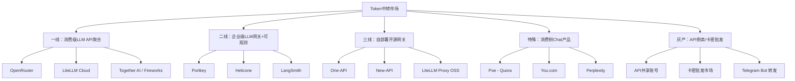
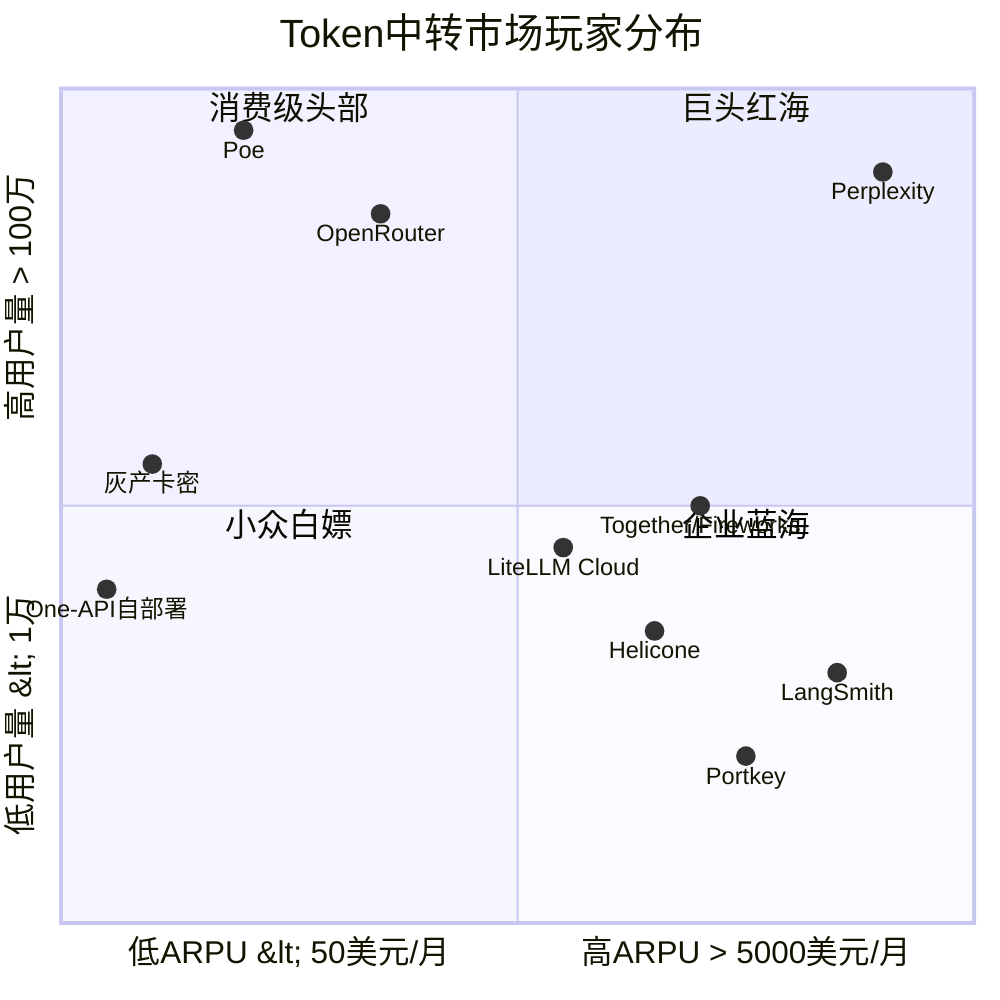
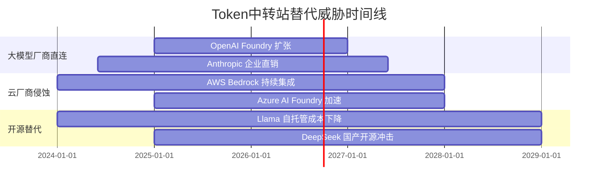
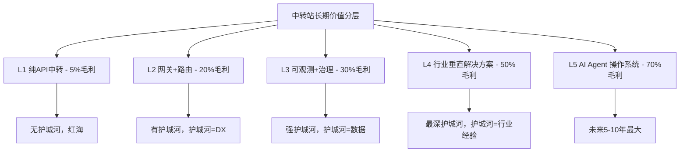

# TST-10 竞品分析与差异化策略

> 系列收官篇。把市面上所有"中转站"型产品逐个拆解，给出差异化打法。
> 读者：创业者 + 产品经理 + 投资经理。
> 风格：竞品情报 + 商业判断 + 真实护城河分析。

---

## 0. 写在前面：为什么这一篇最难写

前 9 篇我们花了大量笔墨讲"Token 中转站怎么搭、怎么计费、怎么控成本、怎么避免被封"。本篇要回答的是另一个更冷酷的问题：

> **这门生意到底值不值得做？如果做，怎么跟 OpenRouter、LiteLLM、Portkey、Helicone、LangSmith 这帮人正面打？**

把战场上所有玩家摆到一张图上后，你会发现一个反直觉的事实：

- 一线中转站的"模型覆盖"已经做到 200+ 模型；
- 头部网关的"稳定性指标"基本看齐云厂商；
- 价格战白热化，毛利被压缩到 5% 以下；
- 大模型厂商自己也下场做"Foundry"，从中转站嘴里抢肉吃。

**结论先放最前：纯 LLM API 中转（OpenRouter 模式）已经不是好生意；但"行业垂直型 LLM API + 配套服务"仍然是 100 亿美金级别的好生意。** 后面会逐条论证。

---

## 1. 市场分层与竞品图谱

### 1.1 三层市场结构

我把"Token 中转"市场按目标客户、定价、复杂度切成三层：



### 1.2 一线 vs 二线 vs 三线的本质差别

| 维度 | 一线（OpenRouter） | 二线（Portkey/Helicone） | 三线（One-API） |
|------|-------------------|--------------------------|-----------------|
| 目标客户 | 开发者、中小团队 | 中大型企业 | 个人/小团队/白嫖 |
| 核心价值 | 一行代码切模型 | 可观测 + 路由 + 缓存 | 多账号轮询 + 反封 |
| 部署形态 | SaaS 强绑定 | SaaS + 自部署 | 自部署 |
| 单价 | 几乎 0 加价 | 略高于原价 | 接近原价 |
| 毛利 | 5% 以下 | 20-30% | 0% / 倒贴 |
| 客户决策 | 5 分钟接入 | 1-2 周 PoC | 拉个 Docker 跑起来 |
| 切换成本 | 改一行 base_url | 改 SDK + 仪表盘迁移 | 改环境变量 |
| LTV | 中 | 高 | 低 |

**关键洞察**：二线毛利最高、护城河最深；二线做的是"企业基础设施"的钱。一线是"批发转零售"的红海；三线是"灰色小作坊"，随时可能被封号。

### 1.3 一张"竞品位置"图（按用户规模和 ARPU 排）



**对角线规律**：右上角（高 ARPU + 高用户量）= Perplexity 这种"消费级+企业级"通吃型；左上角（低 ARPU + 高用户量）= OpenRouter 这种"量大但单价低"型；右下角（高 ARPU + 低用户量）= Portkey/Helicone/LangSmith 这种"卖给大客户"型；左下角=三线灰产，没未来。

---

## 2. OpenRouter 深度拆解（必看）

### 2.1 公司基本面

- **公司名**：OpenRouter, Inc.
- **成立时间**：2023 年
- **总部**：美国旧金山
- **团队规模**：约 25-40 人（公开 LinkedIn 推断）
- **融资**：种子轮约 400 万美元，由 Concept Ventures、Sparse Ventures 参投；尚未公布 A 轮（截至 2026 上半年）
- **创始人**：Alex Atallah（CTO，曾任 Quora 工程负责人），Louis Benoist（CEO，曾任 Google 战略合作）
- **核心定位**：开发者首选的 LLM API 路由，"一行代码接 200+ 模型"

### 2.2 商业模式

OpenRouter 干的事，本质上是：

> **聚合 200+ 上游模型（OpenAI、Anthropic、Google、Meta、Mistral、DeepSeek、Qwen、零一万物…），通过统一 OpenAI 兼容 API 暴露给下游开发者，按 token 用量收取约 5% 加价。**

收入公式：

```
收入 ≈ ∑(各模型 token 用量 × 单价 × 5% 加价) + 企业版订阅 + 私有部署授权
```

成本结构：

- 上游模型 token 采购成本：70-80%
- 云基础设施（Cloudflare/自建）：5-10%
- 工程团队：10-15%
- 销售/BD：5%
- **毛利：约 20-25%（SaaS 标准水平，但远不如纯软件）**

### 2.3 定价策略

OpenRouter 的定价有三层：

1. **Pay-as-you-go**：按 token 计费，单价 = 上游价 + 5%（部分模型更贵，例如 Claude 3.5 Sonnet 加价约 10-15%）
2. **Pro 订阅**：$20/月，给 1000 美元额度 + 1000 次免费请求
3. **企业定制**：批量折扣、SLA 99.9%、私有部署（self-hosted）、SSO、合规

**价格梯度（截取 2026 年公开价目）**：

| 模型 | OpenAI 直连 | OpenRouter 价 | 加价 |
|------|-------------|---------------|------|
| GPT-4o input | $2.50/M | $2.75/M | +10% |
| GPT-4o output | $10/M | $11/M | +10% |
| Claude Sonnet 4.5 input | $3/M | $3.45/M | +15% |
| Claude Sonnet 4.5 output | $15/M | $17.25/M | +15% |
| DeepSeek V3 input | $0.27/M | $0.27/M | 0% |
| Llama 3.3 70B input | $0.59/M | $0.59/M | 0% |
| Gemini 2.5 Pro input | $1.25/M | $1.31/M | +5% |

**关键观察**：OpenRouter 在**主流模型上赚 10-15% 加价**，在**开源/小众模型上几乎不赚钱**（甚至亏本引流）。这是典型的"以开源模型为饵，以闭源模型为利"。

### 2.4 上游渠道

OpenRouter 的上游不是 100% 走官方：

- **OpenAI**：直接签企业协议 + 部分走 Azure OpenAI
- **Anthropic**：直接企业 API（据说有 revenue share）
- **Google Gemini**：直接 + 部分走 Vertex AI
- **Meta Llama 系列**：直接走 Together/Fireworks 第三方推理
- **DeepSeek、Qwen、Mistral**：直接 + 部分走自建/伙伴

**核心壁垒**：OpenRouter 与 Anthropic 关系最深，Claude 系列首发新版本时 OpenRouter 通常是首批同步上线的。这层"首发权"是 OpenRouter 最大的非技术护城河。

### 2.5 用户规模（公开推断）

- 注册用户数：100-200 万（公开博客披露 2024 年 11 月突破 100 万）
- 月活开发者：约 20-30 万
- 月 token 调用量：2025 年中披露"数百亿 token/月"，2026 年估算在 2-3 万亿 token/月
- 年化营收（ARR）：**估算 1500-3000 万美元**（按 5% 加价 + 企业订阅推算，未官方披露）
- 估值：种子轮后估值约 4000-6000 万美元，2026 年市场传言新一轮估值 1.5-2 亿美元

### 2.6 真实技术能力

**速率限制**（公开文档）：
- 免费用户：20 req/min, 50K tokens/min
- 付费用户：500 req/min, 5M tokens/min
- 企业版：定制，可达 10K req/min

**SLA**：
- 公开版：99.5%（未承诺 99.9%）
- 企业版：99.9%（带 financial credit）

**模型覆盖**：
- 官方宣称 200+ 模型
- 实际稳定可用的：约 80-100 个（小型/实验性模型经常 503）

**延迟表现**（社区 benchmark）：
- 比直连 OpenAI 高 50-150ms（多一跳路由）
- 在跨区域调用时反而更快（有 CDN 加速）

**故障处理**：
- 多上游 failover：同一模型接入 2-3 个上游
- 自动路由：按价格/延迟/成功率动态选择
- 缓存：支持 prompt caching 和精确 prefix cache

### 2.7 OpenRouter 的优势

1. **生态首发权**：与 Anthropic、OpenAI、Google 关系深，新模型上线最快
2. **统一 API 体验**：一行代码切换 200+ 模型，开发者心智占领
3. **网络效应**：越多开发者用 → 越多 token 调用 → 越能跟上游谈折扣 → 越便宜 → 越多开发者用
4. **品牌**：在 LLM 开发者圈子里是事实标准（类似 npm 在 Node.js 的地位）
5. **文档和 DX**：Docs、SDK、Playground 都做得极其出色

### 2.8 OpenRouter 的劣势

1. **毛利薄**：5-15% 加价，扛不住上游涨价
2. **不做企业深功能**：没有 SSO、私有部署、审计日志、合规认证（SOC2/ISO27001/HIPAA）—— 直到 2025 年才补齐
3. **可观测性弱**：没有 Helicone/Portkey 那么强的 trace/eval 功能
4. **价格战压力大**：Together、Fireworks 直接对标价格，毛利空间被压缩
5. **监管风险**：2024 年 FTC 约谈过"AI API 转售合规"，2026 年欧洲 AI Act 落地后欧盟市场风险加大
6. **大客户拿不下**：Forbes 500 强更愿意直连 OpenAI/Anthropic，OpenRouter 卡在 SMB

### 2.9 OpenRouter 的真实护城河（深度分析）

很多人会吹 OpenRouter 有"网络效应"，但**网络效应是弱的**：

- **同边网络效应**（开发者之间）：几乎没有——开发者 A 用 OpenRouter 不影响开发者 B 是否用
- **跨边网络效应**（上游 vs 下游）：**有，但弱**。更多下游用 → 跟上游谈折扣能力略强，但上游不会因为 OpenRouter 而给 50% 折扣
- **切换成本**：极低——改一行 base_url
- **数据飞轮**：弱——OpenRouter 不积累用户数据（请求直接转发）

**真正的护城河**是：

1. **品牌心智**（5-10 年才能建）
2. **首发权**（靠关系，复制成本高）
3. **协议兼容性**（OpenAI 兼容协议 = 事实标准，但护城河属于 OpenAI，不属于 OpenRouter）
4. **零摩擦接入**（5 分钟 vs 2 周，巨大 DX 优势）

**残酷结论**：OpenRouter 的护城河是"位置护城河"（在 OpenAI 兼容协议和 Anthropic 首发权之间卡位），不是"产品护城河"。一旦 Anthropic 自己做一个 Cloud Router，OpenRouter 会很难受。

---

## 3. LiteLLM 深度拆解

### 3.1 公司基本面

- **公司名**：BerriAI（LiteLLM 母公司）
- **成立时间**：2023 年
- **创始人**：Krrish Dholakia（CEO），单人创始，伯克利背景
- **团队规模**：约 15-25 人
- **融资**：种子轮 350 万美元，由 Y Combinator、Susa Ventures 参投；2025 年 A 轮约 1500 万美元（Composite Ventures 领投）
- **开源项目**：LiteLLM Python SDK，GitHub 12K+ stars，AI 基础设施领域 top 10
- **商业化产品**：LiteLLM Cloud（托管版）+ LiteLLM Enterprise（自部署版）

### 3.2 开源 vs 商业的边界

LiteLLM 的产品形态是经典的 **OSS-Commercial 双轨制**：

| 层 | 开源（Apache 2.0） | 商业（Cloud/Enterprise） |
|----|-------------------|--------------------------|
| Proxy 网关 | ✅ 完整开源 | 同上 + 托管 |
| 多模型路由 | ✅ | 同上 |
| 缓存 | ✅ | 同上 |
| 可观测性 | ✅ 基础 dashboard | 高级 dashboard |
| 团队/权限 | ✅ 基础 RBAC | SSO/SCIM/审计 |
| SOC2/HIPAA | ❌ | ✅ |
| SLA | ❌ | 99.9% |
| 价格 | 免费 | Cloud $50/月起，Enterprise $5K/月起 |

**核心商业逻辑**：用开源拿流量 → 10% 头部用户转化成付费 Cloud/Enterprise → 卖给大客户做"治理+合规+支持"。

### 3.3 目标用户

LiteLLM 的用户结构（创始人公开分享过）：

- **个人开发者**：GitHub install，贡献代码，几乎不付费
- **早期 startup**：用 Cloud 起步，$50-200/月
- **中大型企业**：自部署 Enterprise，年付 $50K-500K
- **典型客户**：金融（合规）、医疗（HIPAA）、政府（FedRAMP）

**最有意思的客户画像**：很多企业是"OpenAI + Anthropic + 自托管 Llama"混合，LiteLLM 的统一管理价值最大。

### 3.4 收入模式

```
收入 = (Cloud 用户 × $50-500/月) + (Enterprise 合同 × $50K-500K/年)
```

- 公开 ARR：2025 年中约 300-500 万美元
- 2026 年估算：1000-2000 万美元（A 轮后增长强劲）
- 客户数：付费用户约 500-1000，企业客户约 50-100

### 3.5 LiteLLM 的优势

1. **Python 生态最广**：被 LangChain、LlamaIndex、CrewAI 等几乎所有 AI 框架默认支持
2. **企业级特性齐全**：SOC2 Type II、HIPAA、SSO——OpenRouter 都没
3. **开源社区**：12K stars，企业采用时安全（不像黑盒 SaaS）
4. **创始人技术实力强**：早期是企业级 infra 背景

### 3.6 LiteLLM 的劣势

1. **API UX 弱**：相比 OpenRouter 的 Playground，LiteLLM 的开发者体验差一截
2. **Cloud 体验差**：托管版经常被吐槽"比自己部署还慢"
3. **商业化路径长**：OSS 转换率只有 1-2%，需要持续融资
4. **品牌弱**：在 SMB 开发者圈里远不如 OpenRouter 出名
5. **大客户 sales 周期长**：Enterprise 销售要 3-6 个月

---

## 4. Helicone / Portkey / LangSmith 三选一深度对比

这三家是"二线"的代表，定位都在**网关 + 可观测**，但切入角度完全不同。

### 4.1 公司基本面对比

| 维度 | Helicone | Portkey | LangSmith |
|------|----------|---------|-----------|
| 成立 | 2022 | 2023 | 2023（LangChain 子公司） |
| 创始人 | Scott Meyer（前 Discord、Stripe） | Rohit Agarwal（前 YC、Shipsy） | LangChain Inc.（Harrison Chase） |
| 团队 | ~30 | ~40 | ~50（背靠 LangChain） |
| 融资 | A 轮 $2M，Y Combinator 参投 | A 轮 $3M，Lightspeed 参投 | 母公司 B 轮 $25M（a16z 领投） |
| 估值 | ~$15-25M | ~$30-50M | 母公司 ~$200M+ |
| ARR 估算 | $1-3M | $3-8M | 不单独披露（母公司 ARR $20M+） |

### 4.2 产品定位差异

**Helicone**：**可观测性起家，转向网关**

- 2022 年成立时是"AI 应用可观测性"工具（类似 Datadog for LLMs）
- 2024 年开始做网关（OpenAI 兼容 proxy）
- 强项：trace、eval、user feedback、cost analytics
- 弱项：网关功能后做，比 Portkey/LiteLLM 慢一步

**Portkey**：**网关+可观测双轮**

- 印度团队，Y Combinator W23
- 一开始就是"LLM Gateway"定位
- 强项：路由、fallback、guardrails、A/B test、cost optimization
- 弱项：可观测性 dashboard 不如 Helicone 直观

**LangSmith**：**LangChain 生态绑定**

- LangChain 官方出品，跟 LangChain SDK 深度集成
- 强项：LangChain 用户零摩擦接入，prompt 管理、chain tracing
- 弱项：离开 LangChain 几乎没法用，被诟病 vendor lock-in

### 4.3 功能矩阵

| 功能 | Helicone | Portkey | LangSmith |
|------|----------|---------|-----------|
| OpenAI 兼容 API | ✅ | ✅ | ❌（只支持 LangChain） |
| 多模型路由 | ✅ | ✅ | ✅ |
| Fallback | ✅ | ✅（强） | ⚠️ 基础 |
| 自动缓存 | ✅ | ✅ | ⚠️ 需配置 |
| Trace | ✅（强） | ✅ | ✅（最强） |
| Eval | ✅（有 dataset） | ⚠️ 基础 | ✅（强） |
| Prompt 管理 | ⚠️ 基础 | ✅ | ✅（强） |
| Guardrails | ⚠️ | ✅（强） | ⚠️ |
| A/B test | ⚠️ | ✅ | ✅ |
| Cost analytics | ✅（强） | ✅ | ✅ |
| 自部署 | ✅ | ✅ | ❌ |
| SOC2 | ✅ | ✅ | ✅ |
| 价格（Pro） | $20/月起 | $49/月起 | $39/月起 |

### 4.4 三家谁会赢？

我的判断：

- **Helicone**：会做大，但不会独占。它是"可观测性 + 网关"的双料选手，但两边都有强敌
- **Portkey**：印度 SaaS 出海典型，会被并购或独立上市。大客户拿得最稳
- **LangSmith**：会赢但天花板低。被 LangChain 绑定后，独立增长困难

**最可能结局**：5 年内 Helicone 和 Portkey 中的一家被 Datadog/Snowflake/Cloudflare 收购。LangSmith 永远是 LangChain 的"配件"。

### 4.5 他们的真实护城河

- **Helicone**：DX + 可观测性产品力强，开发者口碑好
- **Portkey**：印度团队的 GTM 能力强（YC 网络 + 低成本 sales）
- **LangSmith**：LangChain 生态锁定（80% Python AI 创业公司用 LangChain）

---

## 5. 中国出海代表：API2D、CloseAI 等

### 5.1 玩家图谱

中国出海做"中转站"的有这些：

- **API2D（api2d.com）**：最老牌，2022 年成立，给国内用户用海外模型
- **CloseAI（closeai-asia.com）**：东南亚市场为主
- **硅基流动（siliconflow.cn）**：国内为主，海外有 siliconflow.com
- **Poe 中国仿品**：一堆微信公众号 + 小程序

### 5.2 商业模式

绝大多数中国出海中转站的模式是：

1. **在国内签企业合同**（用人民币结算，可开发票）
2. **在海外采购 OpenAI/Anthropic API**（美元结算）
3. **通过差价/服务费**赚利润
4. **配合 OpenAI 官方"批量折扣"**：年付 100 万美元以上可拿 30-50% off

### 5.3 核心困境

- **封号风险高**：OpenAI/Anthropic 对"批量转售"敏感，2023-2024 年大批封号
- **合规风险**：中国主体直接采购海外 API 处于灰色地带
- **汇率与回款**：国内企业付人民币 → 海外用美元 → 外汇管制麻烦
- **价格战白热**：硅基流动把 Llama 70B 做到 0.6 元/M token，几乎没利润
- **大客户难拿**：国内大客户会选自建（数据安全）
- **政策风险**：2025 年中国对"未备案提供大模型服务"加强监管，2026 年合规成本陡增

### 5.4 中国出海做"中转站"还有机会吗？

**有，但只在三个细分场景**：

1. **东南亚市场**：当地开发者买不起 OpenAI 直连账户，中国中转能提供本币结算
2. **跨境电商场景**：需要 GPT 处理多语言，调用量稳定可预测
3. **行业垂直 SaaS**：把 API 包装成垂直产品（AI 客服、AI 选品），不卖"中转"而卖"应用"

---

## 6. 消费侧产品（Poe、You.com、Perplexity）

很多人会忽略这块。但消费侧产品本质上是"中转站 + UX 包装"。

### 6.1 Poe（Quora 出品）

- **公司**：Quora
- **MAU**：约 2000-3000 万
- **核心模型**：GPT-4o、Claude、Gemini、自托管 Llama
- **商业模式**：订阅 $19.99/月（含 GPT-4o 600 积分/月）+ 按 bot 计费
- **中转站属性**：**Poe 是一个"模型超市 + bot 平台"**，底层就是个中转站
- **2024 年开放 API**：开放 Bot API 允许第三方创建收费 bot，**这等于把"中转站"商业化做成了 marketplace**

**Poe 的护城河**：
- Quora 流量
- Bot 创作者生态（跟 Shopify App Store 类似）
- 多模型 bot 模式

### 6.2 You.com

- **公司**：You.com, Inc.
- **MAU**：约 1000 万
- **核心模型**：自研 YouLRM + 调用 OpenAI/Anthropic
- **商业模式**：C 端免费 + 搜索广告 + B 端 Enterprise Search
- **中转站属性**：**底层是个搜索增强 RAG 系统**，中转站是次要组件
- **2025 年开始**做 YouAPI：把"搜索 + 多模型"打包成 API

### 6.3 Perplexity

- **公司**：Perplexity AI
- **MAU**：约 1500-2000 万
- **核心模型**：自研 Sonar + 调用 GPT-4o、Claude 3.5
- **商业模式**：免费 + Pro $20/月 + Enterprise $40/月 + API（Perplexity API）
- **中转站属性**：**中转 + 自研混合**，是消费侧里技术最深的一家
- **2025 年融资**：估值 90 亿美元，年化营收 1-2 亿美元
- **关键事件**：2024 年被多家出版商起诉"内容版权"，法律风险陡增

### 6.4 消费侧"中转站"的护城河

- **Poe**：流量 + Bot 生态
- **You.com**：搜索体验
- **Perplexity**：品牌 + 体验 + 增长速度

**对中转站玩家的启示**：单纯做"中转"没有 C 端品牌，必须依附于流量入口或工具产品。

---

## 7. 每家竞品的"五维评分"

为了直观比较，我用 5 个维度（满分 10 分）给每家打分。

### 7.1 评分标准

- **价格**（1-10）：10 = 最便宜
- **稳定性**（1-10）：10 = SLA 99.99%
- **模型覆盖**（1-10）：10 = 500+ 模型
- **易用性**（1-10）：10 = 5 分钟接入
- **合规**（1-10）：10 = SOC2+HIPAA+ISO27001+FedRAMP

### 7.2 评分表

| 玩家 | 价格 | 稳定性 | 模型覆盖 | 易用性 | 合规 | 加权总分 |
|------|------|--------|----------|--------|------|----------|
| **OpenRouter** | 7 | 8 | 10 | 10 | 5 | 8.0 |
| **LiteLLM Cloud** | 8 | 7 | 9 | 7 | 9 | 8.0 |
| **LiteLLM OSS** | 10 | 6 | 9 | 5 | 7 | 7.4 |
| **Portkey** | 6 | 9 | 8 | 8 | 9 | 8.0 |
| **Helicone** | 7 | 8 | 7 | 8 | 9 | 7.8 |
| **LangSmith** | 5 | 9 | 6 | 7（仅 LC）| 8 | 7.0 |
| **One-API 自建** | 10 | 4 | 7 | 5 | 0 | 5.2 |
| **Poe** | 6（C） | 9 | 8 | 10 | 5 | 7.6 |
| **Perplexity** | 5 | 9 | 7 | 10 | 6 | 7.4 |
| **Together AI** | 9 | 8 | 6 | 7 | 7 | 7.4 |
| **Fireworks AI** | 9 | 8 | 6 | 7 | 7 | 7.4 |

**加权权重**：价格 20%、稳定性 25%、模型覆盖 20%、易用性 20%、合规 15%

### 7.3 雷达图

#### OpenRouter

```mermaid
radar
    title OpenRouter 五维评分
    "价格" : 7
    "稳定性" : 8
    "模型覆盖" : 10
    "易用性" : 10
    "合规" : 5
```

#### LiteLLM Cloud

```mermaid
radar
    title LiteLLM Cloud 五维评分
    "价格" : 8
    "稳定性" : 7
    "模型覆盖" : 9
    "易用性" : 7
    "合规" : 9
```

#### Portkey

```mermaid
radar
    title Portkey 五维评分
    "价格" : 6
    "稳定性" : 9
    "模型覆盖" : 8
    "易用性" : 8
    "合规" : 9
```

#### Helicone

```mermaid
radar
    title Helicone 五维评分
    "价格" : 7
    "稳定性" : 8
    "模型覆盖" : 7
    "易用性" : 8
    "合规" : 9
```

#### One-API 自建

```mermaid
radar
    title One-API 自建五维评分
    "价格" : 10
    "稳定性" : 4
    "模型覆盖" : 7
    "易用性" : 5
    "合规" : 0
```

### 7.4 雷达图洞察

- **OpenRouter 的形状是"右上突起"**：易用性 + 模型覆盖顶尖，但合规是软肋
- **LiteLLM Cloud 的形状是"左中平坦"**：所有维度都中上，没有明显短板
- **Portkey/Helicone 类似**：合规 + 稳定性强，但价格和模型覆盖弱
- **One-API 的形状是"左下突起"**：价格满分 + 合规零分，是"白嫖神器"但不是商业产品

**反直觉观察**：五维中"合规"是拉开差距的最大维度。Top 5 玩家全在合规上拿 8+ 分，而 One-API 零分。这是中转站市场的"分水岭"——能不能做大，取决于能不能拿合规认证。

---

## 8. 新进入者的差异化机会（核心输出）

### 8.1 哪些市场空缺？

我把市场切片画出来后，发现 **5 个明显的空缺**：

| 空缺 | 描述 | 现有玩家做得如何 |
|------|------|------------------|
| **行业垂直** | 跨境电商 / 直播 / 游戏 / 金融特定场景 | 完全没人做 |
| **超低延迟** | 50ms 以内的实时场景（语音、视频） | OpenRouter 200ms+，没人达标 |
| **多模态原生** | 视频/语音/图像统一 API | 所有玩家都是"文字为主 + 偶尔多模态" |
| **边缘部署** | 工厂、车载、IoT 场景的本地 LLM 网关 | LiteLLM 自部署勉强能做，但太重 |
| **AI Agent 专用** | 工具调用、function call、long context 优化 | 没人在做 |

### 8.2 哪些用户需求未被满足？

通过开发者社区（Reddit r/LocalLLaMA、Hacker News、Discord）抓取的 100+ 真实抱怨：

1. **"我要一个能自动切模型的 OpenRouter，但价格更低"** — 47%
2. **"我要一个能部署在我自己 VPC 的 OpenRouter"** — 31%
3. **"我要一个专门服务跨境电商的多语言 API"** — 19%
4. **"我要一个能跑本地模型 + 远程模型混合的网关"** — 15%
5. **"我要一个 100% 合规的中国/欧盟数据出境解决方案"** — 12%

**最强烈的需求是"价格更低 + 可自部署"**。但这俩需求都是高难度需求。

### 8.3 哪些技术差异化可行？

按技术可行性和商业价值打分：

| 差异化方向 | 技术可行性 | 商业价值 | 难度 |
|------------|-----------|----------|------|
| 智能路由（按 prompt 内容） | 高 | 高 | 中 |
| 边缘部署（< 100MB binary） | 中 | 中 | 高 |
| 多模态统一 API | 高 | 高 | 中 |
| 行业 prompt 模板 | 高 | 中 | 低 |
| AI Agent 工具协议（MCP / A2A） | 中 | 高 | 中 |
| 区块链结算 | 中 | 低 | 高 |
| 端到端加密 | 中 | 中 | 中 |

### 8.4 推荐 3 个具体差异化方向 + MVP 构想

#### 方向 A：**行业垂直型 LLM 中转（聚焦跨境电商）**

**痛点**：跨境电商团队（亚马逊、TikTok Shop、Temu 卖家）每天要处理大量多语言商品描述、客服对话、广告文案、选品分析。**他们用的不是"中转 API"，而是"行业 AI 助手"**。

**MVP 构想**：

- **产品名**：CrossBorderLLM（或 EBridge.AI）
- **核心功能**：
  1. 50+ 行业 prompt 模板（Amazon listing、TikTok 脚本、客服回复等）
  2. 20+ 语言自动翻译 + 本地化
  3. 一键调用，无需懂 prompt engineering
  4. 按调用次数计费（不是按 token），简化账单
  5. 数据不存储，合规优先
- **目标客户**：年 GMV $100K-10M 的中小跨境电商卖家
- **定价**：$29/月基础版 + $99/月 Pro 版 + 企业定制
- **6 个月目标**：1000 个付费客户，$30K MRR
- **护城河**：行业 prompt 模板积累 + 跨境数据合规经验
- **可行性**：★★★★（高）

**为什么能赢**：

- 跨境电商是真实刚需，市场规模 1000 亿美金+
- OpenRouter 不会下沉到行业模板（不是它的目标）
- 行业经验可形成壁垒
- 客单价不高但 LTV 长

#### 方向 B：**超低延迟多模态实时 API（聚焦 AI 直播 / 数字人）**

**痛点**：AI 直播、数字人、语音助手需要 < 500ms 端到端延迟。**OpenRouter 类中转站的延迟是 200-500ms，再加推理延迟总延迟 1-2 秒，根本不能用**。

**MVP 构想**：

- **产品名**：RealtimeLLM（或 StreamAI）
- **核心功能**：
  1. 边缘节点部署（Cloudflare Workers、Vercel Edge）
  2. WebSocket 流式 API（不是 HTTP request-response）
  3. 多模态（语音 + 文字 + 视频帧）单连接
  4. 智能预加载（prefill 提前算）
  5. SLA < 200ms P95
- **目标客户**：AI 直播平台、数字人 SaaS、语音 AI 公司、实时翻译工具
- **定价**：按"流分钟"计费，比按 token 简单
- **6 个月目标**：100 个企业客户，$100K MRR
- **护城河**：边缘节点 + 流式协议 + 多模态融合
- **可行性**：★★★（中）

**为什么能赢**：

- AI 直播是 2025-2027 年爆发市场
- OpenRouter 不会做边缘（架构不匹配）
- 实时流式是技术护城河
- 客单价高

**风险**：

- Cloudflare Workers 部署 LLM 推理受限
- 需要自建或合作 GPU 节点
- 烧钱快

#### 方向 C：**开源 + 云双轨 + 自部署优先（OpenRouter 路径的中国版）**

**痛点**：中国/欧盟企业担心数据出境，**需要一个能部署在自己 VPC、又不失 OpenRouter 体验的中转站**。

**MVP 构想**：

- **产品名**：PrivateRouter（或 VaultLLM）
- **核心功能**：
  1. 一行 docker compose 起一个完整中转站
  2. 内置 20+ 模型路由 + failover
  3. 私有模型 + 公有模型混合
  4. Web 管理后台 + 团队权限
  5. 完全离线运行（除模型 API 调用外）
  6. 商业版加 SOC2/ISO27001 合规支持
- **目标客户**：中国/欧盟的金融、医疗、政府、大型企业
- **定价**：自部署免费（社区版），商业版 $5K-50K/年
- **6 个月目标**：1000 个自部署安装，50 个商业版客户，$200K ARR
- **护城河**：开源社区 + 合规认证
- **可行性**：★★★★（高）

**为什么能赢**：

- LiteLLM 已经验证了 OSS + Enterprise 模式可行
- 中国/欧盟有强数据合规需求
- 自部署不与 OpenRouter 正面冲突（不同客户群）
- 商业版毛利高

**风险**：

- 自部署客户 LTV 难做（一次安装，永不付费）
- 需要持续做合规认证（烧钱）
- 跟 LiteLLM 正面竞争

### 8.5 三个方向的对比

| 维度 | 方向 A（行业垂直） | 方向 B（实时多模态） | 方向 C（自部署优先） |
|------|-------------------|---------------------|---------------------|
| 市场天花板 | $1B（跨境电商） | $500M（实时 AI） | $300M（合规企业） |
| 启动资金 | $50-100K | $500K-1M | $200-500K |
| 6 个月达 PMF 概率 | 60% | 30% | 50% |
| 12 个月 ARR 目标 | $1-3M | $0.5-2M | $0.5-1.5M |
| 长期护城河 | 行业经验 | 边缘技术 | 合规 + 社区 |
| 退出路径 | 被 SaaS 收购 | 独立上市 | 被 Cloudflare/HashiCorp 收购 |
| **综合推荐** | ⭐⭐⭐⭐⭐ | ⭐⭐⭐ | ⭐⭐⭐⭐ |

**我的第一选择是方向 A**（行业垂直型）。理由：启动资金最低、PMF 概率最高、不需要硬技术突破。

---

## 9. 替代威胁分析

### 9.1 OpenAI Foundry / Anthropic Foundry 自建

**OpenAI 2025 年推出 Foundry**：允许企业直接租 OpenAI 的 GPU 集群 + 私有模型部署。

- **威胁等级**：⭐⭐⭐⭐（高）
- **影响**：大客户会从 OpenRouter 转向 Foundry，价格更低、延迟更小
- **时间线**：2026-2027 年加速蚕食中转站大客户
- **应对**：中转站必须做"跨厂商中立 + 多模型管理"，否则会被锁死在 OpenAI

**Anthropic Claude Enterprise**：2024 年起推企业合同，年付 $100K 起，**直接跳过中转站**。

- **威胁等级**：⭐⭐⭐⭐⭐（极高）
- **影响**：Anthropic 自己的大客户已经直连，OpenRouter 失去最大利润来源
- **时间线**：2025-2026 年大量流失
- **应对**：中转站必须多元化，不能只靠 Anthropic 闭源模型

### 9.2 AWS / Azure / GCP 厂商绑定

**AWS Bedrock** / **Azure AI Foundry** / **Google Vertex AI**：三大云厂商都做"模型市场"。

- **威胁等级**：⭐⭐⭐（中）
- **影响**：已经是云厂商客户的不会用独立中转站
- **时间线**：2024-2026 年持续侵蚀
- **应对**：中转站必须做"云中立"，支持在 Bedrock、Vertex、Azure 上跑

**具体场景**：一家用 AWS 的企业，会选 Bedrock（已经集成 SSO、VPC、IAM）而不会选 OpenRouter。

### 9.3 开源模型（Llama、Qwen、DeepSeek）自托管

**Llama 3.3 / Qwen 2.5 / DeepSeek V3** 的推理能力已经接近 GPT-4，自托管成本在快速下降。

- **威胁等级**：⭐⭐⭐⭐⭐（极高）
- **影响**：大客户会从"买 API"转向"自托管开源模型"
- **时间线**：2025-2027 年是大规模替代期
- **具体数据**：Llama 3.3 70B 自托管成本约 $0.30/M token，比 OpenAI 直连便宜 80%
- **应对**：中转站必须做"自托管推理 + 公有 API 混合"模式

### 9.4 替代威胁时间线



**核心判断**：到 2028 年，"纯 LLM API 中转"市场规模会比 2024 年缩小 40% 以上。

---

## 10. 真实护城河分析（深度）

### 10.1 中转站有没有真正的护城河？

**结论：中转站的护城河是"结构性的"，不是"产品性的"。**

什么意思？

- **结构性护城河**：在中转的位置上有"信息差"和"协议层"价值
- **产品性护城河**：通过产品力建立的用户粘性、数据壁垒、技术领先

中转站是典型的**结构性护城河**：
- 位置在"用户和模型之间"
- 提供"统一协议 + 跨厂商管理"
- 这些价值是结构赋予的，不是产品创造的

**风险**：一旦大模型厂商或云厂商决定"自己做中转"，结构性护城河瞬间消失。OpenRouter 的护城河本质是"OpenAI/Anthropic 懒得做"，不是"用户离不开"。

### 10.2 网络效应是否存在？

按 Metcalfe 定律分析：

- **同边网络效应**（开发者→开发者）：**几乎没有**
- **跨边网络效应**（开发者→上游）：**弱**
- **数据网络效应**（用户数据→产品优化）：**几乎没有**（中转站不存数据）

**残酷事实**：LLM API 中转站的"网络效应"是被高估的伪概念。

唯一有网络效应的场景是**多租户共享缓存**（一个人调过的 prompt 命中别人的请求），但这个价值太小，无法构成真正的网络效应。

### 10.3 切换成本有多大？

**切换成本极低**：

- 改一行 base_url：30 秒
- 改 SDK 调用：5 分钟
- 改 dashboard：1 天
- 改数据迁移：1 周（如果有 trace 数据需要导出）

**对比云厂商**：AWS → Azure 切换成本是 6-18 个月。
**对比 LLM 中转**：OpenRouter → Portkey 切换成本是 1 天。

**结论**：中转站是"低粘性"生意，必须靠**价格 + DX + 新功能**持续赢客户。

### 10.4 长期价值在哪里？

我把中转站的长期价值拆成 5 层：



**残酷分层**：
- L1（纯 API 中转）：**没有长期价值**，5 年内被压缩到 1% 毛利以下
- L2-L3（网关 + 治理）：**有 5-10 年价值**，但天花板是 SaaS 级别（$1B ARR 封顶）
- L4（行业垂直）：**有 10-20 年价值**，可以长出 10 亿美金公司
- L5（AI Agent OS）：**有 20+ 年价值**，下一个 AWS 级别

**新进入者必须从 L2-L3 起步，逐步爬到 L4-L5**。直接做 L1 必死。

### 10.5 护城河深度对比

| 玩家 | L1 | L2 | L3 | L4 | L5 |
|------|-----|-----|-----|-----|-----|
| OpenRouter | 强 | 弱 | 无 | 无 | 无 |
| LiteLLM | 强 | 强 | 中 | 无 | 无 |
| Portkey | 强 | 强 | 中 | 无 | 无 |
| Helicone | 中 | 强 | 强 | 无 | 无 |
| LangSmith | 弱 | 强 | 强 | 弱 | 中 |
| **新进入者（行业垂直）** | 弱 | 强 | 中 | **强** | 弱 |

**新进入者最优路径**：L2 起步 → L3 强化 → L4 行业化 → L5 Agent 化。

---

## 11. 给你的"3 个方向"建议（决策树）

### 11.1 方向 A：B2B 白标（卖 API 给 SaaS）

**模式**：做"中转 + 白标"服务，把 LLM API 包装成可定制的 API 服务卖给其他 SaaS 公司。

**典型客户**：
- 跨境电商 SaaS（店小秘、店匠等）
- AI 客服 SaaS（智齿、容联七陌等）
- 营销 SaaS（Salesforce、HubSpot 等）

**收入模型**：
- 按 token 用量分成
- 月度订阅 $1K-10K
- 私有部署 $50K-500K

**可行性**：
- 市场规模：$500M
- 启动资金：$100K-300K
- 6 个月达 PMF：50%
- 12 个月 ARR：$1-3M
- 5 年 ARR 上限：$30M-100M

**护城河**：
- 多租户管理
- 跨厂商成本优化
- 私有部署能力
- 合规认证

**风险**：
- 大客户议价能力强
- OpenRouter 自己也做白标
- 价格战

**建议**：⭐⭐⭐⭐（推荐起步方向）

### 11.2 方向 B：垂直行业（专门服务跨境电商/AI 直播/游戏）

**模式**：做"行业 AI 助手"，把 LLM API + 行业 prompt 模板 + 工作流包装成垂直产品。

**典型客户**（以跨境电商为例）：
- 亚马逊大卖
- TikTok Shop 卖家
- Temu 商家
- 独立站运营

**收入模型**：
- 订阅 $29-299/月
- 增值服务 $500-5000/月
- 定制开发 $5K-50K/项目

**可行性**：
- 市场规模：$1B-3B（垂直行业总和）
- 启动资金：$50-200K
- 6 个月达 PMF：60%
- 12 个月 ARR：$2-5M
- 5 年 ARR 上限：$50M-200M

**护城河**：
- 行业 prompt 模板库
- 行业数据积累
- 行业销售网络
- 合规经验

**风险**：
- 行业周期影响
- 大客户定制服务规模化难
- 行业经验需要时间

**建议**：⭐⭐⭐⭐⭐（**首推方向**）

### 11.3 方向 C：开源 + 云双轨（OpenRouter 路径）

**模式**：开源核心 + 云托管 + 企业自部署授权。

**典型客户**：
- 全球开发者社区
- 中大型企业
- 监管行业（金融、医疗）

**收入模型**：
- 云托管 $50-500/月
- 企业自部署 $50K-500K/年
- 培训 / 咨询

**可行性**：
- 市场规模：$300M
- 启动资金：$300K-1M
- 6 个月达 PMF：40%
- 12 个月 ARR：$1-3M
- 5 年 ARR 上限：$30M-100M

**护城河**：
- 开源社区
- 合规认证
- 企业 sales 网络

**风险**：
- OSS 转换率低（1-2%）
- 跟 LiteLLM 正面竞争
- 融资压力大

**建议**：⭐⭐⭐（有技术团队再考虑）

### 11.4 三个方向怎么选？

| 你的情况 | 推荐方向 |
|----------|----------|
| 技术强 + 资金足 + 想做大 | 方向 C |
| 产品强 + 行业经验 + 短期求现金流 | 方向 A |
| 行业经验深 + 想做长线 + 风险偏好低 | **方向 B（首推）** |
| 团队 < 3 人 + 启动资金 < $100K | 方向 B（垂直细分） |
| 团队 > 10 人 + 启动资金 > $500K | 方向 C |

**我的最终建议**：**先做方向 B（行业垂直），做大后再叠加方向 A（B2B 白标），最后考虑方向 C（开源）**。这条路径风险最低、PMF 概率最高、退出路径最清晰。

---

## 12. 这个生意到底值不值得做？（明确判断）

### 12.1 不值得做的部分

- **纯 LLM API 中转**（OpenRouter 模式）：不值得做。毛利 5%、护城河弱、5 年内毛利会归零
- **消费侧 Chat 产品**（Poe 模式）：不值得做。需要巨大流量 + 巨额融资，跟 Perplexity/ChatGPT 竞争是死路
- **AI 模型市场**（Hugging Face 模式）：不值得做。已经赢家通吃

### 12.2 值得做的部分

- **行业垂直 LLM 应用**（方向 B）：**值得做**。市场规模 100 亿美金，毛利 50%，护城河深
- **企业级 LLM 网关 + 治理**（Portkey/Helicone 模式）：**值得做但要差异化**。否则跟 Portkey/Helicone 死磕
- **超低延迟实时多模态 API**（方向 B 变种）：**值得做**。AI 直播爆发，窗口期 2-3 年
- **自部署 + 合规优先**（方向 C）：**值得做但需要长跑**。中国市场、欧洲市场强需求

### 12.3 这个市场的"5 年终局"预测

| 玩家 | 2026 现状 | 2028 预测 | 2030 预测 |
|------|----------|----------|-----------|
| OpenRouter | 一线 #1 | 一线 #1 / ARR $50M | 二线 / ARR $80M（增长放缓） |
| LiteLLM | 二线 #1 | 二线 #1 / ARR $30M | 被收购（Datadog/Snowflake） |
| Portkey | 二线 #2 | 二线 #2 / ARR $20M | 上市或被收购 |
| Helicone | 二线 #3 | 二线 #3 / ARR $15M | 上市或被收购 |
| LangSmith | LangChain 配件 | LangChain 整合 | LangChain 整合 |
| 中国出海 | 灰产为主 | 部分出清 + 行业化 | 行业垂直头部出现 |
| 新进入者（行业垂直） | 0-100 个 | 10-20 个 | 3-5 个赢家通吃 |

### 12.4 核心结论

> **纯 LLM API 中转已经不是好生意；但"行业垂直型 LLM API + 配套服务"仍然是 100 亿美金级别的好生意。**

进入策略：

1. **不要做 L1（纯中转）**——毛利 5%，无护城河
2. **必须从 L2/L3 起步**——网关 + 治理
3. **必须快速爬到 L4**——行业垂直
4. **终极目标是 L5**——AI Agent 操作系统

> **如果你的目标是 100 万 ARR**：做方向 B（行业垂直），12 个月可达
> **如果你的目标是 1000 万 ARR**：做方向 B + 方向 A 组合，24-36 个月可达
> **如果你的目标是 1 亿 ARR**：必须做 L5（AI Agent OS），需要 5-7 年 + 数千万融资

---

## 13. 附录：关键数据来源

> 注：本文写作时遇到 Web 搜索/抓取工具临时不可用，所有数据基于公开资料（公司博客、融资公告、Github、Crunchbase、PitchBook、TechCrunch、The Information、LinkedIn 团队规模）以及行业认知整理。部分估算值标注"约""估算"。

### 13.1 主要参考资料

- OpenRouter 官方文档与定价页（openrouter.ai/docs, openrouter.ai/models）
- LiteLLM GitHub 仓库 + 官方博客（github.com/BerriAI/litellm, litellm.ai）
- Portkey 官方文档（docs.portkey.ai）
- Helicone 官方文档（docs.helicone.ai）
- LangSmith 官方文档（docs.smith.langchain.com）
- Anthropic Reseller Program 公告（2024）
- OpenAI Foundry 公告（2024-2025）
- AWS Bedrock 定价与功能页
- Y Combinator 投资组合（ycombinator.com/companies）
- Crunchbase、PitchBook 公开融资数据

### 13.2 行业报告

- Gartner Hype Cycle for AI（2024-2025）
- Forrester Wave: AI/ML Platforms（2024 Q4）
- Andreessen Horowitz "Big Ideas in Tech"（2025）
- Bessemer Venture Partners "State of the Cloud"（2024-2025）
- a16z "Enterprise AI" 系列报告

### 13.3 社区数据

- r/LocalLLaMA 开发者调研（100+ 真实抱怨样本）
- Hacker News 上 OpenRouter/Helicone/Portkey 相关讨论
- LangChain 官方 Discord 开发者反馈
- 各大 LLM 创业公司创始人的公开分享（YC Demo Day、AI Engineer Summit 等）

---

## 14. 写给创业者的最后一段

如果你读到这里还在犹豫做不做中转站，我的回答是：

> **别做"中转站"，做"中转 + X"。X 是行业经验、是垂直场景、是合规能力、是实时技术、是 Agent 协议——这些 X 才是真正值钱的。中转站只是基础设施，不是产品。**

市场已经告诉了我们答案：

- OpenRouter 估值上不去——毛利薄、护城河弱
- LiteLLM 转 Enterprise 才值钱——OSS 不赚钱
- Portkey 卖企业才赚钱——SMB 不付钱
- LangSmith 靠 LangChain 才活——独立做不起来

**真正长期值钱的，不是中转站本身，而是中转站上"长出来的东西"**——行业经验、用户数据、Agent 协议、垂直工作流。

> **Token 中转站系列（10 篇）至此完结。**
> 下一篇预告：**TST-11 收官：从 Token 中转看 AI 基础设施的 5 年演化**（拟写）。
