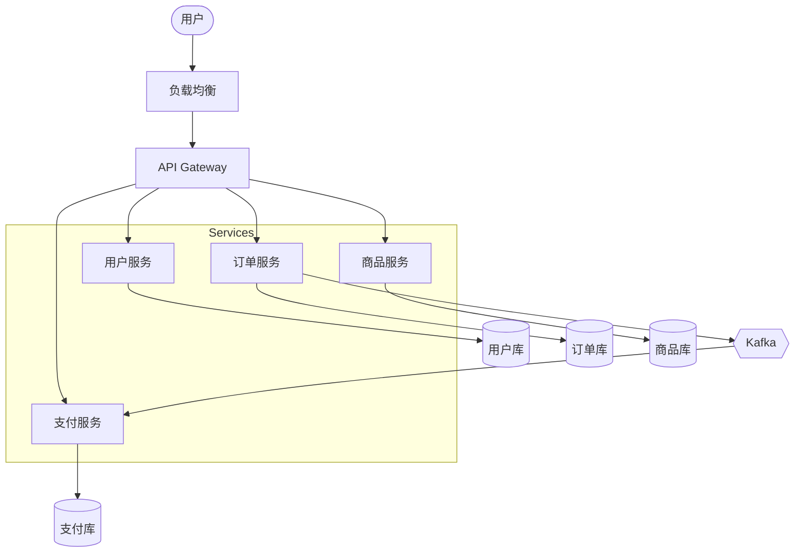
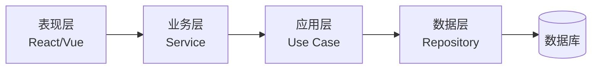
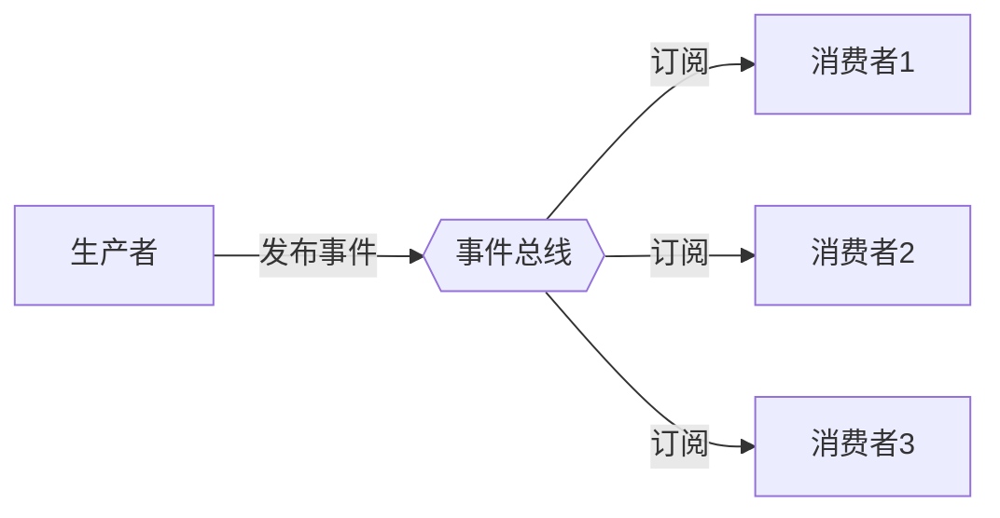
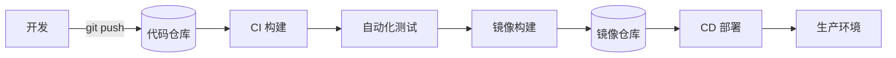
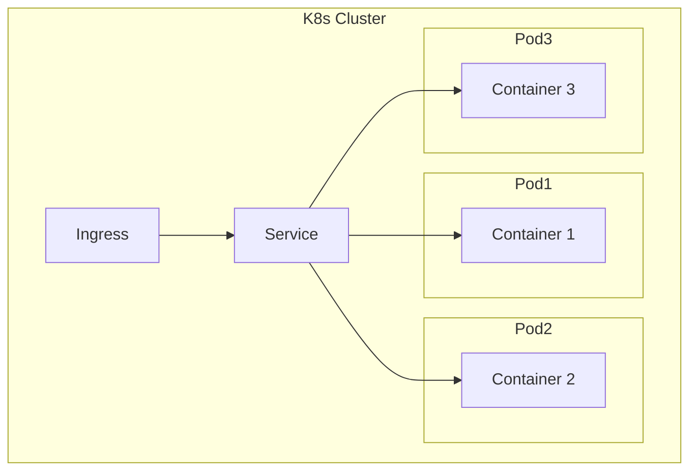
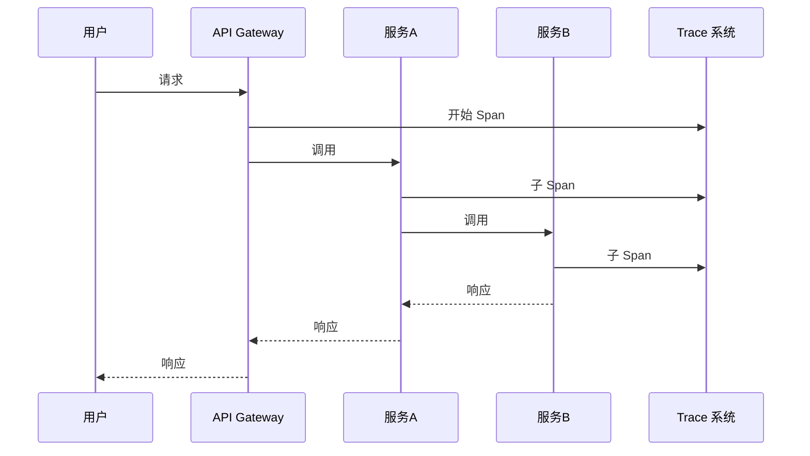
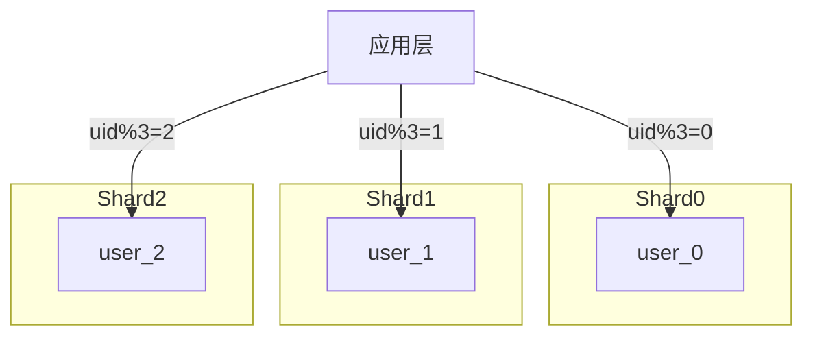
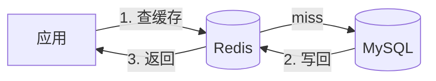
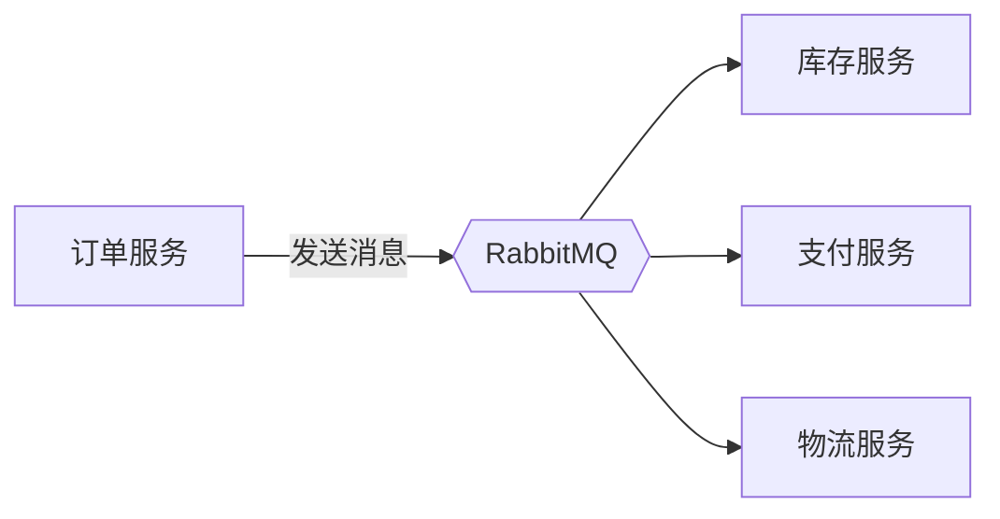
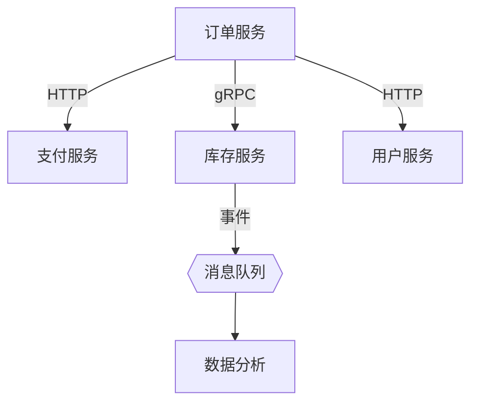

# 架构图模板库

> 复制即用，覆盖 90% 技术架构图

## 1. 微服务架构

## 2. 分层架构 (N-tier)

## 3. 事件驱动

## 4. CI/CD 流水线

## 5. K8s 部署架构

## 6. 分布式追踪

## 7. 数据库分库分表

## 8. 缓存架构

## 9. 消息队列解耦

## 10. 微服务调用链

## 使用方式

1. 复制任意代码块到 Obsidian
2. 用 \`\`\`mermaid 包裹
3. 实时渲染图表
4. 修改节点/边即可定制

## 相关链接

- [[Knowledge/architecture-patterns|架构模式对比]]
- [[Knowledge/architecture-tools|架构建模工具]]
- [[Knowledge/excalidraw-mermaid-guide|Excalidraw + Mermaid 指南]]
