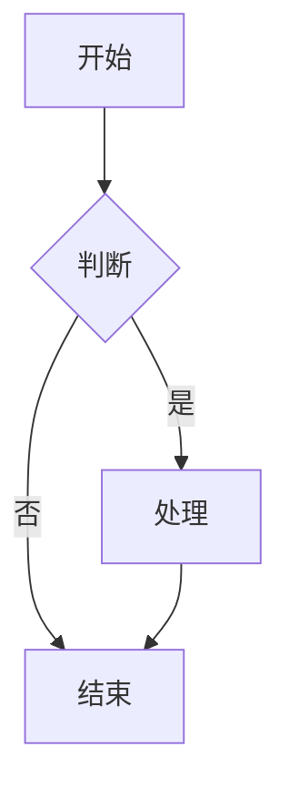
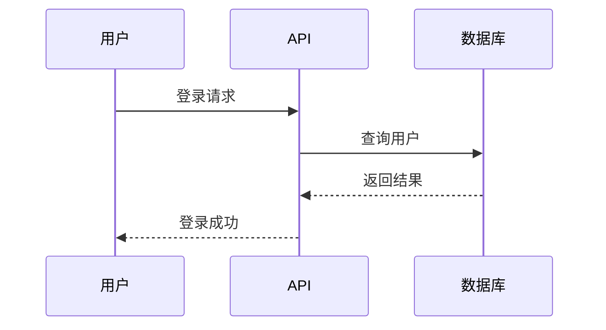
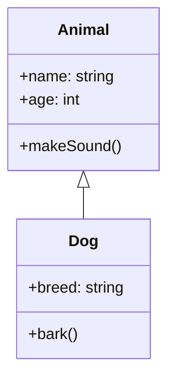
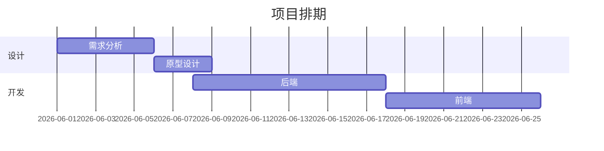
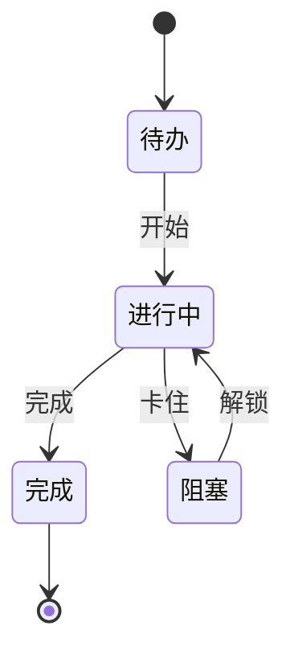
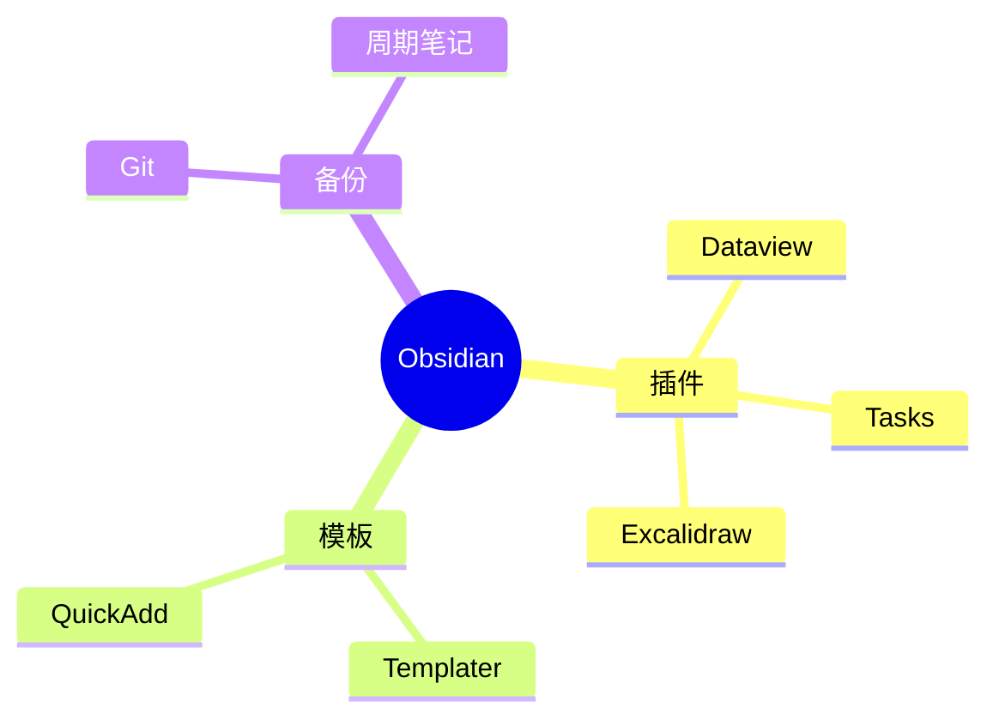

# Excalidraw + Mermaid 双画板使用指南

## 什么是双画板

- **Excalidraw**：手绘风格画板，适合草图、流程图、原型
- **Mermaid**：代码生成图表，适合技术文档、时序图、甘特图

两者结合，覆盖 95% 的绘图需求。

## Excalidraw

### 安装

**当前状态**：已在 community-plugins.json 启用，但 plugins/ 中未实际安装。

**安装方式**：
- [obsidian://show-plugin?id=obsidian-excalidraw-plugin](obsidian://show-plugin?id=obsidian-excalidraw-plugin)

### 创建方式

1. 命令面板：`Create Excalidraw Drawing`
2. 工具栏：`+` → 选 Excalidraw
3. 自动保存为 `.excalidraw.md`

### 使用场景

- 系统架构草图
- 流程图
- 思维导图
- 原型设计
- 会议白板

### 嵌入文档

```markdown
![[图名.excalidraw]]
```

## Mermaid

### 语法示例

#### 流程图



#### 时序图



#### 类图



#### 甘特图



#### 状态图



#### 思维导图



## 双画板对比

| 维度 | Excalidraw | Mermaid |
|------|-----------|---------|
| 风格 | 手绘风 | 标准化 |
| 上手成本 | 低（拖拽） | 中（需写代码） |
| 版本控制 | 难 | 易（纯文本） |
| 复杂图 | 适合 | 难 |
| 嵌入文档 | 嵌入 .excalidraw | 代码块 |
| 适合场景 | 草图/原型 | 技术文档 |

## 最佳实践

### 何时用 Excalidraw

- 头脑风暴
- 系统架构草图
- 流程图（简单的）
- UI 原型

### 何时用 Mermaid

- 时序图
- 甘特图
- 类图
- 状态机
- 嵌入技术文档

## 高级技巧

### Mermaid 主题

Obsidian Mermaid 插件默认深色主题。如需调整：

`设置 → Mermaid → Theme`

可选：`default` / `dark` / `forest` / `neutral`

### Excalidraw 自动归档

在 Frontmatter 中设置：

```yaml
---
excalidraw-plugin: parsed
excalidraw-export-dark: false
---
```

## 示例资源

- [[Knowledge/_index|知识库索引]] - 配图来源
- [[Projects/_index|项目架构图]] - Excalidraw 草图
- [[Sessions/2026-05-31-software-arch-mindmap]] - 思维导图

## 相关链接

- [Excalidraw 官网](https://excalidraw.com/)
- [Mermaid 官方文档](https://mermaid.js.org/)
- [Obsidian Mermaid 插件](https://github.com/Plugin-Engineer/obsidian-mermaid)
