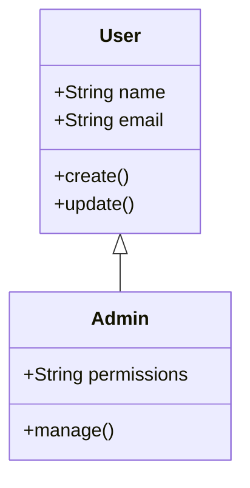
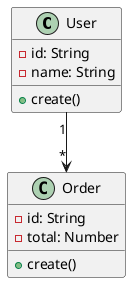

# UML建模指南

## 什么是UML

UML（Unified Modeling Language，统一建模语言）是一种**标准化的可视化建模语言**，用于软件设计、开发和文档化。

### UML 的作用

| 作用 | 说明 |
|------|------|
| **可视化** | 用图形描述系统结构 |
| **文档化** | 生成设计文档 |
| **沟通** | 团队共享设计意图 |
| **验证** | 检查设计是否合理 |

## UML 图分类

### 结构图（Structure Diagrams）

描述系统的静态结构：

| 图类型 | 用途 |
|--------|------|
| **类图** | 描述类和它们的关联 |
| **对象图** | 描述对象实例 |
| **组件图** | 描述系统组件 |
| **部署图** | 描述硬件/软件部署 |
| **包图** | 描述包/命名空间结构 |

### 行为图（Behavior Diagrams）

描述系统的动态行为：

| 图类型 | 用途 |
|--------|------|
| **用例图** | 描述用户与系统的交互 |
| **活动图** | 描述流程和决策 |
| **状态机图** | 描述对象状态变化 |
| **时序图** | 描述对象间消息交互 |
| **通信图** | 描述对象间协作 |

## 常用UML图详解

### 1. 类图 (Class Diagram)

**用途**：描述系统中的类、接口及其关系

**符号**：

```
┌─────────────────────────────────┐
│           类名 (ClassName)       │
├─────────────────────────────────┤
│ - 属性: Type                    │
│ - 属性: Type                    │
├─────────────────────────────────┤
│ + 方法(): ReturnType            │
│ + 方法(): ReturnType            │
└─────────────────────────────────┘

可见性:
+ public
- private
# protected
~ package
```

**关系类型**：

```
┌─────────┐         ┌─────────┐
│   A     │─────────│   B     │  关联 (Association)
└─────────┘         └─────────┘

┌─────────┐ ◇───────│   B     │  聚合 (Aggregation)
│   A     │          └─────────┘  (A包含B，但B可独立存在)

┌─────────┐ ◆───────│   B     │  组合 (Composition)
│   A     │          └─────────┘  (A包含B，B不能独立存在)

┌─────────┐ ────────│   B     │  依赖 (Dependency)
└─────────┘         └─────────┘  (A使用B)

┌─────────┐ △────────│   B     │  泛化 (Generalization)
└─────────┘          └─────────┘  (A继承B)
```

**示例**：

```
┌─────────────────────┐
│       User          │
├─────────────────────┤
│ - id: string        │
│ - name: string      │
│ - email: string     │
├─────────────────────┤
│ + create(): void    │
│ + update(): void    │
└─────────────────────┘
         △
         │ 泛化
         │
┌─────────────────────┐         ┌─────────────────────┐
│     Admin           │         │       Order         │
├─────────────────────┤         ├─────────────────────┤
│ + permissions: []   │1       *│ - id: string        │
├─────────────────────┤─────────│ - total: number     │
│ + manage(): void    │         ├─────────────────────┤
└─────────────────────┘         │ + create(): void    │
                                 └─────────────────────┘
```

### 2. 时序图 (Sequence Diagram)

**用途**：描述对象间的消息交互和时间顺序

**符号**：

```
对象A                    对象B                    对象C
  │                        │                        │
  │───── method() ────────▶│                        │  请求
  │                        │                        │
  │◀──── return value ────│                        │  响应
  │                        │───── method2() ───────▶│  转发
  │                        │                        │
  │                        │◀──── result ──────────│
  │                        │                        │
```

**示例**：

```
用户                      控制器                    服务                   数据库
  │                          │                       │                      │
  │─── 下单请求 ────────────▶│                       │                      │
  │                          │                       │                      │
  │                          │─── 创建订单 ──────────▶│                      │
  │                          │                       │                      │
  │                          │                       │─── INSERT ──────────▶│
  │                          │                       │                      │
  │                          │                       │◀──── OK ────────────│
  │                          │                       │                      │
  │                          │◀──── 订单ID ──────────│                      │
  │                          │                       │                      │
  │◀──── 成功响应 ──────────│                       │                      │
```

### 3. 用例图 (Use Case Diagram)

**用途**：描述用户与系统的交互场景

**符号**：

```
┌───────────────┐
│    参与者      │  (Actor)
│   (用户)       │
└───────┬───────┘
        │
        │ 关联线
        ↓
    ┌───────────┐
    │  用例      │  (Use Case)
    │ 创建订单    │
    └───────────┘
```

**示例**：

```
        ┌─────────────────────────────────────────┐
        │          电商系统                        │
        │                                         │
┌───────┐│                                         │
│ 顾客   ││    ┌─────────────┐                     │
└───────┘│    │ 浏览商品     │◀────────────────────┤
        │    └─────────────┘                       │
        │          ▲                               │
        │          │                              │
        │    ┌─────┴─────┐                        │
        │    │ 添加购物车 │                        │
        │    └───────────┘                        │
        │          ▲                              │
        │          │                              │
        │    ┌─────┴─────┐                        │
        │    │   下单     │◀───────────────────────┤
        │    └───────────┘                        │
        │                                         │
┌───────┐│    ┌─────────────┐                    │
│ 管理员 ││    │   管理商品   │◀───────────────────┘
└───────┘│    └─────────────┘
        └─────────────────────────────────────────┘
```

### 4. 活动图 (Activity Diagram)

**用途**：描述业务流程和工作流

**符号**：

```
●──────────▶  开始/结束
────┬─────▶  活动
     ↓
◇──────────▶  决策
     ↓
┌───────────┐
│   分叉    │  (Fork) - 并行执行
│   /   \   │
│  ▼     ▼  │  并行分支
│ ──     ── │
│  \   /   │
│   ▼ ▼    │
│  合拢    │
└───────────┘
```

**示例**：

```
开始 ●
  │
  ▼
┌───────────────────┐
│   提交订单        │
└─────────┬─────────┘
          │
          ▼
    ◇ 库存充足？ ◇
    ╱           ╲
  是             否
  ▼               ▼
┌─────────┐  ┌─────────────┐
│ 扣减库存 │  │ 提示缺货    │
└────┬────┘  └──────┬──────┘
     │               │
     ▼               ▼
┌─────────┐     结束 ●
│ 通知用户 │
└────┬────┘
     │
     ▼
   结束 ●
```

### 5. 组件图 (Component Diagram)

**用途**：描述系统的组件结构和依赖关系

**示例**：

```
┌──────────────────────────────────────────────────────────┐
│                    电商系统                                │
├──────────────────────────────────────────────────────────┤
│                                                          │
│  ┌────────────┐   ┌────────────┐   ┌────────────┐       │
│  │ UI 组件    │   │ 服务组件    │   │ 数据组件    │       │
│  ├────────────┤   ├────────────┤   ├────────────┤       │
│  │ Component  │   │ Component  │   │ Component  │       │
│  │   A        │──▶│    B        │──▶│    C        │       │
│  └────────────┘   └────────────┘   └────────────┘       │
│       │               │                 │                │
│       │               │                 ▼                │
│       │               │          ┌────────────┐          │
│       │               └─────────▶│ Database   │          │
│       │                        └────────────┘          │
│       │                                                     │
└───────┼─────────────────────────────────────────────────────┘
        │
        ▼
┌────────────┐
│  客户端    │
└────────────┘
```

## UML 工具推荐

### 在线工具

| 工具 | 特点 | 费用 |
|------|------|------|
| **draw.io** | 免费、直观、离线可用 | 免费 |
| **PlantUML** | 代码生成图、版本控制友好 | 免费 |
| **Mermaid** | Markdown内嵌、GitHub支持 | 免费 |
| **Lucidchart** | 协作、模板丰富 | 付费 |

### 桌面工具

| 工具 | 特点 | 平台 |
|------|------|------|
| **StarUML** | 功能完整、支持逆向工程 | Windows/Mac |
| **Visual Paradigm** | 企业级、代码生成 | Windows/Mac/Linux |
| **Enterprise Architect** | 专业级、复杂系统 | Windows |

### 代码内嵌

**Mermaid 示例**：

```markdown

```

**PlantUML 示例**：



## UML 最佳实践

1. **选择合适的图**
   - 结构设计 → 类图、组件图
   - 行为描述 → 时序图、活动图
   - 需求分析 → 用例图

2. **保持简洁**
   - 不要试图在一张图里描述所有
   - 每张图聚焦一个关注点

3. **标注关键信息**
   - 加上可见性（public/private）
   - 标注多重度（1..*, 0..1）
   - 说明约束条件

4. **团队共识**
   - 统一符号和约定
   - 定期评审设计图
   - 保持图与代码同步

## 相关文档

- [[软件架构导论]] - 基础概念
- [[架构模式对比]] - 架构模式
- [[架构建模工具]] - 建模工具详解