# 前端开发全流程·极致深度框架「9 级 × 7 列 亚比特级」

> **用途**:对前端开发全流程(需求→组件→工程→交互→测试→发布→性能)做 **9 级纵深 + 7 列横向** 的矩阵化拆解。
> **适用场景**:前端日常开发、技术评审、Code Review、上线 Checklist、性能调优、新人 onboarding、跨端架构(PC/H5/小程序/桌面)。
> **核心约束**:7 列业务含义**固定映射**,与 DB / 后端框架**完全一致**(A结构/B逻辑/C配置/D用例/E校验/F指标/G规则)。
> **前置说明**:本骨架基于通用前端最佳实践与 AI 直播平台前端栈(React 18 + TS 5 + Vite 5 + Electron 28)抽象;待用户分享官方前端框架图后细化对齐。

---

## 一、7 大一级模块 → 7 列固定映射(铁律)

> **铁律来源**:通用深度拆解框架模板第 6 章「7 列业务含义映射」+ 用户 2026-06-22 立。
> **三级框架共用**:同一套 A-G 列,DB / 后端 / 前端 三层**只允许映射不同模块族**。

| 列 | 业务/技术含义(固定) | 前端开发框架的对应一级模块 | 模块内涵 |
|----|---------------------|----------------------|---------|
| **A** | **结构 / 字段 / 字节** | **2. 组件结构设计** | 组件拆分、props/state 结构、路由表、状态管理选型 |
| **B** | **逻辑 / 控制流 / 比特标志** | **4. 交互逻辑实现** | 状态机、表单逻辑、异步处理、错误处理 |
| **C** | **配置 / 指令 / 时序** | **3. 工程脚手架搭建** | Vite/Webpack、TS 配置、CSS 方案、Lint/Format |
| **D** | **测试 / 用例 / 地址** | **5. 测试联调验证** | Vitest、Playwright、Storybook、契约测试 |
| **E** | **校验 / 步骤 / 状态** | **1. 需求交互评审** | 用户故事、交互原型(Figma)、边界场景 |
| **F** | **指标 / 监控 / 性能** | **7. 运行时性能优化** | FCP/LCP/CLS/INP、Web Vitals、运行时监控 |
| **G** | **规则 / 策略 / 边界** | **6. 发布上线策略** | CDN、灰度、A/B Test、路由守卫、CSP |

> **⚠️ 关键点**:与 DB / 后端框架的对比——同一套 A-G 列含义,但对应不同模块族。
> - DB:A=库表 / B=SQL / C=索引参数 / D=数据测试 / E=数据建模 / F=DB 监控 / G=数据安全
> - 后端:A=架构 / B=编码 / C=工程 / D=测试 / E=需求 / F=运维 / G=部署
> - 前端:A=组件 / B=交互 / C=脚手架 / D=测试 / E=需求 / F=运行时性能 / G=发布

---

## 二、9 级 × 7 列 全景图(Mermaid 骨架)

```mermaid
graph TB
    subgraph 一级[一级：7大顶层模块]
        A_M[2.组件结构<br/>→ A 结构]
        B_M[4.交互逻辑<br/>→ B 逻辑]
        C_M[3.工程脚手架<br/>→ C 配置]
        D_M[5.测试联调<br/>→ D 用例]
        E_M[1.需求评审<br/>→ E 校验]
        F_M[7.运行时性能<br/>→ F 指标]
        G_M[6.发布上线<br/>→ G 规则]
    end

    subgraph 二级[二级：4-5个二级子模块]
        A1[A1 组件拆分] & A2[A2 状态管理] & A3[A3 路由设计] & A4[A4 接口契约] & A5[A5 非功能设计]
        B1[B1 状态机] & B2[B2 表单逻辑] & B3[B3 异步处理] & B4[B4 三方对接] & B5[B5 异常处理]
        C1[C1 项目初始化] & C2[C2 分层架构] & C3[C3 组件集成] & C4[C4 工具封装] & C5[C5 规范配置]
        D1[D1 单元测试] & D2[D2 组件联调] & D3[D3 E2E 测试] & D4[D4 性能验证]
        E1[E1 业务场景] & E2[E2 业务规则] & E3[E3 非功能诉求] & E4[E4 排期预估]
        F1[F1 监控告警] & F2[F2 问题排查] & F3[F3 性能调优] & F4[F4 架构迭代] & F5[F5 技术沉淀]
        G1[G1 环境准备] & G2[G2 打包构建] & G3[G3 灰度发布] & G4[G4 全量上线]
    end

    subgraph 三级[三级：核心功能 4个/列]
        A1_1[A1-1 组件粒度] & A1_2[A1-2 复用层级] & A1_3[A1-3 设计系统] & A1_4[A1-4 跨端组件]
        B1_1[B1-1 本地状态] & B1_2[B1-2 全局状态] & B1_3[B1-3 状态机库] & B1_4[B1-4 数据流]
        C1_1[C1-1 依赖版本] & C1_2[C1-2 包结构] & C1_3[C1-3 CSS方案] & C1_4[C1-4 Lint规范]
        D1_1[D1-1 用例编写] & D1_2[D1-2 边界值] & D1_3[D1-3 Mock数据] & D1_4[D1-4 覆盖率]
        E1_1[E1-1 用户故事] & E1_2[E1-2 交互路径] & E1_3[E1-3 指标量化] & E1_4[E1-4 工时评估]
        F1_1[F1-1 Web Vitals] & F1_2[F1-2 错误监控] & F1_3[F1-3 性能策略] & F1_4[F1-4 运行时优化]
        G1_1[G1-1 环境差异] & G1_2[G1-2 镜像构建] & G1_3[G1-3 灰度比例] & G1_4[G1-4 回滚方案]
    end

    一级 --> 二级 --> 三级
```



---

## 三、9 级 × 7 列 矩阵总表(骨架)

| 级别 | A 结构(组件) | B 逻辑(交互) | C 配置(工程) | D 用例(测试) | E 校验(需求) | F 指标(性能) | G 规则(发布) |
|------|------|------|------|------|------|------|------|
| **一级** | 2.组件结构设计 | 4.交互逻辑实现 | 3.工程脚手架搭建 | 5.测试联调验证 | 1.需求交互评审 | 7.运行时性能优化 | 6.发布上线策略 |
| **二级** | 组件拆分 / 状态管理 / 路由设计 / 接口契约 / 非功能设计 | 状态机 / 表单逻辑 / 异步处理 / 三方对接 / 异常处理 | 项目初始化 / 分层架构 / 组件集成 / 工具封装 / 规范配置 | 单测 / 组件联调 / E2E / 性能 | 用户故事 / 交互路径 / 非功能诉求 / 排期 | 监控告警 / 问题排查 / 性能调优 / 架构迭代 / 沉淀 | 环境准备 / 打包构建 / 灰度发布 / 全量上线 |
| **三级** | 组件粒度 / 复用层级 / 设计系统 / 跨端组件 | 本地状态 / 全局状态 / 状态机库 / 数据流 | 依赖版本 / 包结构 / CSS方案 / Lint | 用例编写 / 边界值 / Mock / 覆盖率 | 用户故事 / 交互路径 / 指标量化 / 工时评估 | Web Vitals / 错误监控 / 性能策略 / 运行时优化 | 环境差异 / 镜像构建 / 灰度比例 / 回滚方案 |
| **四级** | 单组件粒度 / 单 props 设计 / 单路由路径 / 单契约字段 | 单状态字段 / 单表单字段 / 单异步步骤 / 单异常分支 | 单依赖版本 / 单包路径 / 单CSS方案 / 单 lint 规则 | 单方法断言 / 单参数边界 / 单异常场景 / 单覆盖率阈值 | 单场景路径 / 单规则条件 / 单指标定义 / 单任务工时 | 单接口耗时 / 单页面 LCP / 单错误率 / 单 CLS | 单配置项 / 单镜像层 / 单灰度节点 / 单回滚步骤 |
| **五级** | 单组件拆分边界 / 单 props 类型 / 单路由参数 / 单契约版本 | 单 useState / 单表单字段校验 / 单 Promise / 单 try/catch | 单依赖版本 / 单编码规范 / 单工具类 / 单配置命名 | 单断言精度 / 单用例颗粒 / 单 Mock 精度 / 单缺陷复现 | 单字段澄清 / 单异常确认 / 单优先级 / 单里程碑 | 单执行计划 / 单锁粒度 / 单参数调优 / 单优化收益 | 单环境变量 / 单镜像大小 / 单发布脚本 / 单流量切换 |
| **六级** | 单组件文件 / 单 props 字段 / 单路由段 / 单契约 schema | 单 useState 调用 / 单 zod schema / 单 async 链 / 单 ErrorBoundary | 单 lint 规则值 / 单 import 路径 / 单 CSS 变量 / 单 TS strict | 单断言预期值 / 单边界值精度 / 单 Mock 数据精度 / 单覆盖率小数 | 单字符语义 / 单规则边界值 / 单指标精度位 / 单任务分钟级拆分 | 单毫秒级渲染优化 / 单字节包体 / 单 LCP 元素 / 单 CLS 来源 | 单脚本命令参数 / 单灰度节点数 / 单回滚耗时 / 单发布校验点 |
| **七级** | 单 props 字段定义 / 单字符长度 / 单格式规范 / 单 attribute | 单变量命名 / 单逻辑分支 / 单 Promise 状态 / 单事件 handler | 单指令配置 / 单参数取值 / 单开关状态 / 单默认值 | 单用例颗粒 / 单断言精度 / 单数据精度 / 单场景覆盖 | 单步骤校验 / 单节点检查 / 单结果核对 / 单状态确认 | 单指标阈值 / 单数值精度 / 单单位量级 / 单波动范围 | 单规则细节 / 单条件边界 / 单场景覆盖 / 单例外处理 |
| **八级** | 单字节长度 / 单字符编码 / 单进制位宽 / 单 ID 位长 | 单字节编码 / 单比特标志 / 单移位位数 / 单 hash 键 | 单比特位宽 / 单字节偏移 / 单 CSS 字节 / 单 bundle chunk | 单字节大小 / 单比特误差 / 单字节偏移 / 单地址位宽 | 单比特校验 / 单字节校验 / 单比特位值 / 单校验位状态 | 单字节阈值 / 单比特精度 / 单字节误差 / 单纳秒耗时 | 单字节规则 / 单比特约束 / 单进制基数 / 单掩码位数 |
| **九级** | 亚比特相位 / 比特内相位差 / 单比特噪声容限 / 单比特能量级 | 亚比特偏移 / 位内微偏移 / 单比特漂移量 / 单比特衰减量 | 量子级位态 / 叠加态粒度 / 态矢精度 / 坍缩精度 | 皮秒级时序 / 亚周期时序 / 亚纳秒延迟 / 亚毫秒波动 | 飞秒级校验 / 亚字节校验 / 亚比特检错 / 亚字符纠错 | 幺米级精度 / 亚纳米粒度 / 亚像素粒度 / 亚字节粒度 | 普朗克约束 / 极限边界约束 / 极限阈值精度 / 极限规则细度 |

---

## 四、逐列展开(二级子模块详细骨架)

### A 列:组件结构设计(结构 / 字段 / 字节)

| 二级子模块 | 三级功能(4 项) | 前端领域示例 |
|-----------|----------------|------------|
| **A1 组件拆分** | 组件粒度 / 复用层级 / 设计系统 / 跨端组件 | 原子化设计(Atom/Molecule/Organism) + Headless UI + Radix UI + Web Components |
| **A2 状态管理** | 本地状态 / 服务端状态 / 全局状态 / 持久化 | useState / SWR/TanStack Query / Zustand/Redux / localStorage/IndexedDB |
| **A3 路由设计** | 路由模式 / 嵌套路由 / 路由守卫 / 懒加载 | React Router v6 / TanStack Router / Lazy/Suspense |
| **A4 接口契约** | API Schema / 类型生成 / 错误码 / 版本管理 | OpenAPI / tRPC / GraphQL / Zod / URL 版本 |
| **A5 非功能设计** | 可访问性 / 国际化 / SEO / 离线支持 | WCAG 2.1 AA / i18next / SSR SSG / Service Worker |

### B 列:交互逻辑实现(逻辑 / 控制流 / 比特标志)

| 二级子模块 | 三级功能(4 项) | 前端领域示例 |
|-----------|----------------|------------|
| **B1 状态机** | 本地状态 / 全局状态 / 状态机库 / 数据流 | useReducer / Zustand / XState / Redux Saga |
| **B2 表单逻辑** | 受控/非受控 / 校验 / 动态表单 / 提交 | React Hook Form / Formik / Yup/Zod / Final Form |
| **B3 异步处理** | 数据请求 / 缓存 / 重试 / 并发控制 | TanStack Query / SWR / axios / AbortController |
| **B4 三方对接** | SDK 集成 / WebSocket / 支付 / 监控 | 第三方 SDK / WebSocket / Stripe SDK / Sentry |
| **B5 异常处理** | ErrorBoundary / 错误上报 / 降级 / 重试 | React ErrorBoundary / Sentry / Fallback UI / Retry |

### C 列:工程脚手架搭建(配置 / 指令 / 时序)

| 二级子模块 | 三级功能(4 项) | 前端领域示例 |
|-----------|----------------|------------|
| **C1 项目初始化** | 依赖版本 / 包结构 / 全局异常 / Lint 规范 | package.json / Vite/Webpack / Global ErrorBoundary / ESLint/Prettier |
| **C2 分层架构** | 路由层 / 页面层 / 容器层 / 组件层 | Folders: routes/ pages/ containers/ components/ |
| **C3 组件集成** | UI 库 / CSS 方案 / 状态库 / 路由库 | antd/MUI / Tailwind/CSS-in-JS / Zustand / React Router |
| **C4 工具封装** | 通用工具 / 异常类 / 常量 / 枚举 | lodash / Result / Constants / Enums |
| **C5 规范配置** | Git 规范 / CI 规范 / 文档规范 / 提交规范 | Conventional Commits / GitHub Actions / Storybook / Husky |

### D 列:测试联调验证(用例 / 测试 / 地址)

| 二级子模块 | 三级功能(4 项) | 前端领域示例 |
|-----------|----------------|------------|
| **D1 单元测试** | 用例编写 / 边界值 / Mock 数据 / 覆盖率 | Vitest/Jest + 边界值 + MSW + c8 |
| **D2 组件联调** | 组件测试 / Hook 测试 / Storybook / 视觉回归 | React Testing Library / Storybook / Chromatic |
| **D3 E2E 测试** | 端到端 / 跨浏览器 / 移动端 / 桌面端 | Playwright / Cypress / WebdriverIO / Spectron |
| **D4 性能验证** | 基准 / 峰值 / Lighthouse / Web Vitals | Lighthouse / WebPageTest / k6 / bundlesize |

### E 列:需求交互评审(校验 / 步骤 / 状态)

| 二级子模块 | 三级功能(4 项) | 前端领域示例 |
|-----------|----------------|------------|
| **E1 业务场景** | 用户故事 / 交互路径 / 异常流程 / 边界场景 | User Story / User Journey / Exception Flow |
| **E2 业务规则** | 规则枚举 / 优先级 / 冲突 / 例外 | 表单校验规则 / 业务优先级 / 冲突矩阵 |
| **E3 非功能诉求** | 性能 / 安全 / 可用性 / 可访问性 | FCP < 1.5s / WCAG / SLA 99.9% / CSP |
| **E4 排期预估** | 工时 / 依赖 / 风险 / 里程碑 | 人天估算 + 上下游依赖 + 风险矩阵 |

### F 列:运行时性能优化(指标 / 监控 / 性能)

| 二级子模块 | 三级功能(4 项) | 前端领域示例 |
|-----------|----------------|------------|
| **F1 监控告警** | Web Vitals / 错误监控 / 用户行为 / 告警 | Lighthouse CI / Sentry / 埋点 SDK / 告警分级 |
| **F2 问题排查** | 慢页面 / 卡顿 / 内存泄漏 / 崩溃 | Chrome DevTools / Performance API / Memory Profiler |
| **F3 性能调优** | 懒加载 / 预加载 / 缓存 / 代码分割 | React.lazy / prefetch / SWR cache / dynamic import |
| **F4 架构迭代** | 单页改多页 / SSR / 微前端 / 跨端 | SPA → MPA / Next.js / Module Federation / Taro |
| **F5 技术沉淀** | 文档 / 规范 / 培训 / 复盘 | Storybook / ADR / 技术分享 / 事故复盘 |

### G 列:发布上线策略(规则 / 策略 / 边界)

| 二级子模块 | 三级功能(4 项) | 前端领域示例 |
|-----------|----------------|------------|
| **G1 环境准备** | 环境差异 / 配置项 / 密钥管理 / 网络 | dev/staging/prod + .env + Vault + CSP |
| **G2 打包构建** | 镜像 / 制品 / 资源 / 体积 | Vite build / bundle / static assets / bundlesize |
| **G3 灰度发布** | 灰度比例 / 流量切换 / 蓝绿 / Feature Flag | 1%/5%/10%/50%/100% + LaunchDarkly |
| **G4 全量上线** | 上线步骤 / 校验点 / 回滚 / 监控 | 标准化发布流程 + 冒烟测试 + 1-click 回滚 + 实时监控 |

---

## 五、八级 / 九级 专项展开(前端领域极限态)

### 5.1 八级(比特级):前端领域示例

| 列 | 八级 1 | 八级 2 | 八级 3 | 八级 4 | 前端领域示例 |
|---|--------|--------|--------|--------|------------|
| **A** | 单字节长度 | 单字符编码 | 单进制位宽 | 单哈希位长 | VARCHAR(255) / UTF-8 / 64-bit ID / SHA-256 |
| **B** | 单字节编码 | 单比特标志 | 单移位位数 | 单异或密钥 | JSON.stringify / boolean flag / `<<` 位移 / session token |
| **C** | 单比特位宽 | 单寄存器位 | 单时钟周期 | 单指令周期 | TS number = 64bit / CSS flag / 1.5GHz / 单条 V8 指令 |
| **D** | 单字节大小 | 单比特误差 | 单字节偏移 | 单地址位宽 | 单测试用例 1KB / 浮点 53bit / offset 1B / 64-bit 虚拟地址 |
| **E** | 单比特校验 | 单字节校验 | 单比特位值 | 单校验位状态 | parity bit / checksum / 状态位 / health check status |
| **F** | 单字节阈值 | 单比特精度 | 单字节误差 | 单纳秒耗时 | bundle size 1KB / float precision / LCP 1ms / 单次 render ns |
| **G** | 单字节规则 | 单比特约束 | 单进制基数 | 单掩码位数 | CSP byte / RBAC bitmask / IP CIDR / 权限位掩码 |

### 5.2 九级(亚比特 / 量子级):前端领域极限态(理论前沿)

| 列 | 九级 1 | 前端领域示例(理论) |
|---|--------|------------------|
| **A** | 亚比特相位 | 组件渲染的相位偏差(V8 调度 ns 级) |
| **B** | 亚比特偏移 | 状态机转换的位漂移(useReducer 状态副本) |
| **C** | 量子级位态 | Feature Flag 的叠加态(多版本共存) |
| **D** | 皮秒级时序 | 单测方法的执行时序(10⁻¹²s 量级) |
| **E** | 飞秒级校验 | CSP hash 的飞秒级碰撞检测(10⁻¹⁵s) |
| **F** | 幺米级精度 | LCP 元素的幺米级延迟(10⁻²⁰s) |
| **G** | 普朗克约束 | CSP 规则的物理下界 |

---

## 六、节点数计算(前端开发框架量级)

```
单链路节点数 = 1 × 5 × 4 × 4 × 4 × 4 = 1280(七级深度)
单链路节点数(含亚比特) = 1280 × 4 × 4 = 20480(九级深度)
7 列 × 20480 = 143,360 总节点数 / 前端开发全流程
```

> **量级提示**:与 DB / 后端框架同量级(每层 14 万+ 节点),三层合计 **43 万+ 节点**。实际工作中**不需要全部展开**,采用「**关键路径深耕 + 一般路径只到三级**」策略。

---

## 七、实战使用策略(前端领域)

| 任务类型 | 推荐起点 | 推荐终点 | 实际深度 |
|---------|---------|---------|---------|
| **新需求评审** | E 列(需求) → 一级 | 七级(单字段澄清) | 7 级 ≈ 4,480 节点 |
| **组件拆分** | A 列(组件) | 八级(单 props 类型) | 8 级 ≈ 17,920 节点 |
| **慢页面优化** | B 列(逻辑) + F 列(性能) | 八级(单 LCP 元素) | 8 级 |
| **灰度发布** | G 列(规则) | 六级(单灰度比例) | 6 级 ≈ 320 节点 |
| **组件单测** | D 列(用例) → D1 | 七级(单断言精度) | 7 级 |
| **性能排查** | F 列(指标) → F2 | 八级(单 Performance 节点) | 8 级 |
| **Code Review** | B 列(逻辑) + C 列(配置) | 七级(单命名规范) | 7 级 |

---

## 八、与 DB / 后端框架的横向对比(同 9×7 列不同模块族)

| 列 | 数据库框架模块 | 后端框架模块 | 前端框架模块 | 三层共性 |
|----|--------------|------------|------------|---------|
| **A** | 2.库表结构设计 | 2.架构方案设计 | 2.组件结构设计 | 同为"结构",聚焦各层实体 |
| **B** | 4.SQL 开发优化 | 4.业务编码实现 | 4.交互逻辑实现 | 同为"逻辑",聚焦各层控制流 |
| **C** | 3.索引性能设计 | 3.工程框架搭建 | 3.工程脚手架搭建 | 同为"配置",聚焦各层参数 |
| **D** | 6.测试验证 | 5.测试联调验证 | 5.测试联调验证 | 同为"测试",聚焦各层正确性 |
| **E** | 1.需求分析建模 | 1.需求规划评审 | 1.需求交互评审 | 同为"需求",聚焦各层语义 |
| **F** | 7.部署运维迭代 | 7.运维迭代优化 | 7.运行时性能优化 | 同为"指标",聚焦各层 SLO |
| **G** | 5.安全数据治理 | 6.部署发布上线 | 6.发布上线策略 | 同为"规则",聚焦各层边界 |

> **铁律落地**:同一套 A-G 列含义 + 不同模块映射,**形成三层 43 万+ 节点的横向可对比拆解矩阵**。
> **详细对比**:`05-三层横向对比-数据库×后端×前端.md`

---

## 九、AI 直播平台前端栈映射

| 9×7 列 | AI 直播平台前端栈 |
|-------|----------------|
| A 结构 | React 18 + Ant Design 5 + 路由懒加载 + Zustand 4 |
| B 逻辑 | XState 状态机 + React Hook Form + TanStack Query + axios |
| C 配置 | Vite 5 + TS 5 + Tailwind CSS + ESLint + Prettier |
| D 测试 | Vitest + React Testing Library + Playwright + Storybook |
| E 需求 | Figma 用户故事 + 边界场景 + WCAG 2.1 AA + i18n 5 国 |
| F 性能 | Lighthouse CI + Sentry + Web Vitals + Performance API |
| G 发布 | electron-builder + electron-updater + CSP + Feature Flag |

> **栈依据**:`C:\skill\ai-live-platform\frontend\web\`(Electron 28 + React 18 + Vite 5 + TS 5)

---

## 十、入库清单

- [x] 7 大模块 → 7 列固定映射(与 DB/后端铁律一致)
- [x] Mermaid 骨架图(一级+二级+三级)
- [x] 9 级 × 7 列矩阵总表
- [x] 7 列二级子模块展开(4-5 项/列)
- [x] 八级比特级 + 九级量子级示例
- [x] 与 DB / 后端框架的横向对比
- [x] AI 直播平台前端栈映射
- [ ] **三级以下具体内容填充**(待实例文档展开)
- [ ] **官方前端框架图对齐**(等用户分享)

---

## 十一、关联文档

- [[00-通用深度拆解框架模板-亚比特级]] — 母模板
- [[00-数据库开发全流程-极致深度框架-9×7矩阵]] — DB 骨架
- [[00-后端开发全流程-极致深度框架-9×7矩阵]] — 后端骨架
- [[01-前端开发全流程-4-7级深度展开-实例]] — 前端深度实例(待写)
- [[02-AI直播平台-前端实践-9×7映射]] — 前端 × AI 直播(待写)
- [[05-三层横向对比-数据库×后端×前端]] — 三层横向对比(前端预映射来源)
- [[00-AI直播平台落地checklist]] — 前端选型参考
- [[00-总索引]] — 项目入口

---

**入库时间**:2026-06-25
**入库方式**:基于 05-三层横向对比的前端预映射 + 通用前端最佳实践(React 18 + TS 5 + Vite 5 + Electron 28)抽象
**核心价值**:前端技术评审、Code Review、上线 Checklist、性能调优的统一拆解骨架
**下一步**:等用户分享官方前端框架图后对齐 + 按需展开三级以下内容 + 串联 AI 直播前端实战
