# 后端开发全流程·极致深度框架「9 级 × 7 列 亚比特级」

> **用途**:对后端开发全流程(需求→架构→工程→编码→测试→部署→运维)做 **9 级纵深 + 7 列横向** 的矩阵化拆解。
> **适用场景**:后端日常开发、技术评审、Code Review、上线 Checklist、性能调优、新人 onboarding。
> **核心约束**:7 列业务含义**固定映射**,不允许重新定义。

---

## 一、7 大一级模块 → 7 列固定映射(铁律)

> **铁律来源**:通用深度拆解框架模板第 6 章「7 列业务含义映射」+ 用户 2026-06-22 立。

| 列 | 业务/技术含义(固定) | 后端开发框架的对应一级模块 | 模块内涵 |
|----|---------------------|-----------------------|---------|
| **A** | **结构 / 字段 / 字节** | **2. 架构方案设计** | 服务拆分、模块结构、协议选型、表拆分策略 |
| **B** | **逻辑 / 控制流 / 比特标志** | **4. 业务编码实现** | 核心逻辑、控制流、事务、SQL、幂等 |
| **C** | **配置 / 指令 / 时序** | **3. 工程框架搭建** | 依赖版本、全局配置、注解、日志规范 |
| **D** | **测试 / 用例 / 地址** | **5. 测试联调验证** | 单测、Mock、压测、覆盖率、缺陷复现 |
| **E** | **校验 / 步骤 / 状态** | **1. 需求规划评审** | 需求澄清、规则确认、优先级、里程碑 |
| **F** | **指标 / 监控 / 性能** | **7. 运维迭代优化** | 慢接口、慢 SQL、缓存、参数调优 |
| **G** | **规则 / 策略 / 边界** | **6. 部署发布上线** | 灰度、回滚、容灾、流量切换 |

> **⚠️ 关键点**:与数据库框架的对比——同一套 A-G 列含义,但对应不同模块族。

---

## 二、9 级 × 7 列 全景图(Mermaid 骨架)

```mermaid
graph TB
    subgraph 一级[一级：7大顶层模块]
        A_M[2.架构方案<br/>→ A 结构]
        B_M[4.业务编码<br/>→ B 逻辑]
        C_M[3.工程框架<br/>→ C 配置]
        D_M[5.测试联调<br/>→ D 用例]
        E_M[1.需求评审<br/>→ E 校验]
        F_M[7.运维迭代<br/>→ F 指标]
        G_M[6.部署发布<br/>→ G 规则]
    end

    subgraph 二级[二级：4-5个二级子模块]
        A1[A1 技术选型] & A2[A2 领域建模] & A3[A3 库表设计] & A4[A4 接口设计] & A5[A5 非功能设计]
        B1[B1 数据层] & B2[B2 业务层] & B3[B3 控制层] & B4[B4 三方对接] & B5[B5 异常事务]
        C1[C1 项目初始化] & C2[C2 分层架构] & C3[C3 组件集成] & C4[C4 工具封装] & C5[C5 规范配置]
        D1[D1 单元测试] & D2[D2 接口联调] & D3[D3 集成测试] & D4[D4 压测验证]
        E1[E1 业务场景] & E2[E2 业务规则] & E3[E3 非功能诉求] & E4[E4 排期预估]
        F1[F1 监控告警] & F2[F2 问题排查] & F3[F3 性能调优] & F4[F4 架构迭代] & F5[F5 技术沉淀]
        G1[G1 环境准备] & G2[G2 打包构建] & G3[G3 灰度发布] & G4[G4 全量上线]
    end

    subgraph 三级[三级：核心功能 4个/列]
        A1_1[A1-1 架构模式] & A1_2[A1-2 服务拆分] & A1_3[A1-3 中间件] & A1_4[A1-4 部署架构]
        B1_1[B1-1 实体类] & B1_2[B1-2 Mapper] & B1_3[B1-3 SQL优化] & B1_4[B1-4 索引]
        C1_1[C1-1 依赖版本] & C1_2[C1-2 包结构] & C1_3[C1-3 异常配置] & C1_4[C1-4 日志规范]
        D1_1[D1-1 用例编写] & D1_2[D1-2 边界值] & D1_3[D1-3 Mock数据] & D1_4[D1-4 覆盖率]
        E1_1[E1-1 路径梳理] & E1_2[E1-2 规则枚举] & E1_3[E1-3 指标量化] & E1_4[E1-4 工时评估]
        F1_1[F1-1 慢接口] & F1_2[F1-2 慢SQL] & F1_3[F1-3 缓存策略] & F1_4[F1-4 参数调优]
        G1_1[G1-1 配置项] & G1_2[G1-2 镜像构建] & G1_3[G1-3 灰度比例] & G1_4[G1-4 回滚方案]
    end

    一级 --> 二级 --> 三级
```



---

## 三、9 级 × 7 列 矩阵总表(骨架)

| 级别 | A 结构(架构) | B 逻辑(编码) | C 配置(工程) | D 用例(测试) | E 校验(需求) | F 指标(运维) | G 规则(部署) |
|------|------|------|------|------|------|------|------|
| **一级** | 2.架构方案设计 | 4.业务编码实现 | 3.工程框架搭建 | 5.测试联调验证 | 1.需求规划评审 | 7.运维迭代优化 | 6.部署发布上线 |
| **二级** | 技术选型 / 领域建模 / 库表设计 / 接口设计 / 非功能设计 | 数据层 / 业务层 / 控制层 / 三方对接 / 异常事务 | 项目初始化 / 分层架构 / 组件集成 / 工具封装 / 规范配置 | 单测 / 接口联调 / 集成测试 / 压测 | 业务场景 / 业务规则 / 非功能诉求 / 排期预估 | 监控告警 / 问题排查 / 性能调优 / 架构迭代 / 技术沉淀 | 环境准备 / 打包构建 / 灰度发布 / 全量上线 |
| **三级** | 架构模式 / 服务拆分 / 中间件 / 部署架构 | 实体类 / Mapper / SQL优化 / 索引 | 依赖版本 / 包结构 / 异常配置 / 日志规范 | 用例编写 / 边界值 / Mock数据 / 覆盖率 | 路径梳理 / 规则枚举 / 指标量化 / 工时评估 | 慢接口 / 慢SQL / 缓存策略 / 参数调优 | 配置项 / 镜像构建 / 灰度比例 / 回滚方案 |
| **四级** | 单模式选型 / 单服务粒度 / 单中间件版本 / 单容灾方案 | 单字段类型 / 单索引命中 / 单事务传播 / 单幂等策略 | 单依赖冲突排查 / 单包路径命名 / 单注解配置 / 单日志级别 | 单方法断言 / 单参数边界 / 单异常场景 / 单覆盖率阈值 | 单场景路径 / 单规则条件 / 单指标定义 / 单任务工时 | 单接口耗时 / 单SQL耗时 / 单缓存命中率 / 单参数评估 | 单配置项校验 / 单镜像层优化 / 单灰度节点 / 单回滚步骤 |
| **五级** | 单服务边界 / 单接口协议 / 单表拆分 / 单缓存失效 | 单SQL计划 / 单异常码 / 单参数校验 / 单日志点位 | 单依赖版本 / 单编码规范 / 单工具类 / 单配置命名 | 单断言精度 / 单用例颗粒 / 单Mock精度 / 单缺陷复现 | 单字段澄清 / 单异常确认 / 单优先级 / 单里程碑 | 单执行计划节点 / 单锁粒度 / 单连接池参数 / 单线程池参数 | 单环境变量 / 单镜像大小 / 单发布脚本 / 单流量切换 |
| **六级** | 单服务拆分粒度 / 单接口字段定义 / 单表拆分策略 / 单超时配置 | 单事务超时 / 单重试次数 / 单返回体字段 / 单异常码数值 | 单注解参数值 / 单日志占位符 / 单异常码数值 / 单命名规范 | 单断言预期值 / 单边界值精度 / 单Mock数据精度 / 单覆盖率小数 | 单字符语义 / 单规则边界值 / 单指标精度位 / 单任务分钟级拆分 | 单毫秒级耗时优化 / 单字节内存优化 / 单配置项调优 / 单优化收益 | 单脚本命令参数 / 单灰度节点数 / 单回滚耗时 / 单发布校验点 |
| **七级** | 单字段定义 / 单字符长度 / 单格式规范 / 单属性约束 | 单语句拆分 / 单变量命名 / 单逻辑分支 / 单异常分支 | 单指令配置 / 单参数取值 / 单开关状态 / 单默认值 | 单用例颗粒 / 单断言精度 / 单数据精度 / 单场景覆盖 | 单步骤校验 / 单节点检查 / 单结果核对 / 单状态确认 | 单指标阈值 / 单数值精度 / 单单位量级 / 单波动范围 | 单规则细节 / 单条件边界 / 单场景覆盖 / 单例外处理 |
| **八级** | 单字节长度 / 单字符编码 / 单进制位宽 / 单哈希位长 | 单字节编码 / 单比特标志 / 单移位位数 / 单异或密钥 | 单比特位宽 / 单寄存器位 / 单时钟周期 / 单指令周期 | 单字节大小 / 单比特误差 / 单字节偏移 / 单地址位宽 | 单比特校验 / 单字节校验 / 单比特位值 / 单校验位状态 | 单字节阈值 / 单比特精度 / 单字节误差 / 单纳秒耗时 | 单字节规则 / 单比特约束 / 单进制基数 / 单掩码位数 |
| **九级** | 亚比特相位 / 比特内相位差 / 单比特噪声容限 / 单比特能量级 | 亚比特偏移 / 位内微偏移 / 单比特漂移量 / 单比特衰减量 | 量子级位态 / 叠加态粒度 / 态矢精度 / 坍缩精度 | 皮秒级时序 / 亚周期时序 / 亚纳秒延迟 / 亚毫秒波动 | 飞秒级校验 / 亚字节校验 / 亚比特检错 / 亚字符纠错 | 幺米级精度 / 亚纳米粒度 / 亚像素粒度 / 亚字节粒度 | 普朗克约束 / 极限边界约束 / 极限阈值精度 / 极限规则细度 |

---

## 四、逐列展开(二级子模块详细骨架)

### A 列:架构方案设计(结构 / 字段 / 字节)

| 二级子模块 | 三级功能(4 项) | 后端领域示例 |
|-----------|----------------|------------|
| **A1 技术选型** | 架构模式 / 服务拆分 / 中间件 / 部署架构 | 单体/MVC/微服务/RPC / Spring Cloud/Kitex / Redis/Kafka/MySQL / K8s/VM/Serverless |
| **A2 领域建模** | 实体 / 值对象 / 聚合 / 领域服务 | DDD 战术设计:聚合根/实体/VO/领域服务 |
| **A3 库表设计** | 表结构 / 字段 / 索引 / 分区 | ER 图 + 三范式 + 反范式 + 分库分表 |
| **A4 接口设计** | 协议 / 字段 / 错误码 / 版本 | REST/gRPC/GraphQL + JSON Schema + 业务错误码 + URL 版本 |
| **A5 非功能设计** | 性能 / 安全 / 容灾 / 可观测 | QPS/SLA + 加密/认证 + 多活/灾备 + 监控/日志/链路追踪 |

### B 列:业务编码实现(逻辑 / 控制流 / 比特标志)

| 二级子模块 | 三级功能(4 项) | 后端领域示例 |
|-----------|----------------|------------|
| **B1 数据层** | 实体类 / Mapper / SQL 优化 / 索引 | JPA/MyBatis/GORM + 复杂 SQL + EXPLAIN + 索引设计 |
| **B2 业务层** | 核心逻辑 / 编排 / 状态机 / 业务规则 | 领域服务 + 编排(Transaction Script) + FSM + 规则引擎 |
| **B3 控制层** | Controller / 参数校验 / 异常处理 / 返回值 | @RestController + Bean Validation + @ControllerAdvice + ResponseWrapper |
| **B4 三方对接** | HTTP 客户端 / RPC / 消息 / 缓存 | RestTemplate/gRPC Client/Kafka Producer/Redis Client |
| **B5 异常事务** | 异常体系 / 重试 / 幂等 / 分布式事务 | ErrorCode + Retry + Idempotency-Key + Saga/2PC/TCC |

### C 列:工程框架搭建(配置 / 指令 / 时序)

| 二级子模块 | 三级功能(4 项) | 后端领域示例 |
|-----------|----------------|------------|
| **C1 项目初始化** | 依赖版本 / 包结构 / 全局异常 / 日志规范 | go.mod/package.json + 分层目录 + GlobalExceptionHandler + logback.xml |
| **C2 分层架构** | Controller / Service / DAO / Domain | interface/api/application/domain/infrastructure 洋葱架构 |
| **C3 组件集成** | DB / 缓存 / MQ / 配置中心 | DataSource/Redis/Kafka/Nacos |
| **C4 工具封装** | 通用工具 / 异常类 / 常量 / 枚举 | StringUtil/Result/Constants/Enums |
| **C5 规范配置** | 代码规范 / Git 规范 / CI 规范 / 文档规范 | Checkstyle/Conventional Commits/GitHub Actions/OpenAPI |

### D 列:测试联调验证(用例 / 测试 / 地址)

| 二级子模块 | 三级功能(4 项) | 后端领域示例 |
|-----------|----------------|------------|
| **D1 单元测试** | 用例编写 / 边界值 / Mock 数据 / 覆盖率 | JUnit/GoTest + 边界值 + Mockito/Mockery + JaCoCo |
| **D2 接口联调** | 自测 / 前后端联调 / Mock 服务 / Swagger | Postman/Apifox + Mock.js + Swagger/OpenAPI |
| **D3 集成测试** | 端到端 / 数据库 / 缓存 / MQ | TestContainers + Embedded PG + miniredis + Kafka Embedded |
| **D4 压测验证** | 基准 / 峰值 / 长时间 / 容量 | JMeter/wrk/vegeta/pgbench + 7×24 soak test |

### E 列:需求规划评审(校验 / 步骤 / 状态)

| 二级子模块 | 三级功能(4 项) | 后端领域示例 |
|-----------|----------------|------------|
| **E1 业务场景** | 路径梳理 / 主流程 / 异常流程 / 边界场景 | 用户故事 + Use Case + 状态转换图 + 边界值列表 |
| **E2 业务规则** | 规则枚举 / 优先级 / 冲突 / 例外 | If-Then 规则表 + 优先级数字 + 冲突矩阵 + 例外清单 |
| **E3 非功能诉求** | 性能 / 安全 / 可用性 / 扩展性 | QPS/P99/SLA/合规 + 数据脱敏 + 多活 + 水平扩展 |
| **E4 排期预估** | 工时 / 依赖 / 风险 / 里程碑 | 人天估算 + 上下游依赖 + 风险矩阵 + 关键节点 |

### F 列:运维迭代优化(指标 / 监控 / 性能)

| 二级子模块 | 三级功能(4 项) | 后端领域示例 |
|-----------|----------------|------------|
| **F1 监控告警** | 业务指标 / 系统指标 / 链路追踪 / 告警 | QPS/错误率/P99 + CPU/内存/磁盘/网络 + OTel + 告警分级 |
| **F2 问题排查** | 慢接口 / 慢 SQL / 内存泄漏 / 死锁 | pprof/Arthas + pg_stat_statements + pprof heap + pg_locks |
| **F3 性能调优** | 缓存策略 / 连接池 / 线程池 / 参数 | 本地/分布式缓存 + DB 连接池 + 业务线程池 + JVM/Go runtime |
| **F4 架构迭代** | 单体拆微服务 / 单库拆多库 / 同步改异步 / 单机房改多活 | 服务化拆分 + ShardingSphere + MQ 解耦 + 多活单元化 |
| **F5 技术沉淀** | 文档 / 规范 / 培训 / 复盘 | ADR/Runbook + 代码规范 + 技术分享 + 事故复盘 |

### G 列:部署发布上线(规则 / 策略 / 边界)

| 二级子模块 | 三级功能(4 项) | 后端领域示例 |
|-----------|----------------|------------|
| **G1 环境准备** | 环境差异 / 配置项 / 密钥管理 / 网络 | dev/staging/prod + configmap + Vault + VPC/安全组 |
| **G2 打包构建** | 镜像 / 制品 / 资源 / 体积 | Dockerfile + jar/exe/binary + 静态资源 + UPX/Nuitka |
| **G3 灰度发布** | 灰度比例 / 流量切换 / 蓝绿 / 滚动 | 1%/5%/10%/50%/100% + 蓝绿部署 + 滚动升级 |
| **G4 全量上线** | 上线步骤 / 校验点 / 回滚 / 监控 | 标准化发布流程 + 冒烟测试 + 1-click 回滚 + 实时监控 |

---

## 五、八级 / 九级 专项展开(后端领域极限态)

### 5.1 八级(比特级):后端领域示例

| 列 | 八级 1 | 八级 2 | 八级 3 | 八级 4 | 后端领域示例 |
|---|--------|--------|--------|--------|------------|
| **A** | 单字节长度 | 单字符编码 | 单进制位宽 | 单哈希位长 | VARCHAR(255) / UTF-8 / 64-bit ID / SHA-256 |
| **B** | 单字节编码 | 单比特标志 | 单移位位数 | 单异或密钥 | JSON 序列化 / NULL bitmap / `<<` 位移 / AES 密钥 |
| **C** | 单比特位宽 | 单寄存器位 | 单时钟周期 | 单指令周期 | Go int = 64bit / CPU flag / 1.5GHz / 单条 CPU 指令 |
| **D** | 单字节大小 | 单比特误差 | 单字节偏移 | 单地址位宽 | 单测试用例 1KB / 浮点 53bit / offset 1B / 64-bit 虚拟地址 |
| **E** | 单比特校验 | 单字节校验 | 单比特位值 | 单校验位状态 | parity bit / checksum / 状态位 / health check status |
| **F** | 单字节阈值 | 单比特精度 | 单字节误差 | 单纳秒耗时 | 阈值 1KB / 浮点精度 / 误差容忍 / 单条 SQL ns 级 |
| **G** | 单字节规则 | 单比特约束 | 单进制基数 | 单掩码位数 | ACL 字节 / RBAC bitmask / 二进制权限 / IP 掩码 |

### 5.2 九级(亚比特 / 量子级):后端领域极限态(理论前沿)

| 列 | 九级 1 | 后端领域示例(理论) |
|---|--------|------------------|
| **A** | 亚比特相位 | 微服务调用链路的相位偏差(纳秒级同步问题) |
| **B** | 亚比特偏移 | 事务隔离级别的位漂移(MVCC 版本号递增粒度) |
| **C** | 量子级位态 | 配置中心的叠加态(灰度规则的多版本共存) |
| **D** | 皮秒级时序 | 单测方法的执行时序(10⁻¹²s 量级) |
| **E** | 飞秒级校验 | 加密哈希的飞秒级碰撞检测(10⁻¹⁵s) |
| **F** | 幺米级精度 | CPU cache 命中的幺米级延迟(10⁻²⁰s) |
| **G** | 普朗克约束 | 事务 ACID 极限边界的物理下界 |

---

## 六、节点数计算(后端开发框架量级)

```
单链路节点数 = 1 × 5 × 4 × 4 × 4 × 4 = 1280(七级深度)
单链路节点数(含亚比特) = 1280 × 4 × 4 = 20480(九级深度)
7 列 × 20480 = 143,360 总节点数 / 后端开发全流程
```

> **量级提示**:与数据库开发框架同量级(14 万+ 节点),实际工作中**不需要全部展开**,采用「**关键路径深耕 + 一般路径只到三级**」策略。

---

## 七、实战使用策略(后端领域)

| 任务类型 | 推荐起点 | 推荐终点 | 实际深度 |
|---------|---------|---------|---------|
| **新需求评审** | E 列(需求) → 一级 | 七级(单字段澄清) | 7 级 ≈ 4,480 节点 |
| **微服务拆分** | A 列(架构) | 八级(单字节字段长度) | 8 级 ≈ 17,920 节点 |
| **慢接口优化** | B 列(逻辑) + F 列(指标) | 八级(单纳秒耗时) | 8 级 |
| **灰度发布** | G 列(规则) | 六级(单灰度比例) | 6 级 ≈ 320 节点 |
| **单元测试** | D 列(用例) → D1 | 七级(单断言精度) | 7 级 |
| **故障排查** | F 列(指标) → F2 | 八级(单执行计划节点) | 8 级 |
| **Code Review** | B 列(逻辑) + C 列(配置) | 七级(单命名规范) | 7 级 |

---

## 八、与数据库框架的对比(同 9×7 列不同模块族)

| 列 | 数据库框架模块 | 后端框架模块 | 异同点 |
|----|--------------|------------|-------|
| **A** | 2.库表结构设计 | 2.架构方案设计 | 同为"结构",DB 聚焦字段/字节,后端聚焦服务/模块 |
| **B** | 4.SQL 开发优化 | 4.业务编码实现 | DB 聚焦 SQL/事务,后端聚焦完整业务逻辑 |
| **C** | 3.索引性能设计 | 3.工程框架搭建 | DB 聚焦索引参数,后端聚焦工程配置 |
| **D** | 6.测试验证 | 5.测试联调验证 | DB 聚焦数据正确性,后端聚焦功能+性能 |
| **E** | 1.需求分析建模 | 1.需求规划评审 | DB 聚焦数据模型,后端聚焦业务流程 |
| **F** | 7.部署运维迭代 | 7.运维迭代优化 | DB 聚焦 DB 性能,后端聚焦全链路性能 |
| **G** | 5.安全数据治理 | 6.部署发布上线 | DB 聚焦数据安全,后端聚焦发布策略 |

> **铁律落地**:同一套 A-G 列含义 + 不同模块映射,**形成横向可对比的拆解矩阵**。

---

## 九、入库清单

- [x] 7 大模块 → 7 列固定映射
- [x] Mermaid 骨架图(一级+二级+三级)
- [x] 9 级 × 7 列矩阵总表
- [x] 7 列二级子模块展开(4-5 项/列)
- [x] 八级比特级 + 九级量子级示例
- [x] 与数据库框架的横向对比
- [ ] **三级以下具体内容填充**(待按需展开)
- [ ] 各列真实代码 / 真实 PR review 实例
- [ ] 与 AI 直播平台后端代码的串联

---

## 十、关联文档

- [[00-通用深度拆解框架模板-亚比特级]] — 母模板
- [[00-数据库开发全流程-极致深度框架-9×7矩阵]] — 同框架数据库版(横向对比)
- [[01-数据库开发全流程-4-7级深度展开-实例]] — 数据库深度实例
- [[01-后端开发全流程-4-7级深度展开-实例]] — 后端深度实例(Go 主线)
- [[02-AI直播平台-DB实践-9×7映射]] — DB × AI 直播
- [[04-AI直播平台-后端实践-9×7映射]] — 后端 × AI 直播
- [[05-三层横向对比-数据库×后端×前端]] — 三层框架横向对比
- [[00-AI直播平台落地checklist]] — 后端选型参考
- [[00-总索引]] — 项目入口

---

**入库时间**:2026-06-25
**入库方式**:用户微信传输后端开发框架图 → 按 9 级 × 7 列骨架重排 → 写入 Obsidian
**核心价值**:后端技术评审、Code Review、上线 Checklist、性能调优的统一拆解骨架
**下一步**:按需展开三级以下内容 + 串联 AI 直播平台后端实战