# 数据库开发全流程·极致深度框架「9 级 × 7 列 亚比特级」

> **用途**：对数据库开发全流程（需求→设计→建库→SQL→安全→测试→运维）做 **9 级纵深 + 7 列横向** 的矩阵化拆解。
> **适用场景**：DBA 日常规范、SQL 评审、慢查询治理、合规审计、容量规划、新人 onboarding。
> **核心约束**：7 列业务含义**固定映射**，不允许重新定义。

---

## 一、7 大一级模块 → 7 列固定映射（铁律）

> **铁律来源**：通用深度拆解框架模板第 6 章「7 列业务含义映射」+ 用户 2026-06-22 立。

| 列 | 业务/技术含义（固定） | 数据库开发框架的对应一级模块 | 模块内涵 |
|----|---------------------|---------------------------|---------|
| **A** | **结构 / 字段 / 字节** | **2. 库表结构设计** | 数据类型、主键、约束、DDL、分区、字符集 |
| **B** | **逻辑 / 控制流 / 比特标志** | **4. SQL 开发优化** | 查询语句、事务、锁、计划、批处理 |
| **C** | **配置 / 指令 / 时序** | **3. 索引性能设计** | 索引类型、参数、optimizer hint、调度 |
| **D** | **测试 / 用例 / 地址** | **6. 测试验证** | 单测、压测、回归、混沌、数据断言 |
| **E** | **校验 / 步骤 / 状态** | **1. 需求分析建模** | 业务建模、ER 图、状态机、流程确认 |
| **F** | **指标 / 监控 / 性能** | **7. 部署运维迭代** | QPS/TPS、P99、慢日志、告警、巡检 |
| **G** | **规则 / 策略 / 边界** | **5. 安全数据治理** | 权限、脱敏、加密、合规、备份、容灾 |

> **⚠️ 关键点**：用户框架的 7 大模块**不直接对应** A-G 列，而是**经过重新映射**——这样保证所有平台/系统的拆解都能横向对齐。

---

## 二、9 级 × 7 列 全景图（Mermaid 骨架）

```mermaid
graph TB
    subgraph 一级[一级：7大顶层模块]
        A_M[2.库表结构<br/>→ A 结构]
        B_M[4.SQL开发<br/>→ B 逻辑]
        C_M[3.索引性能<br/>→ C 配置]
        D_M[6.测试验证<br/>→ D 用例]
        E_M[1.需求建模<br/>→ E 校验]
        F_M[7.部署运维<br/>→ F 指标]
        G_M[5.安全治理<br/>→ G 规则]
    end

    subgraph 二级[二级：4-5个二级子模块]
        A1[A1 数据类型] & A2[A2 主键约束] & A3[A3 分区分表] & A4[A4 字符集]
        B1[B1 查询语句] & B2[B2 事务锁] & B3[B3 执行计划] & B4[B4 批处理]
        C1[C1 索引类型] & C2[C2 索引参数] & C3[C3 Hint指令] & C4[C4 调度时序]
        D1[D1 单元测试] & D2[D2 压测] & D3[D3 回归] & D4[D4 混沌]
        E1[E1 ER建模] & E2[E2 状态机] & E3[E3 流程图] & E4[E4 业务规则]
        F1[F1 QPS指标] & F2[F2 慢日志] & F3[F3 告警] & F4[F4 巡检]
        G1[G1 权限] & G2[G2 脱敏] & G3[G3 加密] & G4[G4 容灾]
    end

    subgraph 三级[三级：核心功能 4个/列]
        A1_1[A1-1 数值] & A1_2[A1-2 字符串] & A1_3[A1-3 时间] & A1_4[A1-4 二进制]
        B1_1[B1-1 SELECT] & B1_2[B1-2 JOIN] & B1_3[B1-3 子查询] & B1_4[B1-4 CTE]
        C1_1[C1-1 B-Tree] & C1_2[C1-2 Hash] & C1_3[C1-3 GIN] & C1_4[C1-4 BRIN]
        D1_1[D1-1 边界] & D1_2[D1-2 异常] & D1_3[D1-3 性能] & D1_4[D1-4 数据]
        E1_1[E1-1 实体] & E1_2[E1-2 关系] & E1_3[E1-3 属性] & E1_4[E1-4 主键]
        F1_1[F1-1 QPS] & F1_2[F1-2 TPS] & F1_3[F1-3 P99] & F1_4[F1-4 错误率]
        G1_1[G1-1 GRANT] & G1_2[G1-2 ROLE] & G1_3[G1-3 RLS] & G1_4[G1-4 审计]
    end

    一级 --> 二级 --> 三级
```



---

## 三、9 级 × 7 列 矩阵总表（骨架）

| 级别 | A 结构（库表）| B 逻辑（SQL）| C 配置（索引）| D 用例（测试）| E 校验（需求）| F 指标（运维）| G 规则（安全）|
|------|------|------|------|------|------|------|------|
| **一级** | 2.库表结构设计 | 4.SQL开发优化 | 3.索引性能设计 | 6.测试验证 | 1.需求分析建模 | 7.部署运维迭代 | 5.安全数据治理 |
| **二级** | 数据类型 / 主键 / 分区 / 字符集 | 查询 / 事务锁 / 执行计划 / 批处理 | 索引类型 / 参数 / Hint / 调度 | 单测 / 压测 / 回归 / 混沌 | ER / 状态机 / 流程 / 业务规则 | QPS / 慢日志 / 告警 / 巡检 | 权限 / 脱敏 / 加密 / 容灾 |
| **三级** | 数值 / 字符串 / 时间 / 二进制 | SELECT / JOIN / 子查询 / CTE | B-Tree / Hash / GIN / BRIN | 边界 / 异常 / 性能 / 数据 | 实体 / 关系 / 属性 / 主键 | QPS / TPS / P99 / 错误率 | GRANT / ROLE / RLS / 审计 |
| **四级** | 单类型选型 / 单字段长度 / 单 NOT NULL / 单默认值 | 单查询拆分 / 单表连接 / 单 CTE 嵌套 / 单分页 | 单索引创建 / 单参数调整 / 单 Hint 注入 / 单次调度 | 单用例设计 / 单断言精度 / 单压测曲线 / 单故障注入 | 单实体识别 / 单关系建模 / 单字段确认 / 单状态定义 | 单指标采集 / 单日志格式 / 单告警规则 / 单巡检项 | 单 GRANT 权限 / 单脱敏规则 / 单密钥轮换 / 单备份策略 |
| **五级** | 单 DDL 执行 / 单 ALTER 操作 / 单回滚方案 / 单校验 | 单 SQL 解析 / 单执行计划读 / 单锁等待检测 / 单批切分 | 单 index 创建 / 单参数调优 / 单 Hint 注入 / 单维护窗口 | 单用例执行 / 单结果比对 / 单性能采样 / 单断言 | 单业务确认 / 单 ER 评审 / 单状态转换 / 单规则定义 | 单指标上报 / 单日志采集 / 单告警触发 / 单巡检脚本 | 单权限授予 / 单脱敏函数 / 单加密算法 / 单容灾切换 |
| **六级** | 单类型映射 / 单字符集 / 单长度上限 / 单默认值 | 单执行路径 / 单锁粒度 / 单计划算子 / 单批大小 | 单填充因子 / 单并行度 / 单 Hint 类型 / 单时间窗 | 单 mock 数据 / 单断言库 / 单采样率 / 单注入点 | 单实体表 / 单外键 / 单字段类型 / 单状态值 | 单指标名 / 单标签 / 单阈值 / 单时间窗 | 单 GRANT 对象 / 单脱敏函数 / 单密钥长度 / 单 RPO/RTO |
| **七级** | 单字段定义 / 单字符长度 / 单格式规范 / 单属性约束 | 单语句拆分 / 单变量命名 / 单分支 / 单异常 | 单指令配置 / 单参数取值 / 单开关 / 单默认 | 单用例颗粒 / 单断言精度 / 单数据精度 / 单场景覆盖 | 单步骤校验 / 单节点检查 / 单结果核对 / 单状态确认 | 单指标阈值 / 单数值精度 / 单单位量级 / 单波动范围 | 单规则细节 / 单条件边界 / 单场景覆盖 / 单例外处理 |
| **八级** | 单字节长度 / 单字符编码 / 单进制位宽 / 单哈希位长 | 单字节编码 / 单比特标志 / 单移位位数 / 单异或密钥 | 单比特位宽 / 单寄存器位 / 单时钟周期 / 单指令周期 | 单字节大小 / 单比特误差 / 单字节偏移 / 单地址位宽 | 单比特校验 / 单字节校验 / 单比特位值 / 单校验位状态 | 单字节阈值 / 单比特精度 / 单字节误差 / 单纳秒耗时 | 单字节规则 / 单比特约束 / 单进制基数 / 单掩码位数 |
| **九级** | 亚比特相位 / 比特内相位差 / 单比特噪声容限 / 单比特能量级 | 亚比特偏移 / 位内微偏移 / 单比特漂移量 / 单比特衰减量 | 量子级位态 / 叠加态粒度 / 态矢精度 / 坍缩精度 | 皮秒级时序 / 亚周期时序 / 亚纳秒延迟 / 亚毫秒波动 | 飞秒级校验 / 亚字节校验 / 亚比特检错 / 亚字符纠错 | 幺米级精度 / 亚纳米粒度 / 亚像素粒度 / 亚字节粒度 | 普朗克约束 / 极限边界约束 / 极限阈值精度 / 极限规则细度 |

---

## 四、逐列展开（二级子模块详细骨架）

### A 列：库表结构设计（结构 / 字段 / 字节）

| 二级子模块 | 三级功能（4 项） | 数据库领域示例 |
|-----------|----------------|-------------|
| **A1 数据类型** | 数值 / 字符串 / 时间 / 二进制 | `INT8`(8B) / `VARCHAR(255)` / `TIMESTAMPTZ` / `BYTEA` |
| **A2 主键约束** | 主键 / 唯一 / 外键 / CHECK | `SERIAL` / `UNIQUE` / `REFERENCES` / `CHECK (age > 0)` |
| **A3 分区分表** | 水平分区 / 垂直分表 / 继承 / 物化视图 | `PARTITION BY RANGE` / 垂直拆分 / PostgreSQL `INHERITS` / `MATERIALIZED VIEW` |
| **A4 字符集** | UTF-8 / GBK / COLLATION / ENCODING | `utf8mb4` / `utf8_general_ci` / `bin` / `WIN1252` |

### B 列：SQL 开发优化（逻辑 / 控制流 / 比特标志）

| 二级子模块 | 三级功能（4 项）| 数据库领域示例 |
|-----------|----------------|-------------|
| **B1 查询语句** | SELECT / JOIN / 子查询 / CTE | 投影下推 / 谓词下推 / 派生表 / `WITH ... AS` |
| **B2 事务锁** | ACID / 隔离级别 / 锁粒度 / 死锁 | `BEGIN...COMMIT` / `READ COMMITTED` / 行锁 / 死锁检测图 |
| **B3 执行计划** | EXPLAIN / 算子树 / cost / 统计信息 | `EXPLAIN ANALYZE` / SeqScan / IndexScan / NestLoop |
| **B4 批处理** | 批量 INSERT / COPY / 游标 / 分页 | `COPY FROM` / `INSERT ... VALUES (?,?,?)` / 游标分页 |

### C 列：索引性能设计（配置 / 指令 / 时序）

| 二级子模块 | 三级功能（4 项）| 数据库领域示例 |
|-----------|----------------|-------------|
| **C1 索引类型** | B-Tree / Hash / GIN / BRIN | 默认 / 等值 / JSONB 反向 / 时序范围 |
| **C2 索引参数** | 填充因子 / 并行度 / 维护成本 / 缓冲 | `FILLFACTOR` / `parallel_workers` / `VACUUM` / `shared_buffers` |
| **C3 Hint 指令** | 索引强制 / 顺序提示 / 连接顺序 / 优化器 | `pg_hint_plan` / `USE INDEX` / `JOIN ORDER` / `cbo` |
| **C4 调度时序** | 创建窗口 / 重建窗口 / 统计更新 / 碎片整理 | 低峰期 / `REINDEX CONCURRENTLY` / `ANALYZE` / `VACUUM FULL` |

### D 列：测试验证（用例 / 测试 / 地址）

| 二级子模块 | 三级功能（4 项）| 数据库领域示例 |
|-----------|----------------|-------------|
| **D1 单元测试** | 边界值 / 异常路径 / 性能基线 / 数据正确性 | `pgTAP` / `pg_prove` / 性能曲线 / 行数对账 |
| **D2 压测** | QPS / TPS / 延迟分布 / 错误率 | `sysbench` / `pgbench` / `wrk` / `vegeta` |
| **D3 回归** | 索引回归 / 计划回归 / 数据回归 / 性能回归 | A/B 索引 / `pg_stat_statements` 对比 / 抽样对账 / 基线对比 |
| **D4 混沌** | 节点宕机 / 网络分区 / 磁盘满 / 慢 IO | `chaos-mesh` / `tc netem` / `dd` 灌满 / `ionice` |

### E 列：需求分析建模（校验 / 步骤 / 状态）

| 二级子模块 | 三级功能（4 项）| 数据库领域示例 |
|-----------|----------------|-------------|
| **E1 ER 建模** | 实体 / 关系 / 属性 / 主键 | Mermaid `erDiagram` / 一对多 / 多值属性 / 业务主键 |
| **E2 状态机** | 状态 / 事件 / 转换 / 守卫 | FSM 表 / 触发器 / `CASE WHEN` / `CHECK` 约束 |
| **E3 流程图** | 顺序 / 分支 / 循环 / 异常 | `flowchart` / `if...else` / `WHILE` / `EXCEPTION` |
| **E4 业务规则** | 唯一性 / 完整性 / 一致性 / 派生 | 业务唯一键 / 外键约束 / 事务一致 / 物化视图 |

### F 列：部署运维迭代（指标 / 监控 / 性能）

| 二级子模块 | 三级功能（4 项）| 数据库领域示例 |
|-----------|----------------|-------------|
| **F1 QPS / TPS** | 查询吞吐量 / 事务吞吐量 / 并发数 / 错误率 | `pg_stat_database` / `tup_returned` / `numbackends` / `xact_rollback` |
| **F2 慢日志** | 慢查询 / 锁等待 / IO 等待 / 全表扫描 | `slow_query_log` / `pg_locks` / `pg_stat_activity` / `EXPLAIN` |
| **F3 告警** | 阈值 / 趋势 / 突增 / 突降 | CPU>80% / 磁盘 5min 增长 10% / QPS 翻倍 / QPS 跌 50% |
| **F4 巡检** | 备份校验 / 索引健康 / 表膨胀 / 复制延迟 | `pgbackrest` / `pg_stat_user_indexes` / `bloat` / `pg_replication_slots` |

### G 列：安全数据治理（规则 / 策略 / 边界）

| 二级子模块 | 三级功能（4 项）| 数据库领域示例 |
|-----------|----------------|-------------|
| **G1 权限** | GRANT / ROLE / RLS / 审计 | `GRANT SELECT` / `CREATE ROLE` / `ENABLE ROW LEVEL SECURITY` / `pgaudit` |
| **G2 脱敏** | 静态脱敏 / 动态脱敏 / 脱敏函数 / 脱敏规则 | `pg_dump --column-inserts` / `pg_masking` / `regexp_replace` / GDPR 规则 |
| **G3 加密** | TLS / 字段加密 / 密钥管理 / 透明加密 | `ssl=on` / `pgcrypto` / `KMS` / `TDE` |
| **G4 容灾** | 备份 / 主从 / 双主 / 异地多活 | `pg_basebackup` / 流复制 / `BDR` / 多活集群 |

---

## 五、八级 / 九级 专项展开（数据库领域极限态）

### 5.1 八级（比特级）：数据库领域示例

| 列 | 八级 1 | 八级 2 | 八级 3 | 八级 4 | 数据库领域示例 |
|---|--------|--------|--------|--------|---------------|
| **A**（字节长度）| 单字节长度 | 单字符编码 | 单进制位宽 | 单哈希位长 | `INT4`=4B / `utf8mb4`=4B / `BIGSERIAL`=8B / `SHA-256`=256bit |
| **B**（编码标志）| 单字节编码 | 单比特标志 | 单移位位数 | 单异或密钥 | 行存储 vs 列存储 / NULL bitmap / `<<` 运算 / CRC32 多项式 |
| **C**（位宽周期）| 单比特位宽 | 单寄存器位 | 单时钟周期 | 单指令周期 | B-Tree 阶数 / page header flag / CPU 时钟 / 单条 SQL 周期 |
| **D**（地址偏移）| 单字节大小 | 单比特误差 | 单字节偏移 | 单地址位宽 | page size 8KB / 浮点精度 53bit / WAL offset / 表空间 inode |
| **E**（校验位）| 单比特校验 | 单字节校验 | 单比特位值 | 单校验位状态 | parity bit / checksum / `@@version` / `pg_isready` |
| **F**（耗时精度）| 单字节阈值 | 单比特精度 | 单字节误差 | 单纳秒耗时 | `log_min_duration_statement`=1ms / `track_io_timing` / 时钟漂移 / ns 级延迟 |
| **G**（规则位）| 单字节规则 | 单比特约束 | 单进制基数 | 单掩码位数 | ACL 字节 / RLS policy bitmask / 权限位运算 / 子网掩码 |

### 5.2 九级（亚比特 / 量子级）：数据库领域极限态（理论前沿）

| 列 | 九级 1 | 数据库领域示例（理论）|
|---|--------|------------------|
| **A**（亚比特相位） | 亚比特相位 | 单比特噪声容限（B-Tree 节点分裂时的位翻转率 10⁻¹⁸）|
| **B**（亚比特偏移） | 亚比特偏移 | WAL 日志的位漂移（10⁻²⁰ 同步精度）|
| **C**（量子级位态） | 量子级位态 | 量子数据库叠加态索引（量子 B-Tree）|
| **D**（皮秒级时序） | 皮秒级时序 | 单条 SQL 内部时钟周期（10⁻¹²s 量级）|
| **E**（飞秒级校验） | 飞秒级校验 | 加密校验位的飞秒级纠错（10⁻¹⁵s）|
| **F**（幺米级精度） | 幺米级精度 | 物理 IO 延迟 10⁻²⁰s（普朗克时间附近不可达）|
| **G**（普朗克约束） | 普朗克约束 | 数据库事务 ACID 的极限边界（信息论下界）|

---

## 六、节点数计算（数据库开发框架量级）

```
单链路节点数 = 1 × 5 × 4 × 4 × 4 × 4 = 1280（七级深度）
单链路节点数（含亚比特）= 1280 × 4 × 4 = 20480（九级深度）
7 列 × 20480 = 143,360 总节点数 / 数据库开发全流程
```

> **量级提示**：数据库开发全流程按此框架展开后，含 **14 万+** 个描述单元。实际工作中**不需要全部展开**，建议采用「**关键路径深耕 + 一般路径只到三级**」策略。

---

## 七、实战使用策略（数据库领域）

| 任务类型 | 推荐起点 | 推荐终点 | 实际深度 |
|---------|---------|---------|---------|
| **新建表 DDL 评审** | A 列（结构）→ 一级 | 七级（单字段长度） | 7 级 ≈ 4,480 节点 |
| **慢查询优化** | B 列（逻辑）+ F 列（指标） | 八级（纳秒耗时）| 8 级 ≈ 17,920 节点 |
| **索引调优** | C 列（配置）| 八级（位宽周期）| 8 级 |
| **权限设计** | G 列（规则）| 六级（GRANT 对象）| 6 级 ≈ 320 节点 |
| **混沌演练** | D 列（用例）→ D4 | 七级（场景覆盖）| 7 级 |
| **容量规划** | F 列（指标）| 八级（耗时精度）| 8 级 |

---

## 八、入库清单（已入库 / 待填充）

- [x] 7 大模块 → 7 列固定映射
- [x] Mermaid 骨架图（一级+二级+三级）
- [x] 9 级 × 7 列矩阵总表
- [x] 7 列二级子模块展开（4 项/列）
- [x] 八级比特级 + 九级量子级示例
- [x] **三级以下实例展开** → 见 `01-数据库开发全流程-4-7级深度展开-实例.md`
- [x] **AI 直播平台串联** → 见 `02-AI直播平台-DB实践-9×7映射.md`
- [x] **三大 DB 量化对比** → 见 `03-PG-MySQL-OceanBase-9×7量化对比.md`
- [x] **与后端框架横向对比** → 见 `00-后端开发全流程-极致深度框架-9×7矩阵.md`
- [x] **三层横向对比(DB×后端×前端)** → 见 `05-三层横向对比-数据库×后端×前端.md`

---

## 九、关联文档

- [[00-通用深度拆解框架模板-亚比特级]] — 母模板，7 列业务含义固定映射来源
- [[00-后端开发全流程-极致深度框架-9×7矩阵]] — 同框架后端版(横向对比)
- [[01-数据库开发全流程-4-7级深度展开-实例]] — DB 深度实例
- [[01-后端开发全流程-4-7级深度展开-实例]] — 后端深度实例(Go 主线)
- [[02-AI直播平台-DB实践-9×7映射]] — DB × AI 直播 checklist
- [[04-AI直播平台-后端实践-9×7映射]] — 后端 × AI 直播 checklist
- [[03-PG-MySQL-OceanBase-9×7量化对比]] — 三大 DB 量化对比
- [[05-三层横向对比-数据库×后端×前端]] — 三层框架横向对比
- [[00-AI直播平台落地checklist]] — AI 直播平台的 DB 实战参考
- [[00-跨平台基础设施对比矩阵]] — 7 平台 DB 中间件对比
- [[00-总索引]] — 项目总入口

---

**入库时间**：2026-06-25
**入库方式**：用户微信传输数据库开发框架图 → 按 9 级 × 7 列骨架重排 → 写入 Obsidian
**核心价值**：DBA 规范、SQL 评审、慢查询治理的统一拆解骨架
**关联闭环**：骨架 → 实例 → AI 直播串联 → 三 DB 对比 → 后端框架 → 三层横向对比(6 件套完整)