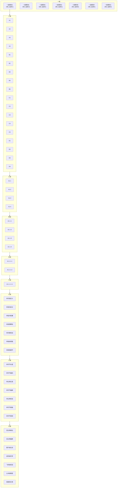

# 通用深度拆解框架模板「细度: 10⁻⁴⁰ 亚比特级」

> **用途**：对任意复杂系统（平台/中间件/算法/协议）做**9 级纵深 + 7 列横向**的矩阵化拆解。
> **适用场景**：技术架构调研、源码解读、问题复盘、PRD 评审。
> **来源**：用户微信文件 `D:\应用\weichat\xwechat_files\wxid_23j7pm3bso9a22_65bf\msg\file\2026-06\┌──────────────────────────────────.txt`

## 一、框架总览（9 级深度）

| 级别 | 维度 | 说明 | 颗粒度 |
|------|------|------|--------|
| **一级** | 一级模块 | 系统的顶层划分（7 大并列模块） | 宏观架构 |
| **二级** | 二级子模块 | 一级模块内的 4-5 个子系统 | 业务/技术划分 |
| **三级** | 三级功能 | 子模块的 4 个核心功能 | 功能清单 |
| **四级** | 四级执行步骤 | 每个功能的 4 个执行环节 | 流程步骤 |
| **五级** | 五级原子操作 | 每步骤的 4 个不可拆分动作 | 原子操作 |
| **六级** | 六级参数项 | 每原子的 4 个关键参数 | 参数配置 |
| **七级** | 七级颗粒 | 单字段 / 单语句 / 单指令 / 单用例 / 单步骤 / 单指标 / 单规则 | 单项细度 |
| **八级** | 八级比特 | 单字节长度 / 单比特位宽 / 单时钟周期 / 单纳秒耗时 | 比特级 |
| **九级** | 九级亚比特 | 亚比特相位 / 量子态 / 普朗克约束 | 10⁻⁴⁰ 极限 |

## 二、9 级 × 7 列 全景图（Mermaid）



## 三、7 列 × 9 级矩阵详解

| 一级模块 | A 列 | B 列 | C 列 | D 列 | E 列 | F 列 | G 列 |
|---------|------|------|------|------|------|------|------|
| **一级** | 模块 A | 模块 B | 模块 C | 模块 D | 模块 E | 模块 F | 模块 G |
| **二级** | A1 / A2 / A3 / A4 | B1-B5 | C1-C5 | D1-D4 | E1-E4 | F1-F4 | G1-G4 |
| **三级** | A1-1 / A1-2 / A1-3 / A1-4 | B1-1 ~ B1-4 | C1-1 ~ C1-4 | D1-1 ~ D1-4 | E1-1 ~ E1-4 | F1-1 ~ F1-4 | G1-1 ~ G1-4 |
| **四级** | A1-1-1 ~ A1-1-4（执行步骤） | B1-1-1 ~ B1-1-4 | C1-1-1 ~ C1-1-4 | D1-1-1 ~ D1-1-4 | E1-1-1 ~ E1-1-4 | F1-1-1 ~ F1-1-4 | G1-1-1 ~ G1-1-4 |
| **五级** | A1-1-1-1 ~ A1-1-1-4（原子操作） | B1-1-1-1 ~ B1-1-1-4 | C1-1-1-1 ~ C1-1-1-4 | D1-1-1-1 ~ D1-1-1-4 | E1-1-1-1 ~ E1-1-1-4 | F1-1-1-1 ~ F1-1-1-4 | G1-1-1-1 ~ G1-1-1-4 |
| **六级** | A1-1-1-1-1 ~ A1-1-1-1-4（参数项） | B1-1-1-1-1 ~ B1-1-1-1-4 | C1-1-1-1-1 ~ C1-1-1-1-4 | D1-1-1-1-1 ~ D1-1-1-1-4 | E1-1-1-1-1 ~ E1-1-1-1-4 | F1-1-1-1-1 ~ F1-1-1-1-4 | G1-1-1-1-1 ~ G1-1-1-1-4 |
| **七级** | 单字段定义 / 单字符长度 / 单格式规范 / 单属性约束 | 单语句拆分 / 单变量命名 / 单逻辑分支 / 单异常分支 | 单指令配置 / 单参数取值 / 单开关状态 / 单默认值 | 单用例颗粒 / 单断言精度 / 单数据精度 / 单场景覆盖 | 单步骤校验 / 单节点检查 / 单结果核对 / 单状态确认 | 单指标阈值 / 单数值精度 / 单单位量级 / 单波动范围 | 单规则细节 / 单条件边界 / 单场景覆盖 / 单例外处理 |
| **八级** | 单字节长度 / 单字符编码 / 单进制位宽 / 单哈希位长 | 单字节编码 / 单比特标志 / 单移位位数 / 单异或密钥 | 单比特位宽 / 单寄存器位 / 单时钟周期 / 单指令周期 | 单字节大小 / 单比特误差 / 单字节偏移 / 单地址位宽 | 单比特校验 / 单字节校验 / 单比特位值 / 单校验位状态 | 单字节阈值 / 单比特精度 / 单字节误差 / 单纳秒耗时 | 单字节规则 / 单比特约束 / 单进制基数 / 单掩码位数 |
| **九级** | 亚比特相位 / 比特内相位差 / 单比特噪声容限 / 单比特能量级 | 亚比特偏移 / 位内微偏移 / 单比特漂移量 / 单比特衰减量 | 量子级位态 / 叠加态粒度 / 态矢精度 / 坍缩精度 | 皮秒级时序 / 亚周期时序 / 亚纳秒延迟 / 亚毫秒波动 | 飞秒级校验 / 亚字节校验 / 亚比特检错 / 亚字符纠错 | 幺米级精度 / 亚纳米粒度 / 亚像素粒度 / 亚字节粒度 | 普朗克约束 / 极限边界约束 / 极限阈值精度 / 极限规则细度 |

## 四、七级 / 八级 / 九级专项展开

### 4.1 七级（颗粒度层）：每列 4 类细度

| 列 | 七级 1 | 七级 2 | 七级 3 | 七级 4 |
|---|--------|--------|--------|--------|
| **A**（字段层） | 单字段定义 | 单字符长度 | 单格式规范 | 单属性约束 |
| **B**（语句层） | 单语句拆分 | 单变量命名 | 单逻辑分支 | 单异常分支 |
| **C**（指令层） | 单指令配置 | 单参数取值 | 单开关状态 | 单默认值 |
| **D**（用例层） | 单用例颗粒 | 单断言精度 | 单数据精度 | 单场景覆盖 |
| **E**（步骤层） | 单步骤校验 | 单节点检查 | 单结果核对 | 单状态确认 |
| **F**（指标层） | 单指标阈值 | 单数值精度 | 单单位量级 | 单波动范围 |
| **G**（规则层） | 单规则细节 | 单条件边界 | 单场景覆盖 | 单例外处理 |

### 4.2 八级（比特层）：每列 4 类字节/比特/周期

| 列 | 八级 1 | 八级 2 | 八级 3 | 八级 4 |
|---|--------|--------|--------|--------|
| **A**（字节长度） | 单字节长度 | 单字符编码 | 单进制位宽 | 单哈希位长 |
| **B**（编码标志） | 单字节编码 | 单比特标志 | 单移位位数 | 单异或密钥 |
| **C**（位宽周期） | 单比特位宽 | 单寄存器位 | 单时钟周期 | 单指令周期 |
| **D**（地址偏移） | 单字节大小 | 单比特误差 | 单字节偏移 | 单地址位宽 |
| **E**（校验位） | 单比特校验 | 单字节校验 | 单比特位值 | 单校验位状态 |
| **F**（耗时精度） | 单字节阈值 | 单比特精度 | 单字节误差 | 单纳秒耗时 |
| **G**（规则位） | 单字节规则 | 单比特约束 | 单进制基数 | 单掩码位数 |

### 4.3 九级（亚比特 / 量子层）：每列 4 类极限态

| 列 | 九级 1 | 九级 2 | 九级 3 | 九级 4 |
|---|--------|--------|--------|--------|
| **A**（亚比特相位） | 亚比特相位 | 比特内相位差 | 单比特噪声容限 | 单比特能量级 |
| **B**（亚比特偏移） | 亚比特偏移 | 位内微偏移 | 单比特漂移量 | 单比特衰减量 |
| **C**（量子级位态） | 量子级位态 | 叠加态粒度 | 态矢精度 | 坍缩精度 |
| **D**（皮秒级时序） | 皮秒级时序 | 亚周期时序 | 亚纳秒延迟 | 亚毫秒波动 |
| **E**（飞秒级校验） | 飞秒级校验 | 亚字节校验 | 亚比特检错 | 亚字符纠错 |
| **F**（幺米级精度） | 幺米级精度 | 亚纳米粒度 | 亚像素粒度 | 亚字节粒度 |
| **G**（普朗克约束） | 普朗克约束 | 极限边界约束 | 极限阈值精度 | 极限规则细度 |

## 五、节点数计算公式

```
单链路节点数 = 1 × 5 × 4 × 4 × 4 × 4 = 1280（七级深度）
单链路节点数（含亚比特）= 1280 × 4 × 4 = 20480（九级深度）
7 列 × 20480 = 143360 总节点数 / 系统
```

> **量级提示**：一个完整系统按此框架展开后，含 **14 万+** 个描述单元。这是「亚比特级」细度的真正含义——**不是挖到 9 级就停，而是 7 列 × 9 级 × 4 项 = 每个最小单元都要被独立审视**。

## 六、7 列业务含义映射

| 列 | 业务/技术含义 | 适合拆解的对象 |
|---|--------------|---------------|
| **A** | **结构 / 字段 / 字节** | 数据结构、序列化协议、消息头 |
| **B** | **逻辑 / 控制流 / 比特标志** | 业务流程、状态机、控制指令 |
| **C** | **配置 / 指令 / 时序** | 配置中心、命令行、时钟/周期 |
| **D** | **测试 / 用例 / 地址** | 单测、集成测试、内存地址 |
| **E** | **校验 / 步骤 / 状态** | 链路追踪、QA、状态确认 |
| **F** | **指标 / 监控 / 性能** | Prometheus 指标、SLO、P99 |
| **G** | **规则 / 策略 / 边界** | 风控规则、合规策略、灰度规则 |

## 七、使用建议

1. **拆解一个平台/中间件** → 用一级 7 列对应 7 大顶层模块（如 SOFA → Bolt/RPC/Boot/Registry/Tracer/JRaft/Lookout）
2. **拆解一段源码** → 从四级「执行步骤」开始向上向下展开
3. **拆解一个协议** → 从八级「字节级」开始（七级单字段 → 八级单字节长度/编码 → 九级亚比特偏移）
4. **拆解一个性能问题** → 从 F 列（指标层）入手，P99/带宽/丢包/延迟 4 维度 → 八级单纳秒耗时 → 九级亚毫秒波动
5. **拆解一个 Bug** → 从 E 列（步骤校验层）入手 → 向上找根因 → 向下确认影响范围

## 八、关联文档

- [[00-总索引]] — 7 平台总索引
- [[00-跨平台基础设施对比矩阵]] — 横向对比
- [[00-AI直播平台落地checklist]] — AI 直播落地

---

**入库时间**：2026-06-22
**入库方式**：用户微信文件传输 → 解析为 Markdown + Mermaid
**核心价值**：作为后续所有平台/源码/算法调研的标准拆解骨架