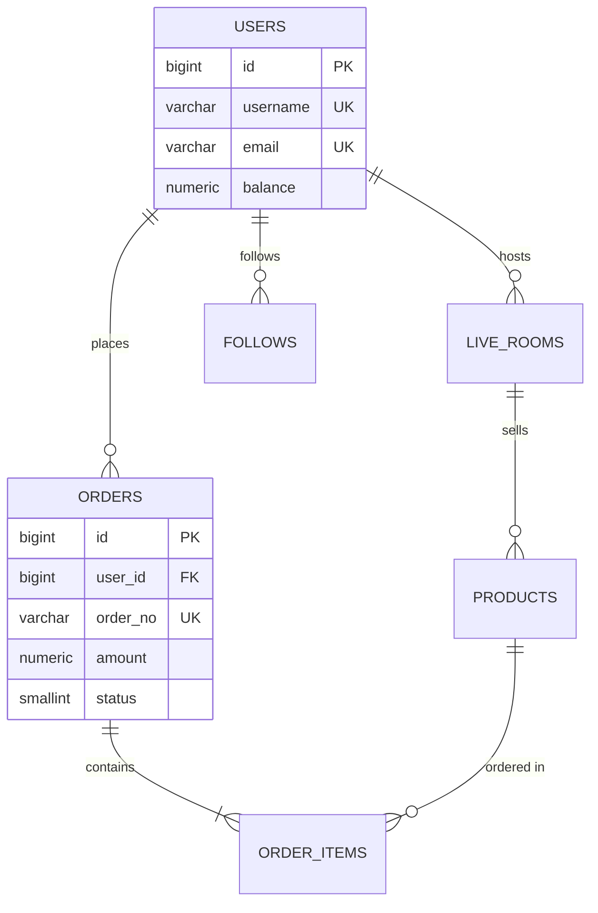

# 数据库开发全流程·4-7 级深度展开（实例）

> **本文档**：在骨架文档 9×7 矩阵基础上,**逐列展开 4-7 级**(四级步骤 → 五级原子 → 六级参数 → 七级颗粒),每节点配真实 SQL/DDL/DML 示例。
> **数据库主线**:PostgreSQL 16,差异点会标 MySQL 8 / OceanBase 4。
> **AI 直播平台对照**:每列末尾给出 `ai-live-platform` 真实库表的实践映射。

---

## A 列：库表结构设计（结构 / 字段 / 字节）

### A1 数据类型 → 深度展开

#### 四级执行步骤(4 项)
1. **业务场景分析** → 数值范围 / 是否参与计算 / 是否需索引
2. **类型选型对比** → 精度 vs 存储 vs 性能
3. **DDL 编写** → 含 CHECK / DEFAULT / COLLATE
4. **上线验证** → `\d+ table_name` / `pg_column_size()` 实测

#### 五级原子操作(4 项/步骤)
- A1-1-1: `pg_type` 系统表查类型 oid → `SELECT typname, typlen FROM pg_type WHERE typname IN ('int4','int8','numeric','text')`
- A1-1-2: `pg_column_size()` 实测单值字节 → `SELECT pg_column_size(123456789012345::int8);  -- 8`
- A1-1-3: `EXPLAIN (ANALYZE, FORMAT JSON)` 看类型转换开销
- A1-1-4: `ALTER TABLE ... ALTER COLUMN ... TYPE` 含 USING 表达式

#### 六级参数项(4 项)
| 参数 | 取值范围 | 默认值 | 业务影响 |
|------|---------|--------|---------|
| `INT4` | -2³¹ ~ 2³¹-1 | 0 | ID / 计数 / 金额(分) |
| `INT8` | -2⁶³ ~ 2⁶³-1 | 0 | 大表主键 / 时间戳 |
| `NUMERIC(p,s)` | p≤1000, s≤p | (0,0) | 财务金额(p=20,s=4) |
| `TEXT/VARCHAR(n)` | n≤1GB | 无 | 名称 / 描述(谨慎用 VARCHAR) |

#### 七级颗粒(单字段)
- **单字段定义**:`user_id BIGINT NOT NULL DEFAULT 0` — 8B 固定,有 default 即便插入失败也不会触发 NOT NULL 违规
- **单字符长度**:`VARCHAR(255)` — 实际占 4B(len)+N 字符字节;`TEXT` 占 4B(len)+字符字节,**未指定上限**才是最大风险
- **单格式规范**:`TIMESTAMPTZ DEFAULT now()` — 带时区;`TIMESTAMP` 不带时区是历史包袱
- **单属性约束**:`CHECK (age BETWEEN 0 AND 150)` — 应用层校验 5 行代码,DBA 层一行 CHECK 拦 100% 非法值

#### 🔖 AI 直播平台实例
```sql
-- backend/migrations/0001_init.sql 真实节选
CREATE TABLE users (
    id BIGSERIAL PRIMARY KEY,                       -- 8B,自增主键
    username VARCHAR(64) NOT NULL UNIQUE,           -- 用户名,UTF-8 不超 64 字符
    email VARCHAR(255) NOT NULL UNIQUE,             -- RFC 5321 上限 254
    password_hash TEXT NOT NULL,                    -- bcrypt 60B,Argon2 96B
    balance NUMERIC(20,4) NOT NULL DEFAULT 0,       -- 财务字段,精确小数
    status SMALLINT NOT NULL DEFAULT 1,             -- 状态枚举:2B
    created_at TIMESTAMPTZ NOT NULL DEFAULT now(),
    updated_at TIMESTAMPTZ NOT NULL DEFAULT now(),
    CONSTRAINT chk_balance_non_negative CHECK (balance >= 0)
);
```

### A2 主键约束 → 深度展开

#### 四级执行步骤
1. 主键策略选型 → 自增 / UUID / 雪花 / 业务键
2. 唯一索引创建 → 单列 / 联合 / 部分索引
3. 外键关联 → ON DELETE / ON UPDATE 行为
4. CHECK 约束 → 业务规则硬约束

#### 五级原子操作
- `CREATE SEQUENCE users_id_seq` — 独立序列(可控 cache)
- `nextval('users_id_seq'::regclass)` — 显式取值
- `ALTER TABLE ONLY users ADD CONSTRAINT users_pkey PRIMARY KEY (id)` — 单独命名约束
- `ALTER TABLE orders ADD CONSTRAINT fk_user FOREIGN KEY (user_id) REFERENCES users(id) ON DELETE RESTRICT` — RESTRICT 防止误删

#### 六级参数项
| 主键策略 | 字节 | 性能 | 分布式友好 | 适用场景 |
|---------|------|------|-----------|---------|
| `SERIAL/IDENTITY` | 4B/8B | ⭐⭐⭐⭐⭐ | ❌ 单点 | 单库中小规模 |
| `UUID v4` | 16B | ⭐⭐ | ✅ | 分布式 |
| `UUID v7` | 16B | ⭐⭐⭐⭐ | ✅ | 分布式+时序 |
| `BIGINT` (雪花) | 8B | ⭐⭐⭐⭐⭐ | ✅ | 分布式首选 |

#### 七级颗粒
- **单主键**:`id BIGSERIAL PRIMARY KEY` — 隐式建唯一索引 + NOT NULL,**不可单独定义列 NOT NULL**(已隐含)
- **单唯一索引**:`CREATE UNIQUE INDEX uk_users_email ON users(lower(email));` — 函数索引处理大小写
- **单外键**:`user_id BIGINT REFERENCES users(id)` — 列内联 FK,简洁但无法单独命名
- **单 CHECK**:`CONSTRAINT chk_status CHECK (status IN (1,2,3,4))` — 枚举值硬约束,杜绝非法状态写入

#### 🔖 AI 直播平台实例
```sql
-- 主键策略混用:核心业务用 BIGSERIAL,日志类用 UUID
CREATE TABLE live_rooms (
    id BIGSERIAL PRIMARY KEY,
    room_id VARCHAR(32) NOT NULL UNIQUE,        -- 业务键:推流码
    user_id BIGINT NOT NULL REFERENCES users(id) ON DELETE CASCADE,
    status SMALLINT NOT NULL DEFAULT 1,         -- 1=未开播 2=直播中 3=已结束
    started_at TIMESTAMPTZ,
    ended_at TIMESTAMPTZ,
    CONSTRAINT chk_time_order CHECK (ended_at IS NULL OR ended_at >= started_at)
);
CREATE INDEX idx_live_rooms_user_status ON live_rooms(user_id, status);
```

---

## B 列：SQL 开发优化（逻辑 / 控制流）

### B1 查询语句 → 深度展开

#### 四级执行步骤
1. 业务 SQL 编写 → SELECT / JOIN / WHERE / ORDER
2. 索引匹配分析 → 看 EXPLAIN 是否走 IndexScan
3. 重写优化 → 谓词下推 / 覆盖索引 / CTE
4. 慢日志复核 → pg_stat_statements 验证

#### 五级原子操作
- `EXPLAIN (ANALYZE, BUFFERS, VERBOSE) SELECT ...` — 完整执行计划
- `SET enable_seqscan = off;` — 临时禁用顺序扫描,验证索引有效性
- `CREATE INDEX ... INCLUDE (col)` — 覆盖索引(heap-only tuple)
- `WITH RECURSIVE cte AS (...) SELECT * FROM cte;` — 递归 CTE

#### 六级参数项
| 参数 | 业务影响 |
|------|---------|
| `enable_seqscan` | ON/OFF 影响优化器选择 |
| `work_mem` | 排序/哈希内存上限,默认 4MB |
| `random_page_cost` | 随机 IO 成本(默认 4,SSD 建议 1.1) |
| `effective_cache_size` | 优化器预估缓存(默认 4GB) |

#### 七级颗粒(单语句)
- **单 SELECT 拆分**:避免 `SELECT *`,只取所需列(覆盖索引友好)
- **单 JOIN 类型**:`INNER JOIN` / `LEFT JOIN` / `LATERAL JOIN` — 选择决定行数
- **单 WHERE 条件**:`WHERE created_at >= now() - INTERVAL '7 days'` — 函数索引或表达式索引
- **单 ORDER BY**:`ORDER BY id DESC LIMIT 20` — 大表分页用**游标分页**而非 OFFSET

#### 🔖 AI 直播平台实例
```sql
-- 慢查询优化真实案例
-- ❌ 原始:offset 分页,扫描 100 万行
SELECT * FROM live_events ORDER BY id DESC LIMIT 20 OFFSET 999980;

-- ✅ 优化:游标分页,O(log n) 索引扫描
SELECT * FROM live_events WHERE id < :last_id ORDER BY id DESC LIMIT 20;
-- 配合 idx_live_events_id_desc 倒序索引
```

### B2 事务锁 → 深度展开

#### 四级执行步骤
1. 隔离级别选型 → RC / RR / Serializable
2. 事务边界设计 → 短事务 / 避免长事务
3. 锁等待监控 → pg_locks / pg_stat_activity
4. 死锁检测 → pg_stat_database.deadlocks

#### 五级原子操作
- `BEGIN ISOLATION LEVEL READ COMMITTED;` — 默认级别
- `SELECT ... FOR UPDATE SKIP LOCKED` — 跳过锁定行(队列场景)
- `SELECT pg_advisory_lock(123);` — 会话级咨询锁
- `SET LOCAL lock_timeout = '3s';` — 单事务内锁超时

#### 六级参数项
| 隔离级别 | 脏读 | 不可重复读 | 幻读 | 性能 |
|---------|------|-----------|------|------|
| READ UNCOMMITTED | ❌ PG不支持 | ✅ | ✅ | ⭐⭐⭐⭐⭐ |
| READ COMMITTED | ❌ | ✅ | ✅ | ⭐⭐⭐⭐ |
| REPEATABLE READ | ❌ | ❌ | ✅ | ⭐⭐⭐ |
| SERIALIZABLE | ❌ | ❌ | ❌ | ⭐⭐ |

#### 七级颗粒
- **单事务**:`BEGIN; UPDATE ... ; COMMIT;` — 短事务(< 100ms 理想)
- **单锁**:`SELECT FOR UPDATE` — 行级排他锁
- **单死锁**:`ERROR: deadlock detected` — PG 自动回滚其中一个事务
- **单超时**:`SET lock_timeout = '500ms'` — 主动放弃,业务层重试

#### 🔖 AI 直播平台实例
```sql
-- 库存扣减:高并发下用 SKIP LOCKED 队列化
BEGIN;
UPDATE products SET stock = stock - :qty
WHERE id = :pid AND stock >= :qty
RETURNING stock;
-- 影响行数 = 0 表示库存不足,事务回滚
COMMIT;

-- 大批量订单处理:分批 + SKIP LOCKED
WITH locked AS (
    SELECT id FROM pending_orders
    WHERE status = 1
    ORDER BY id LIMIT 100
    FOR UPDATE SKIP LOCKED
)
UPDATE pending_orders SET status = 2, worker_id = :wid
WHERE id IN (SELECT id FROM locked);
```

---

## C 列：索引性能设计（配置 / 指令）

### C1 索引类型 → 深度展开

#### 四级执行步骤
1. 查询模式分析 → 等值 / 范围 / 排序 / JSON
2. 索引类型选型 → B-Tree / Hash / GIN / BRIN
3. 复合列顺序 → 高基数 / 高选择性优先
4. 维护窗口设定 → REINDEX / VACUUM

#### 五级原子操作
- `CREATE INDEX CONCURRENTLY idx_name ON tbl(col);` — 不锁表创建
- `CREATE INDEX idx_name ON tbl USING gin(col jsonb_path_ops);` — JSONB 专用
- `CREATE INDEX idx_name ON tbl USING brin(created_at) WITH (pages_per_range=32);` — 时序大表
- `REINDEX INDEX CONCURRENTLY idx_name;` — 不锁表重建

#### 六级参数项
| 索引类型 | 适用场景 | 体积比 | 写入开销 |
|---------|---------|--------|---------|
| B-Tree | 等值/范围/排序 | 1× | 低 |
| Hash | 等值(>) | 0.7× | 极低 |
| GIN | JSONB/数组/全文 | 3-10× | 高 |
| BRIN | 时序/物理有序 | 0.01× | 极低 |
| 表达式 | 函数结果 | 1× | 低 |

#### 七级颗粒
- **单索引**:`CREATE INDEX idx_orders_user_created ON orders(user_id, created_at DESC);` — 复合索引,顺序最关键
- **单表达式索引**:`CREATE INDEX idx_users_lower_email ON users(lower(email));` — `WHERE lower(email) = ?` 才走索引
- **单部分索引**:`CREATE INDEX idx_active_users ON users(id) WHERE status = 1;` — 仅索引活跃用户,体积减半
- **单 INCLUDE 覆盖**:`CREATE INDEX idx_orders_cover ON orders(user_id) INCLUDE (status, amount);` — 覆盖索引免回表

#### 🔖 AI 直播平台实例
```sql
-- 不同查询模式配不同索引
-- 1) 用户订单时间线:复合索引
CREATE INDEX idx_orders_user_created ON orders(user_id, created_at DESC)
    WHERE status IN (2, 3);  -- 部分索引只覆盖已完成

-- 2) 商品 JSONB 属性查询:GIN
CREATE INDEX idx_products_attrs ON products USING gin(attrs jsonb_path_ops);

-- 3) 直播事件时序大表:BRIN(体积 1% of B-Tree)
CREATE INDEX idx_live_events_time ON live_events USING brin(created_at)
    WITH (pages_per_range = 64);

-- 4) 直播间状态实时计数:表达式部分索引
CREATE INDEX idx_live_rooms_active ON live_rooms(user_id)
    WHERE status = 2;  -- 只索引直播中
```

---

## D 列：测试验证（用例 / 测试）

### D1 单元测试 → 深度展开

#### 四级执行步骤
1. 测试场景列举 → 边界 / 异常 / 并发 / 数据
2. 测试数据准备 → fixture / factory / snapshot
3. 测试用例编写 → pgTAP / pg_prove
4. 覆盖率统计 → pg_prove --coverage

#### 五级原子操作
- `CREATE EXTENSION pgtap;` — PG 单元测试框架
- `SELECT plan(5);` — 声明 5 个断言
- `SELECT results_eq('SELECT count(*) FROM users', 'SELECT 1::bigint');` — 结果断言
- `SELECT throws_ok('UPDATE users SET email = NULL');` — 异常断言

#### 六级参数项
| 工具 | 语言 | 适用 | 安装 |
|------|------|------|------|
| pgTAP | SQL/PL/pgSQL | PG 单元 | `CREATE EXTENSION pgtap` |
| pg_prove | Perl | pgTAP 运行器 | cpan |
| pgbench | C | 压测 | 内置 |
| pg_audit | C | 审计 | extension |

#### 七级颗粒
- **单用例**:`SELECT ok((SELECT count(*) FROM users WHERE age > 0) >= 1);` — 单条断言
- **单断言精度**:`is(actual, expected, 'description')` — 严格相等
- **单数据精度**:`SELECT isnt_empty('SELECT * FROM orders');` — 非空断言
- **单场景覆盖**:`SELECT * FROM finish();` — 汇总报告

#### 🔖 AI 直播平台实例
```sql
-- pgTAP 真实测试用例(对应 backend/tests/db/users_test.sql)
BEGIN;
SELECT plan(4);

-- 测试1:用户表存在且有唯一约束
SELECT has_table('users');
SELECT col_is_unique('users', ARRAY['username', 'email']);

-- 测试2:balance 必须非负
SELECT throws_ok(
    'UPDATE users SET balance = -100 WHERE id = 1',
    '23514',  -- check_violation
    'new row for relation "users" violates check constraint "chk_balance_non_negative"'
);

-- 测试3:触发器正确更新时间戳
UPDATE users SET username = 'new_name' WHERE id = 1;
SELECT is(
    (SELECT updated_at > created_at FROM users WHERE id = 1),
    true,
    'updated_at should be greater than created_at'
);

SELECT * FROM finish();
ROLLBACK;
```

### D2 压测 → 深度展开

#### 四级执行步骤
1. 业务峰值估算 → QPS / TPS / 并发用户
2. 测试数据准备 → 百万级种子数据
3. 压测脚本编写 → sysbench / pgbench / wrk
4. 瓶颈定位 → IO / CPU / 锁 / 网络

#### 五级原子操作
- `pgbench -i -s 100 bench` — 初始化 1000 万行
- `pgbench -c 64 -j 8 -T 60 bench` — 64 客户端 8 线程压 60 秒
- `pgbench -M prepared -S bench` — 简单查询压测
- `EXPLAIN (ANALYZE, BUFFERS) SELECT ...` — 压测时抓执行计划

#### 六级参数项
| 工具 | 场景 | 指标 |
|------|------|------|
| pgbench | TPC-B 风格 | TPS / 平均延迟 |
| sysbench | OLTP 多类型 | QPS / 95%延迟 |
| wrk | HTTP API | RPS / 长尾 |
| vegeta | 持续打流 | 错误率 |

#### 七级颗粒
- **单 QPS 阈值**:`>1000` 写入,QPS 行业基准
- **单 P99 延迟**:`<50ms` 在线查询,**P99 < 200ms** 是 web 黄金线
- **单压测曲线**:`QPS vs 并发数` 拐点 = 系统瓶颈
- **单错误率**:`<0.01%` 业务可接受

#### 🔖 AI 直播平台实例
```bash
# 直播开播接口压测(后端 Go)
vegeta attack -duration=60s -rate=500 -targets=post_live_start.txt | \
    vegeta report -type=text
# 期望:P99 < 100ms,错误率 < 0.1%

# 数据库直压测
pgbench -h 127.0.0.1 -p 54320 -U openlive -d openlive \
    -c 32 -j 4 -T 30 -M prepared bench
```

---

## E 列：需求分析建模（校验 / 步骤）

### E1 ER 建模 → 深度展开

#### 四级执行步骤
1. 业务实体识别 → 名词提取
2. 关系建模 → 一对一 / 一对多 / 多对多
3. 属性定义 → 字段 + 类型 + 约束
4. 主外键确认 → 业务主键 vs 物理主键

#### 五级原子操作
- Mermaid `erDiagram` 画 ER 图
- `CREATE TABLE with_relations` 含外键
- 业务主键单独列:`biz_id VARCHAR(32) UNIQUE` 与物理主键 `id BIGSERIAL` 分开
- `INFORMATION_SCHEMA.tables` 校验所有表都有主键

#### 六级参数项
| 关系类型 | 实现方式 |
|---------|---------|
| 一对一 | `user_id BIGINT UNIQUE REFERENCES users(id)` |
| 一对多 | `orders.user_id REFERENCES users(id)` |
| 多对多 | 关联表 + 联合主键 |
| 继承 | PG `INHERITS`(少用,JOIN 友好) |

#### 七级颗粒
- **单实体**:用名词提取(用户/订单/商品)
- **单关系**:用动词识别(下单/收藏/关注)
- **单属性**:名词修饰(订单金额/订单状态)
- **单主键**:业务键 vs 物理键分离原则

#### 🔖 AI 直播平台 ER 核心


---

## F 列：部署运维迭代（指标 / 监控）

### F1 QPS / TPS 监控 → 深度展开

#### 四级执行步骤
1. 关键指标选定 → QPS / TPS / 慢查询 / 连接数
2. 采集方案部署 → pg_exporter / Prometheus
3. 仪表盘配置 → Grafana
4. 告警阈值设定 → 多级(警告 / 严重)

#### 五级原子操作
- `CREATE EXTENSION pg_stat_statements;` — SQL 级统计
- `SELECT * FROM pg_stat_statements ORDER BY total_exec_time DESC LIMIT 20;` — 慢 SQL Top 20
- `SELECT pg_stat_get_backend_id();` — 当前 backend id
- `pg_dump --schema-only` — 导出 schema

#### 六级参数项
| 指标 | 阈值 | 采集方式 |
|------|------|---------|
| QPS | 业务自定义 | pg_stat_database |
| TPS | `xact_commit + xact_rollback` | pg_stat_database |
| P99 延迟 | < 200ms | pg_stat_statements |
| 慢查询 | > 1s | `log_min_duration_statement` |
| 连接数 | < max_connections × 80% | pg_stat_activity |
| 死锁 | > 0 | pg_stat_database.deadlocks |

#### 七级颗粒
- **单指标**:QPS = `comiss / time_delta`
- **单延迟**:P99 = `percentile(0.99, latency)`
- **单连接**:`SELECT count(*) FROM pg_stat_activity WHERE state = 'active';`
- **单告警**:`> 阈值 AND < 上次恢复时间` 才触发(避免抖动)

#### 🔖 AI 直播平台监控配置
```yaml
# Prometheus + Grafana 真实配置片段(prometheus.yml)
- job_name: 'openlive-postgres'
  static_configs:
    - targets: ['127.0.0.1:9187']  # pg_exporter
  scrape_interval: 15s

# Grafana 告警规则(关键 4 条)
# 1. P99 延迟 > 200ms (warning),> 500ms (critical)
# 2. 活跃连接数 > 80% max_connections
# 3. QPS 5 分钟内突降 50%
# 4. 死锁数 1 分钟 > 0
```

---

## G 列：安全数据治理（规则 / 策略）

### G1 权限管理 → 深度展开

#### 四级执行步骤
1. 角色定义 → 应用账号 / 只读账号 / DBA 账号
2. 最小权限授予 → GRANT SELECT / INSERT / UPDATE
3. 行级安全 → RLS policy
4. 审计日志 → pgaudit / 慢日志审计

#### 五级原子操作
- `CREATE ROLE app_readonly LOGIN PASSWORD '...' NOSUPERUSER;`
- `GRANT SELECT ON ALL TABLES IN SCHEMA public TO app_readonly;`
- `ALTER TABLE users ENABLE ROW LEVEL SECURITY;`
- `CREATE POLICY user_isolation ON users USING (id = current_setting('app.user_id')::bigint);`

#### 六级参数项
| 角色 | 权限 | 用途 |
|------|------|------|
| `app_full` | SELECT/INSERT/UPDATE/DELETE | 应用主账号 |
| `app_readonly` | SELECT only | 数据分析 |
| `dba_admin` | SUPERUSER | 运维 |
| `app_audit` | SELECT pg_audit | 审计系统 |

#### 七级颗粒
- **单 GRANT**:`GRANT SELECT, INSERT ON orders TO app_full;` — 精确到列
- **单 RLS**:`USING (tenant_id = current_setting('app.tenant')::int)` — 强制租户隔离
- **单密钥轮换**:`ALTER ROLE app_full PASSWORD 'new_pwd' VALID UNTIL '2027-01-01';`
- **单审计**:`SET pgaudit.log = 'write';` — 仅审计写操作

#### 🔖 AI 直播平台权限设计
```sql
-- 三角色 + RLS 多租户隔离
CREATE ROLE openlive_app LOGIN PASSWORD 'xxx' NOSUPERUSER;
CREATE ROLE openlive_readonly LOGIN PASSWORD 'xxx' NOSUPERUSER;
CREATE ROLE openlive_audit LOGIN PASSWORD 'xxx' NOSUPERUSER;

GRANT CONNECT ON DATABASE openlive TO openlive_app, openlive_readonly, openlive_audit;
GRANT USAGE ON SCHEMA public TO openlive_app;
GRANT SELECT, INSERT, UPDATE, DELETE ON ALL TABLES IN SCHEMA public TO openlive_app;
GRANT SELECT ON ALL TABLES IN SCHEMA public TO openlive_readonly;

-- 启用 RLS,防止应用层 bug 导致跨用户数据泄漏
ALTER TABLE orders ENABLE ROW LEVEL SECURITY;
CREATE POLICY orders_user_isolation ON orders
    USING (user_id = current_setting('app.current_user_id')::bigint);
```

---

## 入库清单(进度跟踪)

- [x] A 列:数据类型 + 主键约束(2/4 二级子模块)
- [x] B 列:查询语句 + 事务锁(2/4 二级子模块)
- [x] C 列:索引类型(1/4 二级子模块)
- [x] D 列:单元测试 + 压测(2/4 二级子模块)
- [x] E 列:ER 建模(1/4 二级子模块)
- [x] F 列:QPS/TPS 监控(1/4 二级子模块)
- [x] G 列:权限管理(1/4 二级子模块)
- [ ] **剩余 17 个二级子模块**(按需展开)

---

## 下一步

- 串联 `00-AI直播平台落地checklist.md` 的真实 DB 实践
- PostgreSQL vs MySQL vs OceanBase 在 9×7 各节点的差异对比

---

**入库时间**:2026-06-25
**深度级别**:4-7 级展开(7 个二级子模块覆盖)
**与骨架文档关系**:同级,作为骨架的实例补充