# OpenLive Phase 2 算力管线 + 防封 九级七列骨架

> **铁律出处**："每一步必须先输出 9 级 × 7 列骨架，再写代码。"
> **范围**：LLM 流式 / TTS 并发 / PTS 对齐 / 动态降级 / RTMP 垫片流 / 视听指纹 / 拟人化。
> **绑定路径**：`G:\ai-live-platform\openlive-microkernel\media\` + `ai\` + `daemon\`

---

## 一、9×7 全景矩阵

```mermaid
graph TB
    subgraph A["A 结构"]
        A1[A1 PTS 时钟源] --> A2[A2 SHM 多路复用 PSM 环] --> A3[A3 RTMP 推流管道]
    end
    subgraph B["B 逻辑"]
        B1[B1 LLM SSE] --> B2[B2 TTS 并发] --> B3[B3 PTS 对齐] --> B4[B4 降级状态机]
    end
    subgraph C["C 配置"]
        C1[C1 采样/位深] --> C2[C2 降级阈值]
    end
    subgraph D["D 用例"]
        D1[D1 单测/抖率] --> D2[D2 模拟弹幕]
    end
    subgraph E["E 校验"]
        E1[E1 音画同步] --> E2[E2 降级触发]
    end
    subgraph F["F 指标"]
        F1[F1 首字延迟] --> F2[F2 fps] --> F3[F3 重连耗时]
    end
    subgraph G["G 规则"]
        G1[G1 标点截断] --> G2[G2 绿黄红阈值] --> G3[G3 退避策略] --> G4[G4 指纹扰动]
    end
```

| 级别 | A 结构 | B 逻辑 | C 配置 | D 用例 | E 校验 | F 指标 | G 规则 |
|------|--------|--------|--------|--------|--------|--------|--------|
| 一级模块 | PTS 源+PSM 环+RTMP 管道 | LLM/TTS/PTS/降级 | 采样/阈值 | 单测 | 同步/降级 | 时延/fps/重连 | 截断/状态/退避/伪装 |
| 二级子模块 | 3 子模块 | 4 阶段管线 | 2 类配置 | 2 测试套 | 2 类校验 | 3 大指标 | 4 类规则 |
| 三级功能 | 钟/环/编码器 | SSE/截断/合成/落版 | 16kHz/s16le | 抖动 50ms | PTS=audio | ≤1s / ≥25/15 | ".?!。？！" |
| 四级步骤 | clock_gettime / write_packet / avcodec | parse-sse / 8B-label / 4-并发 / mix | set_codec_params | inject_danmaku | align_pts | sli-window | fallback-table |
| 五级原子 | QueryPerformanceCounter / LockFree Push / av_frame_alloc | utf8_split / aplay / spk_id | sample_rate/bitrate | mock_danmaku_loop | monotonic_test | histogram | backoff_ms_set |
| 六级参数 | 16kHz / 64B hdr / 30fps | sse_buffer / tts_engine / concurrency=4 | zone_thresholds.json | 100 cases | ±1 frame | rt_99 | max_backoff_s=8 |
| 七级颗粒 | clock_id=QPC / CACHE_LINE=64 | function `tts_push_packet()` | HZ=16000 | "danmaku_burst_100" | "drift=0" | "p99<=1000ms" | "1-2-4-8s" |
| 八级比特 | QPC tick = 100ns / u64 | u32 frame_ts / u16 len | u16 sample | u8 count | i32 drift_ms | f64 rt_ms | u8 stage_idx |
| 九级亚比特 | QPC 多核 skew → BindThreadToCPU | SSE chunk 边界 CPython GIL 释放 | 驱动延迟抖动 ≈ 1ms@48k | 1 弹幕节拍 = 1 帧 | audio 主导 clock | 卡方检验显著 | 节拍 15-30s SendInput |

---

## 二、九级深度详表

### A 列「结构」—— PTS 源 / PSM 环 / RTMP 管道

| 级别 | 内容 |
|------|------|
| **一级** | 三组件拓扑 |
| **二级** | A1 PTS 单调时钟；A2 SHM 多路复用 PSM 环（Per-Slot Multiplexing）；A3 RTMP 推流管道 |
| **三级** | A1.1 QPC 单调；A2.1 slot_type=0x07 音频 / 0x09 控制 / 0x10 字幕；A3.1 H.264/AAC + RTMP |
| **四级** | QueryPerformanceCounter → u64 us → ShmHeader.pts_us；producer.Write(ts, payload)；av_frame_alloc → avcodec_send_frame → RTMP publish audio/video packet |
| **五级** | Windows `QueryPerformanceCounter` / `LockFree Write` / `avcodec_encode_video2` / `RTMP_SendPacket` |
| **六级** | PTS 精度=100ns / SHM 总量=1MB / 推流缓冲=4MB |
| **七级** | 函数：`now_us()` / `push_audio(uint8* pcm, size_t, pts)` / `send_chunk(frame)` |
| **八级** | u64 PTS / u32 slot_type / u16 len / u8[] payload |
| **九级** | QPC 多核 skew（BindThreadToCPU 防 100us 漂移）；虚拟内存页 fault 时延 = 1μs 量级 |

### B 列「逻辑」—— LLM/TTS/PTS/降级

| 级别 | 内容 |
|------|------|
| **一级** | 4 阶段流水线 |
| **二级** | B1 LLM SSE 拉取；B2 标点截断；B3 TTS 并发合成；B4 PTS 对齐写入 SHM |
| **三级** | B1.1 sse-client-py 逐 chunk；B2.1 标点切句（中英混排）；B3.1 ONNX Runtime Edge-TTS；B4.1 audio-clock 主导 |
| **四级** | SSE chunk → buffer → 命中 `[".,!?;:。！？；："]` → Cut → enqueue(tts_id) → pool(4) → wait(首句) → push slot 0x07 |
| **五级** | `sseclient.EventSource` / `regex.findall` / `concurrent.futures.ThreadPoolExecutor` / `edge_tts.Communicate` |
| **六级** | sse_buffer_cap=8KB / cutoff_pattern / tts_pool_workers=4 / voice=zh-CN-XiaoxiaoNeural |
| **七级** | 函数：`cut_sentences()` / `synth_async()` / `pts_align_push()` |
| **八级** | u32 chunk_seq / u8 type / u16 sample_bits |
| **九级** | GIL 释放边界：ONNX forward 不持锁；CPython 字节码帧 = 1ms 抖动在测试中允许 |

### C 列「配置」—— 采样·阈值

| 级别 | 内容 |
|------|------|
| **一级** | 运行时可调参数 |
| **二级** | C1 音频编/采样；C2 降级阈值 |
| **三级** | C1.1 48k→16kHz 降采样；C1.2 AAC-LC 编码；C2.1 绿>25fps/黄15-25/红<15 |
| **四级** | set_codec_ctx(AVCodecContext, 16000, AV_SAMPLE_FMT_S16, 2) → load config/zones.json |
| **五级** | libswresample / zones.json 解码 / `LoadLibrary` |
| **六级** | sample_rate=16000 / bitrate=64kbps / green_min=25 / yellow_min=15 |
| **七级** | JSON key `"zones": {"green":25,"yellow":15}` |
| **八级** | u16 Hz / u32 bitrate / u8 zone |
| **九级** | 配置变更签名校验（防伪配置注入） |

### D 列「用例」—— 测试·仿真

| 级别 | 内容 |
|------|------|
| **一级** | 单测 + 抖动模拟 |
| **二级** | D1 单测函数；D2 模拟弹幕 |
| **三级** | D1.1 `cut_sentences_unit` / `align_pts_unit`；D2.1 100 条/秒爆发流 |
| **四级** | arrange→act→assert；Playwright-E2E 备选 |
| **五级** | pytest fixture / asyncio.gather |
| **六级** | concurrency=100 / interval=10ms |
| **七级** | 用例名：`burst_danmaku_100_in_1s` |
| **八级** | u16 danmu_count |
| **九级** | 单帧渲染 + 异步 IO 双堆栈对抖动的敏感度测试 |

### E 列「校验」—— 同步与降级

| 级别 | 内容 |
|------|------|
| **一级** | 2 类校验 |
| **二级** | E1 音画同步断言；E2 降级触发 |
| **三级** | E1.1 audio-clock 主导，`|video_pts - audio_pts| ≤ 1 frame`；E2.1 fps < 25 → 黄 / < 15 → 红 |
| **四级** | monotonic_test(pts_list) → 全部递增；trigger_zone(fps) → status enum |
| **五级** | `assert all(pts[i] < pts[i+1])` / `cross_threshold()` |
| **六级** | drift_threshold_ms=20 / fps_window_ms=10000 |
| **七级** | 函数：`assert_drift(pts)` / `tick_degrade(fps_now)` |
| **八级** | i64 drift_us / u8 zone |
| **九级** | 漂移 1 样本/帧 = 1ms；CPython 时间 syscall 误差测试 |

### F 列「指标」—— SLO

| 级别 | 内容 |
|------|------|
| **一级** | 3 大核心指标 |
| **二级** | F1 首字延迟；F2 帧率；F3 重连耗时 |
| **三级** | F1.1 < 1s p90；F2.1 30fps 目标；F3.1 退避 1/2/4/8s |
| **四级** | histogram percentile / fps mean / reconnection_rtt |
| **五级** | `numpy.percentile` / sliding window / `RTMP_SendPacket` round-trip |
| **六级** | p90/p99 / 10s window / RTT 阈值 |
| **七级** | 指标命名：`first_audio_p90_ms`、`fps_mean`、`rtmp_reconnect_ms` |
| **八级** | u32 ms |
| **九级** | 卡方检验抖动分布；RTMP 协议层 ping/pong 周期 = 5s |

### G 列「规则」—— 伪装·安全·退避

| 级别 | 内容 |
|------|------|
| **一级** | 4 类硬规则 |
| **二级** | G1 截断标点；G2 降级阈值；G3 退避表；G4 指纹扰动 |
| **三级** | G1.1 中英 6 标点；G2.1 三档；G3.1 1/2/4/8s；G4.1 1px 像素抖动 + -40dB 白噪 |
| **四级** | truncate_at_any(buf, ".,!?;:。！？；：")；； 阈值映射表； 退避 stage++; 像素随机位移 |
| **五级** | regex match / if/else / `SendInput(MOUSEEVENTF_MOVE, 1, 0)` |
| **六级** | rule_set / zones.json / backoff_max_s=8 / noise_db=-40 |
| **七级** | 规则函数：`should_truncate()` / `next_backoff()` / `add_jitter_pixel()` |
| **八级** | u8 rule_id / u8 stage / u8 dx_dy |
| **九级** | SendInput 节拍 15-30s 随机化；像素扰动 Δ ≤ 1px；噪声 DC 偏置 = 0 |

---

## 三、行间交叉规则

| 关联 | 触发 | 强制 |
|------|------|------|
| A PTS ↔ B 截断 | 标点截断位置 → PTS 锚 | 每个分句独立 PTS，下游按 PTS 排序 |
| B TTS ↔ C 采样 | ONNX 输出 24kHz → re-sample 16kHz | re-sample 在 SHM 写入前完成 |
| C 阈值 ↔ E 降级 | fps < 25 即降级 | 状态机原子写（防止抖动穿越） |
| D 抖动 ↔ E 同步 | burst 100 条弹幕 | 单测必须压力覆盖 |
| F 帧率 ↔ G 阈值 | fps 跨阈值 | 状态机进入下一态必须有 5s 滞后（防抖） |
| G 退避 ↔ A RTMP | 断流 1s | 预录 30s 垫片流接管 |
| G 伪装 ↔ A 编码 | 推流前帧注入扰动 | FFmpeg filtergraph 中插入 |

---

## 四、目标代码增量（预估净行数）

| 模块 | 文件数 | 净行数 | 覆盖率目标 |
|------|-------|--------|----------|
| `media/src/pts/Clock.{h,cpp}` | 2 | 400 | ≥ 90% |
| `media/src/codec/AudioEncoder.{h,cpp}` | 2 | 850 | ≥ 85% |
| `media/src/codec/VideoCompositor.{h,cpp}` | 2 | 1200 | ≥ 85% |
| `media/src/push/RtmpPublisher.{h,cpp}` | 2 | 700 | ≥ 85% |
| `media/src/resilience/FailoverController.{h,cpp}` | 2 | 600 | ≥ 90% |
| `media/src/fingerprint/PixelJitter.{h,cpp}` | 1 | 250 | n/a |
| `media/src/fingerprint/AudioWhisper.{h,cpp}` | 1 | 300 | n/a |
| `media/src/degrade/ZonePolicy.{h,cpp}` | 2 | 500 | ≥ 95% |
| `ai/llm/sse_client.py` | 1 | 350 | ≥ 80% |
| `ai/llm/sentence_cutter.py` | 1 | 250 | ≥ 95% |
| `ai/tts/edge_tts_engine.py` | 1 | 450 | ≥ 85% |
| `ai/pts/pts_align.py` | 1 | 400 | ≥ 95% |
| `daemon/src/degrade/ZoneController.{h,cpp}` | 2 | 600 | ≥ 95% |
| `daemon/src/degrade/HumanSimulator.{h,cpp}` | 1 | 250 | n/a |
| `tests/test_pts.cpp` / `test_zone.cpp` / `test_sentence.py` / `test_align.py` | 4 | 1500 | — |
| `tests/chaos/chaos_llm_timeout.py` / `chaos_rtmp_black.py` | 2 | 350 | — |
| **合计** | **~27** | **~9,000** | — |

---

## 五、Phase 1 → Phase 2 演进路径（不变性约束）

1. **不变性 A**：新增 `pts_align` / `ZonePolicy` 必须走 SHM，不许新增 Socket 或 JSON RPC。
2. **不变性 B**：AI 进程绝不允许直接调用 avcodec；只能通过 SHM 写音频包。
3. **不变性 C**：PTS 来源唯一（media 进程 `QueryPerformanceCounter`），不允许 AI 进程自造时钟。
4. **不变性 D**：降级状态机跨阈值必须有 5s 滞后，原值写入 Merkle 账本防止状态穿越。
5. **不变性 E**：所有推流相关代码必须经过 VMP DLL 暴露的 `EncodePushFrame()` 接口。
