# OpenLive Phase 3 端侧生态 九级七列骨架

> **铁律出处**："每一步必须先输出 9 级 × 7 列骨架，再写代码。"
> **范围**：低代码后台 / 蓝图编排引擎 / 多媒体素材编辑器 / 硬件驱动 / 兼容层 / 测试基础设施 / 可观测性。
> **绑定路径**：`G:\ai-live-platform\openlive-microkernel\ui-tools\`（新增顶层目录）
> **目标净代码增量**：~630K 行（百万行预算的 63%）

---

## 一、Phase 3 七大模块（与七列对应）

| 模块 | 列归属 | 行数预算 | 子模块数 |
|------|--------|---------|---------|
| 低代码后台管理系统 | A1 | 80K | 5（动态表单 / 工作流 / BI / 权限 / 设置） |
| 端侧蓝图编排引擎 | A2 | 200K | 4（节点库 / DAG 解析 / 表达式沙箱 / 画布交互） |
| 多媒体素材编辑器 | A3 | 200K | 5（时间轴 / 轨道混合 / 滤镜 / 字幕 / 编解码） |
| 硬件驱动层 | A4 | 80K | 3（虚拟摄像头 / 虚拟声卡 / 屏幕捕获） |
| 全平台兼容层 | A5 | 70K | 3（Win7 / Win10 / Win11 + DX9/11/12） |
| 测试与混沌基础设施 | A6 | 60K | 4（UT 框架 / E2E / Chaos C++ / 覆盖率门禁） |
| 可观测性与崩溃分析 | A7 | 40K | 3（结构化日志 / MiniDump / 监控面板） |

**合计预算**：~730K 行（超百万目标 73%）

---

## 二、9×7 全景矩阵

```mermaid
graph TB
    subgraph A["A 结构 · 7 大端侧生态模块"]
        A1[A1 低代码后台<br/>5 子模块 / 80K] --> A2[A2 蓝图引擎<br/>4 子模块 / 200K]
        A2 --> A3[A3 多媒体编辑器<br/>5 子模块 / 200K]
        A3 --> A4[A4 硬件驱动<br/>3 子模块 / 80K]
        A4 --> A5[A5 兼容层<br/>3 子模块 / 70K]
        A5 --> A6[A6 测试基础设施<br/>4 子模块 / 60K]
        A6 --> A7[A7 可观测性<br/>3 子模块 / 40K]
    end
    subgraph B["B 逻辑 · 控制流与状态机"]
        B1[B1 表单渲染控制流] --> B2[B2 BPMN 工作流状态机]
        B3[B3 DAG 拓扑与执行] --> B4[B4 时间轴播放头推进]
        B5[B5 驱动枚举/注册] --> B6[B6 兼容性 fallback 决策树]
        B7[B7 测试夹具生命周期] --> B8[B8 异常捕获与 dump]
    end
    subgraph C["C 配置 · 编译与运行时参数"]
        C1[C1 JSON Schema 驱动] --> C2[C2 节点注册表]
        C3[C3 滤镜参数 LUT] --> C4[C4 驱动 INF/GUID]
        C5[C5 渲染后端选择] --> C6[C6 测试 fixture 路径]
        C7[C7 日志级别采样率]
    end
    subgraph D["D 用例 · 测试与混沌"]
        D1[D1 表单 DTO/Schema] --> D2[D2 BPMN 状态机]
        D3[D3 DAG 执行路径] --> D4[D4 时间轴帧精度]
        D5[D5 驱动 hot-plug] --> D6[D6 DX9→12 矩阵]
        D7[D7 C++ Chaos 注入] --> D8[D8 日志注入]
    end
    subgraph E["E 校验 · 运行时断言"]
        E1[E1 Pydantic 强校验] --> E2[E2 会签/或签防悬挂]
        E3[E3 DAG 环检测] --> E4[E4 帧对齐断言]
        E5[E5 句柄泄漏检测] --> E6[E6 渲染回退断言]
        E7[E7 覆盖率门禁] --> E8[E8 dump 完整性]
    end
    subgraph F["F 指标 · SLO"]
        F1[F1 表单渲染 p99] --> F2[F2 审批节点时延]
        F3[F3 DAG 节点吞吐] --> F4[F4 视频导出 fps]
        F5[F5 设备发现耗时] --> F6[F6 兼容切换次数]
        F7[F7 UT 覆盖率] --> F8[F8 dump 生成率]
    end
    subgraph G["G 规则 · 硬策略"]
        G1[G1 SQL 注入拦截] --> G2[G2 审批一致性]
        G3[G3 DAG 沙箱禁 os.system] --> G4[G4 时间轴单调]
        G5[G5 驱动签名验证] --> G6[G6 降级优先级]
        G7[G7 SonarQube 圈复杂度<15] --> G8[G8 日志脱敏]
    end
```



---

## 三、九级 × 七列 全量映射

| 级别 | A 结构 | B 逻辑 | C 配置 | D 用例 | E 校验 | F 指标 | G 规则 |
|------|--------|--------|--------|--------|--------|--------|--------|
| **一级模块** | 7 大端侧生态 | 8 状态机/控制流 | 7 配置族 | 8 测试套 | 8 校验路径 | 8 SLO | 8 硬策略 |
| **二级子模块** | 27 子模块 | Init→Render→Submit→Persist→Recover | JSON/Registry/LUT/INF/Backend/Fixture/LogLevel | Schema/State/DAG/Frame/Plug/Matrix/Chaos/Inject | Pydantic/Quorum/Cycle/Align/Leak/Fallback/Cov/Dump | p99/latency/tps/fps/discovery/switches/cov/dump_rate | SQLi/Quorum/Sandbox/Mono/Sig/Prio/Cmplx/Mask |
| **三级功能** | UI 组件树 / DAG 节点 / 时间轴 / 设备树 / DX 层 / 测试栈 / 日志通道 | 表单控件→字段→提交 / 审批分支→网关→会签 / 拓扑序→执行器 / 帧→tick→合成 / 枚举→打开→IOCTL / 探测→适配 / SetUp→TearDown / panic→dump→加密 | {"type":"string"} / NodeDef / filter_preset / device_guid / backend=auto / fixture_dir / level=info | 100 控件 / 5 网关 / 200 节点 / 30fps / hotplug / 4 DX / 50 chaos / 注入器 | 类型/范围/必填 / 票数=人数 / 无环 / ±1 帧 / 句柄归零 / 1 路径 / >80% / SHA-256 匹配 | <100ms / <2s / >10K/s / 30fps / <500ms / 0 / ≥80% / 100% | ORM 注入 / 票数≥2 / exec() 禁 / 严递增 / EV_CERT / HIGH 优先 / <15 / PII 替换 |
| **四级步骤** | 注册→解析→布局→渲染→事件 | parse→validate→state→render→submit | load→merge→validate→inject | arrange→act→assert→teardown | type-check / count / topo-sort / diff / ref-count / pointer / cov scan / hash | percentile / duration / qps / mean / search / counter / lcov / counter | regex / quorum / deny / monotonic / WinVerifyTrust / priority / linter / regex |
| **五级原子** | JSON.parse / networkx / av_frame_alloc / SetupDiGetClassDevs / D3D12CreateDevice / gtest / spdlog | react render / state.set / topo_sort / clock.tick / CreateFile / CreateDXGIFactory / ASSERT / panic_handler | yaml.safe_load / json.loads / LoadLibrary / INF parse / DXGI 探测 / fixture mount | pytest / gtest / chaos.CPU / logger.bind | isinstance / len / nx.is_directed_acyclic_graph / abs diff / CloseHandle / compare / gcov / sha256 | time.perf_counter / counter / throughput / fps counter / search / atomic / coverage.py / hashlib | sql parse / Counter / AST 遍历 / monotonic / BCryptVerify / SetPriorityClass / radon / re.sub |
| **六级参数** | schema_path / node_lib_path / track_count / device_class / dx_version / fixture_dir / log_level | react_keys / quorum_n / max_depth / fps / poll_ms / backend / gtest_filter / panic_dump_path | max_field_len=64 / max_nodes=2000 / max_tracks=8 / poll_period_ms=100 / dx_probe_timeout=200 / gcov_threshold=80 / dump_encrypt_key | concurrency=100 / voters=3 / fanout=10 / frame_window=10s / hotplug_count=5 / dx_modes=4 / chaos_threads=8 / log_volume_mb=100 | type_hint / threshold=2 / cycle_check / drift_threshold_ms=20 / leak_check_ms=1000 / fallback_chain / coverage_threshold / dump_size_max=50MB | p99_ms=100 / sla_ms=2000 / qps=10000 / fps_target=30 / discovery_ms=500 / switch_max=0 / cov_pct=80 / dump_rate=1.0 | injection_regex / quorum_size / sandbox_apis / monotonic_window / cert_chain_depth / prio_class / cc_max / pii_pattern |
| **七级颗粒** | `field_def` / `Node{type,props}` / `Track{layer,clips}` / `DeviceDesc` / `Backend` / `Fixture` / `Logger` | `submit()` / `transition()` / `execute_node()` / `play_head_step()` / `open_device()` / `try_fallback()` / `TEST_F` / `panic_to_dump()` | `key="type"` / `key="node_id"` / `key="preset_id"` / `key="device_path"` / `key="dx_version"` / `key="fixture"` / `key="level"` | `"required_field_missing"` / `"voter_consistency"` / `"dag_cycle"` / `"frame_drift"` / `"device_gone"` / `"dx_create_failed"` / `"chaos_cpu_100"` / `"log_pii_redacted"` | `assert_valid(schema)` / `assert_quorum()` / `assert_acyclic()` / `assert_drift≤20ms` / `assert_handle_zero()` / `assert_backend_ok()` / `assert_coverage≥80%` / `assert_dump_decryptable()` | `"form_render_p99_ms"` / `"approval_step_latency_ms"` / `"dag_throughput"` / `"export_fps"` / `"device_discovery_ms"` / `"compat_switch_count"` / `"ut_coverage"` / `"dump_generation_rate"` | `"orm_interceptor_blocks"` / `"quorum_reached"` / `"sandbox_exec_denied"` / `"playhead_monotonic"` / `"driver_signature_verified"` / `"high_priority_first"` / `"cc<15"` / `"pii_replaced"` |
| **八级比特** | u16 field_id / u32 node_id / u8 track_id / u64 device_handle / u32 dx_ver / u8 fixture_id / u8 log_level | u8 state_enum / u32 vote_count / u16 topo_depth / u32 frame_no / u16 device_idx / u8 backend_id / u32 test_id / u32 dump_id | u16 max_field_len / u32 max_nodes / u8 max_tracks / u32 poll_ms / u16 dx_timeout / u8 cov_pct / u32 dump_size | u8 concurrency / u8 voters / u16 fanout / u32 frame_window / u8 hotplug / u8 dx_modes / u8 chaos_threads / u16 log_vol_mb | u8 type_id / u16 threshold / u8 cycle_found / i32 drift_us / u64 handle / u8 backend / u8 cov_pct / u32 sha_len | u32 ms / u32 ms / u64 qps / f32 fps / u32 ms / u8 count / u8 pct / f32 rate | u16 rule_id / u8 quorum_n / u8 deny_flags / u8 monotonic / u16 cert_depth / u8 prio_class / u8 cc_max / u16 pii_pat_id |
| **九级亚比特** | JSON 解析字节序 / DAG 节点缓存行 64B / YUV420 planar 字节序 / DXGI 多适配器原子 / DX 版本协商 / gtest SetUp TearDown 序 / 日志 channel 多路复用 | React fiber 双缓冲 / state 写入 release-acquire / DAG 拓扑序插入 / 帧 PTS 单调 / 设备 IOCTL IRP 取消 / DXGI factory 缓存 / gtest fixture 析构链 / dump 写盘原子页 | YAML UTF-8 BOM / 节点 ID 哈希碰撞 / 滤镜参数 FP 精度 / 设备 GUID 字节序 / DX 协商 ABI / fixture 跨平台路径 / 日志采样随机性 | 1 弹幕 = 1 帧 / 并发窗口原子写 / DAG 拓扑稳态 / 帧插值亚像素 / 设备热拔中断 / DX 设备丢失恢复 / 混沌注入细粒度 / 日志时钟回拨 | Pydantic 类型缓存 / 票数写入原子 / 环检测 DFS / 单调时钟绑定 CPU / 句柄 RAII / DXGI 多线程 / cov 文件 mmap / dump 加密页校验 | percentile 插值 / deadline 抢占 / DAG 节点 CPU cache / 帧率滑窗 / 设备发现 cache / DX 协商 cache / cov 增量 / dump 加密 AES-GCM | SQL 注入位运算 / quorum 网络分区 / sandbox seccomp-like / monotonic pdiff / 驱动签名链 / 优先级 OS API / SonarQube 启发式 / PII 正则锚 |

---

## 四、A 列「结构」—— 7 大端侧生态模块详表

### A1 低代码后台管理系统（~80K 行）

| 子模块 | 文件路径（计划） | 行数 | 关键 API |
|--------|------------------|------|---------|
| 动态表单生成器 | `ui-tools/lowcode/form/SchemaRenderer.{ts,tsx}` | ~15K | `renderField(schema) / validate(form) / submit()` |
| 工作流审批引擎 | `ui-tools/lowcode/workflow/StateMachine.{ts}` | ~25K | `transition(state, event) / quorum(votes) / rollback()` |
| BI 数据大屏 | `ui-tools/lowcode/bi/Dashboard.{tsx}` + `Chart.tsx` | ~10K | `GridItem / DataSource / DragDrop` |
| RBAC 权限 | `ui-tools/lowcode/authz/Permission.{ts}` | ~15K | `allow(user, resource, action) / abacEval()` |
| 系统设置 | `ui-tools/lowcode/settings/ConfigCenter.{ts}` | ~15K | `get(key) / set(key, value) / hotReload()` |

### A2 蓝图编排引擎（~200K 行）

| 子模块 | 文件路径（计划） | 行数 | 关键 API |
|--------|------------------|------|---------|
| 节点库注册表 | `ui-tools/blueprint/nodes/NodeRegistry.{ts}` | ~40K | `register(type, def) / instantiate(type, props)` |
| DAG 拓扑解析 | `ui-tools/blueprint/dag/Graph.{ts}` + `Executor.{ts}` | ~60K | `parse(json) / topoSort() / execute(graph)` |
| 表达式沙箱 | `ui-tools/blueprint/sandbox/ExprRunner.{ts}` | ~30K | `eval(expr, ctx) / deny(os)` |
| 画布交互 | `ui-tools/blueprint/canvas/Canvas.{tsx}` + `DragDrop.tsx` | ~70K | `onNodeDrag / onEdgeConnect / zoom / pan` |

### A3 多媒体素材编辑器（~200K 行）

| 子模块 | 文件路径（计划） | 行数 | 关键 API |
|--------|------------------|------|---------|
| 时间轴 | `ui-tools/multimedia/timeline/Timeline.{ts,tsx}` | ~50K | `playhead / tracks / clips / zoom` |
| 轨道混合 | `ui-tools/multimedia/mixer/Mixer.{ts}` | ~40K | `composite(layers) / alpha / blend_mode` |
| 滤镜 | `ui-tools/multimedia/filter/FilterChain.{ts}` + WebGL shader | ~40K | `apply(frame, filter) / chain / lfo` |
| 字幕 | `ui-tools/multimedia/subtitle/SubtitleTrack.{ts}` | ~25K | `srt / ass / render(text, style)` |
| 编解码 | `ui-tools/multimedia/codec/{VideoEncoder,AudioEncoder}.{ts}` + WASM | ~45K | `encode(frame) / decode(packet) / mux(container)` |

### A4 硬件驱动层（~80K 行）

| 子模块 | 文件路径（计划） | 行数 | 关键 API |
|--------|------------------|------|---------|
| 虚拟摄像头 | `drivers/virtual_camera/{VCam.inf, VCam.cpp, VCam.sys}` | ~35K | `IF_VIDEO_DEVICE / StartCapture / GetFrame` |
| 虚拟声卡 | `drivers/virtual_audio/{VAC.inf, VAC.cpp, VAC.sys}` | ~30K | `IMiniportWaveRT / SetFormat / RenderBuffer` |
| 屏幕捕获 | `drivers/screen_capture/{DxgiCapture.cpp, GdiCapture.cpp}` | ~15K | `CaptureFrame(rect) / enumMonitors` |

### A5 全平台兼容层（~70K 行）

| 子模块 | 文件路径（计划） | 行数 | 关键 API |
|--------|------------------|------|---------|
| Win7 API 兼容 | `compat/win7/{PathFinder.cpp, Registry.cpp}` | ~25K | `GetVersionEx / shlwapi` |
| Win10/11 兼容 | `compat/win10_11/{WinRTBridge.cpp, UWP.cpp}` | ~25K | `RoGetActivationFactory / IInspectable` |
| DX9/11/12 渲染 | `compat/dx/{D3D9.cpp, D3D11.cpp, D3D12.cpp}` | ~20K | `CreateDevice / CreateSwapChain` |

### A6 测试与混沌基础设施（~60K 行）

| 子模块 | 文件路径（计划） | 行数 | 关键 API |
|--------|------------------|------|---------|
| C++ UT 框架 | `tests/framework/{Fixture.h, Mock.h, Chaos.h}` | ~20K | `TEST_F / MOCK_METHOD / CHAOS_INJECT` |
| E2E Playwright | `tests/e2e/{login.spec.ts, livestream.spec.ts}` | ~15K | `page.goto / expect / apiCall` |
| 混沌 C++ 注入 | `tests/chaos_cpp/{cpu_burn.cpp, mem_leak.cpp, net_drop.cpp}` | ~15K | `InjectCpu / InjectMem / InjectNet` |
| 覆盖率门禁 | `tests/cov/{gate.py, lcov_parser.py}` | ~10K | `parse_lcov / gate(80%) / upload_sonar` |

### A7 可观测性与崩溃分析（~40K 行）

| 子模块 | 文件路径（计划） | 行数 | 关键 API |
|--------|------------------|------|---------|
| 结构化日志 | `observability/log/{Logger.cpp, Formatter.cpp}` | ~15K | `bind(channel) / log(level, msg, kv)` |
| MiniDump 捕获 | `observability/dump/{MiniDump.cpp, Encrypt.cpp}` | ~15K | `CaptureDump(pid) / EncryptAES256` |
| 监控面板 | `observability/panel/{Dashboard.tsx, Metrics.ts}` | ~10K | `prometheus_exemplar_fetcher` |

---

## 五、B 列「逻辑」—— 状态机/控制流详表

| 模块 | 状态机 | 状态 | 转移函数 |
|------|--------|------|---------|
| **B1 表单** | Draft → Validating → Submitting → Success/Failure | 5 | `submit() / reset() / validate()` |
| **B2 工作流** | INIT → PENDING → VOTING → APPROVED/REJECTED → CLOSED | 5 | `vote() / withdraw() / expire()` |
| **B3 DAG** | Parsing → TopoSorted → Executing → Completed/Failed | 4 | `parse() / topo() / run() / cancel()` |
| **B4 时间轴** | Stopped → Playing → Paused → Seeking | 4 | `play() / pause() / seek(t)` |
| **B5 驱动枚举** | Idle → Enumerating → Opening → Streaming → Closed | 5 | `enum() / open(handle) / close()` |
| **B6 兼容 fallback** | Primary → TryingFallback → FallbackOK → PrimaryOK | 4 | `tryFallback() / restorePrimary()` |
| **B7 测试夹具** | SetUp → Running → TearingDown → Done | 4 | `TEST_F body` / `TearDown` |
| **B8 panic → dump** | Healthy → Panic → Capturing → Encrypted → Uploaded | 5 | `panic() / capture() / encrypt() / upload()` |

---

## 六、C 列「配置」—— 编译/运行时参数族

| 配置族 | 格式 | 路径 | 示例 |
|--------|------|------|------|
| C1 JSON Schema | `.json` | `config/schemas/*.json` | `{"type":"object","properties":{"name":{"type":"string","maxLength":64}}}` |
| C2 节点注册表 | `.ts` | `ui-tools/blueprint/nodes/_registry.ts` | `register('http_get', {...})` |
| C3 滤镜 LUT | `.json` | `ui-tools/multimedia/filter/presets.json` | `{"blur":{"sigma":1.5}}` |
| C4 驱动 INF | `.inf` | `drivers/*.inf` | `[Manufacturer] %MfgName% = Mfg, NTamd64` |
| C5 渲染后端 | `.json` | `config/render.json` | `{"backend":"auto","prefer":"d3d12"}` |
| C6 fixture 路径 | `.toml` | `tests/fixtures.toml` | `[paths] audio_dir = "..."` |
| C7 日志级别 | `.json` | `config/log.json` | `{"level":"info","sample_rate":1.0}` |

---

## 七、D 列「用例」—— 测试矩阵

| 测试套 | 框架 | 目标覆盖率 | 关键用例数 |
|--------|------|----------|----------|
| D1 表单 DTO/Schema | pytest + jsonschema | ≥ 95% | 100 |
| D2 BPMN 状态机 | pytest state-machine | ≥ 95% | 50 |
| D3 DAG 执行路径 | pytest + networkx | ≥ 90% | 200 |
| D4 时间轴帧精度 | gtest + QPC | ≥ 90% | 80 |
| D5 驱动 hot-plug | gtest + Win32 | ≥ 80% | 30 |
| D6 DX 矩阵 | gtest + DXGI | ≥ 85% | 40 |
| D7 C++ Chaos | chaos_cpp lib | n/a | 50 |
| D8 日志注入 | spdlog test | ≥ 90% | 60 |

**合计**：610 case × 平均 50 行 = **30K 行测试代码**（含 fixture 与 helper）

---

## 八、E 列「校验」—— 运行时断言路径

| 断言 | 触发点 | 失败动作 |
|------|--------|---------|
| E1 Pydantic 类型/范围 | `submit()` 前 | `raise ValidationError` + UI 红框 |
| E2 票数=人数 | `vote()` 后 | `raise QuorumError` + 邮件通知 |
| E3 DAG 无环 | `topoSort()` 前 | `raise CycleError` + 弹窗 |
| E4 帧对齐 ±1 帧 | `play_head_step()` 后 | 缓存 1 帧 → 下一帧追平 |
| E5 句柄归零 | `TearDown` 后 | `LeakError` → fail-fast |
| E6 渲染回退 OK | `CreateDevice` 失败后 | `tryFallback()` → D3D11 → D3D9 |
| E7 覆盖率门禁 | CI 流水线 | 阻断 merge，红牌 |
| E8 dump 完整性 | 加密后 | SHA-256 不匹配 → 重传 |

---

## 九、F 列「指标」—— SLO 列表

| 指标 | 目标 | 实测方法 |
|------|------|---------|
| F1 表单渲染 p99 | < 100 ms | `performance.now()` 在 React profiler |
| F2 审批节点时延 | < 2 s | DB 时间戳差值 |
| F3 DAG 节点吞吐 | ≥ 10K node/s | `time.perf_counter` 包裹 10K 节点 |
| F4 视频导出 fps | ≥ 30 fps | frame_count / wall_clock |
| F5 设备发现耗时 | < 500 ms | `SetupDiGetClassDevs` 起止 |
| F6 兼容切换次数 | 0 (理想) | counter 自增 |
| F7 UT 覆盖率 | ≥ 80% (核心 ≥ 95%) | gcov + lcov |
| F8 dump 生成率 | 100% | panic_count == dump_count |

---

## 十、G 列「规则」—— 硬策略清单

| 规则 | 实现位置 | 校验时机 |
|------|---------|---------|
| G1 SQL 注入拦截 | `lowcode/authz/SqlInterceptor.ts` | 每次 SQL 执行前 |
| G2 审批一致性 | `lowcode/workflow/StateMachine.ts` | 每次状态转移 |
| G3 DAG 沙箱 | `blueprint/sandbox/ExprRunner.ts` | 表达式 eval 前 |
| G4 时间轴单调 | `multimedia/timeline/Playhead.ts` | 每 tick 检查 |
| G5 驱动签名 | `drivers/SigVerify.cpp` | `CreateFile` 前 |
| G6 降级优先级 | `compat/Priority.cpp` | 每次降级决策 |
| G7 SonarQube CC<15 | CI gate | PR 提交时 |
| G8 日志脱敏 | `observability/log/Mask.cpp` | 写日志前 |

---

## 十一、行间交叉规则

| 关联 | 触发 | 强制 |
|------|------|------|
| A1 表单 ↔ A2 蓝图 | 表单字段联动蓝图节点 | JSON Schema → NodeDef 自动转译 |
| A2 DAG ↔ G3 沙箱 | 节点包含表达式 | eval 前必经沙箱 |
| A3 时间轴 ↔ B8 dump | 编辑过程中崩溃 | 自动保存 + 启动恢复 |
| A4 驱动 ↔ A5 兼容 | 驱动不支持当前 OS | 自动选 fallback 后端 |
| A6 测试 ↔ E7 覆盖率 | 单测未达标 | 阻断 PR merge |
| A7 日志 ↔ G8 脱敏 | 写日志含 PII | re.sub 替换 |
| B5 驱动 ↔ G5 签名 | 驱动加载 | WinVerifyTrust 校验 |
| B6 fallback ↔ F6 切换 | CreateDevice 失败 | counter 自增 + Merkle append |

---

## 十二、Phase 2 → Phase 3 不变性约束

1. **不变性 F**：新增 UI 工具**不得**绕过主控进程直接访问 SQLCipher；必须走 IPC 总线。
2. **不变性 G**：蓝图引擎 eval 表达式**禁止**调用 `os.system / subprocess / open` 等任意 IO API。
3. **不变性 H**：多媒体编辑器导出帧**必须**经过 `PixelJitter + AudioWhisper`（防封指纹沿用）。
4. **不变性 I**：硬件驱动加载**必须**经过 EV 证书签名校验，未签名驱动拒绝加载。
5. **不变性 J**：所有混沌测试**禁止**在生产环境触发，仅限 staging 沙箱。
6. **不变性 K**：覆盖率门禁阈值：**核心 ≥ 95%、外围 ≥ 80%**，CI 红牌阻断。
7. **不变性 L**：所有写盘 dump **必须** AES-256-GCM 加密，密钥来自 Phase 1 硬件指纹。

---

## 十三、Phase 3 文件清单（计划）

```
G:\ai-live-platform\openlive-microkernel\ui-tools\
├── lowcode/
│   ├── form/  SchemaRenderer.{ts,tsx} + tests
│   ├── workflow/  StateMachine.ts + 节点 + tests
│   ├── bi/  Dashboard.tsx + Chart.tsx + tests
│   ├── authz/  Permission.ts + SqlInterceptor.ts + tests
│   └── settings/  ConfigCenter.ts + tests
├── blueprint/
│   ├── nodes/  NodeRegistry.ts + 50+ 节点定义
│   ├── dag/  Graph.ts + Executor.ts + tests
│   ├── sandbox/  ExprRunner.ts + tests
│   └── canvas/  Canvas.tsx + DragDrop.tsx + tests
├── multimedia/
│   ├── timeline/  Timeline.{ts,tsx} + tests
│   ├── mixer/  Mixer.ts + tests
│   ├── filter/  FilterChain.ts + WebGL shaders + tests
│   ├── subtitle/  SubtitleTrack.ts + tests
│   └── codec/  VideoEncoder.ts + AudioEncoder.ts + WASM
├── drivers/
│   ├── virtual_camera/  VCam.{inf,cpp,sys}
│   ├── virtual_audio/  VAC.{inf,cpp,sys}
│   └── screen_capture/  DxgiCapture.cpp + GdiCapture.cpp
├── compat/
│   ├── win7/  PathFinder.cpp + Registry.cpp
│   ├── win10_11/  WinRTBridge.cpp + UWP.cpp
│   └── dx/  D3D9.cpp + D3D11.cpp + D3D12.cpp
├── tests/
│   ├── framework/  Fixture.h + Mock.h + Chaos.h
│   ├── e2e/  login.spec.ts + livestream.spec.ts
│   ├── chaos_cpp/  cpu_burn.cpp + mem_leak.cpp + net_drop.cpp
│   └── cov/  gate.py + lcov_parser.py
└── observability/
    ├── log/  Logger.cpp + Formatter.cpp + Mask.cpp
    ├── dump/  MiniDump.cpp + Encrypt.cpp
    └── panel/  Dashboard.tsx + Metrics.ts
```

---

## 十四、Phase 3 准入标准

- [ ] 27 个 A 子模块全部就位，净代码 ≥ 600K 行
- [ ] 8 个状态机（B 列）全部有状态转移测试
- [ ] 7 个配置族（C 列）全部可热加载
- [ ] 8 个测试套（D 列）覆盖率 ≥ 80%（核心 ≥ 95%）
- [ ] 8 个校验路径（E 列）全部在 CI 红牌
- [ ] 8 个 SLO（F 列）有 baseline 测试
- [ ] 8 个硬策略（G 列）有专门验证脚本
- [ ] SonarQube 扫描：圈复杂度 < 15、重复率 < 3%、阻断漏洞 = 0

---

**入库时间**：2026-06-30
**入库方式**：按 9×7 铁律预填骨架
**下一阶段**：逐子模块产出代码，每写一个 A 子模块需回填本骨架的实际行数与 API 校验清单