# OpenLive Phase 3.2 蓝图节点注册表 + 核心节点 9×7 骨架

> **铁律出处**："每一步必须先输出 9 级 × 7 列骨架，再写代码。"
> **本篇范围**：A2 蓝图节点注册表 + http_get / if / switch / loop / set_var 五个核心节点 MVP 切片。
> **绑定路径**：`G:\ai-live-platform\openlive-microkernel\ui-tools\blueprint\registry\` + `nodes\`
> **接续 MVP**：Graph.ts(DAG) + ExprRunner.ts(沙箱) 已落地，本期把它们拼成「可注册、可执行、可审计」的节点运行时。

---

## 一、9×7 全景矩阵

```mermaid
graph TB
    subgraph A["A 结构"]
        A1[A1 NodeDescriptor 类型] --> A2[A2 Registry 索引] --> A3[A3 NodeContext 运行时]
    end
    subgraph B["B 逻辑"]
        B1[B1 注册/查找] --> B2[B2 节点执行] --> B3[B3 错误处理] --> B4[B4 审计埋点]
    end
    subgraph C["C 配置"]
        C1[C1 版本号] --> C2[C2 超时/重试]
    end
    subgraph D["D 用例"]
        D1[D1 注册/查找] --> D2[D2 5 节点执行]
    end
    subgraph E["E 校验"]
        E1[E1 入参 schema] --> E2[E2 出参 schema]
    end
    subgraph F["F 指标"]
        F1[F1 节点耗时] --> F2[F2 失败率] --> F3[F3 重试次数]
    end
    subgraph G["G 规则"]
        G1[G1 白名单节点] --> G2[G2 超时熔断] --> G3[G3 危险 op 禁止]
    end
```

| 级别 | A 结构 | B 逻辑 | C 配置 | D 用例 | E 校验 | F 指标 | G 规则 |
|------|--------|--------|--------|--------|--------|--------|--------|
| 一级模块 | Descriptor/Registry/Context | 注册/执行/错误/审计 | 版本/超时 | 注册+5节点单测 | 入参/出参 | 耗时/失败/重试 | 白名单/熔断/禁op |
| 二级子模块 | 3 类型 | 4 阶段 | 2 配置 | 2 类套 | 2 类校验 | 3 大指标 | 3 类规则 |
| 三级功能 | TS 接口 + Map | 全程 try/catch | version/timeouts | 86+5=91 用例 | JSON Schema | p99/fail/round | forbiddenCaps |
| 四级步骤 | buildDescriptor→register→lookup | parse→validate→exec→audit | semver | factory() | assertInput | histogram | 节点 op 白名单 |
| 五级原子 | NodeDescriptor factory | NodeRuntime | SemVer | jest | ajv | prom-client | symbolCaps |
| 六级参数 | cap:array | timeoutMs=5000 | major.minor.patch | 12 cases | strict=true | bins=[1,5,25,100,500]ms | no-process,no-eval |
| 七级颗粒 | displayName/category | tryError 包裹 | version="1.0.0" | "http_get_timeout" | error.code | "node_p99=15ms" | "noProcess=true" |
| 八级比特 | u8 portCount | u8 error code | u32 maxVersion | u16 case count | u32 pathLen | u64 ns 精度 | u8 flag |
| 九级亚比特 | port type 校验位 | 异常堆栈脱敏 | 灰度版本位 | 抖动测试边界 | ajv strict-mode 边界 | 卡方检验抖动分布 | 进程外委托主控 |

---

## 二、九级深度详表

### A 列「结构」—— NodeDescriptor / Registry / Context

| 级别 | 内容 |
|------|------|
| **一级** | 注册表三层数据结构 |
| **二级** | A1 NodeDescriptor 类型契约；A2 Registry 内存索引；A3 NodeContext 运行时 |
| **三级** | A1.1 输入 port + 输出 port + 参数 schema；A2.1 Map<id, NodeDescriptor>；A3.1 { inputs, vars, trace, abortSignal } |
| **四级** | `buildDescriptor({id,name,inputs,outputs,params,run})` → `registry.register(desc)` → `registry.get(id)` |
| **五级** | TypeScript interface / `Map<string, NodeDescriptor>` / 不可变 context class |
| **六级** | port 数量 ≤ 16 / registry 容量 ≤ 4096 / context depth ≤ 8 |
| **七级** | `descriptor.category='flow' \| 'net' \| 'logic' \| 'data'` |
| **八级** | u8 portCount / u16 cap / u32 depth |
| **九级** | port name 单字节校验（snake_case + ≤32 字符） |

### B 列「逻辑」—— 注册 / 执行 / 错误 / 审计

| 级别 | 内容 |
|------|------|
| **一级** | 4 阶段执行流 |
| **二级** | B1 注册与发现；B2 入参校验→执行；B3 错误归一；B4 审计埋点 |
| **三级** | B1.1 register/has/get/list；B2.1 run(ctx) → Result；B3.1 try/catch → NodeError；B4.1 emitAudit |
| **四级** | 启动校验 → 入参 schema 校验 → run 包裹 try/catch → 结构化 audit JSON |
| **五级** | `Map.set` / `ajv.validate` / `try{...}catch(e){normalize(e)}` / `Logger.emitAudit` |
| **六级** | 注册表只读快照 / timeout=5s / 错误 8 类 / 审计采样率 100% |
| **七级** | 函数：`runNode(ctx)` / `normalizeError(e)` / `audit(...)` |
| **八级** | u8 errClass / u32 durMs |
| **九级** | 异常 stack 脱敏只保留 class+msg；audit JSON 必须包含 traceId 不可丢失 |

### C 列「配置」—— 版本 / 超时 / 重试

| 级别 | 内容 |
|------|------|
| **一级** | 节点版本与生命周期 |
| **二级** | C1 SemVer；C2 timeout / retry / backoff |
| **三级** | C1.1 '1.0.0' 字符串；C2.1 {timeoutMs=5000, maxRetries=2} |
| **四级** | parseSemVer / lookupConfig(id) |
| **五级** | `parseSemVer('1.0.0')` / registry lookup |
| **六级** | major<999 / timeout ≤ 60s / retries ≤ 5 |
| **七级** | 函数：`parseSemVer()` / `getNodeConfig()` |
| **八级** | u16 major / u16 minor / u16 patch |
| **九级** | semver 解析失败抛错；超时熔断阈值 = 95% |

### D 列「用例」—— 注册 + 节点执行

| 级别 | 内容 |
|------|------|
| **一级** | 单测 + 集成 |
| **二级** | D1 注册/查找；D2 5 核心节点执行路径 |
| **三级** | D1.1 register/get/list/dedupe；D2.1 http_get / if / switch / loop / set_var 全分支 |
| **四级** | jest describe/it arrange/act/assert |
| **五级** | `jest.fn()` mock http client / fake timer |
| **六级** | 12+ 用例 / timeout 用 `jest.useFakeTimers` |
| **七级** | 用例名：`http_get_timeout_aborts` |
| **八级** | u16 caseCount |
| **九级** | 假定时器跨越多个 zone 测试抖率 |

### E 列「校验」—— 入参 / 出参 schema

| 级别 | 内容 |
|------|------|
| **一级** | 2 类 schema 校验 |
| **二级** | E1 入参 ajv 严格；E2 出参 ajv 严格 |
| **三级** | E1.1 desc.paramsSchema；E2.1 desc.outputsSchema |
| **四级** | `ajv.validate(paramsSchema, inputs)` → 失败抛 SchemaError |
| **五级** | ajv-2020 + strict mode |
| **六级** | 错误信息截断 256 字符 |
| **七级** | 函数：`assertInput()` / `assertOutput()` |
| **八级** | u16 pathLen / u32 errorCode |
| **九级** | ajv strict 防止 unknown 字段旁路 |

### F 列「指标」—— 节点可观测

| 级别 | 内容 |
|------|------|
| **一级** | 3 大指标 |
| **二级** | F1 节点耗时直方图；F2 节点失败率 counter；F3 重试次数 histogram |
| **三级** | F1.1 bins=[1,5,25,100,500]ms；F2.1 {nodeId, errorClass}；F3.1 retries[0..5] |
| **四级** | emitMetric 包裹 run |
| **五级** | 简易 in-memory histogram / counter |
| **六级** | p99 ≤ 500ms / fail ≤ 0.5% |
| **七级** | 指标命名：`node_duration_ms{node="http_get"}` |
| **八级** | u32 bins[6] |
| **九级** | 抖动分布卡方检验；subset 50ms 突发 |

### G 列「规则」—— 白名单 / 熔断 / 禁 op

| 级别 | 内容 |
|------|------|
| **一级** | 3 类硬规则 |
| **二级** | G1 节点白名单（拒绝内置破坏性 node id）；G2 熔断（连续失败 5 次摘除）；G3 禁 op（如不得直接调 process.exit） |
| **三级** | G1.1 拒绝 'process.exit' / 'fs.rm' 等；G2.1 consecutiveFail ≥ 5 → 5min 摘除；G3.1 节点 run 内禁止 try 内 eval/Function |
| **四级** | forbiddenCaps Map / CircuitBreaker state / run 包裹 try 配 signal |
| **五级** | `Set<string>` / 三态机 closed/open/half-open / `AbortController` |
| **六级** | failLimit=5 / cooldownMs=300000 |
| **七级** | 函数：`isForbidden(nodeId)` / `circuit.nextState()` / `safeRun()` |
| **八级** | u8 state |
| **九级** | 进程外危险调用必须委托主控；signal 中断延迟 ≤ 50ms |

---

## 三、行间交叉规则

| 关联 | 触发 | 强制 |
|------|------|------|
| A Descriptor ↔ C Version | register 时版本必须递增 | 同 id 不同 version 视为并存，走 version 路由 |
| B 执行 ↔ E 入参 schema | run 之前必须 ajv validate | 失败抛 SchemaError，状态机状态置 'failed' |
| B 错误 ↔ G 熔断 | consecutiveFail++ 写熔断器 | 同一 node id 5 次连续失败进入 open 5min |
| D 用例 ↔ F 指标 | 测试运行期间 emitMetric in-memory | 测试结束 assert histogram.le(p99) ≤ 100ms |
| C timeout ↔ B 中断 | AbortController.signal | ctx.abortSignal → 节点传入，超时即触发 |
| G 禁 op ↔ A Descriptor | 节点 id 'process.exit' / 'fs.rm' 注册拒绝 | 启动时遍历 registry assert |
| F 指标 ↔ B 审计 | 审计日志与直方图必须同源（同一 traceId） | emitMetric 与 audit 合用同一 ctx |

---

## 四、目标代码增量（预估净行数 MVP 切片）

| 模块 | 文件数 | 净行数 | 覆盖率 |
|------|-------|--------|--------|
| `blueprint/registry/types.ts` | 1 | 220 | n/a |
| `blueprint/registry/Registry.ts` | 1 | 280 | ≥ 95% |
| `blueprint/registry/Audit.ts` | 1 | 150 | n/a |
| `blueprint/registry/CircuitBreaker.ts` | 1 | 180 | ≥ 95% |
| `blueprint/registry/Runner.ts` | 1 | 350 | ≥ 90% |
| `blueprint/nodes/http_get.ts` | 1 | 220 | ≥ 90% |
| `blueprint/nodes/if_node.ts` | 1 | 120 | ≥ 95% |
| `blueprint/nodes/switch_node.ts` | 1 | 160 | ≥ 95% |
| `blueprint/nodes/loop_node.ts` | 1 | 200 | ≥ 90% |
| `blueprint/nodes/set_var.ts` | 1 | 110 | ≥ 95% |
| `blueprint/nodes/_index.ts` | 1 | 60 | n/a |
| `tests/registry/Registry.test.ts` | 1 | 280 | — |
| `tests/registry/CircuitBreaker.test.ts` | 1 | 220 | — |
| `tests/registry/Runner.test.ts` | 1 | 320 | — |
| `tests/nodes/http_get.test.ts` | 1 | 250 | — |
| `tests/nodes/{if,switch,loop,set_var}.test.ts` | 4 | 600 | — |
| **合计** | **~16** | **~3710** | — |

---

## 五、与 Phase 1+2 MVP 不变性的延续

| 不变性 | 含义 | 本期体现 |
|--------|------|---------|
| F | UI 工具零 Node API | Registry 与节点全纯函数；http_get 抽象 `HttpClient` 接口，测试注入 fake |
| G | 日志 PII 脱敏 | audit emit 走 Logger，自动 mask |
| H | 表达式禁 process/eval/Function | 节点 run 永远收 ctx，禁止闭包持有 process/eval |
| I | DAG 拓扑 + cycle 校验 | Runner 入参为 Graph，周期复用 DAG 期 MVP |
| K | 时间线 PTS 单调 | loop 节点产生循环 frameIdx 与 Timeline 对齐（预留） |

---

## 六、本期 MVP 范围声明

**不做**：UI 节点编辑器（独立 04-A2 后端段）、节点沙箱全 op 白名单、节点版本灰度注册、热更新 NodeDescriptor、嵌套 loop 栈深度 > 4 优化
**做**：纯后端 Registry + Runner + CircuitBreaker + 5 核心节点 + 对应单测，预算约 3710 行

---

## 七、验收标准（lib 层 checklist）

1. `Registry.register()` 重名抛错；`get` 找不到抛错；`list()` 返回只读快照
2. `Runner.runNode()` 入参 ajv 失败抛 SchemaError 含路径；超时触发 AbortController
3. `CircuitBreaker` 三态 closed/open/half-open；连续失败 ≥ 5 → open 5min
4. `http_get` 节点 fake HttpClient 超时 / 200 / 500 三分支；abort 100% 取消
5. `if / switch` 节点 expr 求值失败走 'failed'；`loop` 节点 maxIter 截断；`set_var` ctx 不可变导致 throw
6. audit 每节点 1 条；traceId 与上游一致；PII mask 自动
7. 覆盖率：Registry ≥ 95% / Runner ≥ 90% / 5 节点 ≥ 85%；整体 ≥ 90%

---

## 八、MVP 落地后预计产出文档

落地完成后将写 `07-OpenLive-Phase3.2-蓝图节点注册表-MVP落地证明-9×7-骨架.md` 验证闭环。
