# OpenLive Phase 3.4 硬件驱动 + 全平台兼容层 九级七列骨架

> **铁律出处**："每一步必须先输出 9 级 × 7 列骨架，再写代码。"
> **范围**：Windows 屏幕捕获 / 虚拟摄像头 / 虚拟声卡（内录 TTS）/ DirectX 9-11-12 渲染兼容。
> **绑定路径**：`G:\ai-live-platform\openlive-microkernel\driver\` + `ui-tools\multimedia\driver\`
> **MVP 策略**：C++ 头文件（COM-like 接口）+ TS Mock（UI 集成测试）。真实 KMDF/UMDF 驱动延后至 Phase 4 后。

---

## 一、9×7 全景矩阵

```mermaid
graph TB
    subgraph A["A 结构"]
        A1[A1 驱动描述符] --> A2[A2 设备能力表] --> A3[A3 帧描述符]
    end
    subgraph B["B 逻辑"]
        B1[B1 设备枚举] --> B2[B2 能力协商] --> B3[B3 数据采集循环] --> B4[B4 设备热插拔]
    end
    subgraph C["C 配置"]
        C1[C1 DX 特性等级] --> C2[C2 采样/分辨率预设]
    end
    subgraph D["D 用例"]
        D1[D1 设备插拔] --> D2[D2 格式不匹配]
    end
    subgraph E["E 校验"]
        E1[E1 HRESULT 校验] --> E2[E2 设备状态机]
    end
    subgraph F["F 指标"]
        F1[F1 采集延迟] --> F2[F2 帧丢弃率] --> F3[F3 音频 glitch]
    end
    subgraph G["G 规则"]
        G1[G1 DX 降级链] --> G2[G2 设备优先级] --> G3[G3 独占模式]
    end
```

| 级别 | A 结构 | B 逻辑 | C 配置 | D 用例 | E 校验 | F 指标 | G 规则 |
|------|--------|--------|--------|--------|--------|--------|--------|
| 一级模块 | 驱动描述符 + 设备能力表 | 枚举/协商/采集/热插拔 | DX 等级 + 预设 | 插拔 + 格式 | HRESULT + 状态 | 延迟/丢帧/glitch | 降级链/优先级/独占 |
| 二级子模块 | 3 子结构 | 4 阶段 | 2 配置 | 2 用例 | 2 校验 | 3 指标 | 3 规则 |
| 三级功能 | HANDLE/IUnknown/IFormat | Enumerate/Negotiate/Capture/Hotplug | DX12/11/9 + 16k/48k/720p | unplug/mismatch | SUCCEEDED/FAILED + state enum | ≤16ms / ≤0.1% / ≤0.01% | DX12→DX11→DX9 |
| 四级步骤 | SetupDiGetClassDevs → SP_DEVINFO_DATA → D3D_FEATURE_LEVEL | Enum→Capabilities→Negotiate→CaptureLoop→Watch | SetFormat(16k,s16le,1ch) | unplug mid-stream | if(hr<0) throw | histogram p99 | feature level rank |
| 五级原子 | GUID/Path/InstanceId | SetupDiEnumDeviceInfo / D3D11CreateDevice / WaveInOpen / Direct3DCreate9Ex | feature_level: u32 / sample_rate: u32 | mock_unplug_event | check_hr(hr) | sw_counter | DX_VERSION_LADDER |
| 六级参数 | u32 device_count / wchar[260] path | ENUM_FLAGS / D3D_DRIVER_TYPE | FL_12_1/FL_11_1/FL_9_3 | unplug_after_n=1000 | HRESULT=0x80070005 | window_ms=10000 | MAX_DX_FALLBACK=3 |
| 七级颗粒 | 函数 `enum_devices(filter)` | 函数 `negotiate(caps)` | JSON `{sampleRate:16000}` | test "unplug_during_capture" | assert hr == S_OK | "p99_capture_ms" | ladder[12,11,9] |
| 八级比特 | u16 vid / u16 pid / u32 flags | u8 state / u8 stage | u8 feature_tier / u16 Hz | u16 unplug_iter | u32 hr_code | u64 latency_ns | u8 tier_idx |
| 九级亚比特 | USB 中断时延 ≈ 100μs | DPC latency ≈ 10μs | WDDM 调度 1ms vsync | 设备拔除通知到内核 ≈ 50ms | QueryPerformanceCounter tick | audio glitch = 1 sample drop | tier 优先级 vs 用户偏好 |

---

## 二、九级深度详表

### A 列「结构」—— 驱动描述符 / 设备能力 / 帧描述符

| 级别 | 内容 |
|------|------|
| **一级** | 三大数据结构 |
| **二级** | A1 DriverDescriptor；A2 DeviceCapability；A3 FrameDescriptor |
| **三级** | A1.1 vid/pid/path/instanceId；A2.1 maxWidth/minWidth/formats[]；A3.1 width/height/pixelFormat/ptsUs/data |
| **四级** | struct DriverDescriptor { u16 vendorId, u16 productId, wchar_t instanceId[260], u32 flags }；struct DeviceCapability { u32 maxWidth, u32 maxHeight, GUID* formats, u32 formatCount }；struct FrameDescriptor { u32 width, u32 height, GUID pixelFormat, u64 ptsUs, u8* data, u32 size } |
| **五级** | SetupDiGetClassDevsW / IMFDXGIOutput::GetDesc / IMFMediaType::GetGUID / Direct3DCreate9Ex |
| **六级** | vendor_id ∈ [0,65535] / path ≤ 260 chars / format_count ≤ 32 |
| **七级** | 函数：`DriverDescriptor::fromSetupApi(SP_DEVINFO_DATA)` |
| **八级** | u16 vid / u16 pid / u32 flags / u32 width / u64 ptsUs |
| **九级** | USB 中断延迟 ≈ 100μs；GPU 命令队列提交 ≈ 1μs；WASAPI 共享模式 buffer = 10ms |

### B 列「逻辑」—— 枚举/协商/采集/热插拔

| 级别 | 内容 |
|------|------|
| **一级** | 4 阶段驱动生命周期 |
| **二级** | B1 设备枚举；B2 能力协商；B3 数据采集循环；B4 热插拔监听 |
| **三级** | B1.1 SetupDi；B2.1 format negotiation；B3.1 capture loop (poll/DMA)；B4.1 RegisterDeviceNotification |
| **四级** | Enum→filter→match caps→start capture→on_event(unplug)→stop→release |
| **五级** | SetupDiEnumDeviceInfo / IMFActivate::ActivateObject / IDXGIOutputDuplication / waveInStart / RegisterDeviceNotificationW |
| **六级** | enum_timeout_ms=3000 / capture_buffer_count=4 / watchdog_ms=5000 |
| **七级** | 函数：`enumerate(filter)` / `negotiate(caps)` / `start_capture()` / `on_unplug()` |
| **八级** | u8 stage / u32 buffer_id / u32 timeout_ms |
| **九级** | DPC ISR 延迟 10μs 内；DPC 队列深度 4；USB 拔除到 PnP 通知 ≈ 50ms |

### C 列「配置」—— DX 特性等级 / 采样·分辨率预设

| 级别 | 内容 |
|------|------|
| **一级** | 2 类配置 |
| **二级** | C1 DX Feature Level；C2 采样/分辨率预设 |
| **三级** | C1.1 12_1 / 11_1 / 11_0 / 10_0 / 9_3；C2.1 720p/1080p/16k/48k |
| **四级** | D3D_FEATURE_LEVEL fl = max_supported; preset["720p_h264"] = { w:1280, h:720, fps:30, codec:'video/H264' } |
| **五级** | D3D11CreateDevice → check feature_level / JSON parse preset |
| **六级** | FL_12_1=0xc100 / preset_count ≤ 16 |
| **七级** | JSON key `"video.preset.720p_h264"` |
| **八级** | u32 feature_level / u16 width / u16 height |
| **九级** | GPU 驱动白名单（NVIDIA/AMD/Intel 各自的最小版本）；preset 签名校验 |

### D 列「用例」—— 设备插拔 / 格式不匹配

| 级别 | 内容 |
|------|------|
| **一级** | 2 类关键场景 |
| **二级** | D1 设备热插拔；D2 格式不匹配降级 |
| **三级** | D1.1 USB 摄像头拔除；D1.2 屏幕分辨率变更；D2.1 请求 1080p 但设备仅 720p |
| **四级** | inject_unplug_event(descriptor) → assert state==STOPPED；request_format(1080p) → negotiate → fallback(720p) |
| **五级** | mock driver event / capability fallback chain |
| **六级** | unplug_after_n=1000 / fallback_depth ≤ 3 |
| **七级** | 用例名：`unplug_during_capture` / `format_fallback_chain` |
| **八级** | u16 case_id / u8 attempt_idx |
| **九级** | 中断风暴测试 = 1k events/sec；状态机抖动测试 = 0ms hysteresis |

### E 列「校验」—— HRESULT / 设备状态机

| 级别 | 内容 |
|------|------|
| **一级** | 2 类硬校验 |
| **二级** | E1 HRESULT 必查；E2 设备状态机 5 态 |
| **三级** | E1.1 FAILED(hr)→throw；E1.2 特定 E_NO_DEVICE→降级；E2.1 IDLE/OPEN/NEGOTIATING/CAPTURING/STOPPED/ERROR |
| **四级** | check_hr(hr, ctx) → log + throw；state transition validate |
| **五级** | `if (FAILED(hr)) { log; throw DriverError(hr, ctx); }` |
| **六级** | allowed_transitions[(state, event)] |
| **七级** | 函数：`assert_succeeded(hr, ctx)` |
| **八级** | u32 hr / u8 state |
| **九级** | HRESULT 0x80070005 ACCESS_DENIED ≠ 0x8007000E OUT_OF_MEMORY 的分支判别 |

### F 列「指标」—— 采集延迟 / 丢帧 / 音频 glitch

| 级别 | 内容 |
|------|------|
| **一级** | 3 大指标 |
| **二级** | F1 采集延迟；F2 丢帧率；F3 音频 glitch 率 |
| **三级** | F1.1 p99 ≤ 16ms；F2.1 ≤ 0.1%；F3.1 ≤ 0.01% |
| **四级** | histogram p50/p90/p99 + sliding window；frame_counter.success/fail；sample_gap detector |
| **五级** | `latency_histogram.observe(now - frame.pts)` / counter / ratio |
| **六级** | window_ms=10000 / counter_period_ms=1000 |
| **七级** | 指标名：`capture_latency_p99_us` / `frame_drop_ratio` / `audio_glitch_ratio` |
| **八级** | u32 ms / f64 ratio |
| **九级** | WASAPI 共享模式 10ms buffer vs 独占模式 3ms buffer；GPU vsync 抖动 ≈ 1ms |

### G 列「规则」—— DX 降级链 / 设备优先级 / 独占模式

| 级别 | 内容 |
|------|------|
| **一级** | 3 类硬规则 |
| **二级** | G1 DX 降级链；G2 设备优先级；G3 独占/共享模式 |
| **三级** | G1.1 DX12→DX11→DX9；G2.1 内置 > 外置 > 模拟；G3.1 虚拟声卡独占防双开 |
| **四级** | feature_level_ladder[]; device_priority_sort(); exclusive_lock(device_id) |
| **五级** | if feature_level < requested → fall back |
| **六级** | MAX_DX_FALLBACK=3 / EXCLUSIVE_TIMEOUT_MS=500 |
| **七级** | 函数：`next_dx_level(current)` / `lock_exclusive(id)` |
| **八级** | u8 tier_idx / u32 lock_id |
| **九级** | DX feature level 12_1 仅 NVIDIA/AMD 新卡支持；独占锁 = CRITICAL_SECTION + 超时 |

---

## 三、行间交叉规则

| 关联 | 触发 | 强制 |
|------|------|------|
| A descriptor ↔ B enumerate | 设备插入 | PnP 通知 → 重新枚举 |
| B negotiate ↔ C preset | 应用请求 1080p | 设备能力不够 → preset fallback |
| C DX level ↔ G fallback chain | 旧 GPU 不支持 FL_12_1 | 降级到 FL_11_0 |
| D unplug ↔ E state machine | 拔除事件 → STOPPED 态 | 状态机原子切，禁止中间态 |
| D format mismatch ↔ G fallback | 请求不支持的格式 | 沿降级链重试 |
| E HRESULT ↔ F metrics | E_NO_DEVICE 频次 | 高频 → 告警 |
| F latency ↔ G exclusive | 共享 buffer = 10ms | 切换独占 → 3ms |
| G exclusive ↔ B capture | 已被其他进程独占 | 等待 + 超时 |

---

## 四、目标代码增量（预估净行数）

| 模块 | 文件数 | 净行数 | 覆盖率目标 |
|------|-------|--------|----------|
| `driver/include/DxCompat.h` | 1 | 350 | n/a (C++ header) |
| `driver/include/VirtualCamera.h` | 1 | 320 | n/a |
| `driver/include/VirtualAudio.h` | 1 | 280 | n/a |
| `driver/include/ScreenCapture.h` | 1 | 300 | n/a |
| `driver/include/DriverError.h` | 1 | 150 | n/a |
| `ui-tools/multimedia/driver/DriverId.ts` | 1 | 80 | 100% |
| `ui-tools/multimedia/driver/DriverHandle.ts` | 1 | 180 | ≥ 95% |
| `ui-tools/multimedia/driver/MockDxCompat.ts` | 1 | 320 | ≥ 90% |
| `ui-tools/multimedia/driver/MockVirtualCamera.ts` | 1 | 380 | ≥ 90% |
| `ui-tools/multimedia/driver/MockVirtualAudio.ts` | 1 | 340 | ≥ 90% |
| `ui-tools/multimedia/driver/MockScreenCapture.ts` | 1 | 360 | ≥ 90% |
| `ui-tools/multimedia/driver/DriverRegistry.ts` | 1 | 220 | ≥ 95% |
| `ui-tools/multimedia/driver/_index.ts` | 1 | 30 | n/a |
| `tests/driver/*.test.ts` | 6 | 1,800 | — |
| **合计** | **~17** | **~5,110** | — |

---

## 五、Phase 3.3 → Phase 3.4 演进路径（不变性约束）

1. **不变性 T**：所有 driver handle 必须 RAII（`DriverHandle`），禁止裸 `HANDLE`。
2. **不变性 U**：DX 降级链 `DX12 → DX11 → DX9`，单次会话最多 fallback 3 次。
3. **不变性 V**：虚拟声卡独占模式，`AcquireExclusive` 失败必须立即 throw 不允许阻塞。
4. **不变性 W**：设备状态机转移必须原子，禁止 IDLE→CAPTURING 跨态。
5. **不变性 X**：PnP 通知回调中**禁止**调用任何阻塞 syscall（必须投递到 IOCP 工作线程）。
6. **不变性 Y**：所有 HRESULT 在跨界面前必须被 `check_hr()` 包裹，禁止 raw 透传。
7. **不变性 Z**：Mock 实现必须 100% 模拟 C++ 接口契约（同名 enum/struct），便于 Phase 4 后无缝替换为真实 KMDF。

---

## 六、与 Phase 4 衔接

| 衔接点 | Phase 3.4 交付 | Phase 4 行动 |
|--------|----------------|--------------|
| C++ 头文件 | COM-like 接口 | 编写真实 KMDF/UMDF 实现 |
| TS Mock | UI 集成测试通过 | 切换为 N-API 直连真实驱动 |
| INF 文件 | 无 | 编写 + EV 代码签名 |
| 驱动安装 | 无 | `sc create` / `pnputil -i -a` |

---

## 七、Mock-First 边界声明

| 不实现 | 替代方案 | 后续 Phase |
|--------|----------|-----------|
| 真实 KMDF 驱动 | C++ 头文件（COM-like 接口） | Phase 4 后 |
| INF + 数字签名 | 仅占位说明 | Phase 4 后 |
| 真实 GPU 设备检测 | `MockDxCompat` 模拟 FL 阶梯 | 4.x |
| WASAPI 独占模式 | `MockVirtualAudio` 模拟独占锁 | 4.x |
| Direct3D 11On12 互操作 | 仅枚举能力不实际创建设备 | 4.x |
| 屏幕捕获 DPI 感知 | mock 输出固定 1080p | 4.x |