# OpenLive Phase 4 渗透测试 + ITDD 审计 九级七列骨架

> **铁律出处**："每一步必须先输出 9 级 × 7 列骨架，再写代码。"
> **范围**：红队渗透 / 内存 Dump / 本地篡改 / DLL 注入 / SonarQube / Chaos Mesh / Playwright E2E / ITDD 审计。
> **绑定路径**：`G:\ai-live-platform\openlive-microkernel\tests\pentest\` + `tests\loadtest\` + `tests\compliance\` + `tests\e2e\`

---

## 一、9×7 全景矩阵

```mermaid
graph TB
    subgraph A["A 结构(攻击向量)"]
        A1[A1 SQL 注入 Payload] --> A2[A2 DLL 注入 Payload] --> A3[A3 内存 Dump 模板] --> A4[A4 篡改 Diff 结构]
    end
    subgraph B["B 逻辑(攻防链路)"]
        B1[B1 注入检测] --> B2[B2 Dump 检测] --> B3[B3 篡改检测] --> B4[B4 调试器检测] --> B5[B5 自愈触发]
    end
    subgraph C["C 配置(目标白名单)"]
        C1[C1 目标进程白名单] --> C2[C2 超时与重试] --> C3[C3 白盒密钥种子]
    end
    subgraph D["D 用例(压测+渗透)"]
        D1[D1 K6 推流压测] --> D2[D2 Chaos Mesh 注入] --> D3[D3 Playwright E2E] --> D4[D4 红队扫描] --> D5[D5 48h 长稳]
    end
    subgraph E["E 校验(命中判定)"]
        E1[E1 命中判定] --> E2[E2 误报过滤] --> E3[E3 自愈触发]
    end
    subgraph F["F 指标(审计 SLO)"]
        F1[F1 渗透成功率] --> F2[F2 MTTR] --> F3[F3 SonarQube A 级]
    end
    subgraph G["G 规则(合规硬约束)"]
        G1[G1 等保三级] --> G2[G2 ISO 27001] --> G3[G3 PCI-DSS] --> G4[G4 SonarQube 门禁]
    end
```

| 级别 | A 结构 | B 逻辑 | C 配置 | D 用例 | E 校验 | F 指标 | G 规则 |
|------|--------|--------|--------|--------|--------|--------|--------|
| 一级模块 | 4 类攻击向量 | 5 阶段攻防链路 | 3 套配置 | 5 测试套 | 3 校验环节 | 3 SLO 指标 | 4 合规标准 |
| 二级子模块 | 4 子模块 | 5 子模块 | 3 子模块 | 5 子模块 | 3 子模块 | 3 子模块 | 4 子模块 |
| 三级功能 | Payload/Dump/Diff | 检测→响应→自愈 | 白名单/超时/种子 | K6/Chaos/E2E/红队/长稳 | 命中/误报/自愈 | 成功率/MTTR/Sonar | 等保/ISO/PCI/Sonar |
| 四级步骤 | 注入字节生成 | 实时 hook | 进程 PID 表 | 阶梯加压 | 三态判定 | 周期采样 | 控制项 114 项 |
| 五级原子 | payload builder | MiniDump hook | getpid | VU 阶梯 | hit/none/fp | pull_request | control_check |
| 六级参数 | 1024 bytes | 100ms tick | whitelist.txt | max_VU=500 | threshold=0.95 | coverage=80% | ISO27001:A.9 |
| 七级颗粒 | function `payload()` | fn `onHit(hr)` | `target_pid=0x1A2B` | `ramp_100_500_30s` | `isHit=true` | `sonar_quality_gate=A` | `A.9.1.1` |
| 八级比特 | u8[] payload | u64 hook_addr | u32 pid | u16 vuser | u8 verdict | u32 ms | u16 control_id |
| 九级亚比特 | CPU cache miss 探测 | RDTSC 时序侧信道 | CPUID 绑定 | 时钟漂移 σ | 卡方 p-value | 控制项 trace | 控制项 1bit flag |

---

## 二、九级深度详表

### A 列「结构」—— 攻击向量字节布局

| 级别 | 内容 |
|------|------|
| **一级** | 4 类攻击向量字典 |
| **二级** | A1 SQL 注入；A2 DLL 注入；A3 内存 Dump 模板；A4 篡改 Diff 结构 |
| **三级** | A1.1 1024 字节 Payload；A2.1 LoadLibrary 字节码；A3.1 MiniDump64 头；A4.1 Merkle 字节差 |
| **四级** | payload[i] = ascii(攻击串)；dll_path = `C:\evil.dll`；dump_header = 'MDMP'；diff = root_hash_xor |
| **五级** | `payloadBuilder(target_field)` / `shellcodeBytes()` / `MiniDumpWriteDump` / `xorBytes()` |
| **六级** | max_payload_size=1024 / dll_path_max=260 / dump_max_mb=64 / diff_window_us=100 |
| **七级** | 函数：`buildSqlInjection()` / `simulateDllInject(pid, dllPath)` / `captureDump(pid)` |
| **八级** | u8[] / u32 pid / u64 dump_size / u32 diff_count |
| **九级** | CPU cache miss 探测（侧信道） / TLB miss 时序 / 单比特翻转检测 |

### B 列「逻辑」—— 攻防链路

| 级别 | 内容 |
|------|------|
| **一级** | 5 阶段攻防链路 |
| **二级** | B1 注入检测；B2 Dump 检测；B3 篡改检测（Merkle）；B4 调试器检测；B5 自愈触发 |
| **三级** | B1.1 WAF 规则；B2.1 IsDebuggerPresent；B3.1 Root Hash 比对；B4.1 NtQueryInformationProcess；B5.1 进程自杀+日志上传 |
| **四级** | hook → 命中 → 告警 → 隔离 → 自愈 |
| **五级** | `onPayloadDetected(payload)` / `onDumpDetected()` / `onMerkleMismatch()` / `onDebuggerAttached()` |
| **六级** | tick_ms=100 / max_alerts_per_min=10 / lock_threshold=3 |
| **七级** | 函数：`hookAndDetect()` / `compareMerkle()` / `triggerSelfHeal()` |
| **八级** | u32 alert_id / u64 hook_addr / u8 verdict |
| **九级** | RDTSC 时序侧信道（抗虚拟机检测） / CPython GIL 释放边界 |

### C 列「配置」—— 目标白名单

| 级别 | 内容 |
|------|------|
| **一级** | 3 套运行时配置 |
| **二级** | C1 进程白名单；C2 超时与重试；C3 白盒密钥种子 |
| **三级** | C1.1 daemon/media/ai/ui PID 表；C2.1 100ms×3；C3.1 WMI 派生 SHA-256 |
| **四级** | `whitelist.txt` 加载 / retry_policy JSON / seed = WMI_SERIAL + CPUID |
| **五级** | `LoadLibrary("whitelist.json")` / `getWmiSerial()` / `QueryPerformanceCounter()` |
| **六级** | whitelist_size=4 / max_retries=3 / seed_len=64 |
| **七级** | `isWhitelisted(pid)` / `nextBackoffMs()` / `deriveSeed()` |
| **八级** | u32 pid / u8 retry_idx / u8[] seed |
| **九级** | CPUID 指令绑定（防伪造 WMI） / 主板序列号熵值 < 1bit/周期 |

### D 列「用例」—— 压测 + 渗透

| 级别 | 内容 |
|------|------|
| **一级** | 5 测试套 |
| **二级** | D1 K6 推流压测；D2 Chaos Mesh 注入；D3 Playwright E2E；D4 红队扫描；D5 48h 长稳 |
| **三级** | D1.1 RTMP 500 VU；D2.1 CPU 100%；D3.1 开播→AI→下播；D4.1 自研扫描器；D5.1 172800s |
| **四级** | ramp_100_500_30s；Chaos CRD YAML；Playwright 剧本；扫描器线程池 |
| **五级** | k6.run() / kubectl apply / playwright.chromium / scannerPool(4) / longRunner |
| **六级** | max_VU=500 / chaos_duration=300s / e2e_screens=20 / scanner_threads=4 |
| **七级** | 用例名：`stream_push_500vu_30s` / `chaos_cpu_100_5min` |
| **八级** | u16 vuser / u32 chaos_duration_s |
| **九级** | 时钟漂移 σ<10ppm / TCP RTT 99 分位 / 卡方检验 |

### E 列「校验」—— 命中判定

| 级别 | 内容 |
|------|------|
| **一级** | 3 类校验 |
| **二级** | E1 命中判定；E2 误报过滤；E3 自愈触发 |
| **三级** | E1.1 hit/none/false_positive；E2.1 5 次确认窗口；E3.1 进程自杀+账本冻结 |
| **四级** | collect → score → verdict → act |
| **五级** | `verdictFromSignals(signals[])` / `confirmFP(signal, n=5)` / `triggerSelfHeal()` |
| **六级** | confirm_n=5 / lock_threshold=3 / self_heal_ms=500 |
| **七级** | 函数：`verdict()` / `confirmFalsePositive()` |
| **八级** | u8 verdict / u8 confirm_count |
| **九级** | 时序一致性校验（亚毫秒级） / 进程重启时延 = 200ms 内 |

### F 列「指标」—— 审计 SLO

| 级别 | 内容 |
|------|------|
| **一级** | 3 大核心指标 |
| **二级** | F1 渗透成功率；F2 MTTR；F3 SonarQube A 级 |
| **三级** | F1.1 已知漏洞覆盖率≥98%；F2.1 < 30min；F3.1 阻断 0/复杂<15/重复<3% |
| **四级** | histogram / pull_request gate / coverage report |
| **五级** | `numpy.percentile` / `sonar-scanner` / `coverage.py` |
| **六级** | p95 / 30min / 80% line / 75% branch |
| **七级** | 指标：`pentest_success_rate`、`mttr_min`、`sonar_quality_gate` |
| **八级** | u32 ms / u8 verdict |
| **九级** | 卡方检验攻击分布 / 控制项 trace 全覆盖 |

### G 列「规则」—— 合规硬约束

| 级别 | 内容 |
|------|------|
| **一级** | 4 大合规标准 |
| **二级** | G1 等保三级；G2 ISO 27001；G3 PCI-DSS；G4 SonarQube 门禁 |
| **三级** | G1.1 114 控制项；G2.1 14 控制族；G3.1 6 大类 12 要求；G4.1 A 级门禁 |
| **四级** | control_id 命中 → PASS/FAIL/NA |
| **五级** | `control_check(id, evidence)` / `sonarGate(blocker=0)` |
| **六级** | total_controls=114 / iso_families=14 / pci_requirements=12 |
| **七级** | 规则：`A.9.1.1 访问控制策略` / `sonar.blocker=0` |
| **八级** | u16 control_id / u8 verdict |
| **九级** | 控制项 1bit flag / 0 容忍阻断 |

---

## 三、行间交叉规则

| 关联 | 触发 | 强制 |
|------|------|------|
| A Payload ↔ B 检测 | 注入串命中 WAF | 实时阻断 + 告警 |
| B 检测 ↔ E 判定 | 信号收齐 | 5 次确认窗口防抖 |
| C 白名单 ↔ D 压测 | 目标进程必须白名单 | 不在白名单 → 拒绝执行 |
| D 压测 ↔ F 指标 | 跑完阶梯 | 自动产出 p95/p99 报告 |
| E 判定 ↔ B 自愈 | 命中 | 进程自杀 + 加密日志上传 |
| F SonarQube ↔ G 门禁 | 阻断>0 | 拒绝合并 |
| G 等保 ↔ F MTTR | 控制项 FAIL | 必须 30 分钟内修复 |

---

## 四、目标代码增量（预估净行数）

| 模块 | 文件数 | 净行数 | 覆盖率目标 |
|------|-------|--------|----------|
| `tests/pentest/sql_injection/` (Payload 字典 + 注入器) | 4 | 1500 | ≥ 90% |
| `tests/pentest/dll_injection/` (DLL 注入模拟器) | 3 | 1200 | ≥ 90% |
| `tests/pentest/memdump/` (MiniDump 解析器) | 3 | 900 | ≥ 85% |
| `tests/pentest/merkle_diff/` (篡改检测) | 3 | 800 | ≥ 95% |
| `tests/pentest/redteam/` (自研扫描器) | 5 | 2500 | ≥ 85% |
| `tests/loadtest/k6/stream_push.js` | 1 | 600 | n/a |
| `tests/loadtest/k6/danmaku_ws.js` | 1 | 500 | n/a |
| `tests/loadtest/chaos/cpu_100.yaml` | 3 | 350 | n/a |
| `tests/loadtest/chaos/disk_full.yaml` | 3 | 350 | n/a |
| `tests/loadtest/chaos/network_drop.yaml` | 3 | 350 | n/a |
| `tests/loadtest/longrun/48h_runner.py` | 1 | 800 | n/a |
| `tests/e2e/playwright/streaming.spec.ts` | 1 | 700 | n/a |
| `tests/e2e/playwright/wallet.spec.ts` | 1 | 500 | n/a |
| `tests/compliance/sonar/` (SonarQube 配置 + 脚本) | 5 | 600 | n/a |
| `tests/compliance/iso27001/checker.py` | 1 | 1200 | ≥ 90% |
| `tests/compliance/pci/auditor.py` | 1 | 800 | ≥ 90% |
| `tests/compliance/grading/checker.py` (等保三级) | 1 | 1500 | ≥ 90% |
| `tests/itdd/report_generator.py` | 1 | 800 | n/a |
| **合计** | **~41** | **~14,950** | — |

---

## 五、Phase 1-3 → Phase 4 演进路径（不变性约束）

1. **不变性 AA**：所有攻击向量必须以白名单进程为目标；禁止对生产环境的真实 Windows 资源注入。
2. **不变性 BB**：MiniDump 文件必须用 WMI 派生密钥 AES-256 加密；上传前必须经 Merkle 签名。
3. **不变性 CC**：K6 压测必须使用 Mock RTMP Server，禁止打真实 CDN。
4. **不变性 DD**：Chaos Mesh 实验必须在独立 K8s namespace，禁止污染生产。
5. **不变性 EE**：Playwright E2E 必须使用 Mock 后端，禁止调用真实支付/AI 服务。
6. **不变性 FF**：SonarQube 门禁阻断率必须为 0；任何 PR 引入 blocker 立即拒绝合并。
7. **不变性 GG**：等保三级 114 控制项必须 100% 覆盖；NA 项必须有书面豁免理由。
8. **不变性 HH**：所有 ITDD 报告必须包含可重现的命令序列；审计方一键复现。

---

## 六、Phase 4 与 ITDD 审计对接

| 审计方 | 关注点 | 对应交付物 |
|--------|--------|------------|
| 四大（KPMG/PwC/EY/Deloitte） | IT 通用控制（ITGC） | `tests/compliance/iso27001/checker.py` + 报告 |
| 投行 ITDD | 安全 / 可用性 / 代码质量 | SonarQube 报告 + 压测报告 + 红队报告 |
| 国家等保办 | 等保三级 114 控制项 | `tests/compliance/grading/checker.py` |
| 支付牌照方（PCI-DSS） | 资金流相关控制 | `tests/compliance/pci/auditor.py` |

---

## 七、Mock-First 边界声明（Phase 4 特殊性）

> **Phase 4 是攻防演练，必须先在 Mock 靶场完成，再允许触碰真实资源。**

| 不在 Phase 4 范围 | 推迟到 Phase 4.x | 原因 |
|-------------------|------------------|------|
| 真实生产环境 SQL 注入 | Phase 4.1（Mock DB） | 必须先证明检测能力 |
| 真实生产 DLL 注入 | Phase 4.2（Mock 进程） | 必须先证明隔离能力 |
| 真实 MiniDump 上传 | Phase 4.3（Mock OSS） | 必须先证明加密能力 |
| 真实 RTMP 压测 | 永不允许 | 必须用 Mock RTMP Server |
| 真实支付链路压测 | 永不允许 | 必须用 Mock 支付网关 |

---

## 八、关联文档

- [[10-OpenLive-Phase3.4-硬件驱动与兼容层-9×7-骨架]] — 上游 Phase 3.4
- [[09-OpenLive-Phase3.3-多媒体编解码TS层-MVP落地证明-9×7-骨架]] — 上游 Phase 3.3
- [[00-通用深度拆解框架模板-亚比特级]] — 骨架框架模板