# OpenLive Phase 1 单测 + 混沌层 9×7 骨架

> **铁律出处**："关键模块单测覆盖率 > 95%；针对内存管理、异步并发、FFmpeg 异常输入编写数以万计 Mock 用例。"
> **范围**：TCC/Merkle/SQLCipher/HardwareFingerprint 单测 + IPC SPSC 环 + 命名管道 + 进程管理 + 反调试 + 降级状态机。
> **绑定路径**：`G:\ai-live-platform\openlive-microkernel\tests\security\` + `ipc\` + `daemon\` + `chaos\`

---

## 一、9×7 全景矩阵

```mermaid
graph TB
    subgraph A["A 结构"]
        A1[A1 SQLCipher DB] --> A2[A2 Merkle Tree] --> A3[A3 TCC 事务] --> A4[A4 硬件指纹]
    end
    subgraph B["B 逻辑"]
        B1[B1 原子预扣] --> B2[B2 乐观锁] --> B3[B3 超时回收] --> B4[B4 幂等防重]
    end
    subgraph C["C 配置"]
        C1[C1 重试退避表] --> C2[C2 边界条件]
    end
    subgraph D["D 用例"]
        D1[D1 单测] --> D2[D2 集成] --> D3[D3 混沌] --> D4[D4 并发]
    end
    subgraph E["E 校验"]
        E1[E1 余额守恒] --> E2[E2 根哈希守恒] --> E3[E3 二级防御锁]
    end
    subgraph F["F 指标"]
        F1[F1 单测覆盖率] --> F2[F2 p99 延迟] --> F3[F3 冲突率]
    end
    subgraph G["G 规则"]
        G1[G1 不变性 A-M] --> G2[G2 Mock-First] --> G3[G3 用后即焚]
    end
```



| 级别 | A 结构 | B 逻辑 | C 配置 | D 用例 | E 校验 | F 指标 | G 规则 |
|------|--------|--------|--------|--------|--------|--------|--------|
| 一级模块 | 4 数据结构 | 4 流程环节 | 2 配置层 | 4 类测试 | 3 守恒律 | 3 指标 | 3 规则 |
| 二级子模块 | 9 字段 | 12 步骤 | 6 参数 | 6 套件 | 6 断言 | 9 度量 | 9 边界 |
| 三级功能 | Hash256/Param/etc. | Try→Confirm/Cancel | 重试策略 | gtest+pytest+chaos | 余额=Merkle=SHM | cov/p99/race | 不许拼接/不许越权 |
| 四级步骤 | struct/class/union | 原子增/DB 版本 | backoff_ms | arrange→act→assert | 一致性 hash | percentile | whitelist |
| 五级原子 | `std::atomic<i64>` | compare_exchange | 1/2/4/8s | gtest/pytest | SHA-256 | histogram | role check |
| 六级参数 | 8B align/32B hash | version+1 | jitter=0.1 | `--repeat=N` | root_hash== | p95<200ms | pid in list |
| 七级颗粒 | `kMerkleHashSize` | `TryFreeze()` | `cfg/backoff.json` | `TccTest.*` | `EXPECT_EQ(root_a, root_b)` | `coverage_xml` | `invariance.py` |
| 八级比特 | u64 atomic | u32 version | u16 ms | u32 count | u8[32] hash | f64 ratio | u8 rule_id |
| 九级亚比特 | ABA 问题 → hazard pointer | 乐观锁冲突 ≈ 1ms@1k TPS | 退避抖动 100μs 量级 | 100 线程同时竞争 | Merkle 哈希碰撞 ≈ 2⁻²⁵⁶ | 卡方检验 p<0.01 | SendInput 节拍 15-30s |

---

## 二、九级深度详表

### A 列「结构」—— 4 大数据结构

| 级别 | 内容 |
|------|------|
| **一级** | SQLCipher / Merkle Tree / TCC / HardwareFingerprint |
| **二级** | A1 SqlCipherDb + DbKey + Param；A2 MerkleLedger + Hash256 + LedgerLeaf；A3 TccTransactionManager + TccContext；A4 HardwareFingerprint + FingerprintBlob |
| **三级** | A1.1 AES-256 全库加密；A2.1 SHA-256 二叉树；A3.1 内存原子预扣 + DB 乐观锁；A4.1 WMI 多源降级 |
| **四级** | sqlite3 handle + 32 字节密钥；vector<Hash256> leaves；unordered_map<tx_id, TccContext>；HKDF-SHA256 派生 |
| **五级** | `std::unique_ptr<sqlite3>` / `std::atomic<uint32_t>` / `std::recursive_mutex` / `mutable std::mutex` |
| **六级** | DbKey=32B / Hash256=32B / frozen_total=i64 / sha256=32B |
| **七级** | `class SqlCipherDb` / `struct LedgerLeaf` / `class TccTransactionManager` / `class HardwareFingerprint` |
| **八级** | u32 magic / u8[32] hash / u64 seq_id / u8[32] sha256 |
| **九级** | ABA 问题 → 用 hazard pointer；乐观锁冲突窗口 ≈ 1ms@1k TPS；HKDF info 域长度敏感 |

### B 列「逻辑」—— 4 流程环节

| 级别 | 内容 |
|------|------|
| **一级** | 原子预扣 / 乐观锁 / 超时回收 / 幂等防重 |
| **二级** | B1 frozen_total atomic；B2 DB version+1 WHERE state IN (0,1,2)；B3 RunSweeper(now_ms)；B4 ON CONFLICT 防重 |
| **三级** | B1.1 std::atomic<i64>::fetch_sub；B2.1 upsert+WHERE；B3.1 周期 5min；B4.1 INSERT OR REPLACE |
| **四级** | frozen_total -= ctx.amount；UPDATE WHERE state NOT IN (5,6)；遍历超时 tx；PK 冲突即幂等 |
| **五级** | `compare_exchange_strong` / `sqlite3_step` / `RunSweeper(now_ms)` / `ON CONFLICT(tx_id) DO UPDATE` |
| **六级** | i64 atomic / u32 version / i64 now_ms / u32 sql_param |
| **七级** | `frozen_total_.fetch_sub(amount)` / `PersistContext()` / `RunSweeper()` / `state IN (0,1,2)` |
| **八级** | u64 atomic / u8 state / i64 ms / u32 sqlcode |
| **九级** | 原子操作在多核下 memory_order_seq_cst 屏障 ≈ 100ns；SQLite WAL checkpoint ≈ 1ms |

### C 列「配置」—— 重试·边界

| 级别 | 内容 |
|------|------|
| **一级** | 运行时可调参数 |
| **二级** | C1 重试退避表；C2 边界条件 |
| **三级** | C1.1 1/2/4/8s 退避 + ±10% 抖动；C2.1 timeout=30s 默认 |
| **四级** | load `config/rtmp_backoff.json`；set timeout_ms=30000 |
| **五级** | nlohmann/json / cfg.LoadKey("rtmp_backoff_ms") |
| **六级** | backoff_max_s=8 / jitter=0.1 / timeout_default_ms=30000 |
| **七级** | JSON key `"backoff_ms": [1000,2000,4000,8000]` |
| **八级** | u16 ms / f64 ratio / u32 ms |
| **九级** | 抖动公式 `backoff * (0.9 + random()*0.2)` 边界测试 |

### D 列「用例」—— 单测+集成+混沌+并发

| 级别 | 内容 |
|------|------|
| **一级** | 4 类测试套件 |
| **二级** | D1 gtest 单测；D2 pytest 集成；D3 chaos 脚本；D4 并发压测 |
| **三级** | D1.1 现有 `tests/test_*.cpp`（7 文件，需对照 header 修正）；D2.1 新增 Python pytest；D3.1 chaos_cpu/network/disk；D4.1 100 线程并发 |
| **四级** | arrange→act→assert；subprocess+psutil；subprocess.run |
| **五级** | gtest ASSERT_TRUE；pytest fixture；`subprocess.run([sys.executable, "chaos.py"])` |
| **六级** | 9 单测 / 12 集成 / 6 chaos / 4 并发 |
| **七级** | 测试名：`TccTest.ConcurrentFreezeNoOversell` / `chaos_rtmp_black` |
| **八级** | u32 count / u16 timeout / u8 thread |
| **九级** | CPU 100% 注入 5min；磁盘 95% 注入 180s；网络断流 60s |

### E 列「校验」—— 守恒律

| 级别 | 内容 |
|------|------|
| **一级** | 3 守恒律 |
| **二级** | E1 余额守恒；E2 Merkle 根哈希守恒；E3 二级防御锁 |
| **三级** | E1.1 Try+Confirm 总额 = 流水总额；E2.1 增量追加 == 全量重建；E3.1 内存 == DB |
| **四级** | sum(ledger.amount) = wallet.balance；Verify(leaves)==true；frozen_total == SUM(DB.frozen) |
| **五级** | Python `sum([...])` / `MerkleLedger::Verify` / SQL `SELECT SUM(amount) FROM tcc_tx WHERE state=2` |
| **六级** | i64 balance / u8[32] root / i64 sum_frozen |
| **七级** | 断言函数：`assert_balance_conserved()` / `assert_merkle_root_match()` |
| **八级** | i64 balance / u8[32] / u8 violation |
| **九级** | 浮点累加误差 < 1e-9 → 改用 milli 整数 |

### F 列「指标」—— 性能·质量

| 级别 | 内容 |
|------|------|
| **一级** | 3 维度指标 |
| **二级** | F1 单测覆盖率；F2 p99 延迟；F3 冲突率 |
| **三级** | F1.1 核心模块 ≥ 95%；F2.1 SHM Write < 1μs；F3.1 乐观锁冲突率 < 5% |
| **四级** | gcov/lcov 报告；histogram percentile；conflict counter |
| **五级** | lcov --capture；`numpy.percentile`；`std::atomic<uint64_t>` 计数 |
| **六级** | coverage.xml / p99_us / conflict_pct |
| **七级** | `coverage_pct` / `shm_p99_us` / `optimistic_lock_conflict_pct` |
| **八级** | f64 ratio / u32 us / f64 pct |
| **九级** | gcov branch coverage 精度 ≈ 0.1%；卡方检验显著性 |

### G 列「规则」—— 不变性·边界

| 级别 | 内容 |
|------|------|
| **一级** | 3 类规则 |
| **二级** | G1 不变性 A-M；G2 Mock-First；G3 用后即焚 |
| **三级** | G1.1 见 Phase 1 文档；G2.1 chaos 全用 Mock 目标；G3.1 BurnKey() 覆写内存 |
| **四级** | invariance.py 集中校验；chaos_whitelist.py；memset_explicit(BURN_PATTERN) |
| **五级** | `assert_invariance()` / `is_whitelisted(pid)` / `memset_s()` |
| **六级** | u8 rule_id / u16 pid / u8[32] burn_pattern |
| **七级** | 规则名：`invariance_A_shm_only` / `burn_key_after_use` |
| **八级** | u8 rule / u16 pid / u8[32] pattern |
| **九级** | memcpy 优化可能导致「用后即焚」失效 → 强制 volatile 写 |

---

## 三、行间交叉规则

| 关联 | 触发 | 强制 |
|------|------|------|
| A SqlCipher ↔ B 原子预扣 | 内存冻结 + DB 持久化 | 二者必须同步 |
| A Merkle ↔ B 幂等 | Append 同一叶子 | 根哈希必须不变 |
| B 超时回收 ↔ E 守恒 | sweeper cancel | balance 必须复原 |
| C 退避 ↔ D 混沌 | RTMP 断流 | backoff[stage] 与 chaos 重试一致 |
| D 并发 ↔ F 冲突率 | 100 线程竞争 | 乐观锁冲突率必须 < 5% |
| F 覆盖率 ↔ G 不变性 | 行覆盖 < 95% | 阻断 PR 合并 |

---

## 四、目标代码增量

| 模块 | 文件 | 净行数 | 覆盖目标 |
|------|------|--------|----------|
| `tests/security/test_hwfingerprint.py` | 1 | 280 | 90% |
| `tests/security/test_sqlcipher.py` | 1 | 220 | 85% |
| `tests/security/test_merkle.py` | 1 | 350 | 95% |
| `tests/security/test_tcc.py` | 1 | 380 | 95% |
| `tests/security/__init__.py` | 1 | 10 | — |
| `tests/security/conftest.py` | 1 | 60 | — |
| `tests/ipc/test_shm_bus.py` | 1 | 320 | 90% |
| `tests/ipc/test_named_pipe.py` | 1 | 240 | 85% |
| `tests/ipc/__init__.py` | 1 | 10 | — |
| `tests/ipc/conftest.py` | 1 | 40 | — |
| `tests/daemon/test_process_manager.py` | 1 | 280 | 85% |
| `tests/daemon/test_anti_debug.py` | 1 | 200 | 80% |
| `tests/daemon/test_zone_controller.py` | 1 | 320 | 95% |
| `tests/daemon/__init__.py` | 1 | 10 | — |
| `tests/daemon/conftest.py` | 1 | 50 | — |
| `tests/chaos/chaos_sqlcipher_locked.py` | 1 | 180 | — |
| `tests/chaos/chaos_tcc_hang.py` | 1 | 150 | — |
| `tests/chaos/chaos_merkle_corrupt.py` | 1 | 160 | — |
| `tests/chaos/chaos_shm_consumer_dead.py` | 1 | 170 | — |
| **合计** | **~19** | **~3,420** | — |

---

## 五、Phase 1 → 测试层 不变性约束

1. **不变性 N**：所有 security/ipc 单测必须独立运行，互不依赖共享 DB / 共享 SHM 命名。
2. **不变性 O**：chaos 脚本必须运行在独立临时目录，禁止污染主库。
3. **不变性 P**：测试发现的 bug 必须立即登记到 `tests/_known_bugs/` 不得静默 skip。
4. **不变性 Q**：覆盖率 < 95% 的核心模块必须阻断 merge（CI 红牌）。
5. **不变性 R**：测试日志禁止打印明文密钥 / token；必须脱敏。

---

## 六、与现有 C++ gtest 的关系

```
现有 (位于 tests/ 顶层)：
    test_failover.cpp          ← media/failover 单测
    test_hardware_fingerprint.cpp  ← security/hwfingerprint 单测
    test_ipc_spsc.cpp          ← ipc/shared_memory 单测
    test_merkle.cpp            ← security/merkle 单测
    test_sqlcipher.cpp         ← security/sqlcipher 单测
    test_tcc.cpp               ← security/tcc 单测
    test_zone.cpp              ← media/degrade 单测

新增 (tests/security/、tests/ipc/、tests/daemon/)：
    Python pytest 套件 = 高层集成 + 混沌脚本 + subprocess 进程测试
    gtest 单测        = 单元边界测试 + 性能基准
```

两套互补：gtest 验证 C++ 类 API 行为，pytest 验证跨模块集成（Python 编排 C++ 子进程或直接调用 ctypes）。

---

**入库时间**：2026-06-30
**入库方式**：Phase 1 源码已落地，测试层补齐（Python pytest 套件 + 4 个 chaos 脚本）
**核心价值**：闭环 ITDD 报告里 `tests/security/*` 与 `tests/ipc/*` 证据路径虚指问题，Phase 1 测试覆盖率达到 FF 门禁要求。