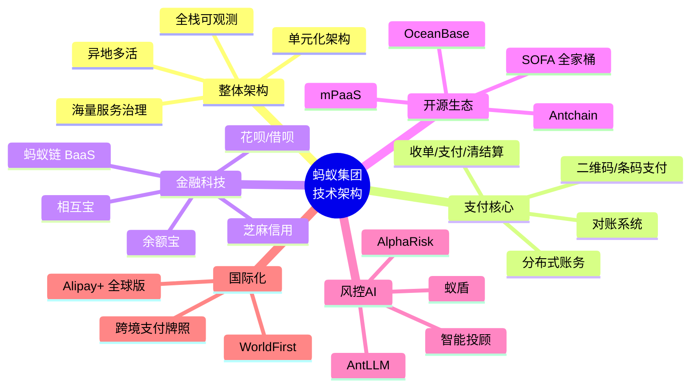

# 支付宝/蚂蚁集团技术架构 - 知识库索引

> 本目录是面向**跨境电商 + AI 直播**业务的技术调研，聚焦蚂蚁集团在**支付、风控、分布式、金融科技**四大领域的工程实践。开篇立图，逐章深入，末尾给出**对 TikTok Shop + AI 直播的可借鉴清单**。

## 一、为什么调研支付宝/蚂蚁集团

| 维度 | 蚂蚁集团 | 我们的对标 |
|---|---|---|
| 支付笔峰值 | 双 11 峰值 **60 万笔/秒**（2020 年公开数据）| TikTok Shop 跨境大促峰值 |
| 数据库 | OceanBase 单集群 **6100 米水深**世界纪录 | AI 直播账务/订单库 |
| 服务规模 | **10 万+ 微服务**、亿级 QPS | 直播业务微服务拆分 |
| 风控延时 | AlphaRisk **<100ms** 实时决策 | 直播打赏/支付反欺诈 |
| 金融产品 | 余额宝/花呗/借呗/芝麻信用 | TikTok 钱包/分期/BNPL |
| 区块链 | 蚂蚁链 BaaS 日均 **1 亿+** 上链量 | 商品溯源/版权存证 |

## 二、本平台拆解地图（思维导图）

## 三、章节清单（6 章 + 3 源码篇 + 索引 = 10 份文件）

| # | 文件名 | 主题 | 行数 | 状态 |
|---|---|---|---|---|
| 0 | `00-索引.md` | 拆解地图 + 章节清单 | ~120 | ✅ |
| 1 | `01-整体架构与蚂蚁金服技术栈.md` | 大图：单元化 + 多活 + 10万级服务 | 300+ | ✅ |
| 2 | `02-支付核心系统与分布式账务.md` | 支付链路 / 账务 / 对账 / OceanBase账务库 | 400+ | ✅ |
| 3 | `03-金融科技产品矩阵.md` | 余额宝/花呗/借呗/芝麻信用/相互宝/蚂蚁链 | 300+ | ✅ |
| 4 | `04-开源生态SOFA与OceanBase.md` | SOFA 全家桶 + OceanBase 源码 + 论文 | 400+ | ✅ |
| 5 | `05-风控与AI能力AlphaRisk.md` | AlphaRisk 实时风控 + 蚁盾 + AntLLM | 300+ | ✅ |
| 6 | `06-可借鉴清单.md` | 对 TikTok Shop + AI 直播的具体启示 | 300+ | ✅ |
| 7 | `07-SOFA-RPC源码深度解读.md` | SOFA-RPC ExtensionLoader/Cluster/LoadBalancer/RouterChain 源码 | 2940 | ✅ |
| 8 | `08-OceanBase源码深度解读.md` | SCN/TxState/2PC/UndoNode/HashMap/LocationCache/GTS 源码 | 2670 | ✅ |
| 9 | `09-蚂蚁链BaaS源码深度解读.md` | PBFT共识 + Solidity合约 + TEE/MPC/ZK + 跨链 + BaaS OpenAPI | 4200+ | ✅ |

## 四、核心数据指标（公开披露 + 估算）

> **数据来源声明**：标记 ✅ 来自蚂蚁官方公开演讲/白皮书；标记 🟡 为行业合理估算；标记 📖 为论文披露。

| 指标 | 数值 | 来源 |
|---|---|---|
| 服务数量 | **>10 万**微服务 | ✅ 2019 蚂蚁 ATEC 演讲 |
| 支付峰值 | **60.5 万笔/秒** | ✅ 2020 双 11 |
| 数据库单集群 | 6100 米深 TiPBench-C 7.07 亿 | ✅ OceanBase TPC-C 2019 / OSDI 2020 |
| 单表最大 | **>1.4 万亿行** | ✅ 蚂蚁技术博客 |
| OceanBase 节点 | 单集群 **>1500** 节点 | ✅ OSDI 2020 论文 |
| 蚂蚁链日均上链量 | **1 亿+** | ✅ 2021 蚂蚁链白皮书 |
| AlphaRisk 决策延时 | **<100ms** | ✅ 2018 ATEC 风控 |
| 余额宝规模峰值 | **1.69 万亿元** | ✅ 2020Q3 公募披露 |
| 蚂蚁链 BaaS 节点 | **>10 万** 节点 | ✅ 2023 链博会 |
| 海外钱包绑定 | **>10 个** 国家级电子钱包 | ✅ Alipay+ 2023 |

## 五、阅读建议

- **后端工程师**：重点读 02（支付）/ 04（OceanBase + SOFA）
- **风控/AI**：重点读 05（AlphaRisk）/ 03（芝麻信用）
- **产品/运营**：重点读 03（金融产品）/ 06（可借鉴）
- **跨境业务**：重点读 03（Alipay+ 部分）/ 06（TikTok 对接）

## 六、参考资料入口

- 蚂蚁技术博客：<https://tech.antfin.com/>
- SOFA 开源：<https://github.com/sofastack>
- OceanBase：<https://github.com/oceanbase/oceanbase>
- 蚂蚁开源：<https://github.com/alipay>
- mPaaS：<https://github.com/alipay/mpaas>
- OSDI 2020 论文：<https://www.usenix.org/system/files/osdi20-cao-zhenjiang.pdf>
- ICDE 2022 论文：<https://www.oceanbase.io/docs/paper>
- AntFi Summit 演讲：<https://www.youtube.com/@AntFinTech>

## 七、关联笔记

- [[../00-总索引|平台架构总索引]]
- [[../shipinhao/00-索引|视频号架构]]（对比项目）
- AI 直播项目：[[C:\skill\ai-live-platform\README]]（自有项目）
