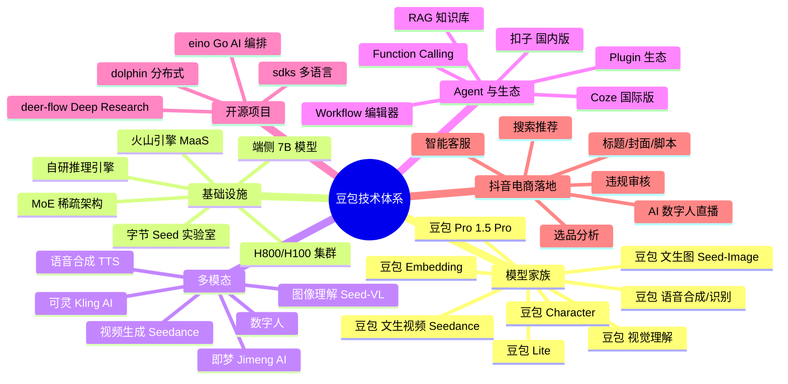

# 豆包/Doubao 技术架构深度调研

> 字节跳动旗下 AI 助手与底层大模型家族。本调研面向 LLM 推理 / Agent 框架 / 多模态 / 抖音电商落地四个维度。

## 调研拆解地图

## 文件清单

| # | 文件 | 内容 | 行数目标 |
|---|------|------|----------|
| 1 | `01-整体架构与豆包大模型.md` | 大图 + Seed 实验室 + 模型系列 + MoE | 300+ |
| 2 | `02-LLM推理引擎与加速.md` | 自研推理 + H800 + 端侧 + vLLM 兼容 | 400+ |
| 3 | `03-多模态能力.md` | 视觉/语音/视频/即梦可灵协同 | 300+ |
| 4 | `04-Agent框架与Coze扣子.md` | Coze + 扣子 + Function Calling + RAG | 300+ |
| 5 | `05-AI在抖音电商的应用.md` | 智能客服/数字人/内容生成/选品 | 300+ |
| 6 | `06-可借鉴清单.md` | 对 AI 直播平台的启示与代码示例 | 300+ |

## 关键概念速查

- **豆包 (Doubao)**：字节跳动 C 端 AI 助手 App，2023 年 8 月发布，对标 ChatGPT
- **豆包大模型家族**：底层 LLM 系列，包括 Pro / Lite / Character 等规格
- **Seed 实验室 (ByteDance Seed)**：字节内部 AI 研究院，豆包模型的实际研发团队
- **火山引擎 MaaS**：字节对外提供模型服务的 ToB 平台
- **Coze**：面向全球的 Agent 开发平台（扣子是国内版）
- **即梦 Jimeng AI**：字节图像生成工具（对标 Midjourney）
- **可灵 Kling AI**：字节视频生成工具（对标 Sora）
- **eino**：字节开源 Go 语言 AI 应用编排框架
- **deer-flow**：字节开源 Deep Research Agent 框架

## 调研来源

- 火山引擎官方：<https://www.volcengine.com/product/doubao>
- 字节跳动技术博客：<https://blog.bytedance.com/>
- 字节开源 GitHub：<https://github.com/bytedance>（eino、deer-flow、dolphin 等）
- Seed 实验室论文：NeurIPS / ICML / ACL / arXiv
- 火山引擎方舟 ARK：<https://www.volcengine.com/product/ark>

## 进度追踪

- [x] 00-索引（本文）
- [ ] 01-整体架构
- [ ] 02-推理引擎
- [ ] 03-多模态
- [ ] 04-Agent 框架
- [ ] 05-抖音电商
- [ ] 06-可借鉴清单