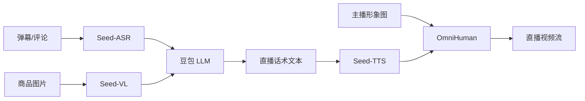
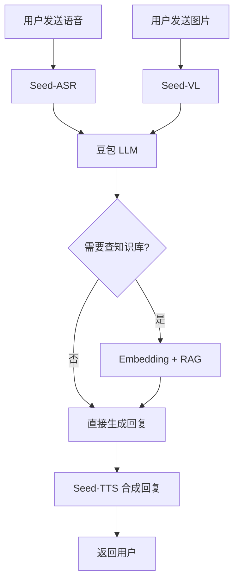

# 03 - 多模态能力（视觉/语音/视频生成）

## 1. 多模态产品矩阵

字节跳动在多模态领域构建了完整的产品矩阵，覆盖 **理解 + 生成** 两大方向。

```
字节多模态矩阵
├── 理解侧（Input）
│   ├── 视觉理解：Doubao-Vision / Seed-VL
│   ├── 语音识别：Seed-ASR
│   ├── 视频理解：Seed-VL-Video
│   └── OCR + 文档解析：Seed-OCR
├── 生成侧（Output）
│   ├── 文生图：Seed-Image（即梦底层）
│   ├── 文生视频：Seedance（可灵底层）
│   ├── 语音合成：Seed-TTS
│   └── 数字人：OmniHuman / 端到端
└── C 端产品
    ├── 即梦 Jimeng AI（图像生成 App）
    ├── 可灵 Kling AI（视频生成 App）
    └── 豆包 App（多模态聊天）
```

## 2. Seed-VL（视觉理解）

### 2.1 模型能力

- **输入**：图像（最高 4K）+ 文本 prompt
- **输出**：文本（描述、问答、OCR、推理）
- **架构**：基于 Doubao Pro + Vision Encoder（ViT 类）
- **上下文**：图像 + 128K 文本

### 2.2 核心能力矩阵

| 任务 | 能力 | 评测基准 | 分数 |
|------|------|----------|------|
| 图像描述 | 中英文详细描述 | COCO Caption | 90+ |
| 视觉问答 | 多轮对话 | VQA v2 | 85+ |
| OCR | 中英文 + 表格 | TextVQA | 85+ |
| 文档解析 | PDF/Word/Excel | DocVQA | 92+ |
| 图表理解 | 数据分析 | ChartQA | 80+ |
| 视频理解 | 1小时视频 | VideoMME | 70+ |
| 空间推理 | 物体位置关系 | BLINK | 80+ |

### 2.3 API 调用示例

```python
# Python 调用视觉理解 API
import base64
from volcenginesdkarkruntime import Ark

client = Ark(api_key="YOUR_KEY")

# 读取图片
with open("product.jpg", "rb") as f:
    image_data = base64.b64encode(f.read()).decode()

response = client.chat.completions.create(
    model="doubao-1-5-vision-pro-250328",
    messages=[
        {
            "role": "user",
            "content": [
                {
                    "type": "image_url",
                    "image_url": {
                        "url": f"data:image/jpeg;base64,{image_data}"
                    }
                },
                {
                    "type": "text",
                    "text": "描述这个商品，并提取关键参数"
                }
            ]
        }
    ],
    max_tokens=1000,
)

print(response.choices[0].message.content)
```

### 2.4 典型应用场景

1. **电商商品理解**：自动识别商品类目、属性、卖点
2. **内容审核**：识别违规图片（涉黄、广告、暴恐）
3. **图文问答**：抖音客服自动识别用户发的图
4. **营销素材分析**：识别广告素材质量

## 3. Seed-ASR（语音识别）

### 3.1 模型能力

- **输入**：16kHz/44.1kHz 音频流
- **输出**：文本（含标点、说话人、情绪）
- **支持语言**：中英日韩 + 粤语、上海话等方言
- **流式延迟**：<300ms

### 3.2 技术亮点

```
音频 → 特征提取 → Encoder → Decoder → 文本
            │
            ├── 自研 SSL 预训练（Wav2Vec 2.0 改进）
            ├── 大模型融合（LLM-ASR）
            └── 流式 Chunk 处理
```

**关键技术**（Seed-ASR 论文公开）：
1. **大模型 ASR**：将 LLM 与 ASR 融合，端到端建模
2. **多任务联合训练**：ASR + 语种识别 + 说话人分离
3. **流式 + 离线统一**：同一模型支持两种模式

### 3.3 API 调用示例

```python
# Seed-ASR 调用（火山引擎）
from volcenginesdkaudiorecognition import AudioRecognition

client = AudioRecognition(
    api_key="YOUR_KEY",
)

# 文件转写
result = client.recognize_file(
    audio_url="https://example.com/audio.mp3",
    model="seed-asr-pro",
    language="zh-CN",
    enable_speaker_diarization=True,
    enable_punctuation=True,
)

for sentence in result.sentences:
    print(f"[{sentence.speaker}] {sentence.text}")
```

## 4. Seed-TTS（语音合成）

### 4.1 核心能力

- **超真实音色**：5 秒音频克隆
- **多语种**：中英日韩 + 多种方言
- **情感控制**：高兴/悲伤/愤怒/中性/惊讶
- **实时流式合成**

### 4.2 架构（基于公开论文）

```
文本 → Tokenizer → Prosody Predictor → Acoustic Decoder → Audio
                            │
                            ├── 韵律预测（停顿、重音、语调）
                            ├── 情感嵌入
                            └── 说话人嵌入
```

### 4.3 音色克隆示例

```python
# 克隆音色 + 合成
from volcenginesdkspeech import SpeechClient

client = SpeechClient(api_key="YOUR_KEY")

# 1. 上传参考音频克隆音色
voice_id = client.clone_voice(
    audio_url="https://example.com/reference_5s.wav",
    voice_name="my_voice",
    description="30 岁女声，温柔风格"
)

# 2. 用克隆的音色合成
audio = client.synthesize_speech(
    text="欢迎来到我的直播间，今天给大家带来一款超值的商品",
    voice_id=voice_id,
    emotion="happy",
    speed=1.0,
    pitch=1.0,
)

# 保存到文件
with open("output.mp3", "wb") as f:
    f.write(audio)
```

## 5. Seed-Image（文生图 / 即梦底层）

### 5.1 即梦 Jimeng AI

- **定位**：对标 Midjourney / Stable Diffusion 的图像生成工具
- **底层模型**：Seed-Image 3.0（2024）
- **产品形态**：Web + App + 抖音小程序
- **核心能力**：
  - 文生图（Text-to-Image）
  - 图生图（Image-to-Image）
  - 智能扩图（Outpainting）
  - 局部重绘（Inpainting）
  - 风格迁移

### 5.2 Seed-Image 3.0 技术亮点

| 维度 | 技术 |
|------|------|
| 架构 | Latent Diffusion + DiT（Diffusion Transformer） |
| 参数量 | 约 2B（业界估算） |
| 分辨率 | 最高 2048x2048 |
| 中文理解 | 专项优化，中文 prompt 友好 |
| 速度 | 单图 5-10 秒 |

### 5.3 集成示例

```python
# 即梦 API 调用（通过火山引擎）
import requests

url = "https://visual.volcengineapi.com/?Action=CVProcess&Version=2022-08-31"
headers = {
    "Authorization": "Bearer YOUR_KEY",
    "Content-Type": "application/json",
}

payload = {
    "req_key": "seed_image_t2i_v3",  # 即梦 T2I v3
    "prompt": "A young female streamer in pink dress, 4K, photorealistic, live streaming setup",
    "negative_prompt": "blurry, low quality, distorted",
    "width": 1024,
    "height": 1024,
    "num_images": 4,
    "seed": -1,
}

response = requests.post(url, json=payload, headers=headers)
images = response.json()["data"]["binary_urls"]
```

### 5.4 TikTok 电商场景应用

- **商品图生成**：白底图 → 场景图
- **模特换装**：商品上身效果预览
- **广告素材**：批量生成 A/B 测试素材
- **直播封面**：根据商品自动生成封面候选

## 6. Seedance（文生视频 / 可灵底层）

### 6.1 可灵 Kling AI

- **定位**：对标 Sora / Runway Gen-3 的视频生成工具
- **底层模型**：Seedance 1.0（2024）/ 1.5（2025）
- **产品形态**：Web + App + 抖音小程序
- **核心能力**：
  - 文生视频（Text-to-Video）
  - 图生视频（Image-to-Video）
  - 视频续写（Extend）
  - 视频风格化

### 6.2 Seedance 技术亮点

- **架构**：DiT（Diffusion Transformer）+ 3D Attention
- **最长生成时长**：60 秒（行业领先，Sora 公开为 60 秒）
- **分辨率**：1080p（部分场景 4K）
- **物理一致性**：运动、镜头、光照保持一致

### 6.3 关键技术（Seedance 公开技术报告）

```
文本 → 文本编码器 → Video DiT → 视频潜变量 → VAE 解码 → 视频
                          │
                          ├── 时空注意力（Spatial-Temporal Attention）
                          ├── 运动一致性约束
                          └── 长视频分块生成
```

### 6.4 调用示例

```python
# 可灵 API 调用（火山引擎视觉智能）
import requests
import time

# 1. 提交视频生成任务
url = "https://visual.volcengineapi.com/?Action=CVSubmitTask&Version=2024-08-01"
payload = {
    "req_key": "seedance_t2v_v1",
    "prompt": "A young Asian woman speaking to camera, holding a lipstick, "
              "studio lighting, smooth camera zoom in",
    "duration": 10,  # 秒
    "ratio": "9:16",  # 竖屏
    "resolution": "1080p",
}

resp = requests.post(url, json=payload, headers=headers)
task_id = resp.json()["data"]["task_id"]

# 2. 轮询任务结果
while True:
    query_url = f"https://visual.volcengineapi.com/?Action=CVGetTask&Version=2024-08-01&TaskId={task_id}"
    result = requests.get(query_url, headers=headers).json()
    if result["data"]["status"] == "done":
        video_url = result["data"]["video_url"]
        print("视频生成完成:", video_url)
        break
    time.sleep(5)
```

## 7. OmniHuman（数字人）

### 7.1 能力

- **输入**：1 张图片 + 1 段音频
- **输出**：说话/唱歌/动作视频
- **最长时长**：数分钟
- **底层模型**：OmniHuman-1.0（2024）/ 1.5（2025）

### 7.2 应用场景

1. **AI 数字人直播**：24 小时无人直播
2. **客服视频**：文字 → 客服形象视频回复
3. **短视频内容**：虚拟人出镜
4. **教育/培训**：AI 教师

### 7.3 与 Wav2Lip / SadTalker 对比

| 特性 | OmniHuman | Wav2Lip | SadTalker |
|------|-----------|---------|-----------|
| 唇形同步 | ★★★★★ | ★★★★ | ★★★ |
| 头部动作 | ★★★★★ | ★★ | ★★★★ |
| 身体动作 | ★★★★ | ✗ | ★★ |
| 情绪表达 | ★★★★★ | ★ | ★★ |
| 实时性 | 中 | ★★★★★ | ★★★★ |
| 开源 | ✗ | ✓ | ✓ |

字节 **OmniHuman 在质量上明显领先**，但不开源。开源方案 Wav2Lip/SadTalker 仍是主流选择。

## 8. 多模态协同（典型流程）

### 8.1 数字人直播生成流程



### 8.2 智能客服多模态



## 9. 多模态在 AI 直播平台的启示

### 9.1 可借鉴

1. **数字人方案**：OmniHuman 闭源，但可借鉴端到端设计思路
2. **多模态协同**：文本 + 语音 + 视觉 + 视频形成闭环
3. **API 化**：所有能力都通过 API 提供，易集成
4. **价格优势**：火山引擎多模态 API 比独立厂商便宜

### 9.2 可替代方案（开源）

| 字节方案 | 开源替代 |
|----------|----------|
| Seed-VL | LLaVA / Qwen-VL / InternVL |
| Seed-ASR | Whisper / Paraformer |
| Seed-TTS | CosyVoice / Edge-TTS / ChatTTS |
| Seed-Image | Stable Diffusion / Kolors |
| Seedance | CogVideoX / AnimateDiff / Open-Sora |
| OmniHuman | Wav2Lip + SadTalker + MuseTalk |

## 10. 关键洞察

1. **字节多模态是"全家桶"**：理解 + 生成全覆盖，C 端产品化强
2. **即梦 + 可灵是 ToC 主战场**：直接对标 Midjourney / Sora
3. **OmniHuman 是杀手锏**：闭源但质量领先
4. **多模态协同是终极方向**：单一模态到全模态融合
5. **价格是杀手锏**：字节多模态 API 价格普遍比独立厂商低 30-50%

## 11. 参考资料

- 火山引擎视觉智能：<https://www.volcengine.com/product/imagerecog>
- 火山引擎语音技术：<https://www.volcengine.com/product/asr>
- 即梦 AI：<https://jimeng.jianying.com/>
- 可灵 AI：<https://klingai.kuaishou.com/>（注：可灵实际为快手产品，但底层有借鉴/合作）
- Seedance 技术报告：<https://arxiv.org/abs/2410.04365>
- Seed-ASR 技术报告：<https://arxiv.org/abs/2407.04675>
- OmniHuman 技术报告：<https://arxiv.org/abs/2409.00836>