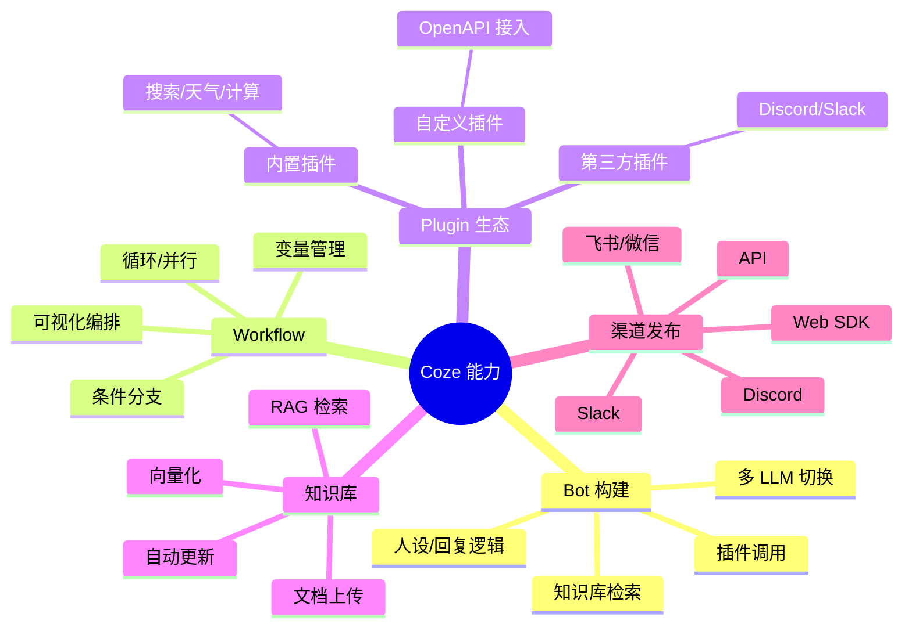
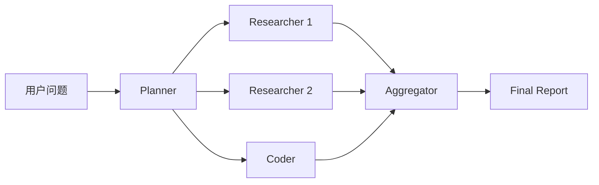

# 04 - Agent 框架与 Coze/扣子平台

## 1. 字节 Agent 生态全景

字节跳动通过 **Coze（国际版）+ 扣子（国内版）** 布局 Agent 平台市场，对标 OpenAI GPTs、LangChain 等。

```
字节 Agent 生态
├── Coze（国际版）              扣子（国内版）
│   ├── 零代码 Bot 构建          ├── 中文 Bot 市场
│   ├── Plugin 生态              ├── 抖音小程序集成
│   ├── Workflow 编辑器          ├── 工作流编排
│   ├── Knowledge 知识库         ├── 知识库上传
│   └── 发布到 Discord/Slack     └── 飞书/微信集成
├── eino（开源 Go 框架）
│   ├── Component 抽象
│   ├── Graph 编排
│   └── Lambda/ChatModel/Tool
├── deer-flow（开源 Deep Research）
│   ├── 多 Agent 协作
│   ├── 工具调用
│   └── 报告生成
└── 火山引擎智能体平台
    ├── 企业级 Agent 部署
    ├── 私有化部署
    └── 安全合规
```

## 2. Coze 平台架构

### 2.1 产品定位

- **Coze**（www.coze.com）：面向全球用户，2024 年上线
- **扣子**（www.coze.cn）：面向国内用户，中文优化

### 2.2 核心能力



### 2.3 Bot 创建示例（代码视角）

```yaml
# Coze Bot 配置（YAML 风格伪代码）
bot:
  name: "电商客服助手"
  description: "TikTok Shop 跨境电商智能客服"
  model: doubao-1-5-pro
  system_prompt: |
    你是一名专业的电商客服，擅长回答物流、退换货、商品咨询。
    回复要友好、专业、简洁。
  knowledge:
    - type: file
      name: "商品手册.pdf"
      url: "https://example.com/manual.pdf"
    - type: database
      name: "订单数据"
      table: "orders"
  plugins:
    - plugin_id: "search"
      enabled: true
    - plugin_id: "calculator"
      enabled: true
  variables:
    - name: "shop_name"
      default: "我的小店"
    - name: "user_level"
      type: "user_metadata"
```

### 2.4 Coze Workflow 示例

```json
{
  "name": "智能客服工作流",
  "nodes": [
    {
      "id": "start",
      "type": "Start",
      "next": "classify"
    },
    {
      "id": "classify",
      "type": "LLM",
      "model": "doubao-1-5-lite",
      "prompt": "分类用户意图：物流/退换货/商品咨询/其他",
      "output_key": "intent",
      "next": "switch"
    },
    {
      "id": "switch",
      "type": "Switch",
      "conditions": {
        "物流": "logistics_handler",
        "退换货": "refund_handler",
        "商品咨询": "product_handler"
      },
      "default": "fallback_handler"
    },
    {
      "id": "logistics_handler",
      "type": "Plugin",
      "plugin_id": "logistics_tracker",
      "next": "respond"
    },
    {
      "id": "respond",
      "type": "LLM",
      "model": "doubao-1-5-pro",
      "prompt": "基于 {{logistics_handler.result}} 生成友好回复",
      "next": "end"
    }
  ]
}
```

## 3. Function Calling 工具调用

### 3.1 字节 Function Calling 协议

豆包采用类似 OpenAI 的 Function Calling 规范：

```python
# Function Calling 调用示例
import json
from volcenginesdkarkruntime import Ark

client = Ark(api_key="YOUR_KEY")

tools = [
    {
        "type": "function",
        "function": {
            "name": "query_order",
            "description": "查询订单状态",
            "parameters": {
                "type": "object",
                "properties": {
                    "order_id": {
                        "type": "string",
                        "description": "订单号"
                    }
                },
                "required": ["order_id"]
            }
        }
    },
    {
        "type": "function",
        "function": {
            "name": "search_products",
            "description": "搜索商品",
            "parameters": {
                "type": "object",
                "properties": {
                    "keyword": {"type": "string"},
                    "max_price": {"type": "number"}
                },
                "required": ["keyword"]
            }
        }
    }
]

# 调用模型
response = client.chat.completions.create(
    model="doubao-1-5-pro",
    messages=[
        {"role": "user", "content": "我的订单 123456 怎么还没发货？"}
    ],
    tools=tools,
    tool_choice="auto",
)

# 模型决定调用工具
if response.choices[0].message.tool_calls:
    for tool_call in response.choices[0].message.tool_calls:
        fn_name = tool_call.function.name
        fn_args = json.loads(tool_call.function.arguments)
        
        if fn_name == "query_order":
            order_info = query_order_database(fn_args["order_id"])
            # 把工具结果传回模型
            messages = [
                {"role": "user", "content": "我的订单 123456 怎么还没发货？"},
                response.choices[0].message,
                {
                    "role": "tool",
                    "tool_call_id": tool_call.id,
                    "content": json.dumps(order_info)
                }
            ]
            
            final = client.chat.completions.create(
                model="doubao-1-5-pro",
                messages=messages,
                tools=tools,
            )
            print(final.choices[0].message.content)
```

### 3.2 并行工具调用

```python
# 豆包支持单次调用多个工具
response = client.chat.completions.create(
    model="doubao-1-5-pro",
    messages=[
        {"role": "user", "content": "对比订单 123 和 456 的状态"}
    ],
    tools=tools,
)

# 模型可能一次返回多个 tool_calls
for tool_call in response.choices[0].message.tool_calls:
    # 并行执行
    execute_in_parallel(tool_call)
```

## 4. RAG 知识库

### 4.1 Coze 知识库架构

```
文档上传 → 解析（PDF/Word/Excel） → 分块（Chunk）
                              ↓
                         Embedding（Doubao-Embedding）
                              ↓
                       向量数据库（自研）
                              ↓
用户问题 → Embedding → 检索 Top-K → 重排序（Doubao-Rerank）
                              ↓
                          LLM 生成回答
```

### 4.2 知识库创建

```python
# Coze 知识库 API
import requests

# 1. 创建知识库
kb_resp = requests.post(
    "https://api.coze.cn/v1/datasets",
    headers={"Authorization": "Bearer YOUR_TOKEN"},
    json={
        "name": "商品知识库",
        "format": "text",
    }
)
dataset_id = kb_resp.json()["data"]["id"]

# 2. 上传文档
with open("products.pdf", "rb") as f:
    doc_resp = requests.post(
        f"https://api.coze.cn/v1/datasets/{dataset_id}/documents",
        headers={"Authorization": "Bearer YOUR_TOKEN"},
        files={"file": f},
    )
document_id = doc_resp.json()["data"]["document_id"]

# 3. 等待处理完成（向量化）
import time
while True:
    status_resp = requests.get(
        f"https://api.coze.cn/v1/datasets/{dataset_id}/documents/{document_id}",
        headers={"Authorization": "Bearer YOUR_TOKEN"},
    )
    status = status_resp.json()["data"]["status"]
    if status == "completed":
        break
    time.sleep(3)
```

### 4.3 RAG 检索（底层）

```python
# 字节 Doubao-Embedding + Rerank 流程
from volcenginesdkarkruntime import Ark

client = Ark(api_key="YOUR_KEY")

# 1. 向量化查询
query_embedding = client.embeddings.create(
    model="doubao-embedding",
    input="豆包大模型的训练数据规模"
).data[0].embedding

# 2. 向量检索（自建向量库）
results = vector_db.search(
    query_embedding=query_embedding,
    top_k=20,
    filter={"source": "doubao_docs"}
)

# 3. 重排序
rerank_resp = client.rerank.create(
    model="doubao-rerank",
    query="豆包大模型的训练数据规模",
    documents=[r.text for r in results],
    top_n=5,
)

top_chunks = [results[i] for i in rerank_resp.results]
```

## 5. eino：字节开源 Go AI 编排框架

### 5.1 项目信息

- **仓库**：<https://github.com/cloudwego/eino>
- **维护**：CloudWeGo（字节跳动）
- **Stars**：2k+（2025）
- **定位**：Go 语言的 LangChain / LlamaIndex

### 5.2 核心抽象

```go
// eino 核心概念（简化）
package main

import (
    "context"
    "github.com/cloudwego/eino/compose"
    "github.com/cloudwego/eino/components/model"
)

// Component: 组件（ChatModel / Tool / Retriever / Lambda）
// Graph: 编排图（Chain / Parallel / Branch）
// Schema: 数据结构（Message / Document）

func main() {
    // 1. 创建一个 ChatModel 组件
    chatModel := createDoubaoChatModel()
    
    // 2. 创建一个 Graph
    g := compose.NewGraph[map[string]any]()
    
    // 3. 添加节点
    _ = g.AddLambdaNode("input", compose.InvokableLambda(
        func(ctx context.Context, input map[string]any) (output map[string]any, err error) {
            return map[string]any{"question": input["question"]}, nil
        }),
    )
    
    _ = g.AddChatModelNode("llm", chatModel)
    
    _ = g.AddLambdaNode("output", compose.InvokableLambda(
        func(ctx context.Context, input map[string]any) (output map[string]any, err error) {
            return map[string]any{"answer": input["content"]}, nil
        }),
    )
    
    // 4. 连接边
    _ = g.AddEdge("input", "llm")
    _ = g.AddEdge("llm", "output")
    
    // 5. 编译 + 运行
    runner, _ := g.Compile(context.Background())
    result, _ := runner.Invoke(context.Background(), map[string]any{
        "question": "你好",
    })
    println(result["answer"])
}
```

### 5.3 eino 编排能力

| 编排模式 | 说明 | 示例 |
|----------|------|------|
| Chain | 串行 | prompt → llm → post-process |
| Branch | 条件分支 | if/else 路由 |
| Parallel | 并行执行 | 多模型对比 / 多数据源 |
| Loop | 循环迭代 | ReAct Agent |
| Map/Reduce | 批量处理 | 文档摘要 |
| Nested | 嵌套子图 | 复杂工作流 |

### 5.4 eino vs LangChain

| 维度 | eino | LangChain |
|------|------|-----------|
| 语言 | Go | Python/JS |
| 性能 | 接近原生 Go | 解释执行 |
| 类型安全 | 强类型 | 弱类型（dict） |
| 生态 | 字节为主 | 社区广泛 |
| 学习曲线 | 中 | 陡 |
| 生产稳定 | 高 | 高 |

**eino 优势**：Go 性能 + 类型安全，特别适合高并发服务。

## 6. deer-flow：Deep Research Agent

### 6.1 项目信息

- **仓库**：<https://github.com/bytedance/deer-flow>
- **Stars**：10k+（2025）
- **定位**：对标 LangChain DeepResearch / OpenAI Deep Research
- **能力**：多步研究 + 报告生成

### 6.2 架构

```
┌─────────────────────────────────────────────┐
│              Researcher Agent                │
│   ┌──────────────────────────────────┐     │
│   │  Plan → Search → Read → Synthesize │     │
│   └──────────────────────────────────┘     │
└─────────────────┬───────────────────────────┘
                  │
┌─────────────────▼───────────────────────────┐
│              Coder Agent                     │
│   ┌──────────────────────────────────┐     │
│   │  Analyze data → Code → Visualize   │     │
│   └──────────────────────────────────┘     │
└─────────────────┬───────────────────────────┘
                  │
┌─────────────────▼───────────────────────────┐
│              Reporter Agent                  │
│   ┌──────────────────────────────────┐     │
│   │  Draft → Review → Polish          │     │
│   └──────────────────────────────────┘     │
└─────────────────────────────────────────────┘
```

### 6.3 工作流示例

```python
# deer-flow 简化使用
from deer_flow import ResearchAgent

agent = ResearchAgent(
    llm="doubao-1-5-pro",
    tools=["search", "browser", "code_executor"],
)

# 深度研究任务
report = agent.research(
    topic="TikTok Shop 东南亚市场 2025 年趋势",
    max_iterations=10,
    report_format="markdown",
    include_charts=True,
)

print(report)
```

### 6.4 deer-flow 核心能力

1. **多 Agent 协作**：Planner / Researcher / Coder / Reporter
2. **工具组合**：搜索 + 浏览器 + 代码执行 + 数据库
3. **反思机制**：每个步骤评估质量，不达标重做
4. **报告自动生成**：结构化报告 + 图表 + 引用

## 7. 火山引擎智能体平台（企业级）

### 7.1 与 Coze 的差异

| 维度 | Coze/扣子 | 火山引擎智能体 |
|------|-----------|----------------|
| 用户 | 开发者/SMB | 企业 |
| 部署 | 公有云 SaaS | 公有云 + 私有化 |
| 合规 | 一般 | SOC2 / 等保三级 |
| 模型 | 仅豆包 | 豆包 + 第三方 |
| SLA | 无 | 99.9% |
| 价格 | 免费/低价 | 企业定价 |

### 7.2 私有化部署

```
客户 IDC 机房
├── Kubernetes 集群
│   ├── 推理服务（豆包模型）
│   ├── 向量数据库
│   ├── Agent 编排引擎
│   └── 监控/日志
├── 客户数据
│   ├── 知识库
│   ├── 业务系统对接
│   └── 用户数据
└── 安全
    ├── 加密通信
    ├── 审计日志
    └── 权限管控
```

## 8. Agent 设计模式

### 8.1 ReAct（Reason + Act）

```python
# ReAct Agent 模板
class ReActAgent:
    def __init__(self, llm, tools):
        self.llm = llm
        self.tools = tools
    
    def run(self, question: str, max_steps=10):
        history = []
        for step in range(max_steps):
            # 1. Think：决定下一步动作
            prompt = f"""
            Question: {question}
            History: {history}
            Available tools: {list(self.tools.keys())}
            
            Choose your next action in JSON format:
            {{
              "thought": "reasoning about current state",
              "action": "tool_name",
              "action_input": {{"param": "value"}}
            }}
            """
            decision = json.loads(self.llm.generate(prompt))
            
            # 2. Act：执行工具
            if decision["action"] == "finish":
                return decision["action_input"]["answer"]
            
            result = self.tools[decision["action"]](**decision["action_input"])
            
            # 3. Observe：记录结果
            history.append({
                "step": step,
                "thought": decision["thought"],
                "action": decision["action"],
                "result": result,
            })
        
        return "Max steps reached"
```

### 8.2 Multi-Agent 协作



### 8.3 Coze 实际案例

**案例 1：电商客服 Bot**
- Tools：订单查询、物流跟踪、退款申请
- Knowledge：商品手册 + FAQ
- 模型：豆包 Pro

**案例 2：内容创作 Bot**
- Tools：图片生成、视频生成、剪辑
- Knowledge：爆款视频库
- 模型：豆包 Pro + 即梦

**案例 3：数据分析 Bot**
- Tools：SQL 执行、图表生成、报告导出
- Knowledge：业务指标文档
- 模型：豆包 Pro

## 9. 关键洞察

1. **Coze 是字节的 GPTs**：面向 C 端开发者，做生态
2. **eino 是字节的 LangChain**：Go 性能导向，企业服务
3. **deer-flow 是 Deep Research 抢占**：对标 OpenAI Deep Research
4. **工具调用标准化**：字节使用 OpenAI 兼容协议，易迁移
5. **RAG + Function Calling 是标配**：Agent 平台基础
6. **可借鉴到 AI 直播平台**：
   - 用 Coze 工作流编排直播话术 + 工具调用
   - 用 eino 构建 Go 后端 Agent 服务
   - 用 deer-flow 做选品深度研究

## 10. 参考资料

- Coze 国际版：<https://www.coze.com/>
- Coze 国内版：<https://www.coze.cn/>
- 扣子官网：<https://www.coze.cn>
- eino GitHub：<https://github.com/cloudwego/eino>
- deer-flow GitHub：<https://github.com/bytedance/deer-flow>
- 火山引擎智能体：<https://www.volcengine.com/product/agentkit>
- OpenAI Function Calling：<https://platform.openai.com/docs/guides/function-calling>