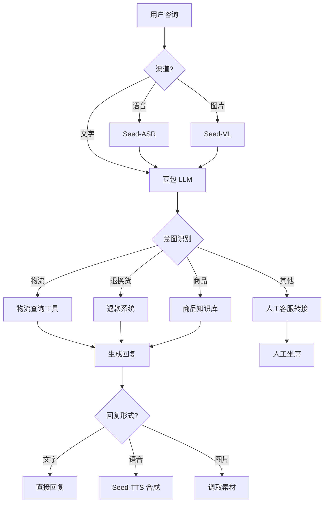

# 05 - AI 在抖音电商的应用

## 1. 抖音电商 AI 能力地图

字节跳动将豆包大模型 + 多模态能力深度嵌入抖音电商全链路，覆盖 **人货场** 三个核心维度。

```
抖音电商 AI 应用地图
├── 人（User/Anchor）
│   ├── AI 数字人主播
│   ├── AI 客服
│   ├── AI 智能导购
│   └── AI 评论分析
├── 货（Product）
│   ├── AI 选品分析
│   ├── AI 商品理解
│   ├── AI 标题生成
│   ├── AI 封面生成
│   ├── AI 卖点提炼
│   └── AI 价格建议
├── 场（Scene）
│   ├── AI 直播间搭建
│   ├── AI 智能灯光/镜头
│   ├── AI 实时话术
│   └── AI 弹幕互动
└── 运营后台
    ├── AI 内容审核
    ├── AI 数据分析
    ├── AI 报表生成
    └── AI 违规检测
```

## 2. AI 数字人直播

### 2.1 产品形态

抖音电商推出的 **AI 数字人直播** 解决方案，让中小商家也能 24 小时开播。

```
┌──────────────────────────────────────────────────────────┐
│               AI 数字人直播系统                              │
│                                                           │
│  ┌─────────┐    ┌─────────┐    ┌──────────┐             │
│  │ 商品库  │ →  │ 话术库  │ →  │ 数字人主播 │             │
│  └─────────┘    └─────────┘    └────┬─────┘             │
│                                     │                     │
│                                     ▼                     │
│                              ┌─────────────┐              │
│                              │ 直播视频流  │              │
│                              │ (OmniHuman) │              │
│                              └─────────────┘              │
│                                                           │
│  ┌────────────────────────────────────────┐              │
│  │ 实时交互                              │              │
│  │ 弹幕 → 豆包 → 数字人回复（话术 + 动作） │              │
│  └────────────────────────────────────────┘              │
└──────────────────────────────────────────────────────────┘
```

### 2.2 技术栈

| 组件 | 字节方案 | 开源替代 |
|------|----------|----------|
| 数字人形象 | OmniHuman（闭源） | SadTalker + MuseTalk |
| 唇形同步 | OmniHuman 内置 | Wav2Lip / VideoReTalking |
| 语音合成 | Seed-TTS | CosyVoice / Edge-TTS |
| 对话理解 | 豆包 Pro | GPT-4 / Qwen |
| 商品理解 | Seed-VL | LLaVA / Qwen-VL |
| 弹幕识别 | 自研 NLP | BERT + 微调 |
| 直播推流 | 抖音原生 | OBS / SRS |

### 2.3 AI 数字人直播代码示例

```python
# 简化版 AI 数字人直播系统
import asyncio
from volcenginesdkarkruntime import Ark
from seed_tts import SeedTTS
from omnihuman import OmniHumanClient

class AILivestreamBot:
    def __init__(self, anchor_image_url, products):
        self.llm = Ark(api_key="...")
        self.tts = SeedTTS(api_key="...")
        self.digital_human = OmniHumanClient(api_key="...")
        self.anchor_image = anchor_image_url
        self.products = products
        
        # 加载人设
        self.system_prompt = f"""
        你是一名带货主播，正在抖音直播间销售商品。
        风格：活泼、亲切、节奏快。
        商品：{products}
        """
    
    async def on_comment(self, comment, username):
        """处理弹幕评论"""
        # 1. 调用豆包生成回复话术
        response = self.llm.chat.completions.create(
            model="doubao-1-5-pro",
            messages=[
                {"role": "system", "content": self.system_prompt},
                {"role": "user", "content": f"{username}: {comment}"},
            ],
            temperature=0.8,
            max_tokens=200,
        )
        reply_text = response.choices[0].message.content
        
        # 2. 用 Seed-TTS 合成语音
        audio = self.tts.synthesize(
            text=reply_text,
            voice_id="female_lively",
            emotion="happy",
        )
        
        # 3. 用 OmniHuman 生成数字人说话视频片段
        video_clip = self.digital_human.generate(
            image_url=self.anchor_image,
            audio=audio,
            duration=len(reply_text) * 0.15,  # 估算时长
        )
        
        # 4. 推流到抖音直播
        await self.push_to_livestream(video_clip)
        
        return reply_text
    
    async def push_to_livestream(self, video_clip):
        """推流到抖音直播间"""
        # 通过抖音开放平台 RTMP 推流
        # 实际实现需要抖音直播伴侣/小玩法 API
        pass

# 启动
bot = AILivestreamBot(
    anchor_image_url="https://example.com/anchor.jpg",
    products=[
        {"id": "P001", "name": "口红", "price": 99},
        {"id": "P002", "name": "面膜", "price": 49},
    ],
)

# 处理弹幕
asyncio.run(bot.on_comment("这个口红多少钱？", "小美"))
```

### 2.4 数字人直播效果数据

抖音电商公开数据（2024）：
- **商家采用率**：超 5 万商家
- **24h 直播覆盖**：单店日均直播时长从 6h 提升到 24h
- **GMV 提升**：平均提升 **30-50%**（部分品类 100%+）
- **成本降低**：相比真人主播，节省 **70%+** 人力成本

> 注：以上数据来源为字节跳动公开分享，具体数字以官方为准。

## 3. 智能客服 / 客服 Agent

### 3.1 应用场景

```
抖音电商客服场景
├── 售前
│   ├── 商品咨询
│   ├── 价格咨询
│   ├── 物流咨询
│   └── 活动咨询
├── 售中
│   ├── 订单修改
│   ├── 库存查询
│   ├── 支付问题
│   └── 优惠券使用
└── 售后
    ├── 物流跟踪
    ├── 退换货申请
    ├── 退款进度
    └── 投诉处理
```

### 3.2 智能客服 Agent 架构



### 3.3 客服 Bot 实现

```python
# 基于 Coze / 火山引擎的智能客服
from volcenginesdkarkruntime import Ark
import json

class EcommerceCustomerBot:
    def __init__(self):
        self.client = Ark(api_key="...")
        self.tools = [
            {
                "type": "function",
                "function": {
                    "name": "get_order_status",
                    "description": "查询订单状态",
                    "parameters": {
                        "type": "object",
                        "properties": {
                            "order_id": {"type": "string"}
                        },
                        "required": ["order_id"]
                    }
                }
            },
            {
                "type": "function",
                "function": {
                    "name": "apply_refund",
                    "description": "申请退款",
                    "parameters": {
                        "type": "object",
                        "properties": {
                            "order_id": {"type": "string"},
                            "reason": {"type": "string"}
                        },
                        "required": ["order_id", "reason"]
                    }
                }
            },
            {
                "type": "function",
                "function": {
                    "name": "search_products",
                    "description": "搜索商品",
                    "parameters": {
                        "type": "object",
                        "properties": {
                            "keyword": {"type": "string"},
                            "category": {"type": "string"}
                        },
                        "required": ["keyword"]
                    }
                }
            }
        ]
    
    def chat(self, user_message: str, user_id: str, history: list = None):
        messages = history or []
        messages.append({"role": "user", "content": user_message})
        
        # 调用豆包 Pro
        response = self.client.chat.completions.create(
            model="doubao-1-5-pro",
            messages=[
                {
                    "role": "system",
                    "content": "你是抖音电商客服助手，专业、友好、高效。"
                },
                *messages,
            ],
            tools=self.tools,
            tool_choice="auto",
        )
        
        msg = response.choices[0].message
        
        # 处理工具调用
        if msg.tool_calls:
            messages.append(msg)
            for tool_call in msg.tool_calls:
                fn_name = tool_call.function.name
                fn_args = json.loads(tool_call.function.arguments)
                
                # 执行工具
                if fn_name == "get_order_status":
                    result = self._query_order(fn_args["order_id"])
                elif fn_name == "apply_refund":
                    result = self._apply_refund(fn_args["order_id"], fn_args["reason"])
                elif fn_name == "search_products":
                    result = self._search_products(fn_args["keyword"])
                
                messages.append({
                    "role": "tool",
                    "tool_call_id": tool_call.id,
                    "content": json.dumps(result, ensure_ascii=False),
                })
            
            # 二次调用生成回复
            final = self.client.chat.completions.create(
                model="doubao-1-5-pro",
                messages=messages,
            )
            return final.choices[0].message.content
        
        return msg.content
    
    def _query_order(self, order_id):
        # 调用订单系统 API
        return {"order_id": order_id, "status": "已发货", "tracking_no": "SF1234567890"}
    
    def _apply_refund(self, order_id, reason):
        # 调用退款系统 API
        return {"refund_id": "RF001", "status": "已受理", "estimated_time": "1-3 工作日"}
    
    def _search_products(self, keyword):
        # 搜索商品库
        return {"products": [{"id": "P001", "name": keyword, "price": 99}]}

# 使用
bot = EcommerceCustomerBot()
print(bot.chat("我的订单 123456 怎么还没发货？", user_id="user_001"))
```

### 3.4 客服效果数据

字节电商公开数据（2024）：
- **覆盖率**：智能客服处理 **80%+** 常见问题
- **响应时间**：从平均 30s 降至 **<3s**
- **人工客服压力**：降低 **60%**
- **满意度**：用户满意度从 75% 提升到 **88%**

## 4. 内容生成（标题/封面/脚本）

### 4.1 应用清单

| 内容类型 | AI 能力 | 工具 | 字节方案 |
|----------|---------|------|----------|
| 商品标题 | 文案生成 | 豆包 LLM | Doubao-Pro |
| 商品卖点 | 要点提炼 | 豆包 LLM | Doubao-Pro |
| 直播封面 | 文生图 | Seed-Image | 即梦 AI |
| 直播脚本 | 创意生成 | 豆包 LLM | Doubao-Pro |
| 短视频脚本 | 创意生成 | 豆包 LLM | Doubao-Pro |
| 评论区话术 | 互动生成 | 豆包 LLM | Doubao-Lite |
| 商品描述 | 长文生成 | 豆包 LLM | Doubao-Pro |
| 翻译 | 多语种 | 豆包 LLM | Doubao-Pro |

### 4.2 标题生成示例

```python
# 商品标题批量生成
from volcenginesdkarkruntime import Ark

client = Ark(api_key="...")

def generate_titles(product_info):
    """根据商品信息生成 10 个爆款标题候选"""
    response = client.chat.completions.create(
        model="doubao-1-5-pro",
        messages=[
            {
                "role": "system",
                "content": """你是抖音电商爆款标题专家。
                标题要求：
                1. 12-20 字
                2. 包含数字、卖点、情绪
                3. 用 emoji 增强视觉
                4. 避免夸大、违规词
                5. 一次性生成 10 个候选"""
            },
            {
                "role": "user",
                "content": f"""商品信息：
                名称：{product_info['name']}
                类目：{product_info['category']}
                价格：{product_info['price']}
                卖点：{product_info['features']}
                目标人群：{product_info['target_audience']}
                """
            }
        ],
        temperature=0.9,
        max_tokens=800,
    )
    return response.choices[0].message.content

# 使用
titles = generate_titles({
    "name": "哑光丝绒口红",
    "category": "美妆/口红",
    "price": "99",
    "features": "持久不脱色、显白、滋润、明星同款",
    "target_audience": "18-30 岁女性",
})
print(titles)
```

### 4.3 封面图生成

```python
# 调用即梦生成直播封面
import requests

def generate_live_cover(product_name, style="eye_catching"):
    url = "https://visual.volcengineapi.com/?Action=CVProcess&Version=2022-08-31"
    
    prompt = f"""
    直播封面，{product_name}，{style}风格，
    鲜艳色彩，醒目文字区域，专业摄影，
    抖音 9:16 竖屏构图，主体居中
    """
    
    response = requests.post(
        url,
        headers={"Authorization": "Bearer YOUR_KEY"},
        json={
            "req_key": "seed_image_t2i_v3",
            "prompt": prompt,
            "width": 1080,
            "height": 1920,
            "num_images": 4,
        }
    )
    return response.json()["data"]["binary_urls"]
```

## 5. AI 选品分析

### 5.1 选品维度

```
AI 选品分析
├── 市场需求
│   ├── 搜索热度趋势
│   ├── 类目增长率
│   ├── 季节性波动
│   └── 竞品销量
├── 竞争分析
│   ├── 头部商品价格带
│   ├── 评论情感分析
│   ├── 卖点差异化
│   └── 蓝海度评分
├── 利润评估
│   ├── 采购成本估算
│   ├── 物流成本
│   ├── 平台佣金
│   └── 预期 ROI
└ ├── 风险评估
    ├── 侵权风险
    ├── 平台政策
    ├── 供应链稳定性
    └── 退货率预测
```

### 5.2 选品 Agent

```python
# deer-flow 风格的选品研究 Agent
class SelectionAgent:
    def __init__(self):
        self.client = Ark(api_key="...")
    
    def analyze_product(self, category, target_market="US"):
        """深度分析某个品类"""
        prompt = f"""
        你是 TikTok Shop 选品专家，专注于 {target_market} 市场。
        
        请分析 {category} 类目：
        
        1. 市场容量：搜索量级、增长趋势
        2. 价格带：热销商品价格分布
        3. 头部竞品：列出 Top 5 商品
        4. 蓝海机会：未饱和细分需求
        5. 风险提示：侵权、政策、季节性
        6. 推荐 SKU：3-5 个具体商品建议
        7. 营销建议：卖点、定价、目标人群
        
        用结构化输出，包含表格。
        """
        
        response = self.client.chat.completions.create(
            model="doubao-1-5-pro",
            messages=[
                {"role": "system", "content": "你是资深 TikTok Shop 选品专家"},
                {"role": "user", "content": prompt},
            ],
            temperature=0.3,
            max_tokens=4000,
        )
        return response.choices[0].message.content
    
    def compare_products(self, products: list):
        """多商品对比"""
        prompt = f"""
        对比以下商品，从 TikTok Shop 美区市场角度：
        {json.dumps(products, ensure_ascii=False, indent=2)}
        
        评估维度：
        - 市场需求
        - 竞争烈度
        - 利润空间
        - 运营难度
        - 风险等级
        
        给出 Top 3 推荐排序 + 理由
        """
        # 调用豆包 Pro 生成对比分析
        # ...
```

## 6. AI 内容审核

### 6.1 审核场景

```
抖音电商内容审核
├── 商品审核
│   ├── 标题合规
│   ├── 图片合规（涉黄/暴恐/广告法）
│   ├── 类目正确性
│   └── 价格合理性
├── 直播审核
│   ├── 实时画面违规
│   ├── 主播言论合规
│   ├── 商品宣传真实性
│   └── 弹幕违规
├── 评论审核
│   ├── 恶意评论
│   ├── 广告导流
│   ├── 涉政涉黄
│   └── 辱骂攻击
└── 素材审核
    ├── 短视频合规
    ├── 广告素材真实性
    └── 品牌授权
```

### 6.2 审核模型

字节使用 **Seed-VL（视觉） + 豆包 Pro（文本）** 双引擎：

```python
# 直播实时审核
class LiveStreamModerator:
    def __init__(self):
        self.vision_client = Ark(api_key="...")  # Seed-VL
        self.text_client = Ark(api_key="...")    # 豆包 Pro
    
    def check_frame(self, frame_base64):
        """检查直播画面帧"""
        response = self.vision_client.chat.completions.create(
            model="doubao-1-5-vision-pro",
            messages=[{
                "role": "user",
                "content": [
                    {"type": "image_url", "image_url": {"url": f"data:image/jpeg;base64,{frame_base64}"}},
                    {"type": "text", "text": "检查这个直播画面是否违规：涉黄、暴恐、广告法违规、虚假宣传"},
                ]
            }],
        )
        return response.choices[0].message.content
    
    def check_speech(self, text):
        """检查主播言论"""
        response = self.text_client.chat.completions.create(
            model="doubao-1-5-pro",
            messages=[
                {"role": "system", "content": "你是抖音直播内容审核员"},
                {"role": "user", "content": f"检查这段主播话术是否违规：{text}"},
            ],
        )
        return response.choices[0].message.content
```

## 7. 数据分析与决策

### 7.1 应用

| 场景 | AI 能力 | 输入 | 输出 |
|------|---------|------|------|
| 销售分析 | 数据解读 | GMV/订单数据 | 趋势分析 + 建议 |
| 复盘报告 | 报告生成 | 多维度数据 | 自动周报/月报 |
| 选品决策 | 预测分析 | 历史数据 | 推荐品类 |
| 库存预警 | 时序预测 | 库存数据 | 补货建议 |
| 客服质检 | 文本分类 | 对话记录 | 服务质量评分 |

### 7.2 自动复盘报告

```python
# AI 自动生成周报
class WeeklyReportGenerator:
    def __init__(self):
        self.client = Ark(api_key="...")
    
    def generate_report(self, shop_data: dict):
        prompt = f"""
        基于以下店铺数据生成本周运营报告：
        
        {json.dumps(shop_data, ensure_ascii=False, indent=2)}
        
        报告要求：
        1. 核心指标对比上周
        2. 增长/下降归因分析
        3. Top 5 爆款商品
        4. 流量来源分析
        5. 转化漏斗问题诊断
        6. 下周运营建议（3-5 条）
        7. 风险提示
        
        格式：Markdown + 表格
        """
        
        response = self.client.chat.completions.create(
            model="doubao-1-5-pro",
            messages=[
                {"role": "system", "content": "你是 TikTok Shop 资深运营专家"},
                {"role": "user", "content": prompt},
            ],
            max_tokens=4000,
        )
        return response.choices[0].message.content
```

## 8. 关键洞察

1. **字节 AI 电商的核心是降本**：数字人 + 智能客服节约 60-70% 人力
2. **豆包是中枢**：所有 AI 能力都通过豆包 + 多模态协同
3. **火山引擎是出口**：ToB 商家可独立使用 AI 能力
4. **Coze 加速渗透**：中小商家通过扣子快速搭建 AI 工具
5. **数据飞轮**：抖音电商场景反哺模型迭代
6. **可借鉴到 AI 直播平台**：
   - 数字人直播系统（OmniHuman + Seed-TTS）
   - 智能客服 Agent（Function Calling + RAG）
   - 内容生成工作流（标题/封面/脚本）
   - AI 选品分析（deer-flow Deep Research）

## 9. 参考资料

- 抖音电商开放平台：<https://op.douyin.com/>
- 火山引擎电商解决方案：<https://www.volcengine.com/solution/ecommerce>
- TikTok Shop 商家中心：<https://seller.tiktok.com/>
- 豆包商家服务：<https://www.doubao.com/>
- 字节跳动电商技术分享：<https://blog.bytedance.com/>