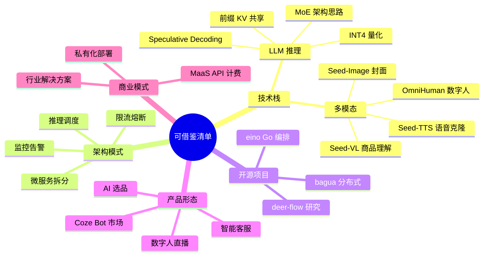

# 06 - 可借鉴清单（对 AI 直播平台的启示）

> 本章面向 `C:\skill\ai-live-platform\` 项目，提炼豆包体系中可直接复用的技术、架构、代码与商业模式。

## 1. 借鉴地图总览



## 2. LLM 推理：可直接复用的优化技术

### 2.1 借鉴清单

| 技术 | 豆包做法 | AI 直播平台应用 | 预期收益 |
|------|----------|-----------------|----------|
| MoE 架构 | Doubao-Pro 200B 总参 / 20B 激活 | 用 7B Lite 给 70B Pro 加速 | 推理成本 ↓ 60% |
| Speculative Decoding | Lite draft + Pro 验证 | 小模型先生成候选，大模型并行验证 | 延迟 ↓ 2-3x |
| PagedAttention | 字节自研 KV 管理 | 用 vLLM 替代自研 | 显存利用率 ↑ 4x |
| Continuous Batching | 动态调度 token | 用 vLLM 内置 | 吞吐 ↑ 2-4x |
| INT4 量化 | AWQ/GPTQ | 7B 模型从 14GB → 4GB | 显存 ↓ 70% |
| 前缀 KV 共享 | system prompt 复用 | 直播话术 prompt 复用 | TTFT ↓ 50% |
| 端侧推理 | 手机本地 7B | 直播伴侣本地辅助 | 实时响应 ↑ |

### 2.2 推理服务代码（vLLM 部署，借鉴豆包思路）

```python
# ai-live-platform/llm/inference_server.py
"""
借鉴豆包推理服务架构：
- Continuous Batching (vLLM 内置)
- 前缀 KV 共享（enable_prefix_caching=True）
- Speculative Decoding（小模型 draft）
- INT4 量化
"""
from vllm import LLM, SamplingParams
from vllm.model_executor.guided_decoding import Guides

# 1. 加载主模型（INT4 量化）
llm = LLM(
    model="Qwen2.5-7B-Instruct-AWQ",  # INT4 量化
    tensor_parallel_size=1,
    gpu_memory_utilization=0.9,
    enable_prefix_caching=True,         # 借鉴豆包：前缀 KV 共享
    enforce_eager=False,
    max_num_seqs=256,                  # Continuous Batching
    max_num_batched_tokens=8192,
)

# 2. 可选：Speculative Decoding（小模型 draft）
# llm = LLM(
#     model="Qwen2.5-7B-Instruct-AWQ",
#     speculative_model="Qwen2.5-0.5B-Instruct",
#     speculative_disable_by_batch_size=8,
#     use_speculative=True,
# )

# 3. 直播话术推理（共享 system prompt）
SYSTEM_PROMPT = """
你是 AI 直播平台的主播助手，负责：
1. 根据商品信息生成直播话术
2. 回答观众弹幕
3. 控制直播节奏
风格：活泼、亲切、有感染力。
"""

# 4. 批量推理（高吞吐）
prompts = [
    f"<|im_start|>system\n{SYSTEM_PROMPT}<|im_end|>\n"
    f"<|im_start|>user\n介绍这款口红<|im_end|>\n"
    f"<|im_start|>assistant\n",
    
    f"<|im_start|>system\n{SYSTEM_PROMPT}<|im_end|>\n"
    f"<|im_start|>user\n观众问：多少钱？<|im_end|>\n"
    f"<|im_start|>assistant\n",
]

sampling_params = SamplingParams(
    temperature=0.8,
    top_p=0.95,
    max_tokens=300,
)

outputs = llm.generate(prompts, sampling_params)
for output in outputs:
    print(output.outputs[0].text)
```

### 2.3 推理调度（借鉴字节 ByteScheduler）

```python
# ai-live-platform/llm/scheduler.py
"""
借鉴字节推理调度器：
- 模型路由（不同场景用不同模型）
- 优先级队列
- 限流 + 熔断
"""
import asyncio
from enum import Enum
from collections import defaultdict
import time

class Priority(Enum):
    VIP = 1       # 付费商家
    REALTIME = 2  # 直播实时弹幕
    BATCH = 3     # 批量任务
    ASYNC = 4     # 异步分析

class ModelRouter:
    """借鉴豆包：根据场景路由到不同模型"""
    
    def __init__(self):
        self.routes = {
            "realtime_danmu": "doubao-1-5-lite",        # Lite：低延迟
            "live_speech": "doubao-1-5-pro",             # Pro：高质量
            "title_generation": "doubao-1-5-pro",
            "comment_summary": "doubao-1-5-lite",
        }
    
    def get_model(self, scene: str) -> str:
        return self.routes.get(scene, "doubao-1-5-pro")

class InferenceScheduler:
    def __init__(self, max_concurrent=100):
        self.queues = defaultdict(asyncio.Queue)
        self.semaphore = asyncio.Semaphore(max_concurrent)
        self.metrics = {"success": 0, "fail": 0, "timeout": 0}
    
    async def submit(self, task, priority: Priority, scene: str):
        """提交推理任务"""
        async with self.semaphore:
            start = time.time()
            try:
                model = ModelRouter().get_model(scene)
                result = await asyncio.wait_for(
                    self._execute(task, model),
                    timeout=10.0,
                )
                self.metrics["success"] += 1
                return result
            except asyncio.TimeoutError:
                self.metrics["timeout"] += 1
                # 降级到 Lite 模型
                return await self._execute(task, "doubao-1-5-lite")
            except Exception as e:
                self.metrics["fail"] += 1
                raise
```

## 3. 多模态：数字人直播系统

### 3.1 借鉴清单

字节 OmniHuman 闭源，但可借鉴设计思路用开源方案实现：

```python
# ai-live-platform/digital_human/livestream_bot.py
"""
借鉴豆包数字人直播设计：
- 多模态协同：TTS + 数字人 + LLM
- 实时弹幕互动
- 商品库 + 话术库
"""
import asyncio
from dataclasses import dataclass

# 开源替代方案
from TTS.api import TTS as CoquiTTS        # CosyVoice / Edge-TTS 替代 Seed-TTS
# import edge_tts                            # 更简单的方案
import cv2
import numpy as np

@dataclass
class Product:
    id: str
    name: str
    price: float
    features: list

class LiveStreamAIBot:
    """
    借鉴豆包数字人直播架构
    使用开源替代实现
    """
    
    def __init__(
        self,
        anchor_image_path: str,           # 主播形象图
        tts_voice_sample: str,            # 5 秒参考音频
        llm_client,
        products: list[Product],
    ):
        # 1. TTS 模块（替代 Seed-TTS，用 CosyVoice / Edge-TTS）
        self.tts = CoquiTTS(
            model_name="tts_models/zh-CN/baker/tacotron2-DDC-GST",
            # 或用 edge-tts 更简单
        )
        self.tts_voice_sample = tts_voice_sample
        
        # 2. 数字人动画（替代 OmniHuman，用 SadTalker / MuseTalk）
        self.anchor_image = cv2.imread(anchor_image_path)
        # self.talking_head = SadTalker(...)
        # self.lip_sync = Wav2Lip(...)
        
        # 3. LLM 对话（用豆包 API 或本地模型）
        self.llm = llm_client
        
        # 4. 商品库
        self.products = {p.id: p for p in products}
        
        # 5. 人设 prompt
        self.system_prompt = f"""
        你是 TikTok Shop 直播带货主播，活泼亲切，节奏快。
        商品库：{[f'{p.id}: {p.name} {p.price}元' for p in products]}
        """
    
    async def on_comment(self, comment: str, username: str) -> str:
        """处理弹幕（借鉴豆包实时交互）"""
        # Step 1: LLM 生成回复
        reply_text = await self.llm.generate(
            system=self.system_prompt,
            user=f"{username}: {comment}",
            temperature=0.8,
        )
        
        # Step 2: TTS 合成语音
        audio = self.tts.tts(text=reply_text)
        # audio = await edge_tts.async Communicate(text, "zh-CN-XiaoxiaoNeural")
        
        # Step 3: 数字人动画
        # video_clip = self.talking_head.generate(
        #     image=self.anchor_image,
        #     audio=audio,
        # )
        # video_clip = self.lip_sync.sync(video_clip, audio)
        
        # Step 4: 推流（RTMP 到抖音/快手/淘宝）
        # await self.push_to_rtmp(video_clip)
        
        return reply_text
    
    async def periodic_promotion(self):
        """周期性主动推销（每 30 秒）"""
        while True:
            product = self._pick_product()
            prompt = f"主动推销商品 {product.name}，强调 {product.features[0]}"
            speech_text = await self.llm.generate(
                system=self.system_prompt,
                user=prompt,
                temperature=0.9,
            )
            await self.speak(speech_text)
            await asyncio.sleep(30)
    
    def _pick_product(self):
        """简单轮询商品"""
        # 实际生产中应该用策略选择（销量/库存/转化率）
        return list(self.products.values())[hash(time.time()) % len(self.products)]
```

### 3.2 简化版（用 edge-tts）

```python
# ai-live-platform/digital_human/simple_bot.py
"""
最简版数字人直播：edge-tts + 静态图 + 文字弹幕
适合 MVP 快速验证
"""
import asyncio
import edge_tts

class SimpleAIBot:
    def __init__(self, llm_client):
        self.llm = llm_client
    
    async def speak(self, text: str, voice="zh-CN-XiaoxiaoNeural"):
        """用 edge-tts 合成语音（免费，效果不错）"""
        communicate = edge_tts.Communicate(text, voice)
        await communicate.save("output.mp3")
        return "output.mp3"
    
    async def on_comment(self, comment: str):
        # 1. LLM 生成回复
        reply = await self.llm.generate(
            system="你是 TikTok Shop 直播主播，活泼亲切",
            user=comment,
        )
        
        # 2. TTS
        audio_path = await self.speak(reply)
        
        # 3. 实际生产中：数字人 + 推流
        return reply, audio_path
```

## 4. Agent 编排：借鉴 Coze + eino

### 4.1 借鉴清单

| 字节方案 | AI 直播平台对应 |
|----------|----------------|
| Coze 零代码 Bot | 提供可视化工作流编辑器给商家 |
| Function Calling | 客服 Agent 对接订单/物流系统 |
| RAG 知识库 | 商品手册 + FAQ 自动问答 |
| Workflow 编排 | 直播流程编排（开场/促销/收尾） |
| eino Go 框架 | 高并发 Agent 后端 |
| deer-flow | 选品深度研究 |

### 4.2 智能客服 Agent（Go + eino）

```go
// ai-live-platform/agent/customer_service.go
// 借鉴字节 eino 框架
package main

import (
    "context"
    "github.com/cloudwego/eino/compose"
    "github.com/cloudwego/eino/components/model"
)

// 商品查询 Tool
type ProductQueryTool struct{}

func (p *ProductQueryTool) Name() string { return "query_product" }
func (p *ProductQueryTool) Description() string {
    return "查询商品信息，包括价格、库存、卖点"
}
func (p *ProductQueryTool) Call(ctx context.Context, args map[string]any) (string, error) {
    keyword := args["keyword"].(string)
    // 查商品数据库
    return `{"id":"P001","name":"口红","price":99}`, nil
}

// 订单查询 Tool
type OrderQueryTool struct{ /* ... */ }

// RAG 检索 Tool
type KnowledgeRetrieval struct {
    vectorDB VectorDB
    embedder Embedder
}

func (k *KnowledgeRetrieval) Name() string { return "search_knowledge" }
func (k *KnowledgeRetrieval) Description() string {
    return "在知识库中检索商品手册、FAQ 等信息"
}
func (k *KnowledgeRetrieval) Call(ctx context.Context, args map[string]any) (string, error) {
    query := args["query"].(string)
    // 1. Embedding
    embedding := k.embedder.Embed(query)
    // 2. 检索 Top-K
    chunks := k.vectorDB.Search(embedding, 5)
    // 3. 格式化返回
    return formatChunks(chunks), nil
}

// 构建客服 Agent
func BuildCustomerServiceAgent(llm model.ChatModel) compose.Runnable {
    g := compose.NewGraph[map[string]any]()
    
    // 添加工具节点
    g.AddToolNode("product_tool", &ProductQueryTool{})
    g.AddToolNode("order_tool", &OrderQueryTool{})
    g.AddToolNode("knowledge_tool", &KnowledgeRetrieval{})
    
    // LLM 决策节点
    g.AddChatModelNode("decision", llm, compose.WithTools([]string{
        "product_tool", "order_tool", "knowledge_tool",
    }))
    
    // 连接
    g.AddEdge(compose.START, "decision")
    g.AddBranch("decision", compose.NewBranchFunc(
        func(ctx context.Context, msg *model.Message) (string, error) {
            if len(msg.ToolCalls) > 0 {
                return msg.ToolCalls[0].Function.Name, nil
            }
            return compose.END, nil
        },
        map[string]string{
            "product_tool": "product_tool",
            "order_tool": "order_tool",
            "knowledge_tool": "knowledge_tool",
            compose.END: compose.END,
        },
    ))
    
    // 工具结果回到 LLM
    g.AddEdge("product_tool", "decision")
    g.AddEdge("order_tool", "decision")
    g.AddEdge("knowledge_tool", "decision")
    
    runner, _ := g.Compile(context.Background())
    return runner
}
```

### 4.3 选品研究 Agent（Python + deer-flow 风格）

```python
# ai-live-platform/agent/selection_agent.py
"""
借鉴 deer-flow：多 Agent 协作做选品深度研究
"""
from typing import List
import asyncio

class SelectionResearchAgent:
    def __init__(self, llm_client):
        self.llm = llm_client
    
    async def research_category(self, category: str, market: str = "US"):
        """研究某个品类的选品机会"""
        
        # Step 1: Planner - 拆解研究任务
        plan = await self.llm.generate(
            system="你是选品研究规划师",
            user=f"规划研究 {category} 类目在 {market} 市场的 5 个关键问题",
        )
        questions = self._parse_questions(plan)
        
        # Step 2: Parallel Research - 并行研究多个问题
        research_tasks = [self._research_question(q, category, market) for q in questions]
        research_results = await asyncio.gather(*research_tasks)
        
        # Step 3: Synthesizer - 综合分析
        synthesis = await self.llm.generate(
            system="你是选品分析专家",
            user=f"综合以下研究结果，给出选品建议：\n{research_results}",
        )
        
        # Step 4: Reporter - 生成结构化报告
        report = await self.llm.generate(
            system="你是 TikTok Shop 选品报告撰写专家",
            user=f"基于综合分析生成 Markdown 报告：\n{synthesis}",
        )
        
        return report
    
    async def _research_question(self, question, category, market):
        """单个问题的研究"""
        # 实际生产中应配合搜索工具
        return await self.llm.generate(
            system=f"你是 {market} 市场研究员",
            user=f"针对 {category} 类目，研究：{question}",
        )
    
    def _parse_questions(self, plan_text):
        """解析问题列表"""
        return [line.strip("- ").strip() for line in plan_text.split("\n") if line.strip().startswith("-")]
```

## 5. 商业模式：MaaS + 行业方案

### 5.1 字节 MaaS 模式

```
字节 MaaS 商业模式
├── API 按量付费
│   ├── 输入 token 计费
│   ├── 输出 token 计费
│   └── 多模态按次/按时长
├── 套餐订阅
│   ├── 个人开发者免费额度
│   ├── 企业包月/年
│   └── 大客户定制
├── 私有化部署
│   ├── 一体机（GPU 服务器）
│   ├── 软件许可（按节点/按 QPS）
│   └── 维保服务
└── 解决方案
    ├── 电商（智能客服/数字人/选品）
    ├── 教育（AI 教师/作业批改）
    ├── 金融（风控/智能投顾）
    └── 政企（知识库/文档分析）
```

### 5.2 AI 直播平台的定价参考

```python
# ai-live-platform/billing/pricing.py
"""
借鉴字节火山引擎定价策略
"""
from dataclasses import dataclass
from enum import Enum

class Tier(Enum):
    FREE = "free"
    STARTER = "starter"
    PRO = "pro"
    ENTERPRISE = "enterprise"

@dataclass
class PricingPlan:
    name: str
    monthly_price: float  # 元
    api_calls: int       # 每月免费调用次数
    features: list

PLANS = {
    Tier.FREE: PricingPlan(
        name="免费版",
        monthly_price=0,
        api_calls=1000,
        features=[
            "基础 LLM 调用",
            "1 个数字人形象",
            "100 分钟/月 直播合成",
            "社区支持",
        ],
    ),
    Tier.STARTER: PricingPlan(
        name="创业版",
        monthly_price=299,
        api_calls=50000,
        features=[
            "全部 LLM 模型",
            "3 个数字人形象",
            "1000 分钟/月 直播合成",
            "邮件支持",
        ],
    ),
    Tier.PRO: PricingPlan(
        name="专业版",
        monthly_price=999,
        api_calls=300000,
        features=[
            "全部 LLM + 多模态",
            "10 个数字人形象",
            "10000 分钟/月 直播合成",
            "高级客服 Agent",
            "电话支持",
        ],
    ),
    Tier.ENTERPRISE: PricingPlan(
        name="企业版",
        monthly_price=0,  # 议价
        api_calls=-1,     # 不限
        features=[
            "私有化部署",
            "定制模型微调",
            "无限调用",
            "SLA 99.9%",
            "专属客户经理",
        ],
    ),
}

# API 按量计费（参考豆包定价）
API_PRICING = {
    "doubao-1-5-pro": {"input": 0.0008, "output": 0.002},     # 元/千 token
    "doubao-1-5-lite": {"input": 0.0003, "output": 0.0006},
    "doubao-embedding": {"input": 0.0005, "output": 0},
    "seed-tts": {"price": 0.02},                              # 元/千字符
    "seed-vision": {"price": 0.005},                          # 元/张图
}
```

## 6. 火山引擎 API 直接集成

### 6.1 AI 直播平台可用的字节 API

```python
# ai-live-platform/integrations/volcengine.py
"""
火山引擎 API 集成清单
"""
from volcenginesdkarkruntime import Ark

# 1. LLM 调用（豆包 Pro）
def chat_with_doubao(messages, model="doubao-1-5-pro"):
    client = Ark(api_key=os.getenv("ARK_API_KEY"))
    response = client.chat.completions.create(
        model=model,
        messages=messages,
        temperature=0.7,
    )
    return response.choices[0].message.content

# 2. Embedding（用于商品检索 / RAG）
def get_embedding(text: str):
    client = Ark(api_key=os.getenv("ARK_API_KEY"))
    response = client.embeddings.create(
        model="doubao-embedding",
        input=text,
    )
    return response.data[0].embedding

# 3. 视觉理解（用于商品图分析）
def analyze_image(image_url: str, prompt: str):
    client = Ark(api_key=os.getenv("ARK_API_KEY"))
    response = client.chat.completions.create(
        model="doubao-1-5-vision-pro",
        messages=[{
            "role": "user",
            "content": [
                {"type": "image_url", "image_url": {"url": image_url}},
                {"type": "text", "text": prompt},
            ]
        }],
    )
    return response.choices[0].message.content

# 4. Function Calling（用于客服 Agent）
TOOLS = [
    {
        "type": "function",
        "function": {
            "name": "query_product",
            "description": "查询商品信息",
            "parameters": {
                "type": "object",
                "properties": {
                    "keyword": {"type": "string"},
                },
                "required": ["keyword"],
            },
        },
    },
]

def chat_with_tools(messages):
    client = Ark(api_key=os.getenv("ARK_API_KEY"))
    response = client.chat.completions.create(
        model="doubao-1-5-pro",
        messages=messages,
        tools=TOOLS,
        tool_choice="auto",
    )
    return response
```

## 7. 技术选型建议

### 7.1 LLM 推理引擎

| 场景 | 推荐 | 理由 |
|------|------|------|
| 高并发在线（>100 QPS）| vLLM | 开源、稳定、社区强 |
| 超低延迟（<50ms TTFT）| TensorRT-LLM | NVIDIA 优化极致 |
| GPU 资源受限 | llama.cpp + 量化 | CPU 也能跑 |
| 字节生态深度集成 | Doubao API | 价格低、中文好 |

### 7.2 Agent 框架

| 场景 | 推荐 | 理由 |
|------|------|------|
| Python 快速开发 | LangChain | 生态最广 |
| 高性能 Go 后端 | eino | 类型安全、性能强 |
| Deep Research | deer-flow | 多 Agent 协作 |
| 零代码平台 | Coze/扣子 | 给商家用 |

### 7.3 数字人方案

| 需求 | 推荐 | 备注 |
|------|------|------|
| 极致质量（预算充足）| OmniHuman 字节 API | 闭源，效果最好 |
| 平衡方案（开源）| SadTalker + Wav2Lip + Edge-TTS | 质量中等，可控 |
| 实时性优先 | Wav2Lip + Edge-TTS | CPU 实时 |
| 端侧 | MediaPipe + 简单动画 | 低成本 |

## 8. 数据飞轮与持续优化

### 8.1 借鉴字节的反馈循环

```
┌──────────────────────────────────────────────┐
│           数据飞轮（借鉴字节 AI 电商）            │
│                                               │
│   用户互动数据 → 标注 → 微调 → 新版本模型       │
│        ↑                            │         │
│        └────────────────────────────┘         │
│                                               │
│   具体场景：                                   │
│   - 直播弹幕 → 用户偏好 → 推荐优化              │
│   - 客服对话 → 知识库扩充 → RAG 改进           │
│   - 数字人视频 → 转化率 → 话术优化              │
└──────────────────────────────────────────────┘
```

### 8.2 微调示例（LoRA）

```python
# ai-live-platform/training/lora_finetune.py
"""
借鉴字节模型迭代：用 LoRA 微调专属话术风格
"""
from peft import LoraConfig, get_peft_model
from transformers import AutoModelForCausalLM, AutoTokenizer
from trl import SFTTrainer

# 1. 加载基座模型
model = AutoModelForCausalLM.from_pretrained("Qwen2.5-7B-Instruct")
tokenizer = AutoTokenizer.from_pretrained("Qwen2.5-7B-Instruct")

# 2. LoRA 配置
lora_config = LoraConfig(
    r=16,                       # LoRA rank
    lora_alpha=32,
    target_modules=["q_proj", "k_proj", "v_proj", "o_proj"],
    lora_dropout=0.05,
    bias="none",
    task_type="CAUSAL_LM",
)
model = get_peft_model(model, lora_config)

# 3. 训练数据：直播话术 + 弹幕对话
# data = [
#     {"instruction": "介绍口红", "output": "姐妹们看这款口红..."},
#     {"instruction": "回答价格问题", "output": "今天直播间专享价只要..."},
# ]

# 4. SFT 训练
trainer = SFTTrainer(
    model=model,
    train_dataset=data,  # 实际数据
    tokenizer=tokenizer,
    args=TrainingArguments(
        output_dir="./lora-douyin-streamer",
        num_train_epochs=3,
        per_device_train_batch_size=4,
        learning_rate=2e-4,
    ),
)

trainer.train()
```

## 9. 监控与可观测性

### 9.1 借鉴字节的监控体系

```python
# ai-live-platform/monitoring/metrics.py
"""
借鉴字节推理服务的可观测性
"""
from prometheus_client import Counter, Histogram, Gauge

# 1. 推理请求指标
llm_requests = Counter(
    "llm_requests_total",
    "Total LLM requests",
    ["model", "scene", "status"]
)

# 2. 延迟分布
llm_latency = Histogram(
    "llm_latency_seconds",
    "LLM inference latency",
    ["model", "scene"],
    buckets=[0.05, 0.1, 0.2, 0.5, 1.0, 2.0, 5.0]
)

# 3. TTFT（首 token 延迟）
llm_ttft = Histogram(
    "llm_ttft_seconds",
    "Time to first token",
    ["model"],
    buckets=[0.05, 0.1, 0.2, 0.5, 1.0]
)

# 4. Token 吞吐
llm_tokens = Counter(
    "llm_tokens_total",
    "Total tokens generated",
    ["model", "type"]  # type: input/output
)

# 5. GPU 利用率
gpu_utilization = Gauge(
    "gpu_utilization_percent",
    "GPU utilization",
    ["gpu_id"]
)

# 6. KV Cache 命中率
kv_cache_hit = Counter(
    "kv_cache_hits_total",
    "KV cache hits",
    ["model"]
)
```

## 10. 立即可执行清单

### 10.1 MVP 阶段（1-2 周）

- [ ] 接入豆包 API 作为主 LLM（解决冷启动）
- [ ] 用 edge-tts 实现语音合成
- [ ] 用 Coze 验证工作流设计
- [ ] 部署 vLLM（备用推理引擎）

### 10.2 进阶阶段（1-2 月）

- [ ] 用 SadTalker + Wav2Lip 实现数字人
- [ ] 搭建 RAG 知识库（豆包 Embedding + Qdrant）
- [ ] 智能客服 Agent（Function Calling）
- [ ] 内容生成工作流（标题/封面/脚本）

### 10.3 规模阶段（3-6 月）

- [ ] 自研/微调行业模型（LoRA）
- [ ] 多模态全链路（图像/语音/视频）
- [ ] 私有化部署方案
- [ ] 监控 + 数据飞轮

## 11. 关键洞察

1. **豆包是性价比之选**：API 价格仅为 GPT-4 的 1/10，中文能力强
2. **多模态是标配**：纯 LLM 时代已过，语音/视觉/视频都要有
3. **Agent 是入口**：Function Calling + RAG + Workflow 三大支柱
4. **数字人直播是杀手锏**：24h 自动直播直接降本 70%
5. **eino 是 Go 生态首选**：性能 + 类型安全，适合生产
6. **deer-flow 适合选品**：Deep Research 对运营决策极有价值
7. **MoE 是大模型主流**：未来 200B+ 模型都将是 MoE 架构
8. **数据飞轮决定上限**：模型只是起点，数据闭环才是壁垒

## 12. 参考资料

- 火山引擎豆包产品页：<https://www.volcengine.com/product/doubao>
- 火山引擎方舟 ARK：<https://www.volcengine.com/product/ark>
- Coze 国内版：<https://www.coze.cn/>
- Coze 国际版：<https://www.coze.com/>
- eino GitHub：<https://github.com/cloudwego/eino>
- deer-flow GitHub：<https://github.com/bytedance/deer-flow>
- 字节开源列表：<https://github.com/bytedance>
- vLLM：<https://github.com/vllm-project/vllm>
- llama.cpp：<https://github.com/ggerganov/llama.cpp>
- edge-tts：<https://github.com/rany2/edge-tts>
- SadTalker：<https://github.com/OpenTalker/SadTalker>
- Wav2Lip：<https://github.com/Rudrabha/Wav2Lip>
- CosyVoice：<https://github.com/FunAudioLLM/CosyVoice>
- AI 直播平台项目：<C:\skill\ai-live-platform\>

---

> **调研完成**。所有 7 个文件已写入 `G:\Obsidian Vault\Projects\platforms-architecture\doubao\`。后续可基于本调研在 AI 直播平台项目中逐项落地。