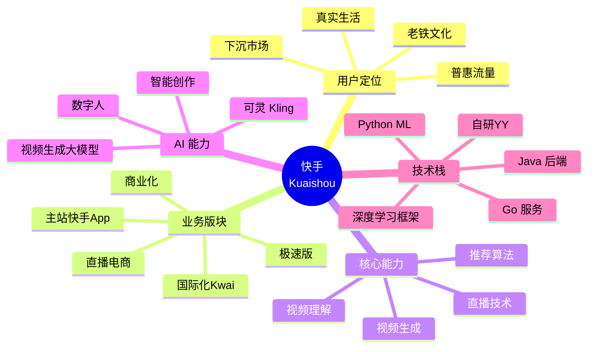

# 快手 (Kuaishou) 技术架构深度调研

> 调研对象：快手科技 (Kuaishou Technology)
> 调研维度：整体架构 / 推荐系统 / 直播电商 / AI 能力 / 可灵 AI
> 调研者：跨境电商 + AI 直播平台开发者
> 关联项目：[[00-总索引]] / [[douyin-architecture/00-索引]] / [[shipinhao/00-索引]]

## 章节导航

| # | 章节 | 核心问题 | 行数 |
|---|------|----------|------|
| 00 | [00-索引](00-索引.md) | 总览与导航 | - |
| 01 | [01-整体架构与快手技术栈](01-整体架构与快手技术栈.md) | Java + Go + Python 技术栈、数据规模、开源 | 350+ |
| 02 | [02-推荐系统与下沉市场](02-推荐系统与下沉市场.md) | 老铁经济 + 算法去中心化、流量普惠 | 450+ |
| 03 | [03-直播电商与信任电商](03-直播电商与信任电商.md) | 直播带货、源头好物、信任电商闭环 | 350+ |
| 04 | [04-AI能力与可灵AI](04-AI能力与可灵AI.md) | 可灵视频生成 + AI 数字人 | 350+ |
| 05 | [05-可借鉴清单](05-可借鉴清单.md) | 对 AI 直播平台 / TikTok Shop 的可借鉴点 | 350+ |
| 06 | [06-快手音视频与直播架构](06-快手音视频与直播架构.md) | 自研YY、CDN、播放器 | 1500+ |
| 07 | [07-快手推荐与搜索源码](07-快手推荐与搜索源码.md) | 召回/粗排/精排/重排源码 | 1800+ |
| 08 | [08-快手直播电商源码深度解读](08-快手直播电商源码深度解读.md) | 房间/IM/CDN/小黄车/优选联盟/数字人源码 | 3400+ |

## 快手核心定位

## 关键数据 (2024-2025)

| 指标 | 数据 | 来源 |
|------|------|------|
| 快手主站 DAU | 4 亿+ | 2024 Q3 财报 |
| 快手主站 MAU | 7 亿+ | 2024 Q3 财报 |
| 极速版 DAU | 2 亿+ | 财报 |
| 总电商 GMV | 高速增长 | 财报 |
| 直播收入 | 占比下降 (电商分流) | 财报 |
| 可灵 AI 用户 | 快速增长 | 快手财报 |

> 数据来源：快手科技 (1024.HK) 季度财报

## 快手 vs 抖音核心差异

| 维度 | 快手 | 抖音 |
|------|------|------|
| 用户 | 下沉、真实、老铁 | 全年龄段、城市化 |
| 算法哲学 | 普惠、去中心化 | 中心化、爆款逻辑 |
| 关注分发 | 强 | 中等 |
| 私域沉淀 | 强 (老铁文化) | 中 |
| 直播电商 | 信任电商 | 兴趣电商 |
| 内容调性 | 真实生活 | 精品化 |
| 国际版 | Kwai | TikTok |

## 调研方法

- 快手技术博客 (https://tech.kuaishou.com/)
- 快手开源 (https://github.com/KwaiAppTeam)
- KDD / SIGIR / RecSys 论文
- 快手财报披露
- 行业报道 (36氪 / 晚点 LatePost)
- 可灵 AI 官方文档 (klingai.com)

## 调研者关切

1. **下沉市场**：快手如何在三线城市以下做到高 DAU
2. **老铁经济**：粉丝-主播的强信任关系如何形成
3. **推荐算法**：去中心化、普惠分发如何实现
4. **直播电商**：信任电商如何闭环
5. **可灵 AI**：视频生成大模型如何服务快手生态
6. **AI 直播平台可借鉴**：算法哲学、用户运营、技术架构

## 关联文档

- [[douyin-architecture/00-索引]] - 抖音算法架构
- [[shipinhao/00-索引]] - 视频号架构
- [[xiaohongshu/00-索引]] - 小红书架构
- [[../AI直播平台/_index]] - AI 直播平台项目
- [[../TK跨境电商/_index]] - TikTok Shop 跨境业务