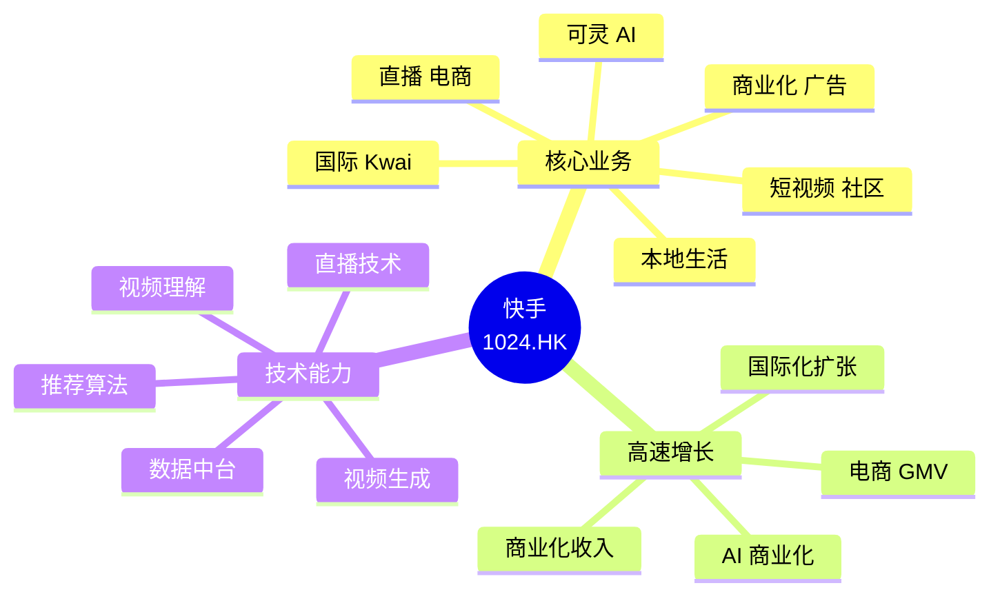
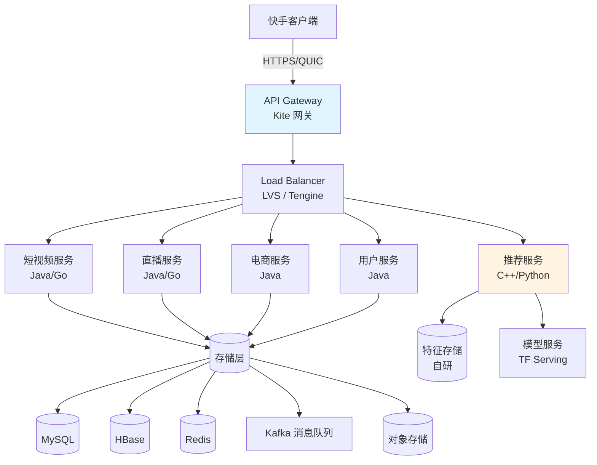
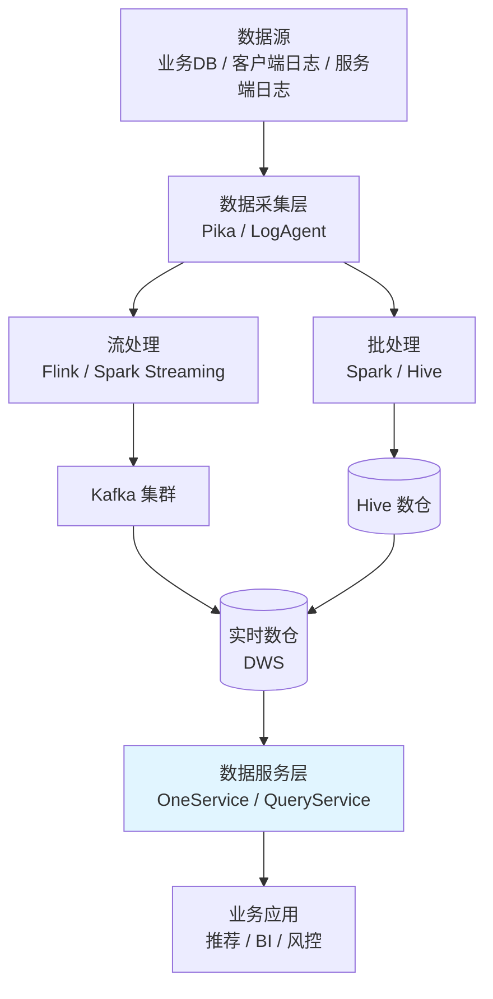
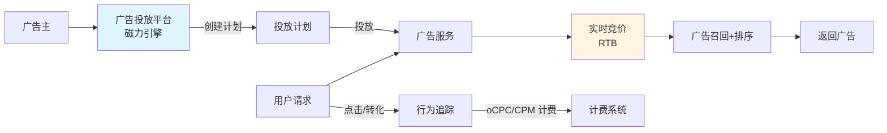

# 01 - 快手整体架构与快手技术栈

## 一、快手公司概览

### 1.1 公司基本面

快手科技 (Kuaishou Technology) 2011 年成立，最初是 GIF 工具 (快手 GIF)，2013 年转型短视频社区，2021 年 2 月在港股上市 (1024.HK)，市值最高峰 1.7 万亿港元。



### 1.2 业务版块

| 版块 | 说明 | 用户量级 |
|------|------|----------|
| 快手 App | 主站，下沉社区 | 4 亿+ DAU |
| 极速版 | 下沉专属，看视频赚钱 | 2 亿+ DAU |
| Kwai | 海外版 (巴西/东南亚等) | 数千万 DAU |
| Snack Video | 海外版 (东南亚/中东) | 数千万 DAU |
| 可灵 AI | 视频生成 App | 快速增长 |
| 商业化 | 广告 + 电商 | 高营收 |
| 本地生活 | 新业务 | 起步 |

### 1.3 关键数据 (2024-2025)

| 指标 | 数据 | 备注 |
|------|------|------|
| 总 DAU | 4 亿+ (含极速版) | 2024 Q3 |
| 总 MAU | 7 亿+ | 2024 Q3 |
| 日均使用时长 | 120+ 分钟 | 行业领先 |
| 日均上传视频 | 数千万 | 创作者活跃 |
| 电商 GMV | 万亿规模 | 持续增长 |
| 广告收入 | 主要营收 | 高速增长 |
| 直播收入 | 占比下降 | 电商分流 |

## 二、快手整体技术架构

### 2.1 客户端架构

快手是**独立 App** 模式 (与视频号嵌入微信不同)，技术栈相对成熟：

```
┌────────────────────────────────────────────┐
│            快手 App 客户端                    │
├────────────────────────────────────────────┤
│                                              │
│  ┌────────────────────────────────────┐     │
│  │  Android (Java/Kotlin + Native C++)  │     │
│  └────────────────────────────────────┘     │
│                                              │
│  ┌────────────────────────────────────┐     │
│  │  iOS (Objective-C / Swift + C++)     │     │
│  └────────────────────────────────────┘     │
│                                              │
│  核心模块:                                    │
│   - 视频播放器 (自研 KPlayer)                  │
│   - 推流 SDK (Kuaishou Live SDK)              │
│   - 录制/编辑器 (KwaiCut)                     │
│   - 滤镜 SDK (自研 GPU/算法)                  │
│   - 网络库 (长连接 + HTTP/3)                  │
│   - 埋点 SDK                                 │
│                                              │
└────────────────────────────────────────────┘
            │
            ▼ (HTTPS / QUIC / WebSocket)
   ┌─────────────────────────────────────┐
   │         快手后台服务集群              │
   └─────────────────────────────────────┘
```

### 2.2 后端服务架构



### 2.3 关键技术栈选型

快手的技术栈以**多语言混合**为特点：

| 层次 | 技术选型 | 说明 |
|------|---------|------|
| **客户端** | Android (Java/Kotlin), iOS (OC/Swift) | 主流移动端 |
| **后端主语言** | Java (Spring), Go | 主力 |
| **算法** | Python, C++ | 训练 C++, 服务 Python/C++ |
| **RPC** | kRPC (自研), Thrift, gRPC | 多协议 |
| **消息队列** | Kafka, RocketMQ | 通用 |
| **数据库** | MySQL, HBase, RocksDB | 多种 |
| **缓存** | Redis, Memcached, Aerospike | 多种 |
| **搜索引擎** | Elasticsearch | 通用 |
| **深度学习** | TensorFlow, PyTorch | 双框架 |
| **深度学习平台** | 自研 YY 平台 | 分布式训练 |
| **流处理** | Flink, Spark Streaming | 实时计算 |
| **容器化** | Kubernetes | 主流 |
| **服务网格** | Istio | 部分服务 |
| **监控** | Prometheus + Grafana + 自研 | 立体化 |
| **CDN** | 自建 + 第三方混合 | 多 CDN |

### 2.4 快手 vs 字节跳动技术栈对比

| 维度 | 快手 | 字节跳动 |
|------|------|----------|
| 后端主语言 | Java + Go | Go + Python + C++ |
| RPC | kRPC / Thrift | Kitex (自研) |
| 消息队列 | Kafka | Kafka |
| 数据库 | MySQL / HBase | MySQL / TiDB |
| 深度学习 | TensorFlow + PyTorch | PyTorch (主要) |
| 训练平台 | 自研 YY (基于 TF) | 自研 BytePS |
| 推荐框架 | 自研多套 | 字节自研 |
| 监控 | 自研 + 开源 | 自研 (火山引擎) |
| 服务网格 | 部分 Istio | 自研微服务 |

## 三、快手数据规模

### 3.1 用户数据

| 指标 | 数据 |
|------|------|
| 快手主站 DAU | 4 亿+ |
| 极速版 DAU | 2 亿+ |
| 总 MAU | 7 亿+ |
| 日均使用时长 | 120+ 分钟 |
| 日均上传视频 | 数千万 |
| 月活创作者 | 数千万 |
| 月开播主播 | 数百万 |

### 3.2 内容数据

| 指标 | 数据 |
|------|------|
| 累计视频数 | 数百亿级 |
| 日新增视频 | 数千万 |
| 直播场次 | 数千万/日 |
| 短视频日播放 | 千亿级 |
| 直播日观看 | 百亿级 |

### 3.3 电商数据

| 指标 | 数据 |
|------|------|
| 电商 GMV | 万亿规模 (年度) |
| 月度 GMV | 千亿级 |
| 商家数 | 数百万 |
| 买家数 | 数亿 |
| 客单价 | 中等 (下沉市场) |
| 复购率 | 高 (信任电商) |

## 四、快手开源项目

快手在 GitHub 上维护了多个高质量开源项目 (github.com/KwaiAppTeam)：

### 4.1 主要开源项目

| 项目 | 说明 | GitHub |
|------|------|--------|
| **KConf** | 配置中心 | github.com/KwaiAppTeam/KConf |
| **KLog** | 日志库 | github.com/KwaiAppTeam/KLog |
| **KOOM** | 移动端 OOM 监控 | github.com/KwaiAppTeam/KOOM |
| **KCache** | 缓存库 | github.com/KwaiAppTeam/KCache |
| **Kratos** | Go 微服务框架 | github.com/go-kratos/kratos |
| **Kitex** | (字节开源，快手类似) | - |
| **Breeze** | 流处理框架 | github.com/KwaiAppTeam/Breeze |
| **Yolk** | 分布式训练框架 | github.com/KwaiAppTeam/Yolk |
| **KairosDB** | 时序数据库 (基于 HBase) | - |

### 4.2 重要开源项目详解

#### 4.2.1 Kratos - Go 微服务框架

```go
// Kratos 框架核心组件
// github.com/go-kratos/kratos
import (
    "github.com/go-kratos/kratos/v2"
    "github.com/go-kratos/kratos/v2/transport/grpc"
    "github.com/go-kratos/kratos/v2/transport/http"
)

func main() {
    // HTTP 服务
    httpSrv := http.NewServer(
        http.Address(":8000"),
        http.Middleware(middleware...),
    )
    
    // gRPC 服务
    grpcSrv := grpc.NewServer(
        grpc.Address(":9000"),
        grpc.Middleware(middleware...),
    )
    
    app := kratos.New(
        kratos.Name("helloworld"),
        kratos.Server(httpSrv, grpcSrv),
    )
    
    app.Run()
}
```

Kratos 在国内 Go 微服务框架领域是 Top 3，与字节 Kitex、腾讯 Tars 并列。

#### 4.2.2 KOOM - 移动端 OOM 监控

```kotlin
// KOOM 监控 App OOM
// github.com/KwaiAppTeam/KOOM
// 特点：高性能 leakCanary 替代品，Android OOM 检测
class MyApplication : Application() {
    override fun onCreate() {
        super.onCreate()
        // 启用 KOOM 监控
        KOOMInstaller.install(this, config {
            // 上报 endpoint
            monitorMode = MonitorMode.FULL
            // 触发 dump 的内存阈值
            heapThreshold = 0.9f
        })
    }
}
```

KOOM 是快手开源的最有影响力的项目之一，在 Android 开发者中广泛使用。

#### 4.2.3 KConf - 配置中心

```go
// KConf 使用示例
import "github.com/KwaiAppTeam/KConf"

// 初始化
kc := kconf.NewKConf("config.zk.host:2181")

// 读取配置
val := kc.GetInt("service.timeout")
str := kc.GetString("app.name")

// 监听配置变更
kc.Watch("service.timeout", func(key string, value interface{}) {
    log.Printf("config changed: %s = %v", key, value)
})
```

## 五、快手数据中台

### 5.1 数据中台架构



### 5.2 实时数仓架构

```
实时数据流:
1. 客户端埋点 → LogAgent → Kafka
2. 服务端日志 → Filebeat → Kafka
3. 业务 DB → Canal → Kafka
4. Kafka → Flink → 实时数仓 (DWD/DWS)
5. 实时数仓 → Redis (KV 服务) → 业务查询
6. 实时数仓 → Druid/ClickHouse (OLAP) → BI
```

### 5.3 离线数仓

```
离线数仓分层:
├── ODS (Operational Data Store): 原始数据
├── DWD (Data Warehouse Detail): 明细层
├── DWS (Data Warehouse Summary): 汇总层
├── ADS (Application Data Service): 应用层
└── DIM (Dimension): 维度层

数据建模: 维度建模 + Data Vault
调度: 自研 + Airflow
查询: Presto / Trino / ClickHouse
```

## 六、商业化引擎

### 6.1 商业化业务版块

```
快手商业化
├── 广告
│   ├── 信息流广告 (短视频)
│   ├── 直播广告
│   ├── 开屏广告
│   └── 品牌广告 (挑战赛 / 话题)
├── 电商
│   ├── 快手小店
│   ├── 选品中心 (好物联盟)
│   ├── 直播电商
│   └── 短视频带货
├── 本地生活 (新)
│   ├── 同城团购
│   ├── 到店核销
│   └── 商家服务
└── 商业化中台
    ├── 用户画像
    ├── 广告投放系统
    ├── 营销工具
    └── 数据洞察
```

### 6.2 广告投放系统



### 6.3 磁力引擎 (Magneto)

磁力引擎是快手商业化品牌，提供广告投放、营销、数据洞察服务：

```
磁力引擎能力:
├── 磁力金牛 (电商投放)
├── 磁力聚星 (达人合作)
├── 磁力万象 (DMP/CDP)
├── 磁力快创 (创意工具)
└── 磁力追投 (再营销)
```

## 七、快手云 (Kwai Cloud) / 内部基础设施

### 7.1 自研基础设施

快手重度自研基础设施，主要包括：

| 组件 | 自研 | 说明 |
|------|------|------|
| 分布式存储 | ✓ | 自研 HBase + 自研对象存储 |
| 分布式 KV | ✓ | Aerospike + 自研 |
| RPC 框架 | ✓ | kRPC |
| 配置中心 | ✓ | KConf |
| 服务网格 | ✓ | 自研 |
| 监控系统 | ✓ | 自研 + Prometheus |
| 训练平台 | ✓ | YY (基于 TF) |
| 流处理 | ✓ | Breeze |
| 数据库 | ✗ | MySQL (深度改造) |

### 7.2 自研分布式 KV 案例：KCache

```java
// 快手自研 KCache 简化版使用
public class KCacheExample {
    public static void main(String[] args) {
        KCacheClient client = new KCacheClient("config/cache.conf");
        
        // 基础 KV
        client.set("user:1001:age", "25");
        String age = client.get("user:1001:age");
        
        // 批量操作
        client.mset(Arrays.asList("k1", "v1", "k2", "v2"));
        
        // 计数器
        client.incr("video:view:count");
        
        // 二级索引
        client.zadd("user:1001:like_videos", 1234567890L, "video_xxx");
        Set<String> topLiked = client.zrevrange("user:1001:like_videos", 0, 99);
    }
}
```

## 八、快手技术团队

### 8.1 组织结构

```
快手 CTO
├── 基础平台部
│   ├── 存储团队
│   ├── 计算团队
│   ├── 大数据团队
│   └── 运维/SRE
├── 推荐架构部
│   ├── 召回工程
│   ├── 排序工程
│   └── 特征工程
├── 应用研发部
│   ├── 主站研发
│   ├── 直播研发
│   ├── 电商研发
│   └── 商业化研发
├── 算法部
│   ├── 推荐算法
│   ├── CV/NLP
│   └── 多媒体
└── AI 平台部
    ├── 可灵 AI
    ├── 数字人
    └── 智能创作
```

### 8.2 知名技术专家

- **宿华** - 联合创始人/CEO，技术出身
- **陈定国** - CTO（2020-2023）
- **盖坤** - 副总裁，AI 算法负责人，可灵 AI 总负责人

## 九、可借鉴技术架构思路

1. **多语言混合架构**：Java + Go + Python 各取所长
2. **重度自研基础设施**：从存储到 RPC 都自研
3. **数据中台 + 商业化中台分离**：数据中台服务所有业务
4. **Kratos / KOOM 开源反哺社区**：技术影响力与招聘品牌
5. **可灵 AI 独立 App**：把 AI 能力产品化、商业化

## 十、参考资料

- [快手技术博客](https://tech.kuaishou.com/)
- [快手开源 GitHub](https://github.com/KwaiAppTeam)
- 快手科技 (1024.HK) 季度财报
- 36氪《快手技术演进史》
- 晚点 LatePost《快手系列报道》
- KDD/SIGIR/RecSys 快手论文

## 附：快手相关产品链接

- [快手 App](https://www.kuaishou.com/)
- [快手极速版](https://www.kuaishou.com/)
- [可灵 AI](https://klingai.com/)
- [磁力引擎](https://e.kuaishou.com/)
- [Kwai 国际版](https://www.kwai.com/)
- [Snack Video](https://www.snackvideo.com/)